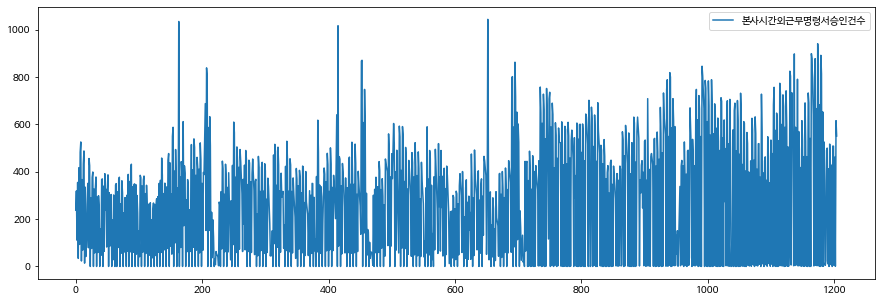
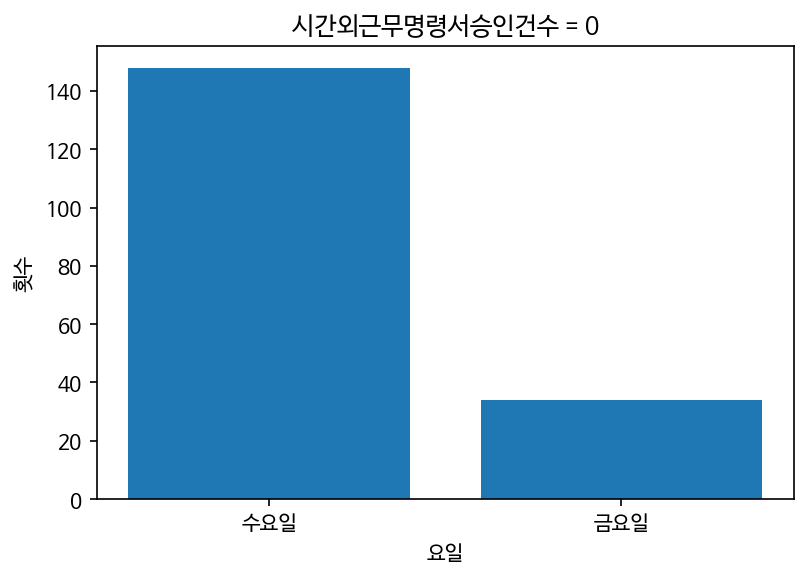
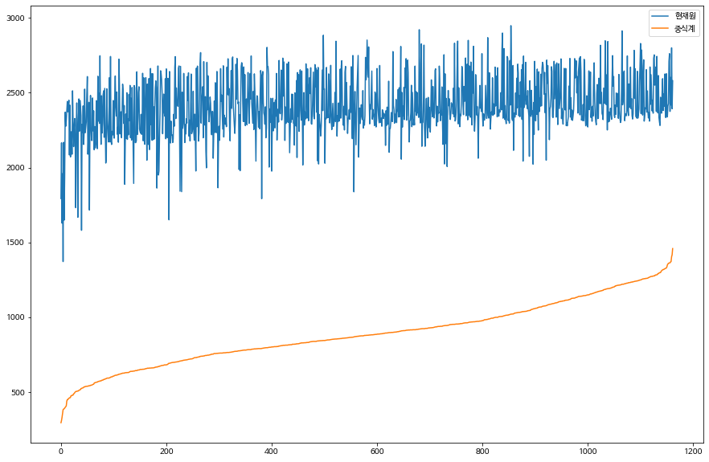

# EDA, 모델 수정 2

## 0.준비

- 한글 폰트 적용
  - 아래 셀 실행 후 런타임 다시 시작, 런타임 모두 실행


```python
!sudo apt-get install -y fonts-nanum
!sudo fc-cache -fv
!rm ~/.cache/matplotlib -rf
```

    Reading package lists... Done
    Building dependency tree       
    Reading state information... Done
    fonts-nanum is already the newest version (20170925-1).
    The following package was automatically installed and is no longer required:
      libnvidia-common-460
    Use 'sudo apt autoremove' to remove it.
    0 upgraded, 0 newly installed, 0 to remove and 62 not upgraded.
    /usr/share/fonts: caching, new cache contents: 0 fonts, 1 dirs
    /usr/share/fonts/truetype: caching, new cache contents: 0 fonts, 3 dirs
    /usr/share/fonts/truetype/humor-sans: caching, new cache contents: 1 fonts, 0 dirs
    /usr/share/fonts/truetype/liberation: caching, new cache contents: 16 fonts, 0 dirs
    /usr/share/fonts/truetype/nanum: caching, new cache contents: 10 fonts, 0 dirs
    /usr/local/share/fonts: caching, new cache contents: 0 fonts, 0 dirs
    /root/.local/share/fonts: skipping, no such directory
    /root/.fonts: skipping, no such directory
    /var/cache/fontconfig: cleaning cache directory
    /root/.cache/fontconfig: not cleaning non-existent cache directory
    /root/.fontconfig: not cleaning non-existent cache directory
    fc-cache: succeeded
    

- 라이브러리


```python
import matplotlib.pyplot as plt
plt.rc('font', family='NanumBarunGothic')

from google.colab import drive
drive.mount('/content/drive')

import pandas as pd
```

    Mounted at /content/drive
    

- 데이터 로드


```python
train = pd.read_csv('/content/drive/MyDrive/구내식당/train.csv')
test = pd.read_csv('/content/drive/MyDrive/구내식당/test.csv')
submission = pd.read_csv('/content/drive/MyDrive/구내식당/sample_submission.csv')
```

- 데이터 전처리
  - train


```python
# 석식 이용 인원 0인 날 삭제
train = train[train['석식계'] != 0]

# 요일 숫자로 변경
train.loc[train['요일'] == '월', '요일'] = 1
train.loc[train['요일'] == '화', '요일'] = 2
train.loc[train['요일'] == '수', '요일'] = 3
train.loc[train['요일'] == '목', '요일'] = 4
train.loc[train['요일'] == '금', '요일'] = 5

# 월 칼럼 추가
def month(text:str):
  return int(text[5:7])
train['월'] = train['일자'].map(month)

# 일 칼럼 추가
def day(text:str):
  return int(text[-2:])
train['일'] = train['일자'].map(day)

train.head()
```

    /usr/local/lib/python3.7/dist-packages/pandas/core/indexing.py:1817: SettingWithCopyWarning: 
    A value is trying to be set on a copy of a slice from a DataFrame.
    Try using .loc[row_indexer,col_indexer] = value instead
    
    See the caveats in the documentation: https://pandas.pydata.org/pandas-docs/stable/user_guide/indexing.html#returning-a-view-versus-a-copy
      self._setitem_single_column(loc, value, pi)
    /usr/local/lib/python3.7/dist-packages/ipykernel_launcher.py:14: SettingWithCopyWarning: 
    A value is trying to be set on a copy of a slice from a DataFrame.
    Try using .loc[row_indexer,col_indexer] = value instead
    
    See the caveats in the documentation: https://pandas.pydata.org/pandas-docs/stable/user_guide/indexing.html#returning-a-view-versus-a-copy
      
    /usr/local/lib/python3.7/dist-packages/ipykernel_launcher.py:19: SettingWithCopyWarning: 
    A value is trying to be set on a copy of a slice from a DataFrame.
    Try using .loc[row_indexer,col_indexer] = value instead
    
    See the caveats in the documentation: https://pandas.pydata.org/pandas-docs/stable/user_guide/indexing.html#returning-a-view-versus-a-copy
    


  <div id="df-789bd7b0-01c4-4859-9f94-06748d5f2217">
    <div class="colab-df-container">
      <div>
<style scoped>
    .dataframe tbody tr th:only-of-type {
        vertical-align: middle;
    }

    .dataframe tbody tr th {
        vertical-align: top;
    }

    .dataframe thead th {
        text-align: right;
    }
</style>
<table border="1" class="dataframe">
  <thead>
    <tr style="text-align: right;">
      <th></th>
      <th>일자</th>
      <th>요일</th>
      <th>본사정원수</th>
      <th>본사휴가자수</th>
      <th>본사출장자수</th>
      <th>본사시간외근무명령서승인건수</th>
      <th>현본사소속재택근무자수</th>
      <th>조식메뉴</th>
      <th>중식메뉴</th>
      <th>석식메뉴</th>
      <th>중식계</th>
      <th>석식계</th>
      <th>월</th>
      <th>일</th>
    </tr>
  </thead>
  <tbody>
    <tr>
      <th>0</th>
      <td>2016-02-01</td>
      <td>1</td>
      <td>2601</td>
      <td>50</td>
      <td>150</td>
      <td>238</td>
      <td>0.0</td>
      <td>모닝롤/찐빵  우유/두유/주스 계란후라이  호두죽/쌀밥 (쌀:국내산) 된장찌개  쥐...</td>
      <td>쌀밥/잡곡밥 (쌀,현미흑미:국내산) 오징어찌개  쇠불고기 (쇠고기:호주산) 계란찜 ...</td>
      <td>쌀밥/잡곡밥 (쌀,현미흑미:국내산) 육개장  자반고등어구이  두부조림  건파래무침 ...</td>
      <td>1039.0</td>
      <td>331.0</td>
      <td>2</td>
      <td>1</td>
    </tr>
    <tr>
      <th>1</th>
      <td>2016-02-02</td>
      <td>2</td>
      <td>2601</td>
      <td>50</td>
      <td>173</td>
      <td>319</td>
      <td>0.0</td>
      <td>모닝롤/단호박샌드  우유/두유/주스 계란후라이  팥죽/쌀밥 (쌀:국내산) 호박젓국찌...</td>
      <td>쌀밥/잡곡밥 (쌀,현미흑미:국내산) 김치찌개  가자미튀김  모둠소세지구이  마늘쫑무...</td>
      <td>콩나물밥*양념장 (쌀,현미흑미:국내산) 어묵국  유산슬 (쇠고기:호주산) 아삭고추무...</td>
      <td>867.0</td>
      <td>560.0</td>
      <td>2</td>
      <td>2</td>
    </tr>
    <tr>
      <th>2</th>
      <td>2016-02-03</td>
      <td>3</td>
      <td>2601</td>
      <td>56</td>
      <td>180</td>
      <td>111</td>
      <td>0.0</td>
      <td>모닝롤/베이글  우유/두유/주스 계란후라이  표고버섯죽/쌀밥 (쌀:국내산) 콩나물국...</td>
      <td>카레덮밥 (쌀,현미흑미:국내산) 팽이장국  치킨핑거 (닭고기:국내산) 쫄면야채무침 ...</td>
      <td>쌀밥/잡곡밥 (쌀,현미흑미:국내산) 청국장찌개  황태양념구이 (황태:러시아산) 고기...</td>
      <td>1017.0</td>
      <td>573.0</td>
      <td>2</td>
      <td>3</td>
    </tr>
    <tr>
      <th>3</th>
      <td>2016-02-04</td>
      <td>4</td>
      <td>2601</td>
      <td>104</td>
      <td>220</td>
      <td>355</td>
      <td>0.0</td>
      <td>모닝롤/토마토샌드  우유/두유/주스 계란후라이  닭죽/쌀밥 (쌀,닭:국내산) 근대국...</td>
      <td>쌀밥/잡곡밥 (쌀,현미흑미:국내산) 쇠고기무국  주꾸미볶음  부추전  시금치나물  ...</td>
      <td>미니김밥*겨자장 (쌀,현미흑미:국내산) 우동  멕시칸샐러드  군고구마  무피클  포...</td>
      <td>978.0</td>
      <td>525.0</td>
      <td>2</td>
      <td>4</td>
    </tr>
    <tr>
      <th>4</th>
      <td>2016-02-05</td>
      <td>5</td>
      <td>2601</td>
      <td>278</td>
      <td>181</td>
      <td>34</td>
      <td>0.0</td>
      <td>모닝롤/와플  우유/두유/주스 계란후라이  쇠고기죽/쌀밥 (쌀:국내산) 재첩국  방...</td>
      <td>쌀밥/잡곡밥 (쌀,현미흑미:국내산) 떡국  돈육씨앗강정 (돼지고기:국내산) 우엉잡채...</td>
      <td>쌀밥/잡곡밥 (쌀,현미흑미:국내산) 차돌박이찌개 (쇠고기:호주산) 닭갈비 (닭고기:...</td>
      <td>925.0</td>
      <td>330.0</td>
      <td>2</td>
      <td>5</td>
    </tr>
  </tbody>
</table>
</div>
      <button class="colab-df-convert" onclick="convertToInteractive('df-789bd7b0-01c4-4859-9f94-06748d5f2217')"
              title="Convert this dataframe to an interactive table."
              style="display:none;">

  <svg xmlns="http://www.w3.org/2000/svg" height="24px"viewBox="0 0 24 24"
       width="24px">
    <path d="M0 0h24v24H0V0z" fill="none"/>
    <path d="M18.56 5.44l.94 2.06.94-2.06 2.06-.94-2.06-.94-.94-2.06-.94 2.06-2.06.94zm-11 1L8.5 8.5l.94-2.06 2.06-.94-2.06-.94L8.5 2.5l-.94 2.06-2.06.94zm10 10l.94 2.06.94-2.06 2.06-.94-2.06-.94-.94-2.06-.94 2.06-2.06.94z"/><path d="M17.41 7.96l-1.37-1.37c-.4-.4-.92-.59-1.43-.59-.52 0-1.04.2-1.43.59L10.3 9.45l-7.72 7.72c-.78.78-.78 2.05 0 2.83L4 21.41c.39.39.9.59 1.41.59.51 0 1.02-.2 1.41-.59l7.78-7.78 2.81-2.81c.8-.78.8-2.07 0-2.86zM5.41 20L4 18.59l7.72-7.72 1.47 1.35L5.41 20z"/>
  </svg>
      </button>

  <style>
    .colab-df-container {
      display:flex;
      flex-wrap:wrap;
      gap: 12px;
    }

    .colab-df-convert {
      background-color: #E8F0FE;
      border: none;
      border-radius: 50%;
      cursor: pointer;
      display: none;
      fill: #1967D2;
      height: 32px;
      padding: 0 0 0 0;
      width: 32px;
    }

    .colab-df-convert:hover {
      background-color: #E2EBFA;
      box-shadow: 0px 1px 2px rgba(60, 64, 67, 0.3), 0px 1px 3px 1px rgba(60, 64, 67, 0.15);
      fill: #174EA6;
    }

    [theme=dark] .colab-df-convert {
      background-color: #3B4455;
      fill: #D2E3FC;
    }

    [theme=dark] .colab-df-convert:hover {
      background-color: #434B5C;
      box-shadow: 0px 1px 3px 1px rgba(0, 0, 0, 0.15);
      filter: drop-shadow(0px 1px 2px rgba(0, 0, 0, 0.3));
      fill: #FFFFFF;
    }
  </style>

      <script>
        const buttonEl =
          document.querySelector('#df-789bd7b0-01c4-4859-9f94-06748d5f2217 button.colab-df-convert');
        buttonEl.style.display =
          google.colab.kernel.accessAllowed ? 'block' : 'none';

        async function convertToInteractive(key) {
          const element = document.querySelector('#df-789bd7b0-01c4-4859-9f94-06748d5f2217');
          const dataTable =
            await google.colab.kernel.invokeFunction('convertToInteractive',
                                                     [key], {});
          if (!dataTable) return;

          const docLinkHtml = 'Like what you see? Visit the ' +
            '<a target="_blank" href=https://colab.research.google.com/notebooks/data_table.ipynb>data table notebook</a>'
            + ' to learn more about interactive tables.';
          element.innerHTML = '';
          dataTable['output_type'] = 'display_data';
          await google.colab.output.renderOutput(dataTable, element);
          const docLink = document.createElement('div');
          docLink.innerHTML = docLinkHtml;
          element.appendChild(docLink);
        }
      </script>
    </div>
  </div>


- 데이터 전처리
  - test


```python
# 요일 숫자로 변경
test.loc[test['요일'] == '월', '요일'] = 1
test.loc[test['요일'] == '화', '요일'] = 2
test.loc[test['요일'] == '수', '요일'] = 3
test.loc[test['요일'] == '목', '요일'] = 4
test.loc[test['요일'] == '금', '요일'] = 5

# 월 칼럼 추가
test['월'] = test['일자'].map(month)

# 일 칼럼 추가
test['일'] = test['일자'].map(day)

test.head()
```


  <div id="df-d98c3c42-ba5b-4e75-8e86-74fa4b21a8ad">
    <div class="colab-df-container">
      <div>
<style scoped>
    .dataframe tbody tr th:only-of-type {
        vertical-align: middle;
    }

    .dataframe tbody tr th {
        vertical-align: top;
    }

    .dataframe thead th {
        text-align: right;
    }
</style>
<table border="1" class="dataframe">
  <thead>
    <tr style="text-align: right;">
      <th></th>
      <th>일자</th>
      <th>요일</th>
      <th>본사정원수</th>
      <th>본사휴가자수</th>
      <th>본사출장자수</th>
      <th>본사시간외근무명령서승인건수</th>
      <th>현본사소속재택근무자수</th>
      <th>조식메뉴</th>
      <th>중식메뉴</th>
      <th>석식메뉴</th>
      <th>월</th>
      <th>일</th>
    </tr>
  </thead>
  <tbody>
    <tr>
      <th>0</th>
      <td>2021-01-27</td>
      <td>3</td>
      <td>2983</td>
      <td>88</td>
      <td>182</td>
      <td>5</td>
      <td>358.0</td>
      <td>모닝롤/연유버터베이글 우유/주스 계란후라이/찐계란 단호박죽/흑미밥 우거지국 고기완자...</td>
      <td>쌀밥/흑미밥/찰현미밥 대구지리 매운돈갈비찜 오꼬노미계란말이 상추무침 포기김치 양상추...</td>
      <td>흑미밥 얼큰순두부찌개 쇠고기우엉볶음 버섯햄볶음 (New)아삭이고추무절임 포기김치</td>
      <td>1</td>
      <td>27</td>
    </tr>
    <tr>
      <th>1</th>
      <td>2021-01-28</td>
      <td>4</td>
      <td>2983</td>
      <td>104</td>
      <td>212</td>
      <td>409</td>
      <td>348.0</td>
      <td>모닝롤/대만샌드위치 우유/주스 계란후라이/찐계란 누룽지탕/흑미밥 황태국 시래기지짐 ...</td>
      <td>쌀밥/보리밥/찰현미밥 우렁된장찌개 오리주물럭 청양부추전 수제삼색무쌈 겉절이김치 양상...</td>
      <td>충무김밥 우동국물 오징어무침 꽃맛살샐러드 얼갈이쌈장무침 석박지</td>
      <td>1</td>
      <td>28</td>
    </tr>
    <tr>
      <th>2</th>
      <td>2021-01-29</td>
      <td>5</td>
      <td>2983</td>
      <td>270</td>
      <td>249</td>
      <td>0</td>
      <td>294.0</td>
      <td>모닝롤/핫케익 우유/주스 계란후라이/찐계란 오곡죽/흑미밥 매생이굴국 고구마순볶음 양...</td>
      <td>쌀밥/흑미밥/찰현미밥 팽이장국 수제돈까스*소스 가자미조림 동초나물무침 포기김치 양상...</td>
      <td>흑미밥 물만둣국 카레찜닭 숯불양념꼬지어묵 꼬시래기무침 포기김치</td>
      <td>1</td>
      <td>29</td>
    </tr>
    <tr>
      <th>3</th>
      <td>2021-02-01</td>
      <td>1</td>
      <td>2924</td>
      <td>108</td>
      <td>154</td>
      <td>538</td>
      <td>322.0</td>
      <td>모닝롤/촉촉한치즈케익 우유/주스 계란후라이/찐계란 누룽지탕/흑미밥 두부김칫국 새우완...</td>
      <td>쌀밥/흑미밥/찰현미밥 배추들깨국 오리대패불고기 시금치프리타타 부추고추장무침 포기김치...</td>
      <td>흑미밥 동태탕 돈육꽈리고추장조림 당면채소무침 모자반무침 포기김치</td>
      <td>2</td>
      <td>1</td>
    </tr>
    <tr>
      <th>4</th>
      <td>2021-02-02</td>
      <td>2</td>
      <td>2924</td>
      <td>62</td>
      <td>186</td>
      <td>455</td>
      <td>314.0</td>
      <td>모닝롤/토마토샌드 우유/주스 계란후라이/찐계란 채소죽/흑미밥 호박맑은국 오이생채 양...</td>
      <td>쌀밥/팥밥/찰현미밥 부대찌개 닭살데리야끼조림 버섯탕수 세발나물무침 알타리김치/사과푸...</td>
      <td>흑미밥 바지락살국 쇠고기청경채볶음 두부구이*볶은김치 머위된장무침 백김치</td>
      <td>2</td>
      <td>2</td>
    </tr>
  </tbody>
</table>
</div>
      <button class="colab-df-convert" onclick="convertToInteractive('df-d98c3c42-ba5b-4e75-8e86-74fa4b21a8ad')"
              title="Convert this dataframe to an interactive table."
              style="display:none;">

  <svg xmlns="http://www.w3.org/2000/svg" height="24px"viewBox="0 0 24 24"
       width="24px">
    <path d="M0 0h24v24H0V0z" fill="none"/>
    <path d="M18.56 5.44l.94 2.06.94-2.06 2.06-.94-2.06-.94-.94-2.06-.94 2.06-2.06.94zm-11 1L8.5 8.5l.94-2.06 2.06-.94-2.06-.94L8.5 2.5l-.94 2.06-2.06.94zm10 10l.94 2.06.94-2.06 2.06-.94-2.06-.94-.94-2.06-.94 2.06-2.06.94z"/><path d="M17.41 7.96l-1.37-1.37c-.4-.4-.92-.59-1.43-.59-.52 0-1.04.2-1.43.59L10.3 9.45l-7.72 7.72c-.78.78-.78 2.05 0 2.83L4 21.41c.39.39.9.59 1.41.59.51 0 1.02-.2 1.41-.59l7.78-7.78 2.81-2.81c.8-.78.8-2.07 0-2.86zM5.41 20L4 18.59l7.72-7.72 1.47 1.35L5.41 20z"/>
  </svg>
      </button>

  <style>
    .colab-df-container {
      display:flex;
      flex-wrap:wrap;
      gap: 12px;
    }

    .colab-df-convert {
      background-color: #E8F0FE;
      border: none;
      border-radius: 50%;
      cursor: pointer;
      display: none;
      fill: #1967D2;
      height: 32px;
      padding: 0 0 0 0;
      width: 32px;
    }

    .colab-df-convert:hover {
      background-color: #E2EBFA;
      box-shadow: 0px 1px 2px rgba(60, 64, 67, 0.3), 0px 1px 3px 1px rgba(60, 64, 67, 0.15);
      fill: #174EA6;
    }

    [theme=dark] .colab-df-convert {
      background-color: #3B4455;
      fill: #D2E3FC;
    }

    [theme=dark] .colab-df-convert:hover {
      background-color: #434B5C;
      box-shadow: 0px 1px 3px 1px rgba(0, 0, 0, 0.15);
      filter: drop-shadow(0px 1px 2px rgba(0, 0, 0, 0.3));
      fill: #FFFFFF;
    }
  </style>

      <script>
        const buttonEl =
          document.querySelector('#df-d98c3c42-ba5b-4e75-8e86-74fa4b21a8ad button.colab-df-convert');
        buttonEl.style.display =
          google.colab.kernel.accessAllowed ? 'block' : 'none';

        async function convertToInteractive(key) {
          const element = document.querySelector('#df-d98c3c42-ba5b-4e75-8e86-74fa4b21a8ad');
          const dataTable =
            await google.colab.kernel.invokeFunction('convertToInteractive',
                                                     [key], {});
          if (!dataTable) return;

          const docLinkHtml = 'Like what you see? Visit the ' +
            '<a target="_blank" href=https://colab.research.google.com/notebooks/data_table.ipynb>data table notebook</a>'
            + ' to learn more about interactive tables.';
          element.innerHTML = '';
          dataTable['output_type'] = 'display_data';
          await google.colab.output.renderOutput(dataTable, element);
          const docLink = document.createElement('div');
          docLink.innerHTML = docLinkHtml;
          element.appendChild(docLink);
        }
      </script>
    </div>
  </div>


## 1.EDA

### 1) feature를 주인공으로

- 본사정원수는 지속적으로 우상향
- 휴가자수는 연휴 전후로 급등
- 출장자수는 특이 패턴 없음
- 시간외근무승인건수, 야근하는 사람 수 특이 패턴 있음
- 재택근무자수 특정일 기준 발생


```python
train[['본사정원수']].plot(figsize=(15,5))
plt.show()

train[['본사휴가자수']].plot(figsize=(15,5))
plt.show()

train[['본사출장자수']].plot(figsize=(15,5))
plt.show()

train[['본사시간외근무명령서승인건수']].plot(figsize=(15,5))
plt.show()

train[['현본사소속재택근무자수']].plot(figsize=(15,5))
plt.show()
```


    

    


    

    


    

    


    

    


    

    


#### a) 재택근무 발생 원인

- 코로나의 영향


```python
train[train['현본사소속재택근무자수'] > 100]
```


  <div id="df-eb83b017-56fb-44f7-a40a-2161f6591263">
    <div class="colab-df-container">
      <div>
<style scoped>
    .dataframe tbody tr th:only-of-type {
        vertical-align: middle;
    }

    .dataframe tbody tr th {
        vertical-align: top;
    }

    .dataframe thead th {
        text-align: right;
    }
</style>
<table border="1" class="dataframe">
  <thead>
    <tr style="text-align: right;">
      <th></th>
      <th>일자</th>
      <th>요일</th>
      <th>본사정원수</th>
      <th>본사휴가자수</th>
      <th>본사출장자수</th>
      <th>본사시간외근무명령서승인건수</th>
      <th>현본사소속재택근무자수</th>
      <th>조식메뉴</th>
      <th>중식메뉴</th>
      <th>석식메뉴</th>
      <th>중식계</th>
      <th>석식계</th>
      <th>월</th>
      <th>일</th>
    </tr>
  </thead>
  <tbody>
    <tr>
      <th>1010</th>
      <td>2020-03-20</td>
      <td>5</td>
      <td>2950</td>
      <td>176</td>
      <td>263</td>
      <td>3</td>
      <td>135.0</td>
      <td>모닝롤/허니브레드  우유/주스 계란후라이 야채죽/쌀밥 (쌀:국내산) 꽃게탕 (오징어...</td>
      <td>쌀밥/잡곡밥 (쌀,현미,흑미:국내산) 갈비탕 (갈비:호주산) 칠리새우  감자채볶음 ...</td>
      <td>쌀밥/잡곡밥 (쌀,현미,흑미:국내산) 건새우아욱국  치즈함박스테이크 (돈육:국내,수...</td>
      <td>627.0</td>
      <td>358.0</td>
      <td>3</td>
      <td>20</td>
    </tr>
    <tr>
      <th>1011</th>
      <td>2020-03-23</td>
      <td>1</td>
      <td>2950</td>
      <td>109</td>
      <td>178</td>
      <td>687</td>
      <td>285.0</td>
      <td>모닝롤/베이글  우유/주스 계란후라이 누룽지탕/쌀밥 (쌀:국내산) 감자국  꽈리고추...</td>
      <td>쌀밥/잡곡밥 (쌀,현미,흑미:국내산) 시래기국  오리양념불고기*쌈무 (오리:국내산)...</td>
      <td>쌀밥/잡곡밥 (쌀,현미,흑미:국내산) 닭개장 (닭:국내산) 삼치튀김*데리야끼  한식...</td>
      <td>1110.0</td>
      <td>651.0</td>
      <td>3</td>
      <td>23</td>
    </tr>
    <tr>
      <th>1012</th>
      <td>2020-03-24</td>
      <td>2</td>
      <td>2950</td>
      <td>131</td>
      <td>137</td>
      <td>639</td>
      <td>303.0</td>
      <td>모닝롤/햄치즈샌드  우유/주스 계란후라이 잣죽/쌀밥 (쌀:국내산) 쑥국  수제어묵볶...</td>
      <td>쌀밥/잡곡밥 (쌀,현미,흑미:국내산) 소고기미역국 (소고기:호주산) 해물누룽지탕 (...</td>
      <td>오므라이스 (쌀:국내산) 가쯔오장국  돈육고구마강정 (돈육:국내산) 과일플레인샐러드...</td>
      <td>1083.0</td>
      <td>754.0</td>
      <td>3</td>
      <td>24</td>
    </tr>
    <tr>
      <th>1013</th>
      <td>2020-03-25</td>
      <td>3</td>
      <td>2950</td>
      <td>122</td>
      <td>146</td>
      <td>1</td>
      <td>303.0</td>
      <td>모닝롤/고구마파이  우유/주스 계란후라이 누룽지탕/쌀밥 (쌀:국내산) 피홍합탕  감...</td>
      <td>쌀밥/잡곡밥 (쌀,현미,흑미:국내산) 유부주머니국  목살스테이크 (목살:국내산) 파...</td>
      <td>찹쌀밥  장각닭죽  생야채*쌈짱  오렌지  하루야채주스  포기김치</td>
      <td>1022.0</td>
      <td>526.0</td>
      <td>3</td>
      <td>25</td>
    </tr>
    <tr>
      <th>1014</th>
      <td>2020-03-26</td>
      <td>4</td>
      <td>2950</td>
      <td>133</td>
      <td>133</td>
      <td>584</td>
      <td>288.0</td>
      <td>모닝롤/바나나샌드  우유/주스 계란후라이 새송이죽/쌀밥 (쌀:국내산) 버섯매운탕 (...</td>
      <td>쌀밥/잡곡밥 (쌀,현미,흑미:국내산) 배추된장국  제육볶음 (돈육:국내산) 계란찜 ...</td>
      <td>멸치주먹밥 (쌀,현미흑미:국내산) 우동  해물까스*와사비소스  꽃맛살샐러드  무피클...</td>
      <td>955.0</td>
      <td>645.0</td>
      <td>3</td>
      <td>26</td>
    </tr>
    <tr>
      <th>...</th>
      <td>...</td>
      <td>...</td>
      <td>...</td>
      <td>...</td>
      <td>...</td>
      <td>...</td>
      <td>...</td>
      <td>...</td>
      <td>...</td>
      <td>...</td>
      <td>...</td>
      <td>...</td>
      <td>...</td>
      <td>...</td>
    </tr>
    <tr>
      <th>1200</th>
      <td>2021-01-20</td>
      <td>3</td>
      <td>2983</td>
      <td>75</td>
      <td>198</td>
      <td>4</td>
      <td>391.0</td>
      <td>모닝롤/페퍼로니피자 우유/주스 계란후라이/찐계란 크루통크림스프/흑미밥 아귀지리 마늘...</td>
      <td>쌀밥/흑미밥/찰현미밥 아욱국 수제함박스테이크 견과류마카로니범벅 생깻잎지 단호박물김치...</td>
      <td>김치볶음밥 미니쫄우동*맛살튀김 브로콜리깨소스무침 계란후라이 고들빼기무침 겉절이김치</td>
      <td>1093.0</td>
      <td>421.0</td>
      <td>1</td>
      <td>20</td>
    </tr>
    <tr>
      <th>1201</th>
      <td>2021-01-21</td>
      <td>4</td>
      <td>2983</td>
      <td>92</td>
      <td>231</td>
      <td>462</td>
      <td>351.0</td>
      <td>모닝롤/생크림단팥빵 우유/주스 계란후라이/찐계란 누룽지탕/흑미밥 떡국 해물땡굴소스볶...</td>
      <td>쌀밥/수수밥/찰현미밥 냉이된장국 동파육 봄동전 청경채/버섯숙회*초장 무생채 양상추샐...</td>
      <td>흑미밥 쇠고기무국 삼치양념구이 비엔나채소볶음 숙주나물당근무침 포기김치</td>
      <td>832.0</td>
      <td>353.0</td>
      <td>1</td>
      <td>21</td>
    </tr>
    <tr>
      <th>1202</th>
      <td>2021-01-22</td>
      <td>5</td>
      <td>2983</td>
      <td>255</td>
      <td>248</td>
      <td>1</td>
      <td>303.0</td>
      <td>모닝롤/BLT샌드위치 우유/주스 계란후라이/찐계란 흑임자죽/흑미밥 바지락살국 두부조...</td>
      <td>전주비빔밥*약고추장 계란파국 요거닭 올방개묵무침 파프리카해초무침 포기김치 양상추샐러...</td>
      <td>흑미밥 수제비국 수제맛쵸킹탕수육 유부채소겨자냉채 참나물무침 갓김치/겉절이김치</td>
      <td>579.0</td>
      <td>217.0</td>
      <td>1</td>
      <td>22</td>
    </tr>
    <tr>
      <th>1203</th>
      <td>2021-01-25</td>
      <td>1</td>
      <td>2983</td>
      <td>107</td>
      <td>153</td>
      <td>616</td>
      <td>327.0</td>
      <td>모닝롤/호박고구마오븐구이 우유/주스 계란후라이/찐계란 누룽지탕/흑미밥 감자양파국 분...</td>
      <td>쌀밥/흑미밥/찰현미밥 전주식콩나물해장국 돈육간장불고기 깐풍연근 연두부*달래양념장 봄...</td>
      <td>흑미밥 열무된장국 장어강정*데리야끼소스 깻잎쌈*생강채 오이선 포기김치</td>
      <td>1145.0</td>
      <td>502.0</td>
      <td>1</td>
      <td>25</td>
    </tr>
    <tr>
      <th>1204</th>
      <td>2021-01-26</td>
      <td>2</td>
      <td>2983</td>
      <td>69</td>
      <td>183</td>
      <td>551</td>
      <td>362.0</td>
      <td>모닝롤/야채샌드 우유/주스 계란후라이/찐계란 참치죽/흑미밥 홍합탕 애호박새우젓볶음 ...</td>
      <td>쌀밥/귀리밥/찰현미밥 들깨미역국 교촌간장치킨 옥수수콘치즈구이 가지고추장무침 포기김치...</td>
      <td>(New)할라피뇨멸치주먹밥 잔치국수 수제고기육전 쑥갓나물 양파초절임 깍두기</td>
      <td>1015.0</td>
      <td>480.0</td>
      <td>1</td>
      <td>26</td>
    </tr>
  </tbody>
</table>
<p>193 rows × 14 columns</p>
</div>
      <button class="colab-df-convert" onclick="convertToInteractive('df-eb83b017-56fb-44f7-a40a-2161f6591263')"
              title="Convert this dataframe to an interactive table."
              style="display:none;">

  <svg xmlns="http://www.w3.org/2000/svg" height="24px"viewBox="0 0 24 24"
       width="24px">
    <path d="M0 0h24v24H0V0z" fill="none"/>
    <path d="M18.56 5.44l.94 2.06.94-2.06 2.06-.94-2.06-.94-.94-2.06-.94 2.06-2.06.94zm-11 1L8.5 8.5l.94-2.06 2.06-.94-2.06-.94L8.5 2.5l-.94 2.06-2.06.94zm10 10l.94 2.06.94-2.06 2.06-.94-2.06-.94-.94-2.06-.94 2.06-2.06.94z"/><path d="M17.41 7.96l-1.37-1.37c-.4-.4-.92-.59-1.43-.59-.52 0-1.04.2-1.43.59L10.3 9.45l-7.72 7.72c-.78.78-.78 2.05 0 2.83L4 21.41c.39.39.9.59 1.41.59.51 0 1.02-.2 1.41-.59l7.78-7.78 2.81-2.81c.8-.78.8-2.07 0-2.86zM5.41 20L4 18.59l7.72-7.72 1.47 1.35L5.41 20z"/>
  </svg>
      </button>

  <style>
    .colab-df-container {
      display:flex;
      flex-wrap:wrap;
      gap: 12px;
    }

    .colab-df-convert {
      background-color: #E8F0FE;
      border: none;
      border-radius: 50%;
      cursor: pointer;
      display: none;
      fill: #1967D2;
      height: 32px;
      padding: 0 0 0 0;
      width: 32px;
    }

    .colab-df-convert:hover {
      background-color: #E2EBFA;
      box-shadow: 0px 1px 2px rgba(60, 64, 67, 0.3), 0px 1px 3px 1px rgba(60, 64, 67, 0.15);
      fill: #174EA6;
    }

    [theme=dark] .colab-df-convert {
      background-color: #3B4455;
      fill: #D2E3FC;
    }

    [theme=dark] .colab-df-convert:hover {
      background-color: #434B5C;
      box-shadow: 0px 1px 3px 1px rgba(0, 0, 0, 0.15);
      filter: drop-shadow(0px 1px 2px rgba(0, 0, 0, 0.3));
      fill: #FFFFFF;
    }
  </style>

      <script>
        const buttonEl =
          document.querySelector('#df-eb83b017-56fb-44f7-a40a-2161f6591263 button.colab-df-convert');
        buttonEl.style.display =
          google.colab.kernel.accessAllowed ? 'block' : 'none';

        async function convertToInteractive(key) {
          const element = document.querySelector('#df-eb83b017-56fb-44f7-a40a-2161f6591263');
          const dataTable =
            await google.colab.kernel.invokeFunction('convertToInteractive',
                                                     [key], {});
          if (!dataTable) return;

          const docLinkHtml = 'Like what you see? Visit the ' +
            '<a target="_blank" href=https://colab.research.google.com/notebooks/data_table.ipynb>data table notebook</a>'
            + ' to learn more about interactive tables.';
          element.innerHTML = '';
          dataTable['output_type'] = 'display_data';
          await google.colab.output.renderOutput(dataTable, element);
          const docLink = document.createElement('div');
          docLink.innerHTML = docLinkHtml;
          element.appendChild(docLink);
        }
      </script>
    </div>
  </div>


#### b) 본사 시간 외 근무 이상치 발생 원인

- 수요일과 금요일에 일종의 야근 없는 날 존재


```python
train[train['본사시간외근무명령서승인건수'] == 0]['요일'].value_counts()
```


    3    148
    5     34
    Name: 요일, dtype: int64


```python
x = ['수요일', '금요일']
y = train[train['본사시간외근무명령서승인건수'] == 0].value_counts('요일').values

plt.figure(dpi=150)

plt.title("시간외근무명령서승인건수 = 0")
plt.xlabel('요일')
plt.ylabel('횟수')

plt.bar(x, y)
plt.show()
```


    

    


### 2) feature와 target의 상관관계

#### a) 중식계와 feature의 상관관계


```python
train.sort_values(by='중식계')[['본사정원수',	'본사휴가자수',	'본사출장자수',	'본사시간외근무명령서승인건수',	'현본사소속재택근무자수', '중식계']].reset_index(drop=True).plot(figsize=(15,10))
plt.show()
```


    

    


- 출장자수


```python
train.sort_values(by='중식계')[['본사출장자수', '중식계']].reset_index(drop=True).plot(figsize=(15,10))
plt.show()
```


    

    


- 휴가자수


```python
train.sort_values(by='중식계')[['본사휴가자수', '중식계']].reset_index(drop=True).plot(figsize=(15,10))
plt.show()
```


    

    


- 현재원

  본사정원수 - 휴가자수 - 출장자수


```python
train['현재원'] = train['본사정원수'] - train['본사휴가자수'] - train['본사출장자수']
train.sort_values(by='중식계')[['현재원', '중식계']].reset_index(drop=True).plot(figsize=(15,10))
plt.show()
```


    

    


#### b) 석식계와 feature의 상관관계


```python
train.sort_values(by='석식계')[['본사정원수',	'본사휴가자수',	'본사출장자수',	'본사시간외근무명령서승인건수',	'현본사소속재택근무자수', '석식계'	]].reset_index(drop=True).plot(figsize=(15,10))
plt.show()
```


    

    


- 시간외근무


```python
train.sort_values(by='석식계')[['본사시간외근무명령서승인건수', '석식계']].reset_index(drop=True).plot(figsize=(15,10))
```


    <matplotlib.axes._subplots.AxesSubplot at 0x7f4926c3f950>


    

    


#### c) 중식계와 석식계의 상관관계


```python
train.sort_values(by='석식계')[['중식계', '석식계']].reset_index(drop=True).plot(figsize=(15,10))
```


    <matplotlib.axes._subplots.AxesSubplot at 0x7f4926734090>


    

    


### 3) EDA, 인사이트 정리
PPT

## 2.EDA를 통해 도출한 인사이트

- 본사정원수는 Target과 관계가 없다.

- 본사정원수는 현재원으로 활용 가능하다.

- 중식계는 휴가자수와 출장자수와 관계가 있다.

- 석식계는 시간외근무자수와 관계가 있다.

- 중식계와 석식계는 상관관계가 있다.

### 1) 본사정원수는 target과 관계가 없다


```python
train.sort_values(by='중식계')[['본사정원수', '중식계']].reset_index(drop=True).plot(figsize=(15,10))
plt.show()
```


    

    


### 2) 본사정원수는 현재원으로 활용 가능


```python
train['현재원'] = train['본사정원수'] - train['본사휴가자수'] - train['본사출장자수'] - train['현본사소속재택근무자수']
train.sort_values(by='중식계')[['현재원', '중식계']].reset_index(drop=True).plot(figsize=(15,10))
plt.show()
```


    

    


### 3) 중식계와 석식계는 상관관계가 있다


```python
train.sort_values(by='석식계')[['중식계', '석식계']].reset_index(drop=True).plot(figsize=(15,10))
```


    <matplotlib.axes._subplots.AxesSubplot at 0x7f4924eb8890>


    

    


## 3.인사이트를 바탕으로 모델 수정


```python
train
```


  <div id="df-36ed0ddc-8242-49a5-9a76-d13fe6783e1b">
    <div class="colab-df-container">
      <div>
<style scoped>
    .dataframe tbody tr th:only-of-type {
        vertical-align: middle;
    }

    .dataframe tbody tr th {
        vertical-align: top;
    }

    .dataframe thead th {
        text-align: right;
    }
</style>
<table border="1" class="dataframe">
  <thead>
    <tr style="text-align: right;">
      <th></th>
      <th>일자</th>
      <th>요일</th>
      <th>본사정원수</th>
      <th>본사휴가자수</th>
      <th>본사출장자수</th>
      <th>본사시간외근무명령서승인건수</th>
      <th>현본사소속재택근무자수</th>
      <th>조식메뉴</th>
      <th>중식메뉴</th>
      <th>석식메뉴</th>
      <th>중식계</th>
      <th>석식계</th>
      <th>월</th>
      <th>일</th>
      <th>현재원</th>
    </tr>
  </thead>
  <tbody>
    <tr>
      <th>0</th>
      <td>2016-02-01</td>
      <td>1</td>
      <td>2601</td>
      <td>50</td>
      <td>150</td>
      <td>238</td>
      <td>0.0</td>
      <td>모닝롤/찐빵  우유/두유/주스 계란후라이  호두죽/쌀밥 (쌀:국내산) 된장찌개  쥐...</td>
      <td>쌀밥/잡곡밥 (쌀,현미흑미:국내산) 오징어찌개  쇠불고기 (쇠고기:호주산) 계란찜 ...</td>
      <td>쌀밥/잡곡밥 (쌀,현미흑미:국내산) 육개장  자반고등어구이  두부조림  건파래무침 ...</td>
      <td>1039.0</td>
      <td>331.0</td>
      <td>2</td>
      <td>1</td>
      <td>2401.0</td>
    </tr>
    <tr>
      <th>1</th>
      <td>2016-02-02</td>
      <td>2</td>
      <td>2601</td>
      <td>50</td>
      <td>173</td>
      <td>319</td>
      <td>0.0</td>
      <td>모닝롤/단호박샌드  우유/두유/주스 계란후라이  팥죽/쌀밥 (쌀:국내산) 호박젓국찌...</td>
      <td>쌀밥/잡곡밥 (쌀,현미흑미:국내산) 김치찌개  가자미튀김  모둠소세지구이  마늘쫑무...</td>
      <td>콩나물밥*양념장 (쌀,현미흑미:국내산) 어묵국  유산슬 (쇠고기:호주산) 아삭고추무...</td>
      <td>867.0</td>
      <td>560.0</td>
      <td>2</td>
      <td>2</td>
      <td>2378.0</td>
    </tr>
    <tr>
      <th>2</th>
      <td>2016-02-03</td>
      <td>3</td>
      <td>2601</td>
      <td>56</td>
      <td>180</td>
      <td>111</td>
      <td>0.0</td>
      <td>모닝롤/베이글  우유/두유/주스 계란후라이  표고버섯죽/쌀밥 (쌀:국내산) 콩나물국...</td>
      <td>카레덮밥 (쌀,현미흑미:국내산) 팽이장국  치킨핑거 (닭고기:국내산) 쫄면야채무침 ...</td>
      <td>쌀밥/잡곡밥 (쌀,현미흑미:국내산) 청국장찌개  황태양념구이 (황태:러시아산) 고기...</td>
      <td>1017.0</td>
      <td>573.0</td>
      <td>2</td>
      <td>3</td>
      <td>2365.0</td>
    </tr>
    <tr>
      <th>3</th>
      <td>2016-02-04</td>
      <td>4</td>
      <td>2601</td>
      <td>104</td>
      <td>220</td>
      <td>355</td>
      <td>0.0</td>
      <td>모닝롤/토마토샌드  우유/두유/주스 계란후라이  닭죽/쌀밥 (쌀,닭:국내산) 근대국...</td>
      <td>쌀밥/잡곡밥 (쌀,현미흑미:국내산) 쇠고기무국  주꾸미볶음  부추전  시금치나물  ...</td>
      <td>미니김밥*겨자장 (쌀,현미흑미:국내산) 우동  멕시칸샐러드  군고구마  무피클  포...</td>
      <td>978.0</td>
      <td>525.0</td>
      <td>2</td>
      <td>4</td>
      <td>2277.0</td>
    </tr>
    <tr>
      <th>4</th>
      <td>2016-02-05</td>
      <td>5</td>
      <td>2601</td>
      <td>278</td>
      <td>181</td>
      <td>34</td>
      <td>0.0</td>
      <td>모닝롤/와플  우유/두유/주스 계란후라이  쇠고기죽/쌀밥 (쌀:국내산) 재첩국  방...</td>
      <td>쌀밥/잡곡밥 (쌀,현미흑미:국내산) 떡국  돈육씨앗강정 (돼지고기:국내산) 우엉잡채...</td>
      <td>쌀밥/잡곡밥 (쌀,현미흑미:국내산) 차돌박이찌개 (쇠고기:호주산) 닭갈비 (닭고기:...</td>
      <td>925.0</td>
      <td>330.0</td>
      <td>2</td>
      <td>5</td>
      <td>2142.0</td>
    </tr>
    <tr>
      <th>...</th>
      <td>...</td>
      <td>...</td>
      <td>...</td>
      <td>...</td>
      <td>...</td>
      <td>...</td>
      <td>...</td>
      <td>...</td>
      <td>...</td>
      <td>...</td>
      <td>...</td>
      <td>...</td>
      <td>...</td>
      <td>...</td>
      <td>...</td>
    </tr>
    <tr>
      <th>1200</th>
      <td>2021-01-20</td>
      <td>3</td>
      <td>2983</td>
      <td>75</td>
      <td>198</td>
      <td>4</td>
      <td>391.0</td>
      <td>모닝롤/페퍼로니피자 우유/주스 계란후라이/찐계란 크루통크림스프/흑미밥 아귀지리 마늘...</td>
      <td>쌀밥/흑미밥/찰현미밥 아욱국 수제함박스테이크 견과류마카로니범벅 생깻잎지 단호박물김치...</td>
      <td>김치볶음밥 미니쫄우동*맛살튀김 브로콜리깨소스무침 계란후라이 고들빼기무침 겉절이김치</td>
      <td>1093.0</td>
      <td>421.0</td>
      <td>1</td>
      <td>20</td>
      <td>2319.0</td>
    </tr>
    <tr>
      <th>1201</th>
      <td>2021-01-21</td>
      <td>4</td>
      <td>2983</td>
      <td>92</td>
      <td>231</td>
      <td>462</td>
      <td>351.0</td>
      <td>모닝롤/생크림단팥빵 우유/주스 계란후라이/찐계란 누룽지탕/흑미밥 떡국 해물땡굴소스볶...</td>
      <td>쌀밥/수수밥/찰현미밥 냉이된장국 동파육 봄동전 청경채/버섯숙회*초장 무생채 양상추샐...</td>
      <td>흑미밥 쇠고기무국 삼치양념구이 비엔나채소볶음 숙주나물당근무침 포기김치</td>
      <td>832.0</td>
      <td>353.0</td>
      <td>1</td>
      <td>21</td>
      <td>2309.0</td>
    </tr>
    <tr>
      <th>1202</th>
      <td>2021-01-22</td>
      <td>5</td>
      <td>2983</td>
      <td>255</td>
      <td>248</td>
      <td>1</td>
      <td>303.0</td>
      <td>모닝롤/BLT샌드위치 우유/주스 계란후라이/찐계란 흑임자죽/흑미밥 바지락살국 두부조...</td>
      <td>전주비빔밥*약고추장 계란파국 요거닭 올방개묵무침 파프리카해초무침 포기김치 양상추샐러...</td>
      <td>흑미밥 수제비국 수제맛쵸킹탕수육 유부채소겨자냉채 참나물무침 갓김치/겉절이김치</td>
      <td>579.0</td>
      <td>217.0</td>
      <td>1</td>
      <td>22</td>
      <td>2177.0</td>
    </tr>
    <tr>
      <th>1203</th>
      <td>2021-01-25</td>
      <td>1</td>
      <td>2983</td>
      <td>107</td>
      <td>153</td>
      <td>616</td>
      <td>327.0</td>
      <td>모닝롤/호박고구마오븐구이 우유/주스 계란후라이/찐계란 누룽지탕/흑미밥 감자양파국 분...</td>
      <td>쌀밥/흑미밥/찰현미밥 전주식콩나물해장국 돈육간장불고기 깐풍연근 연두부*달래양념장 봄...</td>
      <td>흑미밥 열무된장국 장어강정*데리야끼소스 깻잎쌈*생강채 오이선 포기김치</td>
      <td>1145.0</td>
      <td>502.0</td>
      <td>1</td>
      <td>25</td>
      <td>2396.0</td>
    </tr>
    <tr>
      <th>1204</th>
      <td>2021-01-26</td>
      <td>2</td>
      <td>2983</td>
      <td>69</td>
      <td>183</td>
      <td>551</td>
      <td>362.0</td>
      <td>모닝롤/야채샌드 우유/주스 계란후라이/찐계란 참치죽/흑미밥 홍합탕 애호박새우젓볶음 ...</td>
      <td>쌀밥/귀리밥/찰현미밥 들깨미역국 교촌간장치킨 옥수수콘치즈구이 가지고추장무침 포기김치...</td>
      <td>(New)할라피뇨멸치주먹밥 잔치국수 수제고기육전 쑥갓나물 양파초절임 깍두기</td>
      <td>1015.0</td>
      <td>480.0</td>
      <td>1</td>
      <td>26</td>
      <td>2369.0</td>
    </tr>
  </tbody>
</table>
<p>1162 rows × 15 columns</p>
</div>
      <button class="colab-df-convert" onclick="convertToInteractive('df-36ed0ddc-8242-49a5-9a76-d13fe6783e1b')"
              title="Convert this dataframe to an interactive table."
              style="display:none;">

  <svg xmlns="http://www.w3.org/2000/svg" height="24px"viewBox="0 0 24 24"
       width="24px">
    <path d="M0 0h24v24H0V0z" fill="none"/>
    <path d="M18.56 5.44l.94 2.06.94-2.06 2.06-.94-2.06-.94-.94-2.06-.94 2.06-2.06.94zm-11 1L8.5 8.5l.94-2.06 2.06-.94-2.06-.94L8.5 2.5l-.94 2.06-2.06.94zm10 10l.94 2.06.94-2.06 2.06-.94-2.06-.94-.94-2.06-.94 2.06-2.06.94z"/><path d="M17.41 7.96l-1.37-1.37c-.4-.4-.92-.59-1.43-.59-.52 0-1.04.2-1.43.59L10.3 9.45l-7.72 7.72c-.78.78-.78 2.05 0 2.83L4 21.41c.39.39.9.59 1.41.59.51 0 1.02-.2 1.41-.59l7.78-7.78 2.81-2.81c.8-.78.8-2.07 0-2.86zM5.41 20L4 18.59l7.72-7.72 1.47 1.35L5.41 20z"/>
  </svg>
      </button>

  <style>
    .colab-df-container {
      display:flex;
      flex-wrap:wrap;
      gap: 12px;
    }

    .colab-df-convert {
      background-color: #E8F0FE;
      border: none;
      border-radius: 50%;
      cursor: pointer;
      display: none;
      fill: #1967D2;
      height: 32px;
      padding: 0 0 0 0;
      width: 32px;
    }

    .colab-df-convert:hover {
      background-color: #E2EBFA;
      box-shadow: 0px 1px 2px rgba(60, 64, 67, 0.3), 0px 1px 3px 1px rgba(60, 64, 67, 0.15);
      fill: #174EA6;
    }

    [theme=dark] .colab-df-convert {
      background-color: #3B4455;
      fill: #D2E3FC;
    }

    [theme=dark] .colab-df-convert:hover {
      background-color: #434B5C;
      box-shadow: 0px 1px 3px 1px rgba(0, 0, 0, 0.15);
      filter: drop-shadow(0px 1px 2px rgba(0, 0, 0, 0.3));
      fill: #FFFFFF;
    }
  </style>

      <script>
        const buttonEl =
          document.querySelector('#df-36ed0ddc-8242-49a5-9a76-d13fe6783e1b button.colab-df-convert');
        buttonEl.style.display =
          google.colab.kernel.accessAllowed ? 'block' : 'none';

        async function convertToInteractive(key) {
          const element = document.querySelector('#df-36ed0ddc-8242-49a5-9a76-d13fe6783e1b');
          const dataTable =
            await google.colab.kernel.invokeFunction('convertToInteractive',
                                                     [key], {});
          if (!dataTable) return;

          const docLinkHtml = 'Like what you see? Visit the ' +
            '<a target="_blank" href=https://colab.research.google.com/notebooks/data_table.ipynb>data table notebook</a>'
            + ' to learn more about interactive tables.';
          element.innerHTML = '';
          dataTable['output_type'] = 'display_data';
          await google.colab.output.renderOutput(dataTable, element);
          const docLink = document.createElement('div');
          docLink.innerHTML = docLinkHtml;
          element.appendChild(docLink);
        }
      </script>
    </div>
  </div>


```python
features = ['요일', '월', '일', '현재원',	'본사휴가자수',	'본사출장자수',	'본사시간외근무명령서승인건수',	'현본사소속재택근무자수']
train[features]
```


  <div id="df-ae50a239-ec70-4ef5-8c09-866bc9d398a8">
    <div class="colab-df-container">
      <div>
<style scoped>
    .dataframe tbody tr th:only-of-type {
        vertical-align: middle;
    }

    .dataframe tbody tr th {
        vertical-align: top;
    }

    .dataframe thead th {
        text-align: right;
    }
</style>
<table border="1" class="dataframe">
  <thead>
    <tr style="text-align: right;">
      <th></th>
      <th>요일</th>
      <th>월</th>
      <th>일</th>
      <th>현재원</th>
      <th>본사휴가자수</th>
      <th>본사출장자수</th>
      <th>본사시간외근무명령서승인건수</th>
      <th>현본사소속재택근무자수</th>
    </tr>
  </thead>
  <tbody>
    <tr>
      <th>0</th>
      <td>1</td>
      <td>2</td>
      <td>1</td>
      <td>2401.0</td>
      <td>50</td>
      <td>150</td>
      <td>238</td>
      <td>0.0</td>
    </tr>
    <tr>
      <th>1</th>
      <td>2</td>
      <td>2</td>
      <td>2</td>
      <td>2378.0</td>
      <td>50</td>
      <td>173</td>
      <td>319</td>
      <td>0.0</td>
    </tr>
    <tr>
      <th>2</th>
      <td>3</td>
      <td>2</td>
      <td>3</td>
      <td>2365.0</td>
      <td>56</td>
      <td>180</td>
      <td>111</td>
      <td>0.0</td>
    </tr>
    <tr>
      <th>3</th>
      <td>4</td>
      <td>2</td>
      <td>4</td>
      <td>2277.0</td>
      <td>104</td>
      <td>220</td>
      <td>355</td>
      <td>0.0</td>
    </tr>
    <tr>
      <th>4</th>
      <td>5</td>
      <td>2</td>
      <td>5</td>
      <td>2142.0</td>
      <td>278</td>
      <td>181</td>
      <td>34</td>
      <td>0.0</td>
    </tr>
    <tr>
      <th>...</th>
      <td>...</td>
      <td>...</td>
      <td>...</td>
      <td>...</td>
      <td>...</td>
      <td>...</td>
      <td>...</td>
      <td>...</td>
    </tr>
    <tr>
      <th>1200</th>
      <td>3</td>
      <td>1</td>
      <td>20</td>
      <td>2319.0</td>
      <td>75</td>
      <td>198</td>
      <td>4</td>
      <td>391.0</td>
    </tr>
    <tr>
      <th>1201</th>
      <td>4</td>
      <td>1</td>
      <td>21</td>
      <td>2309.0</td>
      <td>92</td>
      <td>231</td>
      <td>462</td>
      <td>351.0</td>
    </tr>
    <tr>
      <th>1202</th>
      <td>5</td>
      <td>1</td>
      <td>22</td>
      <td>2177.0</td>
      <td>255</td>
      <td>248</td>
      <td>1</td>
      <td>303.0</td>
    </tr>
    <tr>
      <th>1203</th>
      <td>1</td>
      <td>1</td>
      <td>25</td>
      <td>2396.0</td>
      <td>107</td>
      <td>153</td>
      <td>616</td>
      <td>327.0</td>
    </tr>
    <tr>
      <th>1204</th>
      <td>2</td>
      <td>1</td>
      <td>26</td>
      <td>2369.0</td>
      <td>69</td>
      <td>183</td>
      <td>551</td>
      <td>362.0</td>
    </tr>
  </tbody>
</table>
<p>1162 rows × 8 columns</p>
</div>
      <button class="colab-df-convert" onclick="convertToInteractive('df-ae50a239-ec70-4ef5-8c09-866bc9d398a8')"
              title="Convert this dataframe to an interactive table."
              style="display:none;">

  <svg xmlns="http://www.w3.org/2000/svg" height="24px"viewBox="0 0 24 24"
       width="24px">
    <path d="M0 0h24v24H0V0z" fill="none"/>
    <path d="M18.56 5.44l.94 2.06.94-2.06 2.06-.94-2.06-.94-.94-2.06-.94 2.06-2.06.94zm-11 1L8.5 8.5l.94-2.06 2.06-.94-2.06-.94L8.5 2.5l-.94 2.06-2.06.94zm10 10l.94 2.06.94-2.06 2.06-.94-2.06-.94-.94-2.06-.94 2.06-2.06.94z"/><path d="M17.41 7.96l-1.37-1.37c-.4-.4-.92-.59-1.43-.59-.52 0-1.04.2-1.43.59L10.3 9.45l-7.72 7.72c-.78.78-.78 2.05 0 2.83L4 21.41c.39.39.9.59 1.41.59.51 0 1.02-.2 1.41-.59l7.78-7.78 2.81-2.81c.8-.78.8-2.07 0-2.86zM5.41 20L4 18.59l7.72-7.72 1.47 1.35L5.41 20z"/>
  </svg>
      </button>

  <style>
    .colab-df-container {
      display:flex;
      flex-wrap:wrap;
      gap: 12px;
    }

    .colab-df-convert {
      background-color: #E8F0FE;
      border: none;
      border-radius: 50%;
      cursor: pointer;
      display: none;
      fill: #1967D2;
      height: 32px;
      padding: 0 0 0 0;
      width: 32px;
    }

    .colab-df-convert:hover {
      background-color: #E2EBFA;
      box-shadow: 0px 1px 2px rgba(60, 64, 67, 0.3), 0px 1px 3px 1px rgba(60, 64, 67, 0.15);
      fill: #174EA6;
    }

    [theme=dark] .colab-df-convert {
      background-color: #3B4455;
      fill: #D2E3FC;
    }

    [theme=dark] .colab-df-convert:hover {
      background-color: #434B5C;
      box-shadow: 0px 1px 3px 1px rgba(0, 0, 0, 0.15);
      filter: drop-shadow(0px 1px 2px rgba(0, 0, 0, 0.3));
      fill: #FFFFFF;
    }
  </style>

      <script>
        const buttonEl =
          document.querySelector('#df-ae50a239-ec70-4ef5-8c09-866bc9d398a8 button.colab-df-convert');
        buttonEl.style.display =
          google.colab.kernel.accessAllowed ? 'block' : 'none';

        async function convertToInteractive(key) {
          const element = document.querySelector('#df-ae50a239-ec70-4ef5-8c09-866bc9d398a8');
          const dataTable =
            await google.colab.kernel.invokeFunction('convertToInteractive',
                                                     [key], {});
          if (!dataTable) return;

          const docLinkHtml = 'Like what you see? Visit the ' +
            '<a target="_blank" href=https://colab.research.google.com/notebooks/data_table.ipynb>data table notebook</a>'
            + ' to learn more about interactive tables.';
          element.innerHTML = '';
          dataTable['output_type'] = 'display_data';
          await google.colab.output.renderOutput(dataTable, element);
          const docLink = document.createElement('div');
          docLink.innerHTML = docLinkHtml;
          element.appendChild(docLink);
        }
      </script>
    </div>
  </div>


```python
# test에는 현재원 없음
test
```


  <div id="df-53915eb2-28cd-4fb1-9512-e97f08138ff4">
    <div class="colab-df-container">
      <div>
<style scoped>
    .dataframe tbody tr th:only-of-type {
        vertical-align: middle;
    }

    .dataframe tbody tr th {
        vertical-align: top;
    }

    .dataframe thead th {
        text-align: right;
    }
</style>
<table border="1" class="dataframe">
  <thead>
    <tr style="text-align: right;">
      <th></th>
      <th>일자</th>
      <th>요일</th>
      <th>본사정원수</th>
      <th>본사휴가자수</th>
      <th>본사출장자수</th>
      <th>본사시간외근무명령서승인건수</th>
      <th>현본사소속재택근무자수</th>
      <th>조식메뉴</th>
      <th>중식메뉴</th>
      <th>석식메뉴</th>
      <th>월</th>
      <th>일</th>
      <th>현재원</th>
    </tr>
  </thead>
  <tbody>
    <tr>
      <th>0</th>
      <td>2021-01-27</td>
      <td>3</td>
      <td>2983</td>
      <td>88</td>
      <td>182</td>
      <td>5</td>
      <td>358.0</td>
      <td>모닝롤/연유버터베이글 우유/주스 계란후라이/찐계란 단호박죽/흑미밥 우거지국 고기완자...</td>
      <td>쌀밥/흑미밥/찰현미밥 대구지리 매운돈갈비찜 오꼬노미계란말이 상추무침 포기김치 양상추...</td>
      <td>흑미밥 얼큰순두부찌개 쇠고기우엉볶음 버섯햄볶음 (New)아삭이고추무절임 포기김치</td>
      <td>1</td>
      <td>27</td>
      <td>2355.0</td>
    </tr>
    <tr>
      <th>1</th>
      <td>2021-01-28</td>
      <td>4</td>
      <td>2983</td>
      <td>104</td>
      <td>212</td>
      <td>409</td>
      <td>348.0</td>
      <td>모닝롤/대만샌드위치 우유/주스 계란후라이/찐계란 누룽지탕/흑미밥 황태국 시래기지짐 ...</td>
      <td>쌀밥/보리밥/찰현미밥 우렁된장찌개 오리주물럭 청양부추전 수제삼색무쌈 겉절이김치 양상...</td>
      <td>충무김밥 우동국물 오징어무침 꽃맛살샐러드 얼갈이쌈장무침 석박지</td>
      <td>1</td>
      <td>28</td>
      <td>2319.0</td>
    </tr>
    <tr>
      <th>2</th>
      <td>2021-01-29</td>
      <td>5</td>
      <td>2983</td>
      <td>270</td>
      <td>249</td>
      <td>0</td>
      <td>294.0</td>
      <td>모닝롤/핫케익 우유/주스 계란후라이/찐계란 오곡죽/흑미밥 매생이굴국 고구마순볶음 양...</td>
      <td>쌀밥/흑미밥/찰현미밥 팽이장국 수제돈까스*소스 가자미조림 동초나물무침 포기김치 양상...</td>
      <td>흑미밥 물만둣국 카레찜닭 숯불양념꼬지어묵 꼬시래기무침 포기김치</td>
      <td>1</td>
      <td>29</td>
      <td>2170.0</td>
    </tr>
    <tr>
      <th>3</th>
      <td>2021-02-01</td>
      <td>1</td>
      <td>2924</td>
      <td>108</td>
      <td>154</td>
      <td>538</td>
      <td>322.0</td>
      <td>모닝롤/촉촉한치즈케익 우유/주스 계란후라이/찐계란 누룽지탕/흑미밥 두부김칫국 새우완...</td>
      <td>쌀밥/흑미밥/찰현미밥 배추들깨국 오리대패불고기 시금치프리타타 부추고추장무침 포기김치...</td>
      <td>흑미밥 동태탕 돈육꽈리고추장조림 당면채소무침 모자반무침 포기김치</td>
      <td>2</td>
      <td>1</td>
      <td>2340.0</td>
    </tr>
    <tr>
      <th>4</th>
      <td>2021-02-02</td>
      <td>2</td>
      <td>2924</td>
      <td>62</td>
      <td>186</td>
      <td>455</td>
      <td>314.0</td>
      <td>모닝롤/토마토샌드 우유/주스 계란후라이/찐계란 채소죽/흑미밥 호박맑은국 오이생채 양...</td>
      <td>쌀밥/팥밥/찰현미밥 부대찌개 닭살데리야끼조림 버섯탕수 세발나물무침 알타리김치/사과푸...</td>
      <td>흑미밥 바지락살국 쇠고기청경채볶음 두부구이*볶은김치 머위된장무침 백김치</td>
      <td>2</td>
      <td>2</td>
      <td>2362.0</td>
    </tr>
    <tr>
      <th>5</th>
      <td>2021-02-03</td>
      <td>3</td>
      <td>2924</td>
      <td>59</td>
      <td>199</td>
      <td>5</td>
      <td>286.0</td>
      <td>모닝롤/게살모닝샌드 우유/주스 계란후라이/찐계란 소고기죽/흑미밥 시래기된장국 베이컨...</td>
      <td>쌀밥/흑미밥/찰현미밥 아욱국 매콤해물볶음 감자조림 미나리나물 포기김치 콥샐러드*렌치D</td>
      <td>오므라이스 가쓰오장국 빌소세지구이*구운채소 단감치커리무침 양념고추지 겉절이김치</td>
      <td>2</td>
      <td>3</td>
      <td>2380.0</td>
    </tr>
    <tr>
      <th>6</th>
      <td>2021-02-04</td>
      <td>4</td>
      <td>2924</td>
      <td>61</td>
      <td>211</td>
      <td>476</td>
      <td>288.0</td>
      <td>모닝롤/사과파이 우유/주스 계란후라이/찐계란 누룽지탕/흑미밥 아욱국 새송이버섯곤약장...</td>
      <td>쌀밥/차조밥/찰현미밥 설렁탕 고등어김치말이찜 볼어묵굴소스볶음 브로콜리숙회*초장 석박...</td>
      <td>흑미밥 계란파국 돈육두루치기 감자채파프리카볶음 세발나물오리엔탈무침 포기김치</td>
      <td>2</td>
      <td>4</td>
      <td>2364.0</td>
    </tr>
    <tr>
      <th>7</th>
      <td>2021-02-05</td>
      <td>5</td>
      <td>2924</td>
      <td>169</td>
      <td>252</td>
      <td>0</td>
      <td>256.0</td>
      <td>모닝롤/앙버터모닝빵 우유/주스 계란후라이/찐계란 고구마죽/흑미밥 옹심이국 머위나물무...</td>
      <td>쌀밥/흑미밥/찰현미밥 북엇국 닭볶음탕 채소전*장 솎음열무나물무침 포기김치 양상추샐러...</td>
      <td>유부초밥/추가밥 온메밀소바 국물떡볶이 순대찜*소금 청경채겉절이 포기김치</td>
      <td>2</td>
      <td>5</td>
      <td>2247.0</td>
    </tr>
    <tr>
      <th>8</th>
      <td>2021-02-08</td>
      <td>1</td>
      <td>2924</td>
      <td>88</td>
      <td>174</td>
      <td>690</td>
      <td>329.0</td>
      <td>모닝롤/스콘 우유/주스 계란후라이/찐계란 누룽지탕/흑미밥 꽃게탕 근대나물무침 연두부...</td>
      <td>쌀밥/흑미밥/찰현미밥 감자양파국 돈수육*씨앗쌈장 매콤어묵볶음 콩나물파채무침 포기김치...</td>
      <td>흑미밥 냉이국 반반치킨 꼬막채소무침 청경채찜 포기김치</td>
      <td>2</td>
      <td>8</td>
      <td>2333.0</td>
    </tr>
    <tr>
      <th>9</th>
      <td>2021-02-09</td>
      <td>2</td>
      <td>2924</td>
      <td>94</td>
      <td>183</td>
      <td>542</td>
      <td>329.0</td>
      <td>모닝롤/치즈팡샌드 우유/주스 계란후라이/찐계란 팥죽/흑미밥 맑은버섯국 시금치나물무침...</td>
      <td>쌀밥/기장밥/찰현미밥 장각백숙 적어양념장구이 채소스틱*쌈장 도라지오이초무침 겉절이김...</td>
      <td>흑미밥 미역국 매운소불고기 단호박두부탕수 메추리알장조림 석박지</td>
      <td>2</td>
      <td>9</td>
      <td>2318.0</td>
    </tr>
    <tr>
      <th>10</th>
      <td>2021-02-10</td>
      <td>3</td>
      <td>2924</td>
      <td>489</td>
      <td>134</td>
      <td>0</td>
      <td>233.0</td>
      <td>모닝롤/길거리토스트 우유/주스 계란후라이/찐계란 옥수수스프/흑미밥 우거지국 스팸구이...</td>
      <td>유니짜장밥 짬뽕국 수제찹쌀꿔바로우 계란후라이 단무지락교무침 포기김치 그린샐러드*딸기...</td>
      <td>흑미밥 참치김치찌개 오징어굴소스볶음 차돌비빔국수 건새우무나물 포기김치</td>
      <td>2</td>
      <td>10</td>
      <td>2068.0</td>
    </tr>
    <tr>
      <th>11</th>
      <td>2021-02-15</td>
      <td>1</td>
      <td>2924</td>
      <td>178</td>
      <td>131</td>
      <td>795</td>
      <td>355.0</td>
      <td>모닝롤/파운드케익 우유/주스 계란후라이/찐계란 누룽지탕/흑미밥 열무된장국 분홍소세지...</td>
      <td>쌀밥/흑미밥/찰현미밥 떡국 소갈비찜 한식잡채 참나물겉절이 포기김치 양상추샐러드*블루...</td>
      <td>흑미밥 순두부백탕 수제치킨까스 쫄면채소무침 얼갈이나물 포기김치</td>
      <td>2</td>
      <td>15</td>
      <td>2260.0</td>
    </tr>
    <tr>
      <th>12</th>
      <td>2021-02-16</td>
      <td>2</td>
      <td>2924</td>
      <td>70</td>
      <td>175</td>
      <td>815</td>
      <td>413.0</td>
      <td>모닝롤/모닝샌드 우유/주스 계란후라이/찐계란 흑임자죽/흑미밥 대구매운탕 가지나물 양...</td>
      <td>쌀밥/수수밥/찰현미밥 육개장 닭살겨자냉채 오이스틱*쌈장 탕평채 깍두기/수박 양상추샐...</td>
      <td>흑미밥 손수제비국 쇠고기낙지볶음 카레홍합찜 쑥갓나물 포기김치</td>
      <td>2</td>
      <td>16</td>
      <td>2266.0</td>
    </tr>
    <tr>
      <th>13</th>
      <td>2021-02-17</td>
      <td>3</td>
      <td>2924</td>
      <td>77</td>
      <td>181</td>
      <td>3</td>
      <td>379.0</td>
      <td>모닝롤/트위스터버거 우유/주스 계란후라이/찐계란 단호박크림스프/흑미밥 사골파국 양념...</td>
      <td>쌀밥/흑미밥/찰현미밥 미니쌀국수 삼겹살고추장구이 스프링롤*타르타르D 동초나물무침 알...</td>
      <td>곤드레밥 황태국 찰떡떡갈비조림 계란후라이 재래김*달래양념장 무생채</td>
      <td>2</td>
      <td>17</td>
      <td>2287.0</td>
    </tr>
    <tr>
      <th>14</th>
      <td>2021-02-18</td>
      <td>4</td>
      <td>2924</td>
      <td>83</td>
      <td>247</td>
      <td>594</td>
      <td>338.0</td>
      <td>모닝롤/허니브레드 우유/주스 계란후라이/찐계란 누룽지탕/흑미밥 봄동된장국 참치채소볶...</td>
      <td>쌀밥/완두콩밥/찰현미밥 김치어묵탕 수원왕갈비통닭 두부양념조림 연근깨소스무침 포기김치...</td>
      <td>흑미밥 바지락된장찌개 제육볶음 양배추숙*쌈장 노가리고추조림 겉절이김치</td>
      <td>2</td>
      <td>18</td>
      <td>2256.0</td>
    </tr>
    <tr>
      <th>15</th>
      <td>2021-02-19</td>
      <td>5</td>
      <td>2924</td>
      <td>176</td>
      <td>268</td>
      <td>1</td>
      <td>280.0</td>
      <td>모닝롤/크로와상샌드위치 우유/주스 계란후라이/찐계란 쇠고기죽/흑미밥 닭살해장국 해물...</td>
      <td>쌀밥/흑미밥/찰현미밥 유부장국 해물누룽지탕 김치전 마약계란장조림 포기김치 양상추샐러...</td>
      <td>흑미밥 버섯들깨탕 아귀콩나물찜 콤비네이션피자 돌나물&amp;된장소스 포기김치</td>
      <td>2</td>
      <td>19</td>
      <td>2200.0</td>
    </tr>
    <tr>
      <th>16</th>
      <td>2021-02-22</td>
      <td>1</td>
      <td>2924</td>
      <td>105</td>
      <td>197</td>
      <td>814</td>
      <td>247.0</td>
      <td>모닝롤/흑미쌀찐빵 우유/주스 계란후라이 누룽지탕/흑미밥 미역국 매콤부들어묵볶음 양상...</td>
      <td>쌀밥/흑미밥/찰현미밥 호박고추장찌개 안동찜닭 마카로니치즈범벅 세발나물무침 포기김치/...</td>
      <td>흑미밥 동태알탕 깐풍육 고사리볶음 오이무침 포기김치</td>
      <td>2</td>
      <td>22</td>
      <td>2375.0</td>
    </tr>
    <tr>
      <th>17</th>
      <td>2021-02-23</td>
      <td>2</td>
      <td>2924</td>
      <td>75</td>
      <td>200</td>
      <td>783</td>
      <td>233.0</td>
      <td>모닝롤/프렌치토스트 우유/주스 계란후라이 녹두죽/흑미밥 북어해장국 부추김무침 양상추...</td>
      <td>쌀밥/보리밥/찰현미밥 근대국 등갈비김치찜 감자채전*장 치커리무침 깍두기 파스타샐러드</td>
      <td>흑미밥 쇠고기무국 춘전닭갈비 뉴욕핫도그 유채나물된장무침 포기김치</td>
      <td>2</td>
      <td>23</td>
      <td>2416.0</td>
    </tr>
    <tr>
      <th>18</th>
      <td>2021-02-24</td>
      <td>3</td>
      <td>2924</td>
      <td>77</td>
      <td>235</td>
      <td>3</td>
      <td>234.0</td>
      <td>모닝롤/파게트 우유/주스 계란후라이 감자스프/흑미밥 시금치된장국 우엉조림 양상추샐러...</td>
      <td>쌀밥/흑미밥/찰현미밥 해물탕 쇠고기숙주볶음 맛살계란말이 물미역초고추장무침 포기김치 ...</td>
      <td>애플카레라이스 팽이장국 가지탕수 소떡소떡 오복지무침 포기김치</td>
      <td>2</td>
      <td>24</td>
      <td>2378.0</td>
    </tr>
    <tr>
      <th>19</th>
      <td>2021-02-25</td>
      <td>4</td>
      <td>2924</td>
      <td>91</td>
      <td>252</td>
      <td>585</td>
      <td>235.0</td>
      <td>모닝롤/야채모닝샌드 우유/주스 계란후라이 누룽지탕/흑미밥 맑은버섯국 수제동그랑땡전*...</td>
      <td>쌀밥/흑미밥/찰현미밥 나주곰탕 생선까스*타르타르D 더덕양념구이 방풍나물무침 석박지 ...</td>
      <td>흑미밥 계란파국 쭈꾸미불고기 모둠채소전*장 씨앗콩자반 포기김치</td>
      <td>2</td>
      <td>25</td>
      <td>2346.0</td>
    </tr>
    <tr>
      <th>20</th>
      <td>2021-02-26</td>
      <td>5</td>
      <td>2924</td>
      <td>261</td>
      <td>279</td>
      <td>1</td>
      <td>179.0</td>
      <td>모닝롤/베이컨맥모닝 우유/주스 계란후라이 게살죽/흑미밥 매생이굴국 두부양념구이 양상...</td>
      <td>쌀밥/오곡밥/찰현미밥 옹심이국 목살스테이크 베이비크랩강정 이색나물(호박고지,건취나물...</td>
      <td>흑미밥 스팸김치찌개 삼치구이*와사비장 브로콜리깨소스무침 연근조림 포기김치</td>
      <td>2</td>
      <td>26</td>
      <td>2205.0</td>
    </tr>
    <tr>
      <th>21</th>
      <td>2021-03-02</td>
      <td>2</td>
      <td>2975</td>
      <td>139</td>
      <td>166</td>
      <td>781</td>
      <td>248.0</td>
      <td>모닝롤/호떡 우유/주스 계란후라이 누룽지탕/흑미밥 애호박새우젓국 재래김*양념장 양상...</td>
      <td>쌀밥/흑미밥/찰현미밥 아욱국 치즈불닭 베이컨감자볶음 매운콩나물무침 포기김치 양배추샐...</td>
      <td>흑미밥 냉이김칫국 해물우동볶음 날치알계란찜 솎음열무나물 포기김치</td>
      <td>3</td>
      <td>2</td>
      <td>2422.0</td>
    </tr>
    <tr>
      <th>22</th>
      <td>2021-03-03</td>
      <td>3</td>
      <td>2975</td>
      <td>50</td>
      <td>195</td>
      <td>1</td>
      <td>292.0</td>
      <td>모닝롤/크림치즈와플 우유/주스 계란후라이 고구마죽/흑미밥 사골우거지국 비엔나소세지볶...</td>
      <td>쌀밥/흑미밥/찰현미밥 황태미역국 동파육 느타리버섯볶음 참나물상추겉절이 포기김치/망고...</td>
      <td>흑미밥 (New)수제오떡탕 매운족발볶음 크래미오이보트샐러드 청경채나물 겉절이김치</td>
      <td>3</td>
      <td>3</td>
      <td>2438.0</td>
    </tr>
    <tr>
      <th>23</th>
      <td>2021-03-04</td>
      <td>4</td>
      <td>2975</td>
      <td>72</td>
      <td>236</td>
      <td>746</td>
      <td>263.0</td>
      <td>모닝롤/BLT샌드 우유/주스 계란후라이 누룽지탕/흑미밥 아귀매운탕 동초나물무침 양상...</td>
      <td>쌀밥/옥수수밥/찰현미밥 매운쇠고기샤브샤브국 갈치조림 수수부꾸미 쑥갓두부무침 알타리김...</td>
      <td>흑미밥 짬뽕국 쇠고기탕수 고추잡채*꽃빵 해초배무침 포기김치</td>
      <td>3</td>
      <td>4</td>
      <td>2404.0</td>
    </tr>
    <tr>
      <th>24</th>
      <td>2021-03-05</td>
      <td>5</td>
      <td>2975</td>
      <td>158</td>
      <td>257</td>
      <td>2</td>
      <td>226.0</td>
      <td>모닝롤/모닝사라다빵 우유/주스 계란후라이 낙지죽/흑미밥 감자국 멸치마늘종볶음 양상추...</td>
      <td>쌀밥/흑미밥/찰현미밥 쑥국 닭다리튀김 골뱅이채소무침 미나리나물 포기김치 양상추샐러드...</td>
      <td>샐러드김밥 미소시루 라볶이 상추튀김(모둠튀김*양념장) 단무지채무침 포기김치</td>
      <td>3</td>
      <td>5</td>
      <td>2334.0</td>
    </tr>
    <tr>
      <th>25</th>
      <td>2021-03-08</td>
      <td>1</td>
      <td>2975</td>
      <td>97</td>
      <td>170</td>
      <td>939</td>
      <td>264.0</td>
      <td>모닝롤/프레즐 우유/주스 계란후라이 누룽지탕/흑미밥 맑은버섯국 스팸구이 양상추샐러드...</td>
      <td>쌀밥/흑미밥/찰현미밥 얼갈이된장국 오리불고기 (New)순대탕수 깻잎무쌈 포기김치 양...</td>
      <td>흑미밥 달래된장찌개 코코뱅 고구마치즈구이 치커리무침 포기김치</td>
      <td>3</td>
      <td>8</td>
      <td>2444.0</td>
    </tr>
    <tr>
      <th>26</th>
      <td>2021-03-09</td>
      <td>2</td>
      <td>2975</td>
      <td>76</td>
      <td>170</td>
      <td>1003</td>
      <td>282.0</td>
      <td>모닝롤/계란빵 우유/주스 계란후라이 채소죽/흑미밥 동태매운탕 모둠사태조림 양상추샐러...</td>
      <td>쌀밥/차조밥/찰현미밥 갈비탕 순살닭강정 매생이전 도라지오이생채 깍두기 양상추샐러드*...</td>
      <td>흑미밥 맑은콩나물국 돈육김치볶음 수제두부동그랑땡 유채나물무침 포기김치</td>
      <td>3</td>
      <td>9</td>
      <td>2447.0</td>
    </tr>
    <tr>
      <th>27</th>
      <td>2021-03-10</td>
      <td>3</td>
      <td>2975</td>
      <td>71</td>
      <td>185</td>
      <td>1</td>
      <td>271.0</td>
      <td>모닝롤/모닝샌드 우유/주스 계란후라이 팥죽/흑미밥 북엇국 방풍나물 양상추샐러드/사과...</td>
      <td>봄나물비빔밥 냉이된장국 수제고기육전 도토리묵*양념장 쥬시쿨 포기김치 콥샐러드*렌치D</td>
      <td>흑미밥 순두부백탕 낙지볶음 쇠고기들깨소스무침 쪽파무침 포기김치</td>
      <td>3</td>
      <td>10</td>
      <td>2448.0</td>
    </tr>
    <tr>
      <th>28</th>
      <td>2021-03-11</td>
      <td>4</td>
      <td>2975</td>
      <td>93</td>
      <td>223</td>
      <td>609</td>
      <td>261.0</td>
      <td>모닝롤/(New)당근크림치즈베이글 우유/주스 계란후라이 누룽지탕/흑미밥 조랭이떡국 ...</td>
      <td>쌀밥/귀리밥/찰현미밥 콩가루배추국 타워함박스테이크 문어꽈리고추조림 시금치고추장나물무...</td>
      <td>꽁보리밥*볶음고추장 닭칼국수 왕만두찜*양념장 버섯맛살볶음 양파장아찌 얼갈이열무겉절이</td>
      <td>3</td>
      <td>11</td>
      <td>2398.0</td>
    </tr>
    <tr>
      <th>29</th>
      <td>2021-03-12</td>
      <td>5</td>
      <td>2975</td>
      <td>241</td>
      <td>240</td>
      <td>0</td>
      <td>251.0</td>
      <td>모닝롤/토마토샌드 우유/주스 계란후라이 참치죽/흑미밥 꽃게탕 섭산적채소조림 양상추샐...</td>
      <td>쌀밥/흑미밥/찰현미밥 어묵매운탕 목살구이 쌈채소*쌈장 부추무침 겉절이김치 양상추샐러...</td>
      <td>흑미밥 뼈해장국 가자미유린기 매운감자조림 배추흑임자무침 포기김치</td>
      <td>3</td>
      <td>12</td>
      <td>2243.0</td>
    </tr>
    <tr>
      <th>30</th>
      <td>2021-03-15</td>
      <td>1</td>
      <td>2975</td>
      <td>126</td>
      <td>148</td>
      <td>864</td>
      <td>314.0</td>
      <td>모닝롤/고구마파이 우유/주스 계란후라이 누룽지탕/흑미밥 미역국 새우완자전*케찹 연두...</td>
      <td>쌀밥/흑미밥/찰현미밥 근대된장국 묵은지닭찜 비엔나브로콜리볶음 유부채소겨자냉채 깍두기...</td>
      <td>해물짜장면 계란파국 사천탕수육 세발나물무침 짜사이볶음 포기김치</td>
      <td>3</td>
      <td>15</td>
      <td>2387.0</td>
    </tr>
    <tr>
      <th>31</th>
      <td>2021-03-16</td>
      <td>2</td>
      <td>2975</td>
      <td>74</td>
      <td>176</td>
      <td>658</td>
      <td>401.0</td>
      <td>모닝롤/미니햄버거 우유/주스 계란후라이 오곡죽/흑미밥 대구지리 생깻잎지 양상추샐러드...</td>
      <td>쌀밥/수수밥/찰현미밥 대파육개장 고등어구이*와사비장 어묵잡채 건다래순볶음 포기김치 ...</td>
      <td>흑미밥 사골파국*소면사리 매콤돈육메추리알장조림 명엽채볶음 참나물초장무침 포기김치</td>
      <td>3</td>
      <td>16</td>
      <td>2324.0</td>
    </tr>
    <tr>
      <th>32</th>
      <td>2021-03-17</td>
      <td>3</td>
      <td>2975</td>
      <td>90</td>
      <td>192</td>
      <td>4</td>
      <td>371.0</td>
      <td>모닝롤/치즈볼 우유/주스 계란후라이 양송이스프/흑미밥 매운감자양파국 자반무침 양상추...</td>
      <td>쌀밥/흑미밥/찰현미밥 물만둣국 제육미나리볶음 두부까스*소스 아삭이고추된장무침 겉절이...</td>
      <td>흑미밥 김칫국 닭살채소굴소스볶음 애호박나물 알배기,케일숙쌈*쌈장 포기김치</td>
      <td>3</td>
      <td>17</td>
      <td>2322.0</td>
    </tr>
    <tr>
      <th>33</th>
      <td>2021-03-18</td>
      <td>4</td>
      <td>2975</td>
      <td>106</td>
      <td>231</td>
      <td>520</td>
      <td>351.0</td>
      <td>모닝롤/(New)밤크림빵 우유/주스 계란후라이 누룽지탕/흑미밥 콩나물오징어국 고사리...</td>
      <td>쌀밥/기장밥/찰현미밥 열무된장국 장각허브오븐구이*청양마요소스 수제오미산적 머위나물 ...</td>
      <td>쇠고기규동덮밥 가쓰오장국 (New)피자핫도그 연근땅콩조림 청경채겉절이 포기김치</td>
      <td>3</td>
      <td>18</td>
      <td>2287.0</td>
    </tr>
    <tr>
      <th>34</th>
      <td>2021-03-19</td>
      <td>5</td>
      <td>2975</td>
      <td>253</td>
      <td>255</td>
      <td>0</td>
      <td>266.0</td>
      <td>모닝롤/인기가요샌드 우유/주스 계란후라이 흑임자죽/흑미밥 건새우아욱국 베이컨숙주볶음...</td>
      <td>쌀밥/흑미밥/찰현미밥 버섯매운탕 돈갈비찜 (New)단호박계란찜 오이생채 포기김치 그...</td>
      <td>흑미밥 부대찌개 삼치엿장구이 부추전 치커리사과무침 무생채</td>
      <td>3</td>
      <td>19</td>
      <td>2201.0</td>
    </tr>
    <tr>
      <th>35</th>
      <td>2021-03-22</td>
      <td>1</td>
      <td>2975</td>
      <td>133</td>
      <td>166</td>
      <td>707</td>
      <td>350.0</td>
      <td>모닝롤/치즈케익 우유/주스 계란후라이 누룽지탕/흑미밥 시금치된장국 캔꽁치무조림 양상...</td>
      <td>쌀밥/흑미밥/찰현미밥 황태국 콩나물불고기 쇠고기납작당면볶음 삼색유자청무침 포기김치 ...</td>
      <td>흑미밥 순두부찌개 닭간장조림 매콤어묵볶음 미나리숙주나물 포기김치</td>
      <td>3</td>
      <td>22</td>
      <td>2326.0</td>
    </tr>
    <tr>
      <th>36</th>
      <td>2021-03-23</td>
      <td>2</td>
      <td>2975</td>
      <td>82</td>
      <td>205</td>
      <td>688</td>
      <td>349.0</td>
      <td>모닝롤/카야잼샌드 우유/주스 계란후라이 게살죽/흑미밥 들깨무채국 명엽채고추장볶음 양...</td>
      <td>쌀밥/검정콩밥/찰현미밥 순남시래기국 장어강정*데리야끼소스 깻잎쌈*생강채 유채나물된장...</td>
      <td>베이컨김치볶음밥 우동국물 알리오올리오 계란후라이 수제오이피클 포기김치</td>
      <td>3</td>
      <td>23</td>
      <td>2339.0</td>
    </tr>
    <tr>
      <th>37</th>
      <td>2021-03-24</td>
      <td>3</td>
      <td>2975</td>
      <td>87</td>
      <td>234</td>
      <td>0</td>
      <td>314.0</td>
      <td>모닝롤/크로와상샌드 우유/주스 계란후라이 흑미두부죽/흑미밥 냉이된장국 쇠고기꽈리고추...</td>
      <td>쌀밥/흑미밥/찰현미밥 미역국 바베큐폭립 건새우호박채전 비름나물 포기김치 양상추샐러드...</td>
      <td>흑미밥 맑은버섯국 오삼불고기 양상추, 쇠미역쌈*강된장 고들빼기무침 포기김치</td>
      <td>3</td>
      <td>24</td>
      <td>2340.0</td>
    </tr>
    <tr>
      <th>38</th>
      <td>2021-03-25</td>
      <td>4</td>
      <td>2975</td>
      <td>118</td>
      <td>260</td>
      <td>441</td>
      <td>297.0</td>
      <td>모닝롤/치아바타샌드 우유/주스 계란후라이 누룽지탕/흑미밥 쇠고기해장국 감자채볶음 양...</td>
      <td>쌀밥/차조밥/찰현미밥 아욱국 짜파치킨 쫄면채소무침 취나물무침 포기김치 양배추샐러드*...</td>
      <td>흑미밥 짬뽕수제비 생선까스*타르타르D 더덕무침 쑥갓무침 포기김치</td>
      <td>3</td>
      <td>25</td>
      <td>2300.0</td>
    </tr>
    <tr>
      <th>39</th>
      <td>2021-03-26</td>
      <td>5</td>
      <td>2975</td>
      <td>311</td>
      <td>266</td>
      <td>0</td>
      <td>229.0</td>
      <td>모닝롤/베이컨에그슬럿 우유/주스 계란후라이 단호박죽/흑미밥 아귀매운탕 땅콩조림 양상...</td>
      <td>쌀밥/흑미밥/찰현미밥 돈육김치찌개 소불고기 가지나물 풋마늘대무침 깍두기 양상추샐러드...</td>
      <td>흑미밥/미니팥칼국수 차돌된장찌개 적어양념구이 미트볼채소볶음 오복지무침 포기김치</td>
      <td>3</td>
      <td>26</td>
      <td>2169.0</td>
    </tr>
    <tr>
      <th>40</th>
      <td>2021-03-29</td>
      <td>1</td>
      <td>2975</td>
      <td>121</td>
      <td>178</td>
      <td>660</td>
      <td>318.0</td>
      <td>모닝롤/깨찰빵 우유/주스 계란후라이 누룽지탕/흑미밥 우거지국 마늘종호두조림 양상추샐...</td>
      <td>쌀밥/흑미밥/찰현미밥 동태매운탕 차돌박이구이&amp;청경채찜 메추리알떡볶이 세발나물무침 포...</td>
      <td>셀프충무김밥 미소시루 오징어어묵무침 콩나물간장볶음 꽃맛살샐러드 포기김치</td>
      <td>3</td>
      <td>29</td>
      <td>2358.0</td>
    </tr>
    <tr>
      <th>41</th>
      <td>2021-03-30</td>
      <td>2</td>
      <td>2975</td>
      <td>83</td>
      <td>198</td>
      <td>625</td>
      <td>313.0</td>
      <td>모닝롤/대만샌드위치 우유/주스 계란후라이 채소새우죽/흑미밥 옹심이국 멸치고추장볶음 ...</td>
      <td>쌀밥/완두콩밥/찰현미밥 유부장국 돈수육 브로콜리땅콩소스무침 모듬채소*쌈장 수제보쌈김...</td>
      <td>오므라이스/추가밥 애호박새우젓국 빌소세지구이*구운채소 도토리묵채소무침 수제연근유자피...</td>
      <td>3</td>
      <td>30</td>
      <td>2381.0</td>
    </tr>
    <tr>
      <th>42</th>
      <td>2021-03-31</td>
      <td>3</td>
      <td>2975</td>
      <td>86</td>
      <td>217</td>
      <td>0</td>
      <td>317.0</td>
      <td>모닝롤/모닝샌드 우유/주스 계란후라이 크루통크림스프/흑미밥 꽃게탕 건파래볶음 양상추...</td>
      <td>쌀밥/흑미밥/찰현미밥 콩가루배추국 허니순살치킨 버섯초장무침 방풍나물 포기김치 양상추...</td>
      <td>흑미밥 쇠고기무국 마파두부소스 납작군만두*장 참나물생채무침 포기김치</td>
      <td>3</td>
      <td>31</td>
      <td>2355.0</td>
    </tr>
    <tr>
      <th>43</th>
      <td>2021-04-01</td>
      <td>4</td>
      <td>2973</td>
      <td>88</td>
      <td>256</td>
      <td>394</td>
      <td>303.0</td>
      <td>모닝롤/단호박피자빵 우유/주스 계란후라이 누룽지탕/흑미밥 북어해장국 달래오이무침 양...</td>
      <td>쌀밥/보리밥/찰현미밥 순대국밥*다대기 해물동그랑땡채소볶음 통들깨부추무침 채소스틱 석...</td>
      <td>흑미밥 미니우동 치킨까스김치나베 미나리전 양념고추지 열무김치</td>
      <td>4</td>
      <td>1</td>
      <td>2326.0</td>
    </tr>
    <tr>
      <th>44</th>
      <td>2021-04-02</td>
      <td>5</td>
      <td>2973</td>
      <td>275</td>
      <td>272</td>
      <td>0</td>
      <td>224.0</td>
      <td>모닝롤/야채샌드위치 우유/주스 계란후라이 바지락죽/흑미밥 김칫국 비엔나구이*케찹 양...</td>
      <td>쌀밥/흑미밥/찰현미밥 닭개장 돈육춘장볶음 김말이강정 꼬시래기무침 포기김치 양상추샐러...</td>
      <td>흑미밥 근대국 코다리무조림 오꼬노미계란말이 상추무침 포기김치</td>
      <td>4</td>
      <td>2</td>
      <td>2202.0</td>
    </tr>
    <tr>
      <th>45</th>
      <td>2021-04-05</td>
      <td>1</td>
      <td>2973</td>
      <td>125</td>
      <td>174</td>
      <td>704</td>
      <td>331.0</td>
      <td>모닝롤/커피콩빵 우유/주스 계란후라이 누룽지탕/흑미밥 청양콩나물국 스팸구이 양상추샐...</td>
      <td>쌀밥/흑미밥/찰현미밥 쇠고기미역국 춘천닭갈비 오지치즈후라이 가지두반장볶음 포기김치 ...</td>
      <td>흑미밥 돈육고추장찌개 갈치구이 김치전 취나물무침 깍두기</td>
      <td>4</td>
      <td>5</td>
      <td>2343.0</td>
    </tr>
    <tr>
      <th>46</th>
      <td>2021-04-06</td>
      <td>2</td>
      <td>2973</td>
      <td>76</td>
      <td>170</td>
      <td>636</td>
      <td>364.0</td>
      <td>모닝롤/모닝샌드 우유/주스 계란후라이 고구마스프/흑미밥 아욱국 참치채소볶음 양상추샐...</td>
      <td>쌀밥/귀리밥/찰현미밥 순두부백탕 매콤소갈비찜 깻잎완자전 돌나물초장무침 포기김치 시리...</td>
      <td>추가밥 짬뽕*생면 수제찹쌀꿔바로우 메추리알곤약장조림 단무지무침 포기김치</td>
      <td>4</td>
      <td>6</td>
      <td>2363.0</td>
    </tr>
    <tr>
      <th>47</th>
      <td>2021-04-07</td>
      <td>3</td>
      <td>2973</td>
      <td>96</td>
      <td>214</td>
      <td>1</td>
      <td>334.0</td>
      <td>모닝롤/호떡맥모닝 우유/주스 계란후라이 팥죽/흑미밥 닭살해장국 우엉채조림 양상추샐러...</td>
      <td>쌀밥/흑미밥/찰현미밥 냉이국 돈육간장불고기 비빔냉면 오이나물볶음 겉절이김치 양상추샐...</td>
      <td>단호박카레라이스 시금치된장국 소떡소떡 파프리카해초무침 감귤쥬스 포기김치</td>
      <td>4</td>
      <td>7</td>
      <td>2329.0</td>
    </tr>
    <tr>
      <th>48</th>
      <td>2021-04-08</td>
      <td>4</td>
      <td>2973</td>
      <td>105</td>
      <td>238</td>
      <td>509</td>
      <td>324.0</td>
      <td>모닝롤/크로크무슈 우유/주스 계란후라이 누룽지탕/흑미밥 감자국 두부양념조림 양상추샐...</td>
      <td>쌀밥/옥수수밥/찰현미밥 맑은떡국 (New)로제찜닭 가자미구이*장 유채나물무침 포기김...</td>
      <td>흑미밥 어묵매운탕 쇠고기숙주볶음 채소계란찜 쑥갓생무침 김치볶음</td>
      <td>4</td>
      <td>8</td>
      <td>2306.0</td>
    </tr>
    <tr>
      <th>49</th>
      <td>2021-04-09</td>
      <td>5</td>
      <td>2973</td>
      <td>259</td>
      <td>268</td>
      <td>0</td>
      <td>229.0</td>
      <td>모닝롤/토마토샌드 우유/주스 계란후라이 채소죽/흑미밥 대구지리 애호박나물볶음 양상추...</td>
      <td>쌀밥/흑미밥/찰현미밥 사골우거지국 해물누룽지탕 청포묵*양념간장 비름나물고추장무침 석...</td>
      <td>흑미밥 맑은버섯국 매운사태조림 춘권*타르타르D 열무나물무침 포기김치</td>
      <td>4</td>
      <td>9</td>
      <td>2217.0</td>
    </tr>
  </tbody>
</table>
</div>
      <button class="colab-df-convert" onclick="convertToInteractive('df-53915eb2-28cd-4fb1-9512-e97f08138ff4')"
              title="Convert this dataframe to an interactive table."
              style="display:none;">

  <svg xmlns="http://www.w3.org/2000/svg" height="24px"viewBox="0 0 24 24"
       width="24px">
    <path d="M0 0h24v24H0V0z" fill="none"/>
    <path d="M18.56 5.44l.94 2.06.94-2.06 2.06-.94-2.06-.94-.94-2.06-.94 2.06-2.06.94zm-11 1L8.5 8.5l.94-2.06 2.06-.94-2.06-.94L8.5 2.5l-.94 2.06-2.06.94zm10 10l.94 2.06.94-2.06 2.06-.94-2.06-.94-.94-2.06-.94 2.06-2.06.94z"/><path d="M17.41 7.96l-1.37-1.37c-.4-.4-.92-.59-1.43-.59-.52 0-1.04.2-1.43.59L10.3 9.45l-7.72 7.72c-.78.78-.78 2.05 0 2.83L4 21.41c.39.39.9.59 1.41.59.51 0 1.02-.2 1.41-.59l7.78-7.78 2.81-2.81c.8-.78.8-2.07 0-2.86zM5.41 20L4 18.59l7.72-7.72 1.47 1.35L5.41 20z"/>
  </svg>
      </button>

  <style>
    .colab-df-container {
      display:flex;
      flex-wrap:wrap;
      gap: 12px;
    }

    .colab-df-convert {
      background-color: #E8F0FE;
      border: none;
      border-radius: 50%;
      cursor: pointer;
      display: none;
      fill: #1967D2;
      height: 32px;
      padding: 0 0 0 0;
      width: 32px;
    }

    .colab-df-convert:hover {
      background-color: #E2EBFA;
      box-shadow: 0px 1px 2px rgba(60, 64, 67, 0.3), 0px 1px 3px 1px rgba(60, 64, 67, 0.15);
      fill: #174EA6;
    }

    [theme=dark] .colab-df-convert {
      background-color: #3B4455;
      fill: #D2E3FC;
    }

    [theme=dark] .colab-df-convert:hover {
      background-color: #434B5C;
      box-shadow: 0px 1px 3px 1px rgba(0, 0, 0, 0.15);
      filter: drop-shadow(0px 1px 2px rgba(0, 0, 0, 0.3));
      fill: #FFFFFF;
    }
  </style>

      <script>
        const buttonEl =
          document.querySelector('#df-53915eb2-28cd-4fb1-9512-e97f08138ff4 button.colab-df-convert');
        buttonEl.style.display =
          google.colab.kernel.accessAllowed ? 'block' : 'none';

        async function convertToInteractive(key) {
          const element = document.querySelector('#df-53915eb2-28cd-4fb1-9512-e97f08138ff4');
          const dataTable =
            await google.colab.kernel.invokeFunction('convertToInteractive',
                                                     [key], {});
          if (!dataTable) return;

          const docLinkHtml = 'Like what you see? Visit the ' +
            '<a target="_blank" href=https://colab.research.google.com/notebooks/data_table.ipynb>data table notebook</a>'
            + ' to learn more about interactive tables.';
          element.innerHTML = '';
          dataTable['output_type'] = 'display_data';
          await google.colab.output.renderOutput(dataTable, element);
          const docLink = document.createElement('div');
          docLink.innerHTML = docLinkHtml;
          element.appendChild(docLink);
        }
      </script>
    </div>
  </div>


```python
test['현재원'] = test['본사정원수'] - test['본사휴가자수'] - test['본사출장자수'] - test['현본사소속재택근무자수']
test[features]
```


  <div id="df-d440fbbf-1828-422b-aa08-60a22c4e83a2">
    <div class="colab-df-container">
      <div>
<style scoped>
    .dataframe tbody tr th:only-of-type {
        vertical-align: middle;
    }

    .dataframe tbody tr th {
        vertical-align: top;
    }

    .dataframe thead th {
        text-align: right;
    }
</style>
<table border="1" class="dataframe">
  <thead>
    <tr style="text-align: right;">
      <th></th>
      <th>요일</th>
      <th>월</th>
      <th>일</th>
      <th>현재원</th>
      <th>본사휴가자수</th>
      <th>본사출장자수</th>
      <th>본사시간외근무명령서승인건수</th>
      <th>현본사소속재택근무자수</th>
    </tr>
  </thead>
  <tbody>
    <tr>
      <th>0</th>
      <td>3</td>
      <td>1</td>
      <td>27</td>
      <td>2355.0</td>
      <td>88</td>
      <td>182</td>
      <td>5</td>
      <td>358.0</td>
    </tr>
    <tr>
      <th>1</th>
      <td>4</td>
      <td>1</td>
      <td>28</td>
      <td>2319.0</td>
      <td>104</td>
      <td>212</td>
      <td>409</td>
      <td>348.0</td>
    </tr>
    <tr>
      <th>2</th>
      <td>5</td>
      <td>1</td>
      <td>29</td>
      <td>2170.0</td>
      <td>270</td>
      <td>249</td>
      <td>0</td>
      <td>294.0</td>
    </tr>
    <tr>
      <th>3</th>
      <td>1</td>
      <td>2</td>
      <td>1</td>
      <td>2340.0</td>
      <td>108</td>
      <td>154</td>
      <td>538</td>
      <td>322.0</td>
    </tr>
    <tr>
      <th>4</th>
      <td>2</td>
      <td>2</td>
      <td>2</td>
      <td>2362.0</td>
      <td>62</td>
      <td>186</td>
      <td>455</td>
      <td>314.0</td>
    </tr>
    <tr>
      <th>5</th>
      <td>3</td>
      <td>2</td>
      <td>3</td>
      <td>2380.0</td>
      <td>59</td>
      <td>199</td>
      <td>5</td>
      <td>286.0</td>
    </tr>
    <tr>
      <th>6</th>
      <td>4</td>
      <td>2</td>
      <td>4</td>
      <td>2364.0</td>
      <td>61</td>
      <td>211</td>
      <td>476</td>
      <td>288.0</td>
    </tr>
    <tr>
      <th>7</th>
      <td>5</td>
      <td>2</td>
      <td>5</td>
      <td>2247.0</td>
      <td>169</td>
      <td>252</td>
      <td>0</td>
      <td>256.0</td>
    </tr>
    <tr>
      <th>8</th>
      <td>1</td>
      <td>2</td>
      <td>8</td>
      <td>2333.0</td>
      <td>88</td>
      <td>174</td>
      <td>690</td>
      <td>329.0</td>
    </tr>
    <tr>
      <th>9</th>
      <td>2</td>
      <td>2</td>
      <td>9</td>
      <td>2318.0</td>
      <td>94</td>
      <td>183</td>
      <td>542</td>
      <td>329.0</td>
    </tr>
    <tr>
      <th>10</th>
      <td>3</td>
      <td>2</td>
      <td>10</td>
      <td>2068.0</td>
      <td>489</td>
      <td>134</td>
      <td>0</td>
      <td>233.0</td>
    </tr>
    <tr>
      <th>11</th>
      <td>1</td>
      <td>2</td>
      <td>15</td>
      <td>2260.0</td>
      <td>178</td>
      <td>131</td>
      <td>795</td>
      <td>355.0</td>
    </tr>
    <tr>
      <th>12</th>
      <td>2</td>
      <td>2</td>
      <td>16</td>
      <td>2266.0</td>
      <td>70</td>
      <td>175</td>
      <td>815</td>
      <td>413.0</td>
    </tr>
    <tr>
      <th>13</th>
      <td>3</td>
      <td>2</td>
      <td>17</td>
      <td>2287.0</td>
      <td>77</td>
      <td>181</td>
      <td>3</td>
      <td>379.0</td>
    </tr>
    <tr>
      <th>14</th>
      <td>4</td>
      <td>2</td>
      <td>18</td>
      <td>2256.0</td>
      <td>83</td>
      <td>247</td>
      <td>594</td>
      <td>338.0</td>
    </tr>
    <tr>
      <th>15</th>
      <td>5</td>
      <td>2</td>
      <td>19</td>
      <td>2200.0</td>
      <td>176</td>
      <td>268</td>
      <td>1</td>
      <td>280.0</td>
    </tr>
    <tr>
      <th>16</th>
      <td>1</td>
      <td>2</td>
      <td>22</td>
      <td>2375.0</td>
      <td>105</td>
      <td>197</td>
      <td>814</td>
      <td>247.0</td>
    </tr>
    <tr>
      <th>17</th>
      <td>2</td>
      <td>2</td>
      <td>23</td>
      <td>2416.0</td>
      <td>75</td>
      <td>200</td>
      <td>783</td>
      <td>233.0</td>
    </tr>
    <tr>
      <th>18</th>
      <td>3</td>
      <td>2</td>
      <td>24</td>
      <td>2378.0</td>
      <td>77</td>
      <td>235</td>
      <td>3</td>
      <td>234.0</td>
    </tr>
    <tr>
      <th>19</th>
      <td>4</td>
      <td>2</td>
      <td>25</td>
      <td>2346.0</td>
      <td>91</td>
      <td>252</td>
      <td>585</td>
      <td>235.0</td>
    </tr>
    <tr>
      <th>20</th>
      <td>5</td>
      <td>2</td>
      <td>26</td>
      <td>2205.0</td>
      <td>261</td>
      <td>279</td>
      <td>1</td>
      <td>179.0</td>
    </tr>
    <tr>
      <th>21</th>
      <td>2</td>
      <td>3</td>
      <td>2</td>
      <td>2422.0</td>
      <td>139</td>
      <td>166</td>
      <td>781</td>
      <td>248.0</td>
    </tr>
    <tr>
      <th>22</th>
      <td>3</td>
      <td>3</td>
      <td>3</td>
      <td>2438.0</td>
      <td>50</td>
      <td>195</td>
      <td>1</td>
      <td>292.0</td>
    </tr>
    <tr>
      <th>23</th>
      <td>4</td>
      <td>3</td>
      <td>4</td>
      <td>2404.0</td>
      <td>72</td>
      <td>236</td>
      <td>746</td>
      <td>263.0</td>
    </tr>
    <tr>
      <th>24</th>
      <td>5</td>
      <td>3</td>
      <td>5</td>
      <td>2334.0</td>
      <td>158</td>
      <td>257</td>
      <td>2</td>
      <td>226.0</td>
    </tr>
    <tr>
      <th>25</th>
      <td>1</td>
      <td>3</td>
      <td>8</td>
      <td>2444.0</td>
      <td>97</td>
      <td>170</td>
      <td>939</td>
      <td>264.0</td>
    </tr>
    <tr>
      <th>26</th>
      <td>2</td>
      <td>3</td>
      <td>9</td>
      <td>2447.0</td>
      <td>76</td>
      <td>170</td>
      <td>1003</td>
      <td>282.0</td>
    </tr>
    <tr>
      <th>27</th>
      <td>3</td>
      <td>3</td>
      <td>10</td>
      <td>2448.0</td>
      <td>71</td>
      <td>185</td>
      <td>1</td>
      <td>271.0</td>
    </tr>
    <tr>
      <th>28</th>
      <td>4</td>
      <td>3</td>
      <td>11</td>
      <td>2398.0</td>
      <td>93</td>
      <td>223</td>
      <td>609</td>
      <td>261.0</td>
    </tr>
    <tr>
      <th>29</th>
      <td>5</td>
      <td>3</td>
      <td>12</td>
      <td>2243.0</td>
      <td>241</td>
      <td>240</td>
      <td>0</td>
      <td>251.0</td>
    </tr>
    <tr>
      <th>30</th>
      <td>1</td>
      <td>3</td>
      <td>15</td>
      <td>2387.0</td>
      <td>126</td>
      <td>148</td>
      <td>864</td>
      <td>314.0</td>
    </tr>
    <tr>
      <th>31</th>
      <td>2</td>
      <td>3</td>
      <td>16</td>
      <td>2324.0</td>
      <td>74</td>
      <td>176</td>
      <td>658</td>
      <td>401.0</td>
    </tr>
    <tr>
      <th>32</th>
      <td>3</td>
      <td>3</td>
      <td>17</td>
      <td>2322.0</td>
      <td>90</td>
      <td>192</td>
      <td>4</td>
      <td>371.0</td>
    </tr>
    <tr>
      <th>33</th>
      <td>4</td>
      <td>3</td>
      <td>18</td>
      <td>2287.0</td>
      <td>106</td>
      <td>231</td>
      <td>520</td>
      <td>351.0</td>
    </tr>
    <tr>
      <th>34</th>
      <td>5</td>
      <td>3</td>
      <td>19</td>
      <td>2201.0</td>
      <td>253</td>
      <td>255</td>
      <td>0</td>
      <td>266.0</td>
    </tr>
    <tr>
      <th>35</th>
      <td>1</td>
      <td>3</td>
      <td>22</td>
      <td>2326.0</td>
      <td>133</td>
      <td>166</td>
      <td>707</td>
      <td>350.0</td>
    </tr>
    <tr>
      <th>36</th>
      <td>2</td>
      <td>3</td>
      <td>23</td>
      <td>2339.0</td>
      <td>82</td>
      <td>205</td>
      <td>688</td>
      <td>349.0</td>
    </tr>
    <tr>
      <th>37</th>
      <td>3</td>
      <td>3</td>
      <td>24</td>
      <td>2340.0</td>
      <td>87</td>
      <td>234</td>
      <td>0</td>
      <td>314.0</td>
    </tr>
    <tr>
      <th>38</th>
      <td>4</td>
      <td>3</td>
      <td>25</td>
      <td>2300.0</td>
      <td>118</td>
      <td>260</td>
      <td>441</td>
      <td>297.0</td>
    </tr>
    <tr>
      <th>39</th>
      <td>5</td>
      <td>3</td>
      <td>26</td>
      <td>2169.0</td>
      <td>311</td>
      <td>266</td>
      <td>0</td>
      <td>229.0</td>
    </tr>
    <tr>
      <th>40</th>
      <td>1</td>
      <td>3</td>
      <td>29</td>
      <td>2358.0</td>
      <td>121</td>
      <td>178</td>
      <td>660</td>
      <td>318.0</td>
    </tr>
    <tr>
      <th>41</th>
      <td>2</td>
      <td>3</td>
      <td>30</td>
      <td>2381.0</td>
      <td>83</td>
      <td>198</td>
      <td>625</td>
      <td>313.0</td>
    </tr>
    <tr>
      <th>42</th>
      <td>3</td>
      <td>3</td>
      <td>31</td>
      <td>2355.0</td>
      <td>86</td>
      <td>217</td>
      <td>0</td>
      <td>317.0</td>
    </tr>
    <tr>
      <th>43</th>
      <td>4</td>
      <td>4</td>
      <td>1</td>
      <td>2326.0</td>
      <td>88</td>
      <td>256</td>
      <td>394</td>
      <td>303.0</td>
    </tr>
    <tr>
      <th>44</th>
      <td>5</td>
      <td>4</td>
      <td>2</td>
      <td>2202.0</td>
      <td>275</td>
      <td>272</td>
      <td>0</td>
      <td>224.0</td>
    </tr>
    <tr>
      <th>45</th>
      <td>1</td>
      <td>4</td>
      <td>5</td>
      <td>2343.0</td>
      <td>125</td>
      <td>174</td>
      <td>704</td>
      <td>331.0</td>
    </tr>
    <tr>
      <th>46</th>
      <td>2</td>
      <td>4</td>
      <td>6</td>
      <td>2363.0</td>
      <td>76</td>
      <td>170</td>
      <td>636</td>
      <td>364.0</td>
    </tr>
    <tr>
      <th>47</th>
      <td>3</td>
      <td>4</td>
      <td>7</td>
      <td>2329.0</td>
      <td>96</td>
      <td>214</td>
      <td>1</td>
      <td>334.0</td>
    </tr>
    <tr>
      <th>48</th>
      <td>4</td>
      <td>4</td>
      <td>8</td>
      <td>2306.0</td>
      <td>105</td>
      <td>238</td>
      <td>509</td>
      <td>324.0</td>
    </tr>
    <tr>
      <th>49</th>
      <td>5</td>
      <td>4</td>
      <td>9</td>
      <td>2217.0</td>
      <td>259</td>
      <td>268</td>
      <td>0</td>
      <td>229.0</td>
    </tr>
  </tbody>
</table>
</div>
      <button class="colab-df-convert" onclick="convertToInteractive('df-d440fbbf-1828-422b-aa08-60a22c4e83a2')"
              title="Convert this dataframe to an interactive table."
              style="display:none;">

  <svg xmlns="http://www.w3.org/2000/svg" height="24px"viewBox="0 0 24 24"
       width="24px">
    <path d="M0 0h24v24H0V0z" fill="none"/>
    <path d="M18.56 5.44l.94 2.06.94-2.06 2.06-.94-2.06-.94-.94-2.06-.94 2.06-2.06.94zm-11 1L8.5 8.5l.94-2.06 2.06-.94-2.06-.94L8.5 2.5l-.94 2.06-2.06.94zm10 10l.94 2.06.94-2.06 2.06-.94-2.06-.94-.94-2.06-.94 2.06-2.06.94z"/><path d="M17.41 7.96l-1.37-1.37c-.4-.4-.92-.59-1.43-.59-.52 0-1.04.2-1.43.59L10.3 9.45l-7.72 7.72c-.78.78-.78 2.05 0 2.83L4 21.41c.39.39.9.59 1.41.59.51 0 1.02-.2 1.41-.59l7.78-7.78 2.81-2.81c.8-.78.8-2.07 0-2.86zM5.41 20L4 18.59l7.72-7.72 1.47 1.35L5.41 20z"/>
  </svg>
      </button>

  <style>
    .colab-df-container {
      display:flex;
      flex-wrap:wrap;
      gap: 12px;
    }

    .colab-df-convert {
      background-color: #E8F0FE;
      border: none;
      border-radius: 50%;
      cursor: pointer;
      display: none;
      fill: #1967D2;
      height: 32px;
      padding: 0 0 0 0;
      width: 32px;
    }

    .colab-df-convert:hover {
      background-color: #E2EBFA;
      box-shadow: 0px 1px 2px rgba(60, 64, 67, 0.3), 0px 1px 3px 1px rgba(60, 64, 67, 0.15);
      fill: #174EA6;
    }

    [theme=dark] .colab-df-convert {
      background-color: #3B4455;
      fill: #D2E3FC;
    }

    [theme=dark] .colab-df-convert:hover {
      background-color: #434B5C;
      box-shadow: 0px 1px 3px 1px rgba(0, 0, 0, 0.15);
      filter: drop-shadow(0px 1px 2px rgba(0, 0, 0, 0.3));
      fill: #FFFFFF;
    }
  </style>

      <script>
        const buttonEl =
          document.querySelector('#df-d440fbbf-1828-422b-aa08-60a22c4e83a2 button.colab-df-convert');
        buttonEl.style.display =
          google.colab.kernel.accessAllowed ? 'block' : 'none';

        async function convertToInteractive(key) {
          const element = document.querySelector('#df-d440fbbf-1828-422b-aa08-60a22c4e83a2');
          const dataTable =
            await google.colab.kernel.invokeFunction('convertToInteractive',
                                                     [key], {});
          if (!dataTable) return;

          const docLinkHtml = 'Like what you see? Visit the ' +
            '<a target="_blank" href=https://colab.research.google.com/notebooks/data_table.ipynb>data table notebook</a>'
            + ' to learn more about interactive tables.';
          element.innerHTML = '';
          dataTable['output_type'] = 'display_data';
          await google.colab.output.renderOutput(dataTable, element);
          const docLink = document.createElement('div');
          docLink.innerHTML = docLinkHtml;
          element.appendChild(docLink);
        }
      </script>
    </div>
  </div>


### 1) 중식계 예측 모델


```python
X = train[features]
y = train['중식계']

from sklearn.tree import DecisionTreeRegressor
lunch_model = DecisionTreeRegressor()

lunch_model.fit(X, y)

lunch_count_predict = lunch_model.predict(test[features])
```

### 2) 석식계 예측 모델


```python
features
```


    ['요일', '월', '일', '현재원', '본사휴가자수', '본사출장자수', '본사시간외근무명령서승인건수', '현본사소속재택근무자수']


```python
features.append('중식계')
features
```


    ['요일',
     '월',
     '일',
     '현재원',
     '본사휴가자수',
     '본사출장자수',
     '본사시간외근무명령서승인건수',
     '현본사소속재택근무자수',
     '중식계']


```python
# test에는 중식계가 없어서 에러가 남

X = train[features]
y = train['석식계']

from sklearn.tree import DecisionTreeRegressor
dinner_model = DecisionTreeRegressor()

dinner_model.fit(X, y)

dinner_count_predict = dinner_model.predict(test[features])
```


```python
test['중식계'] = lunch_count_predict
test[features]
```


  <div id="df-31e959c9-725f-4f0e-970d-32a539e08487">
    <div class="colab-df-container">
      <div>
<style scoped>
    .dataframe tbody tr th:only-of-type {
        vertical-align: middle;
    }

    .dataframe tbody tr th {
        vertical-align: top;
    }

    .dataframe thead th {
        text-align: right;
    }
</style>
<table border="1" class="dataframe">
  <thead>
    <tr style="text-align: right;">
      <th></th>
      <th>요일</th>
      <th>월</th>
      <th>일</th>
      <th>현재원</th>
      <th>본사휴가자수</th>
      <th>본사출장자수</th>
      <th>본사시간외근무명령서승인건수</th>
      <th>현본사소속재택근무자수</th>
      <th>중식계</th>
    </tr>
  </thead>
  <tbody>
    <tr>
      <th>0</th>
      <td>3</td>
      <td>1</td>
      <td>27</td>
      <td>2355.0</td>
      <td>88</td>
      <td>182</td>
      <td>5</td>
      <td>358.0</td>
      <td>1093.0</td>
    </tr>
    <tr>
      <th>1</th>
      <td>4</td>
      <td>1</td>
      <td>28</td>
      <td>2319.0</td>
      <td>104</td>
      <td>212</td>
      <td>409</td>
      <td>348.0</td>
      <td>963.0</td>
    </tr>
    <tr>
      <th>2</th>
      <td>5</td>
      <td>1</td>
      <td>29</td>
      <td>2170.0</td>
      <td>270</td>
      <td>249</td>
      <td>0</td>
      <td>294.0</td>
      <td>394.0</td>
    </tr>
    <tr>
      <th>3</th>
      <td>1</td>
      <td>2</td>
      <td>1</td>
      <td>2340.0</td>
      <td>108</td>
      <td>154</td>
      <td>538</td>
      <td>322.0</td>
      <td>1257.0</td>
    </tr>
    <tr>
      <th>4</th>
      <td>2</td>
      <td>2</td>
      <td>2</td>
      <td>2362.0</td>
      <td>62</td>
      <td>186</td>
      <td>455</td>
      <td>314.0</td>
      <td>867.0</td>
    </tr>
    <tr>
      <th>5</th>
      <td>3</td>
      <td>2</td>
      <td>3</td>
      <td>2380.0</td>
      <td>59</td>
      <td>199</td>
      <td>5</td>
      <td>286.0</td>
      <td>949.0</td>
    </tr>
    <tr>
      <th>6</th>
      <td>4</td>
      <td>2</td>
      <td>4</td>
      <td>2364.0</td>
      <td>61</td>
      <td>211</td>
      <td>476</td>
      <td>288.0</td>
      <td>1005.0</td>
    </tr>
    <tr>
      <th>7</th>
      <td>5</td>
      <td>2</td>
      <td>5</td>
      <td>2247.0</td>
      <td>169</td>
      <td>252</td>
      <td>0</td>
      <td>256.0</td>
      <td>661.0</td>
    </tr>
    <tr>
      <th>8</th>
      <td>1</td>
      <td>2</td>
      <td>8</td>
      <td>2333.0</td>
      <td>88</td>
      <td>174</td>
      <td>690</td>
      <td>329.0</td>
      <td>1364.0</td>
    </tr>
    <tr>
      <th>9</th>
      <td>2</td>
      <td>2</td>
      <td>9</td>
      <td>2318.0</td>
      <td>94</td>
      <td>183</td>
      <td>542</td>
      <td>329.0</td>
      <td>1128.0</td>
    </tr>
    <tr>
      <th>10</th>
      <td>3</td>
      <td>2</td>
      <td>10</td>
      <td>2068.0</td>
      <td>489</td>
      <td>134</td>
      <td>0</td>
      <td>233.0</td>
      <td>1022.0</td>
    </tr>
    <tr>
      <th>11</th>
      <td>1</td>
      <td>2</td>
      <td>15</td>
      <td>2260.0</td>
      <td>178</td>
      <td>131</td>
      <td>795</td>
      <td>355.0</td>
      <td>1329.0</td>
    </tr>
    <tr>
      <th>12</th>
      <td>2</td>
      <td>2</td>
      <td>16</td>
      <td>2266.0</td>
      <td>70</td>
      <td>175</td>
      <td>815</td>
      <td>413.0</td>
      <td>1202.0</td>
    </tr>
    <tr>
      <th>13</th>
      <td>3</td>
      <td>2</td>
      <td>17</td>
      <td>2287.0</td>
      <td>77</td>
      <td>181</td>
      <td>3</td>
      <td>379.0</td>
      <td>1093.0</td>
    </tr>
    <tr>
      <th>14</th>
      <td>4</td>
      <td>2</td>
      <td>18</td>
      <td>2256.0</td>
      <td>83</td>
      <td>247</td>
      <td>594</td>
      <td>338.0</td>
      <td>959.0</td>
    </tr>
    <tr>
      <th>15</th>
      <td>5</td>
      <td>2</td>
      <td>19</td>
      <td>2200.0</td>
      <td>176</td>
      <td>268</td>
      <td>1</td>
      <td>280.0</td>
      <td>766.0</td>
    </tr>
    <tr>
      <th>16</th>
      <td>1</td>
      <td>2</td>
      <td>22</td>
      <td>2375.0</td>
      <td>105</td>
      <td>197</td>
      <td>814</td>
      <td>247.0</td>
      <td>1142.0</td>
    </tr>
    <tr>
      <th>17</th>
      <td>2</td>
      <td>2</td>
      <td>23</td>
      <td>2416.0</td>
      <td>75</td>
      <td>200</td>
      <td>783</td>
      <td>233.0</td>
      <td>1074.0</td>
    </tr>
    <tr>
      <th>18</th>
      <td>3</td>
      <td>2</td>
      <td>24</td>
      <td>2378.0</td>
      <td>77</td>
      <td>235</td>
      <td>3</td>
      <td>234.0</td>
      <td>831.0</td>
    </tr>
    <tr>
      <th>19</th>
      <td>4</td>
      <td>2</td>
      <td>25</td>
      <td>2346.0</td>
      <td>91</td>
      <td>252</td>
      <td>585</td>
      <td>235.0</td>
      <td>740.0</td>
    </tr>
    <tr>
      <th>20</th>
      <td>5</td>
      <td>2</td>
      <td>26</td>
      <td>2205.0</td>
      <td>261</td>
      <td>279</td>
      <td>1</td>
      <td>179.0</td>
      <td>766.0</td>
    </tr>
    <tr>
      <th>21</th>
      <td>2</td>
      <td>3</td>
      <td>2</td>
      <td>2422.0</td>
      <td>139</td>
      <td>166</td>
      <td>781</td>
      <td>248.0</td>
      <td>1074.0</td>
    </tr>
    <tr>
      <th>22</th>
      <td>3</td>
      <td>3</td>
      <td>3</td>
      <td>2438.0</td>
      <td>50</td>
      <td>195</td>
      <td>1</td>
      <td>292.0</td>
      <td>949.0</td>
    </tr>
    <tr>
      <th>23</th>
      <td>4</td>
      <td>3</td>
      <td>4</td>
      <td>2404.0</td>
      <td>72</td>
      <td>236</td>
      <td>746</td>
      <td>263.0</td>
      <td>804.0</td>
    </tr>
    <tr>
      <th>24</th>
      <td>5</td>
      <td>3</td>
      <td>5</td>
      <td>2334.0</td>
      <td>158</td>
      <td>257</td>
      <td>2</td>
      <td>226.0</td>
      <td>620.0</td>
    </tr>
    <tr>
      <th>25</th>
      <td>1</td>
      <td>3</td>
      <td>8</td>
      <td>2444.0</td>
      <td>97</td>
      <td>170</td>
      <td>939</td>
      <td>264.0</td>
      <td>1186.0</td>
    </tr>
    <tr>
      <th>26</th>
      <td>2</td>
      <td>3</td>
      <td>9</td>
      <td>2447.0</td>
      <td>76</td>
      <td>170</td>
      <td>1003</td>
      <td>282.0</td>
      <td>1324.0</td>
    </tr>
    <tr>
      <th>27</th>
      <td>3</td>
      <td>3</td>
      <td>10</td>
      <td>2448.0</td>
      <td>71</td>
      <td>185</td>
      <td>1</td>
      <td>271.0</td>
      <td>967.0</td>
    </tr>
    <tr>
      <th>28</th>
      <td>4</td>
      <td>3</td>
      <td>11</td>
      <td>2398.0</td>
      <td>93</td>
      <td>223</td>
      <td>609</td>
      <td>261.0</td>
      <td>858.0</td>
    </tr>
    <tr>
      <th>29</th>
      <td>5</td>
      <td>3</td>
      <td>12</td>
      <td>2243.0</td>
      <td>241</td>
      <td>240</td>
      <td>0</td>
      <td>251.0</td>
      <td>929.0</td>
    </tr>
    <tr>
      <th>30</th>
      <td>1</td>
      <td>3</td>
      <td>15</td>
      <td>2387.0</td>
      <td>126</td>
      <td>148</td>
      <td>864</td>
      <td>314.0</td>
      <td>1145.0</td>
    </tr>
    <tr>
      <th>31</th>
      <td>2</td>
      <td>3</td>
      <td>16</td>
      <td>2324.0</td>
      <td>74</td>
      <td>176</td>
      <td>658</td>
      <td>401.0</td>
      <td>913.0</td>
    </tr>
    <tr>
      <th>32</th>
      <td>3</td>
      <td>3</td>
      <td>17</td>
      <td>2322.0</td>
      <td>90</td>
      <td>192</td>
      <td>4</td>
      <td>371.0</td>
      <td>1093.0</td>
    </tr>
    <tr>
      <th>33</th>
      <td>4</td>
      <td>3</td>
      <td>18</td>
      <td>2287.0</td>
      <td>106</td>
      <td>231</td>
      <td>520</td>
      <td>351.0</td>
      <td>969.0</td>
    </tr>
    <tr>
      <th>34</th>
      <td>5</td>
      <td>3</td>
      <td>19</td>
      <td>2201.0</td>
      <td>253</td>
      <td>255</td>
      <td>0</td>
      <td>266.0</td>
      <td>757.0</td>
    </tr>
    <tr>
      <th>35</th>
      <td>1</td>
      <td>3</td>
      <td>22</td>
      <td>2326.0</td>
      <td>133</td>
      <td>166</td>
      <td>707</td>
      <td>350.0</td>
      <td>1257.0</td>
    </tr>
    <tr>
      <th>36</th>
      <td>2</td>
      <td>3</td>
      <td>23</td>
      <td>2339.0</td>
      <td>82</td>
      <td>205</td>
      <td>688</td>
      <td>349.0</td>
      <td>831.0</td>
    </tr>
    <tr>
      <th>37</th>
      <td>3</td>
      <td>3</td>
      <td>24</td>
      <td>2340.0</td>
      <td>87</td>
      <td>234</td>
      <td>0</td>
      <td>314.0</td>
      <td>958.0</td>
    </tr>
    <tr>
      <th>38</th>
      <td>4</td>
      <td>3</td>
      <td>25</td>
      <td>2300.0</td>
      <td>118</td>
      <td>260</td>
      <td>441</td>
      <td>297.0</td>
      <td>971.0</td>
    </tr>
    <tr>
      <th>39</th>
      <td>5</td>
      <td>3</td>
      <td>26</td>
      <td>2169.0</td>
      <td>311</td>
      <td>266</td>
      <td>0</td>
      <td>229.0</td>
      <td>477.0</td>
    </tr>
    <tr>
      <th>40</th>
      <td>1</td>
      <td>3</td>
      <td>29</td>
      <td>2358.0</td>
      <td>121</td>
      <td>178</td>
      <td>660</td>
      <td>318.0</td>
      <td>1110.0</td>
    </tr>
    <tr>
      <th>41</th>
      <td>2</td>
      <td>3</td>
      <td>30</td>
      <td>2381.0</td>
      <td>83</td>
      <td>198</td>
      <td>625</td>
      <td>313.0</td>
      <td>1083.0</td>
    </tr>
    <tr>
      <th>42</th>
      <td>3</td>
      <td>3</td>
      <td>31</td>
      <td>2355.0</td>
      <td>86</td>
      <td>217</td>
      <td>0</td>
      <td>317.0</td>
      <td>958.0</td>
    </tr>
    <tr>
      <th>43</th>
      <td>4</td>
      <td>4</td>
      <td>1</td>
      <td>2326.0</td>
      <td>88</td>
      <td>256</td>
      <td>394</td>
      <td>303.0</td>
      <td>765.0</td>
    </tr>
    <tr>
      <th>44</th>
      <td>5</td>
      <td>4</td>
      <td>2</td>
      <td>2202.0</td>
      <td>275</td>
      <td>272</td>
      <td>0</td>
      <td>224.0</td>
      <td>459.0</td>
    </tr>
    <tr>
      <th>45</th>
      <td>1</td>
      <td>4</td>
      <td>5</td>
      <td>2343.0</td>
      <td>125</td>
      <td>174</td>
      <td>704</td>
      <td>331.0</td>
      <td>1257.0</td>
    </tr>
    <tr>
      <th>46</th>
      <td>2</td>
      <td>4</td>
      <td>6</td>
      <td>2363.0</td>
      <td>76</td>
      <td>170</td>
      <td>636</td>
      <td>364.0</td>
      <td>761.0</td>
    </tr>
    <tr>
      <th>47</th>
      <td>3</td>
      <td>4</td>
      <td>7</td>
      <td>2329.0</td>
      <td>96</td>
      <td>214</td>
      <td>1</td>
      <td>334.0</td>
      <td>1235.0</td>
    </tr>
    <tr>
      <th>48</th>
      <td>4</td>
      <td>4</td>
      <td>8</td>
      <td>2306.0</td>
      <td>105</td>
      <td>238</td>
      <td>509</td>
      <td>324.0</td>
      <td>739.0</td>
    </tr>
    <tr>
      <th>49</th>
      <td>5</td>
      <td>4</td>
      <td>9</td>
      <td>2217.0</td>
      <td>259</td>
      <td>268</td>
      <td>0</td>
      <td>229.0</td>
      <td>757.0</td>
    </tr>
  </tbody>
</table>
</div>
      <button class="colab-df-convert" onclick="convertToInteractive('df-31e959c9-725f-4f0e-970d-32a539e08487')"
              title="Convert this dataframe to an interactive table."
              style="display:none;">

  <svg xmlns="http://www.w3.org/2000/svg" height="24px"viewBox="0 0 24 24"
       width="24px">
    <path d="M0 0h24v24H0V0z" fill="none"/>
    <path d="M18.56 5.44l.94 2.06.94-2.06 2.06-.94-2.06-.94-.94-2.06-.94 2.06-2.06.94zm-11 1L8.5 8.5l.94-2.06 2.06-.94-2.06-.94L8.5 2.5l-.94 2.06-2.06.94zm10 10l.94 2.06.94-2.06 2.06-.94-2.06-.94-.94-2.06-.94 2.06-2.06.94z"/><path d="M17.41 7.96l-1.37-1.37c-.4-.4-.92-.59-1.43-.59-.52 0-1.04.2-1.43.59L10.3 9.45l-7.72 7.72c-.78.78-.78 2.05 0 2.83L4 21.41c.39.39.9.59 1.41.59.51 0 1.02-.2 1.41-.59l7.78-7.78 2.81-2.81c.8-.78.8-2.07 0-2.86zM5.41 20L4 18.59l7.72-7.72 1.47 1.35L5.41 20z"/>
  </svg>
      </button>

  <style>
    .colab-df-container {
      display:flex;
      flex-wrap:wrap;
      gap: 12px;
    }

    .colab-df-convert {
      background-color: #E8F0FE;
      border: none;
      border-radius: 50%;
      cursor: pointer;
      display: none;
      fill: #1967D2;
      height: 32px;
      padding: 0 0 0 0;
      width: 32px;
    }

    .colab-df-convert:hover {
      background-color: #E2EBFA;
      box-shadow: 0px 1px 2px rgba(60, 64, 67, 0.3), 0px 1px 3px 1px rgba(60, 64, 67, 0.15);
      fill: #174EA6;
    }

    [theme=dark] .colab-df-convert {
      background-color: #3B4455;
      fill: #D2E3FC;
    }

    [theme=dark] .colab-df-convert:hover {
      background-color: #434B5C;
      box-shadow: 0px 1px 3px 1px rgba(0, 0, 0, 0.15);
      filter: drop-shadow(0px 1px 2px rgba(0, 0, 0, 0.3));
      fill: #FFFFFF;
    }
  </style>

      <script>
        const buttonEl =
          document.querySelector('#df-31e959c9-725f-4f0e-970d-32a539e08487 button.colab-df-convert');
        buttonEl.style.display =
          google.colab.kernel.accessAllowed ? 'block' : 'none';

        async function convertToInteractive(key) {
          const element = document.querySelector('#df-31e959c9-725f-4f0e-970d-32a539e08487');
          const dataTable =
            await google.colab.kernel.invokeFunction('convertToInteractive',
                                                     [key], {});
          if (!dataTable) return;

          const docLinkHtml = 'Like what you see? Visit the ' +
            '<a target="_blank" href=https://colab.research.google.com/notebooks/data_table.ipynb>data table notebook</a>'
            + ' to learn more about interactive tables.';
          element.innerHTML = '';
          dataTable['output_type'] = 'display_data';
          await google.colab.output.renderOutput(dataTable, element);
          const docLink = document.createElement('div');
          docLink.innerHTML = docLinkHtml;
          element.appendChild(docLink);
        }
      </script>
    </div>
  </div>


```python
# test에는 중식계가 없어서 에러가 남

X = train[features]
y = train['석식계']

from sklearn.tree import DecisionTreeRegressor
dinner_model = DecisionTreeRegressor()

dinner_model.fit(X, y)

dinner_count_predict = dinner_model.predict(test[features])
```

### 3) 제출


```python
submission['중식계'] = lunch_count_predict
submission['석식계'] = dinner_count_predict
submission
```


  <div id="df-e81c4a18-57f8-4b8c-9f5f-b6d8242f57a3">
    <div class="colab-df-container">
      <div>
<style scoped>
    .dataframe tbody tr th:only-of-type {
        vertical-align: middle;
    }

    .dataframe tbody tr th {
        vertical-align: top;
    }

    .dataframe thead th {
        text-align: right;
    }
</style>
<table border="1" class="dataframe">
  <thead>
    <tr style="text-align: right;">
      <th></th>
      <th>일자</th>
      <th>중식계</th>
      <th>석식계</th>
    </tr>
  </thead>
  <tbody>
    <tr>
      <th>0</th>
      <td>2021-01-27</td>
      <td>1093.0</td>
      <td>421.0</td>
    </tr>
    <tr>
      <th>1</th>
      <td>2021-01-28</td>
      <td>963.0</td>
      <td>469.0</td>
    </tr>
    <tr>
      <th>2</th>
      <td>2021-01-29</td>
      <td>394.0</td>
      <td>259.0</td>
    </tr>
    <tr>
      <th>3</th>
      <td>2021-02-01</td>
      <td>1257.0</td>
      <td>649.0</td>
    </tr>
    <tr>
      <th>4</th>
      <td>2021-02-02</td>
      <td>867.0</td>
      <td>502.0</td>
    </tr>
    <tr>
      <th>5</th>
      <td>2021-02-03</td>
      <td>949.0</td>
      <td>484.0</td>
    </tr>
    <tr>
      <th>6</th>
      <td>2021-02-04</td>
      <td>1005.0</td>
      <td>647.0</td>
    </tr>
    <tr>
      <th>7</th>
      <td>2021-02-05</td>
      <td>661.0</td>
      <td>341.0</td>
    </tr>
    <tr>
      <th>8</th>
      <td>2021-02-08</td>
      <td>1364.0</td>
      <td>771.0</td>
    </tr>
    <tr>
      <th>9</th>
      <td>2021-02-09</td>
      <td>1128.0</td>
      <td>554.0</td>
    </tr>
    <tr>
      <th>10</th>
      <td>2021-02-10</td>
      <td>1022.0</td>
      <td>308.0</td>
    </tr>
    <tr>
      <th>11</th>
      <td>2021-02-15</td>
      <td>1329.0</td>
      <td>666.0</td>
    </tr>
    <tr>
      <th>12</th>
      <td>2021-02-16</td>
      <td>1202.0</td>
      <td>595.0</td>
    </tr>
    <tr>
      <th>13</th>
      <td>2021-02-17</td>
      <td>1093.0</td>
      <td>421.0</td>
    </tr>
    <tr>
      <th>14</th>
      <td>2021-02-18</td>
      <td>959.0</td>
      <td>620.0</td>
    </tr>
    <tr>
      <th>15</th>
      <td>2021-02-19</td>
      <td>766.0</td>
      <td>341.0</td>
    </tr>
    <tr>
      <th>16</th>
      <td>2021-02-22</td>
      <td>1142.0</td>
      <td>704.0</td>
    </tr>
    <tr>
      <th>17</th>
      <td>2021-02-23</td>
      <td>1074.0</td>
      <td>653.0</td>
    </tr>
    <tr>
      <th>18</th>
      <td>2021-02-24</td>
      <td>831.0</td>
      <td>403.0</td>
    </tr>
    <tr>
      <th>19</th>
      <td>2021-02-25</td>
      <td>740.0</td>
      <td>424.0</td>
    </tr>
    <tr>
      <th>20</th>
      <td>2021-02-26</td>
      <td>766.0</td>
      <td>220.0</td>
    </tr>
    <tr>
      <th>21</th>
      <td>2021-03-02</td>
      <td>1074.0</td>
      <td>653.0</td>
    </tr>
    <tr>
      <th>22</th>
      <td>2021-03-03</td>
      <td>949.0</td>
      <td>484.0</td>
    </tr>
    <tr>
      <th>23</th>
      <td>2021-03-04</td>
      <td>804.0</td>
      <td>424.0</td>
    </tr>
    <tr>
      <th>24</th>
      <td>2021-03-05</td>
      <td>620.0</td>
      <td>371.0</td>
    </tr>
    <tr>
      <th>25</th>
      <td>2021-03-08</td>
      <td>1186.0</td>
      <td>597.0</td>
    </tr>
    <tr>
      <th>26</th>
      <td>2021-03-09</td>
      <td>1324.0</td>
      <td>751.0</td>
    </tr>
    <tr>
      <th>27</th>
      <td>2021-03-10</td>
      <td>967.0</td>
      <td>427.0</td>
    </tr>
    <tr>
      <th>28</th>
      <td>2021-03-11</td>
      <td>858.0</td>
      <td>502.0</td>
    </tr>
    <tr>
      <th>29</th>
      <td>2021-03-12</td>
      <td>929.0</td>
      <td>303.0</td>
    </tr>
    <tr>
      <th>30</th>
      <td>2021-03-15</td>
      <td>1145.0</td>
      <td>625.0</td>
    </tr>
    <tr>
      <th>31</th>
      <td>2021-03-16</td>
      <td>913.0</td>
      <td>520.0</td>
    </tr>
    <tr>
      <th>32</th>
      <td>2021-03-17</td>
      <td>1093.0</td>
      <td>421.0</td>
    </tr>
    <tr>
      <th>33</th>
      <td>2021-03-18</td>
      <td>969.0</td>
      <td>609.0</td>
    </tr>
    <tr>
      <th>34</th>
      <td>2021-03-19</td>
      <td>757.0</td>
      <td>220.0</td>
    </tr>
    <tr>
      <th>35</th>
      <td>2021-03-22</td>
      <td>1257.0</td>
      <td>649.0</td>
    </tr>
    <tr>
      <th>36</th>
      <td>2021-03-23</td>
      <td>831.0</td>
      <td>502.0</td>
    </tr>
    <tr>
      <th>37</th>
      <td>2021-03-24</td>
      <td>958.0</td>
      <td>537.0</td>
    </tr>
    <tr>
      <th>38</th>
      <td>2021-03-25</td>
      <td>971.0</td>
      <td>559.0</td>
    </tr>
    <tr>
      <th>39</th>
      <td>2021-03-26</td>
      <td>477.0</td>
      <td>235.0</td>
    </tr>
    <tr>
      <th>40</th>
      <td>2021-03-29</td>
      <td>1110.0</td>
      <td>754.0</td>
    </tr>
    <tr>
      <th>41</th>
      <td>2021-03-30</td>
      <td>1083.0</td>
      <td>754.0</td>
    </tr>
    <tr>
      <th>42</th>
      <td>2021-03-31</td>
      <td>958.0</td>
      <td>498.0</td>
    </tr>
    <tr>
      <th>43</th>
      <td>2021-04-01</td>
      <td>765.0</td>
      <td>353.0</td>
    </tr>
    <tr>
      <th>44</th>
      <td>2021-04-02</td>
      <td>459.0</td>
      <td>276.0</td>
    </tr>
    <tr>
      <th>45</th>
      <td>2021-04-05</td>
      <td>1257.0</td>
      <td>649.0</td>
    </tr>
    <tr>
      <th>46</th>
      <td>2021-04-06</td>
      <td>761.0</td>
      <td>421.0</td>
    </tr>
    <tr>
      <th>47</th>
      <td>2021-04-07</td>
      <td>1235.0</td>
      <td>421.0</td>
    </tr>
    <tr>
      <th>48</th>
      <td>2021-04-08</td>
      <td>739.0</td>
      <td>424.0</td>
    </tr>
    <tr>
      <th>49</th>
      <td>2021-04-09</td>
      <td>757.0</td>
      <td>220.0</td>
    </tr>
  </tbody>
</table>
</div>
      <button class="colab-df-convert" onclick="convertToInteractive('df-e81c4a18-57f8-4b8c-9f5f-b6d8242f57a3')"
              title="Convert this dataframe to an interactive table."
              style="display:none;">

  <svg xmlns="http://www.w3.org/2000/svg" height="24px"viewBox="0 0 24 24"
       width="24px">
    <path d="M0 0h24v24H0V0z" fill="none"/>
    <path d="M18.56 5.44l.94 2.06.94-2.06 2.06-.94-2.06-.94-.94-2.06-.94 2.06-2.06.94zm-11 1L8.5 8.5l.94-2.06 2.06-.94-2.06-.94L8.5 2.5l-.94 2.06-2.06.94zm10 10l.94 2.06.94-2.06 2.06-.94-2.06-.94-.94-2.06-.94 2.06-2.06.94z"/><path d="M17.41 7.96l-1.37-1.37c-.4-.4-.92-.59-1.43-.59-.52 0-1.04.2-1.43.59L10.3 9.45l-7.72 7.72c-.78.78-.78 2.05 0 2.83L4 21.41c.39.39.9.59 1.41.59.51 0 1.02-.2 1.41-.59l7.78-7.78 2.81-2.81c.8-.78.8-2.07 0-2.86zM5.41 20L4 18.59l7.72-7.72 1.47 1.35L5.41 20z"/>
  </svg>
      </button>

  <style>
    .colab-df-container {
      display:flex;
      flex-wrap:wrap;
      gap: 12px;
    }

    .colab-df-convert {
      background-color: #E8F0FE;
      border: none;
      border-radius: 50%;
      cursor: pointer;
      display: none;
      fill: #1967D2;
      height: 32px;
      padding: 0 0 0 0;
      width: 32px;
    }

    .colab-df-convert:hover {
      background-color: #E2EBFA;
      box-shadow: 0px 1px 2px rgba(60, 64, 67, 0.3), 0px 1px 3px 1px rgba(60, 64, 67, 0.15);
      fill: #174EA6;
    }

    [theme=dark] .colab-df-convert {
      background-color: #3B4455;
      fill: #D2E3FC;
    }

    [theme=dark] .colab-df-convert:hover {
      background-color: #434B5C;
      box-shadow: 0px 1px 3px 1px rgba(0, 0, 0, 0.15);
      filter: drop-shadow(0px 1px 2px rgba(0, 0, 0, 0.3));
      fill: #FFFFFF;
    }
  </style>

      <script>
        const buttonEl =
          document.querySelector('#df-e81c4a18-57f8-4b8c-9f5f-b6d8242f57a3 button.colab-df-convert');
        buttonEl.style.display =
          google.colab.kernel.accessAllowed ? 'block' : 'none';

        async function convertToInteractive(key) {
          const element = document.querySelector('#df-e81c4a18-57f8-4b8c-9f5f-b6d8242f57a3');
          const dataTable =
            await google.colab.kernel.invokeFunction('convertToInteractive',
                                                     [key], {});
          if (!dataTable) return;

          const docLinkHtml = 'Like what you see? Visit the ' +
            '<a target="_blank" href=https://colab.research.google.com/notebooks/data_table.ipynb>data table notebook</a>'
            + ' to learn more about interactive tables.';
          element.innerHTML = '';
          dataTable['output_type'] = 'display_data';
          await google.colab.output.renderOutput(dataTable, element);
          const docLink = document.createElement('div');
          docLink.innerHTML = docLinkHtml;
          element.appendChild(docLink);
        }
      </script>
    </div>
  </div>


```python
submission.to_csv('submission.csv', index=False)
```

### 4) 결과

ppt

## 4.변수중요도를 이용한 가설검정

### 1) 중식계 변수중요도


```python
features
```


    ['요일',
     '월',
     '일',
     '현재원',
     '본사휴가자수',
     '본사출장자수',
     '본사시간외근무명령서승인건수',
     '현본사소속재택근무자수',
     '중식계']


```python
features = features[:-1]
features
```


    ['요일', '월', '일', '현재원', '본사휴가자수', '본사출장자수', '본사시간외근무명령서승인건수', '현본사소속재택근무자수']


```python
lunch_model.feature_importances_
```


    array([0.58973115, 0.03767295, 0.02537603, 0.03992832, 0.15626601,
           0.07709217, 0.06354387, 0.0103895 ])


```python
x = train[features].columns
y = lunch_model.feature_importances_

plt.figure(dpi=150)
plt.xticks(rotation=90)

plt.xlabel('중식계 예측 모델의 변수중요도')
plt.ylabel('변수 명')

plt.bar(x,y)
plt.show()
```


    

    


```python
x = train[features].columns
y = lunch_model.feature_importances_

plt.figure(dpi=150)
# plt.xticks(rotation=90)

plt.xlabel('중식계 예측 모델의 변수중요도')
plt.ylabel('변수 명')

plt.barh(x,y)
plt.show()
```


    

    


### 2) 석식계 변수중요도


```python
features
```


    ['요일', '월', '일', '현재원', '본사휴가자수', '본사출장자수', '본사시간외근무명령서승인건수', '현본사소속재택근무자수']


```python
features.append('중식계')
features
```


    ['요일',
     '월',
     '일',
     '현재원',
     '본사휴가자수',
     '본사출장자수',
     '본사시간외근무명령서승인건수',
     '현본사소속재택근무자수',
     '중식계']


```python
x = train[features].columns
y = dinner_model.feature_importances_

plt.figure(dpi=150)
# plt.xticks(rotation=90)

plt.xlabel('석식계 예측 모델의 변수중요도')
plt.ylabel('변수 명')

plt.barh(x,y)
plt.show()
```


    

    


# 모델 선택, 모델 튜닝

PPT

더 나은 성능? 

## 1.데이터 다시 로드, 전처리


```python
train = pd.read_csv('/content/drive/MyDrive/구내식당/train.csv')
test = pd.read_csv('/content/drive/MyDrive/구내식당/test.csv')
submission = pd.read_csv('/content/drive/MyDrive/구내식당/sample_submission.csv')
```


```python
# 석식 이용 인원 0인 날 삭제
train = train[train['석식계'] != 0]

# 요일 숫자로 변경
train.loc[train['요일'] == '월', '요일'] = 1
train.loc[train['요일'] == '화', '요일'] = 2
train.loc[train['요일'] == '수', '요일'] = 3
train.loc[train['요일'] == '목', '요일'] = 4
train.loc[train['요일'] == '금', '요일'] = 5

# 월 칼럼 추가
def month(text:str):
  return int(text[5:7])
train['월'] = train['일자'].map(month)

# 일 칼럼 추가
def day(text:str):
  return int(text[-2:])
train['일'] = train['일자'].map(day)

# 현재원 칼럼 추가
train['현재원'] = train['본사정원수'] - train['본사휴가자수'] - train['본사출장자수'] - train['현본사소속재택근무자수']

train.head()
```

    /usr/local/lib/python3.7/dist-packages/pandas/core/indexing.py:1817: SettingWithCopyWarning: 
    A value is trying to be set on a copy of a slice from a DataFrame.
    Try using .loc[row_indexer,col_indexer] = value instead
    
    See the caveats in the documentation: https://pandas.pydata.org/pandas-docs/stable/user_guide/indexing.html#returning-a-view-versus-a-copy
      self._setitem_single_column(loc, value, pi)
    /usr/local/lib/python3.7/dist-packages/ipykernel_launcher.py:14: SettingWithCopyWarning: 
    A value is trying to be set on a copy of a slice from a DataFrame.
    Try using .loc[row_indexer,col_indexer] = value instead
    
    See the caveats in the documentation: https://pandas.pydata.org/pandas-docs/stable/user_guide/indexing.html#returning-a-view-versus-a-copy
      
    /usr/local/lib/python3.7/dist-packages/ipykernel_launcher.py:19: SettingWithCopyWarning: 
    A value is trying to be set on a copy of a slice from a DataFrame.
    Try using .loc[row_indexer,col_indexer] = value instead
    
    See the caveats in the documentation: https://pandas.pydata.org/pandas-docs/stable/user_guide/indexing.html#returning-a-view-versus-a-copy
    /usr/local/lib/python3.7/dist-packages/ipykernel_launcher.py:22: SettingWithCopyWarning: 
    A value is trying to be set on a copy of a slice from a DataFrame.
    Try using .loc[row_indexer,col_indexer] = value instead
    
    See the caveats in the documentation: https://pandas.pydata.org/pandas-docs/stable/user_guide/indexing.html#returning-a-view-versus-a-copy
    


  <div id="df-fa048278-e981-49bc-bf6f-5a8695cb83ea">
    <div class="colab-df-container">
      <div>
<style scoped>
    .dataframe tbody tr th:only-of-type {
        vertical-align: middle;
    }

    .dataframe tbody tr th {
        vertical-align: top;
    }

    .dataframe thead th {
        text-align: right;
    }
</style>
<table border="1" class="dataframe">
  <thead>
    <tr style="text-align: right;">
      <th></th>
      <th>일자</th>
      <th>요일</th>
      <th>본사정원수</th>
      <th>본사휴가자수</th>
      <th>본사출장자수</th>
      <th>본사시간외근무명령서승인건수</th>
      <th>현본사소속재택근무자수</th>
      <th>조식메뉴</th>
      <th>중식메뉴</th>
      <th>석식메뉴</th>
      <th>중식계</th>
      <th>석식계</th>
      <th>월</th>
      <th>일</th>
      <th>현재원</th>
    </tr>
  </thead>
  <tbody>
    <tr>
      <th>0</th>
      <td>2016-02-01</td>
      <td>1</td>
      <td>2601</td>
      <td>50</td>
      <td>150</td>
      <td>238</td>
      <td>0.0</td>
      <td>모닝롤/찐빵  우유/두유/주스 계란후라이  호두죽/쌀밥 (쌀:국내산) 된장찌개  쥐...</td>
      <td>쌀밥/잡곡밥 (쌀,현미흑미:국내산) 오징어찌개  쇠불고기 (쇠고기:호주산) 계란찜 ...</td>
      <td>쌀밥/잡곡밥 (쌀,현미흑미:국내산) 육개장  자반고등어구이  두부조림  건파래무침 ...</td>
      <td>1039.0</td>
      <td>331.0</td>
      <td>2</td>
      <td>1</td>
      <td>2401.0</td>
    </tr>
    <tr>
      <th>1</th>
      <td>2016-02-02</td>
      <td>2</td>
      <td>2601</td>
      <td>50</td>
      <td>173</td>
      <td>319</td>
      <td>0.0</td>
      <td>모닝롤/단호박샌드  우유/두유/주스 계란후라이  팥죽/쌀밥 (쌀:국내산) 호박젓국찌...</td>
      <td>쌀밥/잡곡밥 (쌀,현미흑미:국내산) 김치찌개  가자미튀김  모둠소세지구이  마늘쫑무...</td>
      <td>콩나물밥*양념장 (쌀,현미흑미:국내산) 어묵국  유산슬 (쇠고기:호주산) 아삭고추무...</td>
      <td>867.0</td>
      <td>560.0</td>
      <td>2</td>
      <td>2</td>
      <td>2378.0</td>
    </tr>
    <tr>
      <th>2</th>
      <td>2016-02-03</td>
      <td>3</td>
      <td>2601</td>
      <td>56</td>
      <td>180</td>
      <td>111</td>
      <td>0.0</td>
      <td>모닝롤/베이글  우유/두유/주스 계란후라이  표고버섯죽/쌀밥 (쌀:국내산) 콩나물국...</td>
      <td>카레덮밥 (쌀,현미흑미:국내산) 팽이장국  치킨핑거 (닭고기:국내산) 쫄면야채무침 ...</td>
      <td>쌀밥/잡곡밥 (쌀,현미흑미:국내산) 청국장찌개  황태양념구이 (황태:러시아산) 고기...</td>
      <td>1017.0</td>
      <td>573.0</td>
      <td>2</td>
      <td>3</td>
      <td>2365.0</td>
    </tr>
    <tr>
      <th>3</th>
      <td>2016-02-04</td>
      <td>4</td>
      <td>2601</td>
      <td>104</td>
      <td>220</td>
      <td>355</td>
      <td>0.0</td>
      <td>모닝롤/토마토샌드  우유/두유/주스 계란후라이  닭죽/쌀밥 (쌀,닭:국내산) 근대국...</td>
      <td>쌀밥/잡곡밥 (쌀,현미흑미:국내산) 쇠고기무국  주꾸미볶음  부추전  시금치나물  ...</td>
      <td>미니김밥*겨자장 (쌀,현미흑미:국내산) 우동  멕시칸샐러드  군고구마  무피클  포...</td>
      <td>978.0</td>
      <td>525.0</td>
      <td>2</td>
      <td>4</td>
      <td>2277.0</td>
    </tr>
    <tr>
      <th>4</th>
      <td>2016-02-05</td>
      <td>5</td>
      <td>2601</td>
      <td>278</td>
      <td>181</td>
      <td>34</td>
      <td>0.0</td>
      <td>모닝롤/와플  우유/두유/주스 계란후라이  쇠고기죽/쌀밥 (쌀:국내산) 재첩국  방...</td>
      <td>쌀밥/잡곡밥 (쌀,현미흑미:국내산) 떡국  돈육씨앗강정 (돼지고기:국내산) 우엉잡채...</td>
      <td>쌀밥/잡곡밥 (쌀,현미흑미:국내산) 차돌박이찌개 (쇠고기:호주산) 닭갈비 (닭고기:...</td>
      <td>925.0</td>
      <td>330.0</td>
      <td>2</td>
      <td>5</td>
      <td>2142.0</td>
    </tr>
  </tbody>
</table>
</div>
      <button class="colab-df-convert" onclick="convertToInteractive('df-fa048278-e981-49bc-bf6f-5a8695cb83ea')"
              title="Convert this dataframe to an interactive table."
              style="display:none;">

  <svg xmlns="http://www.w3.org/2000/svg" height="24px"viewBox="0 0 24 24"
       width="24px">
    <path d="M0 0h24v24H0V0z" fill="none"/>
    <path d="M18.56 5.44l.94 2.06.94-2.06 2.06-.94-2.06-.94-.94-2.06-.94 2.06-2.06.94zm-11 1L8.5 8.5l.94-2.06 2.06-.94-2.06-.94L8.5 2.5l-.94 2.06-2.06.94zm10 10l.94 2.06.94-2.06 2.06-.94-2.06-.94-.94-2.06-.94 2.06-2.06.94z"/><path d="M17.41 7.96l-1.37-1.37c-.4-.4-.92-.59-1.43-.59-.52 0-1.04.2-1.43.59L10.3 9.45l-7.72 7.72c-.78.78-.78 2.05 0 2.83L4 21.41c.39.39.9.59 1.41.59.51 0 1.02-.2 1.41-.59l7.78-7.78 2.81-2.81c.8-.78.8-2.07 0-2.86zM5.41 20L4 18.59l7.72-7.72 1.47 1.35L5.41 20z"/>
  </svg>
      </button>

  <style>
    .colab-df-container {
      display:flex;
      flex-wrap:wrap;
      gap: 12px;
    }

    .colab-df-convert {
      background-color: #E8F0FE;
      border: none;
      border-radius: 50%;
      cursor: pointer;
      display: none;
      fill: #1967D2;
      height: 32px;
      padding: 0 0 0 0;
      width: 32px;
    }

    .colab-df-convert:hover {
      background-color: #E2EBFA;
      box-shadow: 0px 1px 2px rgba(60, 64, 67, 0.3), 0px 1px 3px 1px rgba(60, 64, 67, 0.15);
      fill: #174EA6;
    }

    [theme=dark] .colab-df-convert {
      background-color: #3B4455;
      fill: #D2E3FC;
    }

    [theme=dark] .colab-df-convert:hover {
      background-color: #434B5C;
      box-shadow: 0px 1px 3px 1px rgba(0, 0, 0, 0.15);
      filter: drop-shadow(0px 1px 2px rgba(0, 0, 0, 0.3));
      fill: #FFFFFF;
    }
  </style>

      <script>
        const buttonEl =
          document.querySelector('#df-fa048278-e981-49bc-bf6f-5a8695cb83ea button.colab-df-convert');
        buttonEl.style.display =
          google.colab.kernel.accessAllowed ? 'block' : 'none';

        async function convertToInteractive(key) {
          const element = document.querySelector('#df-fa048278-e981-49bc-bf6f-5a8695cb83ea');
          const dataTable =
            await google.colab.kernel.invokeFunction('convertToInteractive',
                                                     [key], {});
          if (!dataTable) return;

          const docLinkHtml = 'Like what you see? Visit the ' +
            '<a target="_blank" href=https://colab.research.google.com/notebooks/data_table.ipynb>data table notebook</a>'
            + ' to learn more about interactive tables.';
          element.innerHTML = '';
          dataTable['output_type'] = 'display_data';
          await google.colab.output.renderOutput(dataTable, element);
          const docLink = document.createElement('div');
          docLink.innerHTML = docLinkHtml;
          element.appendChild(docLink);
        }
      </script>
    </div>
  </div>


```python
# 요일 숫자로 변경
test.loc[test['요일'] == '월', '요일'] = 1
test.loc[test['요일'] == '화', '요일'] = 2
test.loc[test['요일'] == '수', '요일'] = 3
test.loc[test['요일'] == '목', '요일'] = 4
test.loc[test['요일'] == '금', '요일'] = 5

# 월 칼럼 추가
def month(text:str):
  return int(text[5:7])
test['월'] = test['일자'].map(month)

# 일 칼럼 추가
def day(text:str):
  return int(text[-2:])
test['일'] = test['일자'].map(day)

# 현재원 칼럼 추가
test['현재원'] = test['본사정원수'] - test['본사휴가자수'] - test['본사출장자수'] - test['현본사소속재택근무자수']

test.head()
```


  <div id="df-b441745d-4e6b-46bc-8a02-6d9f850a63a8">
    <div class="colab-df-container">
      <div>
<style scoped>
    .dataframe tbody tr th:only-of-type {
        vertical-align: middle;
    }

    .dataframe tbody tr th {
        vertical-align: top;
    }

    .dataframe thead th {
        text-align: right;
    }
</style>
<table border="1" class="dataframe">
  <thead>
    <tr style="text-align: right;">
      <th></th>
      <th>일자</th>
      <th>요일</th>
      <th>본사정원수</th>
      <th>본사휴가자수</th>
      <th>본사출장자수</th>
      <th>본사시간외근무명령서승인건수</th>
      <th>현본사소속재택근무자수</th>
      <th>조식메뉴</th>
      <th>중식메뉴</th>
      <th>석식메뉴</th>
      <th>월</th>
      <th>일</th>
      <th>현재원</th>
    </tr>
  </thead>
  <tbody>
    <tr>
      <th>0</th>
      <td>2021-01-27</td>
      <td>3</td>
      <td>2983</td>
      <td>88</td>
      <td>182</td>
      <td>5</td>
      <td>358.0</td>
      <td>모닝롤/연유버터베이글 우유/주스 계란후라이/찐계란 단호박죽/흑미밥 우거지국 고기완자...</td>
      <td>쌀밥/흑미밥/찰현미밥 대구지리 매운돈갈비찜 오꼬노미계란말이 상추무침 포기김치 양상추...</td>
      <td>흑미밥 얼큰순두부찌개 쇠고기우엉볶음 버섯햄볶음 (New)아삭이고추무절임 포기김치</td>
      <td>1</td>
      <td>27</td>
      <td>2355.0</td>
    </tr>
    <tr>
      <th>1</th>
      <td>2021-01-28</td>
      <td>4</td>
      <td>2983</td>
      <td>104</td>
      <td>212</td>
      <td>409</td>
      <td>348.0</td>
      <td>모닝롤/대만샌드위치 우유/주스 계란후라이/찐계란 누룽지탕/흑미밥 황태국 시래기지짐 ...</td>
      <td>쌀밥/보리밥/찰현미밥 우렁된장찌개 오리주물럭 청양부추전 수제삼색무쌈 겉절이김치 양상...</td>
      <td>충무김밥 우동국물 오징어무침 꽃맛살샐러드 얼갈이쌈장무침 석박지</td>
      <td>1</td>
      <td>28</td>
      <td>2319.0</td>
    </tr>
    <tr>
      <th>2</th>
      <td>2021-01-29</td>
      <td>5</td>
      <td>2983</td>
      <td>270</td>
      <td>249</td>
      <td>0</td>
      <td>294.0</td>
      <td>모닝롤/핫케익 우유/주스 계란후라이/찐계란 오곡죽/흑미밥 매생이굴국 고구마순볶음 양...</td>
      <td>쌀밥/흑미밥/찰현미밥 팽이장국 수제돈까스*소스 가자미조림 동초나물무침 포기김치 양상...</td>
      <td>흑미밥 물만둣국 카레찜닭 숯불양념꼬지어묵 꼬시래기무침 포기김치</td>
      <td>1</td>
      <td>29</td>
      <td>2170.0</td>
    </tr>
    <tr>
      <th>3</th>
      <td>2021-02-01</td>
      <td>1</td>
      <td>2924</td>
      <td>108</td>
      <td>154</td>
      <td>538</td>
      <td>322.0</td>
      <td>모닝롤/촉촉한치즈케익 우유/주스 계란후라이/찐계란 누룽지탕/흑미밥 두부김칫국 새우완...</td>
      <td>쌀밥/흑미밥/찰현미밥 배추들깨국 오리대패불고기 시금치프리타타 부추고추장무침 포기김치...</td>
      <td>흑미밥 동태탕 돈육꽈리고추장조림 당면채소무침 모자반무침 포기김치</td>
      <td>2</td>
      <td>1</td>
      <td>2340.0</td>
    </tr>
    <tr>
      <th>4</th>
      <td>2021-02-02</td>
      <td>2</td>
      <td>2924</td>
      <td>62</td>
      <td>186</td>
      <td>455</td>
      <td>314.0</td>
      <td>모닝롤/토마토샌드 우유/주스 계란후라이/찐계란 채소죽/흑미밥 호박맑은국 오이생채 양...</td>
      <td>쌀밥/팥밥/찰현미밥 부대찌개 닭살데리야끼조림 버섯탕수 세발나물무침 알타리김치/사과푸...</td>
      <td>흑미밥 바지락살국 쇠고기청경채볶음 두부구이*볶은김치 머위된장무침 백김치</td>
      <td>2</td>
      <td>2</td>
      <td>2362.0</td>
    </tr>
  </tbody>
</table>
</div>
      <button class="colab-df-convert" onclick="convertToInteractive('df-b441745d-4e6b-46bc-8a02-6d9f850a63a8')"
              title="Convert this dataframe to an interactive table."
              style="display:none;">

  <svg xmlns="http://www.w3.org/2000/svg" height="24px"viewBox="0 0 24 24"
       width="24px">
    <path d="M0 0h24v24H0V0z" fill="none"/>
    <path d="M18.56 5.44l.94 2.06.94-2.06 2.06-.94-2.06-.94-.94-2.06-.94 2.06-2.06.94zm-11 1L8.5 8.5l.94-2.06 2.06-.94-2.06-.94L8.5 2.5l-.94 2.06-2.06.94zm10 10l.94 2.06.94-2.06 2.06-.94-2.06-.94-.94-2.06-.94 2.06-2.06.94z"/><path d="M17.41 7.96l-1.37-1.37c-.4-.4-.92-.59-1.43-.59-.52 0-1.04.2-1.43.59L10.3 9.45l-7.72 7.72c-.78.78-.78 2.05 0 2.83L4 21.41c.39.39.9.59 1.41.59.51 0 1.02-.2 1.41-.59l7.78-7.78 2.81-2.81c.8-.78.8-2.07 0-2.86zM5.41 20L4 18.59l7.72-7.72 1.47 1.35L5.41 20z"/>
  </svg>
      </button>

  <style>
    .colab-df-container {
      display:flex;
      flex-wrap:wrap;
      gap: 12px;
    }

    .colab-df-convert {
      background-color: #E8F0FE;
      border: none;
      border-radius: 50%;
      cursor: pointer;
      display: none;
      fill: #1967D2;
      height: 32px;
      padding: 0 0 0 0;
      width: 32px;
    }

    .colab-df-convert:hover {
      background-color: #E2EBFA;
      box-shadow: 0px 1px 2px rgba(60, 64, 67, 0.3), 0px 1px 3px 1px rgba(60, 64, 67, 0.15);
      fill: #174EA6;
    }

    [theme=dark] .colab-df-convert {
      background-color: #3B4455;
      fill: #D2E3FC;
    }

    [theme=dark] .colab-df-convert:hover {
      background-color: #434B5C;
      box-shadow: 0px 1px 3px 1px rgba(0, 0, 0, 0.15);
      filter: drop-shadow(0px 1px 2px rgba(0, 0, 0, 0.3));
      fill: #FFFFFF;
    }
  </style>

      <script>
        const buttonEl =
          document.querySelector('#df-b441745d-4e6b-46bc-8a02-6d9f850a63a8 button.colab-df-convert');
        buttonEl.style.display =
          google.colab.kernel.accessAllowed ? 'block' : 'none';

        async function convertToInteractive(key) {
          const element = document.querySelector('#df-b441745d-4e6b-46bc-8a02-6d9f850a63a8');
          const dataTable =
            await google.colab.kernel.invokeFunction('convertToInteractive',
                                                     [key], {});
          if (!dataTable) return;

          const docLinkHtml = 'Like what you see? Visit the ' +
            '<a target="_blank" href=https://colab.research.google.com/notebooks/data_table.ipynb>data table notebook</a>'
            + ' to learn more about interactive tables.';
          element.innerHTML = '';
          dataTable['output_type'] = 'display_data';
          await google.colab.output.renderOutput(dataTable, element);
          const docLink = document.createElement('div');
          docLink.innerHTML = docLinkHtml;
          element.appendChild(docLink);
        }
      </script>
    </div>
  </div>


## 2.의사결정나무

- 시간 없으면 패스하기

### 1) 중식계 예측 모델


```python
features = ['요일', '월', '일', '현재원',	'본사휴가자수',	'본사출장자수',	'본사시간외근무명령서승인건수',	'현본사소속재택근무자수']
train[features]
```


  <div id="df-2d866480-3510-4bc1-b971-3b7f9d101c72">
    <div class="colab-df-container">
      <div>
<style scoped>
    .dataframe tbody tr th:only-of-type {
        vertical-align: middle;
    }

    .dataframe tbody tr th {
        vertical-align: top;
    }

    .dataframe thead th {
        text-align: right;
    }
</style>
<table border="1" class="dataframe">
  <thead>
    <tr style="text-align: right;">
      <th></th>
      <th>요일</th>
      <th>월</th>
      <th>일</th>
      <th>현재원</th>
      <th>본사휴가자수</th>
      <th>본사출장자수</th>
      <th>본사시간외근무명령서승인건수</th>
      <th>현본사소속재택근무자수</th>
    </tr>
  </thead>
  <tbody>
    <tr>
      <th>0</th>
      <td>1</td>
      <td>2</td>
      <td>1</td>
      <td>2401.0</td>
      <td>50</td>
      <td>150</td>
      <td>238</td>
      <td>0.0</td>
    </tr>
    <tr>
      <th>1</th>
      <td>2</td>
      <td>2</td>
      <td>2</td>
      <td>2378.0</td>
      <td>50</td>
      <td>173</td>
      <td>319</td>
      <td>0.0</td>
    </tr>
    <tr>
      <th>2</th>
      <td>3</td>
      <td>2</td>
      <td>3</td>
      <td>2365.0</td>
      <td>56</td>
      <td>180</td>
      <td>111</td>
      <td>0.0</td>
    </tr>
    <tr>
      <th>3</th>
      <td>4</td>
      <td>2</td>
      <td>4</td>
      <td>2277.0</td>
      <td>104</td>
      <td>220</td>
      <td>355</td>
      <td>0.0</td>
    </tr>
    <tr>
      <th>4</th>
      <td>5</td>
      <td>2</td>
      <td>5</td>
      <td>2142.0</td>
      <td>278</td>
      <td>181</td>
      <td>34</td>
      <td>0.0</td>
    </tr>
    <tr>
      <th>...</th>
      <td>...</td>
      <td>...</td>
      <td>...</td>
      <td>...</td>
      <td>...</td>
      <td>...</td>
      <td>...</td>
      <td>...</td>
    </tr>
    <tr>
      <th>1200</th>
      <td>3</td>
      <td>1</td>
      <td>20</td>
      <td>2319.0</td>
      <td>75</td>
      <td>198</td>
      <td>4</td>
      <td>391.0</td>
    </tr>
    <tr>
      <th>1201</th>
      <td>4</td>
      <td>1</td>
      <td>21</td>
      <td>2309.0</td>
      <td>92</td>
      <td>231</td>
      <td>462</td>
      <td>351.0</td>
    </tr>
    <tr>
      <th>1202</th>
      <td>5</td>
      <td>1</td>
      <td>22</td>
      <td>2177.0</td>
      <td>255</td>
      <td>248</td>
      <td>1</td>
      <td>303.0</td>
    </tr>
    <tr>
      <th>1203</th>
      <td>1</td>
      <td>1</td>
      <td>25</td>
      <td>2396.0</td>
      <td>107</td>
      <td>153</td>
      <td>616</td>
      <td>327.0</td>
    </tr>
    <tr>
      <th>1204</th>
      <td>2</td>
      <td>1</td>
      <td>26</td>
      <td>2369.0</td>
      <td>69</td>
      <td>183</td>
      <td>551</td>
      <td>362.0</td>
    </tr>
  </tbody>
</table>
<p>1162 rows × 8 columns</p>
</div>
      <button class="colab-df-convert" onclick="convertToInteractive('df-2d866480-3510-4bc1-b971-3b7f9d101c72')"
              title="Convert this dataframe to an interactive table."
              style="display:none;">

  <svg xmlns="http://www.w3.org/2000/svg" height="24px"viewBox="0 0 24 24"
       width="24px">
    <path d="M0 0h24v24H0V0z" fill="none"/>
    <path d="M18.56 5.44l.94 2.06.94-2.06 2.06-.94-2.06-.94-.94-2.06-.94 2.06-2.06.94zm-11 1L8.5 8.5l.94-2.06 2.06-.94-2.06-.94L8.5 2.5l-.94 2.06-2.06.94zm10 10l.94 2.06.94-2.06 2.06-.94-2.06-.94-.94-2.06-.94 2.06-2.06.94z"/><path d="M17.41 7.96l-1.37-1.37c-.4-.4-.92-.59-1.43-.59-.52 0-1.04.2-1.43.59L10.3 9.45l-7.72 7.72c-.78.78-.78 2.05 0 2.83L4 21.41c.39.39.9.59 1.41.59.51 0 1.02-.2 1.41-.59l7.78-7.78 2.81-2.81c.8-.78.8-2.07 0-2.86zM5.41 20L4 18.59l7.72-7.72 1.47 1.35L5.41 20z"/>
  </svg>
      </button>

  <style>
    .colab-df-container {
      display:flex;
      flex-wrap:wrap;
      gap: 12px;
    }

    .colab-df-convert {
      background-color: #E8F0FE;
      border: none;
      border-radius: 50%;
      cursor: pointer;
      display: none;
      fill: #1967D2;
      height: 32px;
      padding: 0 0 0 0;
      width: 32px;
    }

    .colab-df-convert:hover {
      background-color: #E2EBFA;
      box-shadow: 0px 1px 2px rgba(60, 64, 67, 0.3), 0px 1px 3px 1px rgba(60, 64, 67, 0.15);
      fill: #174EA6;
    }

    [theme=dark] .colab-df-convert {
      background-color: #3B4455;
      fill: #D2E3FC;
    }

    [theme=dark] .colab-df-convert:hover {
      background-color: #434B5C;
      box-shadow: 0px 1px 3px 1px rgba(0, 0, 0, 0.15);
      filter: drop-shadow(0px 1px 2px rgba(0, 0, 0, 0.3));
      fill: #FFFFFF;
    }
  </style>

      <script>
        const buttonEl =
          document.querySelector('#df-2d866480-3510-4bc1-b971-3b7f9d101c72 button.colab-df-convert');
        buttonEl.style.display =
          google.colab.kernel.accessAllowed ? 'block' : 'none';

        async function convertToInteractive(key) {
          const element = document.querySelector('#df-2d866480-3510-4bc1-b971-3b7f9d101c72');
          const dataTable =
            await google.colab.kernel.invokeFunction('convertToInteractive',
                                                     [key], {});
          if (!dataTable) return;

          const docLinkHtml = 'Like what you see? Visit the ' +
            '<a target="_blank" href=https://colab.research.google.com/notebooks/data_table.ipynb>data table notebook</a>'
            + ' to learn more about interactive tables.';
          element.innerHTML = '';
          dataTable['output_type'] = 'display_data';
          await google.colab.output.renderOutput(dataTable, element);
          const docLink = document.createElement('div');
          docLink.innerHTML = docLinkHtml;
          element.appendChild(docLink);
        }
      </script>
    </div>
  </div>


```python
X = train[features]
y = train['중식계']

lunch_model = DecisionTreeRegressor()

lunch_model.fit(X,y)

lunch_count_predict = lunch_model.predict(test[features])

plt.figure(dpi=150)

plt.plot(lunch_count_predict, label='pred')
plt.legend()
plt.show()
```


    

    


### 2) 석식계 예측 모델


```python
features
```


    ['요일', '월', '일', '현재원', '본사휴가자수', '본사출장자수', '본사시간외근무명령서승인건수', '현본사소속재택근무자수']


```python
features.append('중식계')
features
```


    ['요일',
     '월',
     '일',
     '현재원',
     '본사휴가자수',
     '본사출장자수',
     '본사시간외근무명령서승인건수',
     '현본사소속재택근무자수',
     '중식계']


```python
test['중식계'] = lunch_count_predict
test[features]
```


  <div id="df-941317fd-89a0-48c4-a9d9-6422a92b39b5">
    <div class="colab-df-container">
      <div>
<style scoped>
    .dataframe tbody tr th:only-of-type {
        vertical-align: middle;
    }

    .dataframe tbody tr th {
        vertical-align: top;
    }

    .dataframe thead th {
        text-align: right;
    }
</style>
<table border="1" class="dataframe">
  <thead>
    <tr style="text-align: right;">
      <th></th>
      <th>요일</th>
      <th>월</th>
      <th>일</th>
      <th>현재원</th>
      <th>본사휴가자수</th>
      <th>본사출장자수</th>
      <th>본사시간외근무명령서승인건수</th>
      <th>현본사소속재택근무자수</th>
      <th>중식계</th>
    </tr>
  </thead>
  <tbody>
    <tr>
      <th>0</th>
      <td>3</td>
      <td>1</td>
      <td>27</td>
      <td>2355.0</td>
      <td>88</td>
      <td>182</td>
      <td>5</td>
      <td>358.0</td>
      <td>1128.0</td>
    </tr>
    <tr>
      <th>1</th>
      <td>4</td>
      <td>1</td>
      <td>28</td>
      <td>2319.0</td>
      <td>104</td>
      <td>212</td>
      <td>409</td>
      <td>348.0</td>
      <td>963.0</td>
    </tr>
    <tr>
      <th>2</th>
      <td>5</td>
      <td>1</td>
      <td>29</td>
      <td>2170.0</td>
      <td>270</td>
      <td>249</td>
      <td>0</td>
      <td>294.0</td>
      <td>387.0</td>
    </tr>
    <tr>
      <th>3</th>
      <td>1</td>
      <td>2</td>
      <td>1</td>
      <td>2340.0</td>
      <td>108</td>
      <td>154</td>
      <td>538</td>
      <td>322.0</td>
      <td>1329.0</td>
    </tr>
    <tr>
      <th>4</th>
      <td>2</td>
      <td>2</td>
      <td>2</td>
      <td>2362.0</td>
      <td>62</td>
      <td>186</td>
      <td>455</td>
      <td>314.0</td>
      <td>867.0</td>
    </tr>
    <tr>
      <th>5</th>
      <td>3</td>
      <td>2</td>
      <td>3</td>
      <td>2380.0</td>
      <td>59</td>
      <td>199</td>
      <td>5</td>
      <td>286.0</td>
      <td>949.0</td>
    </tr>
    <tr>
      <th>6</th>
      <td>4</td>
      <td>2</td>
      <td>4</td>
      <td>2364.0</td>
      <td>61</td>
      <td>211</td>
      <td>476</td>
      <td>288.0</td>
      <td>1005.0</td>
    </tr>
    <tr>
      <th>7</th>
      <td>5</td>
      <td>2</td>
      <td>5</td>
      <td>2247.0</td>
      <td>169</td>
      <td>252</td>
      <td>0</td>
      <td>256.0</td>
      <td>661.0</td>
    </tr>
    <tr>
      <th>8</th>
      <td>1</td>
      <td>2</td>
      <td>8</td>
      <td>2333.0</td>
      <td>88</td>
      <td>174</td>
      <td>690</td>
      <td>329.0</td>
      <td>1364.0</td>
    </tr>
    <tr>
      <th>9</th>
      <td>2</td>
      <td>2</td>
      <td>9</td>
      <td>2318.0</td>
      <td>94</td>
      <td>183</td>
      <td>542</td>
      <td>329.0</td>
      <td>1128.0</td>
    </tr>
    <tr>
      <th>10</th>
      <td>3</td>
      <td>2</td>
      <td>10</td>
      <td>2068.0</td>
      <td>489</td>
      <td>134</td>
      <td>0</td>
      <td>233.0</td>
      <td>1022.0</td>
    </tr>
    <tr>
      <th>11</th>
      <td>1</td>
      <td>2</td>
      <td>15</td>
      <td>2260.0</td>
      <td>178</td>
      <td>131</td>
      <td>795</td>
      <td>355.0</td>
      <td>1273.0</td>
    </tr>
    <tr>
      <th>12</th>
      <td>2</td>
      <td>2</td>
      <td>16</td>
      <td>2266.0</td>
      <td>70</td>
      <td>175</td>
      <td>815</td>
      <td>413.0</td>
      <td>1202.0</td>
    </tr>
    <tr>
      <th>13</th>
      <td>3</td>
      <td>2</td>
      <td>17</td>
      <td>2287.0</td>
      <td>77</td>
      <td>181</td>
      <td>3</td>
      <td>379.0</td>
      <td>1128.0</td>
    </tr>
    <tr>
      <th>14</th>
      <td>4</td>
      <td>2</td>
      <td>18</td>
      <td>2256.0</td>
      <td>83</td>
      <td>247</td>
      <td>594</td>
      <td>338.0</td>
      <td>797.0</td>
    </tr>
    <tr>
      <th>15</th>
      <td>5</td>
      <td>2</td>
      <td>19</td>
      <td>2200.0</td>
      <td>176</td>
      <td>268</td>
      <td>1</td>
      <td>280.0</td>
      <td>722.0</td>
    </tr>
    <tr>
      <th>16</th>
      <td>1</td>
      <td>2</td>
      <td>22</td>
      <td>2375.0</td>
      <td>105</td>
      <td>197</td>
      <td>814</td>
      <td>247.0</td>
      <td>1165.0</td>
    </tr>
    <tr>
      <th>17</th>
      <td>2</td>
      <td>2</td>
      <td>23</td>
      <td>2416.0</td>
      <td>75</td>
      <td>200</td>
      <td>783</td>
      <td>233.0</td>
      <td>1074.0</td>
    </tr>
    <tr>
      <th>18</th>
      <td>3</td>
      <td>2</td>
      <td>24</td>
      <td>2378.0</td>
      <td>77</td>
      <td>235</td>
      <td>3</td>
      <td>234.0</td>
      <td>831.0</td>
    </tr>
    <tr>
      <th>19</th>
      <td>4</td>
      <td>2</td>
      <td>25</td>
      <td>2346.0</td>
      <td>91</td>
      <td>252</td>
      <td>585</td>
      <td>235.0</td>
      <td>740.0</td>
    </tr>
    <tr>
      <th>20</th>
      <td>5</td>
      <td>2</td>
      <td>26</td>
      <td>2205.0</td>
      <td>261</td>
      <td>279</td>
      <td>1</td>
      <td>179.0</td>
      <td>867.0</td>
    </tr>
    <tr>
      <th>21</th>
      <td>2</td>
      <td>3</td>
      <td>2</td>
      <td>2422.0</td>
      <td>139</td>
      <td>166</td>
      <td>781</td>
      <td>248.0</td>
      <td>1083.0</td>
    </tr>
    <tr>
      <th>22</th>
      <td>3</td>
      <td>3</td>
      <td>3</td>
      <td>2438.0</td>
      <td>50</td>
      <td>195</td>
      <td>1</td>
      <td>292.0</td>
      <td>949.0</td>
    </tr>
    <tr>
      <th>23</th>
      <td>4</td>
      <td>3</td>
      <td>4</td>
      <td>2404.0</td>
      <td>72</td>
      <td>236</td>
      <td>746</td>
      <td>263.0</td>
      <td>959.0</td>
    </tr>
    <tr>
      <th>24</th>
      <td>5</td>
      <td>3</td>
      <td>5</td>
      <td>2334.0</td>
      <td>158</td>
      <td>257</td>
      <td>2</td>
      <td>226.0</td>
      <td>620.0</td>
    </tr>
    <tr>
      <th>25</th>
      <td>1</td>
      <td>3</td>
      <td>8</td>
      <td>2444.0</td>
      <td>97</td>
      <td>170</td>
      <td>939</td>
      <td>264.0</td>
      <td>1186.0</td>
    </tr>
    <tr>
      <th>26</th>
      <td>2</td>
      <td>3</td>
      <td>9</td>
      <td>2447.0</td>
      <td>76</td>
      <td>170</td>
      <td>1003</td>
      <td>282.0</td>
      <td>1319.0</td>
    </tr>
    <tr>
      <th>27</th>
      <td>3</td>
      <td>3</td>
      <td>10</td>
      <td>2448.0</td>
      <td>71</td>
      <td>185</td>
      <td>1</td>
      <td>271.0</td>
      <td>967.0</td>
    </tr>
    <tr>
      <th>28</th>
      <td>4</td>
      <td>3</td>
      <td>11</td>
      <td>2398.0</td>
      <td>93</td>
      <td>223</td>
      <td>609</td>
      <td>261.0</td>
      <td>923.0</td>
    </tr>
    <tr>
      <th>29</th>
      <td>5</td>
      <td>3</td>
      <td>12</td>
      <td>2243.0</td>
      <td>241</td>
      <td>240</td>
      <td>0</td>
      <td>251.0</td>
      <td>929.0</td>
    </tr>
    <tr>
      <th>30</th>
      <td>1</td>
      <td>3</td>
      <td>15</td>
      <td>2387.0</td>
      <td>126</td>
      <td>148</td>
      <td>864</td>
      <td>314.0</td>
      <td>1186.0</td>
    </tr>
    <tr>
      <th>31</th>
      <td>2</td>
      <td>3</td>
      <td>16</td>
      <td>2324.0</td>
      <td>74</td>
      <td>176</td>
      <td>658</td>
      <td>401.0</td>
      <td>913.0</td>
    </tr>
    <tr>
      <th>32</th>
      <td>3</td>
      <td>3</td>
      <td>17</td>
      <td>2322.0</td>
      <td>90</td>
      <td>192</td>
      <td>4</td>
      <td>371.0</td>
      <td>1093.0</td>
    </tr>
    <tr>
      <th>33</th>
      <td>4</td>
      <td>3</td>
      <td>18</td>
      <td>2287.0</td>
      <td>106</td>
      <td>231</td>
      <td>520</td>
      <td>351.0</td>
      <td>969.0</td>
    </tr>
    <tr>
      <th>34</th>
      <td>5</td>
      <td>3</td>
      <td>19</td>
      <td>2201.0</td>
      <td>253</td>
      <td>255</td>
      <td>0</td>
      <td>266.0</td>
      <td>867.0</td>
    </tr>
    <tr>
      <th>35</th>
      <td>1</td>
      <td>3</td>
      <td>22</td>
      <td>2326.0</td>
      <td>133</td>
      <td>166</td>
      <td>707</td>
      <td>350.0</td>
      <td>1273.0</td>
    </tr>
    <tr>
      <th>36</th>
      <td>2</td>
      <td>3</td>
      <td>23</td>
      <td>2339.0</td>
      <td>82</td>
      <td>205</td>
      <td>688</td>
      <td>349.0</td>
      <td>831.0</td>
    </tr>
    <tr>
      <th>37</th>
      <td>3</td>
      <td>3</td>
      <td>24</td>
      <td>2340.0</td>
      <td>87</td>
      <td>234</td>
      <td>0</td>
      <td>314.0</td>
      <td>958.0</td>
    </tr>
    <tr>
      <th>38</th>
      <td>4</td>
      <td>3</td>
      <td>25</td>
      <td>2300.0</td>
      <td>118</td>
      <td>260</td>
      <td>441</td>
      <td>297.0</td>
      <td>971.0</td>
    </tr>
    <tr>
      <th>39</th>
      <td>5</td>
      <td>3</td>
      <td>26</td>
      <td>2169.0</td>
      <td>311</td>
      <td>266</td>
      <td>0</td>
      <td>229.0</td>
      <td>491.0</td>
    </tr>
    <tr>
      <th>40</th>
      <td>1</td>
      <td>3</td>
      <td>29</td>
      <td>2358.0</td>
      <td>121</td>
      <td>178</td>
      <td>660</td>
      <td>318.0</td>
      <td>1110.0</td>
    </tr>
    <tr>
      <th>41</th>
      <td>2</td>
      <td>3</td>
      <td>30</td>
      <td>2381.0</td>
      <td>83</td>
      <td>198</td>
      <td>625</td>
      <td>313.0</td>
      <td>1074.0</td>
    </tr>
    <tr>
      <th>42</th>
      <td>3</td>
      <td>3</td>
      <td>31</td>
      <td>2355.0</td>
      <td>86</td>
      <td>217</td>
      <td>0</td>
      <td>317.0</td>
      <td>958.0</td>
    </tr>
    <tr>
      <th>43</th>
      <td>4</td>
      <td>4</td>
      <td>1</td>
      <td>2326.0</td>
      <td>88</td>
      <td>256</td>
      <td>394</td>
      <td>303.0</td>
      <td>765.0</td>
    </tr>
    <tr>
      <th>44</th>
      <td>5</td>
      <td>4</td>
      <td>2</td>
      <td>2202.0</td>
      <td>275</td>
      <td>272</td>
      <td>0</td>
      <td>224.0</td>
      <td>459.0</td>
    </tr>
    <tr>
      <th>45</th>
      <td>1</td>
      <td>4</td>
      <td>5</td>
      <td>2343.0</td>
      <td>125</td>
      <td>174</td>
      <td>704</td>
      <td>331.0</td>
      <td>1329.0</td>
    </tr>
    <tr>
      <th>46</th>
      <td>2</td>
      <td>4</td>
      <td>6</td>
      <td>2363.0</td>
      <td>76</td>
      <td>170</td>
      <td>636</td>
      <td>364.0</td>
      <td>761.0</td>
    </tr>
    <tr>
      <th>47</th>
      <td>3</td>
      <td>4</td>
      <td>7</td>
      <td>2329.0</td>
      <td>96</td>
      <td>214</td>
      <td>1</td>
      <td>334.0</td>
      <td>1127.0</td>
    </tr>
    <tr>
      <th>48</th>
      <td>4</td>
      <td>4</td>
      <td>8</td>
      <td>2306.0</td>
      <td>105</td>
      <td>238</td>
      <td>509</td>
      <td>324.0</td>
      <td>739.0</td>
    </tr>
    <tr>
      <th>49</th>
      <td>5</td>
      <td>4</td>
      <td>9</td>
      <td>2217.0</td>
      <td>259</td>
      <td>268</td>
      <td>0</td>
      <td>229.0</td>
      <td>867.0</td>
    </tr>
  </tbody>
</table>
</div>
      <button class="colab-df-convert" onclick="convertToInteractive('df-941317fd-89a0-48c4-a9d9-6422a92b39b5')"
              title="Convert this dataframe to an interactive table."
              style="display:none;">

  <svg xmlns="http://www.w3.org/2000/svg" height="24px"viewBox="0 0 24 24"
       width="24px">
    <path d="M0 0h24v24H0V0z" fill="none"/>
    <path d="M18.56 5.44l.94 2.06.94-2.06 2.06-.94-2.06-.94-.94-2.06-.94 2.06-2.06.94zm-11 1L8.5 8.5l.94-2.06 2.06-.94-2.06-.94L8.5 2.5l-.94 2.06-2.06.94zm10 10l.94 2.06.94-2.06 2.06-.94-2.06-.94-.94-2.06-.94 2.06-2.06.94z"/><path d="M17.41 7.96l-1.37-1.37c-.4-.4-.92-.59-1.43-.59-.52 0-1.04.2-1.43.59L10.3 9.45l-7.72 7.72c-.78.78-.78 2.05 0 2.83L4 21.41c.39.39.9.59 1.41.59.51 0 1.02-.2 1.41-.59l7.78-7.78 2.81-2.81c.8-.78.8-2.07 0-2.86zM5.41 20L4 18.59l7.72-7.72 1.47 1.35L5.41 20z"/>
  </svg>
      </button>

  <style>
    .colab-df-container {
      display:flex;
      flex-wrap:wrap;
      gap: 12px;
    }

    .colab-df-convert {
      background-color: #E8F0FE;
      border: none;
      border-radius: 50%;
      cursor: pointer;
      display: none;
      fill: #1967D2;
      height: 32px;
      padding: 0 0 0 0;
      width: 32px;
    }

    .colab-df-convert:hover {
      background-color: #E2EBFA;
      box-shadow: 0px 1px 2px rgba(60, 64, 67, 0.3), 0px 1px 3px 1px rgba(60, 64, 67, 0.15);
      fill: #174EA6;
    }

    [theme=dark] .colab-df-convert {
      background-color: #3B4455;
      fill: #D2E3FC;
    }

    [theme=dark] .colab-df-convert:hover {
      background-color: #434B5C;
      box-shadow: 0px 1px 3px 1px rgba(0, 0, 0, 0.15);
      filter: drop-shadow(0px 1px 2px rgba(0, 0, 0, 0.3));
      fill: #FFFFFF;
    }
  </style>

      <script>
        const buttonEl =
          document.querySelector('#df-941317fd-89a0-48c4-a9d9-6422a92b39b5 button.colab-df-convert');
        buttonEl.style.display =
          google.colab.kernel.accessAllowed ? 'block' : 'none';

        async function convertToInteractive(key) {
          const element = document.querySelector('#df-941317fd-89a0-48c4-a9d9-6422a92b39b5');
          const dataTable =
            await google.colab.kernel.invokeFunction('convertToInteractive',
                                                     [key], {});
          if (!dataTable) return;

          const docLinkHtml = 'Like what you see? Visit the ' +
            '<a target="_blank" href=https://colab.research.google.com/notebooks/data_table.ipynb>data table notebook</a>'
            + ' to learn more about interactive tables.';
          element.innerHTML = '';
          dataTable['output_type'] = 'display_data';
          await google.colab.output.renderOutput(dataTable, element);
          const docLink = document.createElement('div');
          docLink.innerHTML = docLinkHtml;
          element.appendChild(docLink);
        }
      </script>
    </div>
  </div>


```python
X = train[features]
y = train['석식계']

dinner_model = DecisionTreeRegressor()

dinner_model.fit(X,y)

dinner_count_predict = dinner_model.predict(test[features])

plt.figure(dpi=150)

plt.plot(dinner_count_predict, label='pred')
plt.legend()
plt.show()
```


    

    


### 3) 제출


```python
submission['중식계'] = lunch_count_predict
submission['석식계'] = dinner_count_predict
submission.to_csv('submission.csv', index=False)
```

## 3.여러 모델 사용해보기 - 랜덤포레스트

### 1) 중식계 예측 모델


```python
features = features[:-1]

X = train[features]
y = train['중식계']

from sklearn.ensemble import RandomForestRegressor

# 1. 모델 정의
lunch_model = RandomForestRegressor()

# 2. 모델 학습
# fit() 메소드 이용
lunch_model.fit(X,y)

# 3. 예측
# predict() 메소드 이용
lunch_count_predict = lunch_model.predict(test[features])

plt.figure(dpi=150)
plt.plot(lunch_count_predict, alpha=0.6, label='pred')
plt.legend()
plt.show()
```


    

    


#### a) 랜덤포레스트 모델 시각화


```python
lunch_model.estimators_
```


    [DecisionTreeRegressor(max_features='auto', random_state=1638899877),
     DecisionTreeRegressor(max_features='auto', random_state=254319890),
     DecisionTreeRegressor(max_features='auto', random_state=608995320),
     DecisionTreeRegressor(max_features='auto', random_state=1567963743),
     DecisionTreeRegressor(max_features='auto', random_state=835004438),
     DecisionTreeRegressor(max_features='auto', random_state=371402188),
     DecisionTreeRegressor(max_features='auto', random_state=258384675),
     DecisionTreeRegressor(max_features='auto', random_state=1535874871),
     DecisionTreeRegressor(max_features='auto', random_state=526201339),
     DecisionTreeRegressor(max_features='auto', random_state=284302977),
     DecisionTreeRegressor(max_features='auto', random_state=1872753357),
     DecisionTreeRegressor(max_features='auto', random_state=439856795),
     DecisionTreeRegressor(max_features='auto', random_state=1045095079),
     DecisionTreeRegressor(max_features='auto', random_state=1401976439),
     DecisionTreeRegressor(max_features='auto', random_state=1375811594),
     DecisionTreeRegressor(max_features='auto', random_state=514998141),
     DecisionTreeRegressor(max_features='auto', random_state=1465916245),
     DecisionTreeRegressor(max_features='auto', random_state=1513719505),
     DecisionTreeRegressor(max_features='auto', random_state=161693403),
     DecisionTreeRegressor(max_features='auto', random_state=1196921231),
     DecisionTreeRegressor(max_features='auto', random_state=930697098),
     DecisionTreeRegressor(max_features='auto', random_state=537392132),
     DecisionTreeRegressor(max_features='auto', random_state=642735816),
     DecisionTreeRegressor(max_features='auto', random_state=1266258457),
     DecisionTreeRegressor(max_features='auto', random_state=735600572),
     DecisionTreeRegressor(max_features='auto', random_state=1399606076),
     DecisionTreeRegressor(max_features='auto', random_state=456789765),
     DecisionTreeRegressor(max_features='auto', random_state=131940915),
     DecisionTreeRegressor(max_features='auto', random_state=1442762661),
     DecisionTreeRegressor(max_features='auto', random_state=28123855),
     DecisionTreeRegressor(max_features='auto', random_state=906260974),
     DecisionTreeRegressor(max_features='auto', random_state=241140370),
     DecisionTreeRegressor(max_features='auto', random_state=997427035),
     DecisionTreeRegressor(max_features='auto', random_state=1494778635),
     DecisionTreeRegressor(max_features='auto', random_state=872677839),
     DecisionTreeRegressor(max_features='auto', random_state=1847550291),
     DecisionTreeRegressor(max_features='auto', random_state=1301768374),
     DecisionTreeRegressor(max_features='auto', random_state=89477500),
     DecisionTreeRegressor(max_features='auto', random_state=1833846077),
     DecisionTreeRegressor(max_features='auto', random_state=87970180),
     DecisionTreeRegressor(max_features='auto', random_state=207751114),
     DecisionTreeRegressor(max_features='auto', random_state=910290566),
     DecisionTreeRegressor(max_features='auto', random_state=2111237617),
     DecisionTreeRegressor(max_features='auto', random_state=788949123),
     DecisionTreeRegressor(max_features='auto', random_state=669876969),
     DecisionTreeRegressor(max_features='auto', random_state=272608780),
     DecisionTreeRegressor(max_features='auto', random_state=88546023),
     DecisionTreeRegressor(max_features='auto', random_state=1090523851),
     DecisionTreeRegressor(max_features='auto', random_state=1700018779),
     DecisionTreeRegressor(max_features='auto', random_state=57965988),
     DecisionTreeRegressor(max_features='auto', random_state=678358368),
     DecisionTreeRegressor(max_features='auto', random_state=408049791),
     DecisionTreeRegressor(max_features='auto', random_state=1288331488),
     DecisionTreeRegressor(max_features='auto', random_state=1066603190),
     DecisionTreeRegressor(max_features='auto', random_state=1777144919),
     DecisionTreeRegressor(max_features='auto', random_state=194348599),
     DecisionTreeRegressor(max_features='auto', random_state=1184658370),
     DecisionTreeRegressor(max_features='auto', random_state=1471220640),
     DecisionTreeRegressor(max_features='auto', random_state=380775778),
     DecisionTreeRegressor(max_features='auto', random_state=1703867053),
     DecisionTreeRegressor(max_features='auto', random_state=1987146365),
     DecisionTreeRegressor(max_features='auto', random_state=668185470),
     DecisionTreeRegressor(max_features='auto', random_state=1849383069),
     DecisionTreeRegressor(max_features='auto', random_state=120686316),
     DecisionTreeRegressor(max_features='auto', random_state=710628334),
     DecisionTreeRegressor(max_features='auto', random_state=1815248031),
     DecisionTreeRegressor(max_features='auto', random_state=782658751),
     DecisionTreeRegressor(max_features='auto', random_state=840422644),
     DecisionTreeRegressor(max_features='auto', random_state=1546215376),
     DecisionTreeRegressor(max_features='auto', random_state=856646299),
     DecisionTreeRegressor(max_features='auto', random_state=1920437619),
     DecisionTreeRegressor(max_features='auto', random_state=159949086),
     DecisionTreeRegressor(max_features='auto', random_state=1216892185),
     DecisionTreeRegressor(max_features='auto', random_state=1413040551),
     DecisionTreeRegressor(max_features='auto', random_state=1329694422),
     DecisionTreeRegressor(max_features='auto', random_state=516249714),
     DecisionTreeRegressor(max_features='auto', random_state=297382885),
     DecisionTreeRegressor(max_features='auto', random_state=1794240589),
     DecisionTreeRegressor(max_features='auto', random_state=1252282189),
     DecisionTreeRegressor(max_features='auto', random_state=1853376064),
     DecisionTreeRegressor(max_features='auto', random_state=568406785),
     DecisionTreeRegressor(max_features='auto', random_state=1806827126),
     DecisionTreeRegressor(max_features='auto', random_state=1816561156),
     DecisionTreeRegressor(max_features='auto', random_state=149003574),
     DecisionTreeRegressor(max_features='auto', random_state=457551854),
     DecisionTreeRegressor(max_features='auto', random_state=1756982146),
     DecisionTreeRegressor(max_features='auto', random_state=988908816),
     DecisionTreeRegressor(max_features='auto', random_state=1719782016),
     DecisionTreeRegressor(max_features='auto', random_state=136647024),
     DecisionTreeRegressor(max_features='auto', random_state=476654704),
     DecisionTreeRegressor(max_features='auto', random_state=1008069261),
     DecisionTreeRegressor(max_features='auto', random_state=1574156014),
     DecisionTreeRegressor(max_features='auto', random_state=1176034677),
     DecisionTreeRegressor(max_features='auto', random_state=134436102),
     DecisionTreeRegressor(max_features='auto', random_state=1213166493),
     DecisionTreeRegressor(max_features='auto', random_state=389271994),
     DecisionTreeRegressor(max_features='auto', random_state=420492946),
     DecisionTreeRegressor(max_features='auto', random_state=509220266),
     DecisionTreeRegressor(max_features='auto', random_state=1610655353),
     DecisionTreeRegressor(max_features='auto', random_state=268906203)]


```python
from sklearn.tree import export_graphviz

estimator = lunch_model.estimators_[1]

#dot파일 생성
export_graphviz(estimator, out_file='tree.dot',
                max_depth = 3, 
                precision = 3, 
                filled = True, 
                rounded=True
               )

# png로 바꾸기
from subprocess import call
call(['dot', '-Tpng', 'tree.dot', '-o', 'decision-tree.png', '-Gdpi=600'])

# png출력
from IPython.display import Image
Image(filename = 'decision-tree.png')
```


    

    


```python
from sklearn.tree import export_graphviz

estimator = lunch_model.estimators_[3]

#dot파일 생성
export_graphviz(estimator, out_file='tree.dot',
                max_depth = 3, 
                precision = 3, 
                filled = True, 
                rounded=True
               )

# png로 바꾸기
from subprocess import call
call(['dot', '-Tpng', 'tree.dot', '-o', 'decision-tree.png', '-Gdpi=600'])

# png출력
from IPython.display import Image
Image(filename = 'decision-tree.png')
```


    

    


### 2) 석식계 예측 모델


```python
features.append('중식계')

test['중식계'] = lunch_count_predict

X = train[features]
y = train['석식계']

dinner_model = RandomForestRegressor()

dinner_model.fit(X,y)

dinner_count_predict = dinner_model.predict(test[features])

plt.figure(dpi=150)
plt.plot(dinner_count_predict, alpha=0.6, label='pred')
plt.legend()
plt.show()
```


    

    


### 3) 제출


```python
# 이거는 다 제출 해보기

submission['중식계'] = lunch_count_predict
submission['석식계'] = dinner_count_predict
submission.to_csv('submission.csv', index=False)
```

### 4) 결과

PPT

## 4.여러 모델 사용해보기 - 선형회귀

### 1) 중식계 예측 모델


```python
features = features[:-1]

X = train[features]
y = train['중식계']

from sklearn.linear_model import LinearRegression

lunch_model = LinearRegression()

lunch_model.fit(X,y)

lunch_count_predict = lunch_model.predict(test[features])

plt.figure(dpi=150)
plt.plot(lunch_count_predict, alpha=0.6, label='pred')
plt.legend()
plt.show()
```


    

    


### 2) 석식계 예측 모델


```python
features.append('중식계')

test['중식계'] = lunch_count_predict

X = train[features]
y = train['석식계']

dinner_model = LinearRegression()

dinner_model.fit(X,y)

dinner_count_predict = dinner_model.predict(test[features])

plt.figure(dpi=150)
plt.plot(dinner_count_predict, alpha=0.6, label='pred')
plt.legend()
plt.show()
```


    

    


## 5.하이퍼 파라미터 튜닝하기

### 1) 중식계 예측 모델


```python
features = features[:-1]

X = train[features]
y = train['중식계']

from sklearn.ensemble import RandomForestRegressor

lunch_model = RandomForestRegressor(n_estimators=200, criterion='absolute_error')

lunch_model.fit(X,y)

lunch_count_predict = lunch_model.predict(test[features])

plt.figure(dpi=150)
plt.plot(lunch_count_predict, alpha=0.6, label='pred')
plt.legend()
plt.show()
```


    

    


### 2) 석식계 예측 모델


```python
features.append('중식계')

test['중식계'] = lunch_count_predict

X = train[features]
y = train['석식계']

dinner_model = RandomForestRegressor(n_estimators=200, criterion='absolute_error')

dinner_model.fit(X,y)

dinner_count_predict = dinner_model.predict(test[features])

plt.figure(dpi=150)
plt.plot(dinner_count_predict, alpha=0.6, label='pred')
plt.legend()
plt.show()
```


    

    


### 3) 제출


```python
# 이거도 다 제출 해보기

submission['중식계'] = lunch_count_predict
submission['석식계'] = dinner_count_predict
submission.to_csv('submission.csv', index=False)
```

## 6.텍스트 데이터 사용해보기


```python
def find_something(text:str):
  if '두루치기' in text:
    return True
  else:
    return False

x = ['두루치기', 'No 두루치기']
y =[train[train['중식메뉴'].map(find_something)]['중식계'].mean(),train[~train['중식메뉴'].map(find_something)]['중식계'].mean()]
plt.figure(dpi=150)
plt.title("남자들의 소울푸드")
plt.xlabel('메뉴')
plt.ylabel('중식계')
plt.bar(x, y)
plt.show()
```


    

    


```python
def find_something(text:str):
  if '불고기' in text:
    return True
  else:
    return False

x = ['불고기', 'No 불고기']
y =[train[train['중식메뉴'].map(find_something)]['중식계'].mean(),train[~train['중식메뉴'].map(find_something)]['중식계'].mean()]
plt.figure(dpi=150)
plt.title("한국인의 소울푸드")
plt.xlabel('메뉴')
plt.ylabel('중식계')
plt.bar(x, y)
plt.show()
```


    

    


```python
def find_something(text:str):
  if '파인애플볶음밥' in text:
    return True
  else:
    return False

x = ['파인애플 볶음밥', 'No 파인애플 볶음밥']
y =[train[train['중식메뉴'].map(find_something)]['중식계'].mean(),train[~train['중식메뉴'].map(find_something)]['중식계'].mean()]
plt.figure(dpi=150)
plt.title("호? 불호?")
plt.xlabel('메뉴')
plt.ylabel('중식계')
plt.bar(x, y)
plt.show()
```


    

    


```python
def find_something(text:str):
  if '닭볶음탕' in text:
    return True
  else:
    return False

x = ['닭볶음탕', 'No 닭볶음탕']
y =[train[train['중식메뉴'].map(find_something)]['중식계'].mean(),train[~train['중식메뉴'].map(find_something)]['중식계'].mean()]
plt.figure(dpi=150)
plt.title("호? 불호?")
plt.xlabel('메뉴')
plt.ylabel('중식계')
plt.bar(x, y)
plt.show()
```


    

    

