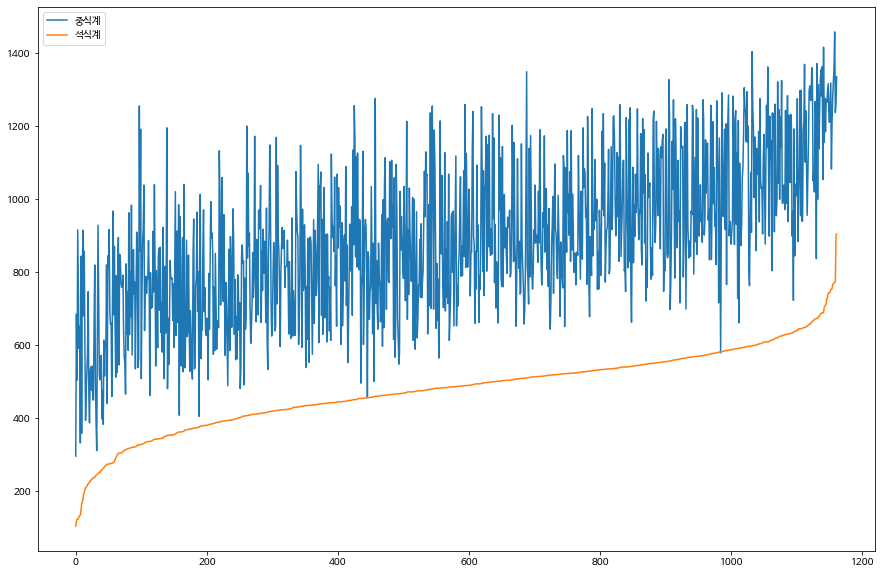

# 와인

## 0. 


```python
!sudo apt-get install -y fonts-nanum
!sudo fc-cache -fv
!rm ~/.cache/matplotlib -rf
```

    Reading package lists... Done
    Building dependency tree       
    Reading state information... Done
    fonts-nanum is already the newest version (20170925-1).
    The following package was automatically installed and is no longer required:
      libnvidia-common-460
    Use 'sudo apt autoremove' to remove it.
    0 upgraded, 0 newly installed, 0 to remove and 49 not upgraded.
    /usr/share/fonts: caching, new cache contents: 0 fonts, 1 dirs
    /usr/share/fonts/truetype: caching, new cache contents: 0 fonts, 3 dirs
    /usr/share/fonts/truetype/humor-sans: caching, new cache contents: 1 fonts, 0 dirs
    /usr/share/fonts/truetype/liberation: caching, new cache contents: 16 fonts, 0 dirs
    /usr/share/fonts/truetype/nanum: caching, new cache contents: 10 fonts, 0 dirs
    /usr/local/share/fonts: caching, new cache contents: 0 fonts, 0 dirs
    /root/.local/share/fonts: skipping, no such directory
    /root/.fonts: skipping, no such directory
    /var/cache/fontconfig: cleaning cache directory
    /root/.cache/fontconfig: not cleaning non-existent cache directory
    /root/.fontconfig: not cleaning non-existent cache directory
    fc-cache: succeeded
    


```python
import matplotlib.pyplot as plt
plt.rc('font', family='NanumBarunGothic')

from google.colab import drive
drive.mount('/content/drive')

import pandas as pd

from sklearn.ensemble import RandomForestClassifier
```

    Mounted at /content/drive
    


```python
train = pd.read_csv('/content/drive/MyDrive/와인/train.csv')
test = pd.read_csv('/content/drive/MyDrive/와인/test.csv')
submission = pd.read_csv('/content/drive/MyDrive/와인/sample_submission.csv')
```

### 1) 데이터 전처리


```python
train['type'] = train['type'].map(lambda x : 0 if x == 'white' else 1)
```


```python
train = train.append(train[train['quality'].isin([4,7,8])])
train['quality'].value_counts().sort_index()
```


    3      26
    4     372
    5    1788
    6    2416
    7    1848
    8     304
    9       5
    Name: quality, dtype: int64


```python
import numpy as np

def ACC(true, pred):   
    score = np.mean(true==pred)
    return score
```


```python
def make_plot():

  acc = ACC(y_valid, y_pred)

  validation = pd.DataFrame({'y_valid':y_valid, 'y_pred':y_pred})

  validation_count = pd.DataFrame(validation['y_valid'].value_counts().sort_index())
  validation_count.loc[validation['y_pred'].value_counts().sort_index().index, 'y_pred'] = validation['y_pred'].value_counts().sort_index()
  validation_count = validation_count.fillna(0)

  x = validation_count.index
  y_valid_count = validation_count['y_valid']
  y_pred_count = validation_count['y_pred']

  width = 0.35

  plt.figure(dpi=150)

  plt.title('ACC : ' + str(acc)[:6])
  plt.xlabel('quality')
  plt.ylabel('count')

  p1 = plt.bar([idx-width/2 for idx in x], y_valid_count, width, label='real')
  p2 = plt.bar([idx+width/2 for idx in x], y_pred_count,  width, label='pred')

  plt.legend()
  plt.show()
```


```python
features = train.columns[2:]
```


```python
X = train[features]
y = train['quality']
```


```python
from sklearn.model_selection import StratifiedKFold

kfold = StratifiedKFold(n_splits=5, shuffle = True)
# 추가
models = []
for train_idx, valid_idx in kfold.split(X, y):
  X_train, X_valid = X.iloc[train_idx], X.iloc[valid_idx]
  y_train, y_valid = y.iloc[train_idx], y.iloc[valid_idx]

  model = RandomForestClassifier()

  model.fit(X_train, y_train)

  #추가
  models.append(model)

  y_pred = model.predict(X_valid)

  make_plot()
```


    

    


    

    


    

    


    

    


    

    


```python
test['type'] = test['type'].map(lambda x : 0 if x == 'white' else 1)
```


```python
pred0 = models[0].predict(test[features])
pred1 = models[1].predict(test[features])
pred2 = models[2].predict(test[features])
pred3 = models[3].predict(test[features])
pred4 = models[4].predict(test[features])
```

### 2) 하드 보팅


```python
pred = pd.DataFrame({'pred0':pred0, 'pred1':pred1, 'pred2':pred2, 'pred3':pred3, 'pred4':pred4})
pred
```


  <div id="df-2a43b8e1-daa0-46c8-ae9b-8729637dc49c">
    <div class="colab-df-container">
      <div>
<style scoped>
    .dataframe tbody tr th:only-of-type {
        vertical-align: middle;
    }

    .dataframe tbody tr th {
        vertical-align: top;
    }

    .dataframe thead th {
        text-align: right;
    }
</style>
<table border="1" class="dataframe">
  <thead>
    <tr style="text-align: right;">
      <th></th>
      <th>pred0</th>
      <th>pred1</th>
      <th>pred2</th>
      <th>pred3</th>
      <th>pred4</th>
    </tr>
  </thead>
  <tbody>
    <tr>
      <th>0</th>
      <td>5</td>
      <td>6</td>
      <td>5</td>
      <td>6</td>
      <td>5</td>
    </tr>
    <tr>
      <th>1</th>
      <td>5</td>
      <td>6</td>
      <td>6</td>
      <td>6</td>
      <td>5</td>
    </tr>
    <tr>
      <th>2</th>
      <td>6</td>
      <td>6</td>
      <td>6</td>
      <td>5</td>
      <td>6</td>
    </tr>
    <tr>
      <th>3</th>
      <td>5</td>
      <td>5</td>
      <td>6</td>
      <td>5</td>
      <td>5</td>
    </tr>
    <tr>
      <th>4</th>
      <td>6</td>
      <td>6</td>
      <td>6</td>
      <td>7</td>
      <td>6</td>
    </tr>
    <tr>
      <th>...</th>
      <td>...</td>
      <td>...</td>
      <td>...</td>
      <td>...</td>
      <td>...</td>
    </tr>
    <tr>
      <th>995</th>
      <td>6</td>
      <td>6</td>
      <td>6</td>
      <td>5</td>
      <td>6</td>
    </tr>
    <tr>
      <th>996</th>
      <td>6</td>
      <td>6</td>
      <td>5</td>
      <td>6</td>
      <td>6</td>
    </tr>
    <tr>
      <th>997</th>
      <td>5</td>
      <td>5</td>
      <td>5</td>
      <td>5</td>
      <td>5</td>
    </tr>
    <tr>
      <th>998</th>
      <td>6</td>
      <td>6</td>
      <td>6</td>
      <td>6</td>
      <td>6</td>
    </tr>
    <tr>
      <th>999</th>
      <td>6</td>
      <td>6</td>
      <td>7</td>
      <td>6</td>
      <td>6</td>
    </tr>
  </tbody>
</table>
<p>1000 rows × 5 columns</p>
</div>
      <button class="colab-df-convert" onclick="convertToInteractive('df-2a43b8e1-daa0-46c8-ae9b-8729637dc49c')"
              title="Convert this dataframe to an interactive table."
              style="display:none;">

  <svg xmlns="http://www.w3.org/2000/svg" height="24px"viewBox="0 0 24 24"
       width="24px">
    <path d="M0 0h24v24H0V0z" fill="none"/>
    <path d="M18.56 5.44l.94 2.06.94-2.06 2.06-.94-2.06-.94-.94-2.06-.94 2.06-2.06.94zm-11 1L8.5 8.5l.94-2.06 2.06-.94-2.06-.94L8.5 2.5l-.94 2.06-2.06.94zm10 10l.94 2.06.94-2.06 2.06-.94-2.06-.94-.94-2.06-.94 2.06-2.06.94z"/><path d="M17.41 7.96l-1.37-1.37c-.4-.4-.92-.59-1.43-.59-.52 0-1.04.2-1.43.59L10.3 9.45l-7.72 7.72c-.78.78-.78 2.05 0 2.83L4 21.41c.39.39.9.59 1.41.59.51 0 1.02-.2 1.41-.59l7.78-7.78 2.81-2.81c.8-.78.8-2.07 0-2.86zM5.41 20L4 18.59l7.72-7.72 1.47 1.35L5.41 20z"/>
  </svg>
      </button>

  <style>
    .colab-df-container {
      display:flex;
      flex-wrap:wrap;
      gap: 12px;
    }

    .colab-df-convert {
      background-color: #E8F0FE;
      border: none;
      border-radius: 50%;
      cursor: pointer;
      display: none;
      fill: #1967D2;
      height: 32px;
      padding: 0 0 0 0;
      width: 32px;
    }

    .colab-df-convert:hover {
      background-color: #E2EBFA;
      box-shadow: 0px 1px 2px rgba(60, 64, 67, 0.3), 0px 1px 3px 1px rgba(60, 64, 67, 0.15);
      fill: #174EA6;
    }

    [theme=dark] .colab-df-convert {
      background-color: #3B4455;
      fill: #D2E3FC;
    }

    [theme=dark] .colab-df-convert:hover {
      background-color: #434B5C;
      box-shadow: 0px 1px 3px 1px rgba(0, 0, 0, 0.15);
      filter: drop-shadow(0px 1px 2px rgba(0, 0, 0, 0.3));
      fill: #FFFFFF;
    }
  </style>

      <script>
        const buttonEl =
          document.querySelector('#df-2a43b8e1-daa0-46c8-ae9b-8729637dc49c button.colab-df-convert');
        buttonEl.style.display =
          google.colab.kernel.accessAllowed ? 'block' : 'none';

        async function convertToInteractive(key) {
          const element = document.querySelector('#df-2a43b8e1-daa0-46c8-ae9b-8729637dc49c');
          const dataTable =
            await google.colab.kernel.invokeFunction('convertToInteractive',
                                                     [key], {});
          if (!dataTable) return;

          const docLinkHtml = 'Like what you see? Visit the ' +
            '<a target="_blank" href=https://colab.research.google.com/notebooks/data_table.ipynb>data table notebook</a>'
            + ' to learn more about interactive tables.';
          element.innerHTML = '';
          dataTable['output_type'] = 'display_data';
          await google.colab.output.renderOutput(dataTable, element);
          const docLink = document.createElement('div');
          docLink.innerHTML = docLinkHtml;
          element.appendChild(docLink);
        }
      </script>
    </div>
  </div>


```python
pred['pred'] = pred.mode(axis=1)[0].astype(int)
pred
```


  <div id="df-1d89951a-1fd1-4977-8afb-208f193709fc">
    <div class="colab-df-container">
      <div>
<style scoped>
    .dataframe tbody tr th:only-of-type {
        vertical-align: middle;
    }

    .dataframe tbody tr th {
        vertical-align: top;
    }

    .dataframe thead th {
        text-align: right;
    }
</style>
<table border="1" class="dataframe">
  <thead>
    <tr style="text-align: right;">
      <th></th>
      <th>pred0</th>
      <th>pred1</th>
      <th>pred2</th>
      <th>pred3</th>
      <th>pred4</th>
      <th>pred</th>
    </tr>
  </thead>
  <tbody>
    <tr>
      <th>0</th>
      <td>5</td>
      <td>6</td>
      <td>5</td>
      <td>6</td>
      <td>5</td>
      <td>5</td>
    </tr>
    <tr>
      <th>1</th>
      <td>5</td>
      <td>6</td>
      <td>6</td>
      <td>6</td>
      <td>5</td>
      <td>6</td>
    </tr>
    <tr>
      <th>2</th>
      <td>6</td>
      <td>6</td>
      <td>6</td>
      <td>5</td>
      <td>6</td>
      <td>6</td>
    </tr>
    <tr>
      <th>3</th>
      <td>5</td>
      <td>5</td>
      <td>6</td>
      <td>5</td>
      <td>5</td>
      <td>5</td>
    </tr>
    <tr>
      <th>4</th>
      <td>6</td>
      <td>6</td>
      <td>6</td>
      <td>7</td>
      <td>6</td>
      <td>6</td>
    </tr>
    <tr>
      <th>...</th>
      <td>...</td>
      <td>...</td>
      <td>...</td>
      <td>...</td>
      <td>...</td>
      <td>...</td>
    </tr>
    <tr>
      <th>995</th>
      <td>6</td>
      <td>6</td>
      <td>6</td>
      <td>5</td>
      <td>6</td>
      <td>6</td>
    </tr>
    <tr>
      <th>996</th>
      <td>6</td>
      <td>6</td>
      <td>5</td>
      <td>6</td>
      <td>6</td>
      <td>6</td>
    </tr>
    <tr>
      <th>997</th>
      <td>5</td>
      <td>5</td>
      <td>5</td>
      <td>5</td>
      <td>5</td>
      <td>5</td>
    </tr>
    <tr>
      <th>998</th>
      <td>6</td>
      <td>6</td>
      <td>6</td>
      <td>6</td>
      <td>6</td>
      <td>6</td>
    </tr>
    <tr>
      <th>999</th>
      <td>6</td>
      <td>6</td>
      <td>7</td>
      <td>6</td>
      <td>6</td>
      <td>6</td>
    </tr>
  </tbody>
</table>
<p>1000 rows × 6 columns</p>
</div>
      <button class="colab-df-convert" onclick="convertToInteractive('df-1d89951a-1fd1-4977-8afb-208f193709fc')"
              title="Convert this dataframe to an interactive table."
              style="display:none;">

  <svg xmlns="http://www.w3.org/2000/svg" height="24px"viewBox="0 0 24 24"
       width="24px">
    <path d="M0 0h24v24H0V0z" fill="none"/>
    <path d="M18.56 5.44l.94 2.06.94-2.06 2.06-.94-2.06-.94-.94-2.06-.94 2.06-2.06.94zm-11 1L8.5 8.5l.94-2.06 2.06-.94-2.06-.94L8.5 2.5l-.94 2.06-2.06.94zm10 10l.94 2.06.94-2.06 2.06-.94-2.06-.94-.94-2.06-.94 2.06-2.06.94z"/><path d="M17.41 7.96l-1.37-1.37c-.4-.4-.92-.59-1.43-.59-.52 0-1.04.2-1.43.59L10.3 9.45l-7.72 7.72c-.78.78-.78 2.05 0 2.83L4 21.41c.39.39.9.59 1.41.59.51 0 1.02-.2 1.41-.59l7.78-7.78 2.81-2.81c.8-.78.8-2.07 0-2.86zM5.41 20L4 18.59l7.72-7.72 1.47 1.35L5.41 20z"/>
  </svg>
      </button>

  <style>
    .colab-df-container {
      display:flex;
      flex-wrap:wrap;
      gap: 12px;
    }

    .colab-df-convert {
      background-color: #E8F0FE;
      border: none;
      border-radius: 50%;
      cursor: pointer;
      display: none;
      fill: #1967D2;
      height: 32px;
      padding: 0 0 0 0;
      width: 32px;
    }

    .colab-df-convert:hover {
      background-color: #E2EBFA;
      box-shadow: 0px 1px 2px rgba(60, 64, 67, 0.3), 0px 1px 3px 1px rgba(60, 64, 67, 0.15);
      fill: #174EA6;
    }

    [theme=dark] .colab-df-convert {
      background-color: #3B4455;
      fill: #D2E3FC;
    }

    [theme=dark] .colab-df-convert:hover {
      background-color: #434B5C;
      box-shadow: 0px 1px 3px 1px rgba(0, 0, 0, 0.15);
      filter: drop-shadow(0px 1px 2px rgba(0, 0, 0, 0.3));
      fill: #FFFFFF;
    }
  </style>

      <script>
        const buttonEl =
          document.querySelector('#df-1d89951a-1fd1-4977-8afb-208f193709fc button.colab-df-convert');
        buttonEl.style.display =
          google.colab.kernel.accessAllowed ? 'block' : 'none';

        async function convertToInteractive(key) {
          const element = document.querySelector('#df-1d89951a-1fd1-4977-8afb-208f193709fc');
          const dataTable =
            await google.colab.kernel.invokeFunction('convertToInteractive',
                                                     [key], {});
          if (!dataTable) return;

          const docLinkHtml = 'Like what you see? Visit the ' +
            '<a target="_blank" href=https://colab.research.google.com/notebooks/data_table.ipynb>data table notebook</a>'
            + ' to learn more about interactive tables.';
          element.innerHTML = '';
          dataTable['output_type'] = 'display_data';
          await google.colab.output.renderOutput(dataTable, element);
          const docLink = document.createElement('div');
          docLink.innerHTML = docLinkHtml;
          element.appendChild(docLink);
        }
      </script>
    </div>
  </div>


```python
submission['quality'] = pred.mode(axis=1)[0].astype(int)
submission
```


  <div id="df-e90c4fa0-049b-486d-ae4d-6bc7cd283c24">
    <div class="colab-df-container">
      <div>
<style scoped>
    .dataframe tbody tr th:only-of-type {
        vertical-align: middle;
    }

    .dataframe tbody tr th {
        vertical-align: top;
    }

    .dataframe thead th {
        text-align: right;
    }
</style>
<table border="1" class="dataframe">
  <thead>
    <tr style="text-align: right;">
      <th></th>
      <th>index</th>
      <th>quality</th>
    </tr>
  </thead>
  <tbody>
    <tr>
      <th>0</th>
      <td>0</td>
      <td>5</td>
    </tr>
    <tr>
      <th>1</th>
      <td>1</td>
      <td>6</td>
    </tr>
    <tr>
      <th>2</th>
      <td>2</td>
      <td>6</td>
    </tr>
    <tr>
      <th>3</th>
      <td>3</td>
      <td>5</td>
    </tr>
    <tr>
      <th>4</th>
      <td>4</td>
      <td>6</td>
    </tr>
    <tr>
      <th>...</th>
      <td>...</td>
      <td>...</td>
    </tr>
    <tr>
      <th>995</th>
      <td>995</td>
      <td>6</td>
    </tr>
    <tr>
      <th>996</th>
      <td>996</td>
      <td>6</td>
    </tr>
    <tr>
      <th>997</th>
      <td>997</td>
      <td>5</td>
    </tr>
    <tr>
      <th>998</th>
      <td>998</td>
      <td>6</td>
    </tr>
    <tr>
      <th>999</th>
      <td>999</td>
      <td>6</td>
    </tr>
  </tbody>
</table>
<p>1000 rows × 2 columns</p>
</div>
      <button class="colab-df-convert" onclick="convertToInteractive('df-e90c4fa0-049b-486d-ae4d-6bc7cd283c24')"
              title="Convert this dataframe to an interactive table."
              style="display:none;">

  <svg xmlns="http://www.w3.org/2000/svg" height="24px"viewBox="0 0 24 24"
       width="24px">
    <path d="M0 0h24v24H0V0z" fill="none"/>
    <path d="M18.56 5.44l.94 2.06.94-2.06 2.06-.94-2.06-.94-.94-2.06-.94 2.06-2.06.94zm-11 1L8.5 8.5l.94-2.06 2.06-.94-2.06-.94L8.5 2.5l-.94 2.06-2.06.94zm10 10l.94 2.06.94-2.06 2.06-.94-2.06-.94-.94-2.06-.94 2.06-2.06.94z"/><path d="M17.41 7.96l-1.37-1.37c-.4-.4-.92-.59-1.43-.59-.52 0-1.04.2-1.43.59L10.3 9.45l-7.72 7.72c-.78.78-.78 2.05 0 2.83L4 21.41c.39.39.9.59 1.41.59.51 0 1.02-.2 1.41-.59l7.78-7.78 2.81-2.81c.8-.78.8-2.07 0-2.86zM5.41 20L4 18.59l7.72-7.72 1.47 1.35L5.41 20z"/>
  </svg>
      </button>

  <style>
    .colab-df-container {
      display:flex;
      flex-wrap:wrap;
      gap: 12px;
    }

    .colab-df-convert {
      background-color: #E8F0FE;
      border: none;
      border-radius: 50%;
      cursor: pointer;
      display: none;
      fill: #1967D2;
      height: 32px;
      padding: 0 0 0 0;
      width: 32px;
    }

    .colab-df-convert:hover {
      background-color: #E2EBFA;
      box-shadow: 0px 1px 2px rgba(60, 64, 67, 0.3), 0px 1px 3px 1px rgba(60, 64, 67, 0.15);
      fill: #174EA6;
    }

    [theme=dark] .colab-df-convert {
      background-color: #3B4455;
      fill: #D2E3FC;
    }

    [theme=dark] .colab-df-convert:hover {
      background-color: #434B5C;
      box-shadow: 0px 1px 3px 1px rgba(0, 0, 0, 0.15);
      filter: drop-shadow(0px 1px 2px rgba(0, 0, 0, 0.3));
      fill: #FFFFFF;
    }
  </style>

      <script>
        const buttonEl =
          document.querySelector('#df-e90c4fa0-049b-486d-ae4d-6bc7cd283c24 button.colab-df-convert');
        buttonEl.style.display =
          google.colab.kernel.accessAllowed ? 'block' : 'none';

        async function convertToInteractive(key) {
          const element = document.querySelector('#df-e90c4fa0-049b-486d-ae4d-6bc7cd283c24');
          const dataTable =
            await google.colab.kernel.invokeFunction('convertToInteractive',
                                                     [key], {});
          if (!dataTable) return;

          const docLinkHtml = 'Like what you see? Visit the ' +
            '<a target="_blank" href=https://colab.research.google.com/notebooks/data_table.ipynb>data table notebook</a>'
            + ' to learn more about interactive tables.';
          element.innerHTML = '';
          dataTable['output_type'] = 'display_data';
          await google.colab.output.renderOutput(dataTable, element);
          const docLink = document.createElement('div');
          docLink.innerHTML = docLinkHtml;
          element.appendChild(docLink);
        }
      </script>
    </div>
  </div>


```python
submission.to_csv('submission.csv', index=False)

# 점수 : 0.689
```

### 3) 소프트 보팅


```python
pred0 = models[0].predict_proba(test[features])
pred0
```


    array([[0.  , 0.08, 0.39, ..., 0.13, 0.04, 0.  ],
           [0.04, 0.09, 0.43, ..., 0.03, 0.  , 0.  ],
           [0.  , 0.05, 0.35, ..., 0.07, 0.03, 0.  ],
           ...,
           [0.01, 0.07, 0.55, ..., 0.04, 0.02, 0.  ],
           [0.  , 0.08, 0.2 , ..., 0.04, 0.02, 0.  ],
           [0.01, 0.  , 0.04, ..., 0.17, 0.02, 0.  ]])


```python
pd.DataFrame(pred0)
```


  <div id="df-fee92548-0922-4892-9e14-05fd676c2d7e">
    <div class="colab-df-container">
      <div>
<style scoped>
    .dataframe tbody tr th:only-of-type {
        vertical-align: middle;
    }

    .dataframe tbody tr th {
        vertical-align: top;
    }

    .dataframe thead th {
        text-align: right;
    }
</style>
<table border="1" class="dataframe">
  <thead>
    <tr style="text-align: right;">
      <th></th>
      <th>0</th>
      <th>1</th>
      <th>2</th>
      <th>3</th>
      <th>4</th>
      <th>5</th>
      <th>6</th>
    </tr>
  </thead>
  <tbody>
    <tr>
      <th>0</th>
      <td>0.00</td>
      <td>0.08</td>
      <td>0.39</td>
      <td>0.36</td>
      <td>0.13</td>
      <td>0.04</td>
      <td>0.00</td>
    </tr>
    <tr>
      <th>1</th>
      <td>0.04</td>
      <td>0.09</td>
      <td>0.43</td>
      <td>0.41</td>
      <td>0.03</td>
      <td>0.00</td>
      <td>0.00</td>
    </tr>
    <tr>
      <th>2</th>
      <td>0.00</td>
      <td>0.05</td>
      <td>0.35</td>
      <td>0.50</td>
      <td>0.07</td>
      <td>0.03</td>
      <td>0.00</td>
    </tr>
    <tr>
      <th>3</th>
      <td>0.00</td>
      <td>0.01</td>
      <td>0.73</td>
      <td>0.18</td>
      <td>0.08</td>
      <td>0.00</td>
      <td>0.00</td>
    </tr>
    <tr>
      <th>4</th>
      <td>0.00</td>
      <td>0.01</td>
      <td>0.05</td>
      <td>0.55</td>
      <td>0.35</td>
      <td>0.04</td>
      <td>0.00</td>
    </tr>
    <tr>
      <th>...</th>
      <td>...</td>
      <td>...</td>
      <td>...</td>
      <td>...</td>
      <td>...</td>
      <td>...</td>
      <td>...</td>
    </tr>
    <tr>
      <th>995</th>
      <td>0.00</td>
      <td>0.02</td>
      <td>0.27</td>
      <td>0.70</td>
      <td>0.01</td>
      <td>0.00</td>
      <td>0.00</td>
    </tr>
    <tr>
      <th>996</th>
      <td>0.00</td>
      <td>0.05</td>
      <td>0.29</td>
      <td>0.46</td>
      <td>0.18</td>
      <td>0.01</td>
      <td>0.01</td>
    </tr>
    <tr>
      <th>997</th>
      <td>0.01</td>
      <td>0.07</td>
      <td>0.55</td>
      <td>0.31</td>
      <td>0.04</td>
      <td>0.02</td>
      <td>0.00</td>
    </tr>
    <tr>
      <th>998</th>
      <td>0.00</td>
      <td>0.08</td>
      <td>0.20</td>
      <td>0.66</td>
      <td>0.04</td>
      <td>0.02</td>
      <td>0.00</td>
    </tr>
    <tr>
      <th>999</th>
      <td>0.01</td>
      <td>0.00</td>
      <td>0.04</td>
      <td>0.76</td>
      <td>0.17</td>
      <td>0.02</td>
      <td>0.00</td>
    </tr>
  </tbody>
</table>
<p>1000 rows × 7 columns</p>
</div>
      <button class="colab-df-convert" onclick="convertToInteractive('df-fee92548-0922-4892-9e14-05fd676c2d7e')"
              title="Convert this dataframe to an interactive table."
              style="display:none;">

  <svg xmlns="http://www.w3.org/2000/svg" height="24px"viewBox="0 0 24 24"
       width="24px">
    <path d="M0 0h24v24H0V0z" fill="none"/>
    <path d="M18.56 5.44l.94 2.06.94-2.06 2.06-.94-2.06-.94-.94-2.06-.94 2.06-2.06.94zm-11 1L8.5 8.5l.94-2.06 2.06-.94-2.06-.94L8.5 2.5l-.94 2.06-2.06.94zm10 10l.94 2.06.94-2.06 2.06-.94-2.06-.94-.94-2.06-.94 2.06-2.06.94z"/><path d="M17.41 7.96l-1.37-1.37c-.4-.4-.92-.59-1.43-.59-.52 0-1.04.2-1.43.59L10.3 9.45l-7.72 7.72c-.78.78-.78 2.05 0 2.83L4 21.41c.39.39.9.59 1.41.59.51 0 1.02-.2 1.41-.59l7.78-7.78 2.81-2.81c.8-.78.8-2.07 0-2.86zM5.41 20L4 18.59l7.72-7.72 1.47 1.35L5.41 20z"/>
  </svg>
      </button>

  <style>
    .colab-df-container {
      display:flex;
      flex-wrap:wrap;
      gap: 12px;
    }

    .colab-df-convert {
      background-color: #E8F0FE;
      border: none;
      border-radius: 50%;
      cursor: pointer;
      display: none;
      fill: #1967D2;
      height: 32px;
      padding: 0 0 0 0;
      width: 32px;
    }

    .colab-df-convert:hover {
      background-color: #E2EBFA;
      box-shadow: 0px 1px 2px rgba(60, 64, 67, 0.3), 0px 1px 3px 1px rgba(60, 64, 67, 0.15);
      fill: #174EA6;
    }

    [theme=dark] .colab-df-convert {
      background-color: #3B4455;
      fill: #D2E3FC;
    }

    [theme=dark] .colab-df-convert:hover {
      background-color: #434B5C;
      box-shadow: 0px 1px 3px 1px rgba(0, 0, 0, 0.15);
      filter: drop-shadow(0px 1px 2px rgba(0, 0, 0, 0.3));
      fill: #FFFFFF;
    }
  </style>

      <script>
        const buttonEl =
          document.querySelector('#df-fee92548-0922-4892-9e14-05fd676c2d7e button.colab-df-convert');
        buttonEl.style.display =
          google.colab.kernel.accessAllowed ? 'block' : 'none';

        async function convertToInteractive(key) {
          const element = document.querySelector('#df-fee92548-0922-4892-9e14-05fd676c2d7e');
          const dataTable =
            await google.colab.kernel.invokeFunction('convertToInteractive',
                                                     [key], {});
          if (!dataTable) return;

          const docLinkHtml = 'Like what you see? Visit the ' +
            '<a target="_blank" href=https://colab.research.google.com/notebooks/data_table.ipynb>data table notebook</a>'
            + ' to learn more about interactive tables.';
          element.innerHTML = '';
          dataTable['output_type'] = 'display_data';
          await google.colab.output.renderOutput(dataTable, element);
          const docLink = document.createElement('div');
          docLink.innerHTML = docLinkHtml;
          element.appendChild(docLink);
        }
      </script>
    </div>
  </div>


```python
pred0 = models[0].predict_proba(test[features])
pred1 = models[1].predict_proba(test[features])
pred2 = models[2].predict_proba(test[features])
pred3 = models[3].predict_proba(test[features])
pred4 = models[4].predict_proba(test[features])
```


```python
pred = pd.DataFrame((pred0 + pred1 + pred2 + pred3 + pred4)/5)
pred
```


  <div id="df-bf11a6b4-1965-4771-9300-39db8ede1a72">
    <div class="colab-df-container">
      <div>
<style scoped>
    .dataframe tbody tr th:only-of-type {
        vertical-align: middle;
    }

    .dataframe tbody tr th {
        vertical-align: top;
    }

    .dataframe thead th {
        text-align: right;
    }
</style>
<table border="1" class="dataframe">
  <thead>
    <tr style="text-align: right;">
      <th></th>
      <th>0</th>
      <th>1</th>
      <th>2</th>
      <th>3</th>
      <th>4</th>
      <th>5</th>
      <th>6</th>
    </tr>
  </thead>
  <tbody>
    <tr>
      <th>0</th>
      <td>0.006</td>
      <td>0.146</td>
      <td>0.302</td>
      <td>0.348</td>
      <td>0.146</td>
      <td>0.052</td>
      <td>0.000</td>
    </tr>
    <tr>
      <th>1</th>
      <td>0.040</td>
      <td>0.116</td>
      <td>0.424</td>
      <td>0.400</td>
      <td>0.020</td>
      <td>0.000</td>
      <td>0.000</td>
    </tr>
    <tr>
      <th>2</th>
      <td>0.010</td>
      <td>0.042</td>
      <td>0.318</td>
      <td>0.572</td>
      <td>0.044</td>
      <td>0.014</td>
      <td>0.000</td>
    </tr>
    <tr>
      <th>3</th>
      <td>0.002</td>
      <td>0.024</td>
      <td>0.622</td>
      <td>0.264</td>
      <td>0.088</td>
      <td>0.000</td>
      <td>0.000</td>
    </tr>
    <tr>
      <th>4</th>
      <td>0.000</td>
      <td>0.030</td>
      <td>0.054</td>
      <td>0.484</td>
      <td>0.398</td>
      <td>0.028</td>
      <td>0.006</td>
    </tr>
    <tr>
      <th>...</th>
      <td>...</td>
      <td>...</td>
      <td>...</td>
      <td>...</td>
      <td>...</td>
      <td>...</td>
      <td>...</td>
    </tr>
    <tr>
      <th>995</th>
      <td>0.004</td>
      <td>0.022</td>
      <td>0.380</td>
      <td>0.592</td>
      <td>0.002</td>
      <td>0.000</td>
      <td>0.000</td>
    </tr>
    <tr>
      <th>996</th>
      <td>0.000</td>
      <td>0.050</td>
      <td>0.336</td>
      <td>0.440</td>
      <td>0.158</td>
      <td>0.012</td>
      <td>0.004</td>
    </tr>
    <tr>
      <th>997</th>
      <td>0.010</td>
      <td>0.086</td>
      <td>0.560</td>
      <td>0.308</td>
      <td>0.030</td>
      <td>0.006</td>
      <td>0.000</td>
    </tr>
    <tr>
      <th>998</th>
      <td>0.000</td>
      <td>0.052</td>
      <td>0.152</td>
      <td>0.720</td>
      <td>0.062</td>
      <td>0.014</td>
      <td>0.000</td>
    </tr>
    <tr>
      <th>999</th>
      <td>0.010</td>
      <td>0.008</td>
      <td>0.062</td>
      <td>0.686</td>
      <td>0.196</td>
      <td>0.038</td>
      <td>0.000</td>
    </tr>
  </tbody>
</table>
<p>1000 rows × 7 columns</p>
</div>
      <button class="colab-df-convert" onclick="convertToInteractive('df-bf11a6b4-1965-4771-9300-39db8ede1a72')"
              title="Convert this dataframe to an interactive table."
              style="display:none;">

  <svg xmlns="http://www.w3.org/2000/svg" height="24px"viewBox="0 0 24 24"
       width="24px">
    <path d="M0 0h24v24H0V0z" fill="none"/>
    <path d="M18.56 5.44l.94 2.06.94-2.06 2.06-.94-2.06-.94-.94-2.06-.94 2.06-2.06.94zm-11 1L8.5 8.5l.94-2.06 2.06-.94-2.06-.94L8.5 2.5l-.94 2.06-2.06.94zm10 10l.94 2.06.94-2.06 2.06-.94-2.06-.94-.94-2.06-.94 2.06-2.06.94z"/><path d="M17.41 7.96l-1.37-1.37c-.4-.4-.92-.59-1.43-.59-.52 0-1.04.2-1.43.59L10.3 9.45l-7.72 7.72c-.78.78-.78 2.05 0 2.83L4 21.41c.39.39.9.59 1.41.59.51 0 1.02-.2 1.41-.59l7.78-7.78 2.81-2.81c.8-.78.8-2.07 0-2.86zM5.41 20L4 18.59l7.72-7.72 1.47 1.35L5.41 20z"/>
  </svg>
      </button>

  <style>
    .colab-df-container {
      display:flex;
      flex-wrap:wrap;
      gap: 12px;
    }

    .colab-df-convert {
      background-color: #E8F0FE;
      border: none;
      border-radius: 50%;
      cursor: pointer;
      display: none;
      fill: #1967D2;
      height: 32px;
      padding: 0 0 0 0;
      width: 32px;
    }

    .colab-df-convert:hover {
      background-color: #E2EBFA;
      box-shadow: 0px 1px 2px rgba(60, 64, 67, 0.3), 0px 1px 3px 1px rgba(60, 64, 67, 0.15);
      fill: #174EA6;
    }

    [theme=dark] .colab-df-convert {
      background-color: #3B4455;
      fill: #D2E3FC;
    }

    [theme=dark] .colab-df-convert:hover {
      background-color: #434B5C;
      box-shadow: 0px 1px 3px 1px rgba(0, 0, 0, 0.15);
      filter: drop-shadow(0px 1px 2px rgba(0, 0, 0, 0.3));
      fill: #FFFFFF;
    }
  </style>

      <script>
        const buttonEl =
          document.querySelector('#df-bf11a6b4-1965-4771-9300-39db8ede1a72 button.colab-df-convert');
        buttonEl.style.display =
          google.colab.kernel.accessAllowed ? 'block' : 'none';

        async function convertToInteractive(key) {
          const element = document.querySelector('#df-bf11a6b4-1965-4771-9300-39db8ede1a72');
          const dataTable =
            await google.colab.kernel.invokeFunction('convertToInteractive',
                                                     [key], {});
          if (!dataTable) return;

          const docLinkHtml = 'Like what you see? Visit the ' +
            '<a target="_blank" href=https://colab.research.google.com/notebooks/data_table.ipynb>data table notebook</a>'
            + ' to learn more about interactive tables.';
          element.innerHTML = '';
          dataTable['output_type'] = 'display_data';
          await google.colab.output.renderOutput(dataTable, element);
          const docLink = document.createElement('div');
          docLink.innerHTML = docLinkHtml;
          element.appendChild(docLink);
        }
      </script>
    </div>
  </div>


```python
pd.DataFrame(np.argmax(np.array(pred), axis=1))
```


  <div id="df-718186c6-043c-4636-a203-67e553e55182">
    <div class="colab-df-container">
      <div>
<style scoped>
    .dataframe tbody tr th:only-of-type {
        vertical-align: middle;
    }

    .dataframe tbody tr th {
        vertical-align: top;
    }

    .dataframe thead th {
        text-align: right;
    }
</style>
<table border="1" class="dataframe">
  <thead>
    <tr style="text-align: right;">
      <th></th>
      <th>0</th>
    </tr>
  </thead>
  <tbody>
    <tr>
      <th>0</th>
      <td>3</td>
    </tr>
    <tr>
      <th>1</th>
      <td>2</td>
    </tr>
    <tr>
      <th>2</th>
      <td>3</td>
    </tr>
    <tr>
      <th>3</th>
      <td>2</td>
    </tr>
    <tr>
      <th>4</th>
      <td>3</td>
    </tr>
    <tr>
      <th>...</th>
      <td>...</td>
    </tr>
    <tr>
      <th>995</th>
      <td>3</td>
    </tr>
    <tr>
      <th>996</th>
      <td>3</td>
    </tr>
    <tr>
      <th>997</th>
      <td>2</td>
    </tr>
    <tr>
      <th>998</th>
      <td>3</td>
    </tr>
    <tr>
      <th>999</th>
      <td>3</td>
    </tr>
  </tbody>
</table>
<p>1000 rows × 1 columns</p>
</div>
      <button class="colab-df-convert" onclick="convertToInteractive('df-718186c6-043c-4636-a203-67e553e55182')"
              title="Convert this dataframe to an interactive table."
              style="display:none;">

  <svg xmlns="http://www.w3.org/2000/svg" height="24px"viewBox="0 0 24 24"
       width="24px">
    <path d="M0 0h24v24H0V0z" fill="none"/>
    <path d="M18.56 5.44l.94 2.06.94-2.06 2.06-.94-2.06-.94-.94-2.06-.94 2.06-2.06.94zm-11 1L8.5 8.5l.94-2.06 2.06-.94-2.06-.94L8.5 2.5l-.94 2.06-2.06.94zm10 10l.94 2.06.94-2.06 2.06-.94-2.06-.94-.94-2.06-.94 2.06-2.06.94z"/><path d="M17.41 7.96l-1.37-1.37c-.4-.4-.92-.59-1.43-.59-.52 0-1.04.2-1.43.59L10.3 9.45l-7.72 7.72c-.78.78-.78 2.05 0 2.83L4 21.41c.39.39.9.59 1.41.59.51 0 1.02-.2 1.41-.59l7.78-7.78 2.81-2.81c.8-.78.8-2.07 0-2.86zM5.41 20L4 18.59l7.72-7.72 1.47 1.35L5.41 20z"/>
  </svg>
      </button>

  <style>
    .colab-df-container {
      display:flex;
      flex-wrap:wrap;
      gap: 12px;
    }

    .colab-df-convert {
      background-color: #E8F0FE;
      border: none;
      border-radius: 50%;
      cursor: pointer;
      display: none;
      fill: #1967D2;
      height: 32px;
      padding: 0 0 0 0;
      width: 32px;
    }

    .colab-df-convert:hover {
      background-color: #E2EBFA;
      box-shadow: 0px 1px 2px rgba(60, 64, 67, 0.3), 0px 1px 3px 1px rgba(60, 64, 67, 0.15);
      fill: #174EA6;
    }

    [theme=dark] .colab-df-convert {
      background-color: #3B4455;
      fill: #D2E3FC;
    }

    [theme=dark] .colab-df-convert:hover {
      background-color: #434B5C;
      box-shadow: 0px 1px 3px 1px rgba(0, 0, 0, 0.15);
      filter: drop-shadow(0px 1px 2px rgba(0, 0, 0, 0.3));
      fill: #FFFFFF;
    }
  </style>

      <script>
        const buttonEl =
          document.querySelector('#df-718186c6-043c-4636-a203-67e553e55182 button.colab-df-convert');
        buttonEl.style.display =
          google.colab.kernel.accessAllowed ? 'block' : 'none';

        async function convertToInteractive(key) {
          const element = document.querySelector('#df-718186c6-043c-4636-a203-67e553e55182');
          const dataTable =
            await google.colab.kernel.invokeFunction('convertToInteractive',
                                                     [key], {});
          if (!dataTable) return;

          const docLinkHtml = 'Like what you see? Visit the ' +
            '<a target="_blank" href=https://colab.research.google.com/notebooks/data_table.ipynb>data table notebook</a>'
            + ' to learn more about interactive tables.';
          element.innerHTML = '';
          dataTable['output_type'] = 'display_data';
          await google.colab.output.renderOutput(dataTable, element);
          const docLink = document.createElement('div');
          docLink.innerHTML = docLinkHtml;
          element.appendChild(docLink);
        }
      </script>
    </div>
  </div>


```python
pred['quality'] = np.argmax(np.array(pred), axis=1)
pred
```


  <div id="df-32fcd89c-f35b-41e1-bc31-e9a22f65f11a">
    <div class="colab-df-container">
      <div>
<style scoped>
    .dataframe tbody tr th:only-of-type {
        vertical-align: middle;
    }

    .dataframe tbody tr th {
        vertical-align: top;
    }

    .dataframe thead th {
        text-align: right;
    }
</style>
<table border="1" class="dataframe">
  <thead>
    <tr style="text-align: right;">
      <th></th>
      <th>0</th>
      <th>1</th>
      <th>2</th>
      <th>3</th>
      <th>4</th>
      <th>5</th>
      <th>6</th>
      <th>quality</th>
    </tr>
  </thead>
  <tbody>
    <tr>
      <th>0</th>
      <td>0.006</td>
      <td>0.146</td>
      <td>0.302</td>
      <td>0.348</td>
      <td>0.146</td>
      <td>0.052</td>
      <td>0.000</td>
      <td>3</td>
    </tr>
    <tr>
      <th>1</th>
      <td>0.040</td>
      <td>0.116</td>
      <td>0.424</td>
      <td>0.400</td>
      <td>0.020</td>
      <td>0.000</td>
      <td>0.000</td>
      <td>2</td>
    </tr>
    <tr>
      <th>2</th>
      <td>0.010</td>
      <td>0.042</td>
      <td>0.318</td>
      <td>0.572</td>
      <td>0.044</td>
      <td>0.014</td>
      <td>0.000</td>
      <td>3</td>
    </tr>
    <tr>
      <th>3</th>
      <td>0.002</td>
      <td>0.024</td>
      <td>0.622</td>
      <td>0.264</td>
      <td>0.088</td>
      <td>0.000</td>
      <td>0.000</td>
      <td>2</td>
    </tr>
    <tr>
      <th>4</th>
      <td>0.000</td>
      <td>0.030</td>
      <td>0.054</td>
      <td>0.484</td>
      <td>0.398</td>
      <td>0.028</td>
      <td>0.006</td>
      <td>3</td>
    </tr>
    <tr>
      <th>...</th>
      <td>...</td>
      <td>...</td>
      <td>...</td>
      <td>...</td>
      <td>...</td>
      <td>...</td>
      <td>...</td>
      <td>...</td>
    </tr>
    <tr>
      <th>995</th>
      <td>0.004</td>
      <td>0.022</td>
      <td>0.380</td>
      <td>0.592</td>
      <td>0.002</td>
      <td>0.000</td>
      <td>0.000</td>
      <td>3</td>
    </tr>
    <tr>
      <th>996</th>
      <td>0.000</td>
      <td>0.050</td>
      <td>0.336</td>
      <td>0.440</td>
      <td>0.158</td>
      <td>0.012</td>
      <td>0.004</td>
      <td>3</td>
    </tr>
    <tr>
      <th>997</th>
      <td>0.010</td>
      <td>0.086</td>
      <td>0.560</td>
      <td>0.308</td>
      <td>0.030</td>
      <td>0.006</td>
      <td>0.000</td>
      <td>2</td>
    </tr>
    <tr>
      <th>998</th>
      <td>0.000</td>
      <td>0.052</td>
      <td>0.152</td>
      <td>0.720</td>
      <td>0.062</td>
      <td>0.014</td>
      <td>0.000</td>
      <td>3</td>
    </tr>
    <tr>
      <th>999</th>
      <td>0.010</td>
      <td>0.008</td>
      <td>0.062</td>
      <td>0.686</td>
      <td>0.196</td>
      <td>0.038</td>
      <td>0.000</td>
      <td>3</td>
    </tr>
  </tbody>
</table>
<p>1000 rows × 8 columns</p>
</div>
      <button class="colab-df-convert" onclick="convertToInteractive('df-32fcd89c-f35b-41e1-bc31-e9a22f65f11a')"
              title="Convert this dataframe to an interactive table."
              style="display:none;">

  <svg xmlns="http://www.w3.org/2000/svg" height="24px"viewBox="0 0 24 24"
       width="24px">
    <path d="M0 0h24v24H0V0z" fill="none"/>
    <path d="M18.56 5.44l.94 2.06.94-2.06 2.06-.94-2.06-.94-.94-2.06-.94 2.06-2.06.94zm-11 1L8.5 8.5l.94-2.06 2.06-.94-2.06-.94L8.5 2.5l-.94 2.06-2.06.94zm10 10l.94 2.06.94-2.06 2.06-.94-2.06-.94-.94-2.06-.94 2.06-2.06.94z"/><path d="M17.41 7.96l-1.37-1.37c-.4-.4-.92-.59-1.43-.59-.52 0-1.04.2-1.43.59L10.3 9.45l-7.72 7.72c-.78.78-.78 2.05 0 2.83L4 21.41c.39.39.9.59 1.41.59.51 0 1.02-.2 1.41-.59l7.78-7.78 2.81-2.81c.8-.78.8-2.07 0-2.86zM5.41 20L4 18.59l7.72-7.72 1.47 1.35L5.41 20z"/>
  </svg>
      </button>

  <style>
    .colab-df-container {
      display:flex;
      flex-wrap:wrap;
      gap: 12px;
    }

    .colab-df-convert {
      background-color: #E8F0FE;
      border: none;
      border-radius: 50%;
      cursor: pointer;
      display: none;
      fill: #1967D2;
      height: 32px;
      padding: 0 0 0 0;
      width: 32px;
    }

    .colab-df-convert:hover {
      background-color: #E2EBFA;
      box-shadow: 0px 1px 2px rgba(60, 64, 67, 0.3), 0px 1px 3px 1px rgba(60, 64, 67, 0.15);
      fill: #174EA6;
    }

    [theme=dark] .colab-df-convert {
      background-color: #3B4455;
      fill: #D2E3FC;
    }

    [theme=dark] .colab-df-convert:hover {
      background-color: #434B5C;
      box-shadow: 0px 1px 3px 1px rgba(0, 0, 0, 0.15);
      filter: drop-shadow(0px 1px 2px rgba(0, 0, 0, 0.3));
      fill: #FFFFFF;
    }
  </style>

      <script>
        const buttonEl =
          document.querySelector('#df-32fcd89c-f35b-41e1-bc31-e9a22f65f11a button.colab-df-convert');
        buttonEl.style.display =
          google.colab.kernel.accessAllowed ? 'block' : 'none';

        async function convertToInteractive(key) {
          const element = document.querySelector('#df-32fcd89c-f35b-41e1-bc31-e9a22f65f11a');
          const dataTable =
            await google.colab.kernel.invokeFunction('convertToInteractive',
                                                     [key], {});
          if (!dataTable) return;

          const docLinkHtml = 'Like what you see? Visit the ' +
            '<a target="_blank" href=https://colab.research.google.com/notebooks/data_table.ipynb>data table notebook</a>'
            + ' to learn more about interactive tables.';
          element.innerHTML = '';
          dataTable['output_type'] = 'display_data';
          await google.colab.output.renderOutput(dataTable, element);
          const docLink = document.createElement('div');
          docLink.innerHTML = docLinkHtml;
          element.appendChild(docLink);
        }
      </script>
    </div>
  </div>


```python
pred['quality'] = pred['quality'] + 3
pred
```


  <div id="df-fb5167f7-988e-4dc2-9309-4bd6bf6f9e03">
    <div class="colab-df-container">
      <div>
<style scoped>
    .dataframe tbody tr th:only-of-type {
        vertical-align: middle;
    }

    .dataframe tbody tr th {
        vertical-align: top;
    }

    .dataframe thead th {
        text-align: right;
    }
</style>
<table border="1" class="dataframe">
  <thead>
    <tr style="text-align: right;">
      <th></th>
      <th>0</th>
      <th>1</th>
      <th>2</th>
      <th>3</th>
      <th>4</th>
      <th>5</th>
      <th>6</th>
      <th>quality</th>
    </tr>
  </thead>
  <tbody>
    <tr>
      <th>0</th>
      <td>0.006</td>
      <td>0.146</td>
      <td>0.302</td>
      <td>0.348</td>
      <td>0.146</td>
      <td>0.052</td>
      <td>0.000</td>
      <td>6</td>
    </tr>
    <tr>
      <th>1</th>
      <td>0.040</td>
      <td>0.116</td>
      <td>0.424</td>
      <td>0.400</td>
      <td>0.020</td>
      <td>0.000</td>
      <td>0.000</td>
      <td>5</td>
    </tr>
    <tr>
      <th>2</th>
      <td>0.010</td>
      <td>0.042</td>
      <td>0.318</td>
      <td>0.572</td>
      <td>0.044</td>
      <td>0.014</td>
      <td>0.000</td>
      <td>6</td>
    </tr>
    <tr>
      <th>3</th>
      <td>0.002</td>
      <td>0.024</td>
      <td>0.622</td>
      <td>0.264</td>
      <td>0.088</td>
      <td>0.000</td>
      <td>0.000</td>
      <td>5</td>
    </tr>
    <tr>
      <th>4</th>
      <td>0.000</td>
      <td>0.030</td>
      <td>0.054</td>
      <td>0.484</td>
      <td>0.398</td>
      <td>0.028</td>
      <td>0.006</td>
      <td>6</td>
    </tr>
    <tr>
      <th>...</th>
      <td>...</td>
      <td>...</td>
      <td>...</td>
      <td>...</td>
      <td>...</td>
      <td>...</td>
      <td>...</td>
      <td>...</td>
    </tr>
    <tr>
      <th>995</th>
      <td>0.004</td>
      <td>0.022</td>
      <td>0.380</td>
      <td>0.592</td>
      <td>0.002</td>
      <td>0.000</td>
      <td>0.000</td>
      <td>6</td>
    </tr>
    <tr>
      <th>996</th>
      <td>0.000</td>
      <td>0.050</td>
      <td>0.336</td>
      <td>0.440</td>
      <td>0.158</td>
      <td>0.012</td>
      <td>0.004</td>
      <td>6</td>
    </tr>
    <tr>
      <th>997</th>
      <td>0.010</td>
      <td>0.086</td>
      <td>0.560</td>
      <td>0.308</td>
      <td>0.030</td>
      <td>0.006</td>
      <td>0.000</td>
      <td>5</td>
    </tr>
    <tr>
      <th>998</th>
      <td>0.000</td>
      <td>0.052</td>
      <td>0.152</td>
      <td>0.720</td>
      <td>0.062</td>
      <td>0.014</td>
      <td>0.000</td>
      <td>6</td>
    </tr>
    <tr>
      <th>999</th>
      <td>0.010</td>
      <td>0.008</td>
      <td>0.062</td>
      <td>0.686</td>
      <td>0.196</td>
      <td>0.038</td>
      <td>0.000</td>
      <td>6</td>
    </tr>
  </tbody>
</table>
<p>1000 rows × 8 columns</p>
</div>
      <button class="colab-df-convert" onclick="convertToInteractive('df-fb5167f7-988e-4dc2-9309-4bd6bf6f9e03')"
              title="Convert this dataframe to an interactive table."
              style="display:none;">

  <svg xmlns="http://www.w3.org/2000/svg" height="24px"viewBox="0 0 24 24"
       width="24px">
    <path d="M0 0h24v24H0V0z" fill="none"/>
    <path d="M18.56 5.44l.94 2.06.94-2.06 2.06-.94-2.06-.94-.94-2.06-.94 2.06-2.06.94zm-11 1L8.5 8.5l.94-2.06 2.06-.94-2.06-.94L8.5 2.5l-.94 2.06-2.06.94zm10 10l.94 2.06.94-2.06 2.06-.94-2.06-.94-.94-2.06-.94 2.06-2.06.94z"/><path d="M17.41 7.96l-1.37-1.37c-.4-.4-.92-.59-1.43-.59-.52 0-1.04.2-1.43.59L10.3 9.45l-7.72 7.72c-.78.78-.78 2.05 0 2.83L4 21.41c.39.39.9.59 1.41.59.51 0 1.02-.2 1.41-.59l7.78-7.78 2.81-2.81c.8-.78.8-2.07 0-2.86zM5.41 20L4 18.59l7.72-7.72 1.47 1.35L5.41 20z"/>
  </svg>
      </button>

  <style>
    .colab-df-container {
      display:flex;
      flex-wrap:wrap;
      gap: 12px;
    }

    .colab-df-convert {
      background-color: #E8F0FE;
      border: none;
      border-radius: 50%;
      cursor: pointer;
      display: none;
      fill: #1967D2;
      height: 32px;
      padding: 0 0 0 0;
      width: 32px;
    }

    .colab-df-convert:hover {
      background-color: #E2EBFA;
      box-shadow: 0px 1px 2px rgba(60, 64, 67, 0.3), 0px 1px 3px 1px rgba(60, 64, 67, 0.15);
      fill: #174EA6;
    }

    [theme=dark] .colab-df-convert {
      background-color: #3B4455;
      fill: #D2E3FC;
    }

    [theme=dark] .colab-df-convert:hover {
      background-color: #434B5C;
      box-shadow: 0px 1px 3px 1px rgba(0, 0, 0, 0.15);
      filter: drop-shadow(0px 1px 2px rgba(0, 0, 0, 0.3));
      fill: #FFFFFF;
    }
  </style>

      <script>
        const buttonEl =
          document.querySelector('#df-fb5167f7-988e-4dc2-9309-4bd6bf6f9e03 button.colab-df-convert');
        buttonEl.style.display =
          google.colab.kernel.accessAllowed ? 'block' : 'none';

        async function convertToInteractive(key) {
          const element = document.querySelector('#df-fb5167f7-988e-4dc2-9309-4bd6bf6f9e03');
          const dataTable =
            await google.colab.kernel.invokeFunction('convertToInteractive',
                                                     [key], {});
          if (!dataTable) return;

          const docLinkHtml = 'Like what you see? Visit the ' +
            '<a target="_blank" href=https://colab.research.google.com/notebooks/data_table.ipynb>data table notebook</a>'
            + ' to learn more about interactive tables.';
          element.innerHTML = '';
          dataTable['output_type'] = 'display_data';
          await google.colab.output.renderOutput(dataTable, element);
          const docLink = document.createElement('div');
          docLink.innerHTML = docLinkHtml;
          element.appendChild(docLink);
        }
      </script>
    </div>
  </div>


## 1.EDA-features


```python
X
```


  <div id="df-655f86fb-d313-4100-b88b-277b7ed6d410">
    <div class="colab-df-container">
      <div>
<style scoped>
    .dataframe tbody tr th:only-of-type {
        vertical-align: middle;
    }

    .dataframe tbody tr th {
        vertical-align: top;
    }

    .dataframe thead th {
        text-align: right;
    }
</style>
<table border="1" class="dataframe">
  <thead>
    <tr style="text-align: right;">
      <th></th>
      <th>fixed acidity</th>
      <th>volatile acidity</th>
      <th>citric acid</th>
      <th>residual sugar</th>
      <th>chlorides</th>
      <th>free sulfur dioxide</th>
      <th>total sulfur dioxide</th>
      <th>density</th>
      <th>pH</th>
      <th>sulphates</th>
      <th>alcohol</th>
      <th>type</th>
    </tr>
  </thead>
  <tbody>
    <tr>
      <th>0</th>
      <td>5.6</td>
      <td>0.695</td>
      <td>0.06</td>
      <td>6.8</td>
      <td>0.042</td>
      <td>9.0</td>
      <td>84.0</td>
      <td>0.99432</td>
      <td>3.44</td>
      <td>0.44</td>
      <td>10.2</td>
      <td>0</td>
    </tr>
    <tr>
      <th>1</th>
      <td>8.8</td>
      <td>0.610</td>
      <td>0.14</td>
      <td>2.4</td>
      <td>0.067</td>
      <td>10.0</td>
      <td>42.0</td>
      <td>0.99690</td>
      <td>3.19</td>
      <td>0.59</td>
      <td>9.5</td>
      <td>1</td>
    </tr>
    <tr>
      <th>2</th>
      <td>7.9</td>
      <td>0.210</td>
      <td>0.39</td>
      <td>2.0</td>
      <td>0.057</td>
      <td>21.0</td>
      <td>138.0</td>
      <td>0.99176</td>
      <td>3.05</td>
      <td>0.52</td>
      <td>10.9</td>
      <td>0</td>
    </tr>
    <tr>
      <th>3</th>
      <td>7.0</td>
      <td>0.210</td>
      <td>0.31</td>
      <td>6.0</td>
      <td>0.046</td>
      <td>29.0</td>
      <td>108.0</td>
      <td>0.99390</td>
      <td>3.26</td>
      <td>0.50</td>
      <td>10.8</td>
      <td>0</td>
    </tr>
    <tr>
      <th>4</th>
      <td>7.8</td>
      <td>0.400</td>
      <td>0.26</td>
      <td>9.5</td>
      <td>0.059</td>
      <td>32.0</td>
      <td>178.0</td>
      <td>0.99550</td>
      <td>3.04</td>
      <td>0.43</td>
      <td>10.9</td>
      <td>0</td>
    </tr>
    <tr>
      <th>...</th>
      <td>...</td>
      <td>...</td>
      <td>...</td>
      <td>...</td>
      <td>...</td>
      <td>...</td>
      <td>...</td>
      <td>...</td>
      <td>...</td>
      <td>...</td>
      <td>...</td>
      <td>...</td>
    </tr>
    <tr>
      <th>5481</th>
      <td>5.4</td>
      <td>0.835</td>
      <td>0.08</td>
      <td>1.2</td>
      <td>0.046</td>
      <td>13.0</td>
      <td>93.0</td>
      <td>0.99240</td>
      <td>3.57</td>
      <td>0.85</td>
      <td>13.0</td>
      <td>1</td>
    </tr>
    <tr>
      <th>5482</th>
      <td>6.2</td>
      <td>0.430</td>
      <td>0.49</td>
      <td>6.4</td>
      <td>0.045</td>
      <td>12.0</td>
      <td>115.0</td>
      <td>0.99630</td>
      <td>3.27</td>
      <td>0.57</td>
      <td>9.0</td>
      <td>0</td>
    </tr>
    <tr>
      <th>5485</th>
      <td>6.3</td>
      <td>0.280</td>
      <td>0.22</td>
      <td>9.5</td>
      <td>0.040</td>
      <td>30.0</td>
      <td>111.0</td>
      <td>0.99338</td>
      <td>3.05</td>
      <td>0.31</td>
      <td>10.8</td>
      <td>0</td>
    </tr>
    <tr>
      <th>5491</th>
      <td>6.9</td>
      <td>0.340</td>
      <td>0.30</td>
      <td>4.7</td>
      <td>0.029</td>
      <td>34.0</td>
      <td>148.0</td>
      <td>0.99165</td>
      <td>3.36</td>
      <td>0.49</td>
      <td>12.3</td>
      <td>0</td>
    </tr>
    <tr>
      <th>5494</th>
      <td>7.8</td>
      <td>0.150</td>
      <td>0.34</td>
      <td>1.1</td>
      <td>0.035</td>
      <td>31.0</td>
      <td>93.0</td>
      <td>0.99096</td>
      <td>3.07</td>
      <td>0.72</td>
      <td>11.3</td>
      <td>0</td>
    </tr>
  </tbody>
</table>
<p>6759 rows × 12 columns</p>
</div>
      <button class="colab-df-convert" onclick="convertToInteractive('df-655f86fb-d313-4100-b88b-277b7ed6d410')"
              title="Convert this dataframe to an interactive table."
              style="display:none;">

  <svg xmlns="http://www.w3.org/2000/svg" height="24px"viewBox="0 0 24 24"
       width="24px">
    <path d="M0 0h24v24H0V0z" fill="none"/>
    <path d="M18.56 5.44l.94 2.06.94-2.06 2.06-.94-2.06-.94-.94-2.06-.94 2.06-2.06.94zm-11 1L8.5 8.5l.94-2.06 2.06-.94-2.06-.94L8.5 2.5l-.94 2.06-2.06.94zm10 10l.94 2.06.94-2.06 2.06-.94-2.06-.94-.94-2.06-.94 2.06-2.06.94z"/><path d="M17.41 7.96l-1.37-1.37c-.4-.4-.92-.59-1.43-.59-.52 0-1.04.2-1.43.59L10.3 9.45l-7.72 7.72c-.78.78-.78 2.05 0 2.83L4 21.41c.39.39.9.59 1.41.59.51 0 1.02-.2 1.41-.59l7.78-7.78 2.81-2.81c.8-.78.8-2.07 0-2.86zM5.41 20L4 18.59l7.72-7.72 1.47 1.35L5.41 20z"/>
  </svg>
      </button>

  <style>
    .colab-df-container {
      display:flex;
      flex-wrap:wrap;
      gap: 12px;
    }

    .colab-df-convert {
      background-color: #E8F0FE;
      border: none;
      border-radius: 50%;
      cursor: pointer;
      display: none;
      fill: #1967D2;
      height: 32px;
      padding: 0 0 0 0;
      width: 32px;
    }

    .colab-df-convert:hover {
      background-color: #E2EBFA;
      box-shadow: 0px 1px 2px rgba(60, 64, 67, 0.3), 0px 1px 3px 1px rgba(60, 64, 67, 0.15);
      fill: #174EA6;
    }

    [theme=dark] .colab-df-convert {
      background-color: #3B4455;
      fill: #D2E3FC;
    }

    [theme=dark] .colab-df-convert:hover {
      background-color: #434B5C;
      box-shadow: 0px 1px 3px 1px rgba(0, 0, 0, 0.15);
      filter: drop-shadow(0px 1px 2px rgba(0, 0, 0, 0.3));
      fill: #FFFFFF;
    }
  </style>

      <script>
        const buttonEl =
          document.querySelector('#df-655f86fb-d313-4100-b88b-277b7ed6d410 button.colab-df-convert');
        buttonEl.style.display =
          google.colab.kernel.accessAllowed ? 'block' : 'none';

        async function convertToInteractive(key) {
          const element = document.querySelector('#df-655f86fb-d313-4100-b88b-277b7ed6d410');
          const dataTable =
            await google.colab.kernel.invokeFunction('convertToInteractive',
                                                     [key], {});
          if (!dataTable) return;

          const docLinkHtml = 'Like what you see? Visit the ' +
            '<a target="_blank" href=https://colab.research.google.com/notebooks/data_table.ipynb>data table notebook</a>'
            + ' to learn more about interactive tables.';
          element.innerHTML = '';
          dataTable['output_type'] = 'display_data';
          await google.colab.output.renderOutput(dataTable, element);
          const docLink = document.createElement('div');
          docLink.innerHTML = docLinkHtml;
          element.appendChild(docLink);
        }
      </script>
    </div>
  </div>


```python
def make_plots(text:str):
  plt.title(text + ' vs quality')

  x = train.groupby('quality').mean().reset_index()['quality']
  y = train.groupby('quality').mean().reset_index()[text]

  plt.bar(x,y)
  plt.show()
```


```python
for col in train.groupby('quality').mean().reset_index().columns[2:]:
  make_plots(col)
```


    

    


    

    


    

    


    

    


    

    


    

    


    

    


    

    


    

    


    

    


    

    


    

    


## 2.데이터 전처리 기법

### 1) one-hot encoding


```python
train
```


  <div id="df-d0d47023-2d5c-4b7f-b8f0-45c011f76b68">
    <div class="colab-df-container">
      <div>
<style scoped>
    .dataframe tbody tr th:only-of-type {
        vertical-align: middle;
    }

    .dataframe tbody tr th {
        vertical-align: top;
    }

    .dataframe thead th {
        text-align: right;
    }
</style>
<table border="1" class="dataframe">
  <thead>
    <tr style="text-align: right;">
      <th></th>
      <th>index</th>
      <th>quality</th>
      <th>fixed acidity</th>
      <th>volatile acidity</th>
      <th>citric acid</th>
      <th>residual sugar</th>
      <th>chlorides</th>
      <th>free sulfur dioxide</th>
      <th>total sulfur dioxide</th>
      <th>density</th>
      <th>pH</th>
      <th>sulphates</th>
      <th>alcohol</th>
      <th>type</th>
    </tr>
  </thead>
  <tbody>
    <tr>
      <th>0</th>
      <td>0</td>
      <td>5</td>
      <td>5.6</td>
      <td>0.695</td>
      <td>0.06</td>
      <td>6.8</td>
      <td>0.042</td>
      <td>9.0</td>
      <td>84.0</td>
      <td>0.99432</td>
      <td>3.44</td>
      <td>0.44</td>
      <td>10.2</td>
      <td>0</td>
    </tr>
    <tr>
      <th>1</th>
      <td>1</td>
      <td>5</td>
      <td>8.8</td>
      <td>0.610</td>
      <td>0.14</td>
      <td>2.4</td>
      <td>0.067</td>
      <td>10.0</td>
      <td>42.0</td>
      <td>0.99690</td>
      <td>3.19</td>
      <td>0.59</td>
      <td>9.5</td>
      <td>1</td>
    </tr>
    <tr>
      <th>2</th>
      <td>2</td>
      <td>5</td>
      <td>7.9</td>
      <td>0.210</td>
      <td>0.39</td>
      <td>2.0</td>
      <td>0.057</td>
      <td>21.0</td>
      <td>138.0</td>
      <td>0.99176</td>
      <td>3.05</td>
      <td>0.52</td>
      <td>10.9</td>
      <td>0</td>
    </tr>
    <tr>
      <th>3</th>
      <td>3</td>
      <td>6</td>
      <td>7.0</td>
      <td>0.210</td>
      <td>0.31</td>
      <td>6.0</td>
      <td>0.046</td>
      <td>29.0</td>
      <td>108.0</td>
      <td>0.99390</td>
      <td>3.26</td>
      <td>0.50</td>
      <td>10.8</td>
      <td>0</td>
    </tr>
    <tr>
      <th>4</th>
      <td>4</td>
      <td>6</td>
      <td>7.8</td>
      <td>0.400</td>
      <td>0.26</td>
      <td>9.5</td>
      <td>0.059</td>
      <td>32.0</td>
      <td>178.0</td>
      <td>0.99550</td>
      <td>3.04</td>
      <td>0.43</td>
      <td>10.9</td>
      <td>0</td>
    </tr>
    <tr>
      <th>...</th>
      <td>...</td>
      <td>...</td>
      <td>...</td>
      <td>...</td>
      <td>...</td>
      <td>...</td>
      <td>...</td>
      <td>...</td>
      <td>...</td>
      <td>...</td>
      <td>...</td>
      <td>...</td>
      <td>...</td>
      <td>...</td>
    </tr>
    <tr>
      <th>5481</th>
      <td>5481</td>
      <td>7</td>
      <td>5.4</td>
      <td>0.835</td>
      <td>0.08</td>
      <td>1.2</td>
      <td>0.046</td>
      <td>13.0</td>
      <td>93.0</td>
      <td>0.99240</td>
      <td>3.57</td>
      <td>0.85</td>
      <td>13.0</td>
      <td>1</td>
    </tr>
    <tr>
      <th>5482</th>
      <td>5482</td>
      <td>4</td>
      <td>6.2</td>
      <td>0.430</td>
      <td>0.49</td>
      <td>6.4</td>
      <td>0.045</td>
      <td>12.0</td>
      <td>115.0</td>
      <td>0.99630</td>
      <td>3.27</td>
      <td>0.57</td>
      <td>9.0</td>
      <td>0</td>
    </tr>
    <tr>
      <th>5485</th>
      <td>5485</td>
      <td>4</td>
      <td>6.3</td>
      <td>0.280</td>
      <td>0.22</td>
      <td>9.5</td>
      <td>0.040</td>
      <td>30.0</td>
      <td>111.0</td>
      <td>0.99338</td>
      <td>3.05</td>
      <td>0.31</td>
      <td>10.8</td>
      <td>0</td>
    </tr>
    <tr>
      <th>5491</th>
      <td>5491</td>
      <td>7</td>
      <td>6.9</td>
      <td>0.340</td>
      <td>0.30</td>
      <td>4.7</td>
      <td>0.029</td>
      <td>34.0</td>
      <td>148.0</td>
      <td>0.99165</td>
      <td>3.36</td>
      <td>0.49</td>
      <td>12.3</td>
      <td>0</td>
    </tr>
    <tr>
      <th>5494</th>
      <td>5494</td>
      <td>7</td>
      <td>7.8</td>
      <td>0.150</td>
      <td>0.34</td>
      <td>1.1</td>
      <td>0.035</td>
      <td>31.0</td>
      <td>93.0</td>
      <td>0.99096</td>
      <td>3.07</td>
      <td>0.72</td>
      <td>11.3</td>
      <td>0</td>
    </tr>
  </tbody>
</table>
<p>6759 rows × 14 columns</p>
</div>
      <button class="colab-df-convert" onclick="convertToInteractive('df-d0d47023-2d5c-4b7f-b8f0-45c011f76b68')"
              title="Convert this dataframe to an interactive table."
              style="display:none;">

  <svg xmlns="http://www.w3.org/2000/svg" height="24px"viewBox="0 0 24 24"
       width="24px">
    <path d="M0 0h24v24H0V0z" fill="none"/>
    <path d="M18.56 5.44l.94 2.06.94-2.06 2.06-.94-2.06-.94-.94-2.06-.94 2.06-2.06.94zm-11 1L8.5 8.5l.94-2.06 2.06-.94-2.06-.94L8.5 2.5l-.94 2.06-2.06.94zm10 10l.94 2.06.94-2.06 2.06-.94-2.06-.94-.94-2.06-.94 2.06-2.06.94z"/><path d="M17.41 7.96l-1.37-1.37c-.4-.4-.92-.59-1.43-.59-.52 0-1.04.2-1.43.59L10.3 9.45l-7.72 7.72c-.78.78-.78 2.05 0 2.83L4 21.41c.39.39.9.59 1.41.59.51 0 1.02-.2 1.41-.59l7.78-7.78 2.81-2.81c.8-.78.8-2.07 0-2.86zM5.41 20L4 18.59l7.72-7.72 1.47 1.35L5.41 20z"/>
  </svg>
      </button>

  <style>
    .colab-df-container {
      display:flex;
      flex-wrap:wrap;
      gap: 12px;
    }

    .colab-df-convert {
      background-color: #E8F0FE;
      border: none;
      border-radius: 50%;
      cursor: pointer;
      display: none;
      fill: #1967D2;
      height: 32px;
      padding: 0 0 0 0;
      width: 32px;
    }

    .colab-df-convert:hover {
      background-color: #E2EBFA;
      box-shadow: 0px 1px 2px rgba(60, 64, 67, 0.3), 0px 1px 3px 1px rgba(60, 64, 67, 0.15);
      fill: #174EA6;
    }

    [theme=dark] .colab-df-convert {
      background-color: #3B4455;
      fill: #D2E3FC;
    }

    [theme=dark] .colab-df-convert:hover {
      background-color: #434B5C;
      box-shadow: 0px 1px 3px 1px rgba(0, 0, 0, 0.15);
      filter: drop-shadow(0px 1px 2px rgba(0, 0, 0, 0.3));
      fill: #FFFFFF;
    }
  </style>

      <script>
        const buttonEl =
          document.querySelector('#df-d0d47023-2d5c-4b7f-b8f0-45c011f76b68 button.colab-df-convert');
        buttonEl.style.display =
          google.colab.kernel.accessAllowed ? 'block' : 'none';

        async function convertToInteractive(key) {
          const element = document.querySelector('#df-d0d47023-2d5c-4b7f-b8f0-45c011f76b68');
          const dataTable =
            await google.colab.kernel.invokeFunction('convertToInteractive',
                                                     [key], {});
          if (!dataTable) return;

          const docLinkHtml = 'Like what you see? Visit the ' +
            '<a target="_blank" href=https://colab.research.google.com/notebooks/data_table.ipynb>data table notebook</a>'
            + ' to learn more about interactive tables.';
          element.innerHTML = '';
          dataTable['output_type'] = 'display_data';
          await google.colab.output.renderOutput(dataTable, element);
          const docLink = document.createElement('div');
          docLink.innerHTML = docLinkHtml;
          element.appendChild(docLink);
        }
      </script>
    </div>
  </div>


```python
train['type'] = train['type'].map(lambda x : 'white' if x == 0 else 'red')
```


```python
train
```


  <div id="df-68d85f24-0d9b-4ae8-b0f3-a9962f21cac3">
    <div class="colab-df-container">
      <div>
<style scoped>
    .dataframe tbody tr th:only-of-type {
        vertical-align: middle;
    }

    .dataframe tbody tr th {
        vertical-align: top;
    }

    .dataframe thead th {
        text-align: right;
    }
</style>
<table border="1" class="dataframe">
  <thead>
    <tr style="text-align: right;">
      <th></th>
      <th>index</th>
      <th>quality</th>
      <th>fixed acidity</th>
      <th>volatile acidity</th>
      <th>citric acid</th>
      <th>residual sugar</th>
      <th>chlorides</th>
      <th>free sulfur dioxide</th>
      <th>total sulfur dioxide</th>
      <th>density</th>
      <th>pH</th>
      <th>sulphates</th>
      <th>alcohol</th>
      <th>type</th>
    </tr>
  </thead>
  <tbody>
    <tr>
      <th>0</th>
      <td>0</td>
      <td>5</td>
      <td>5.6</td>
      <td>0.695</td>
      <td>0.06</td>
      <td>6.8</td>
      <td>0.042</td>
      <td>9.0</td>
      <td>84.0</td>
      <td>0.99432</td>
      <td>3.44</td>
      <td>0.44</td>
      <td>10.2</td>
      <td>white</td>
    </tr>
    <tr>
      <th>1</th>
      <td>1</td>
      <td>5</td>
      <td>8.8</td>
      <td>0.610</td>
      <td>0.14</td>
      <td>2.4</td>
      <td>0.067</td>
      <td>10.0</td>
      <td>42.0</td>
      <td>0.99690</td>
      <td>3.19</td>
      <td>0.59</td>
      <td>9.5</td>
      <td>red</td>
    </tr>
    <tr>
      <th>2</th>
      <td>2</td>
      <td>5</td>
      <td>7.9</td>
      <td>0.210</td>
      <td>0.39</td>
      <td>2.0</td>
      <td>0.057</td>
      <td>21.0</td>
      <td>138.0</td>
      <td>0.99176</td>
      <td>3.05</td>
      <td>0.52</td>
      <td>10.9</td>
      <td>white</td>
    </tr>
    <tr>
      <th>3</th>
      <td>3</td>
      <td>6</td>
      <td>7.0</td>
      <td>0.210</td>
      <td>0.31</td>
      <td>6.0</td>
      <td>0.046</td>
      <td>29.0</td>
      <td>108.0</td>
      <td>0.99390</td>
      <td>3.26</td>
      <td>0.50</td>
      <td>10.8</td>
      <td>white</td>
    </tr>
    <tr>
      <th>4</th>
      <td>4</td>
      <td>6</td>
      <td>7.8</td>
      <td>0.400</td>
      <td>0.26</td>
      <td>9.5</td>
      <td>0.059</td>
      <td>32.0</td>
      <td>178.0</td>
      <td>0.99550</td>
      <td>3.04</td>
      <td>0.43</td>
      <td>10.9</td>
      <td>white</td>
    </tr>
    <tr>
      <th>...</th>
      <td>...</td>
      <td>...</td>
      <td>...</td>
      <td>...</td>
      <td>...</td>
      <td>...</td>
      <td>...</td>
      <td>...</td>
      <td>...</td>
      <td>...</td>
      <td>...</td>
      <td>...</td>
      <td>...</td>
      <td>...</td>
    </tr>
    <tr>
      <th>5481</th>
      <td>5481</td>
      <td>7</td>
      <td>5.4</td>
      <td>0.835</td>
      <td>0.08</td>
      <td>1.2</td>
      <td>0.046</td>
      <td>13.0</td>
      <td>93.0</td>
      <td>0.99240</td>
      <td>3.57</td>
      <td>0.85</td>
      <td>13.0</td>
      <td>red</td>
    </tr>
    <tr>
      <th>5482</th>
      <td>5482</td>
      <td>4</td>
      <td>6.2</td>
      <td>0.430</td>
      <td>0.49</td>
      <td>6.4</td>
      <td>0.045</td>
      <td>12.0</td>
      <td>115.0</td>
      <td>0.99630</td>
      <td>3.27</td>
      <td>0.57</td>
      <td>9.0</td>
      <td>white</td>
    </tr>
    <tr>
      <th>5485</th>
      <td>5485</td>
      <td>4</td>
      <td>6.3</td>
      <td>0.280</td>
      <td>0.22</td>
      <td>9.5</td>
      <td>0.040</td>
      <td>30.0</td>
      <td>111.0</td>
      <td>0.99338</td>
      <td>3.05</td>
      <td>0.31</td>
      <td>10.8</td>
      <td>white</td>
    </tr>
    <tr>
      <th>5491</th>
      <td>5491</td>
      <td>7</td>
      <td>6.9</td>
      <td>0.340</td>
      <td>0.30</td>
      <td>4.7</td>
      <td>0.029</td>
      <td>34.0</td>
      <td>148.0</td>
      <td>0.99165</td>
      <td>3.36</td>
      <td>0.49</td>
      <td>12.3</td>
      <td>white</td>
    </tr>
    <tr>
      <th>5494</th>
      <td>5494</td>
      <td>7</td>
      <td>7.8</td>
      <td>0.150</td>
      <td>0.34</td>
      <td>1.1</td>
      <td>0.035</td>
      <td>31.0</td>
      <td>93.0</td>
      <td>0.99096</td>
      <td>3.07</td>
      <td>0.72</td>
      <td>11.3</td>
      <td>white</td>
    </tr>
  </tbody>
</table>
<p>6759 rows × 14 columns</p>
</div>
      <button class="colab-df-convert" onclick="convertToInteractive('df-68d85f24-0d9b-4ae8-b0f3-a9962f21cac3')"
              title="Convert this dataframe to an interactive table."
              style="display:none;">

  <svg xmlns="http://www.w3.org/2000/svg" height="24px"viewBox="0 0 24 24"
       width="24px">
    <path d="M0 0h24v24H0V0z" fill="none"/>
    <path d="M18.56 5.44l.94 2.06.94-2.06 2.06-.94-2.06-.94-.94-2.06-.94 2.06-2.06.94zm-11 1L8.5 8.5l.94-2.06 2.06-.94-2.06-.94L8.5 2.5l-.94 2.06-2.06.94zm10 10l.94 2.06.94-2.06 2.06-.94-2.06-.94-.94-2.06-.94 2.06-2.06.94z"/><path d="M17.41 7.96l-1.37-1.37c-.4-.4-.92-.59-1.43-.59-.52 0-1.04.2-1.43.59L10.3 9.45l-7.72 7.72c-.78.78-.78 2.05 0 2.83L4 21.41c.39.39.9.59 1.41.59.51 0 1.02-.2 1.41-.59l7.78-7.78 2.81-2.81c.8-.78.8-2.07 0-2.86zM5.41 20L4 18.59l7.72-7.72 1.47 1.35L5.41 20z"/>
  </svg>
      </button>

  <style>
    .colab-df-container {
      display:flex;
      flex-wrap:wrap;
      gap: 12px;
    }

    .colab-df-convert {
      background-color: #E8F0FE;
      border: none;
      border-radius: 50%;
      cursor: pointer;
      display: none;
      fill: #1967D2;
      height: 32px;
      padding: 0 0 0 0;
      width: 32px;
    }

    .colab-df-convert:hover {
      background-color: #E2EBFA;
      box-shadow: 0px 1px 2px rgba(60, 64, 67, 0.3), 0px 1px 3px 1px rgba(60, 64, 67, 0.15);
      fill: #174EA6;
    }

    [theme=dark] .colab-df-convert {
      background-color: #3B4455;
      fill: #D2E3FC;
    }

    [theme=dark] .colab-df-convert:hover {
      background-color: #434B5C;
      box-shadow: 0px 1px 3px 1px rgba(0, 0, 0, 0.15);
      filter: drop-shadow(0px 1px 2px rgba(0, 0, 0, 0.3));
      fill: #FFFFFF;
    }
  </style>

      <script>
        const buttonEl =
          document.querySelector('#df-68d85f24-0d9b-4ae8-b0f3-a9962f21cac3 button.colab-df-convert');
        buttonEl.style.display =
          google.colab.kernel.accessAllowed ? 'block' : 'none';

        async function convertToInteractive(key) {
          const element = document.querySelector('#df-68d85f24-0d9b-4ae8-b0f3-a9962f21cac3');
          const dataTable =
            await google.colab.kernel.invokeFunction('convertToInteractive',
                                                     [key], {});
          if (!dataTable) return;

          const docLinkHtml = 'Like what you see? Visit the ' +
            '<a target="_blank" href=https://colab.research.google.com/notebooks/data_table.ipynb>data table notebook</a>'
            + ' to learn more about interactive tables.';
          element.innerHTML = '';
          dataTable['output_type'] = 'display_data';
          await google.colab.output.renderOutput(dataTable, element);
          const docLink = document.createElement('div');
          docLink.innerHTML = docLinkHtml;
          element.appendChild(docLink);
        }
      </script>
    </div>
  </div>


```python
train = pd.concat([train,pd.get_dummies(train['type'])], axis=1)
train
```


  <div id="df-d054c2e2-bcdc-4a1f-8377-6fb32bb45003">
    <div class="colab-df-container">
      <div>
<style scoped>
    .dataframe tbody tr th:only-of-type {
        vertical-align: middle;
    }

    .dataframe tbody tr th {
        vertical-align: top;
    }

    .dataframe thead th {
        text-align: right;
    }
</style>
<table border="1" class="dataframe">
  <thead>
    <tr style="text-align: right;">
      <th></th>
      <th>index</th>
      <th>quality</th>
      <th>fixed acidity</th>
      <th>volatile acidity</th>
      <th>citric acid</th>
      <th>residual sugar</th>
      <th>chlorides</th>
      <th>free sulfur dioxide</th>
      <th>total sulfur dioxide</th>
      <th>density</th>
      <th>pH</th>
      <th>sulphates</th>
      <th>alcohol</th>
      <th>type</th>
      <th>red</th>
      <th>white</th>
    </tr>
  </thead>
  <tbody>
    <tr>
      <th>0</th>
      <td>0</td>
      <td>5</td>
      <td>5.6</td>
      <td>0.695</td>
      <td>0.06</td>
      <td>6.8</td>
      <td>0.042</td>
      <td>9.0</td>
      <td>84.0</td>
      <td>0.99432</td>
      <td>3.44</td>
      <td>0.44</td>
      <td>10.2</td>
      <td>white</td>
      <td>0</td>
      <td>1</td>
    </tr>
    <tr>
      <th>1</th>
      <td>1</td>
      <td>5</td>
      <td>8.8</td>
      <td>0.610</td>
      <td>0.14</td>
      <td>2.4</td>
      <td>0.067</td>
      <td>10.0</td>
      <td>42.0</td>
      <td>0.99690</td>
      <td>3.19</td>
      <td>0.59</td>
      <td>9.5</td>
      <td>red</td>
      <td>1</td>
      <td>0</td>
    </tr>
    <tr>
      <th>2</th>
      <td>2</td>
      <td>5</td>
      <td>7.9</td>
      <td>0.210</td>
      <td>0.39</td>
      <td>2.0</td>
      <td>0.057</td>
      <td>21.0</td>
      <td>138.0</td>
      <td>0.99176</td>
      <td>3.05</td>
      <td>0.52</td>
      <td>10.9</td>
      <td>white</td>
      <td>0</td>
      <td>1</td>
    </tr>
    <tr>
      <th>3</th>
      <td>3</td>
      <td>6</td>
      <td>7.0</td>
      <td>0.210</td>
      <td>0.31</td>
      <td>6.0</td>
      <td>0.046</td>
      <td>29.0</td>
      <td>108.0</td>
      <td>0.99390</td>
      <td>3.26</td>
      <td>0.50</td>
      <td>10.8</td>
      <td>white</td>
      <td>0</td>
      <td>1</td>
    </tr>
    <tr>
      <th>4</th>
      <td>4</td>
      <td>6</td>
      <td>7.8</td>
      <td>0.400</td>
      <td>0.26</td>
      <td>9.5</td>
      <td>0.059</td>
      <td>32.0</td>
      <td>178.0</td>
      <td>0.99550</td>
      <td>3.04</td>
      <td>0.43</td>
      <td>10.9</td>
      <td>white</td>
      <td>0</td>
      <td>1</td>
    </tr>
    <tr>
      <th>...</th>
      <td>...</td>
      <td>...</td>
      <td>...</td>
      <td>...</td>
      <td>...</td>
      <td>...</td>
      <td>...</td>
      <td>...</td>
      <td>...</td>
      <td>...</td>
      <td>...</td>
      <td>...</td>
      <td>...</td>
      <td>...</td>
      <td>...</td>
      <td>...</td>
    </tr>
    <tr>
      <th>5481</th>
      <td>5481</td>
      <td>7</td>
      <td>5.4</td>
      <td>0.835</td>
      <td>0.08</td>
      <td>1.2</td>
      <td>0.046</td>
      <td>13.0</td>
      <td>93.0</td>
      <td>0.99240</td>
      <td>3.57</td>
      <td>0.85</td>
      <td>13.0</td>
      <td>red</td>
      <td>1</td>
      <td>0</td>
    </tr>
    <tr>
      <th>5482</th>
      <td>5482</td>
      <td>4</td>
      <td>6.2</td>
      <td>0.430</td>
      <td>0.49</td>
      <td>6.4</td>
      <td>0.045</td>
      <td>12.0</td>
      <td>115.0</td>
      <td>0.99630</td>
      <td>3.27</td>
      <td>0.57</td>
      <td>9.0</td>
      <td>white</td>
      <td>0</td>
      <td>1</td>
    </tr>
    <tr>
      <th>5485</th>
      <td>5485</td>
      <td>4</td>
      <td>6.3</td>
      <td>0.280</td>
      <td>0.22</td>
      <td>9.5</td>
      <td>0.040</td>
      <td>30.0</td>
      <td>111.0</td>
      <td>0.99338</td>
      <td>3.05</td>
      <td>0.31</td>
      <td>10.8</td>
      <td>white</td>
      <td>0</td>
      <td>1</td>
    </tr>
    <tr>
      <th>5491</th>
      <td>5491</td>
      <td>7</td>
      <td>6.9</td>
      <td>0.340</td>
      <td>0.30</td>
      <td>4.7</td>
      <td>0.029</td>
      <td>34.0</td>
      <td>148.0</td>
      <td>0.99165</td>
      <td>3.36</td>
      <td>0.49</td>
      <td>12.3</td>
      <td>white</td>
      <td>0</td>
      <td>1</td>
    </tr>
    <tr>
      <th>5494</th>
      <td>5494</td>
      <td>7</td>
      <td>7.8</td>
      <td>0.150</td>
      <td>0.34</td>
      <td>1.1</td>
      <td>0.035</td>
      <td>31.0</td>
      <td>93.0</td>
      <td>0.99096</td>
      <td>3.07</td>
      <td>0.72</td>
      <td>11.3</td>
      <td>white</td>
      <td>0</td>
      <td>1</td>
    </tr>
  </tbody>
</table>
<p>6759 rows × 16 columns</p>
</div>
      <button class="colab-df-convert" onclick="convertToInteractive('df-d054c2e2-bcdc-4a1f-8377-6fb32bb45003')"
              title="Convert this dataframe to an interactive table."
              style="display:none;">

  <svg xmlns="http://www.w3.org/2000/svg" height="24px"viewBox="0 0 24 24"
       width="24px">
    <path d="M0 0h24v24H0V0z" fill="none"/>
    <path d="M18.56 5.44l.94 2.06.94-2.06 2.06-.94-2.06-.94-.94-2.06-.94 2.06-2.06.94zm-11 1L8.5 8.5l.94-2.06 2.06-.94-2.06-.94L8.5 2.5l-.94 2.06-2.06.94zm10 10l.94 2.06.94-2.06 2.06-.94-2.06-.94-.94-2.06-.94 2.06-2.06.94z"/><path d="M17.41 7.96l-1.37-1.37c-.4-.4-.92-.59-1.43-.59-.52 0-1.04.2-1.43.59L10.3 9.45l-7.72 7.72c-.78.78-.78 2.05 0 2.83L4 21.41c.39.39.9.59 1.41.59.51 0 1.02-.2 1.41-.59l7.78-7.78 2.81-2.81c.8-.78.8-2.07 0-2.86zM5.41 20L4 18.59l7.72-7.72 1.47 1.35L5.41 20z"/>
  </svg>
      </button>

  <style>
    .colab-df-container {
      display:flex;
      flex-wrap:wrap;
      gap: 12px;
    }

    .colab-df-convert {
      background-color: #E8F0FE;
      border: none;
      border-radius: 50%;
      cursor: pointer;
      display: none;
      fill: #1967D2;
      height: 32px;
      padding: 0 0 0 0;
      width: 32px;
    }

    .colab-df-convert:hover {
      background-color: #E2EBFA;
      box-shadow: 0px 1px 2px rgba(60, 64, 67, 0.3), 0px 1px 3px 1px rgba(60, 64, 67, 0.15);
      fill: #174EA6;
    }

    [theme=dark] .colab-df-convert {
      background-color: #3B4455;
      fill: #D2E3FC;
    }

    [theme=dark] .colab-df-convert:hover {
      background-color: #434B5C;
      box-shadow: 0px 1px 3px 1px rgba(0, 0, 0, 0.15);
      filter: drop-shadow(0px 1px 2px rgba(0, 0, 0, 0.3));
      fill: #FFFFFF;
    }
  </style>

      <script>
        const buttonEl =
          document.querySelector('#df-d054c2e2-bcdc-4a1f-8377-6fb32bb45003 button.colab-df-convert');
        buttonEl.style.display =
          google.colab.kernel.accessAllowed ? 'block' : 'none';

        async function convertToInteractive(key) {
          const element = document.querySelector('#df-d054c2e2-bcdc-4a1f-8377-6fb32bb45003');
          const dataTable =
            await google.colab.kernel.invokeFunction('convertToInteractive',
                                                     [key], {});
          if (!dataTable) return;

          const docLinkHtml = 'Like what you see? Visit the ' +
            '<a target="_blank" href=https://colab.research.google.com/notebooks/data_table.ipynb>data table notebook</a>'
            + ' to learn more about interactive tables.';
          element.innerHTML = '';
          dataTable['output_type'] = 'display_data';
          await google.colab.output.renderOutput(dataTable, element);
          const docLink = document.createElement('div');
          docLink.innerHTML = docLinkHtml;
          element.appendChild(docLink);
        }
      </script>
    </div>
  </div>


```python
train.columns[2:-3]
```


    Index(['fixed acidity', 'volatile acidity', 'citric acid', 'residual sugar',
           'chlorides', 'free sulfur dioxide', 'total sulfur dioxide', 'density',
           'pH', 'sulphates', 'alcohol'],
          dtype='object')


### 2) 스케일링


```python
from sklearn.preprocessing import MinMaxScaler

scaler = MinMaxScaler()

train[train.columns[2:-3]] = scaler.fit_transform(train[train.columns[2:-3]])
train
```


  <div id="df-69f17e8f-ce6e-48a3-a261-adea91f4728b">
    <div class="colab-df-container">
      <div>
<style scoped>
    .dataframe tbody tr th:only-of-type {
        vertical-align: middle;
    }

    .dataframe tbody tr th {
        vertical-align: top;
    }

    .dataframe thead th {
        text-align: right;
    }
</style>
<table border="1" class="dataframe">
  <thead>
    <tr style="text-align: right;">
      <th></th>
      <th>index</th>
      <th>quality</th>
      <th>fixed acidity</th>
      <th>volatile acidity</th>
      <th>citric acid</th>
      <th>residual sugar</th>
      <th>chlorides</th>
      <th>free sulfur dioxide</th>
      <th>total sulfur dioxide</th>
      <th>density</th>
      <th>pH</th>
      <th>sulphates</th>
      <th>alcohol</th>
      <th>type</th>
      <th>red</th>
      <th>white</th>
    </tr>
  </thead>
  <tbody>
    <tr>
      <th>0</th>
      <td>0</td>
      <td>5</td>
      <td>0.148760</td>
      <td>0.410000</td>
      <td>0.036145</td>
      <td>0.095092</td>
      <td>0.054908</td>
      <td>0.027778</td>
      <td>0.179724</td>
      <td>0.139001</td>
      <td>0.551181</td>
      <td>0.123596</td>
      <td>0.318841</td>
      <td>white</td>
      <td>0</td>
      <td>1</td>
    </tr>
    <tr>
      <th>1</th>
      <td>1</td>
      <td>5</td>
      <td>0.413223</td>
      <td>0.353333</td>
      <td>0.084337</td>
      <td>0.027607</td>
      <td>0.096506</td>
      <td>0.031250</td>
      <td>0.082949</td>
      <td>0.188741</td>
      <td>0.354331</td>
      <td>0.207865</td>
      <td>0.217391</td>
      <td>red</td>
      <td>1</td>
      <td>0</td>
    </tr>
    <tr>
      <th>2</th>
      <td>2</td>
      <td>5</td>
      <td>0.338843</td>
      <td>0.086667</td>
      <td>0.234940</td>
      <td>0.021472</td>
      <td>0.079867</td>
      <td>0.069444</td>
      <td>0.304147</td>
      <td>0.089647</td>
      <td>0.244094</td>
      <td>0.168539</td>
      <td>0.420290</td>
      <td>white</td>
      <td>0</td>
      <td>1</td>
    </tr>
    <tr>
      <th>3</th>
      <td>3</td>
      <td>6</td>
      <td>0.264463</td>
      <td>0.086667</td>
      <td>0.186747</td>
      <td>0.082822</td>
      <td>0.061564</td>
      <td>0.097222</td>
      <td>0.235023</td>
      <td>0.130904</td>
      <td>0.409449</td>
      <td>0.157303</td>
      <td>0.405797</td>
      <td>white</td>
      <td>0</td>
      <td>1</td>
    </tr>
    <tr>
      <th>4</th>
      <td>4</td>
      <td>6</td>
      <td>0.330579</td>
      <td>0.213333</td>
      <td>0.156627</td>
      <td>0.136503</td>
      <td>0.083195</td>
      <td>0.107639</td>
      <td>0.396313</td>
      <td>0.161751</td>
      <td>0.236220</td>
      <td>0.117978</td>
      <td>0.420290</td>
      <td>white</td>
      <td>0</td>
      <td>1</td>
    </tr>
    <tr>
      <th>...</th>
      <td>...</td>
      <td>...</td>
      <td>...</td>
      <td>...</td>
      <td>...</td>
      <td>...</td>
      <td>...</td>
      <td>...</td>
      <td>...</td>
      <td>...</td>
      <td>...</td>
      <td>...</td>
      <td>...</td>
      <td>...</td>
      <td>...</td>
      <td>...</td>
    </tr>
    <tr>
      <th>5481</th>
      <td>5481</td>
      <td>7</td>
      <td>0.132231</td>
      <td>0.503333</td>
      <td>0.048193</td>
      <td>0.009202</td>
      <td>0.061564</td>
      <td>0.041667</td>
      <td>0.200461</td>
      <td>0.101986</td>
      <td>0.653543</td>
      <td>0.353933</td>
      <td>0.724638</td>
      <td>red</td>
      <td>1</td>
      <td>0</td>
    </tr>
    <tr>
      <th>5482</th>
      <td>5482</td>
      <td>4</td>
      <td>0.198347</td>
      <td>0.233333</td>
      <td>0.295181</td>
      <td>0.088957</td>
      <td>0.059900</td>
      <td>0.038194</td>
      <td>0.251152</td>
      <td>0.177174</td>
      <td>0.417323</td>
      <td>0.196629</td>
      <td>0.144928</td>
      <td>white</td>
      <td>0</td>
      <td>1</td>
    </tr>
    <tr>
      <th>5485</th>
      <td>5485</td>
      <td>4</td>
      <td>0.206612</td>
      <td>0.133333</td>
      <td>0.132530</td>
      <td>0.136503</td>
      <td>0.051581</td>
      <td>0.100694</td>
      <td>0.241935</td>
      <td>0.120879</td>
      <td>0.244094</td>
      <td>0.050562</td>
      <td>0.405797</td>
      <td>white</td>
      <td>0</td>
      <td>1</td>
    </tr>
    <tr>
      <th>5491</th>
      <td>5491</td>
      <td>7</td>
      <td>0.256198</td>
      <td>0.173333</td>
      <td>0.180723</td>
      <td>0.062883</td>
      <td>0.033278</td>
      <td>0.114583</td>
      <td>0.327189</td>
      <td>0.087527</td>
      <td>0.488189</td>
      <td>0.151685</td>
      <td>0.623188</td>
      <td>white</td>
      <td>0</td>
      <td>1</td>
    </tr>
    <tr>
      <th>5494</th>
      <td>5494</td>
      <td>7</td>
      <td>0.330579</td>
      <td>0.046667</td>
      <td>0.204819</td>
      <td>0.007669</td>
      <td>0.043261</td>
      <td>0.104167</td>
      <td>0.200461</td>
      <td>0.074224</td>
      <td>0.259843</td>
      <td>0.280899</td>
      <td>0.478261</td>
      <td>white</td>
      <td>0</td>
      <td>1</td>
    </tr>
  </tbody>
</table>
<p>6759 rows × 16 columns</p>
</div>
      <button class="colab-df-convert" onclick="convertToInteractive('df-69f17e8f-ce6e-48a3-a261-adea91f4728b')"
              title="Convert this dataframe to an interactive table."
              style="display:none;">

  <svg xmlns="http://www.w3.org/2000/svg" height="24px"viewBox="0 0 24 24"
       width="24px">
    <path d="M0 0h24v24H0V0z" fill="none"/>
    <path d="M18.56 5.44l.94 2.06.94-2.06 2.06-.94-2.06-.94-.94-2.06-.94 2.06-2.06.94zm-11 1L8.5 8.5l.94-2.06 2.06-.94-2.06-.94L8.5 2.5l-.94 2.06-2.06.94zm10 10l.94 2.06.94-2.06 2.06-.94-2.06-.94-.94-2.06-.94 2.06-2.06.94z"/><path d="M17.41 7.96l-1.37-1.37c-.4-.4-.92-.59-1.43-.59-.52 0-1.04.2-1.43.59L10.3 9.45l-7.72 7.72c-.78.78-.78 2.05 0 2.83L4 21.41c.39.39.9.59 1.41.59.51 0 1.02-.2 1.41-.59l7.78-7.78 2.81-2.81c.8-.78.8-2.07 0-2.86zM5.41 20L4 18.59l7.72-7.72 1.47 1.35L5.41 20z"/>
  </svg>
      </button>

  <style>
    .colab-df-container {
      display:flex;
      flex-wrap:wrap;
      gap: 12px;
    }

    .colab-df-convert {
      background-color: #E8F0FE;
      border: none;
      border-radius: 50%;
      cursor: pointer;
      display: none;
      fill: #1967D2;
      height: 32px;
      padding: 0 0 0 0;
      width: 32px;
    }

    .colab-df-convert:hover {
      background-color: #E2EBFA;
      box-shadow: 0px 1px 2px rgba(60, 64, 67, 0.3), 0px 1px 3px 1px rgba(60, 64, 67, 0.15);
      fill: #174EA6;
    }

    [theme=dark] .colab-df-convert {
      background-color: #3B4455;
      fill: #D2E3FC;
    }

    [theme=dark] .colab-df-convert:hover {
      background-color: #434B5C;
      box-shadow: 0px 1px 3px 1px rgba(0, 0, 0, 0.15);
      filter: drop-shadow(0px 1px 2px rgba(0, 0, 0, 0.3));
      fill: #FFFFFF;
    }
  </style>

      <script>
        const buttonEl =
          document.querySelector('#df-69f17e8f-ce6e-48a3-a261-adea91f4728b button.colab-df-convert');
        buttonEl.style.display =
          google.colab.kernel.accessAllowed ? 'block' : 'none';

        async function convertToInteractive(key) {
          const element = document.querySelector('#df-69f17e8f-ce6e-48a3-a261-adea91f4728b');
          const dataTable =
            await google.colab.kernel.invokeFunction('convertToInteractive',
                                                     [key], {});
          if (!dataTable) return;

          const docLinkHtml = 'Like what you see? Visit the ' +
            '<a target="_blank" href=https://colab.research.google.com/notebooks/data_table.ipynb>data table notebook</a>'
            + ' to learn more about interactive tables.';
          element.innerHTML = '';
          dataTable['output_type'] = 'display_data';
          await google.colab.output.renderOutput(dataTable, element);
          const docLink = document.createElement('div');
          docLink.innerHTML = docLinkHtml;
          element.appendChild(docLink);
        }
      </script>
    </div>
  </div>


```python
for col in train.groupby('quality').mean().reset_index().columns[2:-3]:
  make_plots(col)
```


    

    


    

    


    

    


    

    


    

    


    

    


    

    


    

    


    

    


    

    


```python
train
```


  <div id="df-fe908aed-48e3-4ab4-8d38-38d3fb4600a4">
    <div class="colab-df-container">
      <div>
<style scoped>
    .dataframe tbody tr th:only-of-type {
        vertical-align: middle;
    }

    .dataframe tbody tr th {
        vertical-align: top;
    }

    .dataframe thead th {
        text-align: right;
    }
</style>
<table border="1" class="dataframe">
  <thead>
    <tr style="text-align: right;">
      <th></th>
      <th>index</th>
      <th>quality</th>
      <th>fixed acidity</th>
      <th>volatile acidity</th>
      <th>citric acid</th>
      <th>residual sugar</th>
      <th>chlorides</th>
      <th>free sulfur dioxide</th>
      <th>total sulfur dioxide</th>
      <th>density</th>
      <th>pH</th>
      <th>sulphates</th>
      <th>alcohol</th>
      <th>type</th>
      <th>red</th>
      <th>white</th>
    </tr>
  </thead>
  <tbody>
    <tr>
      <th>0</th>
      <td>0</td>
      <td>5</td>
      <td>0.148760</td>
      <td>0.410000</td>
      <td>0.036145</td>
      <td>0.095092</td>
      <td>0.054908</td>
      <td>0.027778</td>
      <td>0.179724</td>
      <td>0.139001</td>
      <td>0.551181</td>
      <td>0.123596</td>
      <td>0.318841</td>
      <td>white</td>
      <td>0</td>
      <td>1</td>
    </tr>
    <tr>
      <th>1</th>
      <td>1</td>
      <td>5</td>
      <td>0.413223</td>
      <td>0.353333</td>
      <td>0.084337</td>
      <td>0.027607</td>
      <td>0.096506</td>
      <td>0.031250</td>
      <td>0.082949</td>
      <td>0.188741</td>
      <td>0.354331</td>
      <td>0.207865</td>
      <td>0.217391</td>
      <td>red</td>
      <td>1</td>
      <td>0</td>
    </tr>
    <tr>
      <th>2</th>
      <td>2</td>
      <td>5</td>
      <td>0.338843</td>
      <td>0.086667</td>
      <td>0.234940</td>
      <td>0.021472</td>
      <td>0.079867</td>
      <td>0.069444</td>
      <td>0.304147</td>
      <td>0.089647</td>
      <td>0.244094</td>
      <td>0.168539</td>
      <td>0.420290</td>
      <td>white</td>
      <td>0</td>
      <td>1</td>
    </tr>
    <tr>
      <th>3</th>
      <td>3</td>
      <td>6</td>
      <td>0.264463</td>
      <td>0.086667</td>
      <td>0.186747</td>
      <td>0.082822</td>
      <td>0.061564</td>
      <td>0.097222</td>
      <td>0.235023</td>
      <td>0.130904</td>
      <td>0.409449</td>
      <td>0.157303</td>
      <td>0.405797</td>
      <td>white</td>
      <td>0</td>
      <td>1</td>
    </tr>
    <tr>
      <th>4</th>
      <td>4</td>
      <td>6</td>
      <td>0.330579</td>
      <td>0.213333</td>
      <td>0.156627</td>
      <td>0.136503</td>
      <td>0.083195</td>
      <td>0.107639</td>
      <td>0.396313</td>
      <td>0.161751</td>
      <td>0.236220</td>
      <td>0.117978</td>
      <td>0.420290</td>
      <td>white</td>
      <td>0</td>
      <td>1</td>
    </tr>
    <tr>
      <th>...</th>
      <td>...</td>
      <td>...</td>
      <td>...</td>
      <td>...</td>
      <td>...</td>
      <td>...</td>
      <td>...</td>
      <td>...</td>
      <td>...</td>
      <td>...</td>
      <td>...</td>
      <td>...</td>
      <td>...</td>
      <td>...</td>
      <td>...</td>
      <td>...</td>
    </tr>
    <tr>
      <th>5481</th>
      <td>5481</td>
      <td>7</td>
      <td>0.132231</td>
      <td>0.503333</td>
      <td>0.048193</td>
      <td>0.009202</td>
      <td>0.061564</td>
      <td>0.041667</td>
      <td>0.200461</td>
      <td>0.101986</td>
      <td>0.653543</td>
      <td>0.353933</td>
      <td>0.724638</td>
      <td>red</td>
      <td>1</td>
      <td>0</td>
    </tr>
    <tr>
      <th>5482</th>
      <td>5482</td>
      <td>4</td>
      <td>0.198347</td>
      <td>0.233333</td>
      <td>0.295181</td>
      <td>0.088957</td>
      <td>0.059900</td>
      <td>0.038194</td>
      <td>0.251152</td>
      <td>0.177174</td>
      <td>0.417323</td>
      <td>0.196629</td>
      <td>0.144928</td>
      <td>white</td>
      <td>0</td>
      <td>1</td>
    </tr>
    <tr>
      <th>5485</th>
      <td>5485</td>
      <td>4</td>
      <td>0.206612</td>
      <td>0.133333</td>
      <td>0.132530</td>
      <td>0.136503</td>
      <td>0.051581</td>
      <td>0.100694</td>
      <td>0.241935</td>
      <td>0.120879</td>
      <td>0.244094</td>
      <td>0.050562</td>
      <td>0.405797</td>
      <td>white</td>
      <td>0</td>
      <td>1</td>
    </tr>
    <tr>
      <th>5491</th>
      <td>5491</td>
      <td>7</td>
      <td>0.256198</td>
      <td>0.173333</td>
      <td>0.180723</td>
      <td>0.062883</td>
      <td>0.033278</td>
      <td>0.114583</td>
      <td>0.327189</td>
      <td>0.087527</td>
      <td>0.488189</td>
      <td>0.151685</td>
      <td>0.623188</td>
      <td>white</td>
      <td>0</td>
      <td>1</td>
    </tr>
    <tr>
      <th>5494</th>
      <td>5494</td>
      <td>7</td>
      <td>0.330579</td>
      <td>0.046667</td>
      <td>0.204819</td>
      <td>0.007669</td>
      <td>0.043261</td>
      <td>0.104167</td>
      <td>0.200461</td>
      <td>0.074224</td>
      <td>0.259843</td>
      <td>0.280899</td>
      <td>0.478261</td>
      <td>white</td>
      <td>0</td>
      <td>1</td>
    </tr>
  </tbody>
</table>
<p>6759 rows × 16 columns</p>
</div>
      <button class="colab-df-convert" onclick="convertToInteractive('df-fe908aed-48e3-4ab4-8d38-38d3fb4600a4')"
              title="Convert this dataframe to an interactive table."
              style="display:none;">

  <svg xmlns="http://www.w3.org/2000/svg" height="24px"viewBox="0 0 24 24"
       width="24px">
    <path d="M0 0h24v24H0V0z" fill="none"/>
    <path d="M18.56 5.44l.94 2.06.94-2.06 2.06-.94-2.06-.94-.94-2.06-.94 2.06-2.06.94zm-11 1L8.5 8.5l.94-2.06 2.06-.94-2.06-.94L8.5 2.5l-.94 2.06-2.06.94zm10 10l.94 2.06.94-2.06 2.06-.94-2.06-.94-.94-2.06-.94 2.06-2.06.94z"/><path d="M17.41 7.96l-1.37-1.37c-.4-.4-.92-.59-1.43-.59-.52 0-1.04.2-1.43.59L10.3 9.45l-7.72 7.72c-.78.78-.78 2.05 0 2.83L4 21.41c.39.39.9.59 1.41.59.51 0 1.02-.2 1.41-.59l7.78-7.78 2.81-2.81c.8-.78.8-2.07 0-2.86zM5.41 20L4 18.59l7.72-7.72 1.47 1.35L5.41 20z"/>
  </svg>
      </button>

  <style>
    .colab-df-container {
      display:flex;
      flex-wrap:wrap;
      gap: 12px;
    }

    .colab-df-convert {
      background-color: #E8F0FE;
      border: none;
      border-radius: 50%;
      cursor: pointer;
      display: none;
      fill: #1967D2;
      height: 32px;
      padding: 0 0 0 0;
      width: 32px;
    }

    .colab-df-convert:hover {
      background-color: #E2EBFA;
      box-shadow: 0px 1px 2px rgba(60, 64, 67, 0.3), 0px 1px 3px 1px rgba(60, 64, 67, 0.15);
      fill: #174EA6;
    }

    [theme=dark] .colab-df-convert {
      background-color: #3B4455;
      fill: #D2E3FC;
    }

    [theme=dark] .colab-df-convert:hover {
      background-color: #434B5C;
      box-shadow: 0px 1px 3px 1px rgba(0, 0, 0, 0.15);
      filter: drop-shadow(0px 1px 2px rgba(0, 0, 0, 0.3));
      fill: #FFFFFF;
    }
  </style>

      <script>
        const buttonEl =
          document.querySelector('#df-fe908aed-48e3-4ab4-8d38-38d3fb4600a4 button.colab-df-convert');
        buttonEl.style.display =
          google.colab.kernel.accessAllowed ? 'block' : 'none';

        async function convertToInteractive(key) {
          const element = document.querySelector('#df-fe908aed-48e3-4ab4-8d38-38d3fb4600a4');
          const dataTable =
            await google.colab.kernel.invokeFunction('convertToInteractive',
                                                     [key], {});
          if (!dataTable) return;

          const docLinkHtml = 'Like what you see? Visit the ' +
            '<a target="_blank" href=https://colab.research.google.com/notebooks/data_table.ipynb>data table notebook</a>'
            + ' to learn more about interactive tables.';
          element.innerHTML = '';
          dataTable['output_type'] = 'display_data';
          await google.colab.output.renderOutput(dataTable, element);
          const docLink = document.createElement('div');
          docLink.innerHTML = docLinkHtml;
          element.appendChild(docLink);
        }
      </script>
    </div>
  </div>


```python
features = train.columns[2:].drop('type')
features
```


    Index(['fixed acidity', 'volatile acidity', 'citric acid', 'residual sugar',
           'chlorides', 'free sulfur dioxide', 'total sulfur dioxide', 'density',
           'pH', 'sulphates', 'alcohol', 'red', 'white'],
          dtype='object')


```python
X = train[features]
y = train['quality']
```

### 3) 성능 검증

- 랜덤포레스트는 성능이 떨어짐


```python
from sklearn.model_selection import StratifiedKFold

kfold = StratifiedKFold(n_splits=5, shuffle = True)
# 추가
models = []
for train_idx, valid_idx in kfold.split(X, y):
  X_train, X_valid = X.iloc[train_idx], X.iloc[valid_idx]
  y_train, y_valid = y.iloc[train_idx], y.iloc[valid_idx]

  model = RandomForestClassifier()

  model.fit(X_train, y_train)

  #추가
  models.append(model)

  y_pred = model.predict(X_valid)

  make_plot()
```


    

    


    

    


    

    


    

    


    

    


## 3.GridSearchCV

### 1) GridSearchCV로 교차검증과 하이퍼파라미터 튜닝하기


```python
from sklearn.model_selection import GridSearchCV
```


```python
params = {'n_estimators' : [100, 150, 200],
          'criterion' : ['gini', 'entropy']}

rf = GridSearchCV(RandomForestClassifier(), param_grid=params, cv=5, return_train_score=True, verbose=2)

rf.fit(X_train,y_train)

y_pred = rf.predict(X_valid)
```

    Fitting 5 folds for each of 6 candidates, totalling 30 fits
    

    /usr/local/lib/python3.7/dist-packages/sklearn/model_selection/_split.py:680: UserWarning: The least populated class in y has only 4 members, which is less than n_splits=5.
      UserWarning,
    

    [CV] END ...................criterion=gini, n_estimators=100; total time=   2.2s
    [CV] END ...................criterion=gini, n_estimators=100; total time=   1.5s
    [CV] END ...................criterion=gini, n_estimators=100; total time=   3.4s
    [CV] END ...................criterion=gini, n_estimators=100; total time=   3.2s
    [CV] END ...................criterion=gini, n_estimators=100; total time=   1.8s
    [CV] END ...................criterion=gini, n_estimators=150; total time=   2.6s
    [CV] END ...................criterion=gini, n_estimators=150; total time=   2.2s
    [CV] END ...................criterion=gini, n_estimators=150; total time=   1.9s
    [CV] END ...................criterion=gini, n_estimators=150; total time=   2.1s
    [CV] END ...................criterion=gini, n_estimators=150; total time=   2.1s
    [CV] END ...................criterion=gini, n_estimators=200; total time=   2.1s
    [CV] END ...................criterion=gini, n_estimators=200; total time=   1.8s
    [CV] END ...................criterion=gini, n_estimators=200; total time=   1.8s
    [CV] END ...................criterion=gini, n_estimators=200; total time=   1.8s
    [CV] END ...................criterion=gini, n_estimators=200; total time=   1.8s
    [CV] END ................criterion=entropy, n_estimators=100; total time=   1.5s
    [CV] END ................criterion=entropy, n_estimators=100; total time=   1.5s
    [CV] END ................criterion=entropy, n_estimators=100; total time=   1.5s
    [CV] END ................criterion=entropy, n_estimators=100; total time=   1.6s
    [CV] END ................criterion=entropy, n_estimators=100; total time=   1.5s
    [CV] END ................criterion=entropy, n_estimators=150; total time=   2.3s
    [CV] END ................criterion=entropy, n_estimators=150; total time=   2.3s
    [CV] END ................criterion=entropy, n_estimators=150; total time=   2.3s
    [CV] END ................criterion=entropy, n_estimators=150; total time=   2.3s
    [CV] END ................criterion=entropy, n_estimators=150; total time=   2.3s
    [CV] END ................criterion=entropy, n_estimators=200; total time=   4.4s
    [CV] END ................criterion=entropy, n_estimators=200; total time=   3.1s
    [CV] END ................criterion=entropy, n_estimators=200; total time=   3.1s
    [CV] END ................criterion=entropy, n_estimators=200; total time=   3.7s
    [CV] END ................criterion=entropy, n_estimators=200; total time=   3.1s
    

### 2) validation 셋으로 검증하기


```python
make_plot()
```


    

    


```python
rf.best_score_
```


    0.7777369485705882


```python
rf.best_params_
```


    {'criterion': 'gini', 'n_estimators': 200}


### 3) validation 셋 구축 X


```python
params = {'n_estimators' : [100, 150, 200],
          'criterion' : ['gini', 'entropy']}

rf = GridSearchCV(RandomForestClassifier(), param_grid=params, cv=5, return_train_score=True, verbose=2)

rf.fit(X,y)
```

    Fitting 5 folds for each of 6 candidates, totalling 30 fits
    [CV] END ...................criterion=gini, n_estimators=100; total time=   1.1s
    [CV] END ...................criterion=gini, n_estimators=100; total time=   1.1s
    [CV] END ...................criterion=gini, n_estimators=100; total time=   1.1s
    [CV] END ...................criterion=gini, n_estimators=100; total time=   1.1s
    [CV] END ...................criterion=gini, n_estimators=100; total time=   1.1s
    [CV] END ...................criterion=gini, n_estimators=150; total time=   1.7s
    [CV] END ...................criterion=gini, n_estimators=150; total time=   1.7s
    [CV] END ...................criterion=gini, n_estimators=150; total time=   1.7s
    [CV] END ...................criterion=gini, n_estimators=150; total time=   1.7s
    [CV] END ...................criterion=gini, n_estimators=150; total time=   1.7s
    [CV] END ...................criterion=gini, n_estimators=200; total time=   2.2s
    [CV] END ...................criterion=gini, n_estimators=200; total time=   2.2s
    [CV] END ...................criterion=gini, n_estimators=200; total time=   2.2s
    [CV] END ...................criterion=gini, n_estimators=200; total time=   2.2s
    [CV] END ...................criterion=gini, n_estimators=200; total time=   2.2s
    [CV] END ................criterion=entropy, n_estimators=100; total time=   1.8s
    [CV] END ................criterion=entropy, n_estimators=100; total time=   1.8s
    [CV] END ................criterion=entropy, n_estimators=100; total time=   1.9s
    [CV] END ................criterion=entropy, n_estimators=100; total time=   1.8s
    [CV] END ................criterion=entropy, n_estimators=100; total time=   1.9s
    [CV] END ................criterion=entropy, n_estimators=150; total time=   2.8s
    [CV] END ................criterion=entropy, n_estimators=150; total time=   2.8s
    [CV] END ................criterion=entropy, n_estimators=150; total time=   2.8s
    [CV] END ................criterion=entropy, n_estimators=150; total time=   2.7s
    [CV] END ................criterion=entropy, n_estimators=150; total time=   2.8s
    [CV] END ................criterion=entropy, n_estimators=200; total time=   3.7s
    [CV] END ................criterion=entropy, n_estimators=200; total time=   3.7s
    [CV] END ................criterion=entropy, n_estimators=200; total time=   3.7s
    [CV] END ................criterion=entropy, n_estimators=200; total time=   3.7s
    [CV] END ................criterion=entropy, n_estimators=200; total time=   3.7s
    


    GridSearchCV(cv=5, estimator=RandomForestClassifier(),
                 param_grid={'criterion': ['gini', 'entropy'],
                             'n_estimators': [100, 150, 200]},
                 return_train_score=True, verbose=2)


```python
rf.best_score_
```


    0.824972297531086


```python
rf.best_params_
```


    {'criterion': 'gini', 'n_estimators': 200}


## 4.모델 앙상블

### 1) GridSearchCV로 모델 학습


```python
from sklearn.ensemble import RandomForestClassifier
from sklearn.ensemble import GradientBoostingClassifier
from sklearn.ensemble import ExtraTreesClassifier
```


```python
models = []

rfc = RandomForestClassifier( ) 

models.append(rfc)

gbc = GradientBoostingClassifier( )

models.append(gbc)

etc = ExtraTreesClassifier()

models.append(etc)
```


```python
best_models={}
params = [{},{},{}]

for i, model in enumerate(models):
  model = GridSearchCV(model, param_grid=params[i], cv=5, return_train_score=True, verbose=2)
  
  model.fit(X,y)

  best_models[i] = model.best_estimator_
  # best_models.append(model)
```

    Fitting 5 folds for each of 1 candidates, totalling 5 fits
    [CV] END .................................................... total time=   1.2s
    [CV] END .................................................... total time=   1.1s
    [CV] END .................................................... total time=   1.1s
    [CV] END .................................................... total time=   1.1s
    [CV] END .................................................... total time=   1.1s
    Fitting 5 folds for each of 1 candidates, totalling 5 fits
    [CV] END .................................................... total time=   8.8s
    [CV] END .................................................... total time=   9.5s
    [CV] END .................................................... total time=   9.4s
    [CV] END .................................................... total time=  10.7s
    [CV] END .................................................... total time=   8.8s
    Fitting 5 folds for each of 1 candidates, totalling 5 fits
    [CV] END .................................................... total time=   0.7s
    [CV] END .................................................... total time=   0.7s
    [CV] END .................................................... total time=   0.7s
    [CV] END .................................................... total time=   0.7s
    [CV] END .................................................... total time=   0.7s
    

### 2) fold별 best_model을 이용해서 커스텀 보팅하기


```python
best_models
```


    {0: RandomForestClassifier(),
     1: GradientBoostingClassifier(),
     2: ExtraTreesClassifier()}


```python
test
```


  <div id="df-8c48ea14-35bb-4ecc-a8d6-0fdf695bba0d">
    <div class="colab-df-container">
      <div>
<style scoped>
    .dataframe tbody tr th:only-of-type {
        vertical-align: middle;
    }

    .dataframe tbody tr th {
        vertical-align: top;
    }

    .dataframe thead th {
        text-align: right;
    }
</style>
<table border="1" class="dataframe">
  <thead>
    <tr style="text-align: right;">
      <th></th>
      <th>index</th>
      <th>fixed acidity</th>
      <th>volatile acidity</th>
      <th>citric acid</th>
      <th>residual sugar</th>
      <th>chlorides</th>
      <th>free sulfur dioxide</th>
      <th>total sulfur dioxide</th>
      <th>density</th>
      <th>pH</th>
      <th>sulphates</th>
      <th>alcohol</th>
      <th>type</th>
    </tr>
  </thead>
  <tbody>
    <tr>
      <th>0</th>
      <td>0</td>
      <td>9.0</td>
      <td>0.31</td>
      <td>0.48</td>
      <td>6.60</td>
      <td>0.043</td>
      <td>11.0</td>
      <td>73.0</td>
      <td>0.99380</td>
      <td>2.90</td>
      <td>0.38</td>
      <td>11.6</td>
      <td>0</td>
    </tr>
    <tr>
      <th>1</th>
      <td>1</td>
      <td>13.3</td>
      <td>0.43</td>
      <td>0.58</td>
      <td>1.90</td>
      <td>0.070</td>
      <td>15.0</td>
      <td>40.0</td>
      <td>1.00040</td>
      <td>3.06</td>
      <td>0.49</td>
      <td>9.0</td>
      <td>1</td>
    </tr>
    <tr>
      <th>2</th>
      <td>2</td>
      <td>6.5</td>
      <td>0.28</td>
      <td>0.27</td>
      <td>5.20</td>
      <td>0.040</td>
      <td>44.0</td>
      <td>179.0</td>
      <td>0.99480</td>
      <td>3.19</td>
      <td>0.69</td>
      <td>9.4</td>
      <td>0</td>
    </tr>
    <tr>
      <th>3</th>
      <td>3</td>
      <td>7.2</td>
      <td>0.15</td>
      <td>0.39</td>
      <td>1.80</td>
      <td>0.043</td>
      <td>21.0</td>
      <td>159.0</td>
      <td>0.99480</td>
      <td>3.52</td>
      <td>0.47</td>
      <td>10.0</td>
      <td>0</td>
    </tr>
    <tr>
      <th>4</th>
      <td>4</td>
      <td>6.8</td>
      <td>0.26</td>
      <td>0.26</td>
      <td>2.00</td>
      <td>0.019</td>
      <td>23.5</td>
      <td>72.0</td>
      <td>0.99041</td>
      <td>3.16</td>
      <td>0.47</td>
      <td>11.8</td>
      <td>0</td>
    </tr>
    <tr>
      <th>...</th>
      <td>...</td>
      <td>...</td>
      <td>...</td>
      <td>...</td>
      <td>...</td>
      <td>...</td>
      <td>...</td>
      <td>...</td>
      <td>...</td>
      <td>...</td>
      <td>...</td>
      <td>...</td>
      <td>...</td>
    </tr>
    <tr>
      <th>995</th>
      <td>995</td>
      <td>7.1</td>
      <td>0.59</td>
      <td>0.02</td>
      <td>2.30</td>
      <td>0.082</td>
      <td>24.0</td>
      <td>94.0</td>
      <td>0.99744</td>
      <td>3.55</td>
      <td>0.53</td>
      <td>9.7</td>
      <td>1</td>
    </tr>
    <tr>
      <th>996</th>
      <td>996</td>
      <td>8.7</td>
      <td>0.15</td>
      <td>0.30</td>
      <td>1.60</td>
      <td>0.046</td>
      <td>29.0</td>
      <td>130.0</td>
      <td>0.99420</td>
      <td>3.22</td>
      <td>0.38</td>
      <td>9.8</td>
      <td>0</td>
    </tr>
    <tr>
      <th>997</th>
      <td>997</td>
      <td>8.8</td>
      <td>0.66</td>
      <td>0.26</td>
      <td>1.70</td>
      <td>0.074</td>
      <td>4.0</td>
      <td>23.0</td>
      <td>0.99710</td>
      <td>3.15</td>
      <td>0.74</td>
      <td>9.2</td>
      <td>1</td>
    </tr>
    <tr>
      <th>998</th>
      <td>998</td>
      <td>7.0</td>
      <td>0.42</td>
      <td>0.19</td>
      <td>2.30</td>
      <td>0.071</td>
      <td>18.0</td>
      <td>36.0</td>
      <td>0.99476</td>
      <td>3.39</td>
      <td>0.56</td>
      <td>10.9</td>
      <td>1</td>
    </tr>
    <tr>
      <th>999</th>
      <td>999</td>
      <td>8.5</td>
      <td>0.21</td>
      <td>0.26</td>
      <td>9.25</td>
      <td>0.034</td>
      <td>73.0</td>
      <td>142.0</td>
      <td>0.99450</td>
      <td>3.05</td>
      <td>0.37</td>
      <td>11.4</td>
      <td>0</td>
    </tr>
  </tbody>
</table>
<p>1000 rows × 13 columns</p>
</div>
      <button class="colab-df-convert" onclick="convertToInteractive('df-8c48ea14-35bb-4ecc-a8d6-0fdf695bba0d')"
              title="Convert this dataframe to an interactive table."
              style="display:none;">

  <svg xmlns="http://www.w3.org/2000/svg" height="24px"viewBox="0 0 24 24"
       width="24px">
    <path d="M0 0h24v24H0V0z" fill="none"/>
    <path d="M18.56 5.44l.94 2.06.94-2.06 2.06-.94-2.06-.94-.94-2.06-.94 2.06-2.06.94zm-11 1L8.5 8.5l.94-2.06 2.06-.94-2.06-.94L8.5 2.5l-.94 2.06-2.06.94zm10 10l.94 2.06.94-2.06 2.06-.94-2.06-.94-.94-2.06-.94 2.06-2.06.94z"/><path d="M17.41 7.96l-1.37-1.37c-.4-.4-.92-.59-1.43-.59-.52 0-1.04.2-1.43.59L10.3 9.45l-7.72 7.72c-.78.78-.78 2.05 0 2.83L4 21.41c.39.39.9.59 1.41.59.51 0 1.02-.2 1.41-.59l7.78-7.78 2.81-2.81c.8-.78.8-2.07 0-2.86zM5.41 20L4 18.59l7.72-7.72 1.47 1.35L5.41 20z"/>
  </svg>
      </button>

  <style>
    .colab-df-container {
      display:flex;
      flex-wrap:wrap;
      gap: 12px;
    }

    .colab-df-convert {
      background-color: #E8F0FE;
      border: none;
      border-radius: 50%;
      cursor: pointer;
      display: none;
      fill: #1967D2;
      height: 32px;
      padding: 0 0 0 0;
      width: 32px;
    }

    .colab-df-convert:hover {
      background-color: #E2EBFA;
      box-shadow: 0px 1px 2px rgba(60, 64, 67, 0.3), 0px 1px 3px 1px rgba(60, 64, 67, 0.15);
      fill: #174EA6;
    }

    [theme=dark] .colab-df-convert {
      background-color: #3B4455;
      fill: #D2E3FC;
    }

    [theme=dark] .colab-df-convert:hover {
      background-color: #434B5C;
      box-shadow: 0px 1px 3px 1px rgba(0, 0, 0, 0.15);
      filter: drop-shadow(0px 1px 2px rgba(0, 0, 0, 0.3));
      fill: #FFFFFF;
    }
  </style>

      <script>
        const buttonEl =
          document.querySelector('#df-8c48ea14-35bb-4ecc-a8d6-0fdf695bba0d button.colab-df-convert');
        buttonEl.style.display =
          google.colab.kernel.accessAllowed ? 'block' : 'none';

        async function convertToInteractive(key) {
          const element = document.querySelector('#df-8c48ea14-35bb-4ecc-a8d6-0fdf695bba0d');
          const dataTable =
            await google.colab.kernel.invokeFunction('convertToInteractive',
                                                     [key], {});
          if (!dataTable) return;

          const docLinkHtml = 'Like what you see? Visit the ' +
            '<a target="_blank" href=https://colab.research.google.com/notebooks/data_table.ipynb>data table notebook</a>'
            + ' to learn more about interactive tables.';
          element.innerHTML = '';
          dataTable['output_type'] = 'display_data';
          await google.colab.output.renderOutput(dataTable, element);
          const docLink = document.createElement('div');
          docLink.innerHTML = docLinkHtml;
          element.appendChild(docLink);
        }
      </script>
    </div>
  </div>


```python
test['type'] = test['type'].map(lambda x : 'white' if x == 0 else 'red')
```


```python
test = pd.concat([test,pd.get_dummies(test['type'])], axis=1)
test
```


  <div id="df-c26fc01f-7d7b-48f4-b0d9-a12ba012e25a">
    <div class="colab-df-container">
      <div>
<style scoped>
    .dataframe tbody tr th:only-of-type {
        vertical-align: middle;
    }

    .dataframe tbody tr th {
        vertical-align: top;
    }

    .dataframe thead th {
        text-align: right;
    }
</style>
<table border="1" class="dataframe">
  <thead>
    <tr style="text-align: right;">
      <th></th>
      <th>index</th>
      <th>fixed acidity</th>
      <th>volatile acidity</th>
      <th>citric acid</th>
      <th>residual sugar</th>
      <th>chlorides</th>
      <th>free sulfur dioxide</th>
      <th>total sulfur dioxide</th>
      <th>density</th>
      <th>pH</th>
      <th>sulphates</th>
      <th>alcohol</th>
      <th>type</th>
      <th>red</th>
      <th>white</th>
    </tr>
  </thead>
  <tbody>
    <tr>
      <th>0</th>
      <td>0</td>
      <td>9.0</td>
      <td>0.31</td>
      <td>0.48</td>
      <td>6.60</td>
      <td>0.043</td>
      <td>11.0</td>
      <td>73.0</td>
      <td>0.99380</td>
      <td>2.90</td>
      <td>0.38</td>
      <td>11.6</td>
      <td>white</td>
      <td>0</td>
      <td>1</td>
    </tr>
    <tr>
      <th>1</th>
      <td>1</td>
      <td>13.3</td>
      <td>0.43</td>
      <td>0.58</td>
      <td>1.90</td>
      <td>0.070</td>
      <td>15.0</td>
      <td>40.0</td>
      <td>1.00040</td>
      <td>3.06</td>
      <td>0.49</td>
      <td>9.0</td>
      <td>red</td>
      <td>1</td>
      <td>0</td>
    </tr>
    <tr>
      <th>2</th>
      <td>2</td>
      <td>6.5</td>
      <td>0.28</td>
      <td>0.27</td>
      <td>5.20</td>
      <td>0.040</td>
      <td>44.0</td>
      <td>179.0</td>
      <td>0.99480</td>
      <td>3.19</td>
      <td>0.69</td>
      <td>9.4</td>
      <td>white</td>
      <td>0</td>
      <td>1</td>
    </tr>
    <tr>
      <th>3</th>
      <td>3</td>
      <td>7.2</td>
      <td>0.15</td>
      <td>0.39</td>
      <td>1.80</td>
      <td>0.043</td>
      <td>21.0</td>
      <td>159.0</td>
      <td>0.99480</td>
      <td>3.52</td>
      <td>0.47</td>
      <td>10.0</td>
      <td>white</td>
      <td>0</td>
      <td>1</td>
    </tr>
    <tr>
      <th>4</th>
      <td>4</td>
      <td>6.8</td>
      <td>0.26</td>
      <td>0.26</td>
      <td>2.00</td>
      <td>0.019</td>
      <td>23.5</td>
      <td>72.0</td>
      <td>0.99041</td>
      <td>3.16</td>
      <td>0.47</td>
      <td>11.8</td>
      <td>white</td>
      <td>0</td>
      <td>1</td>
    </tr>
    <tr>
      <th>...</th>
      <td>...</td>
      <td>...</td>
      <td>...</td>
      <td>...</td>
      <td>...</td>
      <td>...</td>
      <td>...</td>
      <td>...</td>
      <td>...</td>
      <td>...</td>
      <td>...</td>
      <td>...</td>
      <td>...</td>
      <td>...</td>
      <td>...</td>
    </tr>
    <tr>
      <th>995</th>
      <td>995</td>
      <td>7.1</td>
      <td>0.59</td>
      <td>0.02</td>
      <td>2.30</td>
      <td>0.082</td>
      <td>24.0</td>
      <td>94.0</td>
      <td>0.99744</td>
      <td>3.55</td>
      <td>0.53</td>
      <td>9.7</td>
      <td>red</td>
      <td>1</td>
      <td>0</td>
    </tr>
    <tr>
      <th>996</th>
      <td>996</td>
      <td>8.7</td>
      <td>0.15</td>
      <td>0.30</td>
      <td>1.60</td>
      <td>0.046</td>
      <td>29.0</td>
      <td>130.0</td>
      <td>0.99420</td>
      <td>3.22</td>
      <td>0.38</td>
      <td>9.8</td>
      <td>white</td>
      <td>0</td>
      <td>1</td>
    </tr>
    <tr>
      <th>997</th>
      <td>997</td>
      <td>8.8</td>
      <td>0.66</td>
      <td>0.26</td>
      <td>1.70</td>
      <td>0.074</td>
      <td>4.0</td>
      <td>23.0</td>
      <td>0.99710</td>
      <td>3.15</td>
      <td>0.74</td>
      <td>9.2</td>
      <td>red</td>
      <td>1</td>
      <td>0</td>
    </tr>
    <tr>
      <th>998</th>
      <td>998</td>
      <td>7.0</td>
      <td>0.42</td>
      <td>0.19</td>
      <td>2.30</td>
      <td>0.071</td>
      <td>18.0</td>
      <td>36.0</td>
      <td>0.99476</td>
      <td>3.39</td>
      <td>0.56</td>
      <td>10.9</td>
      <td>red</td>
      <td>1</td>
      <td>0</td>
    </tr>
    <tr>
      <th>999</th>
      <td>999</td>
      <td>8.5</td>
      <td>0.21</td>
      <td>0.26</td>
      <td>9.25</td>
      <td>0.034</td>
      <td>73.0</td>
      <td>142.0</td>
      <td>0.99450</td>
      <td>3.05</td>
      <td>0.37</td>
      <td>11.4</td>
      <td>white</td>
      <td>0</td>
      <td>1</td>
    </tr>
  </tbody>
</table>
<p>1000 rows × 15 columns</p>
</div>
      <button class="colab-df-convert" onclick="convertToInteractive('df-c26fc01f-7d7b-48f4-b0d9-a12ba012e25a')"
              title="Convert this dataframe to an interactive table."
              style="display:none;">

  <svg xmlns="http://www.w3.org/2000/svg" height="24px"viewBox="0 0 24 24"
       width="24px">
    <path d="M0 0h24v24H0V0z" fill="none"/>
    <path d="M18.56 5.44l.94 2.06.94-2.06 2.06-.94-2.06-.94-.94-2.06-.94 2.06-2.06.94zm-11 1L8.5 8.5l.94-2.06 2.06-.94-2.06-.94L8.5 2.5l-.94 2.06-2.06.94zm10 10l.94 2.06.94-2.06 2.06-.94-2.06-.94-.94-2.06-.94 2.06-2.06.94z"/><path d="M17.41 7.96l-1.37-1.37c-.4-.4-.92-.59-1.43-.59-.52 0-1.04.2-1.43.59L10.3 9.45l-7.72 7.72c-.78.78-.78 2.05 0 2.83L4 21.41c.39.39.9.59 1.41.59.51 0 1.02-.2 1.41-.59l7.78-7.78 2.81-2.81c.8-.78.8-2.07 0-2.86zM5.41 20L4 18.59l7.72-7.72 1.47 1.35L5.41 20z"/>
  </svg>
      </button>

  <style>
    .colab-df-container {
      display:flex;
      flex-wrap:wrap;
      gap: 12px;
    }

    .colab-df-convert {
      background-color: #E8F0FE;
      border: none;
      border-radius: 50%;
      cursor: pointer;
      display: none;
      fill: #1967D2;
      height: 32px;
      padding: 0 0 0 0;
      width: 32px;
    }

    .colab-df-convert:hover {
      background-color: #E2EBFA;
      box-shadow: 0px 1px 2px rgba(60, 64, 67, 0.3), 0px 1px 3px 1px rgba(60, 64, 67, 0.15);
      fill: #174EA6;
    }

    [theme=dark] .colab-df-convert {
      background-color: #3B4455;
      fill: #D2E3FC;
    }

    [theme=dark] .colab-df-convert:hover {
      background-color: #434B5C;
      box-shadow: 0px 1px 3px 1px rgba(0, 0, 0, 0.15);
      filter: drop-shadow(0px 1px 2px rgba(0, 0, 0, 0.3));
      fill: #FFFFFF;
    }
  </style>

      <script>
        const buttonEl =
          document.querySelector('#df-c26fc01f-7d7b-48f4-b0d9-a12ba012e25a button.colab-df-convert');
        buttonEl.style.display =
          google.colab.kernel.accessAllowed ? 'block' : 'none';

        async function convertToInteractive(key) {
          const element = document.querySelector('#df-c26fc01f-7d7b-48f4-b0d9-a12ba012e25a');
          const dataTable =
            await google.colab.kernel.invokeFunction('convertToInteractive',
                                                     [key], {});
          if (!dataTable) return;

          const docLinkHtml = 'Like what you see? Visit the ' +
            '<a target="_blank" href=https://colab.research.google.com/notebooks/data_table.ipynb>data table notebook</a>'
            + ' to learn more about interactive tables.';
          element.innerHTML = '';
          dataTable['output_type'] = 'display_data';
          await google.colab.output.renderOutput(dataTable, element);
          const docLink = document.createElement('div');
          docLink.innerHTML = docLinkHtml;
          element.appendChild(docLink);
        }
      </script>
    </div>
  </div>


```python
test.columns[1:-3]
```


    Index(['fixed acidity', 'volatile acidity', 'citric acid', 'residual sugar',
           'chlorides', 'free sulfur dioxide', 'total sulfur dioxide', 'density',
           'pH', 'sulphates', 'alcohol'],
          dtype='object')


```python
test[test.columns[1:-3]] = scaler.transform(test[test.columns[1:-3]])
test
```


  <div id="df-8ac73368-110c-4c24-887d-30dc412f8bfc">
    <div class="colab-df-container">
      <div>
<style scoped>
    .dataframe tbody tr th:only-of-type {
        vertical-align: middle;
    }

    .dataframe tbody tr th {
        vertical-align: top;
    }

    .dataframe thead th {
        text-align: right;
    }
</style>
<table border="1" class="dataframe">
  <thead>
    <tr style="text-align: right;">
      <th></th>
      <th>index</th>
      <th>fixed acidity</th>
      <th>volatile acidity</th>
      <th>citric acid</th>
      <th>residual sugar</th>
      <th>chlorides</th>
      <th>free sulfur dioxide</th>
      <th>total sulfur dioxide</th>
      <th>density</th>
      <th>pH</th>
      <th>sulphates</th>
      <th>alcohol</th>
      <th>type</th>
      <th>red</th>
      <th>white</th>
    </tr>
  </thead>
  <tbody>
    <tr>
      <th>0</th>
      <td>0</td>
      <td>0.429752</td>
      <td>0.153333</td>
      <td>0.289157</td>
      <td>0.092025</td>
      <td>0.056572</td>
      <td>0.034722</td>
      <td>0.154378</td>
      <td>0.128976</td>
      <td>0.125984</td>
      <td>0.089888</td>
      <td>0.521739</td>
      <td>white</td>
      <td>0</td>
      <td>1</td>
    </tr>
    <tr>
      <th>1</th>
      <td>1</td>
      <td>0.785124</td>
      <td>0.233333</td>
      <td>0.349398</td>
      <td>0.019939</td>
      <td>0.101498</td>
      <td>0.048611</td>
      <td>0.078341</td>
      <td>0.256217</td>
      <td>0.251969</td>
      <td>0.151685</td>
      <td>0.144928</td>
      <td>red</td>
      <td>1</td>
      <td>0</td>
    </tr>
    <tr>
      <th>2</th>
      <td>2</td>
      <td>0.223140</td>
      <td>0.133333</td>
      <td>0.162651</td>
      <td>0.070552</td>
      <td>0.051581</td>
      <td>0.149306</td>
      <td>0.398618</td>
      <td>0.148255</td>
      <td>0.354331</td>
      <td>0.264045</td>
      <td>0.202899</td>
      <td>white</td>
      <td>0</td>
      <td>1</td>
    </tr>
    <tr>
      <th>3</th>
      <td>3</td>
      <td>0.280992</td>
      <td>0.046667</td>
      <td>0.234940</td>
      <td>0.018405</td>
      <td>0.056572</td>
      <td>0.069444</td>
      <td>0.352535</td>
      <td>0.148255</td>
      <td>0.614173</td>
      <td>0.140449</td>
      <td>0.289855</td>
      <td>white</td>
      <td>0</td>
      <td>1</td>
    </tr>
    <tr>
      <th>4</th>
      <td>4</td>
      <td>0.247934</td>
      <td>0.120000</td>
      <td>0.156627</td>
      <td>0.021472</td>
      <td>0.016639</td>
      <td>0.078125</td>
      <td>0.152074</td>
      <td>0.063621</td>
      <td>0.330709</td>
      <td>0.140449</td>
      <td>0.550725</td>
      <td>white</td>
      <td>0</td>
      <td>1</td>
    </tr>
    <tr>
      <th>...</th>
      <td>...</td>
      <td>...</td>
      <td>...</td>
      <td>...</td>
      <td>...</td>
      <td>...</td>
      <td>...</td>
      <td>...</td>
      <td>...</td>
      <td>...</td>
      <td>...</td>
      <td>...</td>
      <td>...</td>
      <td>...</td>
      <td>...</td>
    </tr>
    <tr>
      <th>995</th>
      <td>995</td>
      <td>0.272727</td>
      <td>0.340000</td>
      <td>0.012048</td>
      <td>0.026074</td>
      <td>0.121464</td>
      <td>0.079861</td>
      <td>0.202765</td>
      <td>0.199152</td>
      <td>0.637795</td>
      <td>0.174157</td>
      <td>0.246377</td>
      <td>red</td>
      <td>1</td>
      <td>0</td>
    </tr>
    <tr>
      <th>996</th>
      <td>996</td>
      <td>0.404959</td>
      <td>0.046667</td>
      <td>0.180723</td>
      <td>0.015337</td>
      <td>0.061564</td>
      <td>0.097222</td>
      <td>0.285714</td>
      <td>0.136688</td>
      <td>0.377953</td>
      <td>0.089888</td>
      <td>0.260870</td>
      <td>white</td>
      <td>0</td>
      <td>1</td>
    </tr>
    <tr>
      <th>997</th>
      <td>997</td>
      <td>0.413223</td>
      <td>0.386667</td>
      <td>0.156627</td>
      <td>0.016871</td>
      <td>0.108153</td>
      <td>0.010417</td>
      <td>0.039171</td>
      <td>0.192597</td>
      <td>0.322835</td>
      <td>0.292135</td>
      <td>0.173913</td>
      <td>red</td>
      <td>1</td>
      <td>0</td>
    </tr>
    <tr>
      <th>998</th>
      <td>998</td>
      <td>0.264463</td>
      <td>0.226667</td>
      <td>0.114458</td>
      <td>0.026074</td>
      <td>0.103161</td>
      <td>0.059028</td>
      <td>0.069124</td>
      <td>0.147484</td>
      <td>0.511811</td>
      <td>0.191011</td>
      <td>0.420290</td>
      <td>red</td>
      <td>1</td>
      <td>0</td>
    </tr>
    <tr>
      <th>999</th>
      <td>999</td>
      <td>0.388430</td>
      <td>0.086667</td>
      <td>0.156627</td>
      <td>0.132669</td>
      <td>0.041597</td>
      <td>0.250000</td>
      <td>0.313364</td>
      <td>0.142472</td>
      <td>0.244094</td>
      <td>0.084270</td>
      <td>0.492754</td>
      <td>white</td>
      <td>0</td>
      <td>1</td>
    </tr>
  </tbody>
</table>
<p>1000 rows × 15 columns</p>
</div>
      <button class="colab-df-convert" onclick="convertToInteractive('df-8ac73368-110c-4c24-887d-30dc412f8bfc')"
              title="Convert this dataframe to an interactive table."
              style="display:none;">

  <svg xmlns="http://www.w3.org/2000/svg" height="24px"viewBox="0 0 24 24"
       width="24px">
    <path d="M0 0h24v24H0V0z" fill="none"/>
    <path d="M18.56 5.44l.94 2.06.94-2.06 2.06-.94-2.06-.94-.94-2.06-.94 2.06-2.06.94zm-11 1L8.5 8.5l.94-2.06 2.06-.94-2.06-.94L8.5 2.5l-.94 2.06-2.06.94zm10 10l.94 2.06.94-2.06 2.06-.94-2.06-.94-.94-2.06-.94 2.06-2.06.94z"/><path d="M17.41 7.96l-1.37-1.37c-.4-.4-.92-.59-1.43-.59-.52 0-1.04.2-1.43.59L10.3 9.45l-7.72 7.72c-.78.78-.78 2.05 0 2.83L4 21.41c.39.39.9.59 1.41.59.51 0 1.02-.2 1.41-.59l7.78-7.78 2.81-2.81c.8-.78.8-2.07 0-2.86zM5.41 20L4 18.59l7.72-7.72 1.47 1.35L5.41 20z"/>
  </svg>
      </button>

  <style>
    .colab-df-container {
      display:flex;
      flex-wrap:wrap;
      gap: 12px;
    }

    .colab-df-convert {
      background-color: #E8F0FE;
      border: none;
      border-radius: 50%;
      cursor: pointer;
      display: none;
      fill: #1967D2;
      height: 32px;
      padding: 0 0 0 0;
      width: 32px;
    }

    .colab-df-convert:hover {
      background-color: #E2EBFA;
      box-shadow: 0px 1px 2px rgba(60, 64, 67, 0.3), 0px 1px 3px 1px rgba(60, 64, 67, 0.15);
      fill: #174EA6;
    }

    [theme=dark] .colab-df-convert {
      background-color: #3B4455;
      fill: #D2E3FC;
    }

    [theme=dark] .colab-df-convert:hover {
      background-color: #434B5C;
      box-shadow: 0px 1px 3px 1px rgba(0, 0, 0, 0.15);
      filter: drop-shadow(0px 1px 2px rgba(0, 0, 0, 0.3));
      fill: #FFFFFF;
    }
  </style>

      <script>
        const buttonEl =
          document.querySelector('#df-8ac73368-110c-4c24-887d-30dc412f8bfc button.colab-df-convert');
        buttonEl.style.display =
          google.colab.kernel.accessAllowed ? 'block' : 'none';

        async function convertToInteractive(key) {
          const element = document.querySelector('#df-8ac73368-110c-4c24-887d-30dc412f8bfc');
          const dataTable =
            await google.colab.kernel.invokeFunction('convertToInteractive',
                                                     [key], {});
          if (!dataTable) return;

          const docLinkHtml = 'Like what you see? Visit the ' +
            '<a target="_blank" href=https://colab.research.google.com/notebooks/data_table.ipynb>data table notebook</a>'
            + ' to learn more about interactive tables.';
          element.innerHTML = '';
          dataTable['output_type'] = 'display_data';
          await google.colab.output.renderOutput(dataTable, element);
          const docLink = document.createElement('div');
          docLink.innerHTML = docLinkHtml;
          element.appendChild(docLink);
        }
      </script>
    </div>
  </div>


```python
pred0 = best_models[0].predict(test[features])
pred1 = best_models[1].predict(test[features])
pred2 = best_models[2].predict(test[features])
pred = pd.DataFrame({'pred0':pred0, 'pred1':pred1, 'pred2':pred2})
pred
```


  <div id="df-bc9cb180-c026-4531-b181-d2d1b1361c85">
    <div class="colab-df-container">
      <div>
<style scoped>
    .dataframe tbody tr th:only-of-type {
        vertical-align: middle;
    }

    .dataframe tbody tr th {
        vertical-align: top;
    }

    .dataframe thead th {
        text-align: right;
    }
</style>
<table border="1" class="dataframe">
  <thead>
    <tr style="text-align: right;">
      <th></th>
      <th>pred0</th>
      <th>pred1</th>
      <th>pred2</th>
    </tr>
  </thead>
  <tbody>
    <tr>
      <th>0</th>
      <td>5</td>
      <td>6</td>
      <td>5</td>
    </tr>
    <tr>
      <th>1</th>
      <td>6</td>
      <td>5</td>
      <td>6</td>
    </tr>
    <tr>
      <th>2</th>
      <td>6</td>
      <td>5</td>
      <td>6</td>
    </tr>
    <tr>
      <th>3</th>
      <td>5</td>
      <td>6</td>
      <td>5</td>
    </tr>
    <tr>
      <th>4</th>
      <td>6</td>
      <td>7</td>
      <td>6</td>
    </tr>
    <tr>
      <th>...</th>
      <td>...</td>
      <td>...</td>
      <td>...</td>
    </tr>
    <tr>
      <th>995</th>
      <td>6</td>
      <td>5</td>
      <td>6</td>
    </tr>
    <tr>
      <th>996</th>
      <td>6</td>
      <td>6</td>
      <td>6</td>
    </tr>
    <tr>
      <th>997</th>
      <td>5</td>
      <td>5</td>
      <td>5</td>
    </tr>
    <tr>
      <th>998</th>
      <td>6</td>
      <td>6</td>
      <td>6</td>
    </tr>
    <tr>
      <th>999</th>
      <td>6</td>
      <td>6</td>
      <td>6</td>
    </tr>
  </tbody>
</table>
<p>1000 rows × 3 columns</p>
</div>
      <button class="colab-df-convert" onclick="convertToInteractive('df-bc9cb180-c026-4531-b181-d2d1b1361c85')"
              title="Convert this dataframe to an interactive table."
              style="display:none;">

  <svg xmlns="http://www.w3.org/2000/svg" height="24px"viewBox="0 0 24 24"
       width="24px">
    <path d="M0 0h24v24H0V0z" fill="none"/>
    <path d="M18.56 5.44l.94 2.06.94-2.06 2.06-.94-2.06-.94-.94-2.06-.94 2.06-2.06.94zm-11 1L8.5 8.5l.94-2.06 2.06-.94-2.06-.94L8.5 2.5l-.94 2.06-2.06.94zm10 10l.94 2.06.94-2.06 2.06-.94-2.06-.94-.94-2.06-.94 2.06-2.06.94z"/><path d="M17.41 7.96l-1.37-1.37c-.4-.4-.92-.59-1.43-.59-.52 0-1.04.2-1.43.59L10.3 9.45l-7.72 7.72c-.78.78-.78 2.05 0 2.83L4 21.41c.39.39.9.59 1.41.59.51 0 1.02-.2 1.41-.59l7.78-7.78 2.81-2.81c.8-.78.8-2.07 0-2.86zM5.41 20L4 18.59l7.72-7.72 1.47 1.35L5.41 20z"/>
  </svg>
      </button>

  <style>
    .colab-df-container {
      display:flex;
      flex-wrap:wrap;
      gap: 12px;
    }

    .colab-df-convert {
      background-color: #E8F0FE;
      border: none;
      border-radius: 50%;
      cursor: pointer;
      display: none;
      fill: #1967D2;
      height: 32px;
      padding: 0 0 0 0;
      width: 32px;
    }

    .colab-df-convert:hover {
      background-color: #E2EBFA;
      box-shadow: 0px 1px 2px rgba(60, 64, 67, 0.3), 0px 1px 3px 1px rgba(60, 64, 67, 0.15);
      fill: #174EA6;
    }

    [theme=dark] .colab-df-convert {
      background-color: #3B4455;
      fill: #D2E3FC;
    }

    [theme=dark] .colab-df-convert:hover {
      background-color: #434B5C;
      box-shadow: 0px 1px 3px 1px rgba(0, 0, 0, 0.15);
      filter: drop-shadow(0px 1px 2px rgba(0, 0, 0, 0.3));
      fill: #FFFFFF;
    }
  </style>

      <script>
        const buttonEl =
          document.querySelector('#df-bc9cb180-c026-4531-b181-d2d1b1361c85 button.colab-df-convert');
        buttonEl.style.display =
          google.colab.kernel.accessAllowed ? 'block' : 'none';

        async function convertToInteractive(key) {
          const element = document.querySelector('#df-bc9cb180-c026-4531-b181-d2d1b1361c85');
          const dataTable =
            await google.colab.kernel.invokeFunction('convertToInteractive',
                                                     [key], {});
          if (!dataTable) return;

          const docLinkHtml = 'Like what you see? Visit the ' +
            '<a target="_blank" href=https://colab.research.google.com/notebooks/data_table.ipynb>data table notebook</a>'
            + ' to learn more about interactive tables.';
          element.innerHTML = '';
          dataTable['output_type'] = 'display_data';
          await google.colab.output.renderOutput(dataTable, element);
          const docLink = document.createElement('div');
          docLink.innerHTML = docLinkHtml;
          element.appendChild(docLink);
        }
      </script>
    </div>
  </div>


```python
pred['pred'] = pred.mode(axis=1)[0].astype(int)
pred
```


  <div id="df-92deafef-5a7c-4fbf-86c8-f3a2d5257583">
    <div class="colab-df-container">
      <div>
<style scoped>
    .dataframe tbody tr th:only-of-type {
        vertical-align: middle;
    }

    .dataframe tbody tr th {
        vertical-align: top;
    }

    .dataframe thead th {
        text-align: right;
    }
</style>
<table border="1" class="dataframe">
  <thead>
    <tr style="text-align: right;">
      <th></th>
      <th>pred0</th>
      <th>pred1</th>
      <th>pred2</th>
      <th>pred</th>
    </tr>
  </thead>
  <tbody>
    <tr>
      <th>0</th>
      <td>5</td>
      <td>6</td>
      <td>5</td>
      <td>5</td>
    </tr>
    <tr>
      <th>1</th>
      <td>6</td>
      <td>5</td>
      <td>6</td>
      <td>6</td>
    </tr>
    <tr>
      <th>2</th>
      <td>6</td>
      <td>5</td>
      <td>6</td>
      <td>6</td>
    </tr>
    <tr>
      <th>3</th>
      <td>5</td>
      <td>6</td>
      <td>5</td>
      <td>5</td>
    </tr>
    <tr>
      <th>4</th>
      <td>6</td>
      <td>7</td>
      <td>6</td>
      <td>6</td>
    </tr>
    <tr>
      <th>...</th>
      <td>...</td>
      <td>...</td>
      <td>...</td>
      <td>...</td>
    </tr>
    <tr>
      <th>995</th>
      <td>6</td>
      <td>5</td>
      <td>6</td>
      <td>6</td>
    </tr>
    <tr>
      <th>996</th>
      <td>6</td>
      <td>6</td>
      <td>6</td>
      <td>6</td>
    </tr>
    <tr>
      <th>997</th>
      <td>5</td>
      <td>5</td>
      <td>5</td>
      <td>5</td>
    </tr>
    <tr>
      <th>998</th>
      <td>6</td>
      <td>6</td>
      <td>6</td>
      <td>6</td>
    </tr>
    <tr>
      <th>999</th>
      <td>6</td>
      <td>6</td>
      <td>6</td>
      <td>6</td>
    </tr>
  </tbody>
</table>
<p>1000 rows × 4 columns</p>
</div>
      <button class="colab-df-convert" onclick="convertToInteractive('df-92deafef-5a7c-4fbf-86c8-f3a2d5257583')"
              title="Convert this dataframe to an interactive table."
              style="display:none;">

  <svg xmlns="http://www.w3.org/2000/svg" height="24px"viewBox="0 0 24 24"
       width="24px">
    <path d="M0 0h24v24H0V0z" fill="none"/>
    <path d="M18.56 5.44l.94 2.06.94-2.06 2.06-.94-2.06-.94-.94-2.06-.94 2.06-2.06.94zm-11 1L8.5 8.5l.94-2.06 2.06-.94-2.06-.94L8.5 2.5l-.94 2.06-2.06.94zm10 10l.94 2.06.94-2.06 2.06-.94-2.06-.94-.94-2.06-.94 2.06-2.06.94z"/><path d="M17.41 7.96l-1.37-1.37c-.4-.4-.92-.59-1.43-.59-.52 0-1.04.2-1.43.59L10.3 9.45l-7.72 7.72c-.78.78-.78 2.05 0 2.83L4 21.41c.39.39.9.59 1.41.59.51 0 1.02-.2 1.41-.59l7.78-7.78 2.81-2.81c.8-.78.8-2.07 0-2.86zM5.41 20L4 18.59l7.72-7.72 1.47 1.35L5.41 20z"/>
  </svg>
      </button>

  <style>
    .colab-df-container {
      display:flex;
      flex-wrap:wrap;
      gap: 12px;
    }

    .colab-df-convert {
      background-color: #E8F0FE;
      border: none;
      border-radius: 50%;
      cursor: pointer;
      display: none;
      fill: #1967D2;
      height: 32px;
      padding: 0 0 0 0;
      width: 32px;
    }

    .colab-df-convert:hover {
      background-color: #E2EBFA;
      box-shadow: 0px 1px 2px rgba(60, 64, 67, 0.3), 0px 1px 3px 1px rgba(60, 64, 67, 0.15);
      fill: #174EA6;
    }

    [theme=dark] .colab-df-convert {
      background-color: #3B4455;
      fill: #D2E3FC;
    }

    [theme=dark] .colab-df-convert:hover {
      background-color: #434B5C;
      box-shadow: 0px 1px 3px 1px rgba(0, 0, 0, 0.15);
      filter: drop-shadow(0px 1px 2px rgba(0, 0, 0, 0.3));
      fill: #FFFFFF;
    }
  </style>

      <script>
        const buttonEl =
          document.querySelector('#df-92deafef-5a7c-4fbf-86c8-f3a2d5257583 button.colab-df-convert');
        buttonEl.style.display =
          google.colab.kernel.accessAllowed ? 'block' : 'none';

        async function convertToInteractive(key) {
          const element = document.querySelector('#df-92deafef-5a7c-4fbf-86c8-f3a2d5257583');
          const dataTable =
            await google.colab.kernel.invokeFunction('convertToInteractive',
                                                     [key], {});
          if (!dataTable) return;

          const docLinkHtml = 'Like what you see? Visit the ' +
            '<a target="_blank" href=https://colab.research.google.com/notebooks/data_table.ipynb>data table notebook</a>'
            + ' to learn more about interactive tables.';
          element.innerHTML = '';
          dataTable['output_type'] = 'display_data';
          await google.colab.output.renderOutput(dataTable, element);
          const docLink = document.createElement('div');
          docLink.innerHTML = docLinkHtml;
          element.appendChild(docLink);
        }
      </script>
    </div>
  </div>


```python
pred0 = best_models[0].predict_proba(test[features])
pred1 = best_models[1].predict_proba(test[features])
pred2 = best_models[2].predict_proba(test[features])
```


```python
pred = pd.DataFrame((pred0 + pred1 + pred2)/3)
pred
```


  <div id="df-03fc1a75-a19f-44d2-9377-fe25adf38c06">
    <div class="colab-df-container">
      <div>
<style scoped>
    .dataframe tbody tr th:only-of-type {
        vertical-align: middle;
    }

    .dataframe tbody tr th {
        vertical-align: top;
    }

    .dataframe thead th {
        text-align: right;
    }
</style>
<table border="1" class="dataframe">
  <thead>
    <tr style="text-align: right;">
      <th></th>
      <th>0</th>
      <th>1</th>
      <th>2</th>
      <th>3</th>
      <th>4</th>
      <th>5</th>
      <th>6</th>
    </tr>
  </thead>
  <tbody>
    <tr>
      <th>0</th>
      <td>0.013482</td>
      <td>0.149881</td>
      <td>0.340667</td>
      <td>0.335588</td>
      <td>0.114482</td>
      <td>0.045893</td>
      <td>7.327657e-06</td>
    </tr>
    <tr>
      <th>1</th>
      <td>0.013746</td>
      <td>0.105239</td>
      <td>0.439292</td>
      <td>0.406874</td>
      <td>0.033975</td>
      <td>0.000873</td>
      <td>2.048901e-06</td>
    </tr>
    <tr>
      <th>2</th>
      <td>0.000051</td>
      <td>0.038278</td>
      <td>0.380291</td>
      <td>0.511184</td>
      <td>0.063826</td>
      <td>0.006370</td>
      <td>4.048762e-07</td>
    </tr>
    <tr>
      <th>3</th>
      <td>0.000080</td>
      <td>0.021259</td>
      <td>0.609363</td>
      <td>0.266061</td>
      <td>0.097110</td>
      <td>0.006126</td>
      <td>2.387116e-06</td>
    </tr>
    <tr>
      <th>4</th>
      <td>0.000041</td>
      <td>0.019001</td>
      <td>0.085484</td>
      <td>0.496178</td>
      <td>0.364956</td>
      <td>0.027672</td>
      <td>6.668229e-03</td>
    </tr>
    <tr>
      <th>...</th>
      <td>...</td>
      <td>...</td>
      <td>...</td>
      <td>...</td>
      <td>...</td>
      <td>...</td>
      <td>...</td>
    </tr>
    <tr>
      <th>995</th>
      <td>0.000110</td>
      <td>0.014110</td>
      <td>0.329282</td>
      <td>0.647530</td>
      <td>0.008254</td>
      <td>0.000714</td>
      <td>7.305944e-07</td>
    </tr>
    <tr>
      <th>996</th>
      <td>0.000089</td>
      <td>0.086796</td>
      <td>0.261480</td>
      <td>0.488009</td>
      <td>0.142119</td>
      <td>0.021505</td>
      <td>1.186233e-06</td>
    </tr>
    <tr>
      <th>997</th>
      <td>0.000169</td>
      <td>0.072162</td>
      <td>0.603618</td>
      <td>0.278078</td>
      <td>0.038347</td>
      <td>0.007626</td>
      <td>2.778215e-07</td>
    </tr>
    <tr>
      <th>998</th>
      <td>0.000157</td>
      <td>0.061766</td>
      <td>0.229144</td>
      <td>0.609982</td>
      <td>0.094395</td>
      <td>0.004554</td>
      <td>1.475416e-06</td>
    </tr>
    <tr>
      <th>999</th>
      <td>0.006744</td>
      <td>0.011356</td>
      <td>0.050993</td>
      <td>0.767695</td>
      <td>0.139347</td>
      <td>0.023864</td>
      <td>1.050005e-06</td>
    </tr>
  </tbody>
</table>
<p>1000 rows × 7 columns</p>
</div>
      <button class="colab-df-convert" onclick="convertToInteractive('df-03fc1a75-a19f-44d2-9377-fe25adf38c06')"
              title="Convert this dataframe to an interactive table."
              style="display:none;">

  <svg xmlns="http://www.w3.org/2000/svg" height="24px"viewBox="0 0 24 24"
       width="24px">
    <path d="M0 0h24v24H0V0z" fill="none"/>
    <path d="M18.56 5.44l.94 2.06.94-2.06 2.06-.94-2.06-.94-.94-2.06-.94 2.06-2.06.94zm-11 1L8.5 8.5l.94-2.06 2.06-.94-2.06-.94L8.5 2.5l-.94 2.06-2.06.94zm10 10l.94 2.06.94-2.06 2.06-.94-2.06-.94-.94-2.06-.94 2.06-2.06.94z"/><path d="M17.41 7.96l-1.37-1.37c-.4-.4-.92-.59-1.43-.59-.52 0-1.04.2-1.43.59L10.3 9.45l-7.72 7.72c-.78.78-.78 2.05 0 2.83L4 21.41c.39.39.9.59 1.41.59.51 0 1.02-.2 1.41-.59l7.78-7.78 2.81-2.81c.8-.78.8-2.07 0-2.86zM5.41 20L4 18.59l7.72-7.72 1.47 1.35L5.41 20z"/>
  </svg>
      </button>

  <style>
    .colab-df-container {
      display:flex;
      flex-wrap:wrap;
      gap: 12px;
    }

    .colab-df-convert {
      background-color: #E8F0FE;
      border: none;
      border-radius: 50%;
      cursor: pointer;
      display: none;
      fill: #1967D2;
      height: 32px;
      padding: 0 0 0 0;
      width: 32px;
    }

    .colab-df-convert:hover {
      background-color: #E2EBFA;
      box-shadow: 0px 1px 2px rgba(60, 64, 67, 0.3), 0px 1px 3px 1px rgba(60, 64, 67, 0.15);
      fill: #174EA6;
    }

    [theme=dark] .colab-df-convert {
      background-color: #3B4455;
      fill: #D2E3FC;
    }

    [theme=dark] .colab-df-convert:hover {
      background-color: #434B5C;
      box-shadow: 0px 1px 3px 1px rgba(0, 0, 0, 0.15);
      filter: drop-shadow(0px 1px 2px rgba(0, 0, 0, 0.3));
      fill: #FFFFFF;
    }
  </style>

      <script>
        const buttonEl =
          document.querySelector('#df-03fc1a75-a19f-44d2-9377-fe25adf38c06 button.colab-df-convert');
        buttonEl.style.display =
          google.colab.kernel.accessAllowed ? 'block' : 'none';

        async function convertToInteractive(key) {
          const element = document.querySelector('#df-03fc1a75-a19f-44d2-9377-fe25adf38c06');
          const dataTable =
            await google.colab.kernel.invokeFunction('convertToInteractive',
                                                     [key], {});
          if (!dataTable) return;

          const docLinkHtml = 'Like what you see? Visit the ' +
            '<a target="_blank" href=https://colab.research.google.com/notebooks/data_table.ipynb>data table notebook</a>'
            + ' to learn more about interactive tables.';
          element.innerHTML = '';
          dataTable['output_type'] = 'display_data';
          await google.colab.output.renderOutput(dataTable, element);
          const docLink = document.createElement('div');
          docLink.innerHTML = docLinkHtml;
          element.appendChild(docLink);
        }
      </script>
    </div>
  </div>


```python
pd.DataFrame(np.argmax(np.array(pred), axis=1))
```


  <div id="df-71e44f7c-9680-4bf6-be15-87d61597e982">
    <div class="colab-df-container">
      <div>
<style scoped>
    .dataframe tbody tr th:only-of-type {
        vertical-align: middle;
    }

    .dataframe tbody tr th {
        vertical-align: top;
    }

    .dataframe thead th {
        text-align: right;
    }
</style>
<table border="1" class="dataframe">
  <thead>
    <tr style="text-align: right;">
      <th></th>
      <th>0</th>
    </tr>
  </thead>
  <tbody>
    <tr>
      <th>0</th>
      <td>2</td>
    </tr>
    <tr>
      <th>1</th>
      <td>2</td>
    </tr>
    <tr>
      <th>2</th>
      <td>3</td>
    </tr>
    <tr>
      <th>3</th>
      <td>2</td>
    </tr>
    <tr>
      <th>4</th>
      <td>3</td>
    </tr>
    <tr>
      <th>...</th>
      <td>...</td>
    </tr>
    <tr>
      <th>995</th>
      <td>3</td>
    </tr>
    <tr>
      <th>996</th>
      <td>3</td>
    </tr>
    <tr>
      <th>997</th>
      <td>2</td>
    </tr>
    <tr>
      <th>998</th>
      <td>3</td>
    </tr>
    <tr>
      <th>999</th>
      <td>3</td>
    </tr>
  </tbody>
</table>
<p>1000 rows × 1 columns</p>
</div>
      <button class="colab-df-convert" onclick="convertToInteractive('df-71e44f7c-9680-4bf6-be15-87d61597e982')"
              title="Convert this dataframe to an interactive table."
              style="display:none;">

  <svg xmlns="http://www.w3.org/2000/svg" height="24px"viewBox="0 0 24 24"
       width="24px">
    <path d="M0 0h24v24H0V0z" fill="none"/>
    <path d="M18.56 5.44l.94 2.06.94-2.06 2.06-.94-2.06-.94-.94-2.06-.94 2.06-2.06.94zm-11 1L8.5 8.5l.94-2.06 2.06-.94-2.06-.94L8.5 2.5l-.94 2.06-2.06.94zm10 10l.94 2.06.94-2.06 2.06-.94-2.06-.94-.94-2.06-.94 2.06-2.06.94z"/><path d="M17.41 7.96l-1.37-1.37c-.4-.4-.92-.59-1.43-.59-.52 0-1.04.2-1.43.59L10.3 9.45l-7.72 7.72c-.78.78-.78 2.05 0 2.83L4 21.41c.39.39.9.59 1.41.59.51 0 1.02-.2 1.41-.59l7.78-7.78 2.81-2.81c.8-.78.8-2.07 0-2.86zM5.41 20L4 18.59l7.72-7.72 1.47 1.35L5.41 20z"/>
  </svg>
      </button>

  <style>
    .colab-df-container {
      display:flex;
      flex-wrap:wrap;
      gap: 12px;
    }

    .colab-df-convert {
      background-color: #E8F0FE;
      border: none;
      border-radius: 50%;
      cursor: pointer;
      display: none;
      fill: #1967D2;
      height: 32px;
      padding: 0 0 0 0;
      width: 32px;
    }

    .colab-df-convert:hover {
      background-color: #E2EBFA;
      box-shadow: 0px 1px 2px rgba(60, 64, 67, 0.3), 0px 1px 3px 1px rgba(60, 64, 67, 0.15);
      fill: #174EA6;
    }

    [theme=dark] .colab-df-convert {
      background-color: #3B4455;
      fill: #D2E3FC;
    }

    [theme=dark] .colab-df-convert:hover {
      background-color: #434B5C;
      box-shadow: 0px 1px 3px 1px rgba(0, 0, 0, 0.15);
      filter: drop-shadow(0px 1px 2px rgba(0, 0, 0, 0.3));
      fill: #FFFFFF;
    }
  </style>

      <script>
        const buttonEl =
          document.querySelector('#df-71e44f7c-9680-4bf6-be15-87d61597e982 button.colab-df-convert');
        buttonEl.style.display =
          google.colab.kernel.accessAllowed ? 'block' : 'none';

        async function convertToInteractive(key) {
          const element = document.querySelector('#df-71e44f7c-9680-4bf6-be15-87d61597e982');
          const dataTable =
            await google.colab.kernel.invokeFunction('convertToInteractive',
                                                     [key], {});
          if (!dataTable) return;

          const docLinkHtml = 'Like what you see? Visit the ' +
            '<a target="_blank" href=https://colab.research.google.com/notebooks/data_table.ipynb>data table notebook</a>'
            + ' to learn more about interactive tables.';
          element.innerHTML = '';
          dataTable['output_type'] = 'display_data';
          await google.colab.output.renderOutput(dataTable, element);
          const docLink = document.createElement('div');
          docLink.innerHTML = docLinkHtml;
          element.appendChild(docLink);
        }
      </script>
    </div>
  </div>


### 3) VotingClassifier 이용한 스태킹 앙상블


```python
estimators = [
    ('rfc', best_models[0]),
    ('gbc', best_models[1]),
    ('etc', best_models[2])
]
```


```python
from sklearn.ensemble import VotingClassifier #앙상블 기법을 위한 패키지를 불러옵니다.

model = VotingClassifier(estimators=estimators, voting='hard') #앙살블 모델을 선언합니다. 디폴트값 Hard Voting Classifier 
model.fit(X, y) #모델을 학습시킵니다
```


    VotingClassifier(estimators=[('rfc', RandomForestClassifier()),
                                 ('gbc', GradientBoostingClassifier()),
                                 ('etc', ExtraTreesClassifier())])


```python
from sklearn.ensemble import VotingClassifier #앙상블 기법을 위한 패키지를 불러옵니다.

model = VotingClassifier(estimators=estimators, voting='soft') #앙살블 모델을 선언합니다. 디폴트값 Hard Voting Classifier 
model.fit(X, y) #모델을 학습시킵니다
```


    VotingClassifier(estimators=[('rfc', RandomForestClassifier()),
                                 ('gbc', GradientBoostingClassifier()),
                                 ('etc', ExtraTreesClassifier())],
                     voting='soft')


```python
model.score(X,y)
```


    1.0


```python
submission['quality'] = pd.DataFrame(model.predict(test[features]))
submission
```


  <div id="df-18bf6c3d-3ff6-4524-b3c3-c3c0bb320496">
    <div class="colab-df-container">
      <div>
<style scoped>
    .dataframe tbody tr th:only-of-type {
        vertical-align: middle;
    }

    .dataframe tbody tr th {
        vertical-align: top;
    }

    .dataframe thead th {
        text-align: right;
    }
</style>
<table border="1" class="dataframe">
  <thead>
    <tr style="text-align: right;">
      <th></th>
      <th>index</th>
      <th>quality</th>
    </tr>
  </thead>
  <tbody>
    <tr>
      <th>0</th>
      <td>0</td>
      <td>6</td>
    </tr>
    <tr>
      <th>1</th>
      <td>1</td>
      <td>6</td>
    </tr>
    <tr>
      <th>2</th>
      <td>2</td>
      <td>6</td>
    </tr>
    <tr>
      <th>3</th>
      <td>3</td>
      <td>5</td>
    </tr>
    <tr>
      <th>4</th>
      <td>4</td>
      <td>6</td>
    </tr>
    <tr>
      <th>...</th>
      <td>...</td>
      <td>...</td>
    </tr>
    <tr>
      <th>995</th>
      <td>995</td>
      <td>6</td>
    </tr>
    <tr>
      <th>996</th>
      <td>996</td>
      <td>6</td>
    </tr>
    <tr>
      <th>997</th>
      <td>997</td>
      <td>5</td>
    </tr>
    <tr>
      <th>998</th>
      <td>998</td>
      <td>6</td>
    </tr>
    <tr>
      <th>999</th>
      <td>999</td>
      <td>6</td>
    </tr>
  </tbody>
</table>
<p>1000 rows × 2 columns</p>
</div>
      <button class="colab-df-convert" onclick="convertToInteractive('df-18bf6c3d-3ff6-4524-b3c3-c3c0bb320496')"
              title="Convert this dataframe to an interactive table."
              style="display:none;">

  <svg xmlns="http://www.w3.org/2000/svg" height="24px"viewBox="0 0 24 24"
       width="24px">
    <path d="M0 0h24v24H0V0z" fill="none"/>
    <path d="M18.56 5.44l.94 2.06.94-2.06 2.06-.94-2.06-.94-.94-2.06-.94 2.06-2.06.94zm-11 1L8.5 8.5l.94-2.06 2.06-.94-2.06-.94L8.5 2.5l-.94 2.06-2.06.94zm10 10l.94 2.06.94-2.06 2.06-.94-2.06-.94-.94-2.06-.94 2.06-2.06.94z"/><path d="M17.41 7.96l-1.37-1.37c-.4-.4-.92-.59-1.43-.59-.52 0-1.04.2-1.43.59L10.3 9.45l-7.72 7.72c-.78.78-.78 2.05 0 2.83L4 21.41c.39.39.9.59 1.41.59.51 0 1.02-.2 1.41-.59l7.78-7.78 2.81-2.81c.8-.78.8-2.07 0-2.86zM5.41 20L4 18.59l7.72-7.72 1.47 1.35L5.41 20z"/>
  </svg>
      </button>

  <style>
    .colab-df-container {
      display:flex;
      flex-wrap:wrap;
      gap: 12px;
    }

    .colab-df-convert {
      background-color: #E8F0FE;
      border: none;
      border-radius: 50%;
      cursor: pointer;
      display: none;
      fill: #1967D2;
      height: 32px;
      padding: 0 0 0 0;
      width: 32px;
    }

    .colab-df-convert:hover {
      background-color: #E2EBFA;
      box-shadow: 0px 1px 2px rgba(60, 64, 67, 0.3), 0px 1px 3px 1px rgba(60, 64, 67, 0.15);
      fill: #174EA6;
    }

    [theme=dark] .colab-df-convert {
      background-color: #3B4455;
      fill: #D2E3FC;
    }

    [theme=dark] .colab-df-convert:hover {
      background-color: #434B5C;
      box-shadow: 0px 1px 3px 1px rgba(0, 0, 0, 0.15);
      filter: drop-shadow(0px 1px 2px rgba(0, 0, 0, 0.3));
      fill: #FFFFFF;
    }
  </style>

      <script>
        const buttonEl =
          document.querySelector('#df-18bf6c3d-3ff6-4524-b3c3-c3c0bb320496 button.colab-df-convert');
        buttonEl.style.display =
          google.colab.kernel.accessAllowed ? 'block' : 'none';

        async function convertToInteractive(key) {
          const element = document.querySelector('#df-18bf6c3d-3ff6-4524-b3c3-c3c0bb320496');
          const dataTable =
            await google.colab.kernel.invokeFunction('convertToInteractive',
                                                     [key], {});
          if (!dataTable) return;

          const docLinkHtml = 'Like what you see? Visit the ' +
            '<a target="_blank" href=https://colab.research.google.com/notebooks/data_table.ipynb>data table notebook</a>'
            + ' to learn more about interactive tables.';
          element.innerHTML = '';
          dataTable['output_type'] = 'display_data';
          await google.colab.output.renderOutput(dataTable, element);
          const docLink = document.createElement('div');
          docLink.innerHTML = docLinkHtml;
          element.appendChild(docLink);
        }
      </script>
    </div>
  </div>


```python
submission.to_csv('submission.csv', index=False)

#0.699
```
