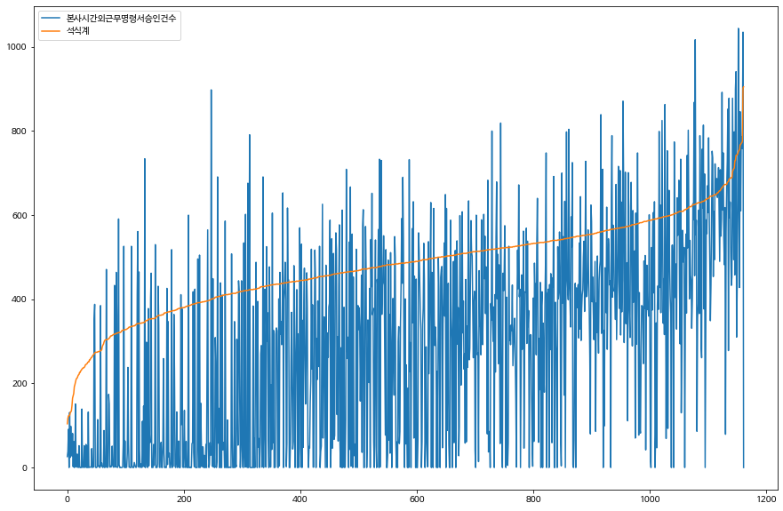

```python
from google.colab import drive
drive.mount('/content/drive')
```

    Mounted at /content/drive
    


```python
# 텐서플로 2 버전 선택
try:
    # %tensorflow_version only exists in Colab.
    %tensorflow_version 2.x
except Exception:
    pass
```

    Colab only includes TensorFlow 2.x; %tensorflow_version has no effect.
    


```python
import pandas as pd
import numpy as np
import tensorflow as tf
from tabulate import tabulate
```


```python
train = pd.read_csv('/content/drive/MyDrive/data_감정분석/train.csv', index_col=None) # Train
test = pd.read_csv('/content/drive/MyDrive/data_감정분석/test.csv', index_col=None) # Test
submission = pd.read_csv('/content/drive/MyDrive/data_감정분석/sample_submission.csv') # Submission
```


```python
train.head()
```


  <div id="df-11d90a11-3db7-4db7-aae8-f9d52d62d9a5">
    <div class="colab-df-container">
      <div>
<style scoped>
    .dataframe tbody tr th:only-of-type {
        vertical-align: middle;
    }

    .dataframe tbody tr th {
        vertical-align: top;
    }

    .dataframe thead th {
        text-align: right;
    }
</style>
<table border="1" class="dataframe">
  <thead>
    <tr style="text-align: right;">
      <th></th>
      <th>ID</th>
      <th>Utterance</th>
      <th>Speaker</th>
      <th>Dialogue_ID</th>
      <th>Target</th>
    </tr>
  </thead>
  <tbody>
    <tr>
      <th>0</th>
      <td>TRAIN_0000</td>
      <td>also I was the point person on my company’s tr...</td>
      <td>Chandler</td>
      <td>0</td>
      <td>neutral</td>
    </tr>
    <tr>
      <th>1</th>
      <td>TRAIN_0001</td>
      <td>You must’ve had your hands full.</td>
      <td>The Interviewer</td>
      <td>0</td>
      <td>neutral</td>
    </tr>
    <tr>
      <th>2</th>
      <td>TRAIN_0002</td>
      <td>That I did. That I did.</td>
      <td>Chandler</td>
      <td>0</td>
      <td>neutral</td>
    </tr>
    <tr>
      <th>3</th>
      <td>TRAIN_0003</td>
      <td>So let’s talk a little bit about your duties.</td>
      <td>The Interviewer</td>
      <td>0</td>
      <td>neutral</td>
    </tr>
    <tr>
      <th>4</th>
      <td>TRAIN_0004</td>
      <td>My duties?  All right.</td>
      <td>Chandler</td>
      <td>0</td>
      <td>surprise</td>
    </tr>
  </tbody>
</table>
</div>
      <button class="colab-df-convert" onclick="convertToInteractive('df-11d90a11-3db7-4db7-aae8-f9d52d62d9a5')"
              title="Convert this dataframe to an interactive table."
              style="display:none;">

  <svg xmlns="http://www.w3.org/2000/svg" height="24px"viewBox="0 0 24 24"
       width="24px">
    <path d="M0 0h24v24H0V0z" fill="none"/>
    <path d="M18.56 5.44l.94 2.06.94-2.06 2.06-.94-2.06-.94-.94-2.06-.94 2.06-2.06.94zm-11 1L8.5 8.5l.94-2.06 2.06-.94-2.06-.94L8.5 2.5l-.94 2.06-2.06.94zm10 10l.94 2.06.94-2.06 2.06-.94-2.06-.94-.94-2.06-.94 2.06-2.06.94z"/><path d="M17.41 7.96l-1.37-1.37c-.4-.4-.92-.59-1.43-.59-.52 0-1.04.2-1.43.59L10.3 9.45l-7.72 7.72c-.78.78-.78 2.05 0 2.83L4 21.41c.39.39.9.59 1.41.59.51 0 1.02-.2 1.41-.59l7.78-7.78 2.81-2.81c.8-.78.8-2.07 0-2.86zM5.41 20L4 18.59l7.72-7.72 1.47 1.35L5.41 20z"/>
  </svg>
      </button>

  <style>
    .colab-df-container {
      display:flex;
      flex-wrap:wrap;
      gap: 12px;
    }

    .colab-df-convert {
      background-color: #E8F0FE;
      border: none;
      border-radius: 50%;
      cursor: pointer;
      display: none;
      fill: #1967D2;
      height: 32px;
      padding: 0 0 0 0;
      width: 32px;
    }

    .colab-df-convert:hover {
      background-color: #E2EBFA;
      box-shadow: 0px 1px 2px rgba(60, 64, 67, 0.3), 0px 1px 3px 1px rgba(60, 64, 67, 0.15);
      fill: #174EA6;
    }

    [theme=dark] .colab-df-convert {
      background-color: #3B4455;
      fill: #D2E3FC;
    }

    [theme=dark] .colab-df-convert:hover {
      background-color: #434B5C;
      box-shadow: 0px 1px 3px 1px rgba(0, 0, 0, 0.15);
      filter: drop-shadow(0px 1px 2px rgba(0, 0, 0, 0.3));
      fill: #FFFFFF;
    }
  </style>

      <script>
        const buttonEl =
          document.querySelector('#df-11d90a11-3db7-4db7-aae8-f9d52d62d9a5 button.colab-df-convert');
        buttonEl.style.display =
          google.colab.kernel.accessAllowed ? 'block' : 'none';

        async function convertToInteractive(key) {
          const element = document.querySelector('#df-11d90a11-3db7-4db7-aae8-f9d52d62d9a5');
          const dataTable =
            await google.colab.kernel.invokeFunction('convertToInteractive',
                                                     [key], {});
          if (!dataTable) return;

          const docLinkHtml = 'Like what you see? Visit the ' +
            '<a target="_blank" href=https://colab.research.google.com/notebooks/data_table.ipynb>data table notebook</a>'
            + ' to learn more about interactive tables.';
          element.innerHTML = '';
          dataTable['output_type'] = 'display_data';
          await google.colab.output.renderOutput(dataTable, element);
          const docLink = document.createElement('div');
          docLink.innerHTML = docLinkHtml;
          element.appendChild(docLink);
        }
      </script>
    </div>
  </div>


```python
for i in range(len(train['Target']. unique())):
  train.loc[train['Target']==train['Target'].unique()[i],'Target']= i
  i+=1
train
```


  <div id="df-6bca3727-1d5c-4cc9-b0bc-d52f47b3f6f1">
    <div class="colab-df-container">
      <div>
<style scoped>
    .dataframe tbody tr th:only-of-type {
        vertical-align: middle;
    }

    .dataframe tbody tr th {
        vertical-align: top;
    }

    .dataframe thead th {
        text-align: right;
    }
</style>
<table border="1" class="dataframe">
  <thead>
    <tr style="text-align: right;">
      <th></th>
      <th>ID</th>
      <th>Utterance</th>
      <th>Speaker</th>
      <th>Dialogue_ID</th>
      <th>Target</th>
    </tr>
  </thead>
  <tbody>
    <tr>
      <th>0</th>
      <td>TRAIN_0000</td>
      <td>also I was the point person on my company’s tr...</td>
      <td>Chandler</td>
      <td>0</td>
      <td>0</td>
    </tr>
    <tr>
      <th>1</th>
      <td>TRAIN_0001</td>
      <td>You must’ve had your hands full.</td>
      <td>The Interviewer</td>
      <td>0</td>
      <td>0</td>
    </tr>
    <tr>
      <th>2</th>
      <td>TRAIN_0002</td>
      <td>That I did. That I did.</td>
      <td>Chandler</td>
      <td>0</td>
      <td>0</td>
    </tr>
    <tr>
      <th>3</th>
      <td>TRAIN_0003</td>
      <td>So let’s talk a little bit about your duties.</td>
      <td>The Interviewer</td>
      <td>0</td>
      <td>0</td>
    </tr>
    <tr>
      <th>4</th>
      <td>TRAIN_0004</td>
      <td>My duties?  All right.</td>
      <td>Chandler</td>
      <td>0</td>
      <td>1</td>
    </tr>
    <tr>
      <th>...</th>
      <td>...</td>
      <td>...</td>
      <td>...</td>
      <td>...</td>
      <td>...</td>
    </tr>
    <tr>
      <th>9984</th>
      <td>TRAIN_9984</td>
      <td>You or me?</td>
      <td>Chandler</td>
      <td>1038</td>
      <td>0</td>
    </tr>
    <tr>
      <th>9985</th>
      <td>TRAIN_9985</td>
      <td>I got it. Uh, Joey, women don't have Adam's ap...</td>
      <td>Ross</td>
      <td>1038</td>
      <td>0</td>
    </tr>
    <tr>
      <th>9986</th>
      <td>TRAIN_9986</td>
      <td>You guys are messing with me, right?</td>
      <td>Joey</td>
      <td>1038</td>
      <td>1</td>
    </tr>
    <tr>
      <th>9987</th>
      <td>TRAIN_9987</td>
      <td>Yeah.</td>
      <td>All</td>
      <td>1038</td>
      <td>0</td>
    </tr>
    <tr>
      <th>9988</th>
      <td>TRAIN_9988</td>
      <td>That was a good one. For a second there, I was...</td>
      <td>Joey</td>
      <td>1038</td>
      <td>4</td>
    </tr>
  </tbody>
</table>
<p>9989 rows × 5 columns</p>
</div>
      <button class="colab-df-convert" onclick="convertToInteractive('df-6bca3727-1d5c-4cc9-b0bc-d52f47b3f6f1')"
              title="Convert this dataframe to an interactive table."
              style="display:none;">

  <svg xmlns="http://www.w3.org/2000/svg" height="24px"viewBox="0 0 24 24"
       width="24px">
    <path d="M0 0h24v24H0V0z" fill="none"/>
    <path d="M18.56 5.44l.94 2.06.94-2.06 2.06-.94-2.06-.94-.94-2.06-.94 2.06-2.06.94zm-11 1L8.5 8.5l.94-2.06 2.06-.94-2.06-.94L8.5 2.5l-.94 2.06-2.06.94zm10 10l.94 2.06.94-2.06 2.06-.94-2.06-.94-.94-2.06-.94 2.06-2.06.94z"/><path d="M17.41 7.96l-1.37-1.37c-.4-.4-.92-.59-1.43-.59-.52 0-1.04.2-1.43.59L10.3 9.45l-7.72 7.72c-.78.78-.78 2.05 0 2.83L4 21.41c.39.39.9.59 1.41.59.51 0 1.02-.2 1.41-.59l7.78-7.78 2.81-2.81c.8-.78.8-2.07 0-2.86zM5.41 20L4 18.59l7.72-7.72 1.47 1.35L5.41 20z"/>
  </svg>
      </button>

  <style>
    .colab-df-container {
      display:flex;
      flex-wrap:wrap;
      gap: 12px;
    }

    .colab-df-convert {
      background-color: #E8F0FE;
      border: none;
      border-radius: 50%;
      cursor: pointer;
      display: none;
      fill: #1967D2;
      height: 32px;
      padding: 0 0 0 0;
      width: 32px;
    }

    .colab-df-convert:hover {
      background-color: #E2EBFA;
      box-shadow: 0px 1px 2px rgba(60, 64, 67, 0.3), 0px 1px 3px 1px rgba(60, 64, 67, 0.15);
      fill: #174EA6;
    }

    [theme=dark] .colab-df-convert {
      background-color: #3B4455;
      fill: #D2E3FC;
    }

    [theme=dark] .colab-df-convert:hover {
      background-color: #434B5C;
      box-shadow: 0px 1px 3px 1px rgba(0, 0, 0, 0.15);
      filter: drop-shadow(0px 1px 2px rgba(0, 0, 0, 0.3));
      fill: #FFFFFF;
    }
  </style>

      <script>
        const buttonEl =
          document.querySelector('#df-6bca3727-1d5c-4cc9-b0bc-d52f47b3f6f1 button.colab-df-convert');
        buttonEl.style.display =
          google.colab.kernel.accessAllowed ? 'block' : 'none';

        async function convertToInteractive(key) {
          const element = document.querySelector('#df-6bca3727-1d5c-4cc9-b0bc-d52f47b3f6f1');
          const dataTable =
            await google.colab.kernel.invokeFunction('convertToInteractive',
                                                     [key], {});
          if (!dataTable) return;

          const docLinkHtml = 'Like what you see? Visit the ' +
            '<a target="_blank" href=https://colab.research.google.com/notebooks/data_table.ipynb>data table notebook</a>'
            + ' to learn more about interactive tables.';
          element.innerHTML = '';
          dataTable['output_type'] = 'display_data';
          await google.colab.output.renderOutput(dataTable, element);
          const docLink = document.createElement('div');
          docLink.innerHTML = docLinkHtml;
          element.appendChild(docLink);
        }
      </script>
    </div>
  </div>


```python
import matplotlib.pyplot as plt
plt.hist(train['Target'], bins=7, rwidth=0.8)
plt.show()
```


    

    


# train


```python
from nltk.corpus import stopwords
from nltk.tokenize import word_tokenize 
import nltk
nltk.download('stopwords')
import nltk
nltk.download('punkt')
```

    [nltk_data] Downloading package stopwords to /root/nltk_data...
    [nltk_data]   Unzipping corpora/stopwords.zip.
    [nltk_data] Downloading package punkt to /root/nltk_data...
    [nltk_data]   Unzipping tokenizers/punkt.zip.
    


    True


```python
sentences=list(train.iloc[:,1])
vocab = {}
X_train = []
stop_words = set(stopwords.words('english'))
for sentence in sentences:
 # 단어 토큰화
 tokenized_sentence = word_tokenize(sentence)
 result = []
 for word in tokenized_sentence:
  word = word.lower() # 모든 단어를 소문자화하여 단어의 개수를 줄인다.
  if word not in stop_words: # 단어 토큰화 된 결과에 대해서 불용어를 제거한다.
    if len(word) > 1: # 단어 길이가 1이하인 경우에 대하여 추가로 단어를 제거한다.
      result.append(word)
      if word not in vocab:
            vocab[word] = 0
      vocab[word] += 1
 X_train.append(result)
print(X_train)
```

    [['also', 'point', 'person', 'company', 'transition', 'kl-5', 'gr-6', 'system'], ['must', 'hands', 'full'], [], ['let', 'talk', 'little', 'bit', 'duties'], ['duties', 'right'], ['heading', 'whole', 'division', 'lot', 'duties'], ['see'], ['perhaps', '30', 'people', 'dump', 'certain', 'amount'], ['good', 'know'], ['go', 'detail'], ['beg'], ['right', 'definite', 'answer', 'monday', 'think', 'say', 'confidence', 'fit', 'well'], ['really'], ['absolutely', 'relax'], ['waitress', 'went', 'last', 'month'], ['know', 'forget'], ['no-no-no-no', 'talking'], ['i-i-i-i', "n't", 'actually', "n't", 'know'], ['ok'], ['right', 'well', '...'], ['yeah', 'sure'], ['hey', 'mon'], ['hey-hey-hey', 'wan', 'na', 'hear', 'something', 'sucks'], ['ever'], ['chris', 'says', 'closing', 'bar'], ['way'], ['yeah', 'apparently', 'turning', 'kinda', 'coffee', 'place'], ['coffee', 'gon', 'na', 'hang'], ['got'], ['get', 'beer'], ['hey', 'pick', 'roommate'], ['betcha'], ['italian', 'guy'], ['um-mm', 'yeah', 'right'], ['oh', 'god', 'oh', 'god', 'poor', 'monica'], [], [], ['wrote', 'poem'], ['look', "'my", 'vessel', 'empty', 'nothing', 'inside'], ["'ve", 'touched', 'seem', 'emptier', 'still'], ['thinks', 'monica', 'empty', 'empty', 'vase'], ['oh', 'totally', 'oh', 'god', 'oh', 'seemed', 'happy'], ['done'], ['hey'], ['hi'], [], ['ah', "y'know", 'building', 'paper', 'route', '...'], ['oh'], ['hi'], ['hi'], ['go'], ['oh', 'well', 'woman', 'interviewed', 'pretty', 'tough', "y'know", 'thank', 'god', 'mark', 'coached', 'started', 'talking', 'fall', 'line', 'got', 'happy', 'shut'], ['proud'], [], ['listen', 'ah', 'sorry', 'crazy', 'jealous', 'like', 'lot', '...'], ['know'], ['yeah'], ['yeah'], ['ameri-can'], ['ameri-ccan'], ['ameri-can', "y'know"], ['everybody'], ['good', 'job', 'joe', 'well', 'done', 'top', 'notch'], ['liked', 'really', 'liked'], ['oh-ho-ho', 'yeah'], ['part', 'exactly'], ['whole', 'thing', 'go'], ['oh', 'no-no-no', 'give', 'specifics'], ['love', 'specifics', 'specifics', 'best', 'part'], ['hey', 'scene', 'kangaroo', 'did-did', 'like', 'part'], ['surprised', 'see', 'kangaroo', 'world', 'war', 'epic'], ['fell', 'asleep'], ['kangaroo'], ['take', 'suggestions'], ['coming', 'buddy'], ['see', 'later'], ['go'], ['sorry'], ['sorry'], ['look'], ['guy', 'fell', 'asleep'], ['fell', 'asleep'], ['mad'], ['call', 'ambulance'], ['okay', 'look', 'think', 'tell', 'rachel', 'messed', 'dessert'], ['everybody', 'thanksgiving', '...', 'truth-day'], ['yes', 'dying', 'wish', 'ring'], ['see', 'buried', 'ring', 'spirit', 'going', 'wander', 'nether', 'world', 'eternity'], ['okay', 'enough', 'honey'], ['know', 'let', 'see', 'ring'], ['great', 'okay'], ['right'], ['thank', 'thank', 'thank'], ["'ve"], ['oh', 'know', 'usual', 'teaching', 'aerobics', 'partying', 'way', 'much'], ['oh', 'case', 'wondering', 'legs', 'new', 'james', 'bond', 'poster'], ['hold', 'moment', 'another', 'call', 'love'], ['know'], ["'m", 'back'], ['gon', 'na', 'get', 'together'], ['um', 'absolutely', 'uh', "'bout", 'tomorrow', 'afternoon', 'know', 'uh', 'central', 'perk', 'village', 'say', 'five-ish'], ['great', "'ll", 'see'], ['ok.', 'ok.', 'phone', 'finally', 'paid'], ['even', 'though', 'good', 'bob', 'impression', "'m", 'thinkin', 'sees', 'tomorow', "'s", 'probably', 'gon', 'na', 'realize', '``', 'hey', "'re", 'bob', "''"], ["'m", 'hoping', 'bob', "n't", 'show', 'seek', 'comfort', 'open', 'arms', 'wry', 'stranger', 'next', 'table'], ['oh', 'god', 'pure', 'evil'], ['ok', 'pure', 'evil', 'horny', 'alone', "'ve", 'done'], ['nobody'], ['nobody', 'respects', 'bucket'], ['would', "n't", 'believe', 'people', 'put'], ['look'], ['okay', 'look', 'like', 'garbage'], [], ['wedding'], ['right', 'know', 'really', 'late', 'let', 'go', 'let', 'go', 'let', 'go'], ['fine', 'll-you', 'watch', 'video', 'get', 'back'], ['go', 'phoebe', 'go', 'phobo', 'phewbedo', 'phaybobo'], ['thank'], ['thank'], ['right', 'let', 'go', 'bye', 'pheebs'], ['bye', 'pheebs'], ['london', 'baby'], ['oh', 'need', 'hug', 'bring', 'anything'], ['hey'], ['hey', 'estelle', 'lined', 'bunch', 'auditions', 'tomorrow', 'health', 'insurance', 'back', 'time'], ['great', 'toilet', 'right'], [], ['wrong'], ['nothing'], ['well', 'i-i', 'got', 'blinding', 'pain', 'stomach', 'lifting', 'weights', 'uh', 'passed', 'uh', 'able', 'stand', 'since'], ['um', 'think', 'anything', 'serious'], ['sounds', 'like', 'hernia', 'to—you-you', 'go', 'doctor'], ['way', 'kay', 'look', 'go', 'doctor', 'anything', 'gon', 'na', 'thing', 'sticking', 'stomach'], ['hernia'], ['start', 'working', 'damn', '15s'], ['love', 'place', 'guy'], ['uh', 'eighteenth', 'century', 'indian', 'artifact', 'calcutta'], ['oh', 'wow', 'dinosaurs'], ['much'], ['well', 'well', 'sum', 'fun', 'look', 'young'], ['okay'], ['enough', 'so…', 'so…here', 'key', 'apartment'], ['really'], ['really'], ['think', 'fast'], ['get'], ['ross', 'talk', 'minute'], ['yes', 'please', "'s", 'going'], ['uh', 'well', '...', 'joey', 'broke'], ['oh', 'god', 'wh-what', 'happened'], ['joey', 'great', 'guy', "'re", '...', 'different', 'mean', 'speech', 'kept', 'laughing', 'homo', 'erectus'], ['knew'], ['anyway', 'uh', 'think', "'s", 'best'], ['hey', 'ok'], ['guess'], ['hum', '...', 'another', 'reason', 'thought', 'time', 'end', 'joey'], ['started', 'realize', 'feelings', 'someone', 'else'], ['ok', 'geller', 'last', 'day', 'conference', 'know', 'happens', 'keynote', 'speaker'], ['oh', 'professor', 'clerk', "'re", 'kind', 'middle', 'conversation'], ['yeah', 'guys', 'throw', 'pool', 'later'], ['could', 'throw'], ['ok', 'gentlemen'], ['please'], ["n't", 'little', 'old'], ['mean', "'re", 'scientists', 'right'], ["'re", 'academics'], ['importantly', '...', 'you-you', 'catch', 'us', 'first'], ['go', 'go', 'go'], ['go', 'go', 'go'], ['oh', 'yeah', 'everybody', 'wants', 'hat'], ['oy'], ['sand'], ['oh', 'yeah', 'bob', 'said', 'might', 'flood', 'damage'], ['yeah', 'either', 'really', 'big', 'cat'], ['okay', 'see', 'blind', 'guy', 'right', "'m", 'gon', 'na', 'bash', 'head', 'later'], ['oh', 'umm', 'big', 'scene', 'coming', 'big', 'scene', 'coming'], ['said', '``', 'big', 'lima', 'bean', 'bubbling', "''", 'would', 'understand', 'difference'], ['rach'], ['oh', 'boy', 'ca', "n't", 'watch', "'s", 'scary'], ["'s", 'diaper', 'commercial'], ['oh', 'yeah', 'well', 'know', 'babies', 'responsibilities', 'ahhh'], ['pizza', 'delivery'], ["'ll", 'get', 'get'], ['hi'], ['hi'], ['hey', 'wan', 'na', 'get', 'something', 'eat', 'uh', 'wan', 'na', 'see', 'long', 'throw', 'ball', 'back', 'forth', 'huh'], ['uhh', 'ball', 'thing'], ['yeah'], ['hey', 'ross', 'would', "n't", 'great', 'could', 'go', 'two', 'straight', 'hours', 'without', 'dropping'], ['uhh'], ['okay'], ['uh-oh'], [], ['pee', 'rachel', "'s", 'bathroom'], ['man', "n't", 'think', 'gon', 'na', 'make'], ['know', "n't", 'switch', 'hands', 'okay'], ['hey'], ['hey'], ['go', 'erin'], ['oh', 'unbelievable', 'best', 'time'], ['yay', 'oh', 'mad', 'us', 'anymore'], [], [], [], ['guys', 'totally', 'right'], ['much', 'better', 'first', 'time', 'went'], ['know'], ['awkward', 'really', 'nervous'], ['sleep', 'together'], ['yeah', 'really', 'calms'], [], ['much', 'common'], ['loves', 'sandwiches', 'sports', 'although', 'met', 'fan', 'much', 'issue', 'ever', 'kids', 'well'], ['oh', 'god', 'listen', 'talkin', 'kids', 'oh', 'joey', 'oh', 'please', 'get', 'married'], ['okay'], [], ['sleep', 'public', 'place'], ['would', 'look', 'peaceful'], ['oh', '...', 'hi'], ["'s", 'okay', "y'know", 'nodded'], ["'s", 'going'], ['got', 'sleep', 'last', 'night'], [], ['grandmother', 'new', 'boyfriend', "'re", 'kind', 'insecure', 'bed'], ['oh', 'deaf'], ["'re", 'constantly', 'like', 'reassure', "'re", 'good', 'time'], ['idea', 'loud'], ['well', 'want', 'stay', 'rachel', 'tonight'], ['thanks'], ['ew', 'something', 'exploded'], ["'s", 'water', 'breaking', 'calm'], ['water', 'breaking', 'mean', "'s", 'water', 'breaking'], ['breathe', 'breathe', 'breathe'], ['insane', 'mean', 'joey', 'going', 'kill', 'actually', 'going', 'kill', 'dead'], ['okay', 'think', 'thought'], ['know', 'one'], ['mean', 'unbelievable'], ['mean', 'gina'], ['one', 'gina'], ['dark', 'big', 'hair', 'airplane', 'earrings'], ['dina'], ['see', 'tell', 'one', 'either', 'dwha'], ['know', 'thought', 'see', 'saturday', 'funny'], ['look', 'honey', 'mark', 'fashion', 'okay', 'like', 'friend', 'share', 'stuff'], ['guys', 'would', 'never', 'want', 'go', 'lecture'], ['pa-haa', 'would', 'love', 'go'], ['really'], ['yeah', 'hey', 'i-i', 'clothes', 'even', 'pick'], ['mean', 'know', 'could', 'fashion', '.....', 'monger'], ['okay', 'honey', 'would', 'love', 'go'], ['wear', 'nervous'], ['know', 'hey', 'incredible', 'huh'], ['know', 'amazing', 'mean', 'totally', 'nailed', 'beautiful'], ['thank', 'listen', 'thanks', 'lot', 'tribbiani', 'oh', 'god', 'look', 'time', 'got', 'ta', 'catch', 'bus', 'ball'], ['oh', 'well', 'okay', 'good', 'luck'], ['yeah'], ['unless', 'wan', 'na', 'practice', 'foxtrot', 'or-or', 'tango'], ['ahh', 'thanks', 'see', 'i-i', 'think', 'ready', 'dance', 'girls'], ['okay'], ['yeah'], ['go', 'get', 'em', 'treeger'], ['right', 'hey', 'ahh', 'wan', 'na', 'come', 'marge', 'girlfriend'], ['really'], ['yeah', 'could', 'dance', 'real', 'good', 'size'], ['good'], ['oh', 'god', 'nerve', 'wracking', 'how-how'], ['well', 'unfortunately', "n't", 'get', 'many', 'callbacks'], ['good', 'sign', 'asked', 'us', 'hang', 'around', 'audition'], ['knows'], ['okay', 'uh', 'narrowed', 'raymond', 'ben', 'kyle', 'joey', 'rest', 'thank', 'much'], ['yes', 'knew', 'bye-bye', 'long', 'later'], ['oh', 'great', 'might', 'actually', 'get', 'play', 'ben', "'s", 'dad'], ['yeah'], ['actually', 'ca', "n't", 'happen'], ['yeah', 'different', 'looks', "'re", 'putting', 'raymond', 'kyle', 'ben'], ["'ll", 'either', 'two', 'two'], ['man', 'gon', 'na', 'kinda', 'weird'], ['yeah'], ['we-we', "'re", 'gon', 'na', 'like', 'best', 'friends', "'s", "'s", 'gon', 'na', 'weird'], ['okay', 'come', 'ca', "n't", 'get', 'married', 'get', 'something', 'old', 'something', 'new', 'something', 'borrowed', 'something', 'blue'], ['okay', 'right', 'right', 'right', 'okay', 'okay', "'s", 'something', "'s", 'something', 'blue', 'new'], ['please'], ['kidding'], ['i-i', 'hurt', 'three', 'huge', 'men', 'gave', 'guy', 'bloody', 'nose—i', 'mean', 'i-i', 'proud', 'really'], ['wonderful', 'amazing'], ['think', 'got', 'concussion'], ['serious', 'thank'], ['welcome', 'sorry', 'hurt'], ['worth', 'pain', 'know', 'know'], ['wow', 'mike', 'thing', 'interesting', "n't", 'know', "'s", 'gon', 'na', 'happen', 'phoebe', 'david'], ['want', 'hint', 'huh', '``', "''", '``', "''"], ['ok', "'m", 'sensing', 'kind', 'word', 'play', 'pink', 'barely', 'controlled', 'glee'], ['david', 'going', 'propose', 'phoebe'], [], ['chandler', 'talked'], ['supposed', 'give', 'people', 'advice'], ['could', "n't", 'made', 'sort', 'inappropriate', 'joke'], [], ["'ve", 'going', 'weeks', 'phoebe', 'completely', 'hung', 'mike'], ["'ll", 'say', '``', "''", 'david', "'s", 'heart', 'broken', 'hard', 'recover', 'phoebe', 'end', 'alone'], ['man', "'s"], ['oh', "'s", 'want', '...'], ['father', 'paul', 'stevens', 'dad', 'ross', 'geller'], ['it-it', 'great', 'meet', 'paul'], ['usually', 'prefer', 'elizabeth', 'boyfriends', 'address', 'mr.', 'stevens'], ['course', 'course', 'mr.', 'stevens'], ['ross', 'problem'], ['eh-wh—excuse'], ['get', 'girlfriend', 'age'], ['funny', 'umm…', 'funny'], [], ['okay'], ['see'], ['umm', 'think', 'give', 'umm', 'one', 'chance', 'change', 'mind'], ['okay'], [], ['okay', 'give', 'one', 'chance', 'change', 'mind', 'got', 'one', 'minute'], ['daddy'], ['oh', 'well', 'tv', 'yet'], ['well', 'wall', 'yet'], ['okay', 'fine', 'bring', 'tape', 'huh'], ['umm', 'matt', 'lauer', 'clothes', 'maybe', 'ones', 'cleaned', 'yet'], ['ooooohh'], ['oh', 'yeah', "'m", 'sure', 'sudden', 'hands', "n't", 'problem', 'anymore'], ['...'], ['oh', 'boy', 'scouts', 'could', 'camped'], ['``', 'ooo', "''"], ['uma', 'thurman'], ['oh'], ['actress'], ['thanks', 'rach'], ['gon', 'na'], ['tell'], ['tell'], ["'s", 'moral', 'obligation', 'friend', 'woman', 'think', "'s", 'feminist', 'issue'], ['guys'], ['guys'], ['oh', 'yeah', 'tell'], ['feminist', 'issue', "'s", 'went'], ['gon', 'na', 'hate'], ['yeah', 'well', '...'], ['marry'], ['big', 'night', 'wanted', 'wish', 'good', 'luck'], ['yeah', 'yeah', 'ring'], ['yeah', 'right', 'pocket', 'pheebs'], ['oh', 'oop'], ['okay', 'guys', 'get', 'want', 'surprise', 'gon', 'na', 'know'], ['yeah-yeah', 'guys', 'get'], ['hi', 'guys'], ['beautiful'], ['oh', 'thank', 'going'], ['really…very', 'excited', 'charity', 'event', 'go'], ['okay', 'umm', 'ross'], ["i'm-i", "'m", 'really', 'warm', "'m", 'going', 'taking', 'sweater'], ["'m", 'letting', 'know'], ['yep', "'s", 'hilarious'], ["'m", 'sorry', "'m", 'done', "'m", 'done'], ["y'know", 'last', 'night', 'embarrassing'], ['really', 'mean', "'ve", 'seen', 'naked', 'hundreds', 'times'], ['uh-huh', 'first', 'rest', 'building'], ['okay', 'right', "'s", 'true', "y'know", "n't", 'embarrass', 'easily'], ['totally', 'get', 'embarrassed'], ["n't", 'ross', 'think', "'m", 'secure', 'person'], [], ['yeah'], ['hey', 'lady', "n't", 'care', 'much', 'want', 'okay'], ['believe'], [], ['rode', 'bike'], ['never', 'thought', 'able'], ['thank', 'ross'], ['oh', 'hey', 'thank', 'thank', 'one', 'faced', 'fears', 'ultimately', 'overcame'], ['hey', 'guys'], ['mean', 'two', 'are-are', 'my…', 'mean', 'lucky', 'one', 'good'], ['thanks', 'man'], ['got', 'ta', 'go', 'check', 'something'], ['baby'], ['total', 'wuss'], ['okay', 'lot', 'options', 'number', 'prototypes', 'try'], ['wow', 'looks', 'great'], ['yeah', 'okay', 'one', 'mushroom', 'cap', 'umm', 'one', 'made', 'bologna'], ['and-and-and-and-and', 'toothpicks'], ['kissed', 'another', 'woman'], ['call', 'even'], ['okay'], ['well', 'gon', 'na', 'go', 'get', 'water'], ['wait', 'stole', 'people', 'wedding'], ['no-no', 'took', 'hotel', 'lobby'], ['yeah', 'think', 'charge', 'dirty', 'movie', 'bag', 'mashuga', 'nuts', 'got', 'another', 'think', 'coming'], ['hey'], ['sweater'], ['looking', 'like', 'month'], ['oh', 'god'], ['oh', 'god'], ['happy', 'supposed', 'vic', 'happy'], ['well', 'tell', 'supposed'], ['huh'], ['sure', 'hell', 'figure'], ['talk', 'nothin'], ['look', 'nothin'], ['nothing'], ['tasty', 'really', 'starting', 'feel', 'like', 'guys', 'history', 's-it', 'nice'], ['question', 'scene'], ['yes'], ['well', 'understand', 'adrienne', 'attracted', 'victor'], ['peel', 'onion', 'first', 'good', 'looking'], ['yeah'], ['think', 'character', 'gon', 'na', 'need', 'little', 'bit', 'reason'], ['oh', 'hey', 'one'], ['ah', 'says', 'script'], ["y'know", 'ah', 'i-i', 'know', 'character', 'likes', 'either', 'mean', 'says', 'script', 'bitch'], ['say', 'script'], ['mine'], [], ['yeah', 'got', 'ta', 'tell', 'girl', 'tape', 'rookie', 'mistake'], ['know', 'great', 'video', 'camera'], ['greg', 'jenny'], ['still', 'wan', 'na', 'call', 'em', 'wan', 'na', 'call', 'em'], ['let', 'call', 'em'], ['yeah', 'ask', 'brought', 'friends', 'souvenirs'], ['hello', 'eighth', 'street', 'deli'], ['hey', 'hang', 'get', 'food', 'poisoning', 'talkin', 'place'], ['uh', 'sorry', 'wrong', 'number'], ['go'], ['hello', 'deli'], ['right', 'sandwich'], ['think', 'number', 'right'], ['oh', 'come'], ['got', 'ta', 'go', 'miss', 'love', "'s", 'getting', 'real', 'late'], ['hey', 'listen', 'made', 'appointment', 'dr.', 'bazida', '...', 'excuse', 'know', "n't"], ['name', "'s", 'ronni', "'s", 'pet', 'mortician'], ['sure', 'long', '...'], ['remember', 'little', 'kid', 'used', 'take', 'navy', 'yard', 'show', 'big', 'ships'], ['since'], ["'s", 'six', 'years'], ['wanted', 'put', 'nice', 'memory', 'head', "'d", 'know', "n't", 'always', 'terrible', 'guy'], ['...', 'joe'], ["y'ever", 'love'], ['...', "d'know"], ["y'have", "n't", "'re", 'burning', 'tomatoes'], ["'re", 'one', 'talk'], ['joe', 'dad', "'s", 'love', 'big', 'time', 'worst', 'part', "'s", 'two', 'different', 'women'], ['oh', 'man', 'please', 'tell', 'one', "'em"], ['course', 'course', 'one', "'em", "'s", "'s", 'matter'], ['everything', 'gon', 'na', 'right', 'okay', 'dick'], ['hello', 'guru', 'saj', '--', 'whoa', 'supposed', 'duck', 'right', 'cause', 'otherwise', 'waaay', 'league'], ['hey', 'rach', 'work'], ['oh', 'great', 'although', 'sit', 'chair'], ['way', 'ross', 'dropped', 'box', 'stuff'], ['oh', 'well', 'guess', 'one', 'coming'], ['gon', 'na', 'throw', 'probably', 'bunch', 'shampoo', '...'], ['something', 'wrong'], ['nothing'], ['said', 'thing', 'bringing', 'mesozoic', 'era', '21st', 'century'], ['yeah', "'s"], ['yeah'], ['dude', 'sorry', 'said'], ['right', 'ridiculous', 'name'], ['bad'], ['yes', 'first', 'name'], ['bing'], ['apartment', 'back'], ['ace', 'high', 'jack', 'queen', 'king', 'ace'], ['ace', 'low', 'ace', 'two', 'three', 'four'], ['know', 'ooh', 'ooh', 'look', 'ah-ha'], ['right', 'cut', 'let', 'pick', 'pick'], ['okay'], ['come', 'apartment', 'come', 'apartment', 'oh', 'know', 'queen', 'high'], ['uh-huh', 'high', 'as…', 'worked', 'king'], ['yeah', 'baby'], ['pick', 'pick'], [], ['know'], ['tickets', 'please', 'courtside', 'baby'], ['seriously', 'good', 'game', 'though', 'good', 'game', 'mad', 'get', 'apartment', 'back'], [], ['know', "n't", 'think', 'brought', 'enough', 'stuff', 'forget', 'pack', 'baby', "'s", 'anvil'], ["'s", 'gon', 'na', 'worth'], ["'s", 'known', 'fact', 'women', 'love', 'babies', 'right'], ['women', 'love', 'guys', 'love', 'babies'], ["'s", 'whole', 'sensitive', 'thing'], ['quick', 'aim', 'pack', 'babes'], ['maybe', 'one', 'break', 'away'], ['wait', 'get', 'got', 'one', 'hard', 'left'], ['right', 'gim', 'baby'], ['got'], ['oh', 'seriously', 'want'], ['hello'], ['well', "n't", "n't", 'think', 'immodest'], ['wan', 'na', 'smell'], ['oh', 'yeah', "'s", 'got', 'great', 'baby', 'smell', 'get', 'whiff', 'head'], ["'d", 'tell', "'d", 'tell'], ['well', 'great', 'guys'], ['bye'], ['well', 'really'], ['mean', 'technically', 's-it', 'rules', 'anything', 'frowned', 'upon'], ['especially', 'professor', 'ran', 'last', 'night', 'judgey', 'von', 'holierthanthou'], ['well', 'ross', 'careful', 'want', 'get', 'reputation', 'know', 'professor', 'mcnailshisstudents'], ['yeah', 'what-what'], ['well', 'ross', 'seems', 'pretty', 'clear'], ['mean', 'important'], ['people', 'think', 'feel', 'huh'], ['ross', 'got', 'ta', 'follow', 'heart'], ['joey', 'sweet'], ['hey'], ['hey-hey-hey', 'go', 'dana', 'reason', 'leave', 'block', 'time', 'open', 'say', 'thursday'], [], [], ['hey', 'relax', 'need', 'time', 'going', 'dinner', 'tonight'], ['going'], ['going'], ['uh', 'dana', 'keystone', 'college'], ['oh', 'yeah', 'uh'], ['dana', 'caplin'], ['joey', 'even', 'know'], ['ah', 'whatever'], ['morning', 'hey', 'favorite', 'genius', 'little', 'robot', 'buddy'], ['touch'], ['okay'], ['right'], ['umm', 'right', 'wayne', 'level'], ['i-i', 'keep', 'hearing', 'rumors', 'might', 'get', 'fired'], ['okay', 'even', 'actors', 'coming', 'read', 'part'], ['come', 'man', 'you-you', 'got', 'give', 'second', 'chance'], ['mean', 'love-i', 'love', 'little', 'guy'], ['ah-ah'], ['okay', 'want', 'touch', 'right'], ['go'], ['okay'], ['stupid'], ['believe'], ['god'], ['hey', 'doin'], ['hey'], ['hi', 'look', 'um', 'happened', 'earlier', '...'], ['hey', 'well', 'i-i', 'completely', 'understand', 'stressed'], ['gon', 'na', 'give', 'chance', 'apologise'], ['letting', 'throw', 'office'], [], ['yeah', 'well', 'excuse', 'wanting', 'girlfriend', 'anniversary', 'boy', 'ass'], ['told', 'time'], ['yeah', 'well', 'never', 'time', 'mean', 'feel', 'like', 'even', 'girlfriend', 'anymore', 'rachel'], ['wh', 'ross', 'want'], ['want', 'want', 'quit', 'job', 'feel', 'like', 'girlfriend'], ['know'], ['ooh', 'tell', 'something'], [], ['tell'], ['okay', 'easier', 'tell', 'something', 'could', 'tell'], ['well', 'sure', 'perfect', 'world', 'promised', 'tell', 'swore', 'like', 'gods'], ['okay', 'ross', 'rachel'], [], ['joey'], [], ['with-with', 'chandler', 'sock', 'keeps', 'bed'], ['let', 'come', 'back', 'later'], ['hi'], ['richard'], ['actually', 'complement', 'chef'], ['ohh…', 'oh', 'okay', 'hate', 'people', 'come', 'back', 'complement', 'chef'], ['like', 'nothing', 'better'], [], ['well', 'great', 'seeing', 'night'], ['oh', 'good', 'see', 'come', 'tell'], ['came', 'tell', 'something', 'else', 'came', 'tell', 'still', 'love'], ['one', 'pregnant', 'woman', 'time', 'please', 'want', 'okay'], ['forcing', 'marry', 'bobby', 'gon', 'na', 'make', 'happen'], ['maybe', 'well', 'well…so-so', 'uh', 'kind', 'music', 'numb', 'nuts—oh', 'forget'], ['joey', 'scared', 'death'], ['really', 'think', 'gon', 'na', 'need', 'help'], ['bobby', 'gon', 'na', 'whole', 'time'], ['bet', 'answer', 'earlier', 'question', 'straight-up', 'gangster', 'rap'], ['look', 'rachel', 'told', 'much', 'easier', 'made'], ['cause…', 'cause', 'baby', 'sister'], ['big', 'brother'], ['mean', 'favorite', 'guy', 'whole', 'world'], ['even', 'scared', 'tell', 'mom', 'dad'], ['scared', 'telling'], ['well', 'scared', 'right'], ['joey', 'stand', 'thought', 'baby', 'mad'], ['want', 'uncle'], ['baby', 'gon', 'na', 'uncle', 'joey'], ['course', 'gon', 'na', 'uncle', 'joey'], ['gon', 'na', 'right', 'mean', 'even', 'married', 'baby', 'gon', 'na', 'loved', 'us'], ['right', 'uncle'], [], ['okay', 'bobby', 'come', 'let', 'little', 'moment'], ['come'], ['seriously', 'wrong'], ['really', 'nice', 'time', 'tonight'], ['i.', "'m", 'really', 'glad', 'monica', 'asked', 'us'], ["'d", 'love', 'ask', 'uh', 'sister', "'s", 'visiting', 'think', "'s", 'asleep', 'couch'], ["'re", 'sister', "'re", 'sister', "'s", 'asleep', 'couch', 'ohhh', 'saw'], ['oh', 'hey', 'great', "'re", 'rachel', 'sister', 'krista', 'krista', 'rachel'], ['hi'], ['nice', 'meet', 'wish', "'d", 'told', 'company', "'d", 'fix'], ['like', 'would', 'help'], ['bad'], [], [], [], [], [], [], ['dead', "'m", 'gon', 'na', 'get'], ['uh', 'nice', 'meeting'], ['oh', 'god', "'s", 'victoria', "'s", 'secret', 'model', 'something', '...', 'something', 'goodacre'], ['hi', 'mom', "'s", 'jill'], ["'s", 'right', "'s", 'jill', 'jill', 'goodacre', 'oh', 'god', 'trapped', 'atm', 'vestibule', 'jill', 'goodacre'], ['yeah', "'m", 'fine', "'m", 'stuck', 'bank', 'atm', 'vestibule'], ['jill', 'says', 'vestibule', '...', "'m", 'going', 'vestibule'], ["'m", 'fine', "'m", 'alone', '...', "n't", 'know', 'guy'], ['oh', 'guy', 'guy', "'hey", 'jill', 'saw', 'guy', 'last', 'night', 'yes'], ['seeing', 'anybody', 'right'], ['og-ee-op', 'asking', 'm…', 'mean…', 'm-i', 'gay', 'asking'], ['not-i', 'not-i', 'gay'], ['personal', 'shopping', 'like', 'walk', 'around', 'snooty', 'rich', 'people', 'tell', 'buy'], ['uh-huh'], ['sounds', 'great'], ['hey'], ['umm', 'excuse', 'switched', 'apartments', 'eat', 'food', 'anymore', 'that-that', 'gravy', 'train', 'ended'], ['gravy'], ['big', 'apartment', 'deal', 'people', 'coming', 'time'], ['fridge', 'got', 'stocked', 'okay', 'department'], [], ['think', 'left', 'donut'], ['conclusion', 'lines', 'go', 'happy'], ['great', 'job', 'team'], ['tomorrow', '8:30'], ['phil'], ['nice', 'job'], ['stevens'], ['way', 'go'], ['joel-burg', 'maniac'], ['love', 'ya'], ['bing'], ['oh', 'excuse', 'forgot', 'briefcase', "y'know", 'accident'], ['course'], ['forgot', 'something', 'else', 'ya', 'bastard'], ['well'], ['feeling', 'left', 'anything', 'ya'], ['s-that', 'ridiculous'], ['everybody', 'else', 'got', 'one', 'want', 'one'], ['ye-ye-yeah', 'yes'], ['get'], ['hey', 'bob'], ['hey', 'pal', 'toby', 'today'], ['see', 'ask'], ['toby'], ['yeah'], ['oh', 'know'], ['semi-first', 'name', 'basis'], ['think', 'adding', 'team'], ['bob', 'ooh', 'working', 'us', 'everyday', 'yeah', 'know', 'takes'], ['really', 'love', 'six'], ['eleven', 'almost', 'twice', 'hard'], ['hey', 'guess', 'got', 'wedding'], ['freakish', 'thin', 'date', 'hanger', 'head'], ['rachel', 'hooked', 'tux', 'tux', 'batman', 'tux'], [], ['right', 'made', 'expressly', 'val', 'kilmer', 'worn', 'hit', 'film…that', 'batman', 'film'], ['wear', 'wearing', 'famous', 'tux', 'james', 'bond', 'tux'], [], ['so—if', 'wear', 'make', 'mine', 'less', 'special'], ['sorry', 'like', 'idea', 'say', '``', "''", 'thinking', '``', 'yeah', "''"], ['well', 'still', 'problem'], ['yeah'], [], ['well', 'trying', 'find', 'someone', 'perform', 'wedding', 'either', 'boring', 'annoying', 'know', 'stop', 'staring', 'ladies'], ['oo', 'one', 'us'], ['phoebe', 'getting'], ['s-it', 'uh', 'real', 'thing', 'anyone', 'get', 'ordained', 'internet', 'perform', 'like', 'weddings', 'stuff'], ['call'], ['idea'], ['guys', 'thank', 'much', 'neither', 'marrying', 'us'], ['calling', 'mean', 'anything', 'anymore'], ['going', 'legitimate', 'member', 'clergy', 'say', 'legitimate', 'mean', 'gay', 'control', 'saliva'], ['see', 'see', '....', 'big', 'passion', 'future'], ['really'], [], ['oh', 'ross', "'re", 'great', 'playfully', 'rubs', 'head', 'gets'], ['supposed', 'good', 'thing', 'forget'], ['listen', 'monica', 'know', 'okay', 'know', 'sleep', 'like', 'month', 'got', 'like', 'dot', 'ink', 'one', 'sofa', 'cushions'], ['well', 'you-you', 'coulda', 'turned', 'cushion'], ['yeah', 'would', 'except', 'big', 'spaghetti', 'stain', 'side'], [], ['okay', 'talking', 'i-i', 'need', 'live', 'land', 'people', 'spill'], ['spill', 'sink'], ['aw', 'honey', 'fault', "y'know", 'love', 'want', 'us', 'friends', 'keep', 'living', 'see', 'happening'], ['love'], ['aww', 'good'], ['said'], ['wondering', 'cushion'], ['oh', 'god', 'serious'], ['uh-huh'], ['would', 'love', 'live', 'ross', '..', 's-that', 'great', 'thank'], ['well', 'm-i', 'glad', 'could', 'know', 'help'], ['ross-ross', 'idea', 'means'], ['mean', 'mean', 'gon', 'na', 'homeless'], ['saved'], ['hero'], ['hero', 'uh', 'know—well', 'right'], ['oh', 'go', 'tell', 'monica', 'wonderful', 'brother'], ['oh', 'please', 'gon', 'na', 'say', 'things', 'ya'], [], [], ['tell', 'exact', 'thing', 'happened', 'roommate', 'denise'], ['moved', 'guy', 'secretly', 'married', 'said', 'love', 'really', 'blew'], ['...', 'dammit', 'hire', 'girl', 'okay', 'everybody', 'ready'], ['uh', 'listen', 'wan', 'na', 'thank', 'great', 'opportunity'], ['lose', 'robe'], [], ["'s", 'great'], ['well', "'m", 'gon', 'na', 'get', 'another', 'espresso', 'get', 'another', 'latte'], ["'m", 'still', 'working', 'mine'], ["'s"], ['yeah', 'really', 'hard'], ['oh', 'yeah', 'hug', 'looked', 'pretty', 'brutal'], ['ok', "n't"], ['wow', 'ah', 'pretty', 'nice'], ['pretty', 'nice'], ['pardon', 'roommate', 'wanted', 'marry'], ['50', 'bucks', 'would', 'willing', 'trade', 'got', 'canoe'], ["y'know", 'really', 'think', 'need', 'canoe'], ['got', 'ta', 'take', 'canoe'], ['right', 'take', 'entertainment', 'center', 'get', 'home', 'throw', 'canoe', 'away'], ['throwing', 'away', 'built', 'canoe'], ['good'], ['pheebs'], ['yeah'], ['okay', 'guess', 'wait', 'hi', 'need', 'one', 'fake', 'ticket', 'yemen'], ['one', 'ticket', 'yemen'], ['oh', 'no-no-no', 'need', 'pretend', 'ticket'], ['sorry', 'sir', 'understand'], ['would', 'give', 'kid', 'wanted', 'ticket', 'play'], ['travelling', 'child'], [], ['right', 'know', 'gon', 'na', 'think', 'handing', 'credit', 'card', 'really', 'gon', 'na', 'hand', 'library', 'card'], ['okay', 'last', 'time'], ['chick-chick', 'chick-chick'], ['chick', 'chick', 'everywhere', 'chick-chick', '--', 'chickeeeen'], ['hey'], ['hey'], [], [], ['well', 'yeah', 't-don', 'think'], ['know', 'tell', 'ever', 'went', 'back', 'quickly'], ['well', 'anyway', 'got', 'go', 'change', 'ah', 'meeting', 'cast', 'drinks'], ['excuse'], [], ['okay', 'good', 'go', 'go', 'vince'], ['yeah', 'jason', "'s", 'really', 'sensitive'], ['well', 'sensitive', 'important', 'pick'], ['yeah'], ['oh', 'sure', 'go', 'sissy'], ['jason', 'sissy'], ['oh', 'no-no-no-no', 'meant', 'chandler'], ['hi'], ['uh', 'apparently', 'people', 'familiar', 'europe', 'story'], ['yeah'], ['listen', 'whole', 'uh', 'came', 'thing', 'really', 'matter'], ['mean', 'think', 'would', 'happened', 'either', 'way'], ['mean', 'initiated', 'i-i-i', 'know', 'would'], ['amazing', 'night'], ['amazing', 'night'], ['think', 'looked', 'amazing'], ['name', 'yet'], ['yet'], ['fine', 'call', 'baby', 'girl', 'green'], ['oh', 'baby', 'girl', 'geller-green'], ['hello', 'baby', 'girl'], ['ah-ha', 'nowhere', 'run'], ['like', 'sitting', 'gon', 'na'], ['rachel', 'got', 'first'], ['ross'], ['danger'], ['oh', 'god', 'jumping', 'women'], ['right', 'worry'], ['oh', 'look', 'gon', 'na', 'leave', 'stain'], ['rach', 'hey', 'fine', 'joey'], ['really'], ['yeah', 'look'], ['never', 'lived', 'like'], ['know'], ['right', 'waste', 'mean', 'still', 'food'], ['hey', 'joey', 'bed', 'olivia', 'lost', 'virginity'], ["n't", 'know', 'one', 'extras', 'sure', 'hey', 'listen', 'rach', 'thanks', 'coming', 'watch', 'scenes'], ['oh', 'please', 'honey', 'fact', 'want', 'support', "'m", '...', 'oh', 'god', 'christian', 'sanders', "'s"], ['also'], ['oh', 'head', "'s", 'done', 'pretty', '``', 'not-gay-stuff', "''"], ['well', 'christmas', 'party', 'santa', 'definitely', 'gay', 'stuff'], ['ok', "'ve", 'got', 'promise', "'ll", 'never', 'ever', 'tell', 'ross', 'told'], [], ["'s", 'planning', 'birthday', 'party'], ['oh', 'god', 'love'], ["'d", 'better', 'act', 'surprised'], [], ['surprise', 'party'], ['surprise', 'party'], ['oh', 'stop', 'joey', 'already', 'told'], ['well', "n't", 'tell'], ['hey', "n't", 'look', 'ross', "'s", 'thing'], ['typical', "'m", 'always', 'last', 'one', 'know', 'everything'], ['tell', 'stuff'], ['yuh-huh'], ['last', 'one', 'know', 'chandler', 'got', 'bitten', 'peacock', 'zoo'], ['last', 'one', 'know', 'crush', 'joey', 'moving'], ['looks', 'like', 'second', 'last'], ['chandler', 'still', 'gotten', 'rsvp', 'dad'], ['oh', 'right', 'umm', 'maybe', 'send', 'invitation'], ['chandler', 'father', 'wedding'], ['even', 'know', 'man', 'okay', 'close', 'seen', 'years'], ['well', 'gon', 'na', 'finds', 'even', 'asked'], ['like', 'run', 'circles'], ['hang', 'guys', 'stars', 'drag', 'show', 'vegas'], ['ooh', 'think', 'wan', 'na', 'trade', 'circles'], ['nobody', 'gon', 'na', 'staring', 'bride', 'father', 'groom', 'wearing', 'back-less', 'dress'], ['long', 'wearing', 'white', 'dress', 'veil', 'care'], ['okay', 'think', 'need', 'shopping'], ['hello'], ['ya', 'doin'], ['hell'], ['guess', 'believe', 'said', 'kurt', 'douglas', 'huh'], ['no-no', 'rachel', 'get', 'see', 'us'], ['yeah', 'groom', 'see', 'bride'], ['gon', 'na', 'marry', 'chandler'], [], ['okay', 'guys', 'relax', 'doooo'], ['got', 'ta', 'go'], ['oh', 'wait', 'joshua', 'joshua', 'yeah', 'well', 'oughta'], ['sorry', "'m", 'late', 'left', 'late'], ['okay'], ['pheebs', 'book'], ['thought', 'said', 'read', 'high', 'school'], ['well', 'yeah', 'remembered', 'started', 'pep', 'rally', 'top', 'pyramid', 'anyway—umm', 'book'], ['excuse', 'bum', 'one'], ["y'know", 'actually…', 'okay', 'okay', 'okay', "'s", 'funny'], ['thought', "n't", 'smoke'], ['oh', 'thought', 'guys', 'meant', 'marijuana', 'cigarettes', "y'know"], ["y'know", 'mean', 'like', 'dubbies'], ['actually', 'thought', '``', 'wow', 'guys', 'crazy', "''"], ['actually', 'smoke', 'regular', 'ones', 'time'], ['get', 'high'], ['oh'], ["'m", 'kidding'], ['oh'], ['oh', 'sure', "'re", 'ok'], ['yeah'], ['still', 'hurt'], ['yeah'], ['neat', 'idea', 'clothes', 'match', "'m", 'gon', 'na'], ['hi'], ['hey', "'d", 'go'], ['excellent'], ['ripped', 'couple', 'apart', 'kept', 'pieces'], ['beautiful', 'story', 'hey', "'m", 'fine', 'way'], ['know', 'right'], ['good', 'pheebs'], ['ok'], ['okay', 'guys', 'microphones', "n't", 'mean'], ['sucks', 'know', 'stay', 'night', 'went', 'stupid', 'sleep', 'clinic', 'tired'], ['6:00'], ['hi'], ['yeah', 'rach', 'think', 'handling', 'really', 'well'], ['handling'], ['mean', 'handling'], ['nothing', 'handle'], ['maybe', 'would', 'problem', 'joshua'], ['know', 'gon', 'na', 'get', 'married', 'anyway'], [], ['come'], ['rushed', 'thing', 'fast', 'ridiculous'], ['somewhere', 'along', 'way', 'one', 'gon', 'na', 'realise', 'done', 'call', 'whole', 'thing'], ['telling', 'ya', 'gon', 'na', 'dancing', 'wedding', 'dancing'], ['hell'], ['actually', 'thought', 'would', 'make', 'feel', 'better', 'give', 'stuff', 'use', 'another', 'two', 'months'], ['sucks'], ['right', 'next', 'present'], ['right', 'nuclear', 'holocaust', 'last', 'man', 'earth', 'would', 'go'], ['enhh'], ['got', 'canned', 'goods'], ['hey', 'guys', 'take', 'look', 'check', 'baby', 'dug', 'hole'], ['excellent', 'hole', 'joe'], ['oh', 'hole'], ['ow', 'ow'], [], ['drinking'], ['oh', 'must', 'said', 'left'], ['said', 'exactly'], ['enjoyed', 'occasional', 'drink…ing', 'binge'], ['oh', 'god', 'ohh', 'leaving', 'horrible', 'person'], ['wait-wait-wait-wait-wait-wait-wait-wait'], ['gon', 'na', 'get', 'sensitive'], ['want', 'lose'], ['create', 'position'], ['make', 'assistant', 'buyer', 'department'], ['say', 'things', 'like'], ['office', 'raise', 'effective', 'tomorrow'], ['need', 'expense', 'account'], ['done'], ['assistant'], ['sophie', 'get'], ['monica', 'gon', 'na', 'proud', 'got', 'us', 'dates', 'two', 'unbelievably', 'cute', 'nurses'], ['oh'], ["'re", 'male', 'nurses'], ['head'], ['anyway', 'want', 'take', 'us', 'saturday', 'night', 'say'], ['umm', 'umm', 'umm', "n't", 'think'], [], ['talking'], ['you-you', "'re", 'one', "'s", 'telling', 'get', 'ross', 'move'], ["'m", 'moving', "'re", 'moving'], ['come', 'give', 'one', 'good', 'reason', "n't", 'wan', 'na', 'go'], ['umm', "n't", 'give'], [], ['harder', 'sounds', "n't"], ['okay', "'re", 'coming', 'also', 'told', "'re", 'still', 'get', "'ll", 'go', 'cafeteria'], ['yep', "'s", 'always', 'room'], ['joey', 'make'], ['oh', "'s", 'easy', 'yeah', 'i-i', 'anything', 'watch', 'uh', 'grandma', "'s", 'chicken', 'salad'], ['hello', 'monica', '...'], ['yeah'], ['oh', '...'], ['okay', 'yes', "'ll", 'right', "'ll", 'right'], ['thank'], ['okay', 'let', 'bring'], ['wait', 'honey', 'honey', 'throw', 'throw'], ['go'], ['almost', 'hit', 'face'], ['well', 'magician', 'open', 'beer', 'cheeks', 'right'], ['hey'], ['hey'], ['know', 'm-i', 'really', 'glad', 'decided', 'sleep', 'together', 'wedding'], ['oh', 'boy'], ['know', 'thinking', 'a…a', 'big', 'fight', 'uh', 'broke', 'hours'], ['yeah'], ['technically', 'could', 'sex', 'think', 'bossy', 'domineering'], ['wedding', 'sloppy', 'immature'], ['come'], ['okay', 'wait', 'cousin', 'cassie', 'guest', 'room', 'supposed', 'lunch'], ['well', 'get', 'rid', 'obsessive', 'shrill'], ['shrill', 'wedding', 'back'], ['thought', 'heard', 'voices', 'must', 'chandler'], ['hi', 'nice', 'meet'], ['nice', 'meet'], ['ready', 'go'], ['yeah'], ['chandler'], ['right'], ['th-th-that', "'s", 'third', 'nipple'], ['run-of-the-mill', 'third', 'nipple'], ['take'], ['slice', 'baby', 'right'], ['take', 'shirt', 'let', "'s", 'see', "'re", 'dealing'], ['showing', 'run-of-the-mill-slice-it-right-off', 'third', 'nipple'], ['well', "'s", 'third', 'nipple'], [], ['first', "'s", 'ass'], ['well'], ['wait', 'minute', 'hold', 'johnson', 'come', 'moment'], ["'m", 'hamilton'], ["'s", 'good', 'rear', 'things', 'bring'], ['umm', 'great', 'wine'], ['france…in', 'europe…western', 'europe', 'know', 'umm', 'years', 'ago', 'actually', 'backpacking', 'across', 'western', 'europe'], ['really'], ['uh-hmm—wait', 'gets', 'better', 'um', 'yeah', 'barcelona'], ['studied', 'year', 'barcelona'], ['anyway', 'umm', 'um', 'hiking'], ['love', 'hiking'], ['oh', 'great', 'hiking', 'along', 'foothills', 'mount', 'tibidaybo'], ['congratulations', 'two', 'even', 'know', 'got', 'married'], ['oh', 'we-we'], ['no-no'], [], ['um', 'uh…we', 're-we', 'baby', 'together', 'uh', 'uh'], [], ['uh', 'well', 'umm…we', 'place', 'know', 'excited'], ['oh', 'well', 'shut'], ['tell'], ['uh-oh', 'feel', 'another', 'one', 'coming'], ['let', 'go', 'ross'], ['yeah', 'well', "n't", 'know', 'chi', 'chi'], ['promise'], ['chandler', 'promise', 'good'], ['come', 'filter-tipped', 'little', 'buddy', 'stay', 'outside'], ['hey', 'pheebs'], ['dear', 'ms.', 'buffay'], ['thank', 'calling', 'attention', 'error'], ['credited', 'account', 'five', 'hundred', 'dollars'], ["'re", 'sorry', 'inconvenience', 'hope', "'ll", 'accept', 'this-'], ['oh', 'god', 'honey', 'meant', 'together', 'copies'], ['honey'], ['hey', 'great', 'advice', 'joey', 'thing'], ['yeah', 'work', 'problem'], ['oh', 'perfect', 'mean', 'really', 'felt', 'like', 'friend'], ['problem', 'tell'], ['oh', 'important', 'point', 'really—i', 'think', 'everything', 'gon', 'na', 'okay'], ['okay', 'got', 'ones', 'wan', 'na', 'put', 'panties'], ['thanks', 'mom'], ['ha-ha', 'baby', 'ha-ha-ha'], ['good', 'good'], ['really', 'really', 'enjoyed', 'exotic'], ['well', 'checked', 'messages', 'joshua', 'call'], ['mean', 'think', 'worried', 'showing', 'club'], ['ugh', 'know', 'makes', 'much', 'worse', 'ross', 'happy', 'vermont'], ['come', 'look'], ['get', 'sec', 'another', 'round', 'daiquiris'], ['remember', 'virgin', 'please'], ['oh', 'let', 'leave', 'without', 'getting', 'name', 'carpet', 'guy'], ['ahh', 'come', 'know', 'what—y', 'know', 'think', 'gon', 'na', 'go', 'home', 'call', 'kathy'], ['well', 'think', 'help'], [], ['test'], ['couple', 'hours', 'gon', 'na', 'get', 'really', 'drunk', 'wan', 'na', 'call', 'kathy', 'guys', 'gon', 'na', 'stop'], ['gon', 'na', 'get', 'drunk', 'gon', 'na', 'wan', 'na', 'call', 'janice'], [], ['ohhh'], ['think', 'somebody', 'needs', 'another', 'lap', 'dance'], ['right', 'definitely', 'taste', 'nutmeg'], [], ['well', 'difference', 'professional', 'layman'], ['arrogance'], ['hey'], ['hey', 'sailing'], ['wow', 'thanks'], ['joe'], ['yeah'], ['uh', 'lot', 'sex', 'right'], ['today', 'lot'], ['well', 'reason', 'asking', 'kind', 'eh', 'uh', 'unable', 'to—i', 'mean', 'really', 'wanted', 't…'], ['huh—hmm', 'there-there', 'incident'], ['worry', 'man', 'happens'], ['happened'], ['yeah'], ['well'], ['anyway'], ['sup', 'sup', 'dude'], ['take', 'whatever', 'want', 'please', 'hurt'], ['playing', 'little'], ['yes', 'scale', '10', '10', 'dumbest', 'person', 'look', 'definitely', '19'], ['come', 'man', 'really', 'old'], ['young', 'man-child', 'okay', 'go', 'get', 'changed', 'everybody', 'ready', 'please', 'oh', 'please', 'keep', 'underwear'], ['knew'], ['okay', 'well', 'ross', 'really'], ['look', 'home', 'want', 'able', 'come', 'go', 'whenever', 'want'], ['okay', 'find', 'someplace', 'else', 'rest', 'appointments', 'know', 'big', 'deal'], ['big', 'deal', 'want', 'naked', 'greasy', 'strangers', 'apartment', 'want', 'kick', 'back', 'puzzle—beer', 'cold', 'beer'], ['okay', 'look', "'s", 'gon', 'na', 'hurt', 'right'], ['always', 'bring'], ["n't", 'wan', 'na', 'leave', 'alone'], ['alright'], ['we-', 'first', 'fight', 'morning'], ['think', 'working', 'late'], ['said', 'things', "n't", 'mean', 'he-', 'threw', 'faeces', '...'], ["y'know", "'re", 'gon', 'na', 'work', 'late', 'could', 'look'], ['oh', "'d", 'great'], ['okay', 'make', 'sure', 'seems', 'like', "'re", 'see', 'okay', "'re", 'like', 'favour'], ['okay', 'asks', "'m", 'going', 'lie'], ['check'], ['says', 'place', 'go', 'rent', 'videos', 'museums'], ['``', 'almost', 'good', "''"], ['better', 'go', 'museum', 'underwear'], ['oh-ho', 'bet', 'british', 'version', 'gooooood'], ['uh', 'may', 'help'], ['yeah', 'talked', 'phone', 'lady', 'got', 'stuck', 'racecar', 'bed'], ['look', 'like', 'told', 'nothing', 'signed', 'monica', 'velula', 'geller'], ['right', 'jester', 'man', 'look', 'wan', 'na', 'see', 'king'], ['nobody', 'sees', 'king'], ['oh-ho-kay', 'talking', 'king'], ['hey', 'go', 'back'], ['oh', 'god'], ['must', 'kinda', 'neat', 'ya', 'huh'], ['mean', 'dad', 'tells', 'get', 'couple', 'days', 'school', 'ah', 'sell', 'cookies', 'anymore'], ['well', 'kinda', 'wanted', 'sell', 'cookies', 'girl', 'sells', 'wins', 'trip', 'spacecamp', 'gets', 'sit'], ['wow', 'ah', 'really', 'like', 'space', 'stuff', 'huh'], ['yeah'], ['dad', 'says', 'spend', 'much', 'time', 'helping', 'clean', 'apartments', 'daydreaming', 'outer', 'space', 'able', 'afford', 'trip', 'taj', 'mahal'], ['think', 'would', 'clean', 'whole', 'lot', 'apartments', 'go', 'way', 'india'], ['one', 'atlantic', 'city', 'dad', 'loves', 'slots', 'says', 'gon', 'na', 'double', 'college', 'money', 'grandma', 'left'], ['oh', 'um', 'know', 'good', 'idea'], ['oh', 'look', 'friends', 'grope', 'promise'], ['think', 'soon'], ['soon', 'lunch', 'eleven'], ['invented', 'game', 'cups', 'way', 'give', 'joey', 'money'], ['want', 'money', 'back'], ['exactly'], ['chandler', 'kind', 'idiot', 'take'], ['real', 'game', 'made'], ['sorry', 'lost', 'money', 'fair', 'square'], ["n't", 'know'], ['see', 'sheet'], ['yeah', 'yeah', "'s"], ["y'know"], ["n't", 'matter', "'m", 'never', 'gon', 'na', 'get', 'meet', 'anyway'], [], ["'s", 'impossible', 'find', 'apartment', 'lives', 'like', 'hot', 'girl', 'parallel', 'universe', 'something'], ['talking', 'obviously', 'lives', 'second', 'floor', 'seventh', 'apartment', 'left'], ['lives'], ['first', 'two', 'windows', "'s", 'lobby'], ["y'know", 'one', "'s", 'stairway'], ["'ve", 'counting', 'wrong'], [], ['monica', 'betting', 'apartment', 'know'], ['rachel', 'missed', 'one', 'question', 'whole', 'game', 'game', 'look', 'hand'], ['answers', 'written'], ['steady', 'rock'], ['right', 'let'], ['right', 'gentlemen', 'first'], ['okay'], ['okay'], ['30', 'seconds', 'lightning', 'round', 'begins—stop', '—now', 'monica', 'nickname', 'field', 'hockey', 'goalie'], ['big', 'fat', 'goalie'], ['correct', 'rachel', 'claims'], ['dangerous', 'liaisons'], ['correct', 'actual', 'favorite', 'movie', '...'], ['weekend', 'bernie'], ['well', 'look', 'phase', 'two', 'strip', 'club', 'thing', 'us'], ['yeah', 'come', 'guys'], [], ['want', 'guys', 'hairy', 'live', 'long'], ['know', 'stop', 'wuss', 'get', 'come', 'us', 'watch', 'naked', 'girls', 'dance', 'around'], ['okay'], ['sorry'], ["y'know", 'realised', 'last', 'year', 'gone', 'two', 'guys', 'richard', 'julio'], ['got', 'ta', 'help', 'got', 'ta', 'set', 'got', 'ta', 'get', 'back', 'game'], ['well', 'problem', 'mean', 'work', 'fashion', 'meet', 'eligible', 'straight', 'men'], ['pete', 'get', 'something', 'else'], ['yeah', 'slice', 'cheesecake', 'and-and', 'date', 'given', 'em'], ['covered', 'topic'], ['hmm', 'come', 'said', 'you…'], ['aww', 'reason', 'want', 'go', 'blond', 'wig', 'big', 'boobs', 'fact', 'serve', 'food'], ['well', 'true', 'dating', 'aunt', 'ruth'], ['two', 'times', 'went', 'plain', 'awkward'], ['come', 'think', 'go'], ['well', 'mean', 'sure', 'want', 'go'], ['mean', 'pretty', 'picture', 'morning', 'know', 'mean'], ['wig', 'disarray', 'boobs', 'flung', 'night', 'stand', "y'know"], ['mean', 'really', 'think'], ['ho-ho'], ['believe', 'read', 'somewhere'], ['funny', "'s", 'physically', 'impossible'], ['okay'], ['depending', 'species', "'d", 'six', 'foot', 'long', '...'], ["'s", 'funny'], ['respectfully', 'disagree'], ['ca', "n't", 'believe', 'put', 'alumni', 'page'], ['cares', 'nobody', 'reads', 'things'], ["'d", 'better', 'hope', 'read', 'put', 'page', 'today'], ["n't", 'page'], ['oh', 'oh', 'oh', 'respectfully', 'disagree'], ['know', 'miss', 'ca', "n't", 'wait', 'see', 'love', 'bye'], ['okay', 'rocks'], ['no-no', 'collection', 'fossil', 'samples'], ['rocks'], ["'m", 'really', 'gon', 'na', 'miss', 'apartment', "y'know", 'ben-ben', 'took', 'first', 'steps', 'right'], ['ohh', 'hey', 'remember', 'ran', 'thing', 'kinda', 'knocked', 'little'], ['loved', 'place', 'tell', 'truth', 'wish', "n't", 'move'], ['uhh', 'saying', "'re", 'entirely', 'happy'], ['well', 'mean', 'uh', 'emily', 'gave', 'choice'], [], [], ['hey', 'guys', 'look', 'found', 'giiiiiiift', 'shop', 'get', 'get', 'get'], ['left', 'bra', 'drying', 'shower', 'rod', 'think', 'son', 'think', 'horribly', 'traumatised'], ['hey', 'mommy', 'wife', 'daddy', 'bra'], ['ohh', 'time', 'go'], ['oh', 'no-no-no', 'see', 'that-that', 'clock', 'little', 'fast', 'uh', '17', 'minutes'], ['huh', '17', 'minutes'], ['twice'], ['well', 'ambitious'], ['hey', 'uh', 'ignore'], ['carol', 'son'], ['morning', 'sunshine', 'sky', 'clear', 'morning', 'morning'], ['hey'], ['oh', 'come', 'morning', 'morning', 'morning', 'sunshine'], [], ['kidding', 'love', 'guy', 'morning', 'morning', 'here—'], ['stop', 'kill', 'hate', 'fact', 'room', 'small'], ['hey', 'space', 'need'], ['monica', 'even', 'bed', 'sleep', 'ball', 'floor'], ['know'], ['sorry', 'sorry'], ['okay'], ['see'], ['shut', 'place', 'hole'], ['right', 'buddy', 'time', 'roll'], ['no-no'], ['no-n-n-n-no'], ['going', 'clinic'], ['going', 'clinic', 'pyjama', 'store'], ['sheet'], ['yes'], ['great', 'let', 'begin', 'pressure'], ['nice', 'wow', 'phoebe', 'good'], ['stating', 'obvious', 'thank', 'weird'], ['ooohh'], ['right', 'enjoy'], ['oh', 'oh', 'yeah', 'ohhhhh', 'ohh', 'oh', 'yeah'], ['okay'], ['oh', 'god', 'phoebe', 'oh', 'right', 'oh', 'ooooh-oooh-ooooh'], ['become', 'drama', 'critic'], ['hurt', 'plague', 'houses'], ['way', 'dumped', 'tonight', 'read', 'review'], ['oh', 'classy'], ['yep', 'sure', 'know', 'pick', 'em', 'huh', "y'know", 'gave', 'part', 'soap'], ['wow', 'yeah', 'ah', 'gave', 'job'], ['really'], ['uh', 'de-clawing', 'cats'], ['hey', 'tell', 'ya'], ['let', 'walk', 'home'], ['stop', 'every', 'news', 'stand', 'burn', 'every', 'copy', 'times', 'post'], ['post'], ['oh', 'see', 'post'], [], [], ['hi', 'joey'], ['uhh', 'well', 'got', 'audition', 'street', 'spilled', 'sauce', 'front', 'shirt', 'got', 'extra', 'one'], ['yeah', 'sure', 'umm…here'], ['great', 'got', 'anything'], ['yeah', 'think', 'joe'], ['right', 'guess', 'fine'], ['hey', 'listen', 'umm', 'what-what', 'tonight'], ['nothing'], ['would', 'feel', 'taking', 'assistant', 'tag', 'pay'], ['huh', 'rach', 'got', 'say', 'gon', 'na', 'take', 'lot', 'money', 'go', 'date', 'dude'], ['asking', 'go'], ['really', 'cause', 'could', 'kinda', 'use', 'money'], ['joey', 'just-just', 'he-he', 'new', 'town', 'know', 'guy', 'friends'], ['take', 'like', 'ball', 'game', 'something'], ['really', 'appreciate'], ['yeah', 'okay'], ['yeah'], ['sure', 'problem', 'ooh—hey', 'donuts'], ['problem', 'odour', 'litter', 'box', 'change', 'kitty', 'change', 'kitty', 'litter'], ['sorry', 'pheebs'], ['yeah', 'okay'], ['sorry', 'thought', 'somebody', 'else', 'hi'], ['hi', 'well', 'look', 'gon', 'na', 'leave', 'message', 'tonight', 'big', 'anniversary', 'dinner'], ['yeah', 'well', 'umm', '.....'], ['rach', 'okay'], ['yeah', 'fine'], ['wan', 'na', 'talk', 'mean', 'come'], ['really', 'please', 'please', 'okay'], ['right', 'right', 'coming', 'bringing', 'chinese', 'food'], ['oh', 'yeah', 'hungry'], [], ['oh', 'okay', 'bye'], ['come', 'pick', 'pick'], ['hello'], ['transit', 'authority'], ['yes', 'hello'], ["'m", 'research', 'book', 'wondering', 'someone', 'might', 'left', 'baby', 'city', 'bus'], ['hi', "'s", 'deal'], ['lost', 'carseat', 'bus', 'today'], ["'s", 'white', 'plastic', 'handle', 'fits', 'onto', 'stroller'], ['oh', 'baby'], ['wants', 'talk'], ['hello'], ['sorry', 'little', 'late'], ['whoa'], ['let', 'start', 'uh', 'introducing', 'professor', 'geller'], ['sum', 'professor', 'geller'], ['good', 'evening', 'sir'], ['name', 'ross', 'geller'], ["'m", 'one', 'people', 'applied', 'apartment'], ['i-i', 'realize', 'competition', 'fierce', 'but—i', "'m", 'sorry'], ['ca', "n't", 'help', 'notice', "'re", 'naked', 'applaud'], ['man', 'wish', 'naked'], ['mean', 'this-this', 'looks', 'great'], ['god', 'intended'], ['okay', 'tell', 'something', 'never', 'admitted', 'entire', 'friendship'], ['high', 'school', 'made', 'james', 'farrell', 'even', 'knew', 'liked'], ['wow', 'feels', 'good', 'get', 'chest'], ['okay', 'go'], ['turn', 'what-what', 'talking'], ['ugh', 'monica', 'know', 'chandler'], [], ['overheard', 'guys', 'phone', 'day', 'said', '``', "'ll", 'tell', 'rachel', "'m", 'laundry', 'couple', 'hours', "''"], ['said', '``', 'laundry'], [], ['well', 'sounds', 'like', "'re", 'writing', 'little', 'play', 'rach', 'wow', 'let', 'know', 'one', 'turns'], ['well', 'would', "n't", 'know', 'got', 'freaked', 'hung', 'phone'], ['well', 'kept', 'listening', 'you-you', 'would', 'heard', 'call', 'mr.', 'big……ot'], [], ['mr.', 'bigot', 'tells'], ['right', "'re", 'telling', 'nothing', 'going', 'chandler'], ['chandler'], ['really', 'thought', 'making', 'good', 'point', 'mean', "y'know", 'got', 'cut'], ['yeah', "'s", 'girl', 'monica'], ["n't", 'know', "n't", 'come'], ['right', 'everybody', 'everybody', 'guess', 'convinced', 'paul', 'give', 'us', 'test', 'next', 'week'], ['test'], ['come', 'tests', 'make', 'us', 'better', 'learners', 'oh', 'yeah', 'essay', 'questions'], ['okay', 'got', 'one', 'one', 'would', 'rather', 'eat', 'seeing', 'eye', 'dog', 'talking', 'gorilla'], ['say…the', 'talking', 'gorilla', 'least', 'explain', 'making', 'eat'], ['somebody', 'went', 'college', 'wow', 'sorry'], ['okay', 'hear', 'loud', 'clear', 'bob', 'stay', 'put'], ['think', 'best', 'sir'], ['really', 'need', 'find', 'someone'], ['work', 'starting', 'pile'], ['got', 'stack', 'documents', 'desk', 'high'], ['know', 'toss', 'em', 'shedder', 'claim', 'never', 'got', 'em'], ['good', 'one'], ['guy'], ['yeah', 'yeah', 'everybody', "'s", 'hey', 'everybody', 'say', 'hi', 'julie', 'new', 'mexico'], ['hi', 'julie'], ['national', 'football', 'league'], ['yes', 'yes', 'play', 'sundays', 'monday', 'nights'], ['oh', 'shoot', 'work', 'monday', 'nights'], ['umm', 'stuffing', 'amazing', 'think', 'bring'], ['hungry', 'enough', 'come'], ['hey', 'joey', 'wanted', 'talk'], ['know', 'uh', 'got', 'something'], ['oh', 'yeah', 'rachel'], ['ten', 'okay', 'tag', 'thing', 'many', 'women'], ['really'], ['yeah'], ['oh', 'danielle', "n't", 'expecting', 'machine', '...', 'give', 'call', 'get', 'chance', 'bye-bye', 'oh', 'god'], ["'s"], ['hey', "'ve", 'honing'], ['dishes'], ['oh', 'uh', '..'], ['want', 'think', 'might', 'restaurant', '..', "y'know"], ['might', 'kind', 'life', 'like', "n't", 'sitting', 'around', 'honing', 'past', 'hours'], ['look', 'look', "'s", 'guy', 'telescope'], ['oh', 'god', 'go', 'away', 'stop', 'looking'], ['great', "'s", 'waving', 'back'], ['man', 'got', 'ta', 'something', 'guy'], ['morning', 'caught', 'looking', 'apartment'], ['creeps'], ['feel', 'like', 'ca', "n't", 'stuff'], ['kinda', 'stuff'], ['grow', "'m", 'talking', 'sexy', 'stuff', 'like', "'m", 'cooking', 'naked'], ['cook', 'naked'], ['yeah', 'toast', 'oatmeal', '...', 'nothing', 'spatters'], ['looking', "n't", 'know'], ["y'know", 'say', 'watched', 'pot', 'never', 'beeps'], ["y'know", 'couple', 'hours', 'called', 'even', 'care', "y'know"], ['phoebe', 'call', 'obviously', 'want'], ['think', 'know', 'well'], ['well', 'cha', 'wan', 'na'], ['yeah'], ['okay', 'well', 'know'], ['said'], ['well'], [], [], ['dumped', 'mean', 'totally', 'trusted', 'one', 'day', 'okay', 'bye', 'pheebs', 'gone'], ["y'know", 'saddest', 'part', 'playing', 'together', 'like', 'fun', 'ever', 'like', 'lives'], ['ok', 'bye', 'well', 'monica', "'s", 'coming', "'s", 'gon', 'na', 'rachel'], ['oh', 'well', 'hold', 'camper', 'sure', "'ve", 'thought', 'thing'], ["'s", 'laundry', 'thinking', 'minimal'], ["'s", 'rachel', 'two', 'date', "'re", 'going', 'date'], ['nuh-uh'], ['yuh-huh'], ["'re", 'saying', 'shave', 'pick', 'wine'], ['well', 'may', 'wan', 'na', 'rethink', 'dirty', 'underwear'], ['basically', 'first', 'time', "'s", 'gon', 'na', 'see', 'underwear—you', 'want', 'dirty'], [], ['oh', 'uh', 'fabric', 'softener'], ['ok', 'ok', 'wrong'], ['ok', "'s", 'table', 'buy', 'new', 'one'], ["'s", 'rule'], ['rule', "'s", 'rule', 'anything', 'owe', 'table'], ["'d", 'get'], ['well', 'believe', 'piece', 'furniture', 'fine', 'little', 'breakfast', 'adventure', 'angela', 'delvecchio'], ['knew'], ['well', 'let', "'s", 'say', 'impressions', 'made', 'butter', 'left', 'little', 'imagination'], ['ok', 'ok', 'split'], ['mean', 'like', 'buy', 'together'], ['yeah'], ['think', "'re", 'ready', 'something', 'like'], [], ['well', "'s", 'pretty', 'big', 'commitment', 'mean', 'one', 'us', 'wants', 'move'], ['moving'], ["'m", 'moving'], ["'d", 'tell', 'moving', 'right'], ['yeah', 'yeah', "'s", 'last', 'roommate', 'kip', '...'], ['aw', 'know', 'kip'], ["'s", 'bought', 'hibachi', 'together', 'ran', 'got', 'married', 'things', 'got', 'pretty', 'ugly'], ['well', 'let', 'ask', 'something', 'kip', 'better', 'roommate'], ['aw', "n't"], ['ooh', 'oh', 'go', 'massage', 'appointment'], ['oh', 'stay', 'keep', 'pay'], ['got', 'trouble', 'see', 'later'], ['absolutely', 'love', 'way', 'kiss'], ['oh', 'god', 'oh', 'god', 'sorry'], ['aw', 'forget'], ['think', 'knock', 'daughter', 'marry', 'gon', 'na', 'kill'], ['know', 'actually', 'great', 'time'], ['okay', 'stay', 'married'], ['yes', 'exactly'], ['make', 'everyone', 'call', 'mrs.', 'geller'], ['wow', 'amazing', 'uh', 'really', 'thought', 'talk'], ['what-wh-what', 'stay', 'married', 'forever'], ['okay', 'look', 'gon', 'na', 'affect'], ['really'], ['mean', 'fill', 'form', 'instead', 'checking', 'box', 'says', 'ms', 'check', 'box', 'says', 'mrs.'], [], ['ohh', 'okay', 'sorry'], ['right'], ['know'], ['asking', 'favor'], ['asking', 'wife'], ['wife', 'think', 'grant', 'favor'], ['oh', 'god'], ['know', 'know', "'m", 'idiot'], ['brother', "'s", 'going', 'right', "'s", 'mess', 'get'], ['well', 'might', 'try', 'accidentally', 'breaking', 'something', 'valuable', 'say', 'her-'], ['-leg'], ["'s", 'one', 'way', 'i-', 'went', 'watch'], ['actually', 'broke', 'watch'], ['barry', "'m", 'sorry', '...'], ['sorry', '...'], ['know', 'probably', 'think', 'said', 'day', 'making', 'love', 'socks', "n't", '...', "n't", "'s", 'ju-', 'hi', 'machine', 'cut', '...', 'anyway', '...'], ['real-', 'honey', 'really', 'fine', 'g-go', 'susan'], ['really', 'think', 'girls', 'night', 'great', 'idea'], ['okay', 'okay', 'bye'], [], ['know', 'something', 'girlie'], ['hey', 'early'], ['lamp'], ['taking', 're-wired'], ['oh', 'well', 'take', 'place', 'took', 'stereo', 'cause', 'thing', 'week'], ['mr.', 'heckles', 'one', 'making', 'noise'], ['disturbing', 'oboe', 'practice'], ['play', 'oboe'], ['could', 'play', 'oboe'], ['ohhh', 'soo', 'sweet'], ['okay', 'okay', 'look', 'know', "'m", 'mr.', 'inappropriate', 'today', "'s", 'tough', 'mean', 'see', 'walking', 'around', 'wan', 'na', 'touch', 'hold', 'come', 'one', "'s", 'around', 'kiss'], ['right', "'s", "'s", 'get'], ['going'], ["'s", 'going', "'s", "'s", 'going'], ['ross'], ['store', 'twenty', 'minutes', 'trying', 'get', 'tie'], ['get', 'service'], ['hi', 'rach'], ['ross'], ['yeah'], ['hey', 'mona', 'wedding'], ['oh', 'hi'], ['hi'], ['wow', 'uh…how'], ['good', 'except', 'umm', 'still', 'owe', 'dance'], ['oh', 'right', 'well', 'uh', 'would', 'interested', 'seeing', 'ukrainian', 'film'], ['oh', 'serious', 'sure'], ['great', 'well', 'umm'], ['think', 'might', 'need', 'one', 'cup', 'coffee'], ['sure', 'uh', 'let', 'get', 'ya'], ['okay'], ['look', 'feel', 'really', 'bad', 'freaked', 'called', 'father', 'asked', 'meet', 'tell'], ['go'], ['hey', 'wait', 'minute', 'phoebe', 'even', 'know', 'father'], ['may', 'play', 'fool', 'times', 'little', 'pretty', 'blond', 'girl', 'ass', 'quit'], ['believe', 'belongs', 'father', 'baby'], ['oh', 'god…', 'oh', 'right'], ['uh-huh', 'turn', 'around', 'go', 'rip', 'band-aid', 'want'], ['uh', 'let', 'rip'], ['really', 'sure'], ['oh', 'phoebe'], ['okay', 'sorry', 'yeah'], ['hey', 'rach'], ['hey', 'thank', 'much', 'tickets', 'chandler'], ['oh', 'well', 'really', 'important', 'experience', 'wanted', 'share'], ['oh', "'re", 'wonderful'], ['standing', 'right'], ['wan', 'na', 'peek'], [], ['come'], ['peeking'], ['well', 'peeking', 'oh', 'god'], ['hello', 'sir', 'know', 'monica'], ['chandler', 'fantastic'], [], ['know', 'people', 'click'], ['like', 'came', 'pick', 'opened', 'door', 'like', 'click'], ['tell'], ['oh', 'got', 'good', 'heart', 'good', 'heart'], ['oh', 'know', '...'], ['oh', 'know', 'soo', 'sweet', 'listen', 'said', 'going', 'call', 'put', 'straight'], ['great'], ['spoil'], ['hi'], ['hi', 'sweetie'], ['hello'], ['hi', 'ross'], ['yeah', 'huh'], ['got', 'bad', 'news'], [], ['get', 'quick', 'bite', 'eat', 'come', 'back'], ['come', 'sweetie', 'work', 'late', 'every', 'night', 'past', 'two', 'weeks', 'time'], ['work', 'comes', 'first', 'oh', 'hey', 'sad', 'though', 'happened', 'burn', 'burn', 'ya'], ['nooo', 'leaving', 'better', 'job'], ['oh', 'well', 'great', 'guess', 'ah', 'good', 'bye', 'huh', 'good', 'bye'], ['okay'], ['okay'], ['well', 'gon', 'na', 'miss', 'around'], ['yeah'], ['see', 'ya', 'saturday'], ['yeah', 'bet'], ['whazzup'], ['seriously', 'dude', 'years', 'ago'], ['listen', 'favor'], ["'m", 'gon', 'na', 'today'], ['keep', 'eye', 'joey', 'make', 'sure', 'nothing', 'happens', 'molly'], ["n't", 'trust'], ['think', 'check', 'way'], ['ahh'], ['monica', 'face', 'chandler', 'marriage', 'and-and', 'always'], ['well', 'people', 'want', 'marry'], [], ['yeah', 'richard'], ['r-r-richard', 'said', 'wants', 'marry', 'and-and', 'chandler', 'tellin', 'ya', 'much', 'hates', 'marriage'], ['right'], ['chandler'], ['told', 'hates', 'marriage'], ['that-that', 'a-a', 'complex', 'fellow', 'unlikely', 'take', 'wife'], ['that-that', 'marriage', 'always'], ['got'], ['know', 'probably', "n't", 'know', 'back', 'high', 'school', 'um', 'major', 'crush'], ['knew'], ['oh', '....', 'always', 'figured', 'thought', 'monica', "'s", 'geeky', 'older', 'brother'], [], ['oh'], ['listen', 'think-', 'try', 'let', 'intense', 'vulnerability', 'become', 'kind', 'factor', 'here—but', 'think', 'would', 'okay', 'asked'], ['sometime'], ['maybe'], ['yeah', 'maybe', '...'], ['okay', '...', 'okay', 'maybe', '...'], ['well', 'thought', 'make', 'feel', 'good', 'something', 'nice', 'friend'], ['well', 'amazing'], ['oh', 'no-no-no'], ['tv', 'appears', 'nowhere', 'dream', 'man', 'afford', 'stuff'], ['well', 'know', '29', 'mean', 'needs', 'savings', 'account'], ['oh', 'best', 'friends', 'anyone', 'ever'], ['oh', 'know'], ['oh-no-no-no'], ['give', 'great', 'advice', 'hey', 'listen', 'thinking', 'said', 'yesterday', 'focusing', 'one', 'woman', 'gon', 'na'], ['mean', 'casey'], ['no-no-no', 'think', 'gon', 'na', 'see', 'things', 'go', 'kathy', 'pretty', 'cool'], ['casey'], ['no-no', 'kathy'], ['could', 'casey'], ['kathy'], ['consider', 'casey'], ['think', 'somebody', 'got', 'little', 'crush', 'casey'], ['bout', 'fix', 'two'], ['think'], ['pieces', 'life', 'falling', 'right', 'place'], ['hey', 'anybody', 'got', 'length', 'rope', 'six', 'feet', 'long', 'little', 'nouse', 'end'], ['honey', 'matter'], ['saw', 'janice'], ['cause', 'every', 'time', 'see', 'face', 'help', 'fall', 'grace', 'know', '.....'], ['wow', 'girl', 'good'], ['oh-ho', 'yeah', 'song', 'rhyming', 'words', 'oo', 'never', 'thought'], ['like'], ['sing', 'play', 'guitar', 'time'], ['well', 'pretty', 'much', 'looking', 'people'], ['look', 'jealous'], ['yeah', 'pheebs', 'come', 'two', 'completely', 'different', 'styles', "y'know", '..', "y'know"], ['say', "'ll", 'stay', 'beside'], ['okay', 'see', 'see', 'everyone', 'else', 'happy', 'done'], ['okay', 'next', 'song', 'called', 'phoebe', 'buffay', 'say'], ['really', 'loved', 'singing', 'partners', 'left', 'way'], ['oh', 'one', 'look', 'hidden', 'meaning', 'songs'], ['yes', 'hello'], ['question'], ['umm', 'used', 'pen', 'draw', 'friend', "'s", 'face'], ['beard', 'moustache'], ['thank'], [], ['else', 'say'], ['umm', 'said', 'thought', 'funny'], ['so…', 'okay', 'look-look', 'umm', 'let', "'s", 'go', 'downstairs', "'ll", 'fun', 'forget'], ['ross'], ['oh', 'come', 'rach', "it's-it", "'s", 'bad'], ['ross', 'human', 'doodle'], ['look', 'idiot', 'drew', 'face', "n't", 'mean', "n't", 'fun'], ['besides', 'hey-hey-hey', 'one', 'even', 'gon', 'na'], ['okay'], ['come'], ['oh', 'wait', 'pay', 'busty', 'ladies'], ['okay', 'some-some', 'kid', 'asked', 'pick'], ['oh', 'god'], ['said', 'wan', 'na', 'come', 'lemonade'], [], ['whoa', 'ah', 'gon', 'na', 'give', 'lemonade'], ['yeah', 'huh', 'cover'], ['oh', 'right', 'right'], ['believe', 'someone', 'asks', 'lemonade', 'means', 'wan', 'na', 'sex'], ['well', 'usually', '...', 'yeah'], ['well', 'lemonade', 'iced', 'tea', 'sometimes', 'juice'], ['well', 'sorry', 'thought', 'liked'], ['jerk'], ['okay', 'suppose', 'could', 'happen', 'anyone', 'anyone', 'know', '...', 'way', 'still', 'see'], ['hmmm', '...', 'nice'], ['ok', 'question', 'well', 'actually', "'s", 'much', 'question', '..', 'general', 'wondering', '...', 'ment'], ['ok'], ['ok', 'goes', "'ve", 'wanting', 'um', '....'], ['ohhh'], ['yes', 'yes', "'s", 'right', '...'], ['oh', 'look', 'little', 'cat'], ['ow'], ['well', 'probably', 'going', 'point'], ["n't", 'mean'], ["'s", 'brilliant'], ['goodbye', 'mike', "'ll", 'see', 'wedding', 'fella'], ['well', 'probably', 'wo', "n't", 'invite', 'wedding', '...'], ['thank', 'chandler'], ['sincerely'], ['well', "'re", 'welcome', 'glad', 'could', 'help'], ['david', "'m", 'pretending'], ['okay', '19', 'questions', 'left', 'use', 'wisely', 'come', 'joey', 'win', 'ask'], [], ['well', 'promised', 'fun', 'road', 'trip'], ['road', 'six', 'hours', 'asleep', 'five', 'half'], ['switching', 'next', 'rest', 'stop'], ['right', 'right'], ['yeah', 'going', 'sing', 'radio', 'broken', 'selfish', 'nice', 'voice'], ['really'], ['sing'], ['morning'], ['everything', 'delicious'], ['thank'], ['duck', 'particular', 'superb'], ['thank', "n't", 'said', 'anything', '...'], ['actually', 'one', 'small', 'complaint'], ['oh', '..', 'please', 'i-i', 'welcome', 'criticism'], ['musician', 'right', 'outside', 'restaurant', '...', "'s", 'kind', 'mood-killer'], ['musician'], [], ['owe', '20', 'bucks'], ['thank', 'thank', 'much'], ['chandler', 'go', 'got', 'traditional', 'thanksgiving', 'feast', 'got', 'tomato', 'soup', 'grilled', 'cheese', 'fixin', "'s", 'family', 'size', 'bag', 'funyuns'], ['wait', 'wait', 'chandler', "'re", 'havin', 'thanksgiving', 'dinner'], ['holiday'], ['right', "'m", 'nine', 'years', 'old'], ['oh', 'hate', 'story'], ['finished', 'magnificent', 'thanksgiving', 'dinner'], ['--', 'remember', 'part', 'vividly', '--', 'mouthful', 'pumpkin', 'pie', 'moment', 'parents', 'choose', 'tell', "'re", 'getting', 'divorced'], ['oh', 'god'], ['yes', "'s", 'difficult', 'appreciate', 'thanksgiving', 'dinner', "'ve", 'seen', 'reverse'], ['hey', "'s", 'little', 'naked', 'guy'], ['little', 'naked', 'guy', 'would'], ['aww', 'look', 'little', 'thing'], ['people'], ['got'], ['oh', "'s", 'nana', 'right', 'middle', "'me", 'gang', 'java', 'joe', "'s"], ['wow', 'monica', 'look', 'like', 'grandmother', 'old'], ['let', "'s", 'see', '1939', '...', 'yeah', '24', '25'], ['looks', 'like', 'fun', 'gang'], ['ooh', 'look-look-look-look-look', 'got', 'monica', 'naked'], [], ['rachel', 'something', 'wants', 'tell', 'umm', 'believe', 'red', 'sweater'], ['red', 'sweater'], ['oh', 'could', 'get', 'anyone', 'coffee', 'or…poison', 'okay'], ['going', 'rach'], ['nothing', 'phoebe', 'kinda', 'made', 'mistake', 'know', 'wear', 'sweater', 'lot', 'involved', 'kind', 'dare'], ['know', 'actually', 'glad', 'phoebe', 'called'], ['know', 'broke', 'thought', 'mature', 'enough', 'really', 'grown', 'think', 'get', 'back', 'together'], ['oh', 'right', 'time'], ['right', 'time'], ['okay'], ['kay'], ['category', 'favorite', 'returning', 'male', 'character', 'nominees', 'john', 'wheeler'], [], ['yeah'], ['aquarius', 'huh'], ['bet', 'gemini'], ['nope'], ['taurus'], ['nope'], ['virgo'], ['nope'], ['sagittarius'], ['yep'], ['knew', 'knew', 'ahh…'], ['gon', 'na', 'speed', 'anymore', 'right'], ['speed'], ['promise', 'get', 'taken', 'care', 'right', 'away'], ['promise'], ['meantime', 'better', 'let', 'drive', 'license'], ['yeah'], ['handle', 'stick'], ['oh', 'well'], ['handle', 'stick'], ['hey'], ['believe', 'taking', 'long'], ['oh', 'bad', 'know', 'feeling', 'trying', 'blow', 'saint', 'bernard', 'ass'], ['weirdest', 'thing', 'hear——mother', 'god', 'true'], ['chandler', 'bing'], ['janice'], ['janice', 'janice', 'labor', 'contracting', 'everything'], ['oh', 'easy', 'wide', 'pelvis', 'remember', 'chandler'], ['janice', 'even', 'know', 'pregnant', 'unwitting', 'human', 'essence', 'stolen'], [], [], ['look', 'nervous', 'gets', 'slept', 'together', 'years'], ['funny', 'it-does', 'hurt', 'labor', 'hurt'], ['man', 'starving', 'hell', 'thinking', 'dinner', '``', 'want', 'soup', 'salad', "''", 'always', 'order'], ['know', 'know', 'lookin', 'think', 'anyone', 'home'], ['say', 'break', 'window', 'crawl', 'and-and', 'know', 'explain', 'later'], ['yeah', 'really', 'one', 'home'], ['think', 'hello', 'get'], ['hey', "'s"], ['saw', 'danny', 'getting', 'subway', 'girl', 'arm', 'around'], ['oh', 'honey', "'m", 'sorry'], ['well', 'fault', 'meddled', 'relationship'], ['relationship'], ['thing', 'everything', 'going', 'according', 'plan'], ['oh', 'god', 'stop', 'plan'], ['saw', 'girl'], ['cares'], ["n't", 'mean', 'anything'], ['look', "'re", 'going', 'go', 'date', 'danny', "'re", 'going', 'charming', "'s", 'gon', 'na', 'forget', 'stupid', 'subway', 'girl'], ['kinda', 'stupid'], ["'re", 'right'], ['right', "'m", 'gon', 'na', 'go', 'date'], ["'m", 'gon', 'na', 'go', 'date'], ['new', 'plan'], ['hi'], ['phoebe'], ['ta-da'], ['hey'], ['hi'], ['ahh', 'look', 'look', 'great'], ['thank'], ['thanks'], ['sparkly'], ['wow', 'pretty', 'wonerful', 'huh'], ['mr.', 'major', 'capades', 'guy'], ['remember', 'like', 'king', 'friday', 'mr.', 'roger', "'s", 'ice', 'nice'], ['always', 'said', "'d", 'make'], ['yeah', 'well', 'ya', 'know', "'m", 'kind', 'spooky', 'way', 'wooo'], ['missed', "'m", 'gon', 'na', 'get', 'changed'], ['ok'], ['um', 'phoebs'], ['oh', 'right', 'ok.', 'ole'], [], ['um', 'matador', 'ole', 'ha', 'ha', 'ha'], ['hi', 'joey', "'s", 'jane', 'rogers', 'ca', "n't", 'wait', 'party', 'tonight'], ['listen', 'forgot', 'address', 'give', 'call'], ['thanks', 'bye'], ['hey'], ['hey'], ["'s", 'happening'], ['yeah', "'s", 'real', 'shame', 'ca', "n't", 'make', 'one-woman', 'show', 'tonight'], ['oh', "'d", 'love', 'got', 'ta', 'get', 'early', 'next', 'day', 'know', 'work', 'comes', 'first'], ['oh', 'yeah', 'yeah', 'yeah', '...'], ['``', 'hi', 'joey', "'s", 'jane', 'rogers', 'ca', "n't", 'wait', 'party', 'tonight', "''"], ['stupid', 'jane', 'rogers'], ['party', 'tonight'], ['kinda', '...', 'thing', 'days', 'life', "'s", 'people'], ["n't", 'going', 'tell', 'us', 'think', 'gon', 'na', 'get', 'away'], ['every', 'year'], ['every', 'year'], ["n't", 'tell', "'m", 'stupider', 'jane', 'rogers'], ['oh', "'s", 'got', 'tickets', 'play', 'get', 'rid', 'us'], ['yeah', '...'], ['last', 'year', 'sent', 'us', 'medieval', 'times', 'restaurant'], ['yeah', '...'], ['oh', 'year', 'set', 'nighttime', 'tour', 'button', 'factory'], ["'s"], ['oh', "'s", 'ross', "'s"], ['oh', '...', 'oh', 'god', 'remembered'], ['remembered'], ['like', 'months', 'ago'], ['walking', 'antique', 'store', 'saw', 'pin', 'window', 'told', 'like', 'one', 'grandmother', 'little', 'girl'], ['oh'], ['ca', "n't", 'believe', 'remembered'], ['oh', "'s", 'pretty', 'must', 'cost', 'fortune'], ['ca', "n't", 'believe'], ['come', 'ross', 'remember', 'back', 'college', 'fell', 'love', 'carol', 'bought', 'ridiculously', 'expensive', 'crystal', 'duck'], ['say'], ['f-hah', '....', 'flennin', '....'], ['oh', '....', 'god'], ['really', 'like', 'waking'], ['like', 'waking', 'oh', "'s", 'beautiful', 'morning', 'oh', 'stay', 'day'], ['would', 'great'], ['could', 'breakfast', 'bed'], ['wait', 'second'], ['okay', 'oh', 'oh'], ['well', 'depressing', 'think', 'bought', 'soft', 'pretzel', 'one', 'kids'], ['um-hmm', 'oh', 'wait', 'bonnie'], ['hi'], ['bonnie', 'bonnie', 'bonnie'], ['show', 'id', 'want'], ['oh', 'sorry', 'look', 'lot', 'different', 'last', 'time', 'i-i', 'saw'], ['oh', 'yeah', 'well', 'started', 'wearing', 'bras'], ['oh', 'must'], ['well', 'hope', 'fun', 'tonight'], ['thanks'], ['believe'], ['yes'], ["do—y'know", 'gon', 'na', 'suck'], ['oh', 'sure', 'always', 'right'], ['always', 'be—okay', 'okay'], ['jurassic', 'park'], ["'m", 'telling', 'something', "'s", 'wrong', 'brother', 'stay', 'night'], ['maybe', 'check', 'trash', 'chute'], ['ross', 'could', "n't", 'fit', 'trash', 'chute'], ["'s", 'right', 'almost', 'could', 'exactly', 'got', 'stuck'], ['hey'], [], ['oh', 'god', 'hell'], ["y'know"], ['ohh', 'oh', 'god', "n't", 'know', "n't", 'think', 'check'], [], ['uh', 'went', 'bar', 'uh', 'walked', 'around'], ['hooked', 'hooked', 'someone'], ['look', "n't", 'answer', 'questions', 'okay', "'m", 'big', 'boy', 'whatever', 'want'], ['hooked', 'tell', 'us'], ['ross', 'left', 'scarf', 'in…', 'hey', 'guys'], ['oh', 'yeah', 'looks', 'good'], ['guys', 'make'], ['yeah', 'look', 'great', 'together'], ['okay'], ['wow', 'imagine', 'kids', 'would', 'look', 'like'], ['know', 'imagine'], ['marrying'], ['see'], ['hey', 'hey', 'careful', 'around', 'porsche'], ['hi', 'joey'], ['hey', 'doin'], ['amazing', 'porsche'], ['love', 'show', 'ya', 'tucked'], ['sleeping'], ['hey', 'uh', 'would', 'two', 'girls', 'like', 'go', 'drink'], ['well', 'old', 'lady', 'died'], ['know'], ['dying', 'wish', 'one', 'last', 'kiss'], ['care', 'got', 'apartment'], ['yes'], ['ewww', 'yeah', 'umm', 'think', 'gon', 'na', 'stay'], ['great'], ['ezels'], ['smelly', 'cat', 'smelly', 'cat', 'feeding', 'smelly', 'cat', 'smelly', 'cat', 'fault'], ['wow', 'great'], ['oh', 'yeah'], ["y'know", 'could', 'totally', 'sell', 'perfect', 'like', 'umm', 'kitty', 'litter', 'campaign'], ['...', 'jingle', 'no-no-no'], ['could', 'make', 'ton', 'money'], ['okay', 'well', 'money', 'millionaire', "y'know"], ['got', 'get', 'jingle', 'head', 'sweetie'], ['aw', 'right', 'right', 'sorry'], ['okay', 'right', 'gon', 'na', 'play', 'song', 'really', 'really', 'sad', 'called', 'magician', 'box', 'mix'], ['okay', 'sir', 'um-mm', 'let', 'see', 'got', 'right'], ['ah', 'half-caf', 'double', 'tall', 'easy', 'hazel', 'nut', 'non-fat', 'foam', 'whip', 'extra', 'hot', 'latte', 'right'], ['okay', 'great'], ['freak'], ['thank'], ['um', 'coffee', 'go', 'please'], ['isabella', 'rosselini'], ['serious', 'oh', 'god'], ['damn', 'believe', 'took', 'list'], ['cause', 'otherwise', 'go'], ['yeah', 'maybe'], ['oh-oh', 'lie'], ['think', 'go'], ['ross', 'took', 'ten', 'years', 'finally', 'admit', 'liked'], ['yeah', 'well', 'missy', 'better', 'glad', 'list', 'laminated'], ['know', 'honey', 'go', 'ahead', 'call', 'alternate'], ['okay', 'hold', 'crawler'], ['okay'], ['rach', 'really', 'gon', 'na', 'let'], ['honey', 'go', 'hit', 'isabella', 'rosselini', 'sorry', 'got', 'popcorn'], ['okay', "'s", "'s", 'enough'], ['wo', "n't", 'dance', 'around'], ['a-ha'], ['oh-oh-oh', 'yeah', "'s", 'right', 'take', 'good', 'care', 'babies'], ['excuse'], ["'s", 'joey'], ['know'], ['joey'], ['oh-ho', 'yeah', 'yeah', 'hand', 'guy'], ['okay', 'fair'], ['right'], ['good'], ['pick', 'one'], ['left', 'thank'], ['welcome'], ['ross'], ['joey', 'switch'], ['yeah', 'absolutely'], ['rachel', 'sorry', 'pushing', 'guys'], ['oh', 'right'], ['know', 'ended', 'really', 'good', 'time'], ['know', 'charity', 'big', 'success', 'raised', 'lot', 'money', 'awareness'], ['anyway'], ['wan', 'na', 'say', 'disease'], ['hey'], ['hey'], ['got', 'really', 'weird', 'message', 'ross', 'said', 'turn'], ['oh', 'god', 'look', 'elizabeth'], ['oh-oh', 'professor', 'geller'], ['ahh', '13'], ['hey', 'uh', 'excited', 'tickets'], ['blew', 'us'], [], ['know'], ['believe', 'tell', 'something', 'little', 'mad'], ['tell', 'something'], ['know', 'want', 'talk', 'us', 'angry', 'well', 'maybe', 'talk'], ['ooooh', 'freeze'], ['right'], ['like'], ['doorknob'], ['yeah', 'kinda', 'grows', 'actually', 'wanted', 'finish', 'talking', 'uh', 'spring', 'vacation'], ['oh', 'good'], ['look', 'i…', 'look', 'great', 'time', 'want', 'us', 'move', 'fast', 'put', 'much', 'pressure', 'us'], ['sorry', 'think', 'go', 'away', 'together', 'yet'], ['s-it', 'soon'], ['ross', 'think', 'misunderstood', 'saying', 'wanted', 'tell', 'going', 'florida', 'couple', 'weeks'], ['think', 'misunderstood'], ['adorable'], ['let', 'talk'], ['hey'], ['feel'], ['well', 'let', 'say', 'krog', 'fully', 'equipped', 'destroy', 'universe', 'twelve', 'fourteen', 'hours'], ['okay'], ['protected', 'tornado'], ['oh', 'god'], ['know', 'babies', 'asleep'], ['phoebe', 'happened'], ['took', 'care', 'babies'], ['apartment'], ['important', 'fact', 'phoebe', 'took', 'care', 'babies'], ['right', 'right', 'freak'], ['cause', 'happen', 'babies'], [], ['phoebe', 'would', 'take', 'look', 'mess'], ['hey', 'ross', 'baby', 'kicking'], [], ['kicking', 'right', 'although', 'would', 'love', 'see'], ['hey', 'when-when', 'kicking', 'happened'], ['last', 'night', 'felt', 'went', 'joey', 'room', 'sleeping'], ['dreamless', 'sleep'], ["c'mon", 'guys', 'tell', 'dirt'], ['well', 'biggest', 'news', 'still', 'dumping', 'barry', 'altar'], ['alright', 'let', "'s", 'talk', 'reality', 'second'], ['okay'], ['coming', 'home'], ['guys', "'m"], ["c'mon", 'us'], ["'m", "'m", "'ve", 'got', 'job-'], ['waitressing'], ['okay', "'m", 'waitressing'], ["'m", '..'], ['um', '...'], ['write', 'specials', 'specials', 'board', 'uh', '...', 'uh', '...'], ['take', 'uh', 'dead', 'flowers', 'vase', '...', 'oh', 'um', 'sometimes', 'artelle', 'lets', 'put', 'little', 'chocolate', 'blobbies', 'cookies'], ['get', 'around', 'midnight', "n't", 'pick'], ['um', 'bring', 'truck'], ["'ll", 'even', 'let', 'ring', 'bell'], ['oh', 'god'], ['see', 'go', 'cleansing', 'works'], ["'re", 'nice', 'guys'], ['oh', "'re", 'firemen', 'guys'], ['son'], ['no-no-no', "n't", 'son', 'named', 'jordie', 'agreed', 'son', "'s", 'name', 'jamie'], ['well', 'jamie', 'name', 'susan', "'s", 'first', 'girlfriend', 'went', 'back', 'jordie'], ['whoa', 'whoa', 'whoa', 'whoa', 'mean'], ['ow', 'ow', 'ow', 'ow', 'leg', 'cramp', 'leg', 'cramp', 'leg', 'cramp'], ['got'], ['got'], ['got', 'hey', 'get', 'sleep', 'get', 'cramps'], ["n't"], ['right', "'s", 'want'], [], ['started'], ['started'], ["n't", 'care', 'trying', 'get', 'person', 'body', "'re", 'making', 'easier'], ['go'], ['thanks', 'lot'], ['see'], ['yeah', 'listen', '...'], [], ['oh', 'also', 'speak', 'little', 'french', 'voulez-vous', 'coucher', 'avec', 'moi', 'ce', 'soir', 'say'], ['well', 'asked', 'wanted', 'go', 'bed', 'tonight'], ['oh', 'god', 'wonder', 'get', 'great', 'service', 'cafe', 'maurice'], ['knock', 'knock', 'knock', 'knock', 'hi'], ['um', 'could', 'please', 'tell', 'sergei', 'um', 'fascinated', 'boutros', 'boutros', 'gali', 'said', 'new', 'york', 'times'], ['say', 'boutros', 'boutros', 'gali'], ['boutros', 'boutros', 'gali'], ['says'], ['interesting'], ['wondering', '....'], ['okay', 'ah', 'get', 'talky', 'umm', 'could', 'also', 'please', 'tell', 'sergei', 'really', 'like', 'suit'], ['eh', 'said', 'thank', 'much', 'thinks', 'look', 'pretty', 'tonight', 'hair', 'golden', 'like', 'sun'], ["'re", 'chef'], ['also', 'thinking', 'opening', 'restaurant'], ['oh', 'really'], ['monica', 'talk', 'behind', 'menu', 'please'], ['well', 'conversation'], ['yeah', 'mischa', 'interested', 'sergei', 'able', 'say', 'two', 'words'], ['want', 'sit', 'silently', 'three', 'conversation'], ['would', 'great', 'thank'], ['finally', 'get', 'top', 'mountain', 'airhead', 'forgets', 'camera'], ['oh', "y'know", 'thing', 'happened', 'one', 'time'], ['happen'], ["n't", 'remember', 'jogging', 'park', 'saw', 'really', 'pretty', 'bird', 'wanted', 'take', 'picture—i', "n't", 'camera'], ['oh', 'yeah', 'first', 'chasing', 'churo', 'guy', "n't", 'jogging'], ['oh', 'good', 'got', 'try'], ['oh', 'damn', 'got', 'pants'], ["'ll", 'get'], ["'d", 'better', 'take', 'pants', 'upstairs', 'stain', "'s", 'gon', 'na', 'set'], ['yep', "'m", 'gon', 'na', 'wear', 'date', 'tonight'], ['oh', 'great'], ['okay', 'bye', 'oh', 'god'], ['unbelievable'], ['yeah', 'wow', 'sorry', 'rach'], ["n't", 'believe', "'re", 'brother', 'sister'], ["'re", 'brother', 'sister'], ['action'], ['found', 'picture'], ['picture'], ['picture', 'wife', 'pack'], ['went', 'personal', 'property'], ['picture', 'paulette', 'pack'], ['vincent', 'lovers', 'two', 'years'], ['cut', 'wonderful'], ['great', 'scene', 'yeah'], ['oh', 'awesome', 'last', 'speech', 'soaked'], ['call', 'sheet', 'tomorrow'], ['know'], ['chandler', 'parents', 'must', 'thrilled', 'told', 'engaged'], ['oh', 'yeah', 'probably', 'call'], ['remember', 'first', 'got', 'engaged'], ['oh', 'think', 'ever', 'heard', 'story'], ['well', 'gotten', 'judy', 'pregnant', 'still', 'know', 'happened'], ['know', 'happened', 'dog', 'thought', 'diaphragm', 'chew', 'toy'], ['sweet', 'story'], ['well', 'least', 'hearing', 'first', 'time', 'fifth', 'grade', 'halloween', 'party'], ['wanted', 'scary', 'story'], ['anyway', 'really', 'excited', 'wedding', 'plans', 'well', 'guess', 'pretty', 'soon', 'making', 'big', 'withdrawal', 'monica', 'wedding', 'fund'], [], ['tell', 'jack'], ['happened', 'still', 'monica', 'wedding', 'fund'], ['call', 'beach', 'house'], ['applying', 'waxine', 'linen', 'strips', 'leg', 'number', 'one'], [], ['grasp', 'one', 'linen', 'strips', 'easy', 'grab', 'tab', 'pull', 'one', 'quick', 'pain', 'free', 'motion'], ['okay', 'ow', 'ow-oh-oh'], ['pain-free'], ['painful', 'oh', 'god', 'call', 'pain-zine', 'little', 'wax'], ['huh', 'well', 'girls', 'satin', 'nighties', 'commercial', 'seem', 'think', 'bad'], ['nerves', 'probably', 'deadened', 'stupid'], ['hey', "y'know", 'believe', 'please', 'guest'], ['ow-ow-ow-ow', 'oh', 'god'], ['umm', 'remember', 'still', 'learning'], ['one', 'two', 'three', 'four'], ['know', 'song', 'sing', 'along'], [], [], ['oh', 'god', 'david'], ['david'], ['david', 'scientist', 'guy', 'david', 'love', 'david', 'went', 'russia', 'broke', 'heart', 'david'], ['oh', 'god'], ['oh', 'say', 'someone', 'name', 'enough', 'turn', 'around'], ['phoebe'], ['david', 'what-what', 'supposed', 'russia'], ['yeah', 'town', 'conference', 'umm'], ['well…', 'yeah', 'look', 'great', 'get', 'haircut'], ['yeah', 'well', 'i-i', 'got', 'like', 'thirty'], ['yeah'], ['yes', 'santa', "'s", 'coming'], ['hey', 'uh', 'really', 'really', 'sorry', 'happened', 'cafeteria', 'today'], ['big', 'deal', 'hey', 'know', 'got', 'ta', 'right'], ['hey', 'mean', 'scientists', 'tour', 'guides'], ['whatever'], ['okay', 'mon', 'back'], ['work', 'uh', 'waiters', 'eat', 'waiters', 'right'], ['chefs', 'eat', 'chefs', 'right'], ['eat', 'alley', 'everybody', 'hates'], ['look', 'ross', 'really', 's-it', 'big', 'deal'], ['know', 'wear', 'white', 'coat', 'wear', 'blue', 'blazer', 'means', 'friends', 'work'], ['know', 'hey', 'understand'], ['know'], ['hey', 'play', 'audience', 'talk', 'right'], ['know', 'uh', 'cool'], ['see', 'tomorrow'], ['yeah', 'audience', 'talk', 'us', 'wave'], ['look', 'like', 'idiot'], ['hey', "n't", 'one', 'looked', 'like', 'idiot'], ['right'], ['remember', 'ross', 'tried', 'say', '``', 'butternut', 'squash', "''"], ['came', '``', 'squatternut', 'buash', "''"], ['yeah', "'s"], ["'s", "'s", 'worse', 'thanksgiving'], ['oh', 'wait', 'ca', "n't", 'one', 'rachel', "'s", 'talking', "n't", 'even', 'know', 'happened', 'one'], ['umm', 'i-i', 'really', "n't", 'want', 'tell', 'story'], ['oh', 'come', 'monica', 'reliving', 'past', 'pain', 'getting', 'depressed', 'thanksgiving'], ["y'know", 'anyway'], ['course', 'indians'], ['look', 'umm', 'people', 'want', 'tell', 'story'], ['hi', 'guys'], ['hi', 'phoebe'], ['hi', 'phoebe'], ['i-i', 'wanted', 'apologise', 'i—y', 'know', 'seemed', 'tad', 'edgy', 'yesterday', 'shower', 'know', 'hormones', 'know'], [], ['hormones'], ['hormones', 'yeah'], ['parents'], ['yeah', 'town'], ['ohh'], ['yeah-yeah'], ['yeah', 'works'], ['they-they-they', 'smell', 'fear'], ['bing', 'ho', 'bing-ette'], ['honey', 'remember', 'boss', 'doug', 'right'], ['yes', 'hi'], ['hi', 'good', 'news', 'divorce', 'final', 'signed', 'papers', 'a.m'], ['know', 'carol', 'getting', 'divorced', 'sorry'], ['sorry', 'finally', 'chewed', 'leg', 'bear', 'trap', 'hey', 'congratulations', 'guys', 'though'], ['leg-chewing', 'us', 'sir'], ['oh', 'well', 'give', 'time'], ['divorce', 'marriage', 'got', 'lot', 'celebrate'], ['go', 'dinner', 'tomorrow', 'night'], ['tomorrow', 'night', 'court', 'six'], ['keep', 'throwing', 'sexual', 'harassment', 'cases', 'keep', 'knocking', 'park'], ['okay', 'see', 'tomorrow'], ['know', 'seeing', 'tomorrow'], ['i-i', 'spend', 'another', 'evening', 'man'], ['remember', 'behaved', 'wedding'], [], ['invited', 'way', 'behaved', 'engagement', 'party'], ['oh', 'yeah', 'boy', 'urine', 'cuts'], ['maybe', 'like', 'wan', 'na', 'whole', 'duck', 'cares', "y'know", 'got', 'legs'], ['many', 'times', 'told', 'guys'], ['hi', 'chandler'], ['hey'], ['uh', 'listen', 'need', 'broiling', 'pan', 'joey', 'borrowed', 'day'], ['oh', 'uh', 'yeah', 'used', 'duck', 'throwing', 'caterpillars'], ['william', 'sonoma'], ['expect', '4-6', 'weeks'], ['umm', 'hey', 'umm', 'joey', "'s", 'gon', 'na', 'telethon', 'rest', 'day', 'whole', 'place'], ['yeah'], ['well', 'thought', 'maybe', "'d", 'wan', 'na', 'book', 'time', 'best', "'d", 'ever'], ["y'know", 'champ', 'think', "'ll", 'pass'], [], [], ["'s", 'point'], ['uh', 'name'], ["'s", 'jake'], ['joey', 'hey', 'jake', 'like', 'knicks'], ['yeah', 'big', 'fan'], ['game', 'tuesday', 'wan', 'na', 'go'], ['yeah', 'would', 'great', 'let', 'make', 'sure', 'anything', 'tuesday'], ['ugh', 'ross'], ['hi', 'sorry', 'late', 'sleeping'], ['ahh', 'nooo'], ['oh', 'great'], ['listen', 'oh', 'get', 'whole', 'new', 'battery'], ['got', 'best', 'one', 'could', 'cause', 'want', 'skimp'], ['genius', 'ross'], ['yeah', 'well', 'came', '112', 'hell', 'call', 'even', '110'], ['okay', 'pay', 'tomorrow'], ['ah', 'took', 'pretty', 'hard', 'watching', 'go', "y'know"], ['yeah', 'okay', 'bye'], ['gon', 'na', 'take'], ['hey', 'oh', 'right', 'tonight', 'party'], ['oh', 'wow', 'look', 'great', 'glad', 'could', 'make'], ['oh', 'well', "y'know", 'gala', 'end', 'sometime'], ["n't", 'go', 'anywhere', "'ll", 'right', 'back'], ['yeah', 'sure', 'right', 'whose', 'court', 'ball'], ['thought', "n't", 'ball'], ['oh', 'come', "'s", 'glad', 'came', "n't", 'want', 'go', 'anywhere', 'balls', 'flying', 'place'], ['rachel', 'friend', 'tom'], ['oh', 'go', 'telling', 'people'], ['two', 'could', 'really', 'hit', "'m", 'gon', 'na', 'go', 'mingle'], ['work'], ['yeah', 'okay', 'ease', 'solider'], ["'m", 'sorry'], ["'s", 'right', 'drop', 'act', 'tommy'], ["'m", 'gon', 'na', 'go', 'talk', 'uh', 'friend'], ['yeah', 'yeah', 'go', 'talk', 'friend', 'tell', '``', 'nice', 'try', "''"], ['man', 'keeps', 'lobbing', 'keep', 'knocking', 'right', 'park'], ['think', 'need', 'drink'], ['yeah'], ['hey', 'pheebs'], ['ca', "n't", 'talk', "n't", 'fancy', 'ad', 'yellow', 'pages'], ['look', 'pheebs', 'wan', 'na', 'apologize', 'saying', 'method', 'stupid', 'and-and', 'maybe', 'ask', 'teacher'], ['and-and', 'promise', 'wo', "n't", 'touch', 'guitar', 'say', "'m", 'ready'], ['really', 'think', "'m", 'ready'], ['uh-huh'], ['wow', 'cool'], ['chord', 'least', 'right'], [], ['well', 'fun'], ['yes', 'yes', 'thanks', 'letting', 'use', 'phone', '...', 'saving', 'life'], ['well', 'goodbye', 'chandler', 'great', 'blackout', 'see', 'ya'], ['hi', 'um', "'m", 'account', 'number', '7143457'], ['uh', "n't", 'know', 'got', 'would', 'really', 'like', 'copy', 'tape'], ['beginning', 'see', 'lot', 'layering', 'sheer', 'fabrics', 'colours', 'instance', 'sheer', 'navy', 'blouse', 'pink', '....'], ['really', 'glad', 'came', 'pretty', 'love'], ['okay', 'fire', 'oh', 'yeah', 'oh', 'yeah'], ['excuse', 'sorry', 'gon', 'na', 'call', 'back', 'got', 'schemp', 'office'], [], ['sorry'], ['ah', 'hey', 'oh', 'somebody', 'phone', 'bout', 'glass', 'wine', 'fire', 'could', 'get', 'going'], ['ross', 'listening', 'time', 'stop'], ['come', 'rach', 'ten', 'minutes'], ['ten', 'minutes'], ['sophie', 'ten', 'minutes'], ['hey', 'ross', 'told'], ['yell', 'okay', 'seen', 'week'], ['look', 'right', 'okay', 'got', 'deadline', 'would', 'go', 'home', 'talk', 'later'], ['yeah', 'wait', '...'], ['good', 'bye'], ['actually', 'three', 'hole', 'punch'], ['oh', 'yeah'], ["'ll", 'tell'], ["'re", '40', 'neither', 'one', 'us', 'married', 'say', 'get', 'together', 'one'], ['wo', "n't", 'married', "'m", '40'], ['oh', 'meant', 'hypothetically'], ['ok', 'hypothetically', 'wo', "n't", 'married', "'m", '40'], [], ['something', 'fundamentally', 'unmarriable'], ['uh', 'uh'], ['well'], ['dear', 'god', 'parachute', 'knapsack'], ['hey'], ['hey', 'ooh', 'look', 'dressy-dress'], ['go', 'home', 'change'], ['yeah', 'well', "'s", 'important', 'day', 'wan', 'na', 'look', 'nice', 'um', 'uh', 'dr.', 'franzblau'], ["n't", 'seen'], ['well', 'supposed', 'baby', 'needs'], ['rachel', 'deal', 'doctors', 'anyway', 'like', 'father', 'doctor'], ['yeah'], ['reason'], ["'m", 'holiday', 'armadillo', "'m", 'friend', 'santa', "'s", 'sent', 'wish', 'merry', 'christmas'], ['happened', 'santa', 'holiday', 'armadillo'], ['yes', 'yes', 'please', 'give'], ['yeah'], ['thank'], ['unbelievable', 'i-i', 'believe', 'sign', 'work'], ['know', 'would', 'work'], ['stop', 'making', 'candy'], ['mean', 'like'], ['maybe'], ['became', 'chef', 'people', 'would', 'like'], ['oh', 'really', 'want', 'talk', 'getting', 'people', 'like', 'huh', 'funny', 'man'], ['platform', 'ready', 'dance', 'world', 'new', 'millennium', 'guy', 'yelled', 'cut'], ['uh', 'wait', 'guys', 'telling', 'actually', 'routine', 'eighth', 'grade'], ['yeah', 'course', 'update', 'little', 'bit', 'hey', 'way', 'great', 'thinking', 'catching'], ['cos', 'gon', 'na', 'say', 'way', 'could', 'done', 'end', 'way', 'guys', 'back'], ['could'], ['know', 'mean', 'lot', 'bigger', 'mean', 'stronger', 'back'], ['okay', 'come', 'let', 'go'], [], [], ['tv'], ['hey'], ['guys', 'market', 'got', 'uh', 'scarves', 'tulip', 'post', 'cards', '...'], ['check', 'huh', 'yeah', 'stuff', 'think'], ['well', 'buy', '``', 'stupid', "''", 't-shirt', 'anymore'], ['well', 'like', 'go'], ['right', 'look', 'really', 'gon', 'na', 'buy', 'think', 'embarrassed', 'enough', 'one', 'day'], ['oh', 'embarrass'], ['answer', 'pretending', 'know'], ['oh', 'really', 'come', 'one', 'wearing'], ['tourists'], ['right', 'look', 'insist', 'wearing', 'public', 'know', 'gon', 'na', 'spend', 'rest', 'afternoon'], ['oh', 'yeah', 'gon', 'na', 'make', 'choose', 'hat', 'choose', 'hat'], ['good', 'choice'], ['thanks'], ['okay', 'wait', 'right', 'okay', 'going', 'embarrassed', 'anymore'], ["'m", 'empty', 'vase', 'huh'], [], ["y'know", "n't", 'read', 'many', 'important', 'books', "n't", 'write', 'trick', 'poems', 'seem', 'one', 'thing', 'actually', 'something', 'else'], ["y'know", 'get', 'excited', 'stupid', 'stuff', 'like'], ['whoa', 'whoa', 'whoa'], ["n't", 'even', 'know', '...'], ['whoa', 'whoa', 'whoa', 'poem'], [], ['empty', 'vase', 'baby', 'make', 'sad', 'would', 'think'], ["'m", 'sorry', 'friend', 'phoebe', '...'], ["'s", 'women', 'well', 'american', 'women', 'feel', 'better'], ['oh', 'yeah'], ['okay', 'forward', 'forward—stop', 'okay', 'back—stop', 'okay', 'forward—stop', 'stop', 'stop'], ['okay', 'gon', 'na'], ['okay', 'gon', 'na', 'break', 'mini-van', 'put', 'neutral'], ['guys', 'push', 'forward', 'ross', 'drive', 'spot'], ['okay'], ['right', 'go'], ['haul', 'ass'], ['said', 'year', '2030', "'ll", 'computers', 'carry', 'number', 'functions', 'actual', 'human', 'brain'], ['theoretically', 'could', 'download', 'thoughts', 'memories', 'computer', '...'], ['...', 'live', 'forever', 'machine'], ["'s", 'janine', 'you-you-you', 'know', 'know', "'re", 'right'], ["'re", 'interfacing'], ['yeah', 'got', 'ta', 'go'], ['ba', 'dum', 'bumb', 'cheshhh'], ['david', 'help', "'m", 'trying', 'explain', 'chandler', 'plane', 'stays', 'air'], ['oh', 'certainly', "'s", 'combination', 'bernoulli', "'s", 'principle', 'newton', "'s", 'third', 'law', 'motion'], ['see'], ['yeah', "'s", '``', 'something', 'wind', "''"], ['alright', "'m", 'gon', 'na', 'go', 'pick', 'things', 'trip'], ['oh', 'go'], ['oh', '...', 'tomorrow', 'guys', 'wan', 'na', 'share', 'cab', 'airport', 'mike', 'meet'], ['oh', '...', 'mike', "'s", 'sister', 'invited', 'party', 'tonight', "'s", 'gon', 'na'], ['like', '``', 'oh', "n't", 'worry'], ['asked'], ["'s", 'totally', 'ok', 'seeing', '``'], ['go', "'ll", 'think', "'m", 'totally', 'ok', 'seeing'], ["'re", "'ve", 'totally', 'hung'], ['exactly'], ["'re", 'gon', 'na', 'want', 'eat', 'heart', "'re", 'gon', 'na', 'look', 'fabulous'], ["n't", 'even', 'think', 'aaargh'], ['hey', 'pheebs', "i'm-i", "'m", 'taking', 'charlie', 'shopping', "n't", 'come', "'ll", 'help', 'find', 'something'], ['ok', "'ll", 'great'], ['oh', 'ai', "n't", 'nice', 'three', 'trying', 'slutty', 'lingerie', 'together'], ["'s", "'re", 'gon', 'na'], ['would', 'ruin', 'hurtin'], ['julie', 'hi', 'chandler', 'bing', 'guess', 'remember'], ['hello', 'skidmark'], ['nickname', 'explain', 'later'], ['pretty', 'clear'], ['ah', 'uh', 'owe', 'long', 'overdue', 'apology', 'never', 'broken', 'overweight'], ['broke'], ['you-you-you', 'know', 'well', 'guess', 'work', 'done'], ['ni-chou', 'chi-ma'], ['ross', 'excuse', 'pardon', 'excuse', '....'], ['hi', 'everyone'], ['wanted', 'thank', 'uh', 'little', 'talk'], ['well', 'going', 'talked', 'talked', 'joey'], ['say'], ['basically', 'told', 'get', 'ya', 'know'], ['though', 'said', 'though', 'said', 'well', 'way', 'get', 'sex', 'tonight'], ['oh', 'great'], ['keep', 'eyes', 'night', 'every', 'know', 'kinda', 'lean', 'stroke', 'hair', 'touch', 'neck'], ['okay', 'stop', 'phoebe', 'getting', 'tingly'], ['could', 'think', 'know', '``', 'gon', 'na', 'kiss', 'gon', 'na', 'kiss', "''"], [], ['lady', 'monica', 'kiss', 'tell', 'hickey', 'speaks'], ['okay-okay', 'got', 'got'], ['like', 'much', 'feel', 'like', '10', 'drinks', 'today', 'six'], ['oh', 'feeling', 'since', 'first', 'started', 'going', 'chandler'], ['wow', 'never', 'gon', 'na', 'feeling'], ['sound', 'like', 'guy'], ['guy', 'would', 'saying', '``', 'never', 'gon', 'na', 'get', 'sleep', 'anyone', 'else', "''"], ['oh', 'god'], ['never', 'gon', 'na', 'get', 'sleep', 'anyone', 'else'], ['busy', 'planning', 'wedding', 'forgot', 'things', 'giving'], ['mean', 'i…i', 'never', 'gon', 'na', 'first', 'kiss'], ['last', 'kiss'], ['thank', 'much', 'coming', 'back'], ['oh', 'good', 'yeah', 'worried', 'going', 'uncomfortable'], ['know', 'mona', 'hear'], ['first', 'sorry', 'father', 'yelling', 'heard', 'totally', 'held'], ['gon', 'na', 'tell'], ['focus'], ['okay', 'um…but—okay', 'yes', 'ross', 'used', 'date', 'yes', 'gon', 'na', 'baby'], ['right', 'turkey'], ['joey', 'maternity', 'pants'], ['thanksgiving', 'pants'], [], [], ['oh', 'would', 'look', 'monica'], ['knocked', 'top', 'scores', 'sad'], ['okay', 'next', 'start', 'another', 'game', 'said', 'next', 'phoebe'], ['oh', 'sorry', 'hear', 'winning'], ['chandler', 'phoebe', 'hogging', 'game'], ['remember', 'leave', 'room', 'day', 'roast', 'chicken'], ['yeah', 'thought', 'put', 'whole', 'thing', 'hand', 'made', 'walk', 'across', 'table'], ['anyway', 'seem', 'worth', 'make', 'whole', 'turkey', 'three', 'people', 'okay', 'lot', 'work'], ['got', 'ta', 'turkey', 'thanksgiving'], ['mean', 'thanksgiving', 'turkey', 'like-like', 'fourth', 'july', 'apple', 'pie'], ['friday', 'two', 'pizzas'], ['right', 'fine', 'means', 'much', 'just—there', 'gon', 'na', 'ton', 'left'], ['promise', 'finish', 'turkey'], ['right', 'telling', 'eat', 'entire', 'turkey', 'one', 'sitting'], ['right'], ['cause', 'tribbiani'], [], ['eat'], ['wow', "'s", 'huge', "'s", 'much', 'bigger', 'cubicle', 'oh', 'cube'], ['look'], ['oh', 'window'], ['yes', 'indeedy', 'beautiful', 'view', '...'], ['oh', 'look', 'guy', "'s", 'peeing'], ['hi'], ['hi'], ["y'know", 'left', 'hand', 'would', 'please', 'help'], ['okay', 'let', 'use', 'brush'], ['okay', 'stuff'], ['yeah'], ['right'], ['careful', 'light', 'okay', 'know', 'sweep', 'across', 'lid', 'okay', 'sweep'], ['okay-dokey'], ['exactly', 'zoo'], ['well', "'s", 'technically', 'zoo', 'per', 'se', "'s", 'interactive', 'wildlife', 'experience'], ['let', 'ask', 'questions', 'uh', 'marcel'], ['yes'], ['uh', 'fight', 'animals'], ['no-no', "'s", "'s", 'docile'], ['even', '...', 'cornered'], ['well', "n't", 'know'], ['uh', 'handling', 'small', 'objects'], ['hold', 'banana', "'s", 'whatcha', 'mean', '...'], ['hammer', 'small', 'blade'], ['otherwise', "'s", 'cruel'], ['he-', 'he-', 'got', 'he-', 'got', 'san', 'diego'], ['come', 'back', 'walk', 'the-', 'phone', 'ringing', '...'], ['...', "'s"], ["'s", 'oh', 'hear', 'marcel', 'san', 'diego', 'san', 'diego'], ["'re", 'making', 'big', 'mistake'], ['mean', 'san', 'diego', "'s", 'well', 'good', 'give', "'ll", 'start', 'blind', 'rabbit', 'give', 'twenty', 'percent', 'gains'], ['specimen', 'room', 'want', 'thank', 'whoever', 'knocked', 'door'], ['really', 'helped', 'speed', 'process', 'along'], ['janice'], ["'re", '...', 'gone'], ['sid', 'still', 'room'], ["n't", 'allow', 'porn', 'home', 'like', 'vacation'], [], ['make', 'deposit'], ['yeah', 'yeah', '...', 'hard', 'part'], ["'s", 'hard', 'part', 'honey', 'hard', 'part', 'comes', 'next', 'mean', "n't", 'worried', 'results'], ["n't", '...', "n't", 'even', 'thought', 'results', 'yet', '...', 'assumed', 'everything', 'gon', 'na', 'ok'], ['oh', 'well', 'know', 'probably'], ['phoebe', "'s", 'purse'], ['give'], ['ca', "n't"], ['give'], [], ["'ll", 'go'], ['oh', 'yeah'], ['phoebe', 'come'], ['haha'], ['damn', 'monica', 'geller', 'hyphen', 'bing'], ['wrong', 'oh', 'god', 'sex', 'somebody', "n't", 'alive', 'bicentennial'], ['sex'], ['ethan', 'focus', 'could', 'tell'], ['well', 'never', 'told', 'old'], ['well', "'s", 'different', 'lie', "n't", 'make', 'one', 'us', 'felon', '48', 'states', 'thinking'], ["n't", 'thinking', 'busy', 'fallin', '...'], ["n't", 'say'], ['...', 'love'], ['really'], ['sorry'], ['well', 'fall'], ['know', "n't", 'even', "'s", 'school', 'night'], ['oh', 'god', 'oh', 'god'], ["'m", 'like', 'women', 'see', 'shiny', 'guys', 'named', 'chad'], ["'m", 'joan', 'collins'], [], ['right', 'still', 'baby', 'come', 'people', 'please', 'make', 'room'], ['uh', 'sweetie', 'maybe', 'comfortable'], ['like', 'done', 'enough'], ['look', 'i-i', 'know', 'miserable', 'wish', 'something'], ['mean', 'wish', 'seahorse'], ['seahorses', 'male', 'carry', 'babies'], ['also', 'umm', 'far', 'away', 'sea'], ['god', 'never', 'uncomfortable', 'entire', 'life'], ['oh', 'know', 'remember', 'toward', 'end'], ['oh', 'phoebe', 'great', 'story'], ['tell', 'getting', 'iced', 'tea'], ['oh', 'god', 'get'], ['get'], ['get'], ['get'], ['let'], ['right', 'know', 'know', 'yeah', 'okay'], ['oh', 'god….what', 'gon', 'na'], ['watch'], ['oh'], ['seriously', 'watch'], ['scared'], ['terrified'], ['oh-hey-hey-hey'], ['umm', 'listen', "'s", 'something', 'think', 'know'], ['oh', 'you-you', 'dating', 'nurse'], ['yeah', 'joey', 'already', 'told', 'so-so', 'fine'], ['mean', "'re", "y'know", "'re", 'nothing', "'re", 'goofin', 'around'], ['umm', 'actually', 'tell', 'going', 'get', 'hey', "'re", 'goofing', 'around', 'uh', 'maybe'], ['fine', 'maybe'], ['well', 'quite', 'large', 'i-i-i-i-i', 'throw', 'away'], ['you-you-you-you', 'threw', 'sandwich', 'away'], ['sandwich'], ['sandwich'], ['matter', 'pheebs'], ['cancelled', 'namesake', 'cancelled'], [], ['yeah', 'clamed', 'go', 'town', 'suddenly'], ['avoiding', 'want', 'tell', 'father'], ['knows', 'tell'], ['aww', 'pheebs', 'sucks'], ['yeah', 'well', 'aww', 'pheebs', 'sucks', 'yet'], ['ya', 'going'], ['well', 'town', 'got', 'ta', 'something', 'house', 'tells', 'father'], ['uh', 'pheebs', 'people', 'call', 'breaking', 'entering'], ['well', 'people'], ['oh', 'god'], ['knew', 'wow'], ['wait-wait-wait', 'wait', 'puppies', 'cute', 'ugly'], ['ohh', 'cute'], ['uh-huh', 'well', 'umm', 'still', 'm-i', 'mad'], ['know', 'mad'], ['well', 'umm', 'wan', 'na', 'get', 'something', 'eat', 'kinda', 'hungry'], ['hey'], ['right', 'stop', 'freak'], ['ok'], ["'s", 'like', 'pulling', 'band-aid'], ['really', 'fast', 'wound', 'exposed'], ['janice', 'hi', 'janice', 'ok', 'go', "n't", 'think', 'go', 'anymore', 'janice'], ['right', 'well', 'go', 'stop', 'stop', 'stop'], ['oh', 'god', 'guy', 'counter', 'totally', 'checking'], ['really', 'god', 'really', 'cute'], ['go'], ['phoebe', 'engaged'], ['saying', 'get', 'number', 'case'], ['chandler', 'accident', 'perform', 'sexually', 'would', 'want', 'take', 'lover', 'satisfy', 'needs', 'longer', 'fulfill'], ['op', 'tell', 'something', 'flattered', 'umm', 'engaged'], ['well', 'embarrassed'], ['really', 'fun'], ['hey'], ['chandler', 'sensed'], [], ['unagi', 'always', 'aware'], ['okay', 'aware', 'unagi', 'eel'], [], ['figure', 'make', 'monica'], ['oh', 'make', 'one', 'little', 'jokes'], ['going', 'crazy', 'okay', 'thing', 'around', 'looks', 'homemade'], ['know'], ['d-she', 'love'], ['uh', 'exact', 'replica', 'apollo'], ['made', 'sixth', 'grade'], ['yeah', 'guess', 'could', 'use', 'could', 'say', 'love', 'sends', 'moon'], ['yeah-yeah', 'except', 'apollo', 'actually', 'land', 'moon'], ['you-you-you', 'could', 'write', 'umm', 'love', 'lets', 'orbit', 'moon', 'twice', 'return', 'safely'], ['wait', 'minute', 'give'], [], ['says', '``', 'captain', 'ross', "''", 'side', '``', 'hate', 'monica', "''", 'bottom'], ['oh', 'oh', 'believe', 'clark', 'stood'], ['might', 'still', 'show'], ['oh', 'stupid', 'three', 'hours'], [], ['go', 'happier', 'things', 'okay', 'umm', 'tell', 'lovely', 'wedding'], ['well', 'actually', 'uh', 'something', 'wanted', 'tell', 'wedding'], ['um', 'going', 'small', 'ceremony'], ['uh', 'tiny'], ['even', 'sure'], ['actually', 'going', 'family'], ['oh…wait…you', 'two', 'think', 'family', 'oh', 'ask', 'something', 'honest', 'want', 'sing'], ['come', 'no-no', 'come'], ['hey', 'ross', 'brought', 'reinforcements'], ['oh', 'great', 'brought', 'joey'], ['well', 'brought', 'next', 'best', 'thing'], ['whoa', "y'know", 'katie', 'got', 'ta', 'tell', 'ya', 'i-i-i-i', 'think', 'one', 'much'], ['ohh', 'joey', 'nicest', 'friends'], ['ohh', 'nicest', 'girlfriend'], ["'re", 'sweet'], ['ohh', "'re", 'sweet'], ['oww', 'joey', 'kicked'], ['huh'], ['well', "n't", 'gon', 'na', 'something'], ['uhh…'], ["'d", 'better', 'something', "'m", 'gon', 'na', 'walk', 'door', 'right', 'well', 'gon', 'na'], ['nah'], ['could', 'pick', 'hitchhiker', 'could', 'rape—', 'rapist', 'killer', 'something'], ['think', 'asked', 'got'], ['know', 'talking', 'go', 'back', 'sleep', 'rapist'], [], ['like', 'car', 'games'], ['yeah', 'know', 'license', 'plate', 'game'], [], ['ooh', 'play', 'play'], ['no-no', 'need', 'sleep', 'night-night', 'shh'], ['pheebs', 'help', 'pick', 'engagement', 'ring', 'monica'], ['figure'], ['hard'], ['get', 'tiffany', 'cut', 'princess', 'cut', 'a—ah-ah'], ['paper', 'cut'], ['told', 'anyone', 'else'], ['want', 'tell', 'anybody', 'else', 'want', 'monica', 'find'], ['told'], ['well', 'trust', 'one', 'best', 'friends', 'walked', 'looking', 'ring', 'brochures'], ['yeah', 'well', 'knocking', 'pays', 'wish', 'toilet'], [], ['hey'], ['hey'], ['hey', 'chandler', 'wan', 'na', 'go', 'coffeehouse'], ['oh', 'right'], ['oh', 'perfect', 'gon', 'na', 'see', 'wanted', 'go'], ['oh', 'well', 'got…the…other', 'pl-place'], ['rude'], ['oh', 'sorry', 'wan', 'na', 'bite'], ['stripper', 'stole', 'ring', 'stripper', 'stole', 'ring', 'chandler', 'chandler', 'get', 'get', 'stripper', 'stole', 'ring'], [], ['ring', 'gone'], ['ugh'], ['sec', 'give', 'minute', 'wake', 'this—ah-ha-ha'], ['lost', 'ring'], ['worst', 'best', 'man', 'ever'], ['dude', 'funny'], ['gon', 'na'], ['go', 'bed', 'last', 'night', 'everything', 'cool'], ['wake', 'morning', 'stripper', 'gone', 'ring', 'gone'], ['slept', 'stripper'], ['course'], ['difference', 'make'], ['well', "'m", 'just—if', 'paste', 'matches', 'pants', 'make', 'pair', 'paste', 'pants', 'wo', "n't", 'know', 'difference'], ['joey', 'minute'], ['dude', 'gon', 'na'], ['uh', 'rachel', "'s", 'good', 'luck', 'man', 'let', 'know', 'works'], ['oh', 'joey', 'problem'], ['oh', 'well', "'re", 'timing', 'could', "n't", 'better', 'putting', 'fires', 'place'], ['okay', 'okay', 'okay', 'joey'], ['what-what'], ['oh', 'god', "'s", 'huge', 'promise', 'tell', 'anyone'], ['oh', 'no-no-no-no', "n't", 'want', 'know'], ['yes', 'yes', 'yes', 'want', 'know', 'unbelievable'], ["n't", 'care', 'rach', 'look', 'tired', 'guy', 'knows', 'secrets', 'ca', "n't", 'tell', 'anyone'], ['secrets', 'know', 'secrets'], ["'re", 'supposed', 'gossiping'], ['know', 'know', 'ca', "n't", 'keep', 'one', 'pick', 'phone'], ["'m", 'listening'], ['oh', 'yay', 'look', 'piece', 'floor'], ['hey', 'come'], ['right', 'havin'], ['uhh', 'believe', 'crazy', 'diets', 'know', 'everything', 'moderation'], ['take', 'go', 'kids'], ['oh', 'know', 'wanted', 'ask', 'show', 'years', 'ago', 'killed', 'happened'], ['stupid', 'said', 'stuff', 'interview', 'said'], ['believe', 'gon', 'na', 'happen', 'today'], ['understood', 'say', 'back'], ['well', 'said'], ['ha'], ['like', 'drums'], ["'s", "'s", 'great'], ['know', 'worried', 'know', 'would', 'maybe', 'unbearable', 'living', 'situation'], ['right', 'okay', 'well', 'apparently'], ['yay'], ['hey-hey', 'pheebs', 'check', 'already', 'learned', 'song', 'ready', 'one', 'two', 'three', 'four', '...'], ['tequila'], ["'s", 'fun'], ['whoa-whoa', 'treeger', 'made', 'cry'], ['yes', 'said', 'really', 'mean', 'things', 'partly', 'true'], ['gon', 'na', 'go', 'teach', 'guy', 'lesson'], ['joey', 'please', 'think', 'best', 'forget'], ['easy', 'say', 'almost', 'killed'], ['right', 'school', 'session'], ['god', 'gym', 'card'], ['oh', 'yeah', 'gym', 'member', 'try', 'go', 'four', 'times', 'week', 'missed', 'last', '1200', 'times'], ['quit'], ['think', 'tried', 'think'], ['maria'], ['oh', 'maria', 'say', 'like', 'lycra', 'spandex', 'covered', 'gym…treat'], ['need', 'go', 'hold', 'hand'], [], ['strong', 'enough', 'face'], ['oh', 'come'], ['pheebs', 'think', 'anyone', "'s", 'mad'], ['exactly', "'s", 'past'], ['anybody', 'gon', 'na', 'eat'], ['pheebs'], ['hey'], ['listen', 'know', 'uh', 'wearing', 'pants', 'lean', 'forward', 'check', 'underwear'], ['yeah'], ['well', 'jake', 'saw', 'that…he', 'wearing', 'women', 'underwear'], ['know', 'mine'], ['oh', 'wait', 'weird'], ['goofing', 'around', 'dared', 'try'], ['weird'], ['wearing', 'briefs', 'right'], ['s…kinda', 'hot'], ['think', 'little', 'flap', 'great', 'holding', 'lipstick'], ['yeah', 'know'], ['know', 'jake', 'says', 'women', 'underwear', 'actually', 'comfortable', 'loves', 'way', 'silk', 'feels', 'skin'], ['yeah', 'well', 'next', 'thing', 'know', 'telling', 'high', 'heels', 'good', 'posture'], ['nothing', 'wrong', 'jake', 'okay', 'man', 'thinking', 'even'], ['oh', 'yeah', 'looked', 'like', 'real', 'lumberjack', 'pink', 'lacys'], ['saying', 'man', 'completely', 'secure', 'masculinity', 'could', 'walk', 'around', 'women', 'underwear'], ['think', 'could', 'ever'], ['hey'], ['okay', 'whatever'], ['lusts', 'flesh'], [], ['know', 'cowboy', 'theme'], ['hey', 'uh', 'okay', 'come'], ['course', 'oh', 'joey', 'ring', 'i…it', 'beautiful', 'love'], ['yeah', 'uh', 'look', 'rach', 'something', 'got', 'ta', 'tell', 'ya'], ['hey'], ['hey', 'ready', 'try', 'nursing'], ['yeah', 'hi', 'emma', 'hey', 'think', 'take', 'breast'], ['right', 'honey', 'takes', 'babies', 'get', 'worry', 'happen'], ['yowza'], ['okay', 'sweetie', 'open', 'put', 'mouth'], ['dear', 'lord'], ['sorry', 'honey', 'saying'], ['oh', 'uh-uh', 'yeah', 'think', 'that…'], ['think', 'nipples', 'big', 'mouth'], ['looks', 'scared'], ['look', 'scared'], ['know', 'really', 'know'], ['see', 'nipples', 'shirt'], ["n't", 'worry', "'m", 'sure', "'re", 'still'], ['going', 'mr.', 'suity-man'], ['well', 'appointment', 'see', 'dr.', 'robert', 'pillman', 'career', 'counselor', 'a-gogo', 'added', '``', 'a-gogo', "''"], ['actually', 'tomorrow', 'night', 'kinda', 'depends', 'tonight', 'goes'], ['oh', 'uh', 'listen', 'tonight', '...'], ["n't", 'dare', 'bail'], ['reason', "'s", 'goin', 'said', 'could', 'bring', 'friend', 'friend'], ['yes', 'know', 'friend', 'sounds', 'like', '...'], ['pathetic', 'mess'], ['know', 'but—come', 'man', "'s", 'needy', "'s", 'vulnerable'], ["'m", 'thinkin', 'cha-ching'], ['thanks'], ['look', 'woman', 'since', 'janice'], ["'re", 'doin'], ['hi', 'said', 'yes'], ['yes', 'way', 'go', 'man', 'still', 'got', 'egg', 'huh'], ['``', 'happy', 'birthday', "''"], ['paying'], ['no-no', 'birthday'], ['sung', 'happy', 'birthday', '20', 'different', 'women', 'today'], ['really'], ['longer', 'authorized', 'distribute', 'birthday', 'muffins'], ['damnit'], ['rach', 'hi'], ['hi'], ['tell', 'sister', 'ask'], ['well', 'yeah'], ['oh', 'wow'], ['mean', 'wow'], ['mean', 'i-i-i', 'think', 'cute', 'i-i', 'would', 'never', 'thought', 'going', 'never'], ['really'], ['yeah', 'said', 'okay', 'figured', '``', "''"], ['oh', 'so-so', 'really', 'never'], ['say', 'much', 'bigger', 'person'], ['mean', 'just—y', 'know', 'wish', 'brother', 'reciprocate'], ['hey', 'ever', 'want', 'go', 'monica', 'blessing'], ['oh-ho', 'mine'], ['no-no', 'wait-wait', 'let', 'hang', 'please', 'talk'], ['well…i', 'one', 'thing', 'today', 'guess', 'could', 'push', 'back'], ['yeah', 'want', 'kill'], ['uh', 'working', 'ten', 'years', 'meaningless', 'dead-end', 'job', 'nobody', 'even', 'knows', 'exist'], ['chandler'], ['i-i', 'sorry'], ['look', 'i-i', 'sure', 'people', 'know', 'exist'], ['oh', 'yeah'], ['work', 'cubicle', 'surrounded', 'people'], ['talking', 'five', 'minutes', 'killing', 'one', 'even', 'looked', 'desk'], ['hang-hang'], ['hey', 'everybody'], ['uh', 'gon', 'na', 'kill'], ['got', 'nothing'], ['apparently', 'like', 'million', 'guys', 'play', 'mac', 'one', 'robot', 'one', 'guy', 'controls'], ['know', 'could', 'get', 'fired'], ['going'], ['well', 'know', 'joey', 'pretty', 'charming', 'guy'], ['thanks', 'kinda', 'problem', 'deal'], ['sweetie', 'got', 'win', 'guy', 'controls', 'c.h.e.e.s.e.', 'got', 'kiss', 'serious', 'robot', 'ass'], ['bad', 'idea'], ['okay', 'got', 'turn', 'charm', 'tomorrow', 'wasting', 'anymore', 'guys'], ['well', 'actually', 'got', 'little', 'bit', 'saved', 'pheebs'], ['think', 'uh', 'joey', 'charming'], ['yeah', 'sleeping', 'side'], ['yeah', 'wish'], ['``', 'wish', "''"], ['yelling'], ['whoa'], ['whoa-whoa'], ['well…', 'date'], ['date'], ['pheebs', 'you-you', 'must', 'mistaken', 'know', 'schedule', 'date', 'night', 'plans', 'friend'], ['come', 'joey', 'make', 'feel', 'badly'], ['gon', 'na'], ['right'], ['yeah', 'made', 'feel', 'really', 'guilty', 'goin', 'girl'], ['like-like-like', 'something', 'terrible'], ['pheebs', 'thing'], ['that—it', 'thing'], ['okay', 'well', 'girl', 'night', 'special', 'scientist'], [], ['well', 'graduated', 'high', 'school'], ['okay', 'whatever'], ['know'], ['time', 'convince', 'four', 'hours', 'gon', 'na', 'go', 'see'], ['fine'], ['yeah'], ['fine'], ['yeah'], ['still', 'doin', 'told', 'lobster', 'ravioli'], ['sorry', "'m", 'late', 'stuck', 'work', 'big', 'dinosaur', '..', 'thing', '..', 'anyway'], ['hi'], ['ross', 'remember', 'susan'], ['could', 'forget'], ['ross'], ['hello', 'susan', 'good', 'shake', 'good', 'shake', 'uh', "'re", 'waiting', '...'], ['dr.', 'oberman'], ['..', 'dr.', 'oberman', 'okay', 'he-'], [], ['-she', 'course', 'she-', 'uh-', 'familiar', '..', 'special', 'situation'], ['yes', "'s", 'supportive'], ['okay', "'s", 'great', "i'm-", 'oh'], ['thanks'], ['quack', 'quack', '..'], ['ross', 'opens', 'cervix'], ['barry'], ["c'mon"], ['sure'], ['yeah', "'s", 'fine', "'s", 'fine', 'robbie', "'s", 'gon', 'na', 'hours'], ['huh'], ['ya', 'doin'], ['use', 'cups', 'yes', 'believe', 'use', 'plates', 'yes', 'believe'], ['oh', 'thank', 'ohhh', 'thank', 'much', 'oh', 'thank', 'coming', 'uh', 'second'], ['no-no', 'let'], ['phoebe'], ['yeah'], ['hold', 'one', 'minute'], ['let', 'right'], ['alone'], ['yes'], ['right'], ['let', 'go'], ['let', 'go'], ['come', 'always', 'us', 'left', 'field', 'holding', 'ball'], ['know', 'guess', 'people', 'care', 'enough'], ['hey', 'starting', 'snow'], ['gim'], ['let', 'go'], ["y'know"], ['umm'], ['bet', 'ya', 'ya', 'could', 'fit'], ['got', 'five', 'bucks', 'says'], ['shoot', 'shoot', 'shoot', 'shoot', 'fall', "'s", 'good'], ['knick', 'fan'], ['oh', 'yeah'], ['oh', 'boy', 'suck'], ['hey', 'listen', 'lady', '.......', 'whoa'], ['look', 'look', 'man', 'ewing', 'nice', 'shot', 'know', 'could', "n't", 'hit', 'water', 'standing', 'boat'], ['oh', 'yeah', 'like'], ['celtics'], ['celtics', 'ha', 'could', "n't", 'hit', 'boat', '...', 'wait', 'suck', 'alright'], ['oh', 'shut', 'know', "'s", 'rebuilding', 'year', '...', 'waah'], ['wha', 'wha', '..', 'aa', 'let', 'get', 'father', 'hey', 'need', 'father', 'need', 'father'], ['father'], ['oh', 'oh', 'oh', 'sorry'], ['oh', 'uh', 'ok', 'right', 'way', 'pregnant', 'women', 'seem', 'goin'], ['ok'], ['sweetheart', 'gim', 'gim', 'another', 'chance', 'okay', "'ll", 'start', "'ll", 'go', 'back', 'aruba'], ['dr.', 'farber', "'ve", 'got', 'bit', 'emergency', '...', 'jason', 'costalano', 'choking', 'retainer'], ['oh', 'god', '...'], ["'ll", 'right', 'bernice'], ['look', 'please', 'please', "n't", 'go', 'anywhere', 'okay'], ['okay'], ['okay', "'ll"], ['hating'], ['see', 'sweating', 'walked'], ['listen', 'honey', "'m", 'hogging', 'ball', 'much', 'jump', 'right', 'take', 'couple', 'punches', "'m", 'telling', 'feels'], ['yeah', '...', "'m", 'pretty', 'sure', "'m", 'still', 'gon', 'na', 'marry'], ['talking', 'mindy', 'guy', 'devil', "'s", 'satan', 'smock'], ['look', 'know', "'s", 'perfect', 'truth', 'end', 'day', 'still', 'really', 'wan', 'na', 'mrs.', 'dr.', 'barry', 'farber', 'd.d.s'], ['oh', 'god'], ['hope', 'find', 'way', 'happy', 'hope', "'ll", 'still', 'maid', 'honor', '...'], ['hope', 'barry', "n't", 'kill', 'eat', 'aruba'], ['listen', 'robert', 'gon', 'na', 'second', 'one', 'tell'], ['oh'], ['please', 'right', 'every', 'time', 'see', 'like', 'lose', 'watching'], ['tell', 'go', 'guy', 'barely', 'know', 'talk', '....', 'stuff'], ['right', 'even', 'say', 'something', 'complementary'], ['hey'], ['hey'], ['ready', 'gym', 'got', 'new', 'rock', 'climbing', 'wall', 'spot'], ['spot'], [], ['okay', 'listen', 'robert', '...'], ['time'], ['game'], ['gave', 'really', 'quickly'], ['seen', 'joey'], ['matter'], ['oh', 'know', 'fault', 'really', 'couch', 'usually'], ['hey', 'somebody', 'wan', 'na', 'hand', 'one', 'tiles'], ['going'], ['retiling', 'floor'], ['yo', 'spackel', 'boy', 'get'], ['ah-ah-ah', 'started', 'finish'], ['started', 'mine', 'first'], ['build', 'unit', 'cinderelly', 'lay', 'tile', 'cinderelly'], ['come', 'chloe', 'finish', 'customer', 'first', 'come', 'chloe', 'come', 'chloe'], ['help'], ['uh-oh'], ['uh', "y'know", 'second', 'thoughts', 'copying', 'needs', 'need', 'little', 'time', 'think'], ['chloe', 'switch', 'guys', 'got', 'crush'], ['okay', 'hurt', 'us'], ['hi', 'guys', 'seen', 'since', 'morning'], ['well', 'ah', '........', "y'know"], ['hey', 'guys', 'tomorrow', 'night'], ['us'], ['maybe', 'scare', 'ya'], ['relax', 'issac', 'd.j.-ing', 'philly', 'come'], [], ['great', 'ah', 'see', 'ya'], ['right', 'rock'], ['umm', 'candles', 'champagne', 'yeah', 'anniversaries', 'great'], ['cause', 'know', 'love', 'lasts', 'forever', "y'know"], ['nothing', 'like', 'lifetime', 'money', 'bank', 'rachel', 'broke'], ['oh', 'god', 'ross', 'sorry'], ["y'know", 'want', 'talk', 'much', 'probably', 'could', 'really', 'get', 'free', 'dinner', 'tomorrow', 'night'], ['oh', 'yeah', 'love'], ['oh', 'great'], ['guess', 'started', 'rachel', 'got', 'new', 'job'], ['care', 'much'], ['could', 'get', 'live', 'fantasy'], ['fantasies', 'emily'], ['know'], ['junior', 'high', 'one', 'hung', 'ukrainian', 'kid'], ['yeah', 'plus', 'mom', 'used', 'put', 'sour', 'cream', 'everything'], ['love'], ['said', 'going', 'two', 'weeks', 'know'], ['love'], ['what-what', 'love', 'really'], ['ohhh'], ['good', 'kisser'], ['two', 'sneak', 'cockpit', 'things', 'start', 'heat', 'stewardess', 'comes', 'in…', 'watching', 'much', 'porn'], ['basically', 'easy', 'read', 'script', 'try', 'sell', 'much', 'toner', 'possibly'], ['okay', 'oh', 'way'], ['trial', 'run'], ['oh', 'okay', 'umm', 'right', 'hi', 'phoebe', 'empire', 'office', 'supplies', 'speak', 'supply', 'manager', 'please'], ['supply', 'manager'], ['umm', 'okay', 'would', 'like', 'talk', 'toner', 'needs'], ['kathy', 'kathy', 'hi', 'kathy', 'kathy', "n't", 'hear', 'keeps', 'running', 'chandler', 'starts', 'chasing', 'theme'], ['hey', 'chandler'], ['oh', 'wanted', 'say', '``', 'hey', "''"], ['hey'], ['okay'], ['oh', 'hey', 'mon', 'still', 'like', 'old', 'blouses', 'dresses', 'high', 'school'], ['yeah', 'think', 'around', 'somewhere'], ['well', 'maternity', 'clothes', 'expensive'], ['hey', 'rach', 'made', 'pile', 'stuff', 'side', 'room', 'could', 'just……throw', 'purses'], ['bloomingdale'], ['oh', 'god', 'job'], ['stuck', 'personal', 'shopping'], ['okay'], ['come', 'peeking'], ['eyes', 'closed', 'cross', 'street', 'good'], ['okayyyyy', 'open'], ['want', 'show', 'us', 'see'], ['yeah', 'catering', 'business'], ['think', 'know', 'girl'], ['right', 'umm', 'gon', 'na', 'really', 'keep', 'way', 'though'], [], ['gon', 'na', 'paint', 'sword', 'replace', 'baguette'], ['oh'], ['also', 'know'], ['oh', 'yeah', 'definitely', 'know'], ['know', 'rach', 'balded', 'girlfriend'], ['right', 'ross', 'think', 'easy', 'see', 'somebody', 'else'], ["y'know", 'hey', 'one', 'ended', 'remember'], ['yeah'], ['still', 'love'], ['noo'], ['still', 'love'], ['oh', 'y-yeah', 'you-you', 'love'], ['noo', 'nnnnn', 'mean', 'mean', 'wan', 'na', 'get', 'back', 'together'], ['noo'], ['maybe'], ['know'], ['ross', 'still', 'forgive', 'sometimes', 'feel', '...'], [], ['feel', 'i-i', '...'], [], ['feel', '...'], ['noo', 'care', 'gon', 'na', 'playing', 'one-on-one', 'strip', 'poker', 'practice'], ['made', 'cards'], ['well', 'good', 'night', 'going', 'upstairs'], ['good', 'night'], ['wan', 'na', 'play', 'strip', 'poker', 'practice'], [], ['key', 'stuck', 'lock'], ['fix', 'hold', 'look', 'look'], ['still', 'work'], ['incredible', 'monica', 'chandler', 'gettin', 'married'], ['know', 'gon', 'na'], ['ohh…', 'mean', 'two', 'best', 'friends', 'falling', 'love', 'often', 'happen'], [], ['happy'], ['happy'], ['oh', 'god', 'definitely', 'jealous'], ['mean', 'probably', '98', 'happy', 'maybe', 'jealous', 'mean', 'nothing'], ['totally', 'like', '90/10'], ['yeah'], ['hey', 'uh', 'guys', 'scene', 'chandler'], ['wh—no', 'know', 'stop', 'looking', 'ya', 'tennille'], ['remember', 'guy', 'cooking', 'school', 'told', 'put', 'cilantro', 'everything'], ['oh', 'sure', 'cilantro', 'larry'], ['well', 'gon', 'na', 'fill', 'food', 'critic', 'chelsea', 'reporter'], ['wow', 'monica', 'amazing', 'opportunity', 'influence…', 'dozens', 'people'], ['could', 'say', 'yes', 'catering', 'business'], ['oh', 'no-no-no', 'one', 'night', 'week', 'plus', 'get', 'take'], ['yay'], ['oh', 'case——yay', 'hopping', 'board'], ['oh'], ['hey', 'guys', 'hey', 'ross', 'quick', 'question', 'ya', 'ready', 'party'], ['hello'], ['hey'], ['know', 'stand', 'room', 'thought', 'try', 'apologize', 'phone'], ['hello'], ['look', 'never', 'kissed', 'girlfriend'], ['stop', 'callin'], ['hey', 'hey', 'hey', '92.3', 'wxrk', 'k-rock', '1,000', 'daily', 'challenge'], ['right'], ['name', 'roommate', 'sorry', 'would', 'anything'], ['joseph', 'francis', 'tribbiani', 'home', 'yet'], ['umm', 'think', 'still', 'wrong'], ['well', 'tell', 'rachel', 'karen', 'green', 'plans', 'joey', 'tonight', 'left', 'note'], ['``', 'pheebs', 'make', 'got', 'date', 'talk', 'later', 'big', 'daddy', "''", 'big', 'daddy'], ['oh', 'nickname', 'trying'], ['hey', 'know', 'nickname', 'never', 'caught', 'ross-a-tron'], ['hey'], ['oh', 'joseph', 'francis'], ['oh-wha-ho', 'middle', 'naming', 'left', 'note'], ['give', 'right', 'ditch'], ['hey', 'cancel', 'plans', 'friends', 'possibility', 'sex'], ['phoebe', 'right', 'rule'], ['accept', 'rule'], ['make', 'plans', 'expect', 'show'], ['okay', 'way', 'kill', 'time', 'til', 'meet', 'someone', 'better'], ['know', 'boyfriends', 'girlfriends', 'come', 'go', 'life'], ['know'], [], ['long', 'home'], ['half', 'hour'], ['love'], ['lights', 'uh', 'romantic', 'lights'], ['ooh', 'nice'], ['ah', 'thing', 'wanted', 'talk'], ['oh', 'right', 'completely', 'forgot'], ['well', 'ah', 'lot', 'thinking', 'look', 'life'], ['yeah'], ['feel', 'like', 'conquered', 'business', 'world', 'feel', 'like', 'conquered', 'intellectual', 'world', 'i-i', 'beautiful', 'woman', 'world'], ['wow'], ['one', 'thing', 'missing'], [], ['time', 'conquer', 'physical', 'world'], ['okay'], ['monica', 'want', 'become', 'ultimate', 'fighting', 'champion'], ['wan', 'na'], ['want', 'become', 'ultimate', 'fighting', 'champion', 'intense', 'physical', 'competition', 'world', 'banned', '49', 'states'], ['talking'], ['okay', 'trainer', 'ho', 'chi', 'teaching', 'combination', 'gee', 'koon', 'doe', 'brazilian', 'street', 'fighting', 'even', 'octagon', 'training', 'ring', 'designed'], ['suppose', 'used', 'ring', 'designer'], ['yeah'], ['monica', 'want', 'front', 'row', 'win'], ['want', 'close', 'enough', 'smell', 'blood'], ['think'], ['parents', 'happy'], ['okay', 'come'], ['yeah', 'come', 'eat', 'whatever', 'want', 'dr.', 'roger', 'got', 'beeped'], ['yeah', 'know', 'guess', 'beeped'], [], ['ruptured', 'spleen'], ['would'], [], ['really'], ['talking', 'roger', 'killing'], ['look', 'things', 'like', 'last', 'night', 'happen'], ['least'], ['two', 'women', 'morning', 'know', 'lying', 'wait', 'go', 'hang', 'friends', 'always', 'know', 'friend'], ['chandler'], ['know', 'probably', 'want', 'go', 'know', 'make', 'many', 'jokes', 'never', 'serious', 'relationship', 'guess', 'technically', '``', 'doctor…', "''"], ['one', 'woman'], ['two'], ['including'], ['oh', 'yeah'], ['hey'], ['welcome', 'back'], ['hey', 'pick', 'left'], ['know', 'still', 'pretty', 'tired', 'afternoon'], [], ['uh', 'sex'], ['sex'], ['sex'], ['sex'], ['well', 'sex', 'sex', 'someone', 'looked', 'awful', 'lot', 'like'], ['ew', 'ew', 'ew', 'ew', 'ew', 'ew'], ['oh', 'oh', 'oh', 'oh'], ['oh', 'god', 'stu', 'i-i', 'believe', 'absolutely', 'sure', 'hooker'], ['either', 'best', 'expensive', 'date', 'ever'], ['would', 'look', 'ever', 'gon', 'na', 'find', 'boyfriend', 'gon', 'na', 'die', 'old', 'maid'], ['mother'], ['ehh'], ['oh', 'monica', 'joked', 'go', 'guy', 'like', 'chandler', '...'], ['hi'], ['...', 'let', 'go', '...', 'really', 'know', 'happened', 'either'], ['ross', 'new', 'girlfriend', 'bonnie', 'shows', 'rachel', 'convinced', 'save', 'head'], ['ross', 'rachel', 'kiss', 'ross', 'choose', 'rachel', 'bald', 'girl', 'know', 'happened', 'either', '...'], ["y'know", 'hold', 'let', 'go', 'get', 'chandler'], ['uh', 'mr.', 'morse', 'speak', 'moment'], ['well', 'yeah', 'lied'], ['oh'], ['oh', 'god'], ['know', 'really', 'feel'], ['oh-oh', 'risky', 'little', 'game'], ['really', 'gon', 'na'], ['yeah', 'gon', 'na', 'baby', 'gon', 'na', 'baby', 'gon', 'na', 'baby'], [], ['ah', 'still', 'time'], ['said', 'boring', '--', 'ohh'], ['say', 'boring'], ['oh', 'god', 'remember', 'playing', 'chess'], ['phoebe'], ['oh', 'come'], ['yes', 'remember', 'time', 'frozen', 'lake'], ['playing', 'chess', 'said', 'boring', 'took', 'energy', 'mask', 'cameron', 'diaz'], ['okay', "'s"], ['right', 'leaving'], ['going', 'spend', 'one', 'day', 'someone', 'whose', 'sabotage', 'every', 'move'], ['rachel'], ['yeah', 'got'], ['throw', 'say', 'gay'], ['take', 'care', 'jill'], ['okay', 'see', 'ya'], ['bye-bye'], ['i-i', 'believe', 'jill', 'gone', 'help', 'opened', 'gate'], ['moving'], ['look', 'ridiculous', 'packing'], ['hey', 'guys'], ['great', 'monica', 'moving'], [], ['oh', 'really', 'come', 'stuff', 'box'], ['okay', 'guys', 'guys', 'think', 'know', 'going', 'okay', 'guys'], ['phoebe', 'mad'], ['well', 'deep-deep-deep'], ['yeah', 'mad'], ['keep', 'running'], ['okay'], ['oh', 'trench-coat', 'wanted'], ['oh', 'great', 'wow', 'yeah', 'comfortable'], ['yeah'], ['oh'], ['right', "y'know", "'ve", 'talking', 'london', 'much', "n't"], ["'m", 'sorry'], ["'s", "'cause", 'could', "n't"], ['cause', 'ever', 'get', 'pregnant', 'stuff', 'bums'], ['sorry'], ['happened'], ['well', "y'know", 'little', 'little', 'got', 'date', 'tomorrow', 'night'], ['see', "n't", 'tell', "'re", 'getting', 'ross', 'already'], ['get'], ['see', 'fast', 'song', 'coming'], ['shh'], ['shh'], ['try', 'talk', 'get', 'room', 'soak', 'feet', 'okay'], ['oh', 'thank'], ['sweet'], ['yeah'], ['mean', 'genuinely', 'nice', 'guys'], ['tell', 'feel', 'like', 'holding', 'fort'], ['joey', 'right'], ['yeah'], ['wait', 'minute'], [], ['nice', 'one'], ['one', 'danced', 'kids', 'night'], ['how…how', 'small', 'feet'], ['uhh', 'mind', 'sitting', 'm-i', 'saving', 'friend', 'ross'], ['mean', 'dr.', 'geller'], ['doctor', 'wow', 'know', 'nickname'], ['oh', 'sit'], ['people', 'white', 'coats', 'sit', 'people', 'blue', 'blazers', 'sit'], ['yeah', 'must', 'fallen', 'blocks', 'back', 'figured', 'hit', 'dog'], ['okay'], ['listen', 'uh', 'could', 'put', 'kathy', 'wan', 'na', 'apologize'], ['oh', 'yeah', 'man', 'joey'], ['hey'], ['oh', 'fine', 'worry'], ['yeah-no', 'stop', 'apologizing', 'okay'], ['talk', 'tomorrow'], ['uh', 'probably', 'go'], ['yeah', 'yes', 'yeah'], ['forgot', 'purse'], ['oh'], ['really', 'forget', 'purse'], ['new', 'place', 'new', 'ross', "'m", 'gon', 'na', 'guys', 'work', "'s", "y'know", 'furnished'], ['must', 'say', "'s", 'nice', 'see', 'back', 'feet'], ['well', 'whole', 'rage', 'thing', 'definitely', 'behind'], ['wonder', 'time', 'rejoin', 'team', 'museum'], ['....', '12', '22', '18', 'four', '...'], ['spelled', 'boobies'], ['ross', 'another', 'box', 'mint', 'treasures', 'okay', 'mint', 'treasures'], ['ah', 'sold'], [], [], ['couple', 'boxes'], ['it-it-it', 'big', 'deal', 'right', 'm-i', 'cool'], ['got', 'ta', 'help', 'couple', 'boxes'], ['mon', 'look', 'cookie', 'neck'], ['oh', 'god'], ['many', 'sold', 'far'], ['check', 'five', 'hundred', 'seventeen', 'boxes'], ['oh', 'god'], ['okay', 'night', 'leaving', 'museum', 'laser', 'floyd', 'letting', 'planetarium', 'without', 'even', 'trying', 'sold', '50', 'boxes'], ['occurred', 'key', 'success', 'munchies.', 'ah', 'started', 'hitting', 'nyu', 'dorms', 'around', 'midnight'], ['selling', 'cookies', 'case'], ['call', "'cookie", 'dude'], ['okay', 'stop', 'need', 'envelope', 'stuffers', 'need', 'stamp', 'lickers', '.....'], ['well', 'hey', 'resumes', 'ya'], ['computer'], ['hi'], ['hey', 'soaps', 'shampoos', 'really', 'taking', 'stuff'], ['built', 'price', 'room'], ['yeah', 'need——what'], ['thread'], ['score', 'disposable', 'cameras'], ['disposable', 'cameras'], ['cameras', 'remember', 'last', 'night', 'told', 'take'], [], ['yes', 'remember', 'right', 'cut', 'cake', 'went', 'said'], ['oh-oh', 'yeah', 'you-you', 'came', 'asked', 'could', 'favor', 'uncle', 'murray', 'came', 'handed', 'check'], ['said', '``', 'call', 'check'], ['yugoslavian', "''"], ['yeah'], ['cameras'], ['sorry', 'man'], ['gone', 'monica', 'gon', 'na', 'freak'], ['well', 'sure', 'still', 'somewhere', 'hotel', 'll-i', 'help', 'look'], ['great'], ['in-in', 'three', 'minutes'], ['uhh', 'rachel', 'parents'], ['ohh', 'nice', 'meet', 'hello'], ['hello', 'well', 'joshua', '500', 'groceries'], [], ['this-this', 'oh', 'no-no-no', 'not—that', 's-that'], ['see', 'see', 'okay', 'work', 'fashion', 'see', 'and-and', 'real', 'dress', 'actually'], ['s-it', 're-they', 'wearing', 'milan', 'part', 'job', 'wear', 'clothes', 'see', 'people', 'respond', 'report', 'back', 'superiors'], ['maybe', 'l.a'], ['yes'], ['go'], ['kids', 'eaten', 'yet'], ['well', 'going', 'after—i', 'mean', 'umm', 'next'], ['well', 'starving', 'go', 'get', 'something', 'eat'], ['oh', 'yeah', 'well…', 'yeah', 'use', 'wasting', 'baby', 'lyin', 'around', 'house'], ['so…', 'go', 'eat'], ['yes'], ['wear', 'eating', 'course', 'wearing'], ['well', 'guess', 'thought', 'wife', 'kids', 'talked', 'back', 'chef', 'geller'], ['thanks'], ['enough'], ['lean', 'lean', 'lean'], ['let', 'see'], ['one', 'right'], ['triskaidekaphobia'], ['fear'], ['fear', 'number', '13'], ['possible', 'really', 'sharp', 'edges'], ['right', 'chandler'], ['wait', 'minute', 'i-i', 'believe', 'entitled', 'use', 'angel', 'pass', 'free', 'turn'], ['game', 'makes', 'sense'], ['know', 'upset', 'losing'], ['oh', 'come', 'ross', 'think', 'losers'], ['right', 'chandler', 'either', 'spin', 'wheel', 'pick', 'google', 'card'], ['let', 'think', 'let', 'think—oh', 'care'], ['you-you', 'must', 'choose', 'mr.', 'bing'], ['either', 'makes', 'difference'], ['choose', 'jackass'], ['take', 'card'], ['okay', 'picked', 'gimmie', 'card', 'get', 'ross', 'points'], [], ['game', 'kinda', 'fun'], ['think', 'little', 'crazy', 'get', 'points', 'cause'], ['think', 'contestants', 'supposed', 'speak'], ['hello', 'oh', 'hi', 'ross', 'see', 'people', 'call'], ['funny', 'ross'], ['life-like', 'funny'], ['okay'], ['oh', 'no-no-no', "n't", 'waving', 'lady'], ['whoa', 'maybe'], ['get', 'man', 'flirt', 'back', 'mix'], ['yeah', 'i-i-i', "'m"], ['okay', 'goes'], ['a-doin'], ['worked'], ["'s", 'waving'], ['okay', 'i-i-i', "'ll", 'right'], ['let', "'s", 'see', "'s", 'third', 'floor'], ['wow', 'pretty', 'huh'], ['tell', 'huh', 'oh', 'no-no-no', "'m", "'s", 'monica', 'ewwuck'], ['hey'], ['hey'], ['oh', 'honey', "'m", 'sorry', 'right', 'feels', 'great'], ['see', "n't", 'care', 'people', 'staring', "'s", 'second', 'cause', "'re", 'gone'], ['gone', 'mean', 'amazing', 'pheebs', 'feel', 'free', 'graceful', 'hey', 'look', 'horse', 'sorry'], ['oh', 'come', 'guys', 'like', 'moved', 'europe', 'moved', 'across', 'hall'], ['ahh', 'dressed', 'yet'], ['naked'], ['supposed', 'meet', 'parents', '15', 'minutes'], ['yeah', 'okay', 'talking', 'guys', 'look', 'mean', 'okay', 'come', 'visit'], ['wh', 'allergies'], ['oh', 'right', 'allergies', 'hates'], ['shoot', 'soda'], ['oh', 'go', 'get'], ['really'], ['nope', 'boyfriend', 'hey', 'pheebs', 'go'], ['well', 'umm', 'mom', 'friend', 'phoebe', 'actually', 'birth', 'mom'], ['found', 'dried', 'seashores'], ['sweety', 'talking'], ['oh', 'new', 'mom', 'who-who', 'big', 'fat', 'abandoner'], ['whoa', 'wait', 'pheebs', 'wait', 'second', 'wan', 'na', 'stay', 'talk'], ['wan', 'na', 'need', 'alone'], ['monica'], ['oh'], ['open', 'open', 'open'], ['yeah', 'baby'], ['never', 'got', 'hear', 'wedding'], ['parents', 'friends', 'small', 'wedding'], ['hey'], ['hey'], ['hi'], ['guys', 'wan', 'na', 'come', 'eat', 'dinner', 'restaurant', 'sometime', 'next', 'weeks'], ['sure'], ["'d", 'love'], ['well'], ['well', 'ca', "n't", 'give', 'massage', 'licence', 'revoked'], ['phoebe', 'happened'], ['well', 'accident', '...', 'know', "'s", 'lot', 'oil', 'sometimes', 'hand', 'slips'], ['got', 'surprise', 'pack', 'bags'], ['oh', 'guys', "n't", 'supposed', 'get', 'divorced', 'years'], ['umm', 'nice'], ['know'], ['mean', 'feels', 'really', 'good', 'hundred', 'percent', 'cotton'], ['yeah', 'got', 'sale'], ['anyway', 'go', 'one', 'lifeguards', 'dismantle', 'nuclear', 'device'], ['well', 'wan', 'na', 'get', 'drink', 'later'], ['oh', 'yeah', 'sounds', 'great', 'oh', 'listen', 'gon', 'na', '....'], ['know', 'thanks'], ['come', 'explain', 'geller', 'first', 'get', 'rachel', 'pregnant'], ['got', 'rachel', 'pregnant'], [], [], ['yes', 'yes', 'yes', 'but-but', 'one', 'night', 'thing', 'meant', 'nothing'], ['oh', 'really', 'daughter', 'means', 'nothing'], ['sir', 'umm', 'means', 'lot', 'mean', 'care—i-i', 'love', 'rachel'], [], ['oh', 'way', 'mean…i', 'mean', 'love', 'love', 'like', 'like', 'friend'], ['oh', 'really', 'treat', 'friend', 'get', 'trouble', 'refuse', 'marry'], ['hey', 'offered', 'marry'], ['wh'], ['want'], ['well', 'spend', 'time', 'tramp'], ['tramp'], ['sorry', 'dr.', 'green', 'mona', 'mona', 'dr.', 'green'], ['yes', 'fran'], ['know', 'time', "'m", 'looking', 'wenus', "'m", 'happy', '...'], ['oh', 'really', 'really', 'really'], ['well', 'let', 'tell', 'something', '...', 'care', 'care'], ['got'], ['good'], ['whooooaaaa', '....'], ['bijan', 'men', 'bijan', 'men', 'bijan', 'men'], ['hey', 'joey', 'hear', 'new', 'guy'], ['could', 'birds'], ['okay', 'mr.', 'heckles', "'ll", 'try', 'keep'], ['thank', "'m", 'going', 'rejoin', 'dinner', 'party'], ['right', 'bye-bye'], ['okay', 'janice', 'janice', 'got', 'ta', 'give', 'janice', "n't", 'picky'], ["'ll", 'give', 'janice'], ['miss', 'janice', 'though', '``', 'hello', 'chandler', 'bing', "''"], ['``', 'oh', 'god', "''"], ['``', 'oh', 'chandler', "'s", 'faster', "''"], ['stop', 'broom', "'re", 'making', 'noise'], [], ['mr.', 'heckles'], ['happen'], ['musta', 'sweeping', 'found', 'broom', 'hand'], ["'s", 'terrible'], ['know', 'sweeping', 'yesterday', 'coulda'], ['sure', 'coulda', 'never', 'know'], ['never', 'know'], ['oh', "'m", 'sorry'], ["'s", 'chandler'], ['oh', 'needed', 'time', 'grieve'], ["'m", 'free', "'m", 'free'], ['oughta'], ['hey', 'look', "'m", 'making', 'jam', 'since', "o'clock", 'morning'], ["'d", 'get', 'fruit', 'four', 'morning'], ['went', 'docks', 'bet', 'ya', "n't", 'know', 'could', 'get', 'wholesale'], ["n't", 'know', 'docks'], ['hey'], ['hey'], ['aww', 'broken'], ['got', 'ta', 'wear', 'thing', 'couple', 'weeks'], ['tell', 'doctor', 'jumping', 'bed'], ['nooo', 'story', 'worked', 'chandler', 'sold'], ['well', "'m", 'sorry', 'joe', "n't", 'think', 'doctor', 'gon', 'na', 'buy', 'fell', 'socket'], ['fruit'], ['monica', "'s", 'making', 'jam'], ['whoa', 'jam', 'love', 'jam', 'hey', 'come', 'never', 'jam', 'place'], ['kids', 'need', 'new', 'shoes'], ["'m", 'going', 'business', 'people'], ["'m", 'sick', 'tired', 'depressed', 'richard'], ['needed', 'plan', 'plan', 'get', 'man'], ["'s", 'opposite', 'man'], ['jam'], ['oh', 'joey', "n't"], ["'s", 'way', 'hot'], ['batch'], ['think', 'still', 'mad', 'us'], ['well', 'probably', 'mad', 'called', 'morning', 'borrow', 'goggles'], ['mine', 'tinted'], ['go', 'pheebs', 'else', 'wants', 'one', 'special', 'homemade', 'brownies'], ['one'], ['okay', 'gon', 'na', 'one'], ['tooth'], ['right', 'one'], ['matter', 'need', 'dentist', 'got', 'good', 'one'], ['thanks', 'good', 'one', 'see'], ['see', 'problem', 'invisible', 'dentists'], ['go'], ['every', 'time', 'go', 'dentist', 'somebody', 'dies'], ['weird', 'every', 'time', 'go', 'dentist', 'look', 'hygienist', 'blouse'], ['phoebe', 'umm', '...'], ['yeah', 'yeah', 'first', 'aunt', 'mary', 'umm', 'john', 'mailman', 'cowboy', 'friend', 'albino', 'bob'], ['people', 'actually', 'died'], ['yes', 'chair'], ['take', 'good', 'care', 'teeth', "y'know", 'oral', 'hygiene', 'floss', 'save', 'lives'], ['pheebs', 'come', 'kill', 'anybody', 'people', 'happened', 'die', 'went', 'dentist'], ['ah', 'coincidence'], ['well', 'tell', 'oh', 'dead'], ['hello'], ['ross'], ['dreadful', 'felt', 'terrible', 'acted', 'said', 'wonderful', 'things'], ['that-that', 'right', 'umm', 'glad', 'called'], ['ross', 'umm', 'something', 'got', 'tell', 's-there', 'someone', 'else'], ['mean', 'thing', 'england', 'america'], ['know', "'m", 'gon', 'na', 'able', 'enjoy'], ['yeah', 'know', "'s", 'birthday'], ['let', "'s", 'go'], ['well', 'maybe', 'know', 'maybe', 'stay', 'one', 'song'], ['yeah', 'mean', 'would', 'rude', 'us', 'leave'], ['know', 'guys', 'probably', 'great', 'time'], ['okay', 'got', 'three', 'five'], ['three', 'five'], ['celebrities', 'allowed', 'sleep'], ['oh', 'god', 'giving', 'lot', 'thought'], ['yeah', 'hard', 'okay', 'two', 'spots', 'left'], ['right', 'got', 'narrowed'], ['okay', 'elizabeth', 'hurely', '....'], ['oooh-hoo', 'attractive', 'forgiving'], ['susan', 'sarandon'], ['eh', "y'know", 'political', 'probably', 'let', 'unless', 'donated', 'four', 'cans', 'food', 'first'], ['isabella', 'rosselini'], ['ooh-hoo', 'hot', 'sexy', 'ah', "y'know", 'international', "y'know", 'never', 'gon', 'na', 'around'], [], ['got', 'ta', 'play', 'odds', 'pick', 'somebody', 'gon', 'na', 'country', 'like', 'time'], ['yeah', 'cause', 'get', 'isabella', 'rosselini', 'geography'], ['oh', 'five', 'ross', 'five', 'women', 'five', 'babies', 'babies', 'want', 'come'], ['know', 'think'], ['think', 'made', 'nice', 'home', 'last', 'nine', 'months', 'want', 'leave'], ['oh', 'look', 'making', 'crap', 'oh', 'god'], ['twenty-one', 'hours', 'hero'], ['doctor', 'got', 'ta', 'something', 'think', 'got', 'ta', 'give', 'drugs', 'got', 'ta', 'light', 'fire', 'smoke'], ['actually', 'think', 'ready', 'go', 'delivery', 'room'], [], ['ten', 'centimeters', 'become', 'mom'], ['god', 'okay', 'ha-ha-ha', 'beat', 'ya', 'sucker'], ['yet'], ['honey', "'re", "n't", 'worry', 'going', 'find', 'ok'], ['ok'], ['hi'], ['may', 'see', 'boarding', 'pass'], ['oh', "n't", 'one', 'need', 'talk', 'friend'], ['oh', 'oooh', "'m", 'sorry', 'allowed', 'jetway', 'unless', 'boarding', 'pass'], ['know', 'i—he', 'went'], ["'s", 'right', "'s", 'got', 'blue', 'jacket', '...', 'j-just', '...'], ['federal', 'regulations'], ['ok', 'alright', 'ok', 'um', '...', 'could', 'please', 'uh', '...', 'give', 'message', 'please'], ['alright', "'s", 'message'], ['uh', '...', "n't", 'know'], ['sir', 'sir', 'excuse', 'sir', 'uh', '...', 'message'], [], ["'s", 'rachel', 'said', 'loved', 'present', 'see', 'get', 'back'], ['toby', '...', 'oh', 'god', "'s", 'sake', "n't", 'know', "'s", 'talking'], ["'s", 'rachel'], ["'s", 'thing', 'janice'], ['know', 'mean', "'s", 'like', "'re", 'different'], ["'m", 'like', 'bing', 'bing', 'bing'], ["'re", 'like', 'boom', 'boom', '...', 'boom'], ['ow'], ['oh', 'god', "'m", 'sorry', 'ok'], ['ow', 'um', "'s", 'lens', "'s", 'lens', "'ll", 'right', 'back'], ['hit', 'eye', 'hit', 'eye', 'worst', 'break-up', 'history', 'world'], ['oh', 'god', 'many'], ['oh', "n't", 'know', 'million'], ['chandler', 'easy', 'easy', 'go', 'happy', 'place', 'la', 'la', 'la', 'la', 'la', 'la', 'la'], ["'m", 'fine'], ['right'], ["'m", 'fine', 'comes'], ['wait', 'breathe'], [], ["'s", 'like', 'gift'], ['always', 'always', 'break', 'together'], ['oh', "'d", 'like'], ['win'], ['well'], ['matter', 'nothing', 'beats', 'three', 'six'], ['friend', 'd-cup'], ['okay', 'much', 'far'], ['uh', 'wow', '700'], ['700', 'exactly'], ['yeah'], ['double'], [], ['well', 'see', 'cups', 'get', '700', 'double'], ['really'], ['hey', 'make', 'rules'], ['receive', 'doubling', 'bonus', 'get', 'uh', 'one', 'card'], ['one', 'card', 'could', 'worth', '100', 'bringing', 'total', '1,500'], ['get', 'excited', 'gon', 'na', 'happen', 'unless', 'get—no', 'way'], ['sorry', 'get', 'go', 'spacecamp', 'hoping', 'maybe', 'somehow', 'may', 'make'], ['presenting', 'sarah', 'tuttle', 'private', 'special', 'spacecamp'], [], ['really', 'mr.', 'geller'], ['oh', 'come', 'go', 'stand', 'mission', 'countdown'], ['alien', 'alien'], ['oh', 'asteroid'], ['hey'], ['hey'], ['going'], ['bank'], ['sperm', 'regular'], ['sperm'], ["'re", 'really', 'huh'], ['oh', 'yeah', 'picked', 'guy', '37135'], ['sounds', 'nice'], ['fraid', 'brown', 'hair', 'green', 'eyes', '...'], ['kiddin', 'hmm'], [], ["'s", 'wrong', 'sweetie'], ['nothing', 'nothing'], ['aaaah', "'s", 'wrong', "c'mon"], ["'s", 'mean', "'s", 'nothing', "'m", 'fine'], ["'s", 'friends'], ['they-they', 'liking', 'problem'], ['um', "n't"], ['oh', "n't"], ["n't", 'see', 'wonderfulness', 'see'], ["n't", 'see', 'good', 'stuff', 'sweet', 'stuff'], ['think', "'re", 'little', '...'], [], ['intense', 'creepy'], ['got'], ['yeah', 'right'], ['good', 'hey', 'treat', "'s", "'re", 'eating', 'anything', 'right'], ['believe'], ['oh', 'got', 'kidding'], [], ['wedding', 'gift', 'hotel', 'would', 'like', 'give', 'honeymoon', 'suite'], ['screwing', 'us', 'day'], [], ['ten', 'seconds', 'later'], ['already', 'got', 'first', 'class', 'tickets', '..', 'got', 'lounge'], ['mean', 'get', 'free', 'stuff'], ['mean', 'ones', 'honeymoon'], ['well', 'suite', 'want'], ['care', 'stay'], ['celebrate', 'love', 'together'], ['get', 'free', 'stuff'], ['want', 'together'], ['need', 'stuff'], ['yes'], ['okay', 'well', 'handshake'], ['oh', 'god', "'m", 'sorry'], ['oh', 'god', "'m", 'sorry'], ['mean', 'touch', 'that—i', 'mean'], ['hey', 'pheebs'], ['hey'], ['check', 'much', 'man'], ['wow', 'nice', 'manly', 'also', 'kind', 'slut'], ['brings', 'us', 'back', 'course', 'greely', 'theory', 'dominance'], ['okay', 'that-that', 'today'], ['oh', 'uh', 'anyone', 'know', 'freeman', 'building'], ['yeah', 'new', 'building', 'avenue'], ['that-that', 'way', 'cross', 'town', 'supposed', 'teach', 'graduate', 'seminar', 'ten', 'minutes'], ['ooh', 'dude', 'gon', 'na', 'happen'], ['move', 'move', 'move', 'hey', 'teacher'], ['jason'], ['yeah', 'come'], ['phoebe', 'ah', 'sounded', 'kinda', 'serious', 'phone', 'ah', 'anything', 'wrong'], ['think', 'gon', 'na', 'want'], [], ['yep', 'yep', 'want', 'know'], ['well', 'oh', 'mark', 'wrong', 'reasons', "y'know"], ['get', 'back', 'ross'], ['sorry', 'fair'], ['ahh'], ['fair', 'shmair'], ["y'know"], ['look', 'want', 'get', 'back', 'ross'], ['really'], ['no-no', 'say-i', 'say', 'say', 'get', 'back', 'right', 'couch'], ['right'], ['oh', 'god', 'sorry'], ['okay'], ['sure'], ['yeah', 'go', 'home', 'get', 'back'], ['future', 'fashion', 'superstar'], ['oh', 'joey', 'hardly'], ['little', 'sister', 'dina'], ['go'], ['saw', 'movie', 'door', 'one', 'knew', 'behind', 'finally', 'got', 'open', 'millions', 'millions', 'millions', 'bugs', 'came', 'pouring', 'feasted', 'human', 'flesh'], ['know', 'kill', 'ya', 'respect', 'wife', 'privacy'], ['stupid', 'closet', 'full', 'bugs'], ['joey', 'joey', 'something', 'feels', 'weird', 'good', 'weird', 't—whoa'], ['sisters', 'pregnant', 'got', 'every', 'weird', 'feeling', 'book', 'always', 'nothing'], ['really'], ['absolutely'], ['okay', 'rach-rach-rach', 'look', 'look', 'everything', 'gon', 'na', 'fine', 'trust'], ['take', 'hand'], ['go'], ['oww', 'crushing', 'bones'], ['oh', 'hello'], ['oh', 'see', 'everywhere', 'jim', 'jim', 'nelson'], ['oh', 'jim', 'jim', 'nelson', 'phoebe', 'phoebe', 'buffay', 'certainly', 'seeing', 'lot', 'lately'], ['maybe', 'seeing', 'dinner', 'tomorrow', 'night', 'say', 'around', 'clock'], ['well', 'maybe', 'oh'], ['well', 'something', 'girl', 'wants', 'hear'], ['come', 'start', 'ouch'], [], ['stupid', 'balls', 'way'], ['oh', 'well', 'probably', 'would', 'constructive', 'solution'], ['chalk', 'face'], ['huh'], ['oh', 'ross', 'right', 'know', 'always', 'thought', 'real', 'grass'], ['hey', 'okay'], ['wife', 'lesbian'], ['cool'], ['ross', 'joey', 'joey', 'ross'], ['hey', 'ya', 'headin', 'pants', '1982'], ['oh', 'monica', 'listen', 'ah', 'saw', 'hardware', 'store', 'got', 'designer', 'tiles', 'sale'], ['ever', 'want', 'redo', 'bathroom', 'floor'], ['wrong', 'bathroom', 'floor'], ['nothing', 'old', 'dingy'], ['highly', 'doubt'], ['oh', 'yeah', 'ah', 'move', 'hamper', 'see', 'color', 'tile', 'used', 'yeah'], ['live', 'like', 'gon', 'na', 'gon', 'na'], ['relax', 'hold', 'old', 'stuff', 'comes', 'right'], ['little', 'wanted', 'see'], ['aw'], ['look', 'every', 'inch', 'stuff', 'glued'], ['take', 'forever', 'pry'], ['ah', 'leave'], ['leave', 'gouged', 'hole', 'dingy', 'floor'], ['eh', 'go'], ['know', 'nice', "y'know", 'could', 'put', 'back', 'surgeons', 'remove', 'colon'], ['hi'], ['hi'], ['hey'], ['uh', 'pheebs', 'mom', '...'], ['yeah'], ['going'], ['great', 'oh', 'took', 'nap', 'today', 'mom', 'fell', 'asleep', 'tummy', 'purred'], ['sweet', 'gon', 'na', 'get', 'coffee'], ['huh', 'ya', 'say', 'joe', 'right'], ['pheebs', '...'], ['feel', 'uhh', '.....'], ['right'], ['coming', 'already'], ['really', 'think', 'work'], ['absolutely', 'get', 'extra', 'ticket'], ['heck'], ['hello'], ['hey', 'pheebs', 'joey'], ['hey', 'joey'], ['hey'], ['ooh'], ['ooh'], ['say', 'someone', 'the—that', 'looks', 'like', 'subway'], ['gon', 'na', 'go', 'say', 'hi', 'figured', 'care', 'looks', 'like'], ['cost', 'four', 'bucks', 'uh', 'listen', 'called', 'see', 'chick', 'duck'], ['ohh'], ['kinda', 'way', 'much', 'fun'], ['homesick', 'yet'], ['think'], ['right', 'seven', 'us', 'miss'], [], ['see'], ['liam', 'favour', 'tell', 'lads', 'go', 'easy', 'ross', 'first', 'time'], ['say'], ['good', 'luck', 'babe'], ['ross', 'ross', 'come', 'get', 'ross', 'come'], ['ross', 'come', 'get', 'bloody', 'scrum', 'ross', 'get'], ['joey'], ['believe', 'spent', 'wedding', 'fund', 'beach', 'house'], ['sorry', 'honey', 'assumed', 'got', 'married', 'turned', '30', 'pay'], ['come', 'admit', 'best', 'nap', 'ever'], ['better'], ['okay'], ['right', 'right', 'best', 'nap', 'ever'], ['uh-huh'], ['said', 'okay', 'joey'], ['want'], [], [], ['weird'], ['fine', 'want', 'something', 'drink'], ['sure', 'got'], ['warm', 'milk'], ['okay'], ['need', 'milk'], ['ok', "'ve", 'got', 'milk', 'go', '...', 'oh', 'better'], ['...'], ["'m", 'embarrassed', "'m", 'one', 'hit'], ['pheebs', 'never', 'met', 'never', 'would', 'happened'], ["'m", 'sorry', "'m", 'sorry', "'m", 'sorry', "'m", 'sorry'], ['wait', 'oh', 'sorry'], ["n't", 'know', '...', 'right', "'s", 'pig'], ['pig'], ['oh', 'god', "'s", 'pig'], ['oh', "'s", 'like', '...'], ["'s", 'like', 'big', 'disgusting', '...'], ['...', 'like', '...'], ['...', 'pig', '...', 'pig', 'man'], ['yes', 'good', 'ok', '...'], ['oh', 'pig', 'man', '...', 'see'], ['oh', 'know', "'s", '...', "'s", 'gorgeous', "'s", 'charming', 'looks', '...'], ['ok', 'ok', 'pheebs', '...'], ['end'], ['oh', 'god', '...'], ['told'], ['trust', "'s", "'s", "'s", 'much', 'better', 'know'], ['uh', 'liked', 'better', 'better', '...'], ['well', 'yes', 'kind', 'unusual', 'house'], ['umm', 'three', 'beautiful', 'bedrooms', 'ah', 'baths'], ["y'know", 'ocean', 'right'], ['knock', 'knock', 'knock'], ['ah', 'oh', 'hang', 'second', 'come', 'come', 'right', 'think', 'call', 'back'], ['ah', 'phoebe', 'abott'], ['ahh', 'yes'], ['hi', 'phoebe', 'abott', 'best', 'friends', 'daughter'], ['erwin', 'daughter'], ['i-i', 'mean', 'your-your', 'old', 'best', 'friend', 'lily', 'high', 'school', 'remember'], ['oh', 'gosh', 'lily', 'yes', 'course', 'remember', 'lily', '...', 'must'], ['phoebe', 'phoebe', 'phoebe', 'yeah', 'named', 'guess'], ['uh-huh', 'wow', 'well', 'look', 'frank'], ['dude', 'got', 'turn'], ['let', 'go', 'watch', 'place'], ['nah', 'monica', 'watching', 'cooking', 'show', 'come', 'want', 'miss', 'skinny'], ['chandler', 'chandler', 'know', 'go', 'get', 'new', 'sunglasses'], ['want', 'watch', 'this.', 'cable', 'go'], [], ['joey', 'cable'], ['uh', 'oh', 'uh', 'really', 'paid', 'bill'], ['need', 'money', 'please-please', 'let', 'loan', 'money'], ['chandler'], ['look', 'forget', 'okay'], ['look', 'know', 'things', 'little', 'tight', 'since', 'janine', 'moved'], ['oh', 'hot'], ['whoa', 'ho'], ['know'], ['yeah', 'look', 'handle'], ['right'], ['look', 'listen', 'radio', 'huh'], ['ross', 'gave', 'great', 'book', 'holds'], ['sure'], ['paid', 'phone', 'bill'], ['much'], ['oh', 'good', 'okay', 'ca', "n't", 'take', 'anymore'], ['ca', "n't", 'take', 'anymore'], ['win', 'okay'], [], ['pheebs'], ['flying', 'jet'], ['better', 'make', 'spaceship', 'get', 'back'], ['hey', 'everybody', 'pheebs'], ['phoebe'], ['hey', 'pheebs'], ['phoebe', 'woo'], ['good', 'gon', 'na', 'anybody'], ['well', 'helps', 'bee', 'look', 'tough', 'front', 'bee', 'friends', 'bee', 'happy', 'definitely'], ["y'know", 'bee', 'probably', 'died', 'stung', 'ya'], ['aw', 'dammit'], ['back', '30', 'seconds', 'people'], ['hey', 'excuse', 'would', 'mind', 'switching'], ['hey', 'way', "'m", 'shot', 'man'], ['come', 'man', "'ve", 'day'], ['yeah', 'i-i', "'m", 'taking', 'pledges', 'eh'], ["'re"], ['welcome', 'back', 'fall', 'telethon', "'ve", 'enjoying', 'performance'], ['ah'], ['yeah'], ['go', 'see', 'doctor', 'tomorrow', 'ask'], ['maybe', 'give', 'pill', 'something'], ['yeah', 'yeah', 'need', 'good…pill'], ['writing'], ['well', 'joshua', 'coming', 'tomorrow', 'since', 'guts', 'ask', 'going', 'sell', 'coat', 'put', 'note', 'pocket'], ['oh', 'yeah', 'joshua', 'give', 'call', 'sometime', 'guys', 'like', 'never', 'go', 'style—what', 'throw', 'away'], ['hi', 'guys'], ['hey'], ['hey', 'guys'], ['oh', 'went', 'see', 'collection', 'victorian', 'doorknobs', 'cupert-hewitt', 'museum'], ['without'], ['uncle', 'dragged', 'us', 'actually', 'turned', 'really', 'interesting'], ['yeah'], ['ornate', 'beautiful', 'mean', 'look'], ["'m", 'sayin', 'see', 'one', 'picture', 'ed', 'begley', 'jr.'], ['ca', "n't", 'believe', "'d", 'rather', 'go'], ['would', 'excuse', 'please', "'m", 'trying', 'date'], ['fine', 'stop', 'thinking'], ['ca', "n't"], ["'m", 'thinking'], ["n't", 'get', 'see', 'guy', 'anyway'], ['well', '...', 'happens', 'nice', '...', 'guy', '....'], ['mean', 'come', 'buddy', 'get'], ['rachel', 'come', 'give', 'us', 'chance'], ['ross', "'s", 'hard'], ['...', 'might', 'get', 'weird', 'everyone', 'else'], ['cares'], ['us'], ['look', 'i-i', "'ve", 'love', 'since', 'like', 'ninth', 'grade'], ['ross', "'re", 'like', 'best', 'friend'], ['know'], ['broke', 'lost', '...'], ['ohh', 'god'], ['hello', 'come', 'phone', 'right', 'oh', 'right', 'problem', 'okay', 'bye-bye'], ['work', 'mad', 'jack', 'yell'], ['j-j-just', 'relax', 'nobody', 'yelled', 'jack', 'calling', 'make', 'sure'], ['thank', 'god'], ['yeah', 'fired'], ['...', 'dumb', 'drunken', 'bitch', 'thank', 'thanks'], ['hey', 'question', 'guys', 'get', 'finest', 'oak', 'east', 'mississippi'], ['uh-huh', 'first', 'tell', 'us', 'got', 'prettiest', 'lace', 'land'], ['reading', 'ad'], ['looks', 'good', 'uh'], ['yeah'], ['stunning', 'entertainment', 'center', 'fine', 'fine', 'italian', 'craftsmanship'], ['oh', 'god', 'guys', 'selling', 'entertainment', 'center'], ['love', 'thing'], ['want'], ['oh'], ['ahh', 'gepeto', '5,000', 'dollars', 'insane'], ['hey', 'ad', 'alone', 'cost', '300', 'bucks'], ['right', 'look', 'changing', '50', 'bucks', 'best', 'offer'], ['kind', 'profit', 'call', 'accountant'], ['nooo'], ['oh'], ["'s", 'right', 'ross', 'see', 'new', 'apartment'], ['see'], ['yesterday', 'day'], ['shark', 'attack', 'bit', 'yet'], ['nope', 'op', 'wait', 'goes'], ['hey'], ['hey'], ['hey'], ['guys'], ['oh', 'wanted', 'finish', 'crossword', 'went', 'bed', 'hey', 'know', 'six-letter', 'word', 'red'], ['yeah', 'think', "'s", 'wrong', "'s", 'connect', 'dots', 'later', 'hey', 'maroon'], ['yes', 'smart'], ['aww', 'guys', 'cute'], ['know'], ['right', "'ll", 'see', 'morning'], ['okay'], ["'s"], ["n't", 'know'], ['hey', 'know', 'decide'], ['okay', "'m", 'gon', 'na', 'ask', 'questions', 'answer', 'real', 'quick'], ['okay'], ['okay'], ['like', 'better', 'action', 'comedy'], ['action'], ['would', 'rather', 'sleep', 'monica', 'rachel'], ['dude', 'sick'], ['oh', "'m", 'sorry', 'forgot', 'whole', 'rachel', 'thing'], ['mean', 'unbelievable'], ['know', 'really', 'really', 'huge'], ["'s", "'s", 'small', "'s", 'tiny', "'s", 'petite', "'s", 'wee'], ['ok', 'mute', 'button', 'woman'], ['jewelry'], ['hi', 'dr.', 'drake', 'remoray', 'routine', 'questions', 'need', 'ask'], ['really', 'dealing', 'dr.', 'wells'], ['know', 'neurologist'], ['safe', 'side', 'dr.', 'wells', 'wanted', 'comprehensive', 'overview', 'status', 'sent'], ['dr.', 'wells', 'woman'], ['test', 'good', 'response', 'right', 'full', 'name'], ['clifford', 'burnett'], ['date', 'birth'], ['november', '16'], ['age'], ['figure', 'based', 'date', 'birth'], ['doctor', 'cliff', 'mathematician'], ['33'], ['okay', 'uh', 'married'], [], ['oh', 'really', '33', 'still', 'single', 'would', 'say', 'commitment', 'issues'], ['questions', 'personal'], ['yes'], ['well', 'uh', 'must', 'know', 'widower'], ['oh', 'terrible', 'm-i', 'really', 'sorry'], ['yeah'], ['hmm', 'sleep', 'women', 'never', 'call'], [], ['chandler', 'muriel', 'bing', 'boy', 'parents', 'never', 'gave', 'chance'], ['hey', 'guys', 'writing', 'holiday', 'song', 'everyone', 'want', 'hear'], ['pheebs', 'great'], ['oh', 'yay'], ['know', 'umm', 'rachel', 'rhyme', 'draddle'], ['know', 'hard', 'nothing', 'rhymes', 'stupid', 'name'], ['talking', 'lots', 'things', 'rhyme', 'rachel', 'bagel', 'mail', 'jail', 'bail', 'able', 'may-pole'], ['good', 'thanks', 'maybe', 'nickname', 'like', 'nickname', 'easier', 'rhyme'], ['dad', 'used', 'call', 'pumpkin'], ['okay'], ['okay'], ['tell', 'feel'], ['uh', 'stand', 'straight'], ['take', 'couple', 'deep', 'breaths'], ['look', 'confident'], ['joey'], ['uh', 'came', 'i-i', 'want', 'talk', 'something'], ['okay'], ['do…is', 'manage', 'uh', 'create', 'atmosphere', 'support', 'people', 'working'], ['see', 'nice', 'sidestep', 'thing', 'way'], ['hardest', 'thing', 'ever', 'done', 'life'], ['got', 'ta', 'go'], ['oh'], ['okay', 'worry', 'ready'], ['really'], ['absolutely', 'fight', 'natural', 'instincts', 'great'], ['mom', 'everything', "'s", 'going', 'fine', 'really'], ['yeah', 'ross', 'great'], ["'s", 'uh', "'s", 'whole', 'place'], ["'s", 'gone'], ["n't", 'fly', 'back', 'really'], ['mean', 'might', 'chance'], ['would', 'stop'], ["'m", '26', "'m", 'even', 'thinking', 'babies', 'yet'], [], ['oh', 'baby'], ['mazel', 'tov'], ['oh', 'wow', 'get', 'going', 'i-i', 'got', 'date', 'tonight'], ['oh', 'yeah'], ['know', 'girl', 'told', 'lives', 'poughkeepsie'], [], ['yeah', 'someone', 'else', 'meet', 'i-i', 'decide', 'two'], ['know', 'one', 'poughkeepsie', 'even', 'though', 'two', 'hour', 'train', 'ride', 'away', 'really', 'pretty', 'really', 'smart', 'and-and', 'lot', 'fun'], ['girl', 'well', 'lives', 'right', 'uptown'], ['know', 'well', 's-she', 'pretty', 'guess', 'smart'], ['fun', 'want', 'date'], ['well', 'i-i', 'want', 'give', 'another', 'chance', 'know'], ['lives', 'close'], ['end', 'date', 'time', 'she-she', 'said', 'something', 'was—if', 'kidding', 'funny'], ['hand', 'kidding', 'fun', 'stupid', 'kind', 'racist'], ['hey'], ['hey', 'ooh', 'first', 'day', 'working', 'restaurant'], ['damn'], ['oh', 'whole', 'bunch'], ['oh', 'mean', 'gon', 'na', 'wedding', 'waiting', 'people', 'whispering', '``', 'oh', 'poor', 'girl', "''"], ['come', 'back', 'live', 'alone'], ['oh', 'god'], [], ['pregnancy', 'test', 'garbage', 'positive', 'monica', 'pregnant', 'guess', 'totally', 'alone'], ['hi'], ['listen', 'sorry', 'whole', 'thing', 'roger'], ['really', 'right', 'want', 'make', 'umm', 'brought', 'something', 'think', 'really', 'enjoy'], ['loan'], ['okay'], ['gon', 'na', 'gon', 'na', 'want', 'back'], ['so…', 'gon', 'na', 'go'], ['sorry', 'thought', 'could'], ['right', 'well', 'go', 'ex-boyfriend', 'joey', 'favor'], ['hey', 'wan', 'na', 'joey', 'favor', 'maybe', 'go', 'joey'], ['right', 'ladies', 'gon', 'na'], ['i-i', 'wan', 'na', 'like'], ['oh', 'fine', 'go', 'instincts', 'go', 'instincts'], ['wait'], ['come', 'would', 'please', 'pay', 'attention', 'could', 'wake', 'moment'], ['hi', 'joshua', 'pick', 'rachel'], ['no-no-no', 'joshua'], ['want', 'never', 'met', 'guy'], ['anyway', 'rachel', 'sorry', 'stay', 'rest', 'us'], ['look'], ['oh', 'uh', '...', "n't", '...', 'care'], ['ok', 'remember', 'trading'], ['get', 'pretty', 'one', 'get', 'mess'], ['hi', 'joey', 'well', 'well', 'look', 'brought', 'nice'], ['...', 'bring'], ["'s", 'checking', 'coats'], ['joey', "'m", 'gon', 'na', 'go', 'wash', 'cab', 'smell', 'hands'], ['get', 'white', 'zinfandel', 'glass', 'red', 'janice'], ['janice'], ['oh', '....', '....', 'god'], ['hey', "'s", 'janice'], ['well', 'okay', 'worked', 'quite', 'yet', 'say', 'anything', 'rachel', 'please'], ['rachel', 'one', 'closest', 'friends', 'although', 'one', 'knows', 'anything', 'makes', 'feel', 'special', 'okay'], ['okay', 'stop-stop', 'phoebe'], ['hey', 'rach'], [], ['sorry', 'mix', 'hey', 'movie'], ['seen', 'yet'], ['well', 'better', 'hurry', 'angelica', 'go', 'go'], [], ['pheebs', 'hey', 'pheebs'], ['uh', 'okay', 'pheebs'], ['yeah'], ['umm', "y'know", 'day', 'talking', "n't", 'get', 'go', 'london', 'kinda', 'feeling', 'left'], ['yeah'], ['right', 'well', 'felt', 'really', 'bad', 'decided', 'take', 'little', 'trip', 'together'], ['ohh', "'s", 'nice', 'great', 'well', "'s", 'trip'], ['well', 'thought', 'would', 'go', 'picnic', 'central', 'park'], ['yeah', 'us', 'day'], ['sucks'], ["'s", 'trip'], ['came', 'park'], ['gon', 'na', 'high', 'five', 'stupid', 'central', 'park'], ['``', 'well', "'s", 'right', 'house', 'right', "''"], ['well', "'m", 'gon', 'na', 'go', 'home', 'bask', 'triumph', 'central', 'park', 'idea'], ['ho-ho-hold', 'sec', 'mr.', 'kissey'], ["y'know", "'ve", 'meaning', 'talk', 'whole', 'little', 'new', 'european', 'thing', 'got', 'going', 'need', 'tell', 'makes', 'uncomfortable', "just—y'know—stop"], ['trying', 'bring', 'little', 'culture', 'group'], ["'s", 'fine', "n't", 'bring', 'mouth'], ['makes', 'wan', 'na', 'puke'], [], ['yeah', 'putting'], ['oh', 'right'], ['guess', 'done', 'whole', 'dating', 'thing'], ['one', 'thing', 'life', 'suddenly', 'completely', 'different'], ['hard'], ['yeah', 'know'], ['hand', 'um', 'seven', 'months', 'gon', 'na', 'something', 'gon', 'na', 'love', 'guy', 'ever', 'gone'], ['wait'], ['wait', 'uh', 'wait', 'first', 'time', 'baby', 'grabs', 'finger'], ['idea'], ['thanks', 'sweetie'], ['wan', 'na', 'wan', 'na', 'grab', 'coffee'], ['oh', 'think', 'gon', 'na', 'go', 'home', 'eat', 'ten', 'candy', 'bars'], ['hey', 'thought', 'cheered'], ['oh', 'twenty'], ['right', 'good', 'night'], ['good', 'night'], ['hi'], ['hi', 'hey', 'mom'], ['great', 'party', '35', 'years', 'impressive', 'guys', 'pearls', 'wisdom'], ['jack'], ['would', 'serve', 'food', 'sharp', 'stick'], ['good', 'question', 'dad', 'good', 'question'], ['congratulations', 'two'], ['thank', 'you…we', 'excited'], ['also', 'congratulations', 'wedding'], ['wha—what'], ['look', 'clown'], ['got', 'bigger', 'boat', 'thinks', 'take', 'whole', 'river'], ['get', 'way', 'jackass'], ['names', 'boat', 'coast', 'guard', 'anyway'], [], ['coast', 'way'], ['hey'], ['hey', 'check', 'unbelievable', 'joey', 'holding', 'breath', 'almost', 'four', 'minutes'], ['dude', 'yo—you', 'trying', 'kill'], ['ow'], ['really', 'well', 'like', 'everyone', 'else', 'apartment', 'got', 'rooms', 'walls', 'ceilings'], ['well', 'wanted', 'see', 'lived', 'give', 'tour'], ['oh', 'god', 'oh', 'god'], ['ah', 'well', 'living', 'room'], ['right', 'kitchen'], ['bedroom', 'well', 'pretty', 'much', 'typical', '...', 'bedroom'], ['still', 'side', 'door'], ['ha-ha'], ['yeah', 'get', 'see'], ['oh', 'shoot', 'maybe', 'next', 'time', 'thanks', 'lovely', 'evening'], ['um'], ['oh', 'blind', 'date', 'told', 'called', 'switched', 'today'], ['like', 'asking', 'friend', 'totally', 'fine'], ['well', 'seem', 'fine'], ['well', 'think', "y'know"], ['mean', 'would', 'weird'], ['yeah', 'get', 'one', 'girls'], ['oh', 'much', 'fun'], ['hey'], ['excited'], ['yeah', 'hey', 'monica', 'rachel', 'work'], ['ok', 'need', 'um', 'sage', 'branches', 'sacramental', 'wine'], ['oregano'], ['um', "'s", 'ok', 'ok.', 'right', 'need', 'semen', 'righteous', 'man'], ['ok', 'pheebs', 'know', 'would', "n't", 'ritual', 'first', 'place'], ['start', 'throwing', 'things'], ['ok', 'yeah', 'ok.', 'oh', 'ok'], ['ok', 'barry', "'s", 'letters', 'adam', 'ritter', "'s", 'boxer', 'shorts'], ['ok', 'uh', 'receipt', 'dinner', 'nokululu', 'oon', 'ah', 'ah'], ['look', "'s", 'picture', 'scotty', 'jared', 'naked'], ['hey', "'s", 'wearing', 'sweater'], [], ['eww'], ['last', 'paulo', "'s", 'grappa'], ['hey', 'rachel', "n't", 'stuff', 'almost', 'pure', '...'], ['mona', 'okay', 'salmon', 'shirt', 'would'], ['sorry', 'spilled', 'wine', 'shirt'], ['oh', 'okay'], ['still', 'wet'], ['let', 'get', 'sets'], ['ooh', 'something', 'wear'], [], ['oh', 'umm', 'i-i', 'know', 'want', 'wear', 'woman', 'shirt'], ['no-no', 'man', 'shirt'], ['awfully', 'pink'], ['oh', "'s", 'perfect'], [], ["'s", 'kitchen', 'slash', 'bathroom'], ['right', 'see', 'guys', 'saying', "'ll", 'uh', "'ll", 'go', 'downstairs', 'fill', 'application'], ['bad', 'people'], ['knew', 'trying', 'get', 'rid', 'knew', 'think', 'could', 'get', 'bathtub', 'kitchen'], ['let', 'get', 'show'], ['okay', 'let', 'get', 'cup', 'coffee'], ['oh', 'rachel', 'know', 'best', 'coffee', 'house', 'sooo', 'close'], ['closer'], ['oh', 'hey', 'look', 'found', 'coffee', 'okay', 'let', 'skedaddle'], ['wait', 'gon', 'na', 'drink', 'somebody', 'old', 'coffee'], ['okay', 'highness'], ['um', 'rachel', 'really', 'sorry', 'okay', 'wan', 'na', 'get', 'back', 'together', 'yeah', 'okay', 'anyone', 'else', 'hear'], ['know', 'even'], ['mom', 'called'], ['loaner'], ["'m", 'sorry'], ["n't", 'doctor', 'nurse', 'helper', 'guy', 'see', 'game'], ['yeah', 'knicks', '10', 'suck'], ['yeah', "'re", 'bad'], ['sorry', 'able', 'make', 'imaginary', 'wedding'], ['know', 'know', 'panicked', 'panicked', 'want', 'start', 'yelling', 'like', '74', 'latour'], ['lafite', '74', 'latour', 'actually', 'drinking', 'quite', 'nicely'], ['right', 'comes', 'gon', 'na', 'gon', 'na', 'tell', 'gon', 'na', 'strong'], ['called', 'friend', 'mine'], ['yeah'], ['think', 'may', 'able', 'book'], ['really'], ['sweetie'], ['gon', 'na', 'wedding', 'ross', 'getting', 'married'], ['sorry', 'daddy'], ['believe'], ['oh', 'daddy', 'stay', 'calm', 'please'], ['stay', 'calm'], ['expect', 'stay', 'calm'], ['unacceptable', 'rachel'], ['wan', 'na', 'know'], ['punk', 'ross', 'marry'], [], [], ['yes', 'yes', 'says', 'damaged', 'goods'], ['like', 'zillionaire'], ['age', 'age'], ["y'know", 'like', 'buy', 'state', 'name'], ['like', 'pete', 'dakota'], ['yeah', 'mississ-pete'], ['oh', 'oh', 'got', 'pete-chicago'], ['state', 'joe'], ['oh', 'mississ-pete'], ['got', 'go', 'ah', 'see', 'guys', 'later'], ['okay'], ['age'], ['ah', 'tomorrow'], ['absolutely'], ['get'], ['okay', 'running', 'places', 'touch'], ['look', 'something', 'wrong'], ['mean', 'attracted', 'guys', 'future'], ['either', 'old', 'young', 'pete', 's-who', 'crazy', 'absolutely', 'perfect', 'like', 'zip', 'going'], ['mean', 'seriously', 'sound', 'like', 'something', 'wrong'], [], ['okay', 'gon', 'na', 'go', 'get', 'frank'], ['walking', 'street', 'turn', 'say', 'hey', 'let', 'go', 'hang', 'totally', 'nude', 'nudes', 'remember'], ['turn', 'say', 'nah', 'let', 'hang', 'place.', 'well', 'nice', 'move', 'dumb', 'ass'], ['yeah', 'think', 'better', 'guys', 'sad', 'hey', 'uh', 'remember', 'roller', 'blades'], ['know', 'else', 'gon', 'na', 'miss'], ['``', 'monica'], ['wash', 'toilet', '17', 'times', 'day'], ['even', 'people', "''"], ['``', 'hi', 'rachel', 'sweater', 'tight', 'oh', 'better', 'wash', 'shrink', "''"], ['``', 'monica', 'get', 'phone', 'messages', 'interesting', 'people', 'ever', "''"], ['hey', 'call'], ['``', 'oh', 'god', 'love', 'ross', 'hate', 'ross', 'love', 'ross', 'hate', 'ross', "''"], ['``', 'oh', 'god', 'find', 'boyfriend'], ['guess', 'stumble', 'across', 'hall', 'sleep', 'first', 'guy', 'find', "''"], ['yeah', 'get', 'move', 'wan', 'na', 'make', 'dinner', 'reservations'], ['item', 'j437-a', 'color', 'winterberry'], ['hi', 'umm', 'listen', 'come', 'come'], ['so-so', 'sorry', 'yesterday'], ['i-i', 'really', 'sorry'], [], ['listen', 'ross', 'apologize', 'understand'], [], ['yeah', 'still', 'feelings'], ['and-and', 'honest', 'i-i', 'still', 'feelings'], ['wish', 'work', 'ross'], ['complicated', 'rachel', 'baby', 'i-i', 'just…', 'meant'], ['oh', 'god', 'right'], ['ross', 'we…we', 'strong', 'okay', 'i-i', 'gon', 'na', 'go', 'remember'], [], ['telling', 'want', 'take', 'care', 'thing', 'go', 'herbal', 'guy'], ['thank', 'want', 'remove', 'pheebs', 'want', 'make', 'savory'], ["y'know", 'girls', 'sleep', 'guys', 'weird', 'things', 'body', 'tell', 'friends'], ['gim'], ['hi', 'okay', 'mad', 'resist'], ['brides', 'magazines'], ['yes', 'know', 'say', 'asked', 'sorry', 'great', 'would', 'look', 'walking', 'aisle', 'donna', 'carin'], ['oh', 'would', 'oh', 'get', 'anyway', 'like', 'clubbing'], ['weird', 'know', 'said', 'uh', 'morning', 'lying', 'bed', 'imagining', 'would', 'like', 'say', 'yes'], ['know', 'little', 'sudden', 'little', 'rushed', 'totally', 'like', 'something', 'like', 'mean'], ['right'], ['mean', 'm-i', 'crazy', 'pete', 'know', 'want', 'things', 'thought', 'saying', 'yes', 'made', 'really', 'happy'], ['oh', 'god'], ['know', 'need', 'pie'], ['hey', 'mon', 'umm', 'get', 'married', 'bring', 'two', 'guests'], ['break', 'fireman'], ['way', 'telling'], ['well', 'turns', 'incredibly', 'sensitive', 'keeps', 'journal', 'paints'], ['even', 'showed', 'charcoal', 'drawings', 'drew'], ['wow'], ['yeah', 'well', 'prefer', 'water', 'colors', "y'know", 'easy', 'access', 'lot', 'charcoal'], ['going', 'dump', 'jason'], ['well', 'yeah', 'break', 'someone', 'and…', 'okay', 'jason', 'sensitive', 'vince', 'plus', 'vince', 'body', "y'know"], ['so…', 'really', 'math'], ['ok', "'s", 'tie', '41', '41'], ['ok', 'look', 'enough', 'enough'], ['two', 'points', 'beat'], ['monica', 'also', 'true'], ['ca', "n't", 'walk', 'away', "'ve", 'put', 'four', 'hours'], ['knew', 'married'], ['agreed', 'take', 'sickness', 'health'], ['well', 'sickness'], ['oh', 'yeah-yeah', 'lobster'], ['yeah', 'mean', 'sick', 'night'], ['yeah', 'night'], ['really', 'come', 'cross', 'paths'], ['yeah', 'well', 'uh…i', 'stayed', 'room', 'yeah', 'want', 'look', 'hamper'], ['believe', 'naked', 'hooker'], ['wait', 'wait', 'maybe', 'hooker'], ['yeah', 'okay', 'let', 'leave', 'two', 'alone'], ['care', 'hormones', 'going', 'random', 'guy'], ['fine', 'tell', 'roger', 'really', 'looking', 'forward'], [], [], ['thought', 'two', 'us', 'hang', 'bit'], ['mean', 'know', "'ve", 'never', 'really', 'talked'], ['guess', "'d", 'know', 'one', 'two', 'us', 'though', 'right'], ['know', 'probably', "n't", 'even', 'tell', "'m", 'pretty', 'much', 'totally', 'intimidated'], ['really'], ['oh', 'god', 'kidding'], ['ross', 'crazy', 'really', 'wanted', 'like', "'s", 'probably', 'totally', 'paranoid', 'kinda', 'got', 'feeling', 'maybe', "n't"], ['well', "'re", 'totally', 'paranoid'], ['oy'], ['um', 'ok', 'uh', 'oh', 'god', 'um', 'uh', 'ross', 'first', 'started', 'going', 'really', 'hard', 'um', 'many', 'reasons', "'m", 'gon', 'na', 'bore', 'um', 'see', 'happy', 'know', 'good', 'guys', 'together', 'um', 'monica', "'s", 'always', 'saying', 'nice', 'god', 'hate', "'s", 'right'], ['thanks', 'hey', 'listen', 'would', 'like', 'go', 'movie', 'sometime', 'something'], ['yeah', "'d", 'great', "'d", 'love'], ["'d", 'love', 'shoot', 'got', 'ta', 'go', "'ll", 'talk', 'later'], ['right', 'julie'], ['bye'], ['bye', 'manipulative', 'bitch'], ['chandler', 'found', 'perfect', 'ring'], ['oh', 'uh', 'pretty', 'nice', 'gon', 'na', 'go', 'one', 'picked', 'first'], ['oh', 'god', 'chandler', 'one', 'picked', 'gone'], [], ['guy', 'bought', 'sorry', 'tired', 'stop', 'put', 'jail'], ['put', 'jail'], ['little', 'jail', 'doors'], ['phoebe', 'asked', 'guard', 'ring'], ['know', 'sorry', 'know', 'ring', 'better', 'monica', 'never', 'even', 'saw', 'ring'], ['yeah', 'proposed', 'ring', 'got', 'goose', 'bumps'], ['maybe', 'guy'], ['ring'], ['mean', 'mindy'], ['well', 'want', "'ll", 'just—i', "'ll", 'break'], ['no-no-no-no', 'mean', "n't", 'mean'], ['dr.', 'farber', 'bobby', 'rush', 'adjustment'], ['thanks', 'bernice', 'let', "'s", 'go', 'away', 'weekend'], ['oh', 'barry', '..', 'come', 'way', '..'], ['go', 'aruba'], ['went', 'would', 'honeymoon', 'uh', '...', 'really', 'nice'], ['would', "'ve", 'liked'], ['bra'], ['hey', 'dr.', 'farber'], ['right', 'miss', 'green', 'everything', 'looks', 'fine', '...', 'yep', 'think', "'re", 'starting', 'see', 'real', 'progress'], [], ["'m", 'twelve', "'m", 'stupid'], ['oh', 'god'], ['oh', "'s", 'eye', 'removal', 'machine'], ['right', "'m", 'outta'], ["'m", 'kidding', "'m", 'kidding'], ['done'], ['almost', 'first', 'got', 'ta', 'start'], ['glaucoma', 'test'], ['uh-huh'], ['sit'], ['okay'], ['chin', "'ll", 'feel', 'small', 'puff', 'air', 'eye'], [], ['small', 'puff', 'air', 'come'], ['sure', 'scared'], ['go', 'together', 'wait', 'long', 'though', 'okay', 'cause', 'outta', 'sometime', 'friday'], ['yeah', 'wan', 'na', 'die'], ['no-no', 'fun', 'come', 'back', 'haunt', 'guys'], ['um', 'chandler', 'ross', 'robert'], ['oh', 'hey'], ['hi'], ['lipstick', 'right', 'okay', 'mine', 'kissed'], ['hey'], ['hey'], ["y'know", 'always', 'saying', 'need', 'place', 'mail'], ['well', 'started', 'building', 'one', 'decided', 'take', 'next', 'step'], ['building', 'post', 'office'], ['entertainment', 'unit', 'mail', 'cubby', 'built', 'right', 'one', 'day', 'job', 'max'], ['okay', 'word', 'snug'], ['oh', 'yeah', 'old', 'work', 'pants', 'sergio', 'valente'], ['power', 'saw', 'kinda', 'got', 'away'], ['hi'], ['another', 'cheesecake', 'came', 'delivered', 'wrong', 'address'], ['bring', 'back', 'downstairs', 'problem'], ['seem', 'say', 'goodbye'], ['serious', 'chandler', 'ate', 'entire', 'cheesecake', 'two', 'days', 'ago', 'want'], ['well', 'forgotten', 'tastes', 'like', 'okay'], ['cheesecake'], ['fine'], ['buttery', 'crumbly', 'graham', 'cracker', 'crust', 'rich', 'yet', 'light', 'cream', 'cheese', 'filling…', 'wow'], ['whole', 'mouth', 'filled', 'saliva'], ['know', 'forget'], ['yeah', 'drop', 'downstairs', 'tempted'], ['good', 'idea', 'want', 'go', 'lunch'], ['momma', 'little', 'bakery', 'chicago', 'illinois'], ['one'], ['ahh'], ['list', 'hopefully', 'think', 'really', 'fun'], ['scooter'], ['stick', 'list', 'always', 'stick', 'list'], ['no-no', 'love', 'thank'], ['okay', 'open', 'next', 'open', 'next'], ['okay'], ['couple', 'get', 'two', 'presents', 'guys'], ['last', 'birthday', 'gave'], ['okay'], ['happy', 'birthday', 'grandma'], ['better', 'hill', 'buried'], ['love', 'monica', 'chandler'], ['funny', 'yeah'], ['no-no-no-no', 'joke'], ['know', 'get', 'funny'], ['grandmother'], ['know', 'grandmother', 'married', 'children', 'things'], ['funny'], ['buy', 'card'], ['hey', 'joey', "'s", 'going'], ['clear', 'tracks', 'boobie', 'payback', 'express', 'next', 'stop', 'rachel', 'green'], ['joey', 'hell'], ['sorry', 'wrong', 'boobies'], ['hello', 'joey'], ['oh', '...', 'hello', 'dear'], ['man', 'believe', "'s", 'sex', 'one', 'woman'], ['think', "'s", 'great', "y'know", "'s", 'sweet', "'s", 'romantic', '...'], ['really'], ['kidding', 'guy', "'s", 'freak', '..'], ['hey', 'buddy'], ['oh', "'s", 'attractive'], ['oh', 'thought', 'great', 'silence', 'lambs', 'oh', 'come', 'admit', 'things', 'considered', 'fun', 'tonight'], ['fun', 'fun', 'tell', 'specifically', 'part', 'fun', 'part', "'s", 'puck'], ['oh', 'ah-', 'kid'], ['kid', '...', 'excuse', 'uh', "'s", "'s", 'puck'], ['got', 'ta', 'man'], ['oh', 'yeah', 'well', "'m", 'rubber', "'re", 'glue', 'whatever——ca', "n't", 'listen', 'uh-', 'gim', 'back', 'puck'], ['yes', "c'mere", 'gim'], ['hey', 'hey', 'rough', 'holding', 'er'], ['give', 'puck'], ['...'], ['oh', 'look', 'wish', 'luck'], [], ["'m", 'gon', 'na', 'go', 'get', 'one', 'job', 'things'], ['oh', 'told', 'stripper', 'five', 'good', 'right'], ['ordered', 'stripper', 'shower', 'totally', 'inappropriate'], ['gon', 'na', 'dressed', 'baby', 'oh', 'hi', 'mrs.', 'green'], ['hi'], ['glad', 'could', 'make'], ['yes', 'thank', 'much', 'sorry', 'could', 'feel', 'worse'], ['try', 'little', 'girl'], ['still', 'mad'], ['yeah', 'know', 'great', 'one', 'less', 'person', 'make', 'small', 'talk'], ['phoebe', 'sandra', 'mad', 'it-it', 'bother'], ['oh', 'very—really', 'very-very', 'okay'], ['julie', 'cervix', 'dilated', 'seven', 'centimeters', 'four', 'fingers', 'doctor', 'let', 'feel'], ['felt', 'rachel', 'cervix', 'ross'], ['think'], ['gon', 'na'], ['well', 'like', 'feel', 'rachel', 'feel', 'mine', 'compare'], ['interrupting'], ['uh', 'yes', 'thank'], ['oh', 'oh', 'wait'], ['later'], ['oh', 'uh', 'sorry'], ['ross', 'ross', 'ross', 'child', 'father'], ['try', 'feeding'], ['already', 'fed'], ['know', 'said'], ['alright', 'guys', 'turn', 'okay', 'wants'], ['hey'], ['phoebe', 'rachel', 'monica', 'wonder', 'could', 'possibly', 'need', 'short', 'notice', 'oh'], ['oh', 'monica', 'sorry'], [], ['well', 'first', 'forgetting', 'throw', 'bridal', 'shower'], ['forgetting', 'invite'], ['al-you', 'already'], ['well', 'called', 'everyone', 'phone', 'book', 'bunch', 'people', 'came', 'took', 'us', 'long', 'get', 'they-they', 'leave'], ['yeah', 'wanted', 'throw', 'big', 'surprise', 'great', 'shower', 'either'], ['ruined', 'everything'], ['ugh'], ['well', 'wait', 'minute', 'true'], ['really', 'sweet'], ['kinda', 'works', 'best'], ['mean'], ['well', 'get', 'spend', 'shower', 'people', 'really', 'love'], ['mean', 'get', 'presents', 'without', 'talk', 'people', 'even', 'like'], ['surprise'], ['surprise'], ['monica'], ['ca', "n't", 'believe', "'s", 'raining', 'oh', "'s", 'unfair'], ['well', 'bright', 'side', 'wo', "n't", 'see', 'paleontologists', 'shirts'], ['guys'], ['got', 'going'], ['gon', 'na', 'today'], ['game', 'room', 'downstairs', 'ping', 'pong', 'stuff'], ['ping', 'pong', 'honey', 'ping', 'pong', 'let', "'s", 'play'], ["n't", 'think'], [], ['know', 'competitive', 'get', 'well', 'say', "'s", 'cute', 'others', 'disagree', "'m", 'lying'], ["'m", 'always', 'bad'], ['oh'], ['punched', '...'], ['...'], ['...', 'phoebe', '...'], ['...', '...'], ['clunked', 'heads', 'together'], ['sorry', 'ah', 'scared'], ['oh', 'okay', 'way', 'checking', 'shower', 'massager'], ['yeah'], ['hey'], ['tried', 'reach', 'work', '....', 'fire'], ['oh', '...', 'oh', 'god', 'happened'], ['well', 'believe', 'originated', 'aroma', 'room'], ['right', 'everyone', 'get', 'okay'], ['well', 'giraffe', 'okay', 'pirate'], ['ohh'], ['phoebe', 'look', 'want', 'see'], ['ohh', 'the-the', 'foster', 'puppets'], ['hey', 'long', 'pete', 'fight'], ['oh', 'five', 'minutes', 'right', 'interviewing', 'opponent', 'apparently', 'trains', 'going', 'iran', 'pulling', 'arms', 'thieves'], ['hot', 'dog'], ['four', 'please', 'really', 'nervous', 'thank'], ['ross', 'umm', 'go', 'bonnie'], ['got', 'ta', 'tell', 'i-i', 'expecting', 'like', 'mean', 'actually', 'expecting', 'like', 'anyone', 'right', 'really', 'terrific'], ['ohh', 'bad'], ['i-i', 'saying', 'liked'], ['yeah', "y'know", 'fish', 'sea'], ['pheebs', 'think', 'great', 'okay', 'going'], ['okay', 'hear', 'capable', 'talking', 'thing', 'else'], ['hey', 'one', 'turkey', 'burger'], ['ahh', 'one', 'next', 'foot', 'sorry'], ['hey', 'fight', 'starting'], ['okay', 'right', 'ah', 'boss', 'try', 'slap', 'today'], ['nine', 'times'], ['okay', 'put', 'lotion'], ['gon', 'na', 'okay', 'tomorrow', 'conducting', 'experiment', 'goes', 'planned', 'butt', 'smack', 'free'], ['fight'], ['okay', 'okay', 'comes', 'look', 'look', 'like', 'guy', 'want', 'get', 'married'], ['yeah', 'also', 'little', 'like', 'french', 'guy', 'never', 'noticed'], ['hi', 'guys'], ['hey'], [], ['oh', 'hanging', 'talkin', 'uh', 'websites'], ['yeah', 'saw', 'really', 'interesting', 'website', 'marriage', 'totally', 'unnecessary', 'way', 'government', 'keep', 'tabs'], ['yeah', 'big', 'brother'], ['well', 'little', 'crazy', 'although', 'know', 'glad', 'hear', 'branching', 'look', 'internet'], ['yeah', 'well…', 'know', 'got', 'thinking', 'though', 'would', 'anybody', 'ever', 'want', 'get', 'married', 'huh'], ['celebrate', 'relationship', 'solidify', 'commitment', 'declare', 'love', 'one', 'another', 'world'], ['eh'], ['okay', 'well', 'good', 'know'], ['mr.', 'bowmont'], ['oh', 'great', 'friend', 'joey', 'movie', 'business'], ['know', 'ran', 'school', 'howie'], ['friend', 'name', 'joey'], ['apparently', 'howie', 'editing'], ['yeah', 'he-he-he', 'calls', 'asks', 'edit', 'new', 'movie'], ['believe'], ['know', 'i-i-i', 'spoken', 'like', 'ten', 'years', 'asks', 'favor'], ['yeah', 'always', 'hated', 'howie'], ['``', "''", 'man', 'mean', 'even', 'cup', 'coffee', 'first'], ['nerve', 'huh'], ['yeah'], ['refill'], ['hey'], ['good', 'good', 'long', 'time', 'see'], ['like', 'sweater'], ['oh', 'hey', 'right', 'back', 'ya'], ['oh', 'crazy', 'rachel', 'huh'], ['yeah', 'she—well', 'one', 'crazy', 'lady'], ['whose'], ['umm', 'italian', 'guy', 'come', 'read', 'label', 'see', 'later'], ['okay'], ['weird'], ['wan', 'na', 'fool', 'around', 'joey'], ['yeah'], ['know', 'ever', 'since', 'dream', 'ca', "n't", 'get', 'head'], ["'s", 'big', 'deal', 'people', 'time'], ['know', 'friends', 'fool', 'around'], ['ok', 'top', 'head', '...', 'janet'], [], ['know', 'work'], [], ['one', '...'], ['one'], ["n't", 'know', 'names', 'said'], ['rachel', 'things', 'get', 'incredibly', 'complicated'], ['right', 'right', "'re", 'right'], ['hell', 'cooking'], ['oh', 'god', 'get', 'back'], ['fire', 'alarm', 'oh', 'hi', 'officer—fireman', 'can-can', 'help'], ['found', 'fire', 'alarm', 'trash', 'chute'], ['mine'], ['yes'], ['know'], ['next', 'time', 'want', 'dump', 'fire', 'alarm', 'trash', 'chute', 'wrap', 'blanket', 'says', '``', 'property', 'phoebe', 'buffay', 'monica', "''"], ['okay', 'you—okay', 'search', 'warrant', 'last', 'time', 'checked', 'still', 'america'], ['please', 'reattach', 'law', 'disconnect'], ['fine', 'please', 'god', '..', 'tell', 'stop', 'going'], ['reset', 'button', 'plastic', 'cover'], ['reset', 'button'], ['god'], ['see'], ['reset', 'button', 'reset', 'button', 'reset', 'button'], ['oh'], ['oh'], ['ohh', 'god'], ['four', 'letters', '``', 'circle', 'hoop', "''"], ['ring', 'dammit', 'ring'], ['thanks'], ['hey', 'know', 'phone', "'s", 'working'], [], ['tried', 'call', 'coffee', 'shop', 'answer'], ['turned', 'mother', 'god', 'turned'], ['like', 'told', '...', 'pointing', 'irony'], ['hey', 'listen', 'went', 'across', 'street', 'talked', 'doorman-', 'got', 'peeper', "'s", 'name', 'use', 'phone'], ['nngghhh'], ['use', 'phone', 'yeah', 'number', 'sidney', 'marks', 'please'], ['``', 'heating', 'device', "''"], ['radiator'], ['five', 'letters'], ['rdtor'], ['yeah', 'sidney', 'oh', 'sidney', "'s", 'woman'], ['well', "'ll", 'wait', 'turn'], ['well', 'long', 'think', "'ll"], ['minute'], ['hey', 'this-', 'heyy', '...'], ['hey'], ['hey', 'good', 'mail'], ['yes', 'got', 'something', 'screen', 'actor', 'guild'], ['ooh', 'probably', 'residual', 'check', 'hey', 'open', 'kinda…'], ['``', 'benefits', 'lapsed', "''"], ['hmm', 'weird', 'remember', 'move', 'called', 'benefits', 'lapsed'], ['okay', 'check', 'saying', 'health', 'insurance', 'expired', 'work', 'enough', 'last', 'year'], ['let', 'see'], ['right'], ['oh', 'believe'], ['sucks'], ['insurance', 'could', 'get', 'hit', 'bus', 'catch', 'fire', 'know'], ['matter'], ['got', 'ta', 'careful'], ['sorry', 'man', 'never', 'good', 'time', 'stop', 'catching', 'fire'], ['right', 'well', 'guess', 'got', 'ta', 'go', 'get', 'job', 'gon', 'na', 'go', 'see', 'agent'], ['okay', 'make', 'sure', 'look', 'ways', 'cross', 'street'], ['look', 'ways', 'cross', 'street'], ['ca', "n't", 'believe', 'phoebe', "'s", 'gon', 'na', 'babies'], ['know', "'s", 'beautiful', 'amazing'], ['kiss', 'phoebe', 'rachel', 'every', 'time', 'left', 'room', 'mean', "'s", 'bad', "n't", 'see', 'us', 'sex'], ['know', 'anything', 'women'], [], ["'s", 'right'], ['okay'], ['remember', 'went', 'central', 'park', 'rented', 'boats', '..', 'fun'], ['yeah', 'could', 'row', 'like', 'viking'], ['hi'], ['mmm'], ["'d", 'go'], ['oh', "y'know", '..'], ['mention', 'us'], ['said', "'s", 'really', 'gon', 'na', 'miss', 'guys'], ['rough', 'day', 'huh', '..', "c'mere"], ['...', 'love'], ["'re", 'hands', 'still', 'wet'], ['uh', 'moist', 'yeah'], ['let', "'s", 'dry', "'em"], ['oh', 'god', 'oh', 'god'], ['still', 'crying'], ['like'], ['know', 'know', 'two', 'surefire', 'ways', 'shut', 'man', 'one', 'sex'], ['one'], ['know', 'never', 'use', 'one'], ['saying', 'know', 'sex', 'gon', 'na', 'talking'], ['oh', 'right'], ['talker'], ['anyway', 'uh', 'great', 'idea'], ['umm', 'got', 'ta', 'go', 'store', 'told', 'would', 'buy', 'tissues'], ['oh'], [], ['okay', 'yeah', 'triple', 'pick', 'us'], ['yeah', 'town', 'near'], ['freemont', 'west-westmont', 'ah', 'westburg'], ['answering', 'least', 'know', 'route'], ['yeah', 'definitely', 'route', '27'], ['okay', 'rest', 'stop', 'route', '27', 'okay', 'route', '27', 'okay', 'either', '93', '76'], ['know', 'sorry', 'always', 'slept', 'back', 'drove'], ['hey', 'send', 'somebody', '76', 'check', 'every', 'rest', 'stop', 'also', '93'], ['okay'], ['yeah'], ['ugh', 'okay', 'well', 'somebody', 'come', 'save', 'us'], [], ['mean', 'seen', 'car', 'come', 'last', 'hour', 'half'], ['think', 'call', 'ross', 'maybe', 'get', 'car', 'come', 'pick', 'us'], ['getting', 'car', 'ross', 'live'], ['...'], ['guys', 'getting', 'car', 'think', 'something', 'else'], ['oh', 'good', 'oh', 'joey', 'chandler', 'back'], ['going', 'help', 'went', 'well'], ['telling', 'man', 'saw'], ['yeah', 'well', 'wrong', 'okay', 'wrong'], ['wrong', 'wish', 'sorry', 'bet', 'barium', 'enema', 'sound', 'bad', 'huh'], ['know'], ['let', 'try', 'look…of', 'far', 'off…wonderment'], ['okay', 'll-we', 'gaze', 'future', 'think', 'marriage', 'days', 'come'], ['chandler'], ['matter', 'face'], ['mean', 'picture', 'supposed', 'say', '``', 'geller', 'bing', 'married', "''", '``', 'local', 'woman', 'saves', 'drowning', 'moron', "''"], ['hey'], ['laugh'], [], ['gon', 'na', 'find', 'love'], ['definitely'], ['yeah', 'pretty', 'confident'], ['makes', 'easy', '80', 'happy', 'monica', 'chandler'], ['would', 'nice', 'little', 'guarantee', 'though'], ['mean'], ['well', 'know', 'people', 'make', 'deals', 'friend', 'like', 'neither', 'married', 'time', '40', 'marry'], ['mean', 'backup'], ['exactly'], ['yeah', 'yeah', 'got'], [], ['hm-mmm'], [], ['yeah'], ['serious'], ['yeah', 'locked', 'years', 'ago'], ['wh…', 'so…', 'neither', 'married', 'time', '40', 'gon', 'na', 'marry', 'joey'], ['yep', 'shook', 'yeah', 'believe', 'wanted', 'seal', 'deal'], ['oh', 'seriously'], ['yeah', 'uh', 'gon', 'na'], ['yeah', 'sorry', 'man', 'wan', 'na', 'go', 'watch'], ['yeah'], ['good', 'morning'], ['hi', 'tag', 'hey', 'fun', 'uh', 'joey', 'last', 'night'], ['oh', 'yeah', 'went', 'knicks', 'game'], ['ohh', 'nice'], ['went', 'bar', 'hooked', 'us', 'women'], ['wo-women', 'mean', 'like', 'old', 'women'], ['well', 'kinda', 'old', 'like', '30'], ['oh'], ['never', 'used', 'able', 'talk', 'girls', 'bars', 'got', 'like', '20', 'phone', 'numbers', 'last', 'night'], ['great', 'wow', 'man', 'joey', 'must', 'really', 'taught', 'stuff', 'huh'], ['little'], ['yeah'], ['doin'], ['phoebe', 'proud', "'re", 'amazing'], ['know'], ['really', 'hurt', 'bad', 'say'], ['say'], ['roll', 'another', 'hard', 'eight', 'get', 'married', 'tonight'], ['serious'], ['yes', 'love', "'ve", 'never', 'loved', 'anybody', 'much', 'love'], ["'ve", 'never', 'loved', 'anybody', 'much', 'love'], ['okay', 'eight', 'comes', 'take', 'sign'], ['say'], ['okay'], ['okay', 'come', 'let', "'s", 'go', 'right'], ['okay', "'s", 'four', 'where-where', "'s", 'one'], ['went', 'table'], ['nobody', 'move', 'okay', 'look', 'way', "'ll", 'look', 'way'], [], ['could', 'four', 'five', "'s", 'call'], ["'s", 'four'], ['think'], ['well', 'done', 'whew', 'come', 'meat', 'sweats'], ['well', 'joey', 'all…we', 'proud'], ['yes', 'believe', 'expect', 'call', 'president', 'moment'], ['anything'], ['nobody', 'press', 'stomach'], ['keep', 'pants', 'way'], ['whoa—hey—wh-wh-what', 'got', 'pie'], ['yeah', 'want'], ['ah', 'cut', 'little', 'sliver'], ['little', 'bigger'], ['little', 'bigger'], [], ['afraid', 'gon', 'na', 'run'], ['cut', 'real', 'piece'], ['phoebe', 'oh', 'god', 'wh-wh-what'], ['need', 'talk', 'pretty', 'urgent', 'monica', 'chandler'], ['oh', 'god'], ['course', 'course'], ['umm', 'would', 'please', 'excuse', 'moment'], ['umm', 'know', 'hometowns'], ['you…', 'wh-what', 'going'], ['well', 'umm', 'much'], ['thinking', 'since', 'guys', 'got', 'engaged', 'maybe', 'would', 'nice', 'privacy', 'know'], ['could', 'move', 'couple', 'days'], ['umm', 'okay', 'yeah', 'sure', 'wh-what', 'wrong', 'monica', 'chandler'], ['nothing', '..'], ['phoebe', 'said', 'urgent'], ['oh', 'yeah', 'going', 'movies', 'starts', 'like', 'five', 'minutes'], ['realize', 'classroom', 'full', 'students'], ['oh', 'sorry', 'rude', 'anyone', 'want', 'come', 'movies'], ['look', 'look', 'got', 'way', 'work', 'past'], ['okay', 'imagine', 'imagine', 'life', 'without'], ['without', 'without', 'arms', 'face', 'heart'], ['good', 'heart', 'rach', '....'], [], ['totally', 'different', 'person'], ['used', 'think', 'somebody', 'would', 'never', 'ever', 'hurt', 'ever'], ['god', 'stop', 'picturing', 'matter', 'say', 'ross'], ['changed', 'everything'], ['forever'], ['yeah', 'mean'], ['come'], ['windows', 'clean', 'candels', 'lit'], ['uh', 'belt', "'s", 'tight', 'got', 'ta', 'change', 'belt'], ['turn', 'fish'], ['cause', 'made', 'lasagne'], ['control'], ['touch'], ['mon', "n't", 'understand'], ['mean', "'ve", 'dating', 'guy', 'since', 'like', '...', 'midterms'], ['mean', 'sudden', '...', 'oh'], [], ['could', 'tonight', 'night'], ["n't", 'know'], ['look', "'s", 'great', 'guy', 'love', '...', 'know'], ['things', 'happen', 'happen'], ["n't", 'plan', 'things'], ['shave', 'legs'], ['yeah'], ['ross'], ['okay', 'raymond', 'joey', "'re"], ['hi'], ['okay', 'uh', 'well', 'let', "'s", 'try', 'one', 'whenever', 'guys', 'ready'], ['uh-oh'], ['problem'], ['well', 'noodle', 'soup', 'uh', "'ve", 'working', 'tomato'], ["'s", 'okay', 'problem'], ['problem'], ['hmm', 'noodle', 'soup'], ["y'know", "that's-that", "'s", 'fine', 'line', '``', 'hmm', 'soup', "''"], ['oh', 'say'], ['hmm', 'noodle', 'soup'], ["'s", 'different', 'oh', 'yeah'], ['right', 'let', "'s", 'try', 'one'], ['hmm', 'noodle', 'soup'], ['okay', 'let', "'s"], ['okay'], ['hmm', 'soup', 'mean', 'noodle', 'soup', 'mean', 'soup'], ['come'], ["y'know", 'need', 'move'], ['i-i', 'one', 'time', 'see', 'look', 'hmm', 'noodle', 'soup', 'damnit'], ['okay', 'give', 'us', 'second', 'ross'], ['yeah'], ['give', 'money'], ['really', 'think', 'rooms'], ['ross', 'saving', 'important', 'people', 'okay', 'what-what', 'president'], ['well', 'lot', 'trouble', 'know', 'countries'], ['okay'], ['uh', 'say', 'would', 'umm…', 'would', 'mind', 'checking', 'see', 'umm', 'private', 'rooms', 'may', 'opened'], ['hospital'], ['know'], ['say', 'really', 'care', 'tone'], ['hospital', 'city', 'problem', 'to—whoa'], ['oh', 'gosh'], ['what-what'], ['ow', 'ow', 'contraction', 'ow-ow', 'ow-ow'], ['would', 'like', 'see', 'semi-private', 'room'], ['yeah', 'hurt', 'look'], ["'m", 'sayin', 'dogs', 'experience', 'jet', 'lag', 'whole', 'um', 'seven', 'dog', 'years', 'one', 'human', 'year', 'thing', 'dog', 'flies', 'new', 'york', 'los', 'angeles', "n't", 'lose', 'three', 'hours', 'loses', 'like', 'week', 'half'], ["'s", 'funny'], ['blond', 'woman', 'ex-wife', 'woman', 'touching', '...', 'close', 'personal', 'friend'], ['mean', "'re", 'lovers'], ['wan', 'na', 'put', 'label'], ['wow', 'uh', 'anything', 'else', 'know'], ['oh', 'god', 'ross'], ['okay', 'quick', 'painful'], ['oh', 'god', '...', 'okay', 'alright', 'alright', 'okay', 'ross', 'please', "n't", 'hate'], ['oh', 'what-what'], ["y'know", 'marcel'], ['...', 'yeah'], ['well', 'kind', '...', 'kind', 'lost'], ['hi', 'pheebs'], ['hi'], ['ya'], ['good'], ['umm', 'pheebs', 'remember', 'coffee', 'house', 'decided', 'going', 'keep', 'uh', 'cute', 'guy', 'cell', 'phone'], ['yeah'], ['remember', 'said', 'going', 'keep', 'purse', 'rang', 'could', 'pick'], ['yeah'], ['remember', 'going', 'purse', 'stealing', 'phone'], ['ooh', 'lost'], ['stole', 'phone'], [], ['saying', 'called', 'ring'], ['umm', 'okay', 'dial', 'let', 'show', 'features', 'new', 'ringing', 'handbag', 'oh', 'work'], ['phoebe'], [], ['puzzler', 'bit', 'puzzle', 'um', 'check', 'copy', 'room', 'maybe', 'left', 'contracts'], ['could', 'left', 'copy', 'room'], ['know', 'tag', 'genitals', 'make', 'phone', 'calls', 'okay', 'perfect', 'world', 'go', 'please'], ['fine'], ['ya', 'doin', 'welcome', 'good', 'see', 'ya'], ['phone'], ["'s", 'great', 'uh', "'m", 'really', 'expecting', 'lot', 'calls'], ['answer', 'take', 'pledges'], ["'m", 'host'], ['gary', 'collins', 'host', "'ll", 'answering', 'phones'], ["n't", 'seem', 'understand', 'see', 'dr.', 'drake', 'remoray'], ['well', "'s", 'phone', 'doctor'], ['hey', 'guys'], ['hey', 'gunther', 'hi', 'mean', 'going', 'date', 'noisy', 'guy', 'upstairs'], ['well', 'charming'], ['know', 'charming', 'two', 'start', 'going', 'gon', 'na', 'make', 'much', 'harder', 'hate'], ['well', 'gon', 'na', 'try'], ['joey'], ['know', 'chandler', 'supposed', 'passin', 'em', 'around', '...'], ['okay', 'ten', 'blocks', 'five', 'go'], ['oh', 'wait', 'stop', 'stop', 'stop'], ['oh', 'sorry', 'need', 'break'], ['boots', 'tan', 'hey', 'get', 'little', 'closer', 'see', 'price'], ['see', 'right', 'cost', 'one', 'husband'], ['okay', 'sorry', 'think', 'walk', 'rest', 'way', 'just-just', 'give', 'boots'], ['come'], ['oh', 'god'], ['yeah', 'like'], ['oh', 'yeah', 'right'], ['want', 'take', 'baby'], ['uh', 'phoebe'], ['yeah', 'say', 'name', 'say', 'going', 'cover', 'back', 'umm', 'never'], ['happy', 'supposed', 'vic', 'happy'], ['well', 'tell', 'supposed'], ['huh'], ['sure', 'hell', 'figure'], ['talk', 'nothin'], ['look', 'nothin'], ['nothing'], ['guys', 'make', 'fly', 'high', 'okay', 'gon', 'na', 'pick', 'tomorrow'], ['well', 'ah', '...'], [], ['know', 'happened'], ['yeah', 'we-we', 'sex', 'fell', 'asleep'], ['middle', 'sex…and'], ['nooo', 'true', 'best', 'time', 'ever', 'yeah', 'rocked', 'world'], ["n't", 'worry', 'chandler', "'s", 'globe', 'united', 'states'], ['hey', 'guys', "'m", 'gon', 'na', 'go', 'take', 'walk'], ['phoebe', 'bag', 'moving'], ['oh', "'s"], ['seriously', "'s", 'moving'], ['hell'], ["'s", 'knitting', "'s", 'yes', 'knit', "'m", 'good'], ['come', 'time', 'careers', 'chance', 'screw', 'another', 'soap', 'opera', 'actor'], ['opportunity', 'recent', 'present'], ['ashamed', 'say', 'took', 'advised', 'fellow', 'actor', 'play', 'role', 'homosexually'], ['yeah', 'auditioned', 'part', 'uh', 'turned', 'ah', 'liked', 'stupid', 'gay', 'thing', 'cast'], ['got', 'two', 'year', 'contract', 'opposite', 'susan', 'luchhi', 'first', 'lady', 'daytime', 'television', 'stuck', 'teaching', 'bunch', 'people', 'ugly', 'even', 'tv'], ['sorry', 'sorry', 'sorry'], ['thank'], ['rach'], ['second'], ['oh', 'unexpected', 'i…i', 'uh…boy', 'tell', 'honor', 'nominated'], ['honey', 'go', 'reservations', '8:00'], ['reservations', '8:00', 'neil', 'simon', 'thank-thank', 'neil', 'thank', 'words'], ['okay', 'honey', 'finish', 'later', 'gon', 'na', 'late', 'got', 'ta', 'go'], ['please', 'play', 'music', 'uh', 'one'], ['ca', "n't", 'believe', "n't", 'want', 'know'], ['mean', 'could', "n't", 'know', 'mean', 'doctor', 'knows', 'carol', 'knows', 'susan', 'knows', '....'], ['monica', 'knows', '...'], ['wha', 'heh', 'could', 'know', "n't", 'even', 'know'], ['carol', 'called', 'thank', 'lasagna', 'asked', 'told'], ["'s", 'gon', 'na'], ['wait—oh—hey—huh', 'oh', 'great', 'knows', "n't", 'know'], ["'m", 'sorry', "'m", 'excited', 'aunt'], ['uncle', '...'], ['hey', 'phoebe'], ['hi', 'pheebs'], ['pheebs'], ['fine'], ['phoebe', "'s", 'matter'], ['nothing', "'m", 'sorry', "'m", "'m", 'sorts'], ['oh', 'right', "'s"], ['hey', 'chandler', 'table', 'place', 'closes', 'come'], ['fine'], ['phoebe'], ['right', 'know', 'paolo'], ["'m", 'familiar', 'work', 'yes', '...'], ['well', 'made', 'move'], ['whoa', 'store', 'open', 'tomorrow'], ['coffee', 'please'], ['hey'], ['hey'], ['well', 'i-i', 'thought', 'lot', 'said', 'um', 'realilized', 'duh', 'right', 'maybe', 'little', 'judgmental'], ['yeah', 'oh', 'oh', '...'], ['look', 'phoebe', 'remember', 'hey', 'fulfilling', 'christmas', '....'], ['destiny'], ['sure'], ['yes'], ['right'], ['okay', 'yikes', 'one', 'look', 'fulfilled'], ['oh', 'ah', 'one', 'old', 'ones', 'taking', 'back'], ['keep', 'old', 'ones', 'back', 'ageist'], ['well', 'make', 'room', 'fresh', 'ones'], ['happens', 'old', 'guys'], ['well', 'go', 'chipper'], ['feeling', 'happy', 'sounds', 'nooooo'], ['hey', 'hey'], ['light', 'still'], ['yeah'], ['oh', 'maybe', "they're-", 'napping'], ['oh', 'please', "'re", 'sex'], ['shut'], ['whaddya', 'think', 'george', 'like'], ['think', "'s", 'shy'], ['yeah'], ['yeah', 'think', 'draw', 'then-', 'do-', "'s", 'preppy', 'animal'], ['hi', 'hi', 'ross', 'know', 'big', 'big', 'fan', 'mean'], ['girl'], ['well', 'yeah', 'kinda'], ['um', 'okay', 'see', 'understanding', 'um', 'see', 'list', 'five', 'famous', 'people', 'allowed', 'sleep'], ['flattery'], ['oh', 'wait', 'wait', 'isabella'], ['dismiss', 'fast'], ['mean', 'lifetime', 'opportunity', '...'], ['yeah', 'list'], ['um', 'yeah'], ['may', 'see'], ['um'], ['come'], ['okay'], ['list'], ['um', 'see', 'final', 'draft'], ['laminated'], ['yeah', 'um', 'okay', 'see', 'list', 'friend', 'chandler', 'brought', 'good', 'point', 'international', 'bumped', 'wynona', 'rider', 'local'], ["y'know", 'ironic', '...'], ['...', 'list', 'five', 'goofy', 'coffee', 'house', 'guys', 'yesterday', 'bumped', 'guy'], ['gon', 'na', 'friends'], ['get', 'lurker', 'go', 'get'], ['hey', 'pheebs'], ['ohh', 'made'], ['yeah', 'could', "n't", 'mad', 'long'], ['yeah', 'could', "n't", 'live', 'without', 'chan', 'love'], ['ohh', 'get', 'room'], ['one'], ['know', 'use'], ['oh', 'mon', 'listen', 'ask'], ['okay', 'joey', 'tribbiani', 'invited', 'back', 'apartment', 'lot', 'girls'], ['yeah', 'lot', 'lot', 'lot'], ['ohh', 'one', 'wow', 'oh', 'believe', 'mean', 'joey', 'tribbiani'], ['well', 'know', 'none', 'business', 'married'], ['yeah', 'oh', 'wish', 'could', 'married', 'little', 'bit', 'know', 'wish', 'could', 'like', 'break'], ['ross', 'think', 'trying', 'make', 'something', 'happen', 'get', 'back'], ['reason', 'could', 'huh'], ['anything', 'fact', 'that-that', 'maybe', 'good', 'listener', 'uh', 'put'], ['ross', 'telling', 'using', 'get', 'back'], ['think', 'take', 'care', 'talk', 'later'], ['good-bye'], ['whoa'], ['uh', 'sister', 'actually'], ['she-she', 'thinks', 'using'], [], ['sorry'], [], ['i-i', 'came', 'fill', 'ice', 'cube', 'trays'], [], ['umm', 'okay', 'okay', 'look'], ['took', 'picture', 'fridge'], ['okay', 'know', 'father'], ['yeah', 'frank', 'buffay', 'standing', 'right', 'next'], ['look', 'deserve', 'know', 'came'], ['right'], ['help', 'find', 'father'], ['otherwise', 'mean'], ['tell', 'truth'], ['right', 'man', 'picture', 'chuck', 'magioni'], ['father', 'chuck', 'magioni'], ['chuck', 'magioni', 'i-i', 'sold', 'house', 'last', 'year'], ['sorry', 'know', 'father', 'truth'], ['oh'], ['umm', 'right'], ['think', 'person', 'know', 'come'], ['wh-which', 'ah', 'ahh', 'okay'], ['mother'], ['heh'], ["y'know", 'wanted', 'tell', 'yesterday', 'kinda', 'felt', 'floopy', '...'], ['happening', 'accent'], ['come'], ['s-what', 'nonsense'], ['right', 'm-i', 'english'], ['long', 'island'], ['really', 'nervous', 'accent', 'uh', 'came'], ['sorry'], ['could', 'get', 'back', 'lecture'], ['umm', 'questions'], ['paleontology'], ['right', 'look', 'trying', 'make', 'good', 'first', 'impression'], ['obviously', 'screwed'], ['guys', 'think', 'really', 'important', 'm-i', 'hoping', 'get', 'permanent', 'job'], ['give', 'another', 'chance', 'make', 'good', 'impression'], ['ross', 'crazy'], ['well', 'hello', 'rachel'], ['going', 'joe'], ['walk'], ['oh', 'mind', 'join'], ['actually', 'long', 'know', 'really', 'need', 'organize', 'thoughts'], ['thoughts', 'plural'], ['allright', 'fine', 'one', 'thought', "'s", 'hot', 'nanny', 'got', 'ta', 'see'], ["'m", 'afraid', 'ca', "n't", 'let', 'joe'], ["'re", 'telling', 'ca', "n't", 'see'], ['guys', 'killing'], ["'s", 'forbidden', 'fruit'], ["'s", 'like', '...', 'like', "'s", 'princess', "'m", 'stable', 'boy', '...', 'huh'], ['ross', 'tell', 'let', 'go'], ['yes', 'matter', 'fact', 'ca', "n't", 'let', 'go'], ['huh', 'interesting', 'obstacles', 'hot', 'nanny', 'world', 'kind', 'stuff', 'great', 'novels', 'made'], ['great', 'novels'], ['fine', '...', 'mediocre', 'porn'], ['okay', 'think', 'get', 'evaluation', 'back', 'see', 'gon', 'na', 'get', 'mr.', 'zelner', 'office'], ['get', '10', 'problem', 'assistant', 'betty', 'comes', 'early', 'eat', 'breakfast', 'desk'], ['kinda', 'sad'], ['yeah', 'well', 'betty', 'kinda', 'sad', 'believe', 'lure', 'away', 'chocolates', 'distract'], ['got'], ['let', 'roll'], ['hello', 'rachel', 'uh', 'got', 'minute'], ['yeah', 'sure', 'mr.', 'zelner', 'anything—minute', 'okay', 'fine', 'abort', 'plan', 'abort', 'plan'], ['uh', 'actually', 'like', 'speak'], ['okay', 'uh', 'well', 'get', 'anything', 'mr.', 'zelner', 'maybe', 'chocolates'], ['cassie', 'finding', 'everything', 'okay'], ['yeah', 'thank', 'much', 'letting', 'stay'], ['oh', 'problem'], [], ['iron'], ['steel'], ['let', 'ask', 'something', 'come', 'call', 'computer', 'support', 'line', 'wait', 'hour', 'half'], ['told', 'adding', 'new', 'operators', 'time', 'could', 'concentrate', 'training'], ['mean', 'people', 'would', 'want', 'go', 'chip'], ['look', 'went', 'different', 'high', 'schools', '...'], ['okay', 'help', 'went', 'high', 'school'], ['went', 'one', 'popular', 'got', 'ride', 'chip', 'motorcycle', 'wear', 'letterman', 'jacket'], ['went', 'one', 'wore', 'band', 'uniform', 'specially', 'made'], ['specially', 'made'], ['project', 'one', 'home', 'ec', 'classes'], ['oh', 'god', 'told', 'us', 'mascot'], ['back', 'thought', 'would', 'never', 'ever', 'get', 'chance', 'go', 'chip', 'matthews', 's-he', 'called', 'asked'], ['fat', 'girl', 'inside', 'really', 'wants', 'go'], ['i-i', 'owe'], ['never', 'let', 'eat'], ['oh', 'go'], ['oh', 'really'], ['yeah', 'possible', 'could', 'leave', 'somewhere', 'go', 'sex', 'another', 'guy'], ['try'], ['hey', 'tall', 'guy', 'hey', 'listen', 'wanted', 'talk', 'girl', 'dancing'], ['yeah', 'yeah', 'okay'], ['uh', 'look', 'buddy', 'came', 'girl', 'plan', 'kiss', 'new', 'years', 'countdown', 'trying', 'win', 'wondering', '..'], ['oh', 'come', 'man', 'dance', 'partner', 'real', 'uh', 'mellow'], ['well', 'hoping', 'tonight', 'maybe', 'could', 'know'], ['ross', 'get', 'like', 'hates'], ['yeah'], ['ross', 'weird', 'wants', 'stuff', 'one', 'kind'], ['huh', 'know', 'one', 'kind', 'twin'], ['ooh', 'phoebe', 'okay', 'let', 'turn', 'lights', 'watch', 'movie'], ['okay', 'hey—ooh', 'cool', 'sheets'], ['oh', 'like', 'wan', 'na', 'know', 'got'], ['sure'], ['got', 'flea', 'market'], ['bought', 'sheets', 'flea', 'market', 'ross', 'come', 'got', 'ta', 'loosen', 'purse', 'strings', 'little'], ['joey'], ['think', "'s"], ['one', "n't", 'think', "'s", 'hot', 'ross'], ['eh', 'mean', 'mena', "'s", 'unattractive', 'hot', '....'], ['thank'], ['rachel', "'s", 'gone'], ['hot', 'cried', 'sleep', 'last', 'night'], ['oh', 'god', 'help', 'us'], [], ['ugly', 'naked', 'guy', "'s", 'laying', 'kitchen', 'tile', 'eww'], ['eww', 'look', "'m", 'asking', 'favor', 'brother', 'maybe', 'angela', 'come', 'back'], ['know', 'made', 'huge', 'mistake', 'never', 'broken', 'help', 'please'], ['honey', 'morning', 'fun', 'huh', 'hopping', 'shower'], ['yeah', 'maybe', 'someday', 'could', 'get', 'place', 'two', 'bathrooms'], ['look', 'carol', 'umm', 'thinking', 'maybe', 'uh', 'maybe', 'spice', 'things', 'little'], ['mean'], ['carol', 'sex', 'life', 'is—it', 'working'], ['hey', 'little', 'fella'], ['hey', 'uh-hey', 'get', 'shoes', 'ya', 'huh'], ['hey', 'show', 'dad', 'put', 'shoes', 'room'], ['yay'], ['yay'], ['yay'], ['seriously', 'sex', 'life…', 'thinking', 'maybe', 'know', 'could', 'try', 'some-some', 'new', 'things'], ['fun'], ['like'], ['well', 'know', 'umm', 'tie'], ['umm', 'people', 'eat', 'stuff', 'one', 'another'], ['nah'], ['umm', 'know', 'we-we', 'could', 'try', 'dirty', 'talk'], ['umm', 'could', 'could', 'threesome'], ['love', 'idea'], ['idea', 'put', 'everybody', 'diner', 'skates'], ['oh', 'idiot', 'customer', 'put', 'suggestion', 'suggestion', 'box'], ['oh', 'god', 'took', 'idea'], [], ['yeah', 'okay', 'go'], ['rachel', 'made', 'cocoa'], ['oh', 'god', 'guys', 'okay'], ['right'], ['oh'], ['sit'], ['hi'], ['oh', 'gosh', 'joshua'], ['things', 'said', 'ready'], ['true'], ['re-they', 'true'], ['oh'], [], ['oh', 'oh', 'love'], ['wan', 'na', 'go', 'inside', 'coffee'], ['yeah'], ['okay', 'every', 'time'], ['phoebe', 'whip', 'potatoes', 'ross', 'needs', 'lumps'], ['oh', "'m", 'sorry', 'oh', 'thought', 'could', 'whipped', 'add', 'peas', 'onions'], ['would'], ['well', "'cause", "'d", 'like', 'mom', 'used', 'make', 'know', 'died'], ['ok', 'three', 'kinds', 'potatoes', 'coming'], ['ok', 'good-bye', 'guys', 'thanks', 'everything', 'oh', 'sorry', 'oh', 'sorry'], ['unbelievable', 'thing', 'happened', 'underdog', 'gotten', 'away'], ['balloon'], ['actual', 'cartoon', 'character', 'course', 'balloon', "'s", 'news', 'right', 'reached'], ['ca', "n't", 'got', 'ta', 'go'], ['come', '80-foot', 'inflatable', 'dog', 'let', 'loose', 'city', 'often', 'happen'], ['almost', 'never'], ['got', 'keys'], ['ok'], ["d'you", 'think'], ['lot', 'things'], ['one', 'think'], ['may', 'help'], ['oh', 'thanks', "'re", 'observe'], ["n't", 'observe', 'dance', 'class'], ['mean'], ['think', 'means', "'you"], ['okay', "y'see", 'anybody', 'think', 'could'], ['people', 'last', 'time', 'empty', 'yoghurt', 'containers', 'lying', 'around', 'class', 'let', "'s", 'happen'], ['could'], ['let', "'s", 'get', 'started', 'five', 'six', 'a-five', 'six', 'seven', 'eight', '...'], ['okay', "'m", 'getting'], ["'m", 'totally', 'getting'], ['ever', 'feel', 'like', 'sometimes', 'unbelievably', 'uncoordinated'], ['click', 'click'], ['alright', 'people', 'everyone', 'grab', 'partner'], ['okay', 'dead', 'mother', 'says', "'m", 'rachel'], ['great', "'s", 'gym', 'class'], ["'m", 'crazy', 'right', 'mean', 'never', 'like'], ['nooo', "n't"], ['ooh', "'s", 'nice', 'little', 'sink', '...'], ['oh', 'ai', "n't", 'nice', "'s", 'quiet', 'could', 'lie', 'day'], ['know'], ['open', 'drapes', 'open', 'drapes'], ["'m", 'glad', "'ve", 'got', 'adjoining', 'rooms'], ['sun'], ['hey', 'remember', 'corneas'], ['ok', 'listen', 'go', 'pool', 'reserve', 'chairs', "'ll", 'get', 'magazines', 'lotion'], ['ladies', 'ross', "'s", 'speech', '45', 'minutes'], ['walls', 'pretty', 'thin', 'guys'], ['hi', 'uh', 'joey', 'tribbiani', 'respect', 'like', 'donate', 'fluids'], ['actually', 'end', 'one', 'research', 'cycles', 'looking', 'applicants', 'right'], ['oh', 'bad', 'kinda', 'saving', 'uh', 'sure', 'studies', 'participate'], ['well', 'schedule', 'coming'], ['thanks', 'well', 'one', 'starts'], ['oh', 'one', 'available', 'identical', 'twins', 'eligible', 'twins', 'study'], ['2,000'], ['sorry'], ['well', 'one', 'testing', 'effects', 'joey', 'tribbiani', 'attractive', 'nurse', 'receptionists'], ['already', 'got', 'results', 'back', 'good'], ['hey', 'goin'], ['well', 'much', 'changed', 'last', 'five', 'minutes'], ['yes', 'made', 'cookies'], ['oh', 'right', 'still', 'full', 'homemade', 'potato', 'chips'], ['eat', 'hot', 'oven'], ['okay'], ['oh-ho', 'eat', 'em', 'bed', 'remember', 'crumbies'], ['okay', 'second'], ['okay'], [], ['lock'], ['know', 'still', 'smells', 'like', 'monkey'], ['saves', 'us', 'conversation'], ['well', 'listen', 'great', "'m", 'officially', 'wiped'], ['get', 'goin'], [], ['okay', 'comes', 'another', 'camera'], ['right', 'biggie', 'stay', 'loose'], ['keep'], ['wan', 'na', 'get', 'camera', 'think', 'get', 'one', 'platforms'], ['taping', 'people', 'day'], ['right'], ['hey', 'guys', 'get'], ['oh', 'yeah', 'well', 'learned', 'dance', 'forget', 'put', 'underpants'], ['yeah'], ['hey', 'good', 'dancer'], ['really'], ['yeah', 'well', 'better', 'loosened', 'hips', 'little'], ['mean'], ['like'], ['feel', 'rhythm', 'better'], ['uh-huh'], ['okay', 'dancing', 'girl'], ['no-no-no-no-no', 'came', 'together'], ['see', 'dancing', 'tall', 'guy', 'tall', 'guy', 'raise', 'hand'], ['no-no', 'hey', 'buddy', 'please', 'let', 'dance', 'girl', 'really', 'like', 'think', 'shot'], ['really', 'think', '..'], ['home', 'yet'], ['someone'], ['oh', 'yes', 'sorry'], [], ['uh', 'looking', 'window', 'at-at', 'view', 'guys'], ['got'], ['oh', 'brought', 'back', 'apartment'], ['sister'], ['ugh'], ['god', 'ross', 'date', 'sister', 'weird'], ['oh', 'god', 'look-look', 'taking', 'clothes'], ['taking', 'coat'], ['oh', 'terrible'], ['ross', 'wait'], ['elizabeth', 'thank', 'god', 'thinking'], ['suck'], [], ['okay', 'break-up', 'still'], ['hey'], ['hey'], ['look', 'understand', 'came', 'hit', 'deserve'], ['want', 'hit'], ['oh', 'kick'], [], [], ['well', 'delivery', 'went', 'realized', 'forgot'], ['ah', 'must', 'fairly', 'obvious', 'since', 'thing', 'left', 'store'], ['listen', 'honest', 'home', 'deliveries', 'really', 'part', 'job', 'description'], ['oh'], ['oh', 'uh…i', 'actually', 'came', 'ask'], ['oh', 'wow', 'uh', 'yeah', 'sounds', 'great', 'gon', 'na', 'put', 'back', 'pocket', 'pretend'], ['sure'], ['horny', 'bitch', 'horny', 'bitch', 'noooo', 'horny', 'bitch', 'horny', 'bitch'], ['chandler', 'best', 'taste', 'men'], ['well', 'like', 'father', 'like', 'son'], ['patrick', 'great', 'time', 'last', 'night', 'mean', 'think', 'could', 'maybe', 'turn', 'something', 'serious'], ['really', 'i-i', 'thought', 'looking', 'something', 'serious', 'thought', 'looking', 'kind', 'fling'], ['well', "y'know", 'possibly', 'tell', 'though', 'right'], ['ummmmmmmm'], ['told', 'guy', 'looking', 'fling', 'tell', 'guy'], ['oh', 'telling', 'wanted', 'fling', 'putting', 'first', 'date—oh', 'gon', 'na', 'get', 'wrong', 'idea'], ['alright', "'m", 'back', 'high', 'school', "'m", 'standing', 'middle', 'cafeteria', 'realize', 'totally', 'naked'], ['oh', 'yeah', 'dream'], ['look', 'realize', "'s", 'phone', '...'], ['instead', '...'], ["'s", 'right'], ['never', 'dream'], [], ['sudden', 'phone', 'starts', 'ring'], ['honey', 'dinner', 'ready'], ['little', 'chef', 'got', 'tonight'], ['favorite'], ['ho-ho-ho', 'fried', 'stuff', 'cheese'], ['yep', 'lot'], ['thanks', 'sweetheart', 'give', 'little', 'sugar', 'okay'], ['okay', 'go'], ['go', 'go', 'go', 'doin'], ['something', 'went', 'wrong', 'underdog', 'could', "n't", 'get', 'head', 'inflate'], ['anyway', 'um', 'head', 'like', 'flopping', 'broadway', 'right', "'m", 'thinking', '...', 'inappropriate'], ['um', "'ve", 'got', 'something', 'eye', 'uh', 'joey', 'could', 'check', 'light', 'please'], ['oh', 'god'], [], ['hello', 'table', "'s", 'like', '...', 'cocktails', 'appalachia'], ['come', "'re", 'close'], ['close', "'s", 'got', 'tongue', 'ear'], ['oh', 'like', "'ve", 'never', 'gotten', 'little', 'rambunctious', 'ross'], ['joey', 'sick', "'s", 'disgusting', "'s", "it's—not", 'really', 'true'], ['well', "'s", 'say', "'s", 'true', 'mean', '...'], ['oh', 'god', 'thinking'], ['right', 'look', "'m", 'proud', 'ok', 'well', 'maybe', 'little'], ['oh'], ['ow'], ["'m", 'outta'], ['wait', 'wait', 'wait', 'want', 'want', 'likes'], ['really'], ['yeah', "'m", 'thinking', 'put', 'heads', 'together', 'two', 'us', 'break'], ['hello', 'one', 'marriage', 'please'], ['yep', 'wan', 'na', 'get', 'married'], ['right'], ['dum', 'dum-dum-dum', 'dum', 'dum', 'dum', 'dum-dum-dum'], [], ['oh', "'s"], ["'s", 'graduation', 'song'], ['okay', "'re", 'gon', 'na', 'get', 'married'], ['sure', 'wan', 'na'], ['well', 'hello', 'mrs.', 'ross'], ['well', 'hello', 'mr.', 'rachel'], ['wait', 'okay'], ['would', 'ever', 'surrogate', 'anyone'], ['depends', 'asked'], ['asked'], ['oh', 'mon', 'sure'], ['really'], ['yes', 'asking'], [], ['yes', 'totally'], ['oh', 'thank', 'thank', 'thank', 'yes', 'thank'], ['you…are…not', 'going', 'believe', 'joshua', 'came', 'work', 'today', 'guess', 'happened'], ['asked'], ['showing', 'cufflinks', 'felt', 'pulse'], ['saucy'], [], ['electrical', 'plans', 'building'], ['okay', 'okay', 'okay', 'scared'], ['know', 'switch', 'something', 'okay'], ['so-so', 'went', 'city', 'hall', 'got'], ['pay', '25', 'wait', 'line', 'three', 'hours'], ['wow', 'people', 'knew'], ['uh-oh-okay', 'uh-oh-okay', 'know', 'thinking', 'chandler'], ['yeah', "'s", 'thinking'], ["'m", 'asking', 'please', 'take', 'moment', 'judge'], ['oh', 'nobody', "'s", 'judging'], ['oh', 'okay', 'mister', 'right', 'place', 'right', 'time', 'call'], ['oh', 'man'], ['want', 'place', 'much'], ['sure', 'gon', 'na', 'work'], ["'s", 'twelve', 'bucks', "'ll", 'never', 'see'], ['right', 'honey', "'d", 'better', 'go', 'wan', 'na', 'catch', 'movie'], ['bye'], ['bye'], ['bye', 'chandler', 'miss', 'already'], ['okay', 'see', 'inappropriate', 'pinching'], ['actually'], ['okay', 'believe', "'s", 'attracted'], ['ohhh', 'oh', 'god', 'oh', 'god', 'knows', 'us'], ['serious'], ['phoebe', 'knows', "'s", 'trying', 'freak', 'us', "'s", 'explanation'], ['okay', "y'know", 'pinchable', 'butt', 'bulging', 'biceps—she', 'knows'], ['ross', 'umm', "'ve", 'long', 'time', "'m", 'starting', 'get', 'kinda', 'freaked'], ['right', "'m", 'coming', 'hey', 'turn', 'lights'], ['let', "'s", 'leave', 'lights'], ['oh', 'god'], ['wan', 'na', 'go', 'right', "'cause", "'ll", 'take', 'right', 'buddy', 'wan', 'na', 'go'], ['oh', 'fine'], ['ready', 'wrestle'], ['okay', "y'know", 'uh', 'actually', "'s", 'great', 'helps', 'lot', 'thanks'], ['right', 'remember', 'something', 'big', 'long', 'going', 'difficult', 'manuver', 'fortunately', 'lot', 'experience', 'area'], ['please', 'focus', 'naked', 'man', 'life', 'hangs', 'balance'], ['telling', 'dead', 'dead', 'fat', 'guy', 'stick'], ['right', 'ladies', 'gentlemen', 'let', 'poke'], ['steady'], ['steady'], ['okay', 'little', 'higher'], ['careful', 'angle'], ['okay', 'okay', 'approaching', 'window', 'thread', 'needle'], ['thread', 'needle'], ['alive', 'a-live'], ['yet', 'still', 'poking'], ['okay', 'retract', 'device', 'retract', 'device'], ['look', 'happy'], ['hey-hey', 'showing', 'us', 'poking', 'device'], ['hey', 'never', 'gon', 'na', 'make', 'way', 'buddy'], ['well', 'uh', 'unusual', 'pet', 'names'], ['including', 'umm', 'evil', 'bitch', 'uh', 'sick', 'bastard'], ['oh', 'god', 'oh'], ['contraction'], ['looking'], [], ['look', 'sick', 'bastard'], ['honey', 'swear', 'looking'], ['labor', 'like', 'sick', 'son', 'bitch'], ['umm', 'umm', 'm-i', 'gon', 'na'], ['see', 'see', 'looking', 'fat', 'pervert'], ['no-no', 'm…i', 'sure', 'one', 'looking', 'want', 'privacy'], ['miss', 'girlfriend'], ['ignore'], ['ross'], [], ['looking'], ['hey', 'wan', 'na', 'live', 'see', 'baby'], ['talk', 'husband', 'like', 'stupid', 'bastard'], ['pat', 'sajak'], ['yep'], ['alex', 'trebek'], ['oh', 'course'], ['chuck', 'woolery'], ['definitely', 'phoebe', 'find', 'single', 'game', 'show', 'host', 'ass', 'kick'], ['say'], ['say', 'unagi'], ['something', 'something'], ['say'], ['know', 'easily', 'get', 'chance', 'get', 'hurt'], ['hey', 'rach', 'borrow', 'eyelash', 'curler', 'think', 'lost', 'mine'], ['yeah', "'s"], ['oh', 'ohh', 'oh'], ['joey', 'talk', 'second'], ['oohh', 'ohh', 'oh-oh-oh', 'oh-oh'], ['oooooooooooooohhhhhhhhhhh'], ['yes', 'yes'], ['and-and'], ['yes', 'tell', 'anyone', 'one', 'knows'], [], ['happened', 'london'], ['london'], ['reason', "n't", 'tell', 'anyone', "n't", 'want', 'make', 'big', 'deal'], ['big', 'deal', 'tell', 'someone'], ['no-no-no-no-no', 'ca', "n't"], ['please', 'please', "n't", 'want', 'deal', 'telling', 'everyone', 'okay', 'promise', 'wo', "n't", 'tell'], ['right', 'man', 'unbelievable', 'mean', "'s"], ['know', "'s", 'great'], ['aww', "n't", 'want', 'see'], ["'re", 'stupid', 'know', "'s", 'going', "'re", 'trying', 'take', 'joey'], ['second', 'grade', 'teacher', 'ms.', 'thomas', 'first', 'grade', 'teacher', 'mrs.', 'cobb'], ['mrs.', 'mrs.', 'gobb'], ['cobb', 'cobb', 'salad'], ['exactly', 'cobb', 'salad'], ["'re", 'gon', 'na', "'re", 'gon', 'na'], ['uh', 'uh', "'ll", 'flip', 'ducks', 'clowns'], ['oh', "'re", 'gon', 'na', 'flip', 'baby'], ['got', 'better', 'idea'], ['right', 'call', 'air'], ['heads'], ['heads'], ['yes', 'whew'], ['assign', 'heads', 'something'], ['right', 'ok', 'ok', 'uh', 'ducks', 'heads', 'ducks', 'heads'], ['kind', 'scary-ass', 'clowns', 'came', 'birthday'], ['okay', 'tricks', 'trade'], ['never', 'able', 'cry', 'actor', 'scene', 'cry', 'cut', 'hole', 'pocket', 'take', 'pair', 'tweezers', 'start', 'pulling'], ['ah', 'let', 'say', 'wan', 'na', 'convey', 'done', 'something', 'evil'], ['would', 'basic', 'fishhook', 'eyebrow', 'like', 'okay', 'let', 'say', 'gotten', 'bad', 'news', 'well', 'try', 'divide', '232', '13'], ['done'], ['great', 'soap', 'opera', 'acting', 'tonight', 'everybody', 'class', 'dismissed'], ['hey', 'mr.', 'trib'], ['hey-hey'], ['gon', 'na', 'ask', 'keep'], [], ['hi', 'eric', 'gon', 'na', 'chandler', 'new', 'roommate'], ['chandler', 'new', 'roommate'], ['i-i-i', 'think'], ['could', 'chandler', 'new', 'roommate'], ['told', 'phone'], ['told', 'person'], ['weird'], ['well', 'going', 'go', 'new', 'apartment', 'ehh'], ['hey', 'look', 'found'], ['oh', 'hey', 'guys'], ['know', 'birds', 'good', 'sense', 'direction', 'thought', 'maybe', 'could', 'help', 'us', 'find', 'presents', 'hidden'], ['yes', 'presents', 'hidden', 'south', 'winter'], ['could', 'follow', 'clever', 'jokes', 'ideas'], ['think'], ['okay', 'mon', 'guys', 'show', 'us', 'presents'], ['oh', 'duck', 'seems', 'think', 'monica', 'got', 'garbage', 'hmm', 'wonder', 'could', 'get', 'monica', 'good', 'garbage'], ['hmm', 'azzz'], ['hey', 'hollow'], [], ['bench', 'hollow', 'believe', 'never', 'knew', 'oh', 'presents'], ['look', 'directly'], [], ['alright', 'could', 'look'], [], ['hi', 'glad', 'gon', 'na', 'i-i', 'wished', 'called', 'first'], ['oh', 'right', 'coming', 'back', 'later', 'father'], ['oh', 'good'], ['actually', 'needed', 'talk', 'birth'], ['okay'], ['brought', 'something', 'want', 'give', 'assuming', 'course', 'want'], ['asking', 'marry'], ['grandmother', 'engagement', 'ring', 'want', 'give', 'rachel'], ['mom', 'come', 'thank'], ['hear'], ['maybe', 'would', 'happened', 'nurturing', 'paid', 'attention', '...', 'uterus'], ['believe'], ['know', "y'know", 'deserve', 'ross'], ['really', 'good'], ['thanks'], ['sweet', 'kind'], ['thanks'], ['wait', 'wait', 'wait', 'wait', 'wait'], ['okay', 'okay'], ['wait', 'wait', 'wait'], ['foot', 'stuck', 'pocket'], [], ['get'], ['rachel'], ['yeah', 'hi', 'mark'], ['hi', 'talked', 'joanna', 'loves', 'got', 'got', 'job'], ['oh'], ['yes'], ['oh', 'god'], ['congratulations', '...', 'oh', '..', 'wow'], ['believe', 'idiot'], ['oh', 'stop', 'beating'], ['people', 'make', 'mistakes'], ['things', 'happen'], ['message', 'forgotten', 'give'], ['apparently', 'good'], [], ['philadelphia'], ['oh', 'god', 'oh', 'got-i', 'got', 'goose', 'bumps'], ['really'], ['well', 'know', 'wearing', 'layers', 'warm'], ['yeah'], ['if—no', 'look', 'okay', 'jerks', 'might', 'care', 'universe', 'says', 'lot'], ['hear'], ['need', 'guys', 'care'], ['universe', 'cares'], ['whole', 'universe'], ['really', 'wished', 'care', 'little', 'bit', 'though'], ['like', 'one', 'seems', 'say', '``', 'love', 'kill', "''"], ['bad', 'find', 'one', 'make', 'bedroom', 'eyes', 'ohh'], ['oh', 'god', 'bedroom', 'eyes', 'ever', 'sleep'], ['really', 'want', 'pull', 'thread'], ['really', 'good', 'time'], ['sorry', 'guy', 'subway', 'licked', 'neck'], ['ohh', 'okay', 'friend'], ['hey', 'uh', 'mean', 'presumptuous', 'two', 'tickets', 'ballroom', 'dancing', 'finals', 'tomorrow', 'night', 'want', 'go'], ['yeah', 'i…', 'well', 'know', 'i-i', 'mean', 'missed', 'the-the', 'semi-finals', 'lost'], ['know', 'really', 'lame', 'got', 'tickets', 'boss', 'and—oh', 'god'], ['okay', 'freak', 'go'], ['s…', 'uh', 'ex-wife', 'whitney', 'deal', 'right', 'woman', 'crazy'], ['okay', 'know', 'hold', 'hey', 'ross'], ['yeah'], ['yeah', 'umm', 'whitney', 'kyle', 'ex-wife', 'think', 'know', 'divert', 'slip'], [], ['well', 'okay', 'two', 'tickets', 'ballroom', 'dance', 'finals'], ['look', 'think', 'pheebs', 'right', 'friend'], ['well', 'i-i-i', "'m", 'done', 'want', 'anything', 'ross', 'sports', 'international', 'apartment', 'listings'], ["'ll", 'take', 'sports'], ['mine'], ['right', 'uhh', 'international'], ['okay', 'look', 'i-i', 'know', 'guys', 'going', 'say'], ['two', 'hairy', 'children'], ['okay', "n't", 'know', 'would', 'say'], ['ross', 'janice'], ['right', 'hold'], ['hold'], ['hold'], ['ross', 'okay'], ["'s", 'friend'], ['obviously', 'went', 'crazy'], ['obviously', 'lost', 'mind'], ['actually', 'gon', 'na', 'see'], ['phoebe', "n't", 'put', 'ideas', 'head'], ['damnit', 'phoebe'], ['hey', '...'], ['yeah', 'got', 'um-hmm'], ['umm', 'think', 'really', 'really', 'great', '...'], ['oh', 'god'], ['go'], ['keep', 'happening'], ['something', 'putting'], ['fault'], ['nuts'], ['i-i-i-i-i', 'know', 'know', 'say'], ['hey', 'buddy', 'family', 'place', 'put', 'mouse', 'back', 'house'], ['wait'], ['terry'], ['please'], ['look', 'lost', 'job'], ['okay'], ['idea', 'much', 'need'], ['please', 'help', 'old', 'times', 'sake'], ['poor', 'guy', 'coma', 'five', 'years', 'hopeless'], ['hopeless', 'dr.', 'stryker', 'ramoray', 'miracle', 'worker', 'look', 'comes'], ['good', 'morning', 'drake', 'brother', 'stryker', 'hear'], ['back', 'baby', 'ha-ha-ha'], ['kid', 'really', 'kicked', 'hard', 'plane'], ['well', 'pull', 'hair'], ['took', 'snack'], ['getting'], ['okay', 'oh', 'god', 'know', 'really', 'bad'], ['well', 'told', 'walk', 'okay'], ['mean', 'anything'], ['course', 'idiot', 'would', 'wear', 'stuff', 'car', 'right'], ['true'], ['yeah', 'genius', 'would', 'swallow', 'sonic', 'blaster', 'gun'], ['oh', 'yeah', 'gon', 'na', 'go', 'drive', 'porsche'], ['joey', 'know', 'actually', 'one'], ['come', 'character', 'would', 'talk'], ['ahh', 'think', 'moved', 'really', 'poking'], ['right', 'going', 'emergency', 'room'], ['leave', 'baby-sitting'], ['babies', 'asleep', 'sure', 'okay'], ['you-you', 'leave', 'we-we', 'team', 'playing', 'zone', 'gon', 'na', 'triple', 'team'], ['got', 'something', 'plastic', 'lodged', 'throat', 'got', 'go', 'hospital'], ['doctor', 'able', 'help', 'gon', 'na', 'know', 'naturally', 'pass', 'system', 'like', 'seven', 'years'], ['think', 'gum'], ['pretty', 'sure', 'gun'], ['okay', 'listen', 'really', 'hurts', 'let', 'go'], ['real', 'man', 'run', 'hospital', 'would', 'would', 'krog'], ['way', 'could', 'get'], ['hi', 'gellers'], ['call', 'us'], ['judge', 'let', 'us', 'get', 'annulment', 'got', 'ta', 'get', 'divorce', 'porsch', 'throw'], ['hey', 'porsche'], ['hey', 'sweetie'], ['hey'], ['back', 'couch'], ['reading', 'hate', 'kind', 'stuff'], ['yeah', 'know', 'figured', 'shot', 'know'], ['maybe', 'one', 'stories', 'would', 'make', 'cry', 'think', 'know', 'dead', 'inside'], ['oh', 'sweet', 'look', 'chandler', 'care', 'cry', 'love'], ['oh', 'makes', 'feel', 'warm', 'hollow', 'tin', 'chest'], ['stop'], ['mean', 'come', 'seriously', 'think', 'get', 'married', 'altar', 'like'], ['care', 'know', 'feeling'], ['yeah'], ['course'], ['think', 'use', 'son', 'as-as', 'excuse'], ['kind', 'father', 'think'], ['right', 'sorry'], ['got', 'ta', 'go', 'make', 'fake', 'ben'], ['basket', 'totally', 'empty', 'god', 'neighbors', 'ate', 'candy'], ['well', 'either', 'uh'], ['joey'], ['yeah'], ['eat', 'neighbor', 'candy'], ['uh', 'well', 'yeah', 'plan', 'time', 'got', 'couple', 'pieces', 'left'], ['yeah', 'coming', 'day', 'love'], ['love', 'candy', 'oh', 'man', 'got', 'ta', 'go', 'make'], ['hey', 'mon', 'might', 'wan', 'na', 'make', 'lasagna', 'something', 'might', 'happened', 'huge', 'chunk'], ['ross', 'neighbors', 'ate', 'candy'], ['mine', 'stole', 'newspaper', 'like'], ['sure'], ['yeah', 'ever', 'since', 'uh', 'told', 'story', 'bike', 'i-i', 'stop', 'thinking'], ['mean', 'everyone', 'a-a'], ['oh', 'god', 'ross'], ['like'], [], ['yeah'], ['hello', 'darlings'], ['daddy'], [], [], ['right-', "'ve", 'looking', 'night'], ['cute'], ['oh', 'george', 'baby', 'drop', 'towel'], ['yeah', 'drop', 'drop', 'towel', 'please', 'drop', 'the——wowww'], ["'ve", 'got', 'ta', 'tell', 'bob', 'terrific'], ['yeah', "n't"], ['great', 'meet', 'guy', 'smart', 'funny', 'emotional', 'age', 'beyond', 'like', 'eight'], ['know', 'else', "'s", 'unbelievable', 'bed'], ['wow', 'brother', 'never', 'even', 'told', 'lost', 'virginity'], ['huh', "'s", 'nice'], ['miracle', 'little', 'bit', 'oil', 'lasted', 'one', 'day', 'burned'], ['eight', 'whole', 'days'], ['right', 'celebrate', 'hanukkah', 'today', 'end'], ['awesome'], ['yeah'], ['favorite', 'part'], ['armadillo', 'actually'], ['hey'], ['oh'], ['wow', 'looks', 'like', 'easter', 'bunny', 'funeral'], ['come', 'come', 're-we', 're-we', 'lighting', 'candles'], ['oh'], ['oh'], ['okay', 'understand'], ['yeah', 'sure', 'good', 'luck'], ['quitting', 'woo-hoo', 'okay', 'right'], ['wow', 'exciting', 'went', 'japan', 'made', 'woman'], [], ['saying', 'woman', 'mean', 'fictitious'], ['would', 'say'], ['cause', 'still', 'monica'], ['told', 'somebody', 'else', 'would', 'agree', 'work', 'cause', 'figure', 'oh', 'spent', 'lot', 'time', 'together', 'maybe', 'something', 'might', 'happen', '...'], ['good', 'good'], ['yeah', 'fairly', 'intuitive', 'psychic', 'substantial', 'gift'], ['listen', 'promise', 'tell', 'though'], ['absolutely', 'oh', 'promise', 'tell'], ['thanks', 'lot'], ['serious', 'mean', 'intuitive', 'memory', 'sucks'], ['excuse', 'pardon', 'excuse', 'excuse', 'sorry', 'hi'], ['god', "'s", 'sake', 'let', 'go', "'s", 'rachel'], ['oh', 'hey', 'hey', 'got'], ['oh', 'thanks', 'sweetie'], ['problem', 'wait', 'meet', 'friends'], ['really'], ["n't", 'think', "'ll", 'judge', 'ridicule'], ['...', 'uh', '...'], ['ca', "n't", 'wait'], ['know'], ['oh', 'god', 'little', 'stevie', 'fisher', "'ve"], ['good', 'good', "'m", 'lawyer'], ['ca', "n't", 'lawyer', "'re", 'eight'], ['listen', 'nice', 'see', 'got', 'ta', 'run', 'backstage'], ['uh', 'wait', 'backstage'], ['oh', 'yeah', 'firm', 'represents', 'band'], ['ross'], ['chandler'], ['look', 'guys', 'wan', 'na', 'meet', 'group'], ['come'], ['one', 'ones', 'fooled', 'around', 'dad'], ['respect', 'body'], ["n't", 'realise', "you're-you", "'re"], ['hey', "y'know", 'guys', 'cancer', 'emphysema', 'heart', 'disease'], ['bottom', 'line', 'smoking', 'cool', 'know'], ['chandler', "'s", 'alan', 'wants', 'speak'], ['really'], [], ['hey', 'buddy', "'s"], ['oh', 'told', 'huh'], ['well', 'yeah', 'one'], ['well', 'yeah'], ['well', "'s", 'big-', '..', 'well', "'s", 'true', '..', 'gee', "y'know", 'no-one-', 'no-one', "'s", 'ever', 'put', 'like'], ['well', 'okay', 'thanks'], ['god', "'s", 'good'], ['woman'], ['yeah'], ['oh', 'look', 'look', 'look'], ['last', 'candle', "'s", 'burn'], ['10', '...', '...', 'negative', '46', 'negative', '47', 'negative', '48', '....'], ['thank'], ['thanks'], ['kinda', '...', 'spooky', 'without', 'lights'], ['bwah-hah-hah'], ['ok', 'guys', 'guys', 'definitive', 'one', 'mwwwooooo-hah-hah', '...'], ['oh', '..', 'oh', '...', 'oh'], ['hey', 'ross', 'probably', "n't", 'best', 'time', 'bring', 'throw', 'party', 'monica'], ['stuff', 'takes', 'lot', 'room', 'hey', 'uh', 'serious', 'keeping', 'ben', 'life'], ['blew', 'away'], ['oh', 'ca', "n't", 'tell', 'great', 'look', 'crowd', 'see', 'face'], ['mean', '...', 'uh', 'know', 'mouthing', 'words', 'along'], [], ["'s", 'ok', 'made', 'feel', 'like', 'rock', 'star'], ['oh', 'god', "'m"], ["'d", 'better', 'found', 'naked', 'hotel', 'room'], ['look', 'took', 'far'], ['okay', 'monica', 'right', 'foot', 'red'], ['could', "'ve", 'played'], ['thanks'], ['okay', 'pheebs', 'right', 'hand', 'blue', 'good'], ['hello', 'oh', 'uh', 'rachel', "'s"], ['oh', 'okay', 'take', 'place'], ['alright', 'yes', 'rachel'], ['nooo'], ['hello'], ['oh', 'yeah', 'know', 'i-i', "n't", 'using', 'much'], ['oh', 'well', 'thanks', "'m", 'okay', 'really'], ['green', 'green'], ["'ve", 'got', 'magic', 'beans', 'never-never', 'mind'], ['left', 'left-', 'aww'], ['ohhh', '...', "'m", 'fine'], ['hey'], ['please', 'tell', 'got', 'message'], ['message'], ['actor', 'playing', 'mac', 'needed', 'see', 'clock'], ['clock'], ['du-du-i', 'wrote', 'wrote', 'board'], ['wrote', 'board', 'went', 'new', 'york', 'city', 'looking', 'ya'], ['went', 'ross'], ['went', 'coffeehouse'], ['went', 'place', 'made', 'sandwiches'], ['day', 'gon', 'na', 'die', 'see—darnit', 'got', 'shuffleboard', 'day'], ['think'], ['well', 'mean', 'friends', 'grandmother', 'recipe'], ['well', 'know', 'may', 'relatives', 'france', 'would', 'know', 'grandmother', 'said', 'got', 'recipe', 'grandmother', 'nesele', 'tolouse'], ['name'], ['nestley', 'toulouse'], ['nestlé', 'toll', 'house'], ['oh', 'americans', 'always', 'butcher', 'french', 'language'], ['yes', 'oh'], ['believe', 'spent', 'last', 'two', 'days', 'trying', 'figure', 'recipe', 'cupboard', 'whole', 'time'], ['know', 'see', 'stuff', 'like', 'burning', 'hell'], ["'re", 'decided', 'plaid', 'yes', 'pink'], ['absolutely'], ['board'], ['rachel', "n't", 'light'], ['yeah', "y'know", 'really', 'really', 'trying', 'cut', 'back', "y'know", 'good', 'luck', 'rach'], ["'ve", 'actually', 'thinking', 'quitting', 'lately'], ['oh', 'sure', 'every', 'sunday', 'night', "'m", 'telling', "'m", 'quitting', 'every', 'monday', 'morning', "'s", 'like'], ['tell'], ['well', 'let', "'s", 'quit', "'ll", 'quit', 'let', "'s", 'quit'], ['sound', 'appealing'], ['oh', 'never', 'could'], ['oh', 'could'], [], ['absolutely'], ['help'], ['get', '--', '--', 'patches'], ['could', 'like', 'patch', 'sisters'], ['oh', "y'know", 'really', 'quit', 'okay', 'let', "'s", 'quit'], ['yes', 'great', 'give', 'cigs', 'give', 'give'], ['late', 'husband', 'gave', 'lighter', "'m", 'kidding'], ['okay'], ['well', 'maybe', "'s", 'contest', "y'know", 'like', 'collect', 'five'], ['um', 'anyone', 'wan', 'na', 'see'], ['nooo', '..'], ['oh', 'hey', "n't", 'cut'], ["'s", 'worse', 'thumb'], ['hey', 'unfair'], ['oh', 'unfair'], ['flaw'], ['big', 'deal'], ['like', 'joey', "'s", 'constant', 'knuckle-cracking', "n't", 'annoying'], ['ross', 'over-pronouncing', 'every', 'single', 'word'], ['monica', 'snort', 'laughs'], ['mean', 'hell', 'thing'], ['...', 'accept', 'flaws', 'ca', "n't", 'accept'], ['...', 'knuckle-cracking', 'bother', 'everybody'], ['well', 'i-i', 'could', 'live', 'without'], ['well', 'like', 'little', 'annoying', 'like', 'phoebe', 'chews', 'hair'], ['oh', "n't", 'listen', 'pheebs', 'think', "'s", 'endearing'], ['oh', '``', "''"], ['know', "'s", 'nothing', 'wrong', 'speaking', 'correctly'], ['``', 'indeed', "n't", "''", '...', 'really', 'get', 'back', 'work'], ['yeah', "'cause", 'otherwise', 'someone', 'might', 'get', 'actually', 'ordered'], ['ohh-ho-hooohhh', 'hair', 'comes', 'gloves', 'come'], ['awww', 'mel', 'torme', 'died'], ['joey', 'paper', 'like', 'year', 'old'], ['aw', 'mean'], ['hey'], ['hey'], ["'re", 'sure', "'re", 'absolutely', 'sure'], ['well', 'um', 'bet', 'probably'], ['probably'], ['yeah', "n't", 'like', 'word'], ['kind', 'probably', 'really', 'means'], ['yeah', 'uh-huh'], ['yeah', 'oh', '``', 'mom', 'probably', 'wo', "n't", 'kill', "''", 'know'], ["'m", 'sorry', "'m", 'hanging', 'hopes', 'rachel', 'living', 'together', 'on-on', '``', 'probably', "''"], ['got', 'ta', 'take', 'care'], [], ['bing', "n't", 'seem', 'weird'], ['yoo-hoo', 'aaron', 'litman-neurolic', 'would', 'like', 'say', 'hello', 'future', 'bride'], ['ohhh', 'wow', 'kinda', 'takes', 'breath', 'away'], ['keeper', 'feeling'], ['oh', 'fine'], ['say', 'really', 'admire', 'raising', 'alone'], ['oh', 'alone', 'ross'], ['oh', 'sure', 'happens', 'meets', 'somebody', 'else', 'gets', 'married'], ['well', 'gets', 'divorce', 'ross'], ['telling', 'rachel', 'listen', 'janice', 'say', 'gon', 'na', 'start', 'real', 'family'], ['well', 'i—that', 'never', 'gon', 'na', 'happen', 'ross'], ['oh', 'well', 'thought', 'first', 'husband', 'lucky', 'kid', 'gets', 'spend', 'weekend', 'father', 'twins', 'little', 'ms.', 'new', 'boobs'], ['tim', 'wan', 'na', 'say', 'good', 'luck'], ['hey'], ['new', 'people'], ['happened', 'disgustingtons'], ['baby'], ['fair', 'ross', 'got', 'first'], ['right', 'left', 'wheeled', 'delivery'], ['oh', 'gave', 'juicy', 'shot', 'little', 'jamie', 'crowning', 'away'], ['wow', 'sorry', 'uh', 'new', 'people'], ['phoebe'], ['yeah'], ['look', 'guy', 'window', 'wow'], ['awfully', 'short', 'think', 'talking', 'completely', 'honest', 'good', 'bed'], ['oh', 'wrong', 'lately'], ['mean', 'like', 'every', 'guy', 'see—i', 'mean', 'look'], ['look', 'guy', 'example', 'mean', 'normally', 'someone', 'would-would', 'attracted', 'right', 'way', 'feeling', 'want', 'rip', 'sweatpants', 'fanny', 'pack'], ['wait', 'second', 'fourth', 'month', 'pregnancy', 'right'], ['yeah'], ['completely', 'normal', 'around', 'fourth', 'month', 'hormones', 'start', 'going', 'crazy'], ['really', 'happened'], ['oh', 'absolutely', 'yeah'], ['oh', 'keep', 'mind', 'carrying', 'triplets', 'know', 'medical', 'terms', 'was-i', 'thrice', 'randy'], ['wow', 'explains', 'much', 'last', 'weekend', 'went', 'store', 'store', 'sitting', 'santa', 'lap'], ['yeah', 'yeah', 'remember', 'trying', 'steal', 'cardboard', 'cutout', 'evander', 'holyfield'], ['ugh'], ['know', 'going'], ['called', 'company', 'sent', 'th-they', 'care'], ['called', '9-1-1', 'laughed', 'emergency'], ['hey', 'guys'], ['hey'], ['hey'], ['wanted', 'thank', 'last', 'night', 'great', 'party'], ['guys', 'work', 'blast'], ['know', 'one', 'never', 'bachelor', 'party'], ['yeah'], ['and-and', 'another', 'one', 'never', 'party'], ['uh', 'hey', 'uh', 'wedding', 'ring', 'huh', 'man', 'nice'], ['yeah', 'right'], ['uh', 'thinking', 'might', 'want', 'pick', 'one', 'babies', 'might', 'want', 'get', 'one'], ['ring', 'grandmother', 'first', 'came', 'country', 'ring', 'clothes', 'back'], ['might', 'say', 'ring', 'irreplaceable'], ['oh', 'absolutely', 'family', 'generations', 'every', 'bride', 'worn', 'long', 'happy', 'life'], ['might', 'say', 'magic', 'ring'], ['oh', 'god', 'really', 'believe', 'said'], ['well', 'obviously', 'one', 'us', 'keep', 'dating'], ['obviously', 'decide'], ['well', 'let', 's-let', 'look', 'objectively', 'think', 'date'], ['uh-huh', 'uh-huh'], ['interesting', 'check', 'date'], ['yeah-yeah', 'like', 'go', 'another', 'direction'], ['okay', 'okay', 'go'], ['yeah', 'well', 'order', 'food'], ['joey', 'look', 'let', 'decide', 'okay', 'hey-hey'], ['sounds', 'fair'], ['maybe', 'take', 'new', 'french', 'restaurant', 'street'], ['ah', 'yeah—wait', 'second'], ['look', 'gon', 'na', 'set', 'spending', 'limit', 'date'], ['money', 'take', 'fancy', 'place', 'like'], ['well', 'sorry', 'dates'], ['right', 'well', 'guess', 'dates'], ['let', 'decide', 'spending', 'limit'], ['yeah', 'uh', '…a', 'slice……six', 'dollars'], ['thinking', 'like', 'hundred'], ['okay', 'borrow', '94', 'dollars'], ['hi'], ['hey'], ['hey'], ['thank', 'soo', 'much'], ['oh', 'thank', 'thank', 'jerk', 'never', 'showed', 'okay', 'got', 'ta', 'get', 'get', 'work'], ['want', 'help'], ['oh', 'thanks', 'got'], ['whoa', 'okay'], ['whew', 'stood', 'fast', 'got', 'little', 'head', 'rush'], ['heat', 'and-and', 'humidity'], ['uh', 'tough', 'combination'], ['wan', 'na', 'come', 'lemonade'], ['like', 'believe', 'wow', 'great', 'place'], ['mean'], ['remember', 'said', 'really', 'dense', 'poetry', 'oh'], ['oh'], ['hey', 'somebody', 'left', 'keys'], ['ooohh', 'porsche'], ['hey', 'gunther'], ['yeah', 'drive', 'make', 'four', 'bucks', 'hour', 'saved', '350', 'years'], ['na-uh', 'hey', 'anybody', 'lose', 'keys'], ['joey', 'put', 'lost', 'found'], ['lost', 'found', 'shoe'], ['left', 'shoe'], ['well', 'realize', 'got', 'home'], ['gon', 'na', 'walk', 'way', 'back', 'one', 'shoe'], ['gon', 'na', 'go', 'find', 'guy', 'car', 'leave', 'note', 'windshield'], ['oh', 'good', 'comes', 'back', 'keys', 'sure', 'give', 'shoe'], ['great', 'thanks'], ['ok', 'funny', 'clown', 'funny', 'clown', 'naps', 'naps', 'wo', "n't", 'sleep'], ['carol', "'ve", 'ok'], ['good', 'time'], ['laugh', 'play'], ["'s", 'like', "'re", 'father', 'son'], ['honey', 'relax', 'ross', 'great', "n't", 'look', 'surprised', "'m", 'lovely', 'person'], ['oh', 'cute'], ['oh', 'got'], ['mommies', 'love', "'s", 'clever'], ['hello'], ['oh', 'hi', 'ju——hi', 'jew'], ['uh', 'huh'], ['uh', 'huh'], ['ok.', 'um', 'sure', "'d", 'great'], ['see', 'ya'], ['bye'], ['say', 'hi', 'jew'], ['yes', 'uh', 'yes', 'friend', 'eddie', 'moskowitz', 'yeah', 'likes', 'reaffirms', 'faith'], ['go', 'want', 'best', 'guest', 'strain', 'eyes'], ['thanks', 'monica'], ['smell', 'bother'], ['smell', 'joey', 'hardly', 'smell'], ['well', 'let', 'know', 'know', 'bake', 'pie', 'cover'], ['smell', 'little', 'bake', 'pie'], ['okay'], ['okay'], ['hello', 'oh', 'yes', 'one', 'minute', 'please', 'fire', 'inspector'], ['oh', 'hello', 'yeah', 'phoebe', 'really'], ['yeah', 'turns', 'hair', 'straightener', 'started', 'fire'], ['no-no', 'candles'], ['good', 'leaving', 'candles', 'unattended'], ['fact', 'one', 'first', 'things', 'teach', 'fire', 'school', 'is…', 'uhh…', 'uhh…', 'okay'], ['well', 'go'], ['joey', 'proposed'], ['crazy', 'ross', 'baby'], ['well', 'i-i', 'said', 'yes'], [], ['crazy'], ['ross', 'baby'], ['s-it', 'inappropriate'], ['worse'], ['wrong'], ['s…', 'bigger', 'mine'], ['know'], ['marry'], ['want', 'alone', 'sweet', 'guy', 'loves', 'much'], ['well', 'love'], ['sure'], ['sure'], ['yeah', 'mean', 'whatever'], ['honey', 'question', 'is…do', 'really', 'want', 'marry', 'joey'], ['could', 'dear', 'go', 'tell'], ['so-so', 'two', 'married', 'huh', 'happened', 'drift', 'apart'], ['comes', 'bride'], ['oh', 'god', 'monica'], ['wan', 'na', 'wear', 'everyday'], ['look', 'beautiful'], ['happy'], ['hello'], ['hey', 'chandler', 'show', 'yet'], ['yeah', 'got', 'back', 'everything', 'fine'], ['damnit'], ['listen', 'want', 'teaching', 'son', 'stuff', 'anymore', 'okay'], ['fine'], ['fine', 'know', 'taught', 'stuff', 'called', 'fun', 'aunt', 'rachel'], ['loved', 'fun', 'aunt', 'rachel', 'go', 'back', 'boring', 'uncomfortable', 'aunt', 'rachel', 'want'], ['want', 'uh', 'glad', 'guys', 'bonding'], ['look', 'brothers', 'sisters', 'somebody', 'gon', 'na', 'teach', 'stuff'], ['taught', 'anything', 'normal', '6-year-old', 'know', 'anyway'], ['crap'], ['got', 'ta', 'go'], ['look', 'look', 'going', 'first', 'class', 'lounge', 'know'], [], ['neither', 'get'], ['act', 'like', 'belong'], ['oh', 'god', 'oranges'], ['shh', 'nice', 'see'], ['uh', 'sir', 'may', 'see', 'tickets', 'please'], ['yes', 'course'], ['sorry', 'would', 'move', 'thumb', 'see', 'seat', 'number'], ['oh', 'right', 'memorized', '1a'], ['okay'], ['know'], ['realized', 'stupid', 'get', 'upset', 'husband', 'kids'], ['really', 'needed', 'plan'], ['see', 'wan', 'na', 'three', 'kids'], ['oh', 'let', 'guess', 'wan', 'na', 'time', 'wan', 'na', 'brother'], ['saying…', 'probably', 'first', 'three', 'kids', 'time', '35', 'gives', 'five', 'years'], ['spent', 'hundred', 'dollars', 'limit', 'screwed'], ['uh', 'actually', 'sent', 'flowers', 'actual', 'date', 'technically'], ['oh-oh', 'way', 'gon', 'na', 'huh', 'yeah', 'break', 'rules', 'know'], ['oh', 'yeah', 'gon', 'na'], ['know'], ['surprised'], ['know', 'ross', 'gon', 'na', 'let', 'get', 'away'], ['think', 'much', 'choice'], ['well', 'see'], ['bye-bye'], ['yeah', 'bye-bye', 'hey', 'light', 'layer'], ['yes', 'yes'], ['dad'], [], ['hey'], ['hi', 'god', 'seems', 'like', 'yesterday', 'guys', 'used', 'come', 'watch', 'work'], ['dad', 'we-we', 'believe', 'selling', 'house'], ['well', 'time', 'new', 'family', 'start', 'memories', 'hopefully', 'check', 'clear', 'find', 'crack', 'foundation', 'asbestos', 'ceiling'], ['let', 'grab', 'stuff', 'get', 'hell'], ['sorry', 'store', 'childhood', 'things', 'anymore'], ['oh', 'okay', 'wait', 'see', 'everything', 'memories'], ['well', 'know', 'boxes', 'know', 'six', 'seven'], ['used'], ['yeah', 'much', 'used', 'love', 'play', 'uncooked', 'batter', 'eater'], ['hey', 'unreasonable', 'expect', 'child', 'wait'], ['ok', 'got', 'vent', 'open'], ['hi', "'m", 'ben', "'m", 'hospital', 'worker', 'ben', "'s", 'ben', '...', 'rescue'], ['ben', 'ready'], ['right', 'gim', 'foot'], ['ok', 'three', 'ben'], ['one', 'two', 'three'], ['ok', "'s", 'ben'], ['see'], ['well', 'susan', 'see', 'appears', 'dark', 'vent', 'wait', 'yes', 'fact', 'dark', 'vent'], ['phoebs', "'s", 'open', "'s", 'open'], ['wait', 'forgot', 'legs'], ['impressive', 'resume', 'ms.', 'green', 'especially', 'like', 'see', 'implementing', 'new', 'filing', 'system'], ['thank'], ['filing', 'system'], ['oh-oh'], ['mean', 'those-those', 'little', 'colored', 'labels', 'put', 'folders'], ['certainly', 'brighten', 'inside', 'filing', 'cabinets'], ['well', 'uh', 'they-they'], ['notice', 'trusted', 'lot', 'rather', 'important', 'responsibilities'], ['yes', 'joanna', 'really', 'incredible', 'mentor'], ['oh', 'rachel', 'really', 'incredible', 'getting', 'morning', 'bagel', 'amazing', 'gets', 'right', 'almost'], ['i-i-i', 'course', 'responsibilities'], ['oh', 'yes', 'well', 'coffee', 'rachel', 'carry', 'two', 'things'], ['yes', 'good', 'uh', 'big', 'part', 'job', 'cultivating', 'personal', 'relationships', 'especially', 'designers'], ['yes', 'realize'], ['rachel', 'problem', 'problem', 'might', 'getting', 'little', 'friendly', 'know', 'mean'], ['love', 'working', 'designers'], ['difference', 'eh', 'rach'], ['chandler', 'assistant', 'right'], ['call', 'you-you', 'told', 'sick', 'right', 'always', 'tell', 'sick'], ['chandler', 'listen', 'sweetie', 'know', 'okay', 'beautiful', 'smile'], [], ['yeah', 'right', 'maybe', 'smile', 'let', 'try', 'something', 'else', 'let', 'try', 'umm', 'try', 'looking', 'sexy'], ['okay'], [], ["'s", 'chandler'], [], ['wash', 'hands'], ['you…know'], ['hey', "'s", 'back'], ['relax', 'ross', "'s", 'made', 'ice', 'cream'], ['hey', 'look', 'phoebe', 'uh', 'laid', 'states', 'geographically', '...'], ['happened', 'atlantic', 'city'], ['well', 'chandler', 'bar'], ['hear', 'say', '``', 'du-ude', "''"], ['girl', 'making', 'eyes', 'chandler', 'okay'], ['awhile', 'he-he', 'goes', 'uh', 'minute', 'two', 'see', 'kissing'], ['know', 'thinking', 'chandler', 'type', 'guy', 'goes', 'bars', 'makes', 'girls', 'right', 'chandler', 'type', 'guy', 'goes', 'bars', 'makes', 'with…girls'], ['kissed', 'guy', 'oh', 'god'], ['defense', 'dark', 'pretty', 'guy'], ['oh', 'mon', 'laughed', 'hard'], ['ho-ho', 'hard', 'throw', 'underwear'], ['whatever', 'dude', 'kissed', 'guy'], ['umm', 'gon', 'na', 'stay', 'long', 'need'], ['course'], ['oh', 'mom', 'swear', 'idiot'], ['read', 'kinds', 'books', 'pregnancy', 'giving', 'birth', 'i-i', 'think', 'read', 'part', 'baby', 'comes'], ['and-and', 'guess'], ['baby', 'coming', 'know'], ['oh', 'throw', 'diaper', 'genie'], ['sweetie', 'gon', 'na', 'fine'], ['wait-wait', 'going', 'going'], ['going', 'bathroom'], ['okay'], ['worry', 'everything', 'gon', 'na', 'okay'], [], ['hey'], ['hey', 'red', 'sweaty'], ['bamboozled', 'chandler', 'uh', 'sexual', 'thing', 'quick', 'shower'], [], ['okay', 'reason', 'asked', 'guys', 'brunch', 'today', 'thinking', 'maid', 'honor'], ['oh', 'god', 'really', 'hope'], ['hope'], [], ['first', 'um', 'love', 'much', 'important'], ['okay', 'bla-bla-bla-bla'], ['well', 'umm', 'thinking', 'maybe', 'could', 'come', 'system', 'trade', 'maid', 'honor'], ['like', 'hypothetically', 'phoebe', 'mine'], ['yes', 'oh'], ['hypothetically'], ['still'], ['phoebe', 'maid', 'honor'], ['rachel', 'would', 'phoebe', 'would', 'rachel', 'way', 'get', 'one', 'would', 'get', 'upset'], ['yeah', 'actually', 'pretty', 'good', 'idea'], ['yeah', 'gets'], ['well', 'best', 'part', 'umm'], ['wh-why', 'best', 'part'], [], ['well'], ['really', 'deciding'], ['fine'], ['aww', 'good', 'luck', 'nice', 'lady'], ['wan', 'na', 'give', 'joey', 'christmas', 'present', 'disrupts', 'entire', 'building', 'get', 'something', 'little', 'bit', 'subtle', 'like', 'wrecking', 'ball', 'phial', 'small', 'pox', 'release', 'hallway'], ["'s", 'drum', 'noise'], ['every', 'five', 'minutes', 'joey', 'throws', 'sticks', 'air', 'hear', '``', 'oh', 'eye'], ['oh', 'god', 'eye', "''"], ['mean', 'annoying'], ['yes', 'thank', 'see', 'normal', 'people', 'supposed', 'react', 'drums'], ['phoebe', 'got', 'joey', 'drums', 'annoy', 'rachel', 'would', "n't", 'wan', 'na', 'live', 'anymore'], ['maybe', 'level'], ['joey', 'could', 'get', 'thought', 'room'], ['picking', 'date'], ['ohh', 'lilies', 'joey', 'favorite', 'thank'], ['brownie'], ['well', 'half', 'brownie'], ['actually', 'bag'], ['long', 'walk', 'flower', 'shop', 'startin', 'feel', 'faint'], ['oh', 'man'], ['great'], ['actually', 'feel', 'like', 'going', 'real', 'date'], ['although', 'hint', 'morning', 'sickness', 'wearing', 'underwear', 'goes', 'about……there'], ['hey', 'come', 'real', 'date'], ['uh', 'so…nice', 'place', 'got'], ['foosball', 'huh'], ['pizza', 'box'], ['oh', 'subscription'], ['yeah', 'actually', 'roommate'], ['would', 'like', 'meet', 'sounds', 'like', 'stand', 'guy'], ['ah', 'yes', 'protective', 'better', 'watch'], ['ah…', 'hey', 'roommate', 'yours…is', 'good', 'looking'], ['hm-mmm'], ['oh', 'yeah', 'must', 'tough', 'keep', 'hands', 'huh'], ['yeah', 'pretty', 'sure', 'gay'], ['no-no-no-no', 'trying', 'ruin', 'game', 'come'], ['believe', 'jerk', 'ross'], ['yeah', 'know', 'get', 'really', 'competitive'], ['ha', 'ha', 'ha'], [], ['oh', 'hello', 'kettle', 'monica', "'re", 'black'], ['please', 'bad', 'ross'], ['oh', 'beg', 'differ'], [], ['oooooh', 'oh', 'got', 'interview', 'got', 'interview'], ['well', 'playing', 'raquetball'], ['forgot', 'leave', 'grip', 'size'], ["n't", 'get', 'goggles'], ['well', 'sounds', 'like', 'two', 'issues'], ['goodbye', 'baby'], ['ciao', 'bela'], ['wait'], ['gon', 'na', 'tell'], ['would', 'tell'], ["'cause", "n't", 'mother', 'might'], ['guys'], ['uhhhh', '....', "'s", 'even', 'wearing', 'jockstrap'], ['...', 'ask'], ['god', 'feel', 'violated'], ['anybody', 'else', 'feel', 'wanted', 'peel', 'skin', 'body', 'something', 'else'], ['ross', 'ten', "o'clock"], ['feels', 'like', 'two'], [], ["'s", 'beautiful', 'woman', 'eight', 'nine', 'ten', "o'clock"], ['oh', 'hel-lo'], ["'s", 'amazing', 'makes', 'women', 'dream', 'look', 'like', 'short', 'fat', 'bald', 'men'], ['well', 'go', "'s", 'anyone'], ['oh', 'yeah', 'would', 'opening', 'line', "'excuse", 'blarrglarrghh'], ['oh', "c'mon", "'s", 'person'], ['oh', 'please', 'could'], ['could', 'never', 'get', 'woman', 'like', 'million', 'years'], ['oh', 'oh', "y'know", 'always', 'see', 'really', 'beautiful', 'women', 'really', 'nothing', 'guys', 'could', 'one', 'guys'], ['could'], ['think'], ['ok', "'s", 'enough', 'view', 'check', 'look', 'sit', 'sit'], ['ok'], ['great', 'helen', 'could', 'come', 'moment'], ['thank', 'helen', "'ll"], ['last', 'time', 'promise'], ['sorry'], ['uh-huh'], ['cook', 'anything', 'want', 'anything'], ['yeah', 'kiddin'], ['come', 'monica', 'valentine', 'day', 'please', 'please-please', 'please'], ['okay'], ['okay'], ['going'], [], ['wow'], ['actually', 'handbook'], ['date', 'hot', 'plate', 'office'], ['believe', 'stop', 'seeing'], ['worth', 'appreciate', 'standing', 'felt', 'really', 'nice', 'kinda', 'made', 'like', 'even'], ['know', 'know', 'really', 'like', 'we-we', 'date', 'rules', 'forbidden'], ['wow'], [], ['hearing', 'describe', 'forbidden', 'really', 'hot'], ['really'], ['yeah'], ['well', 'i-i-i', 'care', 'hot', 's-it', 'uh', 'wrong'], ['stop'], ['wrong', 's-it', 's-it', 'naughty', 'taboo'], ['shut', 'book'], ['let', 'also', 'get', 'hot', 'plate'], ['rach', 'great', 'place', 'life', 'come', 'got', 'great', 'job', 'good', 'friends'], ['yeah', 'so-so', 'getting', 'married'], ['oh', 'like', 'try'], ['thing'], ['kidding', 'getting', 'married', 'july', '25'], ['kidding', 'getting', 'married', 'december'], ['getting', 'married'], ['oh', 'may', '15'], ['oooh', 'getting', 'close'], ['uh', 'photographer'], ['jeffrey'], ['met', 'show', 'photos', 'nude', 'wedding'], ['best', 'man', 'wow'], ['know', 'almost', 'called', 'wedding', 'oh', 'band'], ['oh', 'fiancee', 'wants', 'swing', 'kings'], ['oh', 'lucky', 'fiancee', 'wants', 'heavy', 'metal', 'band', 'carcass'], ['ooh', 'spelled', 'oh', 'god', 'matter', 'great'], ['oh', 'know'], ['know', 'want', 'go', 'kleinman', 'get', 'half'], ['place', 'overpriced'], ['come', 'another', 'color'], ['telling', 'years', 'schoolchildren', 'study', 'one', 'greatest', 'first', 'dates', 'time'], ['unbelievable'], ['could', 'totally', "n't", 'play', 'games', '...'], ['called', 'yet'], ['let', 'know', 'like'], ['insane'], ["'s", 'next', 'day'], ['needy', 'want', 'seem'], ["'m", 'right', 'right'], ['oh', 'yeah', 'yeah', 'let', 'dangle'], ['ca', "n't", 'believe', 'parents', 'actually', 'pressuring', 'find', 'one', 'people'], ['oh', 'god', 'call', 'stop', 'testosteroney'], ['way', 'real', 'san', 'francisco', 'treat', 'got', 'machine'], ['answer', 'machine'], ['interestingly', 'enough', 'leaf', 'blower', 'picked'], ['uh', "n't", 'say', 'anything'], ['oh', 'no-no-no-no', 'last', 'time', 'left', 'spontaneous', 'message', 'ended', 'using', 'phrase', '``', 'yes', 'indeedy-o', "''"], ['look', 'look', "'s", 'rachel', 'barry', "n't", 'everybody', 'look'], ['okay', 'okay', "'s", 'going'], ['okay', "'re", 'talking', '...'], ['yeah', 'well', 'look', 'upset', 'look', 'like', 'told', 'shove', 'anything'], ['um', 'living'], ['well', 'um', 'past', 'years', "'ve", 'working', '.....', 'funny', "n't", 'even', 'major'], ['oh', 'thought', 'said', 'could', 'shoot', 'spot', 'without'], ['thought', 'could', '...', "'ll", 'try', 'get', 'back', 'soon', "'m", 'sorry'], ['funny'], ['hey', 'think', '...', 'would', 'weird', 'invited', 'carol', 'join', 'us'], ['cause', "'s", "'s", 'alone', 'pregnant', 'sad'], ['guess'], ['sure', 'great', 'carol', 'wan', 'na', 'come', 'join', 'us'], ['oh', "'m", 'fine', "'m", 'fine'], ['come'], ['people', "'ll", 'scooch'], ['guys', "'ll", 'scooch', 'wo', "n't"], ['let', "'s", 'try', 'scooching'], ['come'], ['come'], ['uh', 'kristen', 'riggs', 'carol', 'willick'], ['carol', 'kristin'], ['uh', 'carol', 'teaches', 'sixth', 'grade'], ['kristin', 'kristin', '......', 'something', 'funnily', 'enough', "n't", 'even', 'major'], ['okay'], ['six', 'years', 'old'], ['hm-mm'], ['wanted', 'big', 'wheel'], ['instead', 'parents', 'got', 'little', 'plastic', 'chicken', 'hop', 'around'], ['embarrassing', 'kids', 'made', 'fun'], ['pretty', 'tough', 'year'], ['s-that', 'great'], ['see'], ['already', 'feel', 'like', 'know', 'little', 'better'], ['thank'], ['okay', 'come'], ['go', 'eat'], ['let', 'go'], ['horrible', 'called', 'chicken', 'boy'], ['oh'], ['pick', 'one', 'pick', 'one', 'one'], ["'s", 'patio', 'furniture'], ['like', 'people', 'gon', 'na', 'come', 'think', '``', 'uh-oh', "'m", 'outside', "''", 'course'], ['birds'], ["n't", 'know', 'birds', "n't", 'say', '``', 'hello', 'sit', 'eat', 'something', "''"], ['pick', 'one'], ['right', 'ladybugs'], ['oh', 'forget', 'birds', 'big', 'red', 'insects', 'suggest', 'fine', 'dining'], ['fine', 'want', 'get', 'birds', 'get', 'birds'], ['like', 'wo', "n't", 'kip', 'would', 'liked', 'birds'], ['bijan', 'men'], ['bijan', 'men'], ['bijan', '...', 'hey', 'annabelle', 'uh', 'listen', 'wondering', 'maybe', 'work', 'could', 'go', 'maybe', 'grab', 'cup', 'coffee'], ['oh', 'actually', 'sorta', 'plans'], ['ready', 'annabelle'], ['bet', 'maybe', 'time'], ['hey', "'s", 'first', 'time', 'lost', 'girl', 'cowboy', 'spraying', 'cologne', 'bijan', 'men', 'bijan', 'men'], ['amazing'], ['phoebe', 'gary'], ['amazing'], ['hottest', 'huh'], ["'re", 'best'], ["'re", 'best'], ["'re", 'best'], [], ['hey', 'guys', "'cha", 'doin'], ['hey', 'joey', "n't", 'girl', 'waved', 'day'], ['gon', 'na'], ['one', 'person', 'wants', 'break-up', 'break-up'], ['hey', 'way', 'come', 'guys', 'call', 'work'], ['oh', 'come', 'huge', 'fight', 'right', 'wait'], ['hey', 'like', 'swimming', 'eat', 'pick', 'phone'], ["y'know", 'whole', 'swimming', 'thing', 'myth'], ['yeah', 'tell', 'uncle', 'lenny'], ['happened'], ['nothing', 'really', 'believes'], ['looks', 'like', 'uterus', 'ready', 'implantation'], ['oh', 'knew', 'knew', 'felt', 'really', 'thick', 'morning'], ['well', 'okay', 'now—go', 'get', 'go', 'get', 'eggs', 'put', 'em'], ['okay', 'take', 'little', 'prepare', 'embryos'], ['embryossss', '``', 'one', "''"], ['um-hmm', 'five', 'actually'], ['five', 'okay', 'giving', 'birth', 'hospital', 'big', 'box', 'stairs'], ['five', 'gives', '25', 'chance', 'least', 'one', 'attach'], ['25', 'percent', 'means', 'like', '75', 'percent', 'chance', 'baby'], ['hey', 'know', 'thinking', 'odds', 'like', 'if-if', 'stuff', 'like', '200'], ['sweety', 'woman', 'gumball', 'machine'], ['okay', 'well', 'know', 'worry', 'guys', 'cause', 'm-i', 'gon', 'na', 'many', 'times', 'takes', 'get', 'right'], ['well', 'see', 'the-the', 'thing', 'we-we', 'got', 'kinda', 'one', 'shot', 'make', 'right'], ['umm', 'costs', '16,000', 'time'], ['umm', 'kinda', 'using', 'money', 'one', 'time'], ['whoa', 'that—okay'], ['sorry'], ['wow', 'guys', 'really', 'know', 'anything'], ['know', 'get', 'drunk', 'worked', 'lot', 'girls', 'high', 'school'], ['hey'], ['hey'], ['guys', 'got', 'anything', 'eat', 'went', 'johnos', 'chicken', 'closed'], ['oh', 'took', 'larry', 'eat', 'violated', 'shut'], ['pheebs', 'guy', 'keeps', 'closing', 'favorite', 'places', 'gon', 'na', 'eat'], ["n't", 'know', 'clean', 'places'], ['mm', 'yum'], ["'s", 'danny'], ["n't", 'let', "'m", 'supposed', 'regatta', 'gala'], ["'ll", 'right', 'ca', "n't", 'say', 'starts', 'later'], ['kind', 'regatta', 'gala', 'starts', 'night'], ['fake', 'kind'], ['hey', 'hi', 'need', 'ladle', 'got', 'ladle'], ['ladle'], ['thanks', 'see', 'party'], ['okay', 'great'], ['hey', 'guys', 'know', 'larry', 'would', 'say', 'would', 'say', '``', 'see', 'ladle', "''"], ["'re", 'efficient', 'love'], ['let', "'s", 'go'], ['no-no-no', 'need', 'something', 'old'], ['ohh', 'great', 'condom', 'wallet', "'ve", 'since', 'twelve'], ["'ll", 'work'], ["n't", 'think'], ['okay', 'need', 'something', 'borrowed'], ['just…take'], ["'s", 'stealing'], ["we'll-we", "'ll", 'bring', 'back', 'put', 'dress'], ['ohh'], ['okay', 'one', 'thing', 'time'], ['sorry'], ['oh', 'much', 'i-i', 'got', 'job'], ['oh', "'s", 'great'], ['are-', 'tanned'], ['oh', 'uh-', 'went', 'aruba'], ['noooo', "'m", 'lying', 'drunk'], ['oh', 'god', 'oh'], ['great', 'monica', "y'know", 'could', "'ve", 'called', "'ve", 'worried', '...'], ['monica', 'monica'], ['water', 'rules'], ['yes', 'yes', 'okay', 'look', 'restaurant', 'called', 'wan', 'na', 'know', "'re", 'gon', 'na', 'showing', 'work'], ['nope', 'going'], ['okay', 'monica', "'re", 'gon', 'na', 'lose', 'job'], [], ["y'know", "'m", 'person', 'needs', 'fluff', 'pillows', 'pay', 'bills', 'soon', 'come'], ["y'know", "'m", 'much'], ["i'm-", "'m", 'monana'], ['hello', 'yes', 'hold', 'second', 'please', 'monana', "'s", 'credit', 'card', 'people'], ['helloooo', 'yeah', 'oh', 'god', 'thanks'], [], ["'ve", 'arrested', 'monica'], ['note', 'painterly', 'lines', 'subtle', 'impasto', 'canvas', 'monet', 'painted', 'quickly', 'usually', 'outdoors', 'elusive', 'subject', 'light'], ['idea', 'said'], ['mouth', 'says', 'words', 'brain', 'thinking', 'monster', 'trucks'], ['ok', 'remember', 'get', 'museum', 'monet', 'spelt', 'm-o-n-a-y'], ['...'], ['wrote', 'phonetically'], ['phonetically'], ['yeah', 'yeah', 'means', '...', 'know', '...', "n't", 'time'], ['ok', 'know', 'got', 'ta', 'say', "'m", 'really', 'impressed', 'able', 'memorize', 'quickly'], ['ah', "'m", 'actor', 'memorize', 'anything', 'last', 'week', '``', 'days', "''", 'say', '``', 'frontal', 'temporal', 'zygomatic', 'craniotomy', "''"], ['wow'], ['idea'], ['guy', 'said', 'dies', 'next', 'scene', 'guess', 'means', '``', "'re", 'gon', 'na', 'get', 'eaten', 'bear', "''"], ['ok', 'let', "'s", 'move', 'renaissance'], ['ok', 'caravaggio', 'uses', 'chiaroscuro', 'highlight', 'anguish', 'central', 'figure', 'touch', "'s", 'really', 'bumpy'], ['nah', 'ah', 'nah', 'ah', 'ad-libbing', 'dude', 'ca', "n't"], ['come', '...'], [], ['oh', 'oh-oh'], ['hey', 'happened', 'come'], ['done'], ['finished'], ['well', 'wanted', 'thorough'], ['mean', 'this-this', 'clearly', 'important', 'us'], ['wanted', 'read', 'every', 'word', 'carefully', 'twice'], ['umm'], ['sorry'], [], ['yeah', 'wanted', 'give', 'whole', 'part', 'another', 'glance'], ['talking', 'ross', 'said', 'read', 'twice'], ['look', "y'know", 'either', 'even'], ['rach'], ['sure'], ['oh', 'sure', 'sure'], ['got', 'married'], ['yes'], ['second', 'marriage', 'two', 'years'], ['yes', 'second', 'two', 'years', 'third', 'overall'], ['ross', 'divorce', 'attorney', '23', 'years', 'never', 'much', 'business', 'one', 'client'], ['tell', 'happened'], ['basically', 'rachel', 'vegas', 'got', 'drunk'], ['sorry', 'rachel', 'name', 'said', 'altar', 'second', 'marriage'], ['yes-yes-yes', 'i-i'], ['oh', 'better'], ['drunken', 'mistake', 'need', 'get', 'annulled'], ['see', 'considered', 'therapy'], ['think'], ['couple', 'forms', 'fill'], ['easy'], ['need', 'witnesses', 'testify', 'uh', 'sound', 'mind'], ['problem'], ['need', 'rachel', 'testify', 'judge'], ['ooh'], ['way', 'without'], ['cause', 'kinda', 'ready', 'told', 'uh', 'already', 'taken', 'care'], ['phoebs', 'owes', '7.50', 'monica', 'owe', '10', 'rachel', 'owe', 'fifteen', 'big', 'ones'], ['hey', 'thanks', 'teachin', 'us', 'cross-eyed', 'mary', 'guys', 'got', 'ta', 'play', 'regular', 'game'], ['alright', "'s", '7.50', 'think', 'know', 'money', 'cursed'], [], ['oh', 'cursed', 'bad', 'things', 'happen', 'spends'], ["'s", 'alright', "'ll", 'take'], ['bad', 'things', 'happen', 'anyway'], ['way', 'break', "'em", 'movie'], ['well', 'leaves', 'big', 'green', 'poker', 'machine', 'owes', 'fifteen', '...'], ['wan', 'na', 'right'], ['great'], ['ok', 'wan', 'na', 'really', 'sure', 'time', 'andie', 'mcdowell', "'s", 'girl'], ["'s", 'rodney', 'mcdowell', 'andie', 'mcdowell', 'guy'], ['oh', 'yeah', 'ok', 'thank'], ["'re", 'welcome'], ['see', 'anymore'], ["'s", 'crazy'], ['ca', "n't"], ['going', 'tell'], ['oh', 'god'], ['ohh', 'already', 'agreed', "n't"], ["'s", 'awful', 'know', 'mean', 'feel', 'terrible', 'want', 'marriage', 'work'], ['make'], ['ohh', 'lucky', 'oh', 'god'], ['idea', 'nightmare', 'hard'], ['oh', 'yeah', 'really', 'ross', 'yeah', 'okay', 'well', 'let', 'make', 'little', 'bit', 'easier'], [], ['storming'], ['rachel', 'apartment'], ['yeah', 'well', "'s", 'mad'], ['little', 'women', 'wow'], ['liking', 'huh'], ['oh', 'yeah', 'amy', 'burned', 'jo', 'manuscript', 'see', 'could', 'ever', 'forgive'], ['umm', 'jo', 'girl', 'short', 'josephine'], ['chandler'], ['hi'], ['hi'], ['joey'], ['hey-hey'], ['hey'], ['monica'], ['whoa'], ['rachel'], ['hi'], ['whoa'], ['gon', 'na', 'get', 'coffee'], ['hey', 'guys', 'get', 'anything', 'done'], ['really'], ['well', 'guys', 'lot', 'big', 'plans'], ['oh', 'yeah', 'yeah', 'gon', 'na', 'connect', "y'know", 'bond', 'everything'], ['yeah', 'thinking', 'maybe', 'could', 'go', 'time', 'square', 'pick', 'ninja', 'stars'], ['oh', 'um', 'friend', 'larry', 'wants', 'take', 'picture', 'hooker'], ['know', 'really', 'take', 'advantage', 'living', 'city'], ['okay', 'chandler'], ['okay'], ['horoscope', 'says', '``', 'fifth', 'special', 'someone', 'going', 'give', 'gift', "''"], ['oh', 'well', 'thank', 'advance'], ['op', 'twelfth', 'brings', 'lover', 'spat'], ['oh', 'wait', 'nineteenth', 'secret', 'crush', 'announces'], ['hey', 'guys'], ['hey'], ['oh', 'god', 'joey', 'tribbiani', 'mac', 'c.h.e.e.s.e.'], ['oh', 'right', 'first', 'day', 'psyched', 'fight', 'fake', 'crime', 'robot', 'sidekick'], ['psyched', 'lead', 'tv', 'series', 'dreamed', 'years', 'preparing'], ['joey', 'going', 'great'], ['got', 'act', 'robot', 'pheebs', 'and-and', 'know', 'anything', 'technology'], ['even', 'use', 'chandler', 'computer', 'except', 'find', 'porn'], ['and-and', 'cause', 'right', 'turn'], ['think', 'lover', 'spat', 'start', 'little', 'early', 'month'], ['waiting'], ['last', 'minute', 'want', 'apologize', 'mess', 'okay'], ['oh', 'god', 'sure', 'look', 'way', 'lived'], ['know'], ['look', 'one', 'problem', 'though'], ['room', 'one', 'guess', 'one', 'stay', 'joey'], ['well', 'since', 'fire', 'kinda', 'fault', 'guess', 'get', 'stay'], ['hey', 'hey-hey', 'one', 'fault', 'pheebs', 'okay', 'accident'], ['well', 'fault', 'get', 'nice', 'room'], ['okay'], ['rach'], ['first', 'guest', 'hotel', 'monica'], ['umm', 'tell', 'like', 'eggs', 'morning'], ['thought', 'would', 'bring', 'know', 'bed'], ['oh', 'much'], [], ['bactine', 'wo', "n't", 'hurt'], ['sorry', 'wax'], ['oh', 'poor', 'little', 'tooty', 'scared', 'death', 'find', 'owner'], ["n't", 'put', "'poor", 'little', 'tooty', 'hall'], ['blackout', "'d", 'get', 'trampled'], ['yeah'], ['ben', 'want', 'know', 'may', 'times', 'may', 'around', 'like'], ["'ll", 'still', 'always', 'come', 'back', 'like'], ['sometimes', 'may', 'away', 'longer', 'like'], ["'ll", 'still', 'always', 'come', 'back', 'like'], ['sometimes', "'ll", 'want', 'steal', 'third', "'ll", 'go', 'like'], ['amazing'], ['oh', 'know', 'look'], ['ben', 'ben', 'hey', 'ben', 'nothing', "n't", 'think', "'s", 'name'], ['oh', 'look', 'look', "'s", 'closing', 'eyes', 'look', "'s", 'opening', 'eyes'], ["n't", 'much'], ['pretty', 'much'], ['guys', 'wan', 'na', 'get', 'coffee'], ['yeah'], ['right', "'ll", 'see', 'guys', 'later'], ['oh', 'look', "'s", 'closing', 'eyes'], ['come', "'re", 'gon', 'na', 'love'], ['well', 'thank', 'lunch'], ['wait', 'minute', 'pay', 'thought', 'paid'], ['apparently', 'pay', 'food', 'anymore', 'see', 'see'], ['go'], ['money', 'wrong', 'hand'], ['right', 'gon', 'na', 'go', 'steam', 'wedding', 'dress', 'okay', 'wants', 'responsibility', 'making', 'sure', 'nothing', 'happens'], [], ['wants', 'anybody'], ['said'], ['nobody', 'wants', 'right'], ['monica', 'gon', 'na', 'screw'], ['right', 'sorry'], ['actually', 'big', 'help', 'tonight'], ['yeah', 'thanks', 'putting', 'grandmother', 'cab', 'making', 'sure', 'got', 'hotel', 'safely'], ['well', 'course'], ['okay', 'sorry'], ['ugh', 'grandmother'], ['hi', 'tag', 'conference', 'call', 'today', 'correct'], ['yes', '4:00'], ['okay', 'thank'], [], ['wait'], ['wait'], ['see'], ['mail', 'guy', 'idea', 'something', 'going', 'us'], ['seen', 'huge', 'stack', 'porn', 'right'], ['hey', 'monica', 'chip'], ['yes'], ['chip'], ['shhh'], ['good', 'runnin', 'bank', 'today', 'ah', 'number', '555-9323', 'give', 'call', 'later'], ['chip', 'chip', 'matthews'], ['guy', 'took', 'rachel', 'prom', 'calling'], ['cause', 'ran', 'bank', 'still', 'soo', 'cute'], ['monica', 'lucky', 'like', 'popular', 'guy', 'school'], ['know', 'chip', 'hi', 'monica', 'kay', 'kay', 'okay', 'okay', 'good-bye', 'oh', 'god'], ['leaving'], ['good', 'cause', 'got', 'product', 'report', 'read', 'like', 'eight', 'pages', 'hope', 'fall', 'asleep'], ['write'], ['wow', 'look', 'chip', 'matthews', 'called', 'wonder', 'wants'], ['well', 'ah', 'actually', '...'], ['tea', 'phoebe'], ['good', 'oh', 'thanks'], ['good'], ['glad', 'liked'], ['oh'], [], ['made', 'tea'], ['oh', 'i-i', 'think', 'contraction'], [], ['oh', 'god'], ['like', 'sees', 'smart'], ["'ve", 'idea', 'could', 'listen', "'m", 'sorry', 'work', 'tonight'], ['oh', "'s", 'ok.', 'worth', 'wait', "n't", 'mean', 'tonight'], ['actually'], ['yeah', 'well', 'friends', 'violation'], ['nice', 'guy', 'uh', 'need', 'grief'], ['gon', 'na', 'call', 'landlord', 'tell', 'monica', 'illegally', 'subletting', 'grandmother', 'apartment'], ['friends', 'outta', 'pal'], ['tell', 'something', 'know'], ['right', 'found', 'one', 'fits'], ['well', 'know', 'say', '23'], ['whose'], ['oh', 'matter', 'matters', 'look', 'handsome'], ['oh', 'damnit'], ['say', 'say'], ['damn'], ['go', 'back', 'repeating'], ['damn'], ['oh', 'crap'], ['oh', 'crap'], ['hey', 'rach', 'hey', 'mind', 'read', 'comic', 'books'], ['sure'], ['oh', 'well', 'chandler', 'monica', "'s", 'kinda', 'hard', 'concentrate'], [], ['called', 'said', 'gon', 'na', 'working', 'late'], ['keeps', 'lying'], ["'s"], ["'m", 'gon', 'na', 'go', 'confront', 'right'], ['chandler', 'i-i', "'d", 'love', 'come', 'tonight'], ['really'], ['oh', 'absolutely', 'shall', 'say', 'around', 'seven'], ['yes'], ['good', "'m", 'really', 'looking', 'forward', 'sexual', 'intercourse'], ['hey-hey', 'check', 'check', 'ugly', 'naked', 'guy', 'naked', 'friend'], ['oh', 'yeah', 'oh', 'god'], ['yeah', 'naked', 'ross'], ["y'know", 'hey', 'one', 'ended', 'remember'], ['yeah'], ['still', 'love'], ['noo'], ['mean', 'mean', 'wan', 'na', 'get', 'back', 'together'], ['noo', 'maybe', 'know'], [], ['feel', 'i-i', '...'], ['finally'], ['quarter'], ['fine', 'take', 'hike', 'toots'], ['excuse', 'sir', 'lady', 'played', 'quarter', 'money'], ['true', 'miss'], ['sells', 'drugs', 'kids'], [], ['sells', 'drugs', 'kids'], ['quarter'], ['quarter'], ['talk', 'dinner'], ['okay', 'lady', "'re"], ['ca', "n't", 'arrest', 'wo', "n't", 'go', 'back', 'wo', "n't", 'go', 'back', 'hell', 'hole'], ["'m", 'taking', 'outside'], ['oh', 'okay'], ['hey'], ['hey'], ['listen', 'know', 'wanted', 'talk', 'idea', 'may', 'make', 'want', 'stay', 'married', 'register'], [], ['ross', 'come'], [], ['listen', 'look', 'thought', 'lot', 'tell', 'bottom', 'line', 'ross', 'stay', 'married'], ['know', 'true'], ['oh', 'b-b-but'], ['oh', 'okay', 'know'], ['oh', 'ross', 'come', 'marriage', 'world', 'worst', 'hangover', 'ross', 'listen'], ['right', 'right'], ['thank', 'hey-hey', 'umm', 'uh', 'thing', 'annulment', 'shower'], ['hey', 'guys'], ['making', 'holiday', 'candy', 'neighbors'], ['yes'], ['really', 'never', 'get', 'win', 'anymore'], ['much', 'ever', 'really', 'win'], ['cute', 'guys', 'grow'], ['brooklyn', 'heights'], ['cleveland'], ['happen'], ['oh', 'god'], [], ['suddenly', 'feeling', 'falling', "'m"], ['ok', "'m", 'makin', 'break', "'m", 'goin', 'window'], ["n't", "'ve", 'waitin', 'like', 'forever', 'go', 'lorraine', 'calm'], ['calm', 'calm', 'set', 'woman', "'ve", 'dumped', 'twice', 'last', 'five', 'months'], ['stop', 'yellin', "'re", 'makin', 'nervous', 'ca', "n't", 'go', "'m", 'nervous'], ["'m", 'sorry', "'m", 'sorry', "'re", 'right', 'come', 'go', 'come'], ['hey', 'guys', 'guess'], ['british', 'coming'], ['ohh', 'ways', 'since', 'christmastime', 'going', 'one', 'people', 'collection', 'donations'], ['yeah', 'already', 'bell', 'later', '...', 'get', 'bucket'], ['ohh'], ['yeah', 'yeah', 'going', 'spreading', 'joy', 'people'], ['mean', 'last', 'year', 'spread', 'little', 'joy', 'really', 'enough'], ['year', 'going', 'whole', 'city'], ['know', 'knew', 'girl', 'high', 'school'], ['ca', "n't"], ['oh', 'look', 'time', "'s", 'turn'], ['half', 'hour'], ["'s", 'timer'], ["y'know", "n't", 'like', 'brag', 'give'], ['right', 'massage', 'right', 'nice'], ['ah', 'ahh', 'ahh'], ["'s", 'good', "n't"], ["'s", 'good', "n't", 'know', "'ve", 'done', 'deserve'], ['say', 'good-bye', 'sore', 'muscles'], ['good-bye', 'muscles'], ['oh', 'whoa-whoa-whoa'], ['wait', 'minute', 'open', 'hand', 'let', 'take', 'look'], ['quarter'], ['dime'], ['lint'], ['interested'], ["'s"], ['canadian', 'coin'], ['get', 'outta'], ['whoa-whoa-whoa'], ['drinks', 'near', 'bucket'], ['set', 'make', 'contribution'], ['leave', 'hurt', 'bunny', 'look'], ['hi', 'bob'], ['thought', 'told', 'get', 'outta'], ['uh', 'phoebe', "'ve", 'getting', 'complaints', 'uh', "'re", 'gon', 'na', 'move', 'less', 'high-profile', 'spot'], ['well', 'thought', 'knew', 'obvious', 'god', 'would', 'like', 'telling', 'monica', '``', 'hey', 'like', 'things', 'clean', "''"], ['hey', 'joe', 'wan', 'na', 'shoot', 'hoops'], ['oh', 'go', 'practicing', 'got', 'audition', 'host', 'new', 'game', 'show'], ['oh', 'cool'], ['great'], ['yeah-yeah', 'get', 'day', 'dr.', 'drake', 'remoray', 'night', 'joey', 'trrrribbiani'], ['perfect', 'already', 'name'], ['audition', 'couple', 'hours', 'even', 'understand', 'game'], ['well', 'want', 'help'], ['oh', 'really', 'great', 'guys', 'contestants'], ['awesome'], ['okay', 'guess', 'lose', 'junior', 'high', 'girls', 'time'], ['right', 'let', 'play', 'bamboozled'], ['bamboozled'], ['yeah', 'cool', 'name'], ['yeah'], [], ['oh', 'okay', 'breathe'], ['oh', 'honey', 'think', 'one'], ['look', 'go'], ['excuse', 'hi', 'professor', 'know', 'paleontology', 'section', 'fifth', 'floor', 'stack', '437'], ['well', 'yes', 'give', 'five', 'minutes', 'find', 'someone', 'cover', 'shift'], ['speak', 'someone', 'charge', 'please'], ['help'], ['hi', 'wondering', 'possible', 'increase', 'security', 'paleontology', 'section'], ['see', 'i-i', 'wrote', 'book', 'instead', 'reading', 'people', 'are-are-are', 'well', 'rolling', 'around', 'front'], ['aware', 'problem', 'referring'], ['far', 'increasing', 'security', 'afraid', 'library', 'understaffed'], ['help'], ['well', 'fine'], ['fine'], ['if-if', 'person', 'appreciation', 'sanctity', 'written', 'word', 'go', 'defend'], ['follow'], ['okay', 'would', 'rather', 'live', 'shirt', 'pocket', 'sweaty', 'giant', 'inside', 'shower', 'drain'], ['oh', 'god', 'phoebe', 'look', 'ross', 'girl'], ['look', 'line', 'ants', 'working', 'team'], ['right', 'oh', 'yeah'], ['wow', 'oh', 'looks', 'like', 'ross', 'breaking'], ['uff', 'hope', 'lets', 'easy'], ['come', 'phoebe', 'look'], ['breaking', 'look'], ['okay', 'know'], ['second', 'date'], ['look', 'put', 'hand', 'thigh', '...'], ['oh', 'really', 'nothing'], ['ohh', 'phoebe', 'fault', 'loves', 'gon', 'na', 'marry', 'fault'], ['know', 'work'], [], ['movie', 'theatre', 'used', 'come', 'time'], ['still', 'work', 'multiplex'], ['oh', 'like', 'give', 'job', 'free', 'popcorn', 'candy', 'anytime', 'want', 'get', 'free', 'posters', 'room'], ['thanks', 'set', 'still', 'live', 'parents'], ['oh', 'yeah', 'stay', 'late', 'want'], ['nice', 'car'], ['yeah', 'mine'], ['love', 'car'], ['yeah', 'mine'], ['bet', 'fast'], ['yeah', 'comfortable', 'uh', 'like', 'leather', 'seats'], ['yeah'], ['got', 'em'], ['joey', 'please'], ['sorry'], ['ahhh', '..'], ['hello', 'children'], ['hey', 'wan', 'na', 'play', 'foosball', 'please'], ['okay'], ['no-no', 'move', 'table', 'room', 'yeah', "'cause", 'boxes', 'come'], ['right', 'one', 'question'], ['bye-bye', 'little', 'puppet', 'joey', 'hand'], ['quiet', 'thing'], ['mean'], ['um-hmm', 'look', 'i-i-i', "n't", 'know', 'much', 'take', 'know', 'taped'], ['right', 'look', "y'know", 'maybe', 'tough', 'come', 'ross', 'survived', 'college'], ['right', 'guess', 'hold', 'little', 'longer', 'let', "'s", 'game'], ['okay'], ['no-no-no-no'], ['yes'], ['uh', 'fellas'], ['okay', "'s"], ['okay', "y'know", 'said', "'m", 'putting', 'tonight'], ['know', "n't", 'make', 'much', 'sense'], ['much'], ['look', 'chandler', 'instinct', 'okay', 'went'], ['risked', 'life', 'sandwich'], ['know', 'sounds', 'crazy', 'chandler', 'greatest', 'sandwich', 'world'], ["n't", 'uh', 'choose', 'ross'], ['would', 'never', 'you-you', "'re", 'like', 'brother'], ['really'], ['yeah', 'fact', 'prove', 'much', 'mean'], ['thanks'], ['eh', 'oh-oi', 'easy', "'s", 'hot', 'dog'], ['good'], ['oh-oi-ho', 'yeah'], ['see'], ['oh-whoa-hey', 'dude'], ['thought', 'showing', 'much', 'mean'], ['yeah', 'bite', 'gee-e-e-eez'], ['check', 'ring'], ['nice', 'one', 'half', 'carat', 'easy'], ['hi'], ['hey-hey', 'pheebs'], ['chandler', 'gon', 'na', 'ask', 'monica', 'marry'], ['oh', 'know', 'helped', 'pick', 'ring'], ['told', 'told', 'us'], ['well', 'walked', 'looking', 'ring', 'brochures', 'understand', 'right', 'guys', 'guys'], ['let', "'s", 'see'], ['congress', 'debating', 'new', 'deficit', 'reduction', 'bill', '...', 'mayor', 'wants', 'raise', 'subway', 'fares', '...', 'high', 'today', 'forty-five', '...', 'and-', 'oh', 'teams', 'played', 'sports'], ['glen', 'could', 'glen'], ['nah', '...', 'not-not', 'special', 'enough'], ['ooh', 'agamemnon'], ['waaay', 'special'], ['hey', 'pheebs'], ['hey'], ['check', 'much', 'man'], ['wow', 'nice', 'manly', 'also', 'kind', 'slut'], ['know', 'beginning', 'see', 'jake', 'talking'], ['uh-huh'], ['silk', 'feels', 'really', 'good'], ['ah', 'yeah', 'sorry'], ['okay', 'come', 'come'], ['thanks', 'letting', 'stay', 'mean', 'monica', 'place', 'nice', 'fiancée', 'sure', 'stares', 'lot'], ['oh'], ['oh', 'god', 'great', 'chandler'], ['uh-huh', 'yeah', 'i-i', 'knack', 'impressions'], ['well', 'maybe', 'get', 'reacquainted', 'uh'], ['yeah—no'], ['hey', 'guys', 'check', 'check', 'guess', 'job', 'got'], ['know', 'donald', 'trump', 'wants', 'blue', 'blazer', 'black'], [], ['blue', 'blazer', 'back', 'he-he', 'wants', 'back'], ['you-you', 'said', 'black', 'would', 'want', 'blue', 'blazer', 'black'], ['well', 'you-you', 'know', 'meant'], ['messed', 'stupid'], ['job', 'get', 'joe'], ['oh', 'ah', 'tour', 'guide', 'museum', 'yeah', 'ross', 'got'], ['well', 'tour', 'guide', 'dinosaur', 'expert', 'something'], ['walked', 'bathroom', 'saw', 'kathy', 'naked', 'like', 'torture'], ["y'know", 'ever', 'go', 'war', 'captured'], ['keeps', 'getting', 'worse', 'worse'], ['mean', 'bad', 'enough', 'love', 'roommates', 'girlfriend—which', 'way', 'think', 'knows'], ['every', 'time', 'room', 'together', 'weird', 'like', 'energy', 'us'], ['call', 'crazy', 'think', 'likes'], ['seen', 'naked'], ['mean', 'least', 'seen', 'clothes', 'could', 'imagine', 'body', 'like', 'covered', 'boles', 'something'], ['boles', 'smooth'], ['smooth'], ['wow', 'could', 'everyone', 'totally', 'see', 'robe'], ['yeah', 'oh', 'god'], ['angela', 'huh'], ['yep', 'pretty', 'much'], ['oh', "'s", 'meant'], ['know', "'re", 'gon', 'na', 'shorten', 'call', 'muse'], ['know', 'short', 'museum', 'avoid', 'confusion'], ['yeah', "'s", 'place'], ['ok', 'right', "'ll", 'take', 'met'], ['yeah', 'uh', 'uh', 'ok', "'s", 'great', 'rare', 'bookstore', 'madison', 'avenue'], ['know'], ['loves', 'architecture', 'know'], ['take', 'walk', 'fifth', 'saint', 'patrick', "'s", 'cathedral', "'s", 'great', 'little', 'pastry', 'shop', "'d", 'love'], ['geez', 'sounds', 'like', 'going', 'date'], ["'m", 'know', "'re", 'mood', 'thai', 'food', '...'], ['whoa', 'whoa', 'whoa', 'slow', 'go'], ['ok'], ['got', 'tell', 'exactly'], ['ok', 'walk', 'museum', 'take', 'right', "'s", 'antiquities', 'wing'], ['ancient', 'egypt', 'mesopotamia', 'byzantine', 'empire'], ['whoa', 'whoa', 'whoa', 'whoa', 'whoa', 'walk', 'door', 'make', 'right'], ['hey'], ['hey', 'everything', 'go', 'right', 'annulment'], ['oh', 'yeah', 'problems', 'taken', 'care'], ['ross', 'thank', 'hey', 'guys', 'wan', 'na', 'go', 'see', 'movie'], ['oh', 'yeah'], ['pheebs'], ['thanks', 'already', 'seen', 'one'], ['okay', 'umm', 'gon', 'na', 'get', 'sweater'], ['okay', 'uh', 'wan', 'na', 'hear', 'something', 'weird'], ['always'], ['get', 'annulment'], [], ['still', 'married', 'tell', 'rachel', 'see', 'later'], ['hey', 'okay'], ['fabulous'], ['listen', 'drama', 'critics', 'nothing', 'people', 'make', 'actors', 'know'], ['exactly', 'mention', 'anything', 'issac', 'right'], ['oh', 'well', 'tell', 'issac', 'everything'], ['tell', 'course', 'issac', 'issac', 'hey', 'issac', 'issac', 'hi', "y'know", 'actually', 'met', '...'], ['dog'], ['yes', 'suppose', 'dog', 'issac', 'see', 'i-i', 'happen', 'girlfriend'], ['oh', 'right', 'rachel', 'chick', 'coffee', 'place'], ['yeah', 'one', 'listen', 'want', 'hurt'], ['oh', 'hey', 'man', 'know', 'matter', 'much', 'love', 'em', 'monogamy', 'cruel', 'rule'], ['yeah', 'listen', 'keep', 'information'], ['aw', 'problem', 'dude', "y'know", 'got', 'look'], ['actually'], ['yeah'], [], ['yeah'], [], ['okay'], ['right'], [], ['fine', 'need', 'know', 'gon', 'na', 'tell', 'sister'], ['promise', 'tell'], ['emily'], ['oh', 'god'], ['see', 'one', 'time', 'took-off'], ['sweet'], ['big', 'candy', 'bar', 'holding', 'one', 'huge'], [], ['well', 'allowed', 'one', 'piece', 'carryon', 'anyway'], ['wait', 'uh', 'listen'], ['i-i', 'tell', 'something'], ['umm', 'thinking', 'gon', 'na', 'come', 'say'], ['okay'], ['i-i-i', 'ah', 'i-i', 'think', 'love'], ['oh', 'thank'], ['problem'], ['monica'], ['sleeping'], ['know', 'quick-quick', 'question', 'quick', 'question', 'one'], ['deep', 'impact'], ['sorry', 'just…can', 'sleep'], ['ooh'], ['book', 'reading', 'two', 'women', 'ice-skating', 'wearing', 'wearing', 'hats', 'flowers'], ['every', 'time', 'look', 'cover', 'like'], ['living', 'room', 'also', 'light', 'one', 'kick', 'shin'], ['hey', 'ross', 'checking', 'uh', 'real', 'estate', 'section'], ['yeah'], ['look'], ['oh', 'looks', 'like', 'mom', 'dad', 'house'], ['oh', 'even', 'tree', 'broken', 'limb', 'front', 'uh', 'window', 'attic', 'is…oh', 'god'], ['happened', 'window', 'attic'], ['believe', 'mom', 'dad', 'selling', 'house'], ['believe', 'they-they', 'even', 'tell', 'us'], ['believe', 'still', 'know', 'happened'], ['nothing'], ['look', 'given', 'gift'], ['something'], ['like-like', 'hand', 'modeling'], ['or-or', 'magic'], ['get', 'back'], ['whoa'], ['whoa'], ['could', 'show'], ["y'know", 'could', 'clap', 'hands', 'together', 'people', 'love'], ['huh'], ['and-and-and', 'wrote', 'song', 'us'], ['singing', 'tune'], ["'s", 'okay'], ["n't", 'even', 'heard', 'chorus'], ['well', 'understand', 'right', 'like', 'purpose'], ['dad', 'matter'], ['look', 'stuff', 'safe', 'dry', 'is-is', 'growing', 'new', 'stuff'], ['see', 'exactly', 'kind', 'thing', 'makes', 'think', 'guys', 'love', 'love'], ['oh', 'god', 'really', 'thinks'], ['well', 'blame'], ['well', 'know', 'i-i', 'suppose', 'may', 'favored', 'unconsciously', 'medical', 'marvel', 'doctor', 'said', 'mother', 'could'], ['dad', 'dad', 'want', 'hear'], ['really'], ['well', 'right'], ['okay', 'look', 'monica', 'came', 'memories', 'damnit', 'gon', 'na', 'give'], ['okay', 'grab…grab', 'empty', 'boxes'], ['okay'], ['ll-we', 'take', 'stuff', 'mine', 'whatever', 'pass', 'll-we', 'put', 'em'], ['know', 'joey', 'could', 'teach', 'sail', 'want'], ['could'], ['yeah', 'sailing', 'whole', 'life', 'fifteen', 'dad', 'bought', 'boat'], ['boat'], ['trying', 'cheer', 'pony', 'sick'], ['coming', 'thanksgiving'], ['count', 'heads', 'as-as', 'good'], ['guess', "'m", 'done'], ['fun'], ['wait-wait', 'guys', 'if-if', 'follow', 'rules', "'s", 'still', 'fun', 'means', 'something'], ['think', "'m", 'gon', 'na', 'take-off'], ['guys', 'rules', 'good', 'rules', 'help', 'control', 'fun', 'ohhh'], ['dehydrated', 'japanese', 'noodles', 'fluorescent', 'lights', '...'], ['question', "'re", 'dating', 'anybody', 'met', 'somebody', 'would', 'perfect'], ['ah', "y'see", 'perfect', 'might', 'problem', 'said', "'co-dependent", "'self-destructive", '...'], ['want', 'date', 'saturday'], ['yes', 'please'], ['okay', "'s", 'cute', "'s", 'funny', "he's-"], ["'s"], ['well', 'yeah'], ['...', 'oh', 'god'], ['i-', 'just-', 'thought-', 'good', 'shelley'], ["'m", 'gon', 'na', 'go', 'flush', 'toilet', '...'], ['okay', 'goodbye', '...'], ['well', "'s", 'official', 'good', 'movies'], ['well', 'let', "'s", 'go', 'bad', 'one', 'make'], ['perhaps', 'would', 'like', 'turn', 'like', 'bunny', 'bump', 'back'], ['hey'], ['hey'], ['hey', 'man', "'s"], ['maybe', 'tell'], ['agent', 'would', 'like', 'know', "n't", 'show', 'audition', "n't", 'know', 'today'], ['first', 'good', 'thing', 'gets', 'weeks'], ['could', 'give', 'message'], ['well', "'ll", 'tell', 'ya', 'enjoy', 'guilt', 'ah', "n't"], ['yes', 'uh', 'huh', 'okay'], ['see', 'joe', "'s", 'parents', 'told', 'jump', 'bed'], ['ask', 'something', 'ever', 'guy', 'crush'], ['wanted', 'tie', 'tie'], ['kid', 'class', 'said', 'love'], ['whoa'], ['whoa'], ['ross', 'boyfriend'], ['do-i'], ['really'], ['yeah'], ['know'], ['mean', 'last', 'year', 'elizabeth', 'now-now', 'kid'], ['what-what-what-what'], ['giving', 'kind', 'of…sexy', 'professor', 'vibe'], ['right'], ['it-it—the', 'point', 'natural', 'charisma', 'made', 'fail', 'midterm'], ['oh', 'see', 'feel', 'bad', 'kid'], ['crush', 'teacher', 'hard'], ['know', 'you—i', 'concentrate', 'blushed', 'every', 'time', 'looked'], ['mean', 'come', 'remember', 'like', '19', 'love'], ['oh', 'yes', 'thank', 'much', 'oh', 's-that', 'actually', 'french', 'drink'], ['new', 'pair', 'shoes', 'chan-chan', 'man', 'yes'], ['yes', "i've-i", "'ve", 'never', 'seen', 'roll', 'like', 'life'], ["'s", 'right', 'baby', 'okay', 'want'], ['okay', 'ah', 'umm', 'ah', 'ah'], ['pick', 'number'], [], ['thank'], ['get', 'one', 'buy', 'everybody', 'steak', 'dinner'], ['yeah', 'understand'], ['take', 'much', 'time', 'want'], ['ten', 'even', 'twenty', 'minutes', 'need'], [], ['smoking'], ['really', 'gon', 'na', 'huh'], ['looks', 'like'], ['know', 'weird', 'still', 'back'], ['got'], ['okay'], ['susan', 'hi'], ['hey'], ['thank', 'much', 'coming'], ['oh', 'miss', 'world'], ['m-i', 'ross', 'way'], ['hello', 'ross', 'love', 'done', 'space'], ['thank', 'much'], ['hot'], ['guess', "'s", "'s", 'toughest', 'guy', 'toy', 'land', 'ben', 'real', 'american', 'hero', "'m"], ['g.i', 'joe'], ['look', 'ben', "'s", 'toy', 'protects', 'u.s.', 'oil', 'interests', 'overseas'], ['took', '28', 'years', 'find', 'one', 'man', 'wan', 'na', 'spend', 'life', 'wait', 'another', '28', 'years', "'ll", '56', 'baby', "'s", 'stupid'], ["'s", "'s", 'stupid'], ["n't", 'need', 'actual', 'man', 'couple', 'best', 'swimmers'], ['places', 'go', 'get', 'stuff'], ['docks'], ['hi', 'many', 'many', 'ah', 'sell'], ['gon', 'na', 'tell', 'bad', 'man', 'broke', 'sarah', 'leg'], ['hey', 'accident', 'okay'], ['big', 'scrud'], ['scrud'], ['look', 'mirror', 'scrud'], ['look'], ['right', 'girls', 'man', 'let', 'see', 'final', 'tallies', 'ohhhh', 'debbie', '321', 'boxes', 'cookies', 'nice'], ['nice', 'enough'], ['charla', '278', 'sorry', 'dear', 'still', 'good'], ['lasagne', 'go'], ['really'], ['good'], ['owe', 'three', 'pretty', 'things'], ['yeah', 'thinking', 'lot'], ['hard', 'whole', 'platonic', 'thing'], ['word'], ['yeah', 'think', 'better', 'way', 'yeah', 'smart', 'yes', 'sure'], ['really', 'sure'], ['call', 'back'], ['really', 'gon', 'na', 'go', 'nurse', 'man'], ['well', 'uh', 'goofing', 'around', 'thought', 'goof', 'around'], ["y'know", "n't", 'know', "'ve", 'ever', 'looked', 'term', 'goofing', 'around', 'dictionary…', 'well', 'technical', 'definition', 'two', 'friends', 'care', 'lot', 'amazing', 'sex', 'wan', 'na', 'spend', 'time', 'together'], ['new', 'fangled', 'dictionary', 'gets', 'made', "y'know", 'get', 'original', 'dictionary'], [], ['think', "'re", 'better', 'think'], ['really', 'okay'], ['know', 'stop'], ["y'know", 'sensed', 'stop', "'re", 'okay'], ['yeah', 'right', "'m", 'gon', 'na', 'go', 'tell', 'dan', "'s", 'gon', 'na', 'happen', "n't", 'dance'], ['right'], ['ow', '-ow', '-ow', 'ow', 'ow', 'ow', 'ow', 'ow', 'ow', "y'know", 'ow'], ['hey', '-hey', 'going'], ['broke', 'arm'], ['touched', 'fanny'], ['touched', 'mine', 'first'], ['job'], ['british'], ['anymore'], ['shopping', "n't", 'live', 'neighborhood', 'waiting'], ['yeah', 'huh', "'m", 'uh', 'know', "'m", 'picking', 'things', 'party'], ['barley', 'kind', 'party', 'serves', 'barley'], ['well', "'m", 'sorry', 'friends', "n't", 'sophisticated'], ['party'], ['chelsea'], ["'s", 'party'], ['woman', "'s"], ['woman'], ['chelsea'], ['either', "'re", 'seeing', 'somebody', 'behind', 'back', 'would', 'make', 'biggest', 'jerk', 'planet'], ['else', "'re", 'pretending', "'re", 'seeing', 'somebody', 'makes', 'pathetic', 'could', 'start', 'crying', 'right', 'cereal', 'aisle'], ['like', 'two', 'guys', 'want'], ['guy'], ['great', 'story', 'yarns', 'weave', 'woo-hoo-hoo'], ['know', 'uh', 'actually', 'i-i-i', 'get', 'going'], ['oh', 'no-no-no', 'stay', 'stay', 'you-you', 'you-you-you', 'stay'], ['wow', 'oh', 'really', 'flattered', 'feel', 'way'], ['oh', 'no-no-no', 'not—no-no-no'], ['flick'], ['ok', 'well', 'would', "n't", 'let', 'finish', 'jus-', 'monica', 'flicks', 'back', 'ow', 'hurt', 'flicks', 'monica'], ['oh', 'right', 'let', "'s"], ['happy', 'thoughts', 'happy', 'thoughts'], ['ok', "'m", 'gon', 'na', 'kick', 'ass'], ['ow', 'ow', 'ow'], ['alright', 'let', 'go', 'stop'], ['fine'], ['fine'], ['go.you', 'know', 'prison', 'guys', 'would', 'like', 'bitches'], ['okay', 'buddy-boy', 'hide', 'clothes', "'m", 'wearing', 'everything'], ['oh', 'god'], ['look', "'m", 'chandler', 'could'], ['whew', "'s", 'hot', 'stuff'], ['ah', 'better', "n't", 'know', 'lunges'], ['hi'], ['hi'], ['hi', 'listen', 'sorry'], ['need', 'game', 'room'], ['mean', 'kid', 'played', 'games', 'get', 'girls'], ['stop', 'chandler', 'sorry'], ['really'], ['yeah', 'oh', 'yes'], ['ohh'], ['listen', 'make', 'guest', 'room', 'think', 'something', 'room', 'together'], ['great', 'idea'], ['totally'], ['come'], ['oh', 'good'], ['yeah', 'okay', 'pushover'], ['great', 'good', 'guys'], ['high', 'maintenance'], ['pushover'], ['said'], [], ['oh', 'flaky', 'say', 'anything'], ['ok', 'know', 'gon', 'na', 'sound', 'really', 'stupid', 'feel', 'know', 'actually', 'laundry', "n't", 'anything', 'ca', "n't"], ['sound', 'stupid'], ['know', "'s", 'like', 'first', 'time', 'make', 'dinner', 'carol', 'left'], ["'m", 'sorry', "'s", 'time'], ['next', 'ross', '...', 'uh-oh'], ['uh-oh'], ['uh-oh', 'uh-oh', 'laundry', "'s", 'done'], ["'s", 'uh', "'s", 'song'], ['laundry', 'song', 'sing'], ['uh-oh', 'laundry', "'s", 'done', 'uh-oh', 'uh-oh'], ['ross', "'s", 'matter'], ['nothing', 'nothing', 'lee-lo', 'laundry', "'s", 'done'], [], ['well', 'sid', 'trying', 'trouble', 'last', 'time', 'apparently', '...'], ['...', 'mean'], ['oh', 'someone', "'s", 'little', 'cranky', 'today', 'cuz', 'cup', 'oh', 'gave', 'kiddy', 'size'], [], ['fun', "'ve", 'got', 'invasive', 'vaginal', 'exam', 'get'], ["'d", 'love', 'stay', 'eh', '...', 'got', 'hot', 'date', '...'], ['please', '...', 'go', 'let', 'know', 'need', 'hand'], ['think', 'fell'], ["n't", 'want', 'single', 'okay', '...', 'just-', 'wan', 'na', 'married'], ['want', 'million', 'dollars'], ['rachel'], ['yeah'], ['look', 'clowns', 'trying', 'take', 'us', 'ride', "'m", 'gon', 'na', 'let', "'em"], ["'re", 'couple', 'suckers'], ['hear', 'ya', 'mugsy'], ['look', 'rooms', 'fine', 'okay'], ['pick', 'one', 'watch', '--', 'perfect', 'magical', 'weekend', 'together'], ['okay'], ['nothing', "'s", 'dammit', 'regularly', 'scheduled', 'programming'], ['turn', 'tv', 'okay', 'really', 'want', 'spend', 'entire', 'weekend', 'like'], ['oh', "'m", 'sorry', 'getting', 'way', 'room', 'switching', 'fun'], ['hey', "n't", 'blame', 'wigging', 'tonight'], ['oh', 'blame', 'nice', 'bell', 'man', 'drag', 'luggage', '10', 'different', 'rooms'], ["n't", 'know', 'idiot', 'thought', 'could', 'drive', 'albany', 'canada', 'half', 'tank', 'gas'], ['speak', 'ill', 'dead'], ["'re", 'supposed', 'uh', 'spending', 'romantic', 'weekend', 'together', 'it-it', 'matter'], ['want', 'watch', 'little', 'television', 'big', 'deal', 'geez', 'relax', 'mom'], ['say'], ['said', '``', 'geez', 'relax', 'monnnnn', "''"], ['know', 'maybe', 'best', 'never', 'got'], ['yeah', 'kinda', 'makes', 'that-that', 'one', 'night', 'special', 'know', 'technically', 'still'], ['gon', 'na', 'go', 'bathroom', 'maybe', 'see', 'bit'], ['kay'], ['ask', 'something'], ['uhh'], ['felicity', 'watching'], [], ['mean', 'giant', 'like', 'five', 'years', 'younger', 'know', 'think', 'ever', 'get'], ['yes'], ['thanks', 'man'], ['okay', 'man'], ['much', 'taller'], ['mean', 'way', 'make', 'taller', 'know'], ['knows', 'science', 'come', 'future', 'chandler', 'die', 'unsuccessful', 'regular', 'sized', 'man'], ['hey', 'monica', 'wow', 'bathroom', 'like', 'half-hour'], ['know'], ['beef-tips', 'huh'], ['good-bye', 'god', 'speed', 'hope', 'brady'], ['fast', 'wesley'], ['ramoray'], ['right', 'wesley', 'stopped', 'say', 'real', 'doctor', 'woman', 'brain', 'fine'], ['oh', 'thank', 'god'], ['hope', 'hope'], ['drake'], ['dying', 'hope', 'gon', 'na', 'live', 'long', 'healthy', 'life'], ['oh', 'drake'], ['okay'], ['go'], ['okay'], ['hi', 'joey'], ['rachel'], ['umm', 'free', 'tomorrow', 'night'], ['yeah', 'sure', 'sure', 'bring', 'sandwiches'], ['ok', 'got', 'cole', 'slaw', 'got', 'buns', '...'], ["'ve", 'got', 'ground-up', 'flesh', 'formerly', 'cute', 'cows', 'turkeys', 'ew', '...'], ['men'], ['mom', 'would', 'relax'], ['10', 'blocks', 'woman', 'walking', 'alone', 'night', 'would', 'never'], ['mom', "c'mon", 'stop', 'worrying'], ['safe', 'street', 'safe', 'building', "'s", 'nothing'], ['hi'], ['hi', 'hi', 'help'], ['yeah', "'m", 'looking', 'phoebe', 'still', 'live'], ['uh', "n't", 'get', 'message'], ['great', 'uhh', 'tell', 'husband', 'stopped'], [], ['hey'], ['alright', 'somebody'], ['ok', "'ll", 'go', 'ok', 'senior', 'year', 'college', '...', 'pool', 'table'], ['whoooaa'], ["'s", 'sister'], ['ok', '...', 'weirdest', 'place', 'would', '...', 'women', "'s", 'room', 'second', 'floor', 'new', 'york', 'city', 'public', 'library'], ['oh', 'god', 'library'], ['pheebs'], ['oh', '...', 'milwaukee'], ['um', '...', 'ross'], ['disneyland', '1989', "'it", "'s", 'small', 'world'], ['way'], ['ride', 'broke'], ['carol', 'went', 'behind', 'couple', 'mechanical', 'dutch', 'children', '...', 'fixed', 'ride', 'asked', 'never', 'return', 'magic', 'kingdom'], ['oh', 'rachel'], ['hey'], ['hey'], ['oh', 'play'], ['yeah'], ['thank', 'patience', 'next', 'caller'], ['next', 'caller', 'five', 'hours', 'ago', 'must', 'going', 'crazy'], ['nah', 'kept', 'busy'], ['oh', 'okay', 'yeah', 'put', 'stuff', 'room', 'stuff', 'room'], ['well', 'yore', 'uh', 'know', 'yesteryear'], ['yeah', 'telling', 'rachel', 'great', 'eye', 'stuff'], ['ross', 'know', 'ever', 'decide', 'need', 'redecorate—and', 'think'], ['ask', 'rachel', 'help'], ['oh', 'honey', 'need', 'help'], ['oh', 'come', 'think', 'ready', 'get', 'rid', 'call', 'cheap', 'knock-offs', 'dinosaur', 'junk'], ['really'], ['hey', 'know'], ['since', 'great', 'sense', 'need', 'uh', 'ooh', 's-here', '60', 'bucks', 'take', 'phoebe', 'colonial', 'flea', 'market', 'get', 'stuff'], ['know', 'think', 'phoebe', 'really', 'wants', 'come'], ['want'], ['oh', 'want'], ['want'], ['yeah'], ['wow', 'really', 'pretty', 'feet'], ['old', 'things'], ['would', 'mind', 'spending', 'time', 'siadic', 'area', 'killing', 'today'], ['mean', 'the—okay', 'siadic', 'mean', 'towel', 'covered', 'portion'], ['yeah'], ['sure', 'yeah', 'yeah', 'umm', "y'know", 'muscles', 'siadic', 'area', 'get', 'know', 'real', 'nice', 'tight'], ['umm', 'tell', 'rick', 'umm', 'injure', 'area'], ['oh', '16-hour', 'sit-in', 'greenpeace'], ['oh'], ['ow', 'bite'], [], ['um', "'s"], [], ['crew', 'guy'], ['yeah'], ['following'], ['mean', 'week', 'long', 'everywhere', 'look', "'s"], ['would', "n't", 'return', 'calls', 'sent', 'back', 'letters', '....'], [], ['one', 'chance', 'ursula', 'please'], ['okay'], ['okay', 'coffee', 'house', 'play', 'music'], ['good', 'deal'], ['go'], ['thank'], ['hi'], ['hi', 'right', 'let', 'go', 'shoppin'], ['um', "y'know", 'go', 'ah', 'something', 'need', 'say'], ['oh', 'okay'], ['kinda', 'ah', 'crush'], ['since', 'ross', 'i-i', 'anything'], ['really', 'like', 'ask', 'sometime'], ['so-so', 's-that'], ['wow', 'umm', '....'], ['dropped', 'cup'], ['hello', 'tiny', 'embryos'], ['well', 'm-i', 'phoebe', 'buffay', 'hi'], ['m-i', 'm-i', 'hoping', 'uterus', 'next', 'nine', 'months'], ['know', 'frank', 'alice', 'know'], ['umm', 'know', 'want', 'much', 'guys', 'get', 'really', 'grab'], ['okay', 'and-and', 'promise', 'keep', 'safe', 'warm', 'ready', 'take', 'home', 'so…', 'oh'], ['also', 'umm', 'next', 'time', 'see', 'screaming', 'worry', 'supposed', 'happen'], ['ready'], ['uh-huh', 'good', 'luck'], ['await', 'data', 'recent', 'mri', 'scans', 'dna', 'testing', 'call', 'question', 'information', 'gathered', 'years', 'simple', 'carbon', 'dating'], ['look', 'woman', 'sitting', 'pool', 'getting', 'tan', '...', 'leathery', 'wrinkled', "'m"], ["'m", 'brother'], ['children', 'drake', 'huh', 'god'], ['try', 'massaging', 'breast', 'stimulate', 'flow'], ['kidding'], ['frustrating', 'want', 'breast'], ['know', 'maybe', 'crazy'], ['hey', 'joey', 'got', 'beer'], ['uh', "n't", 'mean', '``', "''"], ['sure', 'listen', 'gon', 'na', 'order', 'pizza', 'wan', 'na', 'share', 'one'], ['pizza', 'heh', 'like', 'never', '...', 'ba', 'dum', 'bum', 'cheshhh'], ['something', 'wrong'], ['right', 'right', 'let', "'s", 'get', 'open', 'okay'], ["'re", 'hot'], ["'m", 'lovable'], ['clearly', "'s", 'vibe', 'going', 'us'], ["'re", 'roommates', "'s", 'huge', 'mistake', 'us', 'continue', 'road'], ['joey', '...'], ['oh', 'first', 'date'], ['ho-oh', 'gon', 'na', 'get'], ['glare', 'streetlight', 'apartment'], ['know', 'umm', 'closed', 'drapes', 'nice', 'pleasant', 'conversation', 'little', 'sister'], ['well', 'bed'], ['funny', 'waiter', "'re", 'nut'], ["y'know", 'breadstick', 'fangs', 'always', 'funny'], ['make', 'funny', "'re", 'funny', 'one'], ['uhh', 'look', 'katie', 'uh', 'listen', 'we-we', 'need', 'talk'], ['okay'], ['umm', 'look', 'like'], ['i-i', 'really', 'like', 'lot'], ['okay'], ['sometimes', 'playfully', 'punch', 'like', 'it-it', 'feels', 'like', 'someone', "'s", 'hitting', 'tiny'], ['aww', 'like', 'could', 'hurt', 'making', 'fun', 'size', "n't", 'make', 'fun', 'size'], ['oh', 'joey', 'sorry'], ['made', 'head', 'department'], ['get', 'teach', 'one', 'advanced', 'classes', 'get', 'head', 'department'], ['oh', 'hey', 'rach', 'listen', 'umm'], ['yeah'], ['got', 'big', 'date', 'coming', 'know', 'good', 'restaurant'], ['uh', 'paul', 'café', 'got', 'great', 'food', 'really', 'romantic'], ['ooh', 'great', 'thanks'], ['yeah', 'oh', 'afterwards', 'take'], ['sure', 'naming', 'lot', 'ways', 'postpone', 'sex', 'tell', 'ya'], ['ooh', 'miss', 'dating'], ['gettin', 'dressed', 'going', 'fancy', 'restaurant'], ['gon', 'na', 'able', 'long', 'much', 'fun'], ['mean', 'sitting', 'home', 'worrying', 'giving', 'birth', 'sixteen', 'pound', 'baby', 'fun'], ['hey', 'know'], ['huh'], ['take'], ['joey', 'want', 'go', 'date', 'pregnant', 'lady'], ['yes'], ['gon', 'na', 'go', 'gon', 'na', 'good', 'time', 'take', 'mind', 'childbirth', 'c-sections', 'and-and', 'giant', 'baby', 'heads', 'stretching'], ['okay', 'go', 'ya', 'go', 'go', 'ya'], ['fun'], ['right'], ['hi'], ['hey'], ['joey', 'got', 'ta', 'tell', 'ya', "'ve", 'thinking'], ['oh', 'know', 'writing', 'good', 'director', 'good', '...', 'co-star', "'s", 'good'], ['god', 'tell', 'happens', 'tomorrow'], ['ow', "'m", 'going', 'script', 'wan', 'na', 'read', 'lines'], ['oh', 'actress'], ['oh', 'right', 'ask', 'monica'], ['oh', 'screw', 'part', 'mine'], ['right', '...', 'ok', 'top', 'page', 'right'], ['okay.', 'hello', 'drake', "'m", 'surprised', 'see'], ['ca', "n't", 'believe', 'married'], ['choice', 'keeping', 'sister'], ['us', 'everything', 'feel'], ["'s"], [], ['knowing', "'ll", 'never', 'hold', 'arms', 'touch', 'skin', 'feel', 'lips', 'knowing', "'ll", 'never', 'make', 'love'], ['accept', '...'], ['never', 'kiss', "'s", 'kiss', 'right'], ['kiss'], [], ['come', 'know', 'thanksgiving', 'ooh', 'got', 'bigger', 'half', "'d", 'wish'], ['bigger', 'half'], ["'d", 'like', 'propose', 'toast'], ['little', 'toast', 'ding', 'ding'], ['know', "n't", 'kind', 'thanksgiving', 'planned', 'really', 'great', 'know', 'think', "n't", 'involve', 'divorce', 'projectile', 'vomiting'], ['anyway', 'thinking', 'mean', "'d", 'gone', 'vail', 'guys', "'d", 'family', "n't", 'syphilis', 'stuff', 'would', "n't", 'together', 'know'], ['guess', "'m", 'trying', 'say', "'m", 'thankful', 'thanksgivings', 'sucked'], ["'s", 'sweet'], ['hey', "'s", 'lousy', 'christmas'], ['crappy', 'new', 'year'], [], ['hold'], ['hold'], ['look', 'look', 'daughter', 'supposed', 'leave', 'tonight', 'honeymoon', 'now-now', 'you-you', 'tell', 'gon', 'na', 'airport', 'hope'], ['oh', 'yeah', 'said', 'rachel', 'name', 'mean', 'anything', 'okay'], ['s-she', 'friend'], [], ['tell', 'emily', 'love', 'imagine', 'spending', 'life', 'anyone', 'else'], ['please', 'promise', 'tell'], ['right', 'tell', 'come', 'bugger', 'face'], ['call'], ['spend', 'half', 'life', 'bathroom', 'ever', 'go', 'bloody', 'window'], ['happened'], ['well', 'know'], ['fell', 'asleep'], ['yeah', 'yep', 'yeah', 'right', 'well', 'uh', 'better', 'go'], ['think', 'would', 'best'], ['yeah', 'right', 'talk', 'later'], ['okay'], ['never', 'never', 'bye'], ['touch', 'touch'], ['umm', 'minute', 'kind', 'bad', 'news', 'think', 'move', 'tulsa'], [], ['funny', 'story', 'actually'], ['kind', 'fell', 'asleep', 'meeting', 'morning', 'said', 'move', 'tulsa', 'really', 'know', 'saying'], ['fell', 'asleep'], ['night', 'worried', 'meeting', 'funny'], ['irony'], ['fan', 'alright'], ['see', 'thing'], ['went', 'home', 'told', 'wife', 'tulsa', 'go'], ['see', 'love', 'tulsa'], ['tulsa', 'heaven'], ['tulsa', 'italy—please', 'make', 'go'], ['chandler', 'i…'], [], ['look', 'carol', 'call', 'carol'], ['wh-why', 'would', 'name', 'elaine'], ['oh', 'great', 'picture', 'son', 'strapping'], ['picture', 'daughter', 'well', 'lovely'], ['like', 'girl', 'strong', 'jaw'], ['call', 'tulsa'], ['hi'], ['hey'], [], ["'m", 'bad', 'fortunately', 'blue', "'s", 'colour', 'how-how', 'know'], ['...', "'m", 'monica', 'geller', 'credit', 'card', 'using'], ['expecting'], ['want', 'know', "n't", 'turned'], ['oh', 'thanks'], ['thank', 'given', 'much', 'mean', "n't", 'would', 'never', 'gotten', 'sing'], ['well', 'actually', 'got', 'sing', "'memo-"], ['ca', "n't", 'believe', "'re"], ['mean', 'gon', 'na', 'without'], ["'s", 'gon', 'na', 'crash', 'embassy', 'parties'], ["'s", 'gon', 'na', 'take'], ['uh', '...', 'oh', 'mindy', 'stupid', 'oh', 'stupid'], ['mean'], ['smell', 'familiar'], ['oh'], ['oh', 'sorry'], ['sorry', '...'], ['oh'], ['well', "'s", 'way', "'m", 'gon', 'na', 'get', 'shot'], ['maybe', 'take', 'needle', 'thquirt', 'mouth', 'know', 'like', 'thquirt', 'gun'], ['doctor', 'see', 'minute', 'please', 'brother', 'slight', 'phobia', 'needles'], ['tell', 'thquirt', 'gun', 'idea'], ['brother', 'phd', 'would', 'like', 'know', "'s", 'way', 'treat', 'orally'], ['circumstances', 'injection'], ['tho'], ['ohhh'], ["'s", 'good', 'seat'], ['um', 'doctor', 'says', "'s", 'got', 'ta', 'needle'], ["'re", 'gon', 'na', 'brave', 'ok'], [], ['ok'], ['ok.', 'oh', 'boy', 'doin', 'good', 'wan', 'na', 'squeeze', 'hand'], ['yes'], ['right', 'ross', "n't", 'squeeze', 'hard'], ['honey', 'really', "n't", 'squeeze', 'hard'], ['let', 'go', 'hand'], ['gon', 'na', 'love', 'much', 'got', 'sting', 'tickets'], ['oh', 'god', 'love'], ['well…let', 'say'], ['oo', 'seats'], ['uh', 'middle', 'balcony'], ['mean', 'old', 'woman'], ['wait', 'shut', 'up—i', 'mean', 'cry', 'let', 'get', 'checkbook'], ['look', 'honey', 'okay'], ['strength', 'inside', 'means'], ['loyal', 'honest', 'integrity'], ['kind', 'strength', 'want', 'man', 'love'], ['means', 'nothing', 'come'], ['oh', 'hey', 'mr.', 'treeger'], [], ['ummm', 'oh', 'sorry', 'little', 'old'], ['clogging', 'chute', 'spent', 'half-hour', 'unclogging'], ['sorry', 't—i', 'come', 'lot'], ['oh', 'yeah', 'course'], ['cause', 'little', 'princess', '``', 'daddy', 'buy', 'pizza', 'daddy', 'buy', 'candy', 'factory', 'daddy', 'make', 'cast'], ['think', 'could', 'make', 'mess', 'big', 'man', 'coveralls', 'come', 'clean', 'huh'], ['well', 'think', 'someone', 'else', 'change'], ['okay', 'sorry'], ['hello'], ["'s"], ['oh', 'right', 'girl', "'s", 'phone', 'number'], ['yeah-yeah', 'phone', 'number', 'really', 'hot', 'girl', 'gave'], ["'s", 'big', 'deal', 'mean', 'home', 'phone', 'number', '...', 'whoa'], ['whoa-whoops', 'almost', 'lost', 'baby'], ['yeah', 'lovely', 'amanda', 'gives', 'number', 'i-i', 'go', 'drop'], ['thank'], ['know', 'got', 'opened'], ['opened'], ['know', 'know', 'terrible', 'person', 'mean', 'chandler', 'never', 'going', 'trust', 'anything', 'ever'], ['oh', 'hey', 'got', 'parent', 'gift'], ['yeah'], ['well', 'know', 'think', 'something', 'salami'], ['hey', 'go'], ['yeah', 'what-what', 'tag', 'say'], ['tag', 'father', 'joey', 'knows'], ['rach', 'happy'], ['oh', 'wow', 'even', 'try', 'unhook', 'bra'], ['ever', 'gon', 'na', 'tell', 'whoever'], ['tonight'], ['hey', 'rach', 'listen', 'matter', 'guy', 'says', 'want', 'know', 'gon', 'na', 'alone'], [], ['listen', 'uh…', 'scary', 'world', 'especially', 'single', 'mom'], ['know', 'always', 'felt', 'like', 'this-this', 'special', 'bond'], ['rachel', 'green', 'marry'], ['thank'], [], ['believe', 'know', 'just—it', 'typical'], ['monica', 'know', 'upset', 'forget'], ['going', 'wedding', 'going', 'throw', 'bouquet'], ['paris'], ['take', 'moonlit', 'walk', 'rue', 'de', 'la'], ['keep', 'talking'], ['sprinkle', 'rose', 'pedals', 'bed', 'make', 'love', 'romantic'], ['love'], ['yes'], ['win'], ['ha-ha'], ['like', '500', 'bucks', 'owe'], ['whoo-ho-hoo'], ['500', 'loooot', 'electricity'], ['whoo-ho-ho'], ['got', 'ta', 'buy', 'food'], ['okay', 'give', 'chance', 'win', 'money', 'back', 'okay', 'sudden', 'death', 'one', 'goal', '1,000'], ['serious'], ['oh', 'yes'], ['okay', 'get', 'ready', 'owe'], ['okay'], ['okay', 'go', 'ready'], ['no——one', 'beat'], ['see', 'little', 'fake', 'men', 'supposed', 'kicking'], [], ['worry', 'brave'], ['brave'], ['i…i', 'brave'], ['no-no-no-no'], ['tell', 'please'], ['hi'], ['hi', 'know', 'time'], ['candy', 'time', 'roommate', 'says', 'taste', 'like', 'little', 'drops', 'heaven'], ['oh', 'please', 'hear', 'little', 'drops', 'heaven'], ['4:00', 'a.m'], ['get', 'candy'], ['sorry', 'us'], ['umm', 'listen', 'sorry', 'put', 'first', 'thing', 'morning'], ['well', 'okay', 'swing', 'later', 'live', 'building'], ['um-hmm'], ['mm', 'seems', 'like', 'would', 'remembered'], ['mm', 'night', 'gar'], ['aaron', 'got', 'ta', 'let', 'go', 'guy', 'hammered'], ['sorry', 'joey', 'long', 'conscious', 'still', 'shooting'], ['happen', 'big', 'fork'], ['uh', 'talked', 'director', 'done', 'day'], ['well', 'finished', 'scene'], ['yeah', 'you…you', 'wonderful'], [], ['got', 'car', 'right', 'outside'], ['oh', 'thank', 'welcome'], ['no-no-no', 'got', 'ta', 'go', 'come', 'go'], ['ass'], ['look'], ['definitely'], [], ['oh'], ['hey'], ['hi'], ['look', 'amazing', "'m", 'luckiest', 'man', 'world'], ['ohh', "'re", 'get', 'little', 'luckier'], ['let', 'see', 'earrings'], ['oh', 'honey', 'earrings'], ['look', 'great', 'boyfriend', 'best', 'taste'], ['boyfriend', 'really', 'good', 'taste'], ['thanks', 'picking', 'earrings', 'man'], ['mm-hm'], ['know', 'hole', 'really', 'liked', 'picture'], ['oh', 'god', 'look'], ['okay'], ['care', 'wires', 'come', 'loose', 'head'], ['thought', 'could', 'follow', 'wire', 'could', 'find'], [], ['disappears', 'back', 'behind', 'baseboard', 'minute', 'thought', 'went', 'downstairs'], ['say', 'hello', 'mrs.', 'chatracus'], ['oh', 'god'], ['hello', 'darling'], ['hello', 'mrs.', 'chatracus'], ['okay', 'everybody', 'clear', 'gon', 'na', 'pick', 'up…and', 'move', 'need', 'teamwork', 'okay', 'gon', 'na'], ['ross', 'really', 'think'], ['lift', 'slide'], ['okay', 'go'], ['right', 'everyone', 'lift', 'slide'], ['right', 'carl', 'next', 'remember', 'gon', 'na'], ['another'], ['right', 'gon', 'na'], ['well', 'gon', 'na', 'talk'], ['mean', 'realize', 'feelings', 'may', 'never', 'completely', 'go', 'away'], ['oh', 'gawd', 'i-i', 'understand'], ['i-i', 'sorry', 'go'], ['good-bye', 'monica', 'wish', 'lifetime', 'happiness'], ['chandler', 'call', 'goes', 'pooper'], ['found', 'identical', 'hand', 'twin'], ['ohh'], [], ['came'], ['joey'], ['wonder', 'weird'], ['yeah', 'well', "'s", 'probably', 'talking', 'richard'], ['would', 'stop'], ['wan', 'na', 'know', 'first', 'thing', 'said', 'came', 'back', 'lunch', 'richard'], ["n't", 'feel', 'anything'], ['loves'], ['really'], ['yes', 'feels', 'terrible', 'really', 'wants', 'make', 'got', 'ta', 'find'], ['okay'], ['good', 'really', 'start', 'wearing', 'hats'], ['mean', 'let', 'meet'], ['mean', 'bring', 'guy', 'home', 'within', 'five', 'minutes', "'re"], ['mean', "'re", 'like-', 'coyotes', 'picking', 'weak', 'members', 'herd'], ['listen'], ['someone', "'s", 'seen', 'fair', 'share', 'bad', 'beef', "'ll", 'tell', 'terrible', 'thing'], ['mean', "'re", 'friends', "'re", 'looking'], ['know', 'wish', "'d", 'bring', 'guy', 'home', 'actually', 'liked'], ['well', 'realise', 'odds', 'happening', 'little', 'slimmer', 'never', 'get', 'meet', 'guy', '..'], ['no-no-no-no', 'hey'], ['anyway', 'go', 'okay', 'bye'], ['hey', 'sweetie'], ['hi', 'sweetie', 'whispering'], ['tell', 'secret'], ['secret', 'married', 'people', 'supposed', 'secrets', 'one', 'another', 'much', 'love', 'respect', 'one', 'another'], ['awww', 'still'], ['serious', 'tell'], ['really', 'okay', 'tell', 'happened', 'ross', 'junior', 'year'], ['oh', 'no-no'], ['tell', 'tell', 'phoebe', 'said'], ['okay'], ['okay'], ['ross', 'going'], ['oh', 'god', 'threw'], ['visited', 'little', 'town', 'south', 'throw', 'phoebe', 'secret'], ['oh', 'nancy', 'thompson', 'phoebe', 'old', 'massage', 'place', 'getting', 'fired'], ['gave'], ['right', 'lose', 'sucker', 'please', 'still', 'marry'], ['oh', 'hey', 'audition'], ['sorry', 'know'], [], ['nothing', 'practicing', 'blowing', 'gon', 'na', 'big', 'movie', 'star'], ['oh', 'got'], ['well', 'yet', 'audition', 'went', 'really', 'good'], [], ['oh', 'big', 'budget', 'period', 'movie', 'three', 'italian', 'brothers', 'come', 'america', 'around', 'turn', 'century'], ['really', 'classy'], ['oh', 'director', 'supposed', 'next', 'next', 'martin', 'scorcese'], ['next', 'next'], ['yeah', 'guy', 'chicago', 'supposed', 'next', 'martin', 'scorcese', 'right'], ['guy', 'right'], ['hello'], ['loved'], ['oh', 'god'], ['kidding', 'never', 'rent', 'movie', 'without', 'oh', 'uh', 'okay', 'uh', 'let', 'call', 'back'], ['matter'], ['want', 'totally', 'naked', 'movie'], ['wow'], ['know', 'grandmother', 'gon', 'na', 'see'], ['grandma', 'gon', 'na', 'get', 'line'], ['oh', 'please', 'big', 'class', 'never', 'even', 'noticed'], ['course', 'uh', 'sat', 'next', 'sleepy', 'sleeperson'], [], ['oh', 'uh', 'trouble', 'remembering', 'everyone', 'name', 'i-i', 'kinda', 'came', 'nicknames'], ['like', 'guy', 'side', 'smelly', 'von', 'brownshirt'], ['oh', 'yeah', 'umm', 'nickname'], ['umm'], ['yes'], ['umm', 'cutie', 'mcpretty'], ['ohh', 'sweet'], ['listen', 'got', 'ta', 'tell', 'ya', 'i-i', 'great', 'time'], ['know', 'said', 'might', 'weird', 'whole', 'student', 'teacher', 'thing', 'frank', 'thought', 'would'], ['mean'], ['dr.', 'geller'], ['burt'], ['okay', 'got', 'good', 'rejections', 'lots', 'stuff', 'work'], ['okay', 'shoot'], ['okay', 'um', 'oh', 'zoo', 'commercial'], ["n't", 'get'], ['said', "'were", "n't", 'believable', 'human', 'work'], ['okay', 'else'], ['um', 'off-broadway', 'play', 'people', 'said', "'you", 'pretty', 'dumb'], ['oh'], ['oh', 'wait', "'m", 'sorry', "'s", "'pretty", 'dumb'], ['hey'], ["'s", 'maniac'], ['oh', 'well', "'s", 'yummy', 'little', 'kissin'], ['phoebe'], ['oh', 'know', "'s", 'stuff', 'anymore', 'quit'], ['pheebs', 'guy', 'obsessed', 'sister', 'god', 'knows', 'long', 'okay', "n't", 'give', 'something', 'like'], ['look', 'gave', 'night', 'vision', 'goggles', 'everything'], ["'re", 'taking', 'word', 'guy', 'night', 'vision', 'goggles'], ["'s", 'still', 'following', 'think', 'still', 'following'], ['pheebs', 'wake', 'smell', 'restraining', 'order'], ['saying'], ['think', 'really', 'like', 'guy', 'trust'], ['thank', 'monica'], ['orrr', 'could', 'follow', 'see', 'goes'], ['oh', "'s", 'would', 'forget', 'mine'], ['hey', 'guys', 'check', 'mom', 'sent', 'paper'], ['ooh', 'let', 'see'], ['crazy'], [], ['uh', 'doin'], [], ['star'], ['ya', 'think'], ['almost', 'good', 'play', 'two', 'naked', 'girls', 'see-saw'], ['i-i'], ['wow', 'spirit', 'old', 'indian', 'women', 'living', 'mine'], ['know'], ['mailman', 'downstairs', 'brought', 'mail'], ['oh', 'good', 'thanks'], ['fabutec'], ['okay', 'right', 'judge', 'much'], ['okay'], ['um', 'saw', 'info-mercial', 'um', 'swear', 'never-ever', 'bought', 'anything', 'tv', 'except', 'mop'], ['stuff', 'leg', 'waxing', 'looked', 'amazing', '....'], ['oh', 'incredible', 'want', 'waxine', 'girl'], ['know'], ['god', 'think', 'really', 'hurt', 'cause'], ['hello', 'organic', 'substances', 'recently', 'discovered', 'depths', 'rain', 'forest'], ['best', 'stuff'], ['comin', 'move', 'move'], ['oh', "'scuse", 'kinda', 'using', 'machine'], ['yeah', 'well', "'re", 'kinda'], ['saved', 'put', 'basket', 'top'], ['oh', "'m", 'sorry', 'basket', "'s", 'really', 'pretty', 'unfortunately', "n't", 'see', 'suds'], [], ['suds', 'save', 'ok'], ["'s", 'goin'], ['hi', 'uh', 'nothing', 'horrible', 'woman', 'took', 'machine'], ['basket', 'top'], ['yeah', 'suds'], [], ['well', 'know', 'suds', 'save'], ['suds', 'excuse', 'hold', 'second', "'s", 'friend', "'s", 'machine'], ['hey', 'hey', 'hey', 'stuff', "n't"], ['hey', 'hey', 'hey', "'s", 'rule', 'know'], ['cause', "'s", 'good', 'money', "n't", 'change', 'fact', 'evil', 'blood', 'sucking', 'corporate', 'machine'], ['well', 'think', 'great', 'place', 'work'], ['ok', 'listening'], ['varrrrrroom'], ['hey'], ['watch', 'lady'], ['varrrrrrrrrrom'], ['hey-hey', 'good', 'lookin'], ['varrrrrrrrroom'], ['right', 'leave'], ['bed', 'boring'], ['ross', 'realise', 'first', 'time', 'life', 'something', 'actually', 'care'], ['first', 'time', 'life', 'something', 'actually', 'good'], ['mean'], ['get', '...'], ['hey', 'get', 'okay', 'get', 'big', 'time'], ['happy', 'ya', 'tired', 'relationship', 'answering', 'machine'], ['okay', 'know', 'anymore'], ['well', 'neither'], ['hey'], ['sorry', 'late', 'miss', 'anything'], ['joey', 'stuffing', '15'], ['15', 'personal', 'best', 'ross', 'takes'], [], ['oh', 'date', 'yeah', 'met', 'girl', 'train', 'going', 'museum', 'upstate'], ['oh', 'yeah', 'meet'], ['oh', 'museum'], ['answer'], ['okay', 'back', 'train', 'sat', 'near', 'door', 'pass', 'wanted', 'switch', 'cars'], ['totally', 'mercy'], ['late', 'burring', 'woman'], ['getting', 'back', 'cause', 'lives', 'poughkeepsie'], ['seems', 'really', 'great', 'like', 'totally', 'great', 'lives', 'two', 'half', 'hours', 'away'], ['great', 'poughkeepsie', 'joke', 'would', 'killed', 'albany'], ['done', 'heh', 'stupid'], ['way'], ['family'], ['play', 'wedding'], ['mean', 'everyone', 'leave'], ['mean', 'come', 'noise'], ['even', 'song'], ['listen', 'carefully', 'think'], ['oh', 'want', 'look', 'yikes'], ['think', 'pictures—are', 'trying', 'tell', 'story'], ['oh', 'yeah', 'sure'], ['mean', 'like', 'case', 'young', 'woman', 'lost', 'clothes', 'rides', 'naked', 'horse', 'crying'], ['well', 'going', 'find', 'lying', 'grass', 'like'], ['oh', 'yeah', 'aw', 'remember', 'days', 'used', 'go', 'barn', 'lift', 'shirt', 'bend'], ['yeah'], ['see', 'would', 'date', 'girl'], ['cute', 'outdoorsy', 'know', 'knows', 'build', 'fire'], ['mean', 'got', 'come', 'handy'], ['okay', 'got', 'question', 'pick', 'one', 'us', 'date', 'would'], ['know'], ['neither'], ['rachel'], [], ['know', 'neither'], ['look', 'wanted', 'tell', 'm-i', 'sorry', 'lost'], ['listen', 'got', 'secret', 'ya', 'let', 'win'], ['secret', 'lie'], ['let', 'win—ross'], ['yeah'], ['would', 'tell', 'let', 'win', 'please'], ['oh', 'yeah', 'uh', 'chandler'], ['strong', 'show'], ['chandler', 'please'], ['oh', 'matter', 'scared'], ['let', 'go', 'big', 'bunny'], ['okay', '1…2…3—go', 'gon', 'na', 'kill'], ['hey', 'ross', 'uh', 'staten', 'island', 'really', 'island'], ['uh-huh', "'s", 'call', 'staten'], ['ohhh', 'thought', 'like', 'long', 'island'], ['also', 'island'], ['hey', 'time'], ['2:17'], ['wow', 'realize', "'ve", 'throwing', 'ball', 'without', 'dropping', 'like', 'hour'], ['serious'], ['yeah', 'realized', 'half-hour', 'ago', "n't", 'want', 'say', 'anything', "'cause", "n't", 'want', 'jinx'], ['wow', 'pretty', 'good', 'hey', 'totally', 'forgot', 'lunch'], ['oh', 'i-i', 'think', "'s", 'first', 'time', 'ever', 'missed', 'meal', 'yeah', 'pants', 'little', 'loose'], ['hey', 'guys'], ['hey'], [], ['phoebe', 'phoebe'], ['hey'], ['oh', 'god', 'so-so', 'making', 'porn', 'movies'], [], ['making', 'one', 'right'], ['and-'], ['yeah', 'help', 'something'], ['look', 'talking', 'right', 're—you', 'mean'], ['know', 'twin', 'stuff', 'always', 'real', 'big', 'seller'], [], ['yeah', 'talk', 'giving', 'like', '30', 'dollars'], [], ['stop', 'using', 'name'], ['shame'], ['shame'], ['disgusting'], ['especially'], ['hey'], ['hi', 'pheebs'], ['moving'], ["n't", 'suitcases', 'one', "'s", 'paolo', "'s"], ['um', 'um', 'rachel', 'talk', 'sec'], ['well', 'sure', '...', 'sec', 'though', "'cause", 'paolo', "'s", 'way'], ['oh', 'ok', 'um', 'ok', 'um'], ['oh', 'pheebs', 'pheebs', '...'], ['ok', 'um', "n't", 'known', 'long', 'time', 'um', 'three', 'things', 'know'], ['one', 'friends', 'important', 'thing', 'life', 'two', 'never', 'lie', 'three', 'make', 'best', 'oatmeal', 'raisin', 'cookies', 'world'], ['ok', 'thanks', 'pheebs', 'oh', 'god', 'never', 'tasted'], ['oh', "n't", 'make', 'lot', "n't", 'think', "'s", 'fair', 'cookies'], ['right', 'well', "'re", 'right', 'best', 'oatmeal', 'cookies', "'ve", 'ever'], ['proves', 'never', 'lie'], ['guess', "n't"], ['paolo', 'made', 'pass'], ['sorry', 'please', 'stop', 'freaking'], ['freaking'], ['would', 'freaking'], ['woman', 'named', 'heldi', 'called', 'said', 'getting', 'married', 'happens', 'everyday'], ['honey', 'beautiful', 'place', 'i-i-i', 'put', 'names', 'fun'], ['mean', 'harm'], ['right'], ['chandler', 'please', 'think', 'trying', 'pressure', 'phoebe', 'rachel'], ['phoebe', 'rachel'], ['people', 'knew', 'wedding', 'phoebe', 'rachel', 'heldi', 'apparently', 'band', 'called', 'starlight', 'magic', 'available', 'way'], ['mistake', 'please', 'take', 'mean', 'anything'], ['okay'], ['really'], ['yes', 'really', 'mean', 'anything', 'know', 'ready'], ['know', 'know'], ['okay'], ['gon', 'na', 'go', 'tell', 'joey', 'back', 'really', 'worried'], ['hey', 'buy'], ['totally'], ['heldi', 'show', 'place'], ['yeah', 'beautiful'], ['believe', 'gon', 'na', 'ask', 'monica', 'marry'], ['know'], ['okay', 'look', 'idea'], ['see', 'kind', 'number', 'speed', 'dial', 'tell', 'common'], ['whoever', 'gets', 'phone'], ['right', 'first', 'name', 'speed', 'dial', 'mom'], ['ohh', 'lost', 'mom', 'suicide'], ['okay', 'way', 'use', 'get', 'cute', 'guy', 'last', 'blueberry', 'muffin'], ['use', 'already', 'today', 'sorry'], ['joe'], ['oh', 'win', 'got'], ['know'], ['new', 'girlfriend'], ['believe', 'think', 'parents', 'could', 'help', 'pay'], ['know', 'mother', 'spent', 'money', 'fourth', 'wedding'], ['saving', 'rest', 'divorce'], ['extra', 'cash', 'father', 'saves', 'yearly', 'trips'], ['well', 'happened', 'dinner'], ['parents', 'spent', 'money', 'wedding'], ['god', 'order'], ['wait', 'money', 'well', 'terrible', 'guys', 'gon', 'na', 'get', 'married', 'like', 'rec', 'center'], ['honey', 'gon', 'na', 'okay'], ['gon', 'na', 'okay', 'sucks', 'swing', 'band', 'lilies'], ['know'], ['gon', 'na', 'okay'], ['mean', 'rustic', 'italian', 'feast'], ['know'], ['and-and', 'need', 'need', 'custom-made', 'empire-waisted', 'duchess', 'satin', 'gown', 'wear', 'rack'], ['dr.', 'geller', 'seat'], ['thank', 'dr.', 'phillips', 'lunch', 'table', 'middle'], ['lunch', 'right', 'good', 'friend', 'joey', 'sit'], ['sit', 'dr.', 'geller'], ["y'know", 'work', 'museum', 'natural', 'history', 'yet', 'something', 'unnatural', 'way', 'eat', 'lunch'], ['look', 'around', 'cafeteria', 'know', 'see', 'see-i', 'see', 'division'], ['division', 'people', 'white', 'coats', 'people', 'blue', 'blazers', 'ask', '``', 'god', "''"], ['say', 'shed', 'these-these', 'coats', 'separate', 'us', 'get', 'know', 'people', 'underneath'], ['ross'], ['divorced', 'kid'], ['joey', 'actor', 'know', 'squat', 'dinosaurs'], ['ted', 'moved', 'month', 'ago', 'new', 'york', 'really', 'scares'], ['right', 'go'], ['yeah', 'hang', 'teddy'], ['andrew', 'pay', 'pear'], ['okay', 'good-good'], ['rhonda', 'real'], ['wow', 'rhonda'], ['scott'], ['yeah', 'okay', 'scott'], ['need', 'flip', 'light', 'switch', '17', 'times', 'leave', 'room', 'family', 'die'], ['thanks', 'warm', 'welcome'], ['good', 'guys', 'team', 'come', 'play'], ['hope'], ['let', 'go', 'get', 'em'], ['remember', 'team'], ['yes', 'two', 'martini', 'soo', 'everybody'], ['chuckles', 'name'], ['oh', 'bing', 'sir', 'sorry', 'ah', '...'], ['no-no', 'heard', 'said', 'funny'], ['like', 'funny'], ['team', 'hard', 'work', 'also', 'fun'], ['good', 'aboard', 'bing'], ['yeah', 'wo', "n't", 'able', 'take'], ['uh', 'little', 'chandler', 'turned', 'girl', 'gon', 'na', 'name'], ["'re", 'gon', 'na', 'call', 'chandler'], ["'s", 'kind', 'masculine', 'name', "n't", 'think'], ['works'], ['oh', 'sweet'], ['ok', 'hang'], ['ok', 'ok', 'one', 'two', 'three'], ['well', "n't", 'hang', 'either'], ["n't", 'hang', 'either', '...'], ['ok', 'hang', 'y—'], ['ross', 'hi', "'s", 'rachel'], ["'m", 'calling', 'say', 'um', 'everything', "'s", 'fine', "'m", 'really', 'happy'], ['rach', 'got', 'message'], ['oh', 'god'], ['oh', 'god', 'ross', 'hang', 'phone', 'give', 'phone', 'ross', 'give', 'phone', 'give', 'phone', 'give'], ["'re"], ['ohhhhhhhh', 'god'], ['wha', '...', "'re", 'uh', "'re", "'re"], ['ohh', 'ohh'], ['...'], ['well', 'basically', 'lately', "'ve", 'uh', "'ve", 'uh', 'sort', 'feelings'], ['ok', 'need', 'lie'], ['hey', "'m", "'re", 'gon', 'na', 'let', 'audition'], ['really', "'s", 'great'], ['know', 'know', 'turns', 'one', 'casting', 'ladies', 'actually', 'seen', 'play', 'steered', 'clear'], ['noticing', 'kid', 'picked', 'copy'], ['oh', 'yeah', 'yeah', "'s", 'done', 'tons', 'commercials', "'ve", 'seen', 'like', 'sugar', 'smacks'], ['yeah', 'well', "'s", 'gon', 'na', 'get', 'one'], ['ben', 'way', 'cuter', 'kid'], ['mean', 'look', 'look'], ["'s", 'great', 'listen', 'would', "n't", 'great', 'though', 'got', 'play', 'ben', "'s", 'dad'], ['joey', 'look', 'nothing', 'like', 'ben'], ['look', 'like'], ["y'know", "n't", 'really', 'know', 'well', 'enough'], ['really', 'best', 'work'], ['hm-hmm', 'told', 'believe', 'got', 'two', 'hours', 'call', 'sick', 'work'], ['seven', 'minutes'], ['well', 'gon', 'na', 'believe', 'seven', 'minutes'], ['really'], ['wan', 'na'], ['okay', 'get', 'vacuum', 'cleaner', 'get', 'furniture', 'polish'], ['oh', 'okay', 'know', 'careful', 'guy', 'helping', 'leave', 'hurt', 'back'], ['boyfriend'], [], ['joey'], ['kristen'], ['oh', 'wow', 'beautiful', 'name'], ['kristen'], ['got'], ['uh', 'live', 'around'], ['yeah'], ['yeah'], ['right'], ['hey', 'listen', '..', 'let', 'give', 'little', 'tip'], ['take', 'nap', 'stoop', 'wake', 'shoes', 'gone'], ['remember'], ['okay', 'yeah', 'listen', 'would', 'uh', 'would', 'like', 'dinner', 'tonight'], ['oh', 'plans', 'tonight'], ['tomorrow'], ['sounds', 'great', 'okay', 'alright', 'well', 'go'], ['look', 'strong', 'take', 'grab', 'one', 'boxes'], ['okay', 'yeah', 'yeah', 'grab', 'one'], ['hey'], ['listen', 'um', '...'], ["'m", 'sorry'], ['yeah', 'um', '...', 'know', 'forget', 'said', 'bridge', 'talkin'], ["'s", 'right', "n't", '...', 'drunk'], ['okay', 'yeah', "'s", 'gon', 'na', 'work'], ['would', 'stop', 'hanging'], ['um', 'yes', "'s", "'cause", 'phoebe', 'know', "'s", 'either'], ['know', '...', "'re", 'gon', 'na', 'really', 'really', 'hard', 'get'], ['way', 'week', 'wedding', 'may', 'see', 'lot'], ['oh', 'hello', 'liar'], ['look', 'i-i', 'really', 'sorry', 'let', 'go', 'bike'], ['could', 'killed', 'hope', 'know'], ['know', 'know', 'please', 'try', 'huh', 'mean'], ['well', 'would', 'love', 'but…the', 'bike', 'got', 'stolen', 'police', 'suspects'], ['phoebe'], ['hell'], ['right', 'know'], ['going', 'learn', 'ride', 'bike', 'sorry', 'gon', 'na', 'take', 'back'], [], ['it-it-it', 's…', 'like', 'guitar', 'and-and', 'never', 'playing', 'okay', 'guitar'], ['right', 'care', 'enough', 'make', 'load', 'crap', 'okay'], ['great', 'great', 'making', 'bike', 'happy'], ['okay', 'ross', 'please', 'die'], ['could', 'kept'], ['going', 'tell'], ['figured', 'get', 'wanted', 'dump', 'like', 'dumped', 'rachel'], ['hey', 'dump', 'rachel', 'still', 'together', 'just…', 'let', 'machine', 'get'], ['hey', 'ross', 'joey', 'hooker', 'thought', 'maybe', 'know', 'something'], ['i-i-i-i—i', 'need', 'need', 'lie'], ['everything', 'application', 'looks', 'really', 'good—ohh'], ['one', 'last', 'question', 'umm', 'friends', 'gon', 'na', 'time', 'like', 'partying', 'hanging'], ['oh', 'worry', 'really', 'party', 'girl'], ['whoa', 'look', 'blurtin', 'stuff', 'want', 'really', 'think', 'answers', 'okay'], ['call', 'roommate', 'search', 'hi', 'living'], ['oh', 'listen', 'guy', 'really', 'wants', 'apartment', 'think', 'gon', 'na', 'get'], ['take', 'shower', 'curtain'], ['thing', 'hazard', 'safety', 'conscious'], ['hi'], ['hey', 'man', 'audition', 'go'], ['estelle', 'said', "n't", 'get'], ['joey', 'ready'], ['yeah', 'thought', 'said', 'casting', 'people', 'problems'], [], ['know', 'trying', 'find', 'kept', 'moving', 'around'], ['staying', 'one', 'place'], ['right'], ['well', 'getting', 'late'], ['yeah', 'gon', 'na', 'go'], ['actually', 'guys', 'mind', 'staying'], ['ugh', 'know', 'umm', 'got', 'ta', 'get', 'early', 'catch', 'plane', 'new', 'york'], ['yeah', 'large', 'plane'], ['cool'], ['stay'], ['thanks', 'guys', 'really', 'appreciate', 'know', 'rub', 'butt'], ['hey', 'mel', 'gibson', 'clint', 'eastwood'], ['couple'], ['oh-okay', 'get', 'game'], ['okay', 'look', 'look', 'let', 'ask', 'question', 'stage', 'like', 'really', 'hot'], ['oh', 'yeah'], ['well', 'okay', 'fine'], ['rule', 'two', 'actors', 'actually', 'off-stage', 'sexual', 'tension', 'gone'], ['okay'], ['long', 'hot', 'onstage', 'got', 'nothing', 'worry'], ['heat', 'goes', 'away', 'trouble'], ['really'], ['look', 'guys', 'every', 'play', 'ever', 'ever', 'chemistry', 'stage'], [], ['noooo'], ['ursula', 'wait', 'err-err', 'phoebe'], ['oh', 'thought', 'mirror', 'okay', 'bye-bye'], ['wait', 'second', 'new'], ['umm', 'nothing', 'mean', 'getting', 'married', 'next', 'week'], ['breasts', 'hmm'], ['okay'], ['umm', 'look', 'coming', 'little', 'strong'], ['going', 'give', 'benefit', 'doubt', 'seems', 'universe', 'really', 'wants', 'together'], ['start', 'okay'], ['tell'], ['right'], ['okay'], ['write', 'erotic', 'novels', 'children'], [], ['wildly', 'unpopular'], ['oh', 'god'], ['oh', 'also', 'might', 'interested', 'know', 'ph.d'], ['wow'], ['yeah', 'pretty', 'huge'], ['right'], ['uh', "'s"], ['doctor', 'says', "'s", 'matter', 'hours'], ['how-how', 'mom'], ["'m", 'fine', 'fine', "'m", 'glad', "'re", '...', "'s", 'hair'], [], ["'s", 'different'], ['nothing'], ['oh', 'maybe', "'s"], ['unbelievable', 'mother', '...'], ['okay', 'relax', 'relax'], ['gon', 'na', 'looks', 'like', 'still', 'boyfriends', 'career', 'cover'], ['oh', 'god'], ['fuzzy', 'little', 'mints', 'bottom', 'purse'], ['oh'], ['...', 'yeah', 'gross'], ['oh', 'know', 'loved'], ['sweet', "'n", 'los'], ['always', 'stealing', 'from-', 'restaurants'], ['restaurants', 'house'], ['maybe'], ['ca', "n't"], ['seriously', 'understand', 'word', 'said'], ['hall'], ["y'see", 'people', 'pets', 'pass', 'want', "'em", 'sorta', 'laid', 'like', "'re", 'sleeping'], ['occasionally', 'get', 'person', 'wants', 'pose'], ['like', 'chasing', 'tail', 'uh', 'jumping', 'catch', 'frisbee'], ['joey', 'go', 'first', 'wan', 'na', 'looking', 'keys'], ["'s", 'good', 'one'], ['hey', 'joe'], ['dad', 'ronni', "'s"], ['huh'], ['tuxedos', 'make', 'anything', 'like', 'make', 'deal'], ['anything'], ['three', 'monica', 'pre-approved'], ['well', 'thanks', 'lot', 'hookin', 'rach', 'want', 'know', 'want', 'attend', 'wedding', 'guest'], ['monica', 'maid', 'honor', 'okay', 'try', 'blue', 'pin'], ['oh', 'think', 'us', 'yeah'], ['limited', 'seating', 'ass', 'let', 'see', 'made', 'cut', 'hi'], ['monica', 'gellar', 'know', 'bride', 'groom'], ['used', 'work', 'used', 'relative', 'get', 'invited'], ['stop', 'saying', '``', 'blood', "''", 'strangers'], ['huh', 'know', 'happy', 'couple'], ['okay', 'fine'], ['monica', 'brought', 'places'], ['see'], ['tell', 'wedding', 'going', 'happen'], ['okay', 'but-but', 'imagine', 'lot', 'lights', 'okay', 'and-and', 'know', 'fewer', 'bricks', 'and-and-and', 'flowers', 'candles'], ['musicians', 'look', 'go', 'okay', 'chairs', 'face', 'way', 'and…', 'go'], ['but-but', 'love', 'place', 'time'], ['really', 'fine', 'whatever', 'want'], ['perfect'], ['know', 'starts', 'rain'], ['well', 'get', 'wet'], ['ohh', 'even', 'date'], ['coming'], ['bone', 'pick'], ['uh-oh'], ['yes', 'ben', 'learned', 'little', 'trick'], ['oh', 'yeah', 'pull', 'old'], ['right', 'right'], ['oh'], ['yeah', 'know', 'hate', 'practical', 'jokes', 'mean', 'stupid', 'and-and', 'want', 'son', 'learning'], ['know', 'matter', 'true'], ['okay'], ['true'], ['ms.', 'monroe…', 'oh', 'go'], ['mark', "'s", 'genius'], ['genius'], ['look', "n't", 'see', "'s", 'happening'], ['instead', 'hitting', 'right', 'away', "'s", 'becoming', 'confidant'], ["'s", 'gon', 'na', 'guy', 'goes', 'complain'], ['going'], ['well', "n't", 'send', 'musical', 'bug', 'op', 'already'], ['right', 'look', "'re", 'going', 'go', 'okay', 'make', 'surprise', 'visits'], ["n't", 'know', 'guys'], ['right', 'fine', "n't", 'anything', 'sit', 'talk', 'us', 'meanwhile', 'talking'], ["'s", 'mr.', 'joe', 'sensitive', 'starts', 'thinking', "'maybe", 'guy', 'understands'], ['know', "'s"], ["'ll", "'ohh", 'man'], ["'ll", "'yes"], ['us', "'ll", 'like', "'wh-whoa", 'dude'], ['pretty', 'soon', "'ll", 'like', "'hhiii", 'ca', "n't", 'go', 'rachel', 'mark', 'might'], ["'ll", 'like', "'man", 'get', "'s", 'four', 'years'], ['paints', 'quite', 'picture', "n't"], ['got', 'going', 'party', 'far', 'liquor', 'wise', 'get', 'lot', 'liquor'], ['great', 'great'], ['okay', 'uh', 'terms', 'invite', 'list', 'got', 'chandler', 'gon', 'na', 'invite', 'gunther', 'cause', 'well', 'talking', 'pretty', 'loud'], [], ['listen', 'know', 'party', 'really', 'like', 'number', 'museum', 'geeks', 'gon', 'na'], ['yeah', 'tell', 'ya', 'let', 'invite', 'anthropologists', 'dinosaur', 'dudes'], ['okay', 'need', 'six-pack'], ['hey', 'guys'], ['hey', 'know', 'gon', 'na', 'gon', 'na', 'name', 'joey', 'name', 'chandler'], ['oh', 'come'], ['chandler', 'funny', 'sophisticated', 'loveable', 'get', 'know'], ['oh', 'well', 'hey', 'joey', 'loveable', 'thing', 'joey', 'need'], ['well', 'chandler'], ['mean', 'well', 'might', 'little', 'late', 'but-but'], ['bring', 'cold', 'soda', 'want', 'need', 'really', 'hot'], ['ya', 'say', 'ya', 'say'], ['well', 'like', 'idea', 'naming', 'someone', 'love', 'joey', 'chandler', 'great', 'names'], ['right', 't—maybe', 'name', 'hulk'], ['knew', 'mentioned', 'wanted', 'name', 'kid'], ['rachel', 'life', '....', 'ran', 'parents', 'club', 'playing', 'well'], ["'m", 'gon', 'na', 'tell', 'spent', 'wedding', '...', 'forty', 'thousand', 'dollars', 'lot', 'money'], ['well', 'least', 'chance', 'leave', 'man', 'altar', '...'], ["'s", 'supposed', 'mean'], ['nothing', "'s", 'expression'], ["'s"], ["n't", 'listen', 'mother'], ["'re", 'independent', 'always'], ['even', 'kid', '...', 'chubby', 'friends', 'fine'], ['would', 'read', 'alone', 'room', 'puzzles', '...'], ['pbs', 'telethon'], ['hi', 'joey'], ['hey', 'pheebs'], [], ['200', 'sure', 'pheebs', 'mean'], ['oh', "'m", 'still', 'mad', 'also', 'bring', 'happiness', 'lots', 'kids', "'s", 'moms', "n't", 'kill', 'supporting', "'m", 'good', 'thing', "'m"], ['kind', 'problem'], ['well', 'tell', 'truth', 'uh', 'problem', 'bag'], ['oh', 'god'], ["y'know", 'stupid', 'play', 'anyway'], ["y'know", 'joey', 'think', "'s", 'time', 'give', 'bag'], ["n't", 'wan', 'na', 'give', 'bag'], ["n't", 'give', 'bag'], ['rach'], ['oh', 'think', 'give', 'bag'], ['honey', 'wait', 'joey', 'sorry', 'mean', 'terrific', 'think'], ["n't", 'know', 'world', 'ready', 'bag'], ['ca', "n't", 'believe', "'m", 'hearing'], ['wait', 'minute'], ['wait', 'minute'], ["'m", 'saying', 'bag', 'just—it', "'s", 'bags', 'little', 'less', 'umm', 'controversial'], ['yeah', 'umm', "'re", 'called', 'wallets'], ['think', "'ll", 'find', 'room', 'liking'], ['okay', 'great'], ['say', "'s", 'got', 'half', 'tank', 'left'], ['half', 'tank', 'still', 'got', 'lot', 'high-speed', 'chasing'], ["'re", 'switching', 'rooms'], [], ['garden', 'view', 'room', 'paid', 'ocean', 'view', 'room'], ['last', 'ocean', 'view', 'room', 'unacceptable'], ['excuse', 'umm', 'talk', 'second'], ['uh-huh'], ['chandler'], ['kidding', 'joey', 'joey', 'joey', 'joey', 'joey', 'joey', 'joey', 'joey', 'joey', 'joey'], ['joey', 'joey', 'joey', 'joey', 'joey'], ['oh', 'oh', 'did-did-did', 'wake'], ['hey'], ['hey', 'oh', 'leave', 'i-i-i-i', 'think', 'coming'], ['oh', 'miss'], ['well', 'glad'], ['oh', 'gentleman', 'come', 'going', 'place'], ['hey'], ['hey-hey'], ['guys', 'okay'], ['yeah', 'talked', 'monica', 'made', 'see', 'reacted', 'little', 'bit', 'things', 'life', 'important'], ['minute'], ['well', 'yeah', 'sure'], ['got', 'asked', 'twice', 'today', 'lunch…by', 'guys'], ['oh', 'really'], ['yeah', 'tell', 'someone', 'gay'], ['oh', 'want', 'people', 'know'], ['gay', 'especially', 'want', 'think', 'gay'], [], ['think', 'say'], ['ohh', 'say', 'come', 'want', 'feel', 'like', 'tell', 'things'], ['okay'], ['kay'], ['well'], ['yeah'], ['love', 'ask', 'friend', 'phoebe'], ['yeah', 'gay'], ['go'], ['great', 'right', 'call', 'later'], ['great'], ['hey-hey-hey'], ['would', 'casey', 'going', 'tonight'], ['goin', 'huh', 'wow', 'wow', 'things', 'work', 'kathy', 'huh', 'bummer'], ['things', 'fine', 'kathy', 'late', 'dinner', 'tonight', 'right', 'early', 'dinner', 'casey'], [], ['yeah-yeah', 'craziest', 'thing', 'ate', 'whole', 'pizza'], ['wait', 'going', 'kathy'], ['yeah', 'getting', 'upset'], ['well', 'upset—for', 'mean', 'sex', 'endless', 'line', 'beautiful', 'women', 'must', 'unfulfilling'], ['big', 'deal', 'like', 'exclusive'], ['look', 'joey', 'kathy', 'clearly', 'fulfilling', 'emotional', 'needs'], ['casey', 'mean', 'granted', 'saw', 'back', 'head', 'got', 'sense', 's-she', 'smart', 'funny', 'gets'], ['got', 'back', 'head'], ['right', 'look', 'think', 'time', 'settle', "y'know", 'make', 'choice', 'pick', 'lane'], ['elaine'], ['people', 'see'], ['talk'], ['know', 'rach'], ['oh', 'come', 'give', 'ten', 'free'], ['one', 'ten', 'said', 'ten', 'take', 'back'], ['hey'], ['hi'], ['listen', 'watch', 'cartoons', 'television'], ['need', 'porn', 'break'], ['spent', 'last', 'two', 'hours', 'watching'], ['well', 'turn'], ['would', 'guys', 'turned', 'free', 'porn'], ['ooh', 'good', 'hear', 'okay'], ['hey'], ['hi'], ['well', 'what-what', 'cha', 'got'], ['oh', 'well', 'glad', 'asked'], ['hate', 'cut', 'tin', 'ordinary', 'steak', 'knife'], ['ahh'], ['know', 'thinking'], ['pregnant', 'woman', 'slays', 'four'], ['phoebe', 'make', 'pay', 'knives'], [], ['honey', 'gon', 'na', 'make', 'enough', 'money', 'help', 'frank', 'alice', 'selling', 'knives'], ['no-no', 'know', 'make', 'enough', 'money', 'second', 'part', 'plan'], ['second', 'part', 'plan'], ['yes', 'right'], [], ['tired', 'attacking', 'two', 'women', 'work'], [], ['mean', 'okay', 'mean', 're-they', 'friends'], ['fact', 'i-i-i', 'married', 'one'], ['let', 'get', 'straight', 'man', 'attacked', 'ex-wife'], ['oh'], ['no-no'], ['tired'], [], [], ['maybe', 'could', 'attack', 'together'], ['that-that'], ['stopping', 'red', 'ross'], ['dude', 'go', 'back', 'gon', 'na', 'dead', 'ross'], ['care', 'quitting', 'insist', 'finishing', 'game'], ['right', 'right', 'insist', 'least', 'let', 'help'], ['god', 'place', 'woman', 'guys', 'grab', 'anything'], ['saying', 'may', 'know', 'things', 'might', 'help', 'inflict', 'pain'], ['like'], ['yeah', 'listen', 'closely', 'devon', 'got', 'weak', 'ankle'], ['huh'], ['one', 'swift', 'kick', 'back'], ['right', 'bad', 'ankle', 'got'], ['big', 'bloke', 'beard', 'got', 'trick', 'hip'], ['yeah'], ['uh', 'david', 'heard', 'wear', 'cup'], ['yeah', 'use', 'trick', 'hip', 'cup', 'okay', 'okay'], ['uh', 'liam', 'liam', 'got', 'bad', 'knees', 'hit', 'right', 'go', 'like', 'lamp'], ['but-but', 'liam', 'team'], ['care', 'get'], ['gon', 'na', 'go', 'get', 'okay', 'going', 'back'], ['red', 'ross', 'okay'], ['oh', 'oh', 'way'], ['uh-hmm'], ['james', 'brolin'], ['oh', 'know', 'could', 'think', 'two', 'names', 'ed', 'begley', 'jr.', 'remembered', 'gay'], ['ed', 'begley', 'jr.', 'gay'], ['really'], ['hello'], ['hello', 'ross'], ['uh', 'take', 'message'], ['yes', 'russell', 'ross', 'divorce', 'lawyer', 'tell', 'since', 'heard', 'assume', 'decided', 'give', 'marriage', 'try'], ['ross', 'got', 'married', 'again—nooooooo'], ['oh-oh', 'okay', 'kicking'], ['oh', 'growing', 'inside'], ['whoa'], ['oh'], ['wow', 'big', 'one'], ['think', 'youngest', 'girl', 'ever', 'reject'], ['oh', 'hey', 'guys'], ['sure', 'hang', 'til', 'meet', 'ya', 'uh—how', 'come', 'going'], ['job', 'interview', 'get', 'ready'], ['thought', 'already', 'job'], ['people', 'say', 'pay', 'attention'], ['much', 'better', 'job'], ['vice-president', 'company', 'data', 'reconfiguration', 'statistical', 'factoring', 'companies'], ['wow', 'know'], [], ['hey', 'joey', 'come', 'taste'], [], ['remember', 'guy', 'gave', 'bad', 'review', 'well…', 'getting', 'revenge'], ['cooked'], [], ['teaches', 'course', 'food', 'criticism', 'new', 'school', 'go', 'movies', 'wan', 'na', 'go', 'make', 'try', 'bouillabaisse'], ['oh', 'wait', 'read', 'front', 'page', 'post', 'tomorrow'], ['``', 'restaurant', 'reviewer', 'admits', 'wrong', 'monica', "''"], ['front', 'page', 'really', 'live', 'little', 'world', 'ya'], ['uh', 'find', 'anyone', 'marry', 'guys', 'yet'], ['horny', 'monica', 'minister', 'called', 'wanting', 'know', 'still', 'together'], ['never', 'gon', 'na', 'find', 'anybody'], ['well', 'let'], ['joe'], ['no-no-no'], ['look', 'thinking'], ['actor', 'right'], ['get', 'nervous', 'talking', 'front', 'people'], ['spit', 'stare', 'monica', 'breasts'], ['everyone', 'knows', 'ass', 'man'], ['true'], ['yeah', 'important', 'thing', 'like', 'stranger', 'barely', 'knows'], [], ['swear', 'really', 'good', 'job'], ['plus', 'know', 'love', 'guys', 'and-and', 'would', 'really', 'mean', 'lot'], ['might', 'kinda', 'cool'], [], ['ah-ha', 'cocky'], ['still', 'believe', 'took', 'away', 'key', 'trust'], ['course', 'gon', 'na', 'give', 'back', 'soon', 'done', 'key', 'shining', 'place'], ['hell'], ['whoa', 'whoa', 'whoa', 'treeger'], ['said', 'gas', 'leak'], ['well', 'use', 'key'], ['time', 'find', 'thing', 'whole', 'place', 'might', 'exploded'], ['happens', 'another', 'building', 'manage', 'people', 'gon', 'na', 'start', 'asking', 'questions'], ['come'], ['hurry'], ['oh', 'could', 'done'], ['luckily', 'guy', 'settled', 'hear', 'talking'], ['oh', 'sorry'], ['um', 'maybe', 'wrong'], ['but—y', 'know', 'gon', 'na', 'go', 'find'], ['believe', 'guy', 'destined', 'someone', 'else', 'still', 'gon', 'na', 'date'], ['well', 'may', 'soul', 'mate', 'girl', 'got', 'ta', 'eat'], ['oh', 'made', 'happy'], ['little', 'girl', 'misses', 'cat'], ['crazy', 'lady', 'thinks', 'mother', 'cat'], ['okay', "y'know", 'go', 'dinner', 'son', 'trust', 'see', 'phoebe', 'tell'], ['yeah'], ['thank'], [], ['right'], ["y'know", 'think', 'might', 'one', 'times', 'wrong'], ['think'], ['oh-no', 'right'], ['seven', 'hundred', 'bucks'], ['alright', 'fruit'], ['man', 'hell', 'two', 'weeks', 'huh', "y'know", 'though', 'really', 'feel', 'like', 'learned', 'something'], ['really', "'re", 'gon', 'na', 'stick', "'it", "'s", 'thing'], ['crazy', 'blind', 'man', 'gets', 'sight', 'back', 'walk', 'around', 'like'], ['oh'], ["y'know", 'delicacy', 'india'], [], ['although', 'city', 'home'], ['dumb', 'said', 'tell', 'said'], ['umm', 'make', 'something'], ['nice', 'thank'], [], [], ['eyes', 'pretty'], ['thank', 'much', 'oh', 'thank'], ['would', 'like', 'kiss'], ['okay', "y'know"], ['no-no-no-no'], [], ['well', 'moment'], ['oh'], ['oy'], ['hey', 'hold', 'minute', 'hold', 'second', 'think', 'pearls', 'nice'], ['really', 'prefer', 'mountain', 'bike'], ['janice', 'birthday', 'coming', 'want', 'get', 'something', 'speacial', 'come'], ['whoa', 'whoa', 'whoa', 'wait', 'whoa'], ['ah', 'want', 'get', 'something', 'speacial', 'get', 'flowers', 'get', 'candy', 'get', 'gum', 'girls', 'love', 'gum'], ['good', 'idea', 'dear', 'janice', 'hubba-bubba', 'birthday', 'would', 'like', 'get', 'something', 'serious'], ['oh', 'want', 'something', 'serious'], ["y'know", 'get', 'one', 'um', 'barium', 'enemas'], ['dead', 'serious'], ['right', 'look', 'gon', 'na', 'go', 'buy', 'anything', 'ever'], ['okay', 'buy', 'pearls'], [], ['oh', 'god', 'uh', 'okay', 'thing', 'thing', 'okay', 'thing', '...'], ['thing'], ['okay', 'went', 'mattress', 'king', 'showroom', 'saw', 'janice', 'kissing', 'ex-husband'], [], ['office'], ['well'], ['telling', 'like', 'watching', 'bambi', 'learn', 'walk'], ['drunk', 'mom', 'dad', 'gon', 'na', 'maaaaadd', 'maybe', 'little', 'drunk'], ['hey', 'crab', 'cakes', 'tell', 'ya', 'come', 'straight', 'crab', 'cakes', 'ready'], ['feeling'], [], ['really', 'wish'], ['get', 'little', 'bit', 'okay'], ['put', 'bed', 'okay'], ['smile', 'talk'], ['speech', 'speech', 'let', 'hear', 'birthday', 'girl', 'huh'], ['pheebs'], ['see', 'everyone', 'looking', 'plan', 'working', 'even', 'take', 'top', 'yet'], ['speech', 'come', 'monica'], ['come'], ['come', 'speech'], ['hey', 'chandler', 'keep', 'hands', 'one', 'second'], ['oh-ho', 'think', 'nice'], ['well', 'maybe', 'stupid'], ['well', 'monica', 'dancing', 'was…the', 'first', 'time', 'knew', 'that…you', 'woman', 'wanted', 'dance', 'dances'], ['oh', 'crap'], ['right'], ['super', 'figure'], ['200', 'hour', 'electrician', 'figure'], ['seven', 'pretty', 'serious', 'shocks'], ['officially', 'give'], ['thank', 'god'], ['guess', 'joey', 'right', 'nothing'], ['see', 'totally', 'lost'], ['conscious', 'men', 'city', 'two'], ["n't", 'anyone'], ['yeah', 'we-we', 'feel', 'kinda', 'responsible'], ['ca', "n't", 'believe', 'said', 'woowoo', "n't", 'even', 'say', 'woowoo'], ['oh', "'s", 'coming', "'s", 'coming'], ['folks', 'come', 'back', "'ll", 'talking', 'new', 'book', "'euphoria", 'unbound', 'always', 'interesting', 'nora', 'tyler', 'bing'], ['might', 'wan', 'na', 'put', 'kids', 'bed', 'one'], ["y'know", "n't", 'watch'], ['way', 'forget'], ["c'mon", "'s", 'mom'], ['exactly'], ['chandler', 'got', 'ta', 'tell', 'love', 'mom', "'s", 'books'], ['love', 'books'], ['get', 'plane', 'without', 'one'], ['mean', 'cool'], ['yeah', 'well', 'would', "n't", 'think', 'cool', "'re", 'eleven', 'years', 'old', 'friends', 'passing', 'around', 'page', '79', "'mistress", 'bitch'], ["c'mon", 'chandler', 'love', 'mom', 'think', "'s", 'blast'], ['thank'], ['nice', 'hot', 'cider', 'monica'], ['aww', 'thank', 'uh', 'rach'], ['yeah'], ['cinamon', 'stick', 'eraser'], ['oh', "'s", "'m", 'sorry'], ['oh', 'oh', "ma'am", 'excuse', "ma'am"], ['ca', "n't", 'put', 'cigarette', 'tree'], ['yeah', 'worked', 'real', 'well'], ["n't", "n't", 'ever'], ['wo', "n't", 'next', 'cigarette'], ['hold', 'n.y.p.d', 'freeze', 'punk'], [], ['yeah', "'s", 'right', 'busted', 'book', "'em"], ['talking'], ['save', 'red', 'unless', 'wan', 'na', 'spend', 'night', 'slammer', 'apologize', 'tree'], [], ['apologize', 'tree', 'right', 'calling', 'backup', 'backup', 'backup'], ['i-i', "'m", 'sorry', 'sorry'], ['okay', 'cancel', 'backup', 'cancel', 'backup'], ['shh', 'get'], ['oh'], ['ross'], [], ['come', 'check'], ['comet'], ['no-no', 'look', 'bug', 'stuck', 'tar', 'right'], ['joey', 'come—i', 'believe—i', 'bring', 'see', 'bapstein-king', 'comet', 'one', 'nature', 'spectacular', 'phenomenon', 'care', 'bugs', 'stuck', 'tar', 'and-and', 'woman'], ['know'], ['show'], ['right-right'], ['joey', 'pipe', 'holding', 'door', 'open'], ['know', 'yeah'], ['joey'], ['right—hey', 'look', 'one', 'wanted', 'come', 'look', 'stupid'], ['called', 'bapstein-king', 'comet', 'okay', 'hey', 'hey', 'bapstein', 'well', 'respected', 'astronomer'], ['oh'], ['wow', 'place', 'incredible', 'sting', 'pen…that', 'gave', 'phoebe', 'come', 'secret', 'passageway'], ['hi'], ['hi'], ['trudie'], ['uh-huh'], ['must', 'ben', 'mum'], ['else', 'would'], ['sit'], ['yeah'], ['hi', '..', 'game'], ['well', '..'], ['thank', 'yes'], ['fantastic', 'one', 'question', 'possible'], ['alan'], ['unbelievable'], ['like', 'that-that-that', 'bugs', 'bunny', 'cartoon', 'bugs', 'playing', 'positions', 'right', 'instead', 'bugs', 'first', 'base-alan', 'second', 'base-alan', 'third', 'base-', '...'], ['mean', 'it-it', 'like', 'like', 'made', 'us', 'team'], ['yep', 'sure', 'showed', 'hassidic', 'jewellers', 'thing', 'two', 'softball', '..'], ['ask', 'guys', 'question', "d'you", 'ever', 'think', 'alan', 'maybe', '..', 'sometimes', '..'], [], ['..', 'dunno', 'little', 'alan'], ['well', "'s", 'impossible', 'never', 'alan'], ['yeah', "'s", 'uh', 'innate', 'alan-ness', 'that-that-that', 'adore'], ['personally', 'could', 'gallon', 'alan'], ['well', 'great', 'time', 'learned', 'bake', 'ate', 'great', 'food', 'first', 'gotten', 'since', 'seventh', 'grade'], ['oh', 'look', 'acting', 'beginners', 'want', 'feel', 'good'], ['hell'], ['okay'], ['right', 'let', 'start', 'basics', 'anybody', 'tell', 'difference', 'upstage', 'downstage'], ['yeah', 'stupid', 'idea'], ['god'], ['pants', 'burning'], ['oh', 'come', 'wants', 'snuggle'], ['trying', 'kill'], ["'s", 'like', 'volcano'], ['hot'], ['okay', 'must'], ['pants', 'couch', 'umm', 'hey', 'mind', 'use', 'bathroom'], ["'re", 'driving', 'crazy'], ['okay', "'ll", 'stop'], ['stop', 'move', 'bowl', 'away', 'ross', 'could', 'make', 'shot'], ['well', 'suck', 'least', 'suck', 'man', "'s", 'game'], ['wan', 'na', 'play'], ['chandler', 'ca', "n't", 'playing', 'games', 'ross', 'gon', 'na', 'home', 'soon'], ['write', 'five', 'whole', 'pages', "'m", 'gon', 'na', 'stick', 'schedule'], ['well', 'play', 'next', '30', 'minutes', 'write', 'gets', 'home'], ['right', 'uh', 'listen', 'say', 'crank', 'notch'], ["'m", 'intrigued'], ['right', 'need', 'little', 'lighter', 'fluid'], ['okay', 'careful', 'okay', 'wan', 'na', 'get', 'security', 'deposit', 'back'], ['yeah', 'think', 'said', 'good-bye', 'invented', 'hammer', 'darts'], ['even', 'remember', 'part', 'wall', 'spackle'], ['uh', 'yeah', 'right'], ['hey', 'rach', 'friends', 'okay', 'would', 'like', 'tiki', 'death', 'punch'], ["'s"], ['weeeell', "'s", 'rum', 'and-'], ["'m", 'sure', "'ll", 'soon'], ['yeah', 'honey', 'would', "n't", 'miss'], ['relax', "'re", 'nine', 'centimeters', 'baby', "'s", 'zero', 'station'], ['really', 'frightening'], ['somebody', 'wan', 'na', 'help', 'tryin', 'rip', 'heart', 'uh', "'s", 'great', 'anybody', 'seen', 'nipple'], ['right', 'ten', 'centimeters', 'go'], ['right', 'honey', 'time', 'start', 'pushing'], ["'re", 'yet'], ["'m", 'sorry', 'ca', "n't", 'tell', 'baby', 'wait'], ['oh', 'god'], ['go', 'mona', 'umm', 'think', 'time', 'we-we', 'conversation', 'about-about', 'things', 'us'], ['yeah', 'i-i', 'think', 'suggested'], ['aw', 'we-we', 'so…', 'umm', 'well', 'i-i-i', 'like', 'i-i', 'love', 'umm', 'know', 'hanging'], ['mean-i', 'lot', 'fun'], ['okay'], ['mean', 'point', 'spending', 'time', 'someone', 'if-if', 'fun'], ['got', 'ta', 'got', 'ta', 'going', 'somewhere', 'right'], ['where-where', 'going'], ['ah'], ['s-that', 'real', 'question'], ['and-and', 'answer', 'is…is', 'going', 'somewhere…fun'], ['i-i', 'know', 'thinking', 'fun', 'fine', 'like', 'ten', 'years', 'ago', 'know', 're-you', 'getting', 'younger'], ['mean—no', 'you—you'], ['sorry', 'umm'], ['know'], ['going', 'take', 'dinner', 'tonight'], ['found', 'place', 'makes', 'greatest', 'mozzarella', 'sticks', 'jalepino', 'poppers'], [], ['really'], ['taste', 'good'], ['drum', 'roll'], ['okay', 'okay', 'right', 'help', 'mark', 'john'], ['nah', 'tall', 'enough', 'mark', 'might', 'make', 'good', 'barney'], ['right', 'look', 'serious', 'okay', 'tomorrow', '3:30', 'going', 'courthouse'], ['actually', 'going'], ['hey', 'look', 'name', 'holding', 'back', 'entire', 'life'], ['okay', 'probably', 'kids', 'picked', 'school', 'never', 'well', 'women…', 'clock', 'tomorrow', 'either', 'gon', 'na', 'mark', 'johnson', 'john', 'markson'], ['got', 'problems'], ['name'], ['right', 'got', 'stop'], ['chandler', 'great', 'name'], ['fact—yes', 'sorry'], ['know', 'really', 'wanted', 'name', 'baby', 'joey', 'eh', 'm-i', 'gon', 'na', 'gon', 'na', 'name', 'baby', 'chandler'], ['damn', 'thought', 'going', 'romantic', 'hell'], [], ['look', 'saw', 'best', 'friends', 'brains', 'smeared', 'across', 'canvas', 'gon', 'na'], ['wow', 'good', '...', 'tweezers'], [], ['whoa', 'really', 'good'], ['thanks', 'suggestions'], ['you-you…you', 'sex', 'ursula'], ['uh', 'little', 'bit', 'she-she-she', 'walked', 'thought', 'kissed'], ['notice', 'wearing', 'different', 'clothes'], ['well', 'excited', 'see'], ['oh', 'ew', 'ew', 'ew', 'ugh', 'know', 'weird'], ['no-no'], ['want', 'lose'], ['s-it', 'like', 'saying', 'ursula', 'making', 'love', 'thought', 'you—yeah', 'weird'], ['guess'], ['yeah', 'maybe', 'best', 'smell', 'like'], ['yeah'], ['hey'], ['hi'], ['shopping', 'make', 'feel', 'better', 'ross'], ['manhattan', 'enough', 'stores'], ['well'], [], ['yeah', 'need', 'bring', 'photos', 'ross'], ['um-hmm'], ['small', 'piece', 'chocolate'], ['okay'], ['okay', 'talk', 'getting', 'serious', 'relationship'], ['know', 'getting', 'marriage', 'mean', 'talk', 'meant'], ['right', 'think', 'happening', 'soon'], ['oh', 'soon', 'schmoon', 'face', 'honey', 'letting', 'get', 'away', 'time'], ['hear', 'ya', 'unfortunately', 'company', 'transferring', 'overseas'], ['oh', 'paris'], ['paris'], ['london', 'no-no', 'rome', 'vienna', 'ooh-ooh', 'barcelona'], ['okay', 'could', 'stop', 'talking', 'second', 'yemen', 'right', 'yes', 'transferred', 'yemen'], [], ['know', 'exactly'], ['ugh', 'well', 'soak', 'every', 'chandler', 'bing', 'moment', 'comes'], ['know', 'time', 'tomorrow'], ['ooh', 'oh'], ['great', 'go', 'get'], ['wait', 'second', 'maybe', 'go', 'first'], ['really', 'type'], ['dr.', 'drake', 'remoray', 'ask', 'questions', 'see', 'like', 'people', 'tell', 'doctors', 'everything'], ['lately', 'guys', 'meet', 'seem', 'really', 'nice', 'first', 'turn', 'biggest', 'jerks'], ['attract', 'stinkers'], ['chandler'], ['mrs.', 'tedlock', "'re", 'looking', 'lovely', 'today', 'may', 'say'], ['yes', 'well', 'mr.', 'kostelick', 'wants', 'stop', 'office', 'end', 'day'], ['oh', 'listen'], ['prank', 'memos', 'nothing'], ['really'], ['nothing'], ['really'], ['nothing'], ['know', 'move', 'together', 'get', 'gumball', 'machine'], ['course', 'joey', 'let', 'one'], ['comes', 'sweets', 'surprisingly', 'strict'], ['hey', 'figured', 'way', 'tell', 'moving'], ['keep', 'trying', 'know'], ['get', '``', 'joey', 'too…', "''", 'lose', 'nerve', 'always', 'finish', '``', '…go', 'bathroom', "''"], ['may', 'think', 'sick'], ['know', 'really', 'tell', 'rachel', 'i…', 'get'], ['know', 'next', 'time', 'see', 'gon', 'na', 'tell'], [], ['oh', 'gon', 'na', 'work', 'gon', 'na', 'order', 'around', 'time'], ['pretty', 'much'], ['right'], ['hey', 'monica'], ['hi'], ['hey', 'man', 'feeling', 'better'], ['joey', 'something', 'tell'], ['oh', 'god', 'pregnant'], ['yeah', 'get', 'married', 'vegas', 'married', 'vegas'], ['talking', 'get', 'married', 'vegas', 'married', 'everywhere'], ['really'], ['yeah'], ['oh', 'god', '—eh', 'well'], ['see', 'guy', 'classics', "y'know", 'soon', 'leave', 'going', 'straight', 'porn'], ['gon', 'na', 'go', 'counter'], ['yeah'], ['missed'], [], ['wan', 'na', 'get', 'hamburger', 'something'], ['yes', 'yes', 'yes', 'yes', 'awww'], ['hey', 'thanksgiving', "y'know", 'instead', 'watching', 'football', 'could', 'help'], [], ['okay', 'rachel', 'wan', 'na', 'put', 'marshmellows', 'concentric', 'circles'], ['mon'], ['every', 'year'], ['hey', 'ross'], ['die', 'hard'], ['yep', 'hey', 'say', 'make', 'double', 'feature'], ['rent'], ['die', 'hard'], ['joey'], ['oh', 'well', 'watch', 'second', 'time'], ['joey'], [], ['cool', 'see', 'yeah'], ['die', 'hard'], ['dude', 'say'], ['yeah', 'got', 'uh', 'got', 'plans'], ['well', 'john', 'mcclane', 'plans'], ['see', 'thing', 'want', 'get', 'joey', 'gets', 'worked', 'starts', 'calling', 'everybody', 'bitch'], ['talking', 'bitch'], ['know', 'botched', 'operation', 'purpose'], ['ca', "n't", 'prove', 'yet', "'ll", 'going', 'jail', 'murder'], ["n't", 'care', 'brother'], ['good', 'hey', 'thought', 'paper', 'punctuated', 'equilibrium', 'devonian', 'era', 'top', 'notch'], ['stop', 'going', 'stuff'], ['hey'], ['hey'], ['wanted', 'let', 'know', "'ve", 'changed', 'mind', "'m", 'gon', 'na', "'m", 'gon', 'na', 'kiss', 'joey'], ['ca', "n't", 'friends', 'hooking', 'bad', 'idea'], ['please', 'chandler'], ["'s", 'different', 'drunk', 'stupid'], ['well', 'hello'], ['guys', "'ve", 'got', 'phone', 'numbers', "n't", 'kiss', 'one'], ['could', 'could', "n't", 'want', 'want', 'kiss', 'joey'], ['alright', 'think', "'s", 'big', 'mistake', "'s", 'decision'], ["'m", 'gon', 'na'], ['ca', "n't", 'stop'], [], ['hey', 'rach', 'seen', 'charlie', 'anywhere'], ["'m", 'smarter'], ['oh', 'hey', 'gunther', 'check'], ['yeah', 'that-that', 'chandler', 'cracks'], ['hey', 'ross', 'listen', 'want', 'anything', 'drink', 'cause', 'heading'], ['uh', 'yeah', 'take', 'coffee', 'thanks', 'man'], ['sure', 'coffee', 'cause', 'going'], [], ['thank'], ['guys', 'need', 'anything', 'cause', 'heading'], ['love', 'ice', 'water'], ['got'], ['joey'], ['friendly'], ['joey', 'honey', 'think', 'supposed', 'go', 'back'], ['nah', 'okay', 'right', 'gunther'], ['wink', 'put', 'apron'], ['okay', 'see', 'asking', 'paying', 'customers', 'put', 'aprons'], ['joey', 'work'], [], ['hey', 'waiter'], ['yeah'], ['reached', 'monica', 'chandler', 'listening', 'message', 'probably', 'screening', 'yeah'], ['hi', 'heldi', 'morgan', 'chase', 'museum'], ['calling', 'monica', 'geller'], ['want', 'let', 'know', 'cancellation', 'still', 'interested', 'bing-geller', 'wedding', 'facility', 'available'], ['chandler', 'bing', 'chandler', 'bing', 'yes', 'groom—no', 'groom'], ['thank'], ['thanks'], ['ca', "n't", 'believe', 'like', 'worst', 'night', 'ever'], ["y'know", 'monica', 'minor', 'setback', 'relationship', 'chandler', 'big', 'deal', "'s", 'chandler'], ['crazy', 'mean', "'s", 'stupid', 'argument', "n't", 'even', 'wan', 'na', 'see', 'richard'], ['go', 'fix'], ['go', 'find', 'chandler'], ["'s", 'probably', 'room'], ['tell', "'re", 'sorry', 'love'], ["y'know", "'re", 'right', 'phoebe', "'re", 'right', 'thank'], ['sure', 'yeah', 'las', 'vegas', 'number', 'one'], ['anybody', 'lose'], ['comin', 'place', 'bet', 'dice', 'double', 'nothin', 'pay', 'front', 'line'], ['hmm'], ['remember', 'duck', 'food'], ['yeah', 'guys', 'apartment', 'sink'], ['going', 'london'], ['mean', 'going', 'london'], ['yeah', 'tell', 'ross', 'love'], ['honey', 'take', 'care', 'babies', 'get', 'back'], ['i—rachel', 'go', 'ross', 'loves', 'emily'], ['yeah', 'know', 'know', 'know'], ['tell', 'feel'], ['deserves', 'information', 'make', 'informed', 'decision'], ['going'], ['going', 'hope', 'gon', 'na', 'say', '``', 'yeah', 'love', 'rach'], ['forget', 'british', 'chippy', "''"], ['ohh—do', 'think'], [], ['love', 'british', 'chippy'], ['look', 'rachel', 'go', 'gon', 'na', 'mess', 'head', 'ruin', 'wedding'], ['know', 'late'], ['missed', 'chance'], ['sorry', 'know', 'must', 'really', 'hard'], ['know', 'someone', 'says', '``', "''"], ['ugh', 'like', 'really', 'chase', 'carrying', 'litter'], ['everybody'], ['got', 'little', 'early'], ['let', 'us', 'begin'], ['hydrosaurids', 'unearthed', 'two', 'main', 'locations'], [], [], ['hydrosaurs'], ['well', 'anyway', 'beth', 'saying', 'considered', 'feelings', 'went', 'home', 'night'], ['ah', 'recently', 'learned', 'like', 'side', 'sorry'], ['think', 'forgive'], ['great'], ['thanks'], ['okay', 'bye'], ['hello', 'jennifer'], ['oh', 'hi', 'mrs.', 'loreo', 'jennifer'], ['oh', 'home', 'huh'], ['well', 'ah', 'actually', 'kinda', 'need', 'talk'], ['hey'], ['hi'], ['right'], ['uhh…', 'think', 'got', 'engaged'], ['oh', 'god'], ['well…did', 'know', 'gon', 'na', 'ask'], ['kidding'], ['like', 'one', 'talked'], ['like', 'think', 'puppet', 'master', 'group'], ['really', 'think', 'good', 'idea'], ['talked', 'tell', 'puppet', 'master', 'gets', 'tired', 'people'], ['know', 'feel', 'right'], ['two', 'meant', 'together', 'everybody', 'thinks'], ['really', 'even', 'ross'], ['especially', 'ross'], ['oh', 'uh', 'hey', 'pheebs', 'uh', 'know', 'll-i', 'come', 'back', 'later'], ['wow', 'kind', 'uh', 'kind', 'full', 'house', 'guess', 'just…i', 'come', 'back'], ['goes', 'fiancée'], ['guess'], ['although', 'play', 'sleep'], ['say', 'surprised'], ['oh', 'unfortunate'], [], ['cute', 'naked', 'guy', 'really', 'starting', 'put', 'weight'], ['okay', 'back', 'minute', 'oh', 'phoebe', 'sorry', 'left', 'lipstick', 'marks', 'phone'], ['leave', 'lipstick', 'marks', 'phone'], ['oh', 'must', 'bye'], ['bye-bye', 'moved'], ['hey', "y'know", 'gon', 'na', 'tell', 'sister', 'live', 'anymore'], ['think', 'levels', 'already', 'knows'], ['night', 'mon', 'night', 'julio'], ['adiós'], ['look', 'julio', 'someone', 'left', 'book'], ['ah', 'actually', 'mine'], ['oh', 'yeah', 'reading'], ['flowers', 'evil', 'beaudalire', 'read'], ['read', 'enjoying'], ['thought', 'would', 'translation', "'s", 'good'], ['poet', "n't", 'know'], ['actually', 'ah', 'poet'], ['oh', 'know', 'um', 'kind', 'things', 'write'], ['things', 'move', 'shadow', 'tree', 'child', 'laughing', 'lip'], ['mine', 'right'], ['write', 'epic', 'poem', 'lip'], ['would', 'go', 'well', "n't", 'rhyme', 'liked'], ['last', 'stop', 'montreal', 'stop', 'montreal'], [], ['made', 'bet', 'beautiful', 'eyes', 'see', 'win'], [], ['stop', 'would', 'like', 'coffee'], ['really', 'montreal'], ['yes', 'coffee'], ['coffee', 'sounds', 'great', 'wait', 'live', 'montreal'], ['oh', 'two', 'hour', 'ferry', 'ride', 'nova', 'scotia'], ['okay', 'batch', '22'], ['oh', 'maybe', 'taste', 'little', 'like', 'grandmother'], ['little', 'bit', 'orange', 'peel', 'nutmeg'], ['let', 'give', 'shot'], ['oh', 'like', 'bake', 'sale'], ['friday', 'night'], ['would'], ['would', 'ate', 'candy', 'bar'], ['oh', 'god', 'hate', 'job', 'hate', 'hate', 'job', 'hate'], ['know', 'honey', 'sorry'], ['oh', 'wan', 'na', 'quit', 'think', 'stick', 'think', 'would', 'person', 'stay', 'demeaning', 'job', 'remotely', 'related', 'field', 'interested'], ['gee', 'know', 'rach', 'order', 'got', 'yentel', 'soup', 'james', 'beans', 'howdy', 'hold', 'dowdy'], ['oh', 'honey', 'come', 'sorry', '....'], ['mind', 'paying', 'dues', "y'know", 'much', 'gon', 'na', 'learn', 'fashion', 'walking', 'mira', 'arthritic', 'seamstress', 'bathroom'], ['hi', 'misery', 'amusing'], ['sorry', 'wa', 'wa', 'ah', '....'], ['funny', 'actually', 'job'], ['oh', 'believe', 'i-i-i', 'sort', 'mannequin', 'heads', 'mannequins', 'plus'], ['oh', 'well', 'going', 'go', 'back', 'talking', 'friend'], ['go', 'back', 'enjoying', 'little', 'hamburger'], ['ah', 'one', 'thing'], ['yes'], ['ah', 'work'], ['want', 'pickle'], ['think', 'yesterday', "'s", 'daily', 'news'], [], ['wan', 'na', 'check', 'horoscope', 'see', 'right'], ['oh', 'god'], ['phoebe'], ["n't", 'look', 'behind', 'us', 'guy', 'potential', 'break', 'hearts', 'plunge', 'us', 'pit', 'depression'], ['ooh', 'come', 'momma'], ["'s", 'coming', 'cool', 'cool', 'cool'], ['something', 'whistle'], ['going', 'whistle'], ['come'], [], [], [], [], ['woo-woo'], ['ca', "n't", 'believe'], ['hi', 'umm', 'monica', 'geller', 'chef', 'alessandro'], ['still'], ['think', 'things', 'said', 'really', 'unfair', 'would', 'like', 'give', 'bouillabaisse', 'another', 'chance'], ['see', 'reason', 'would'], ['either', 'eat'], ['spoon', 'think'], ['torn', 'integrity', 'desire', 'avoid', 'beating', 'must', 'honest', 'soap', 'abysmal'], ['thata', 'girl', 'huh', 'get', '..', 'new', 'class', 'comin'], ['welcome', 'introduction', 'cooking', 'start', 'anyone', 'tell', 'difference', 'hollandaise', 'sauce', 'bearnaise', 'sauce'], [], ['okay', 'go', 'ahead'], ['well', 'umm', 'egg', 'yolk', 'butter', 'base', 'bearnaise', 'shallots', 'shirvel', 'importantly', 'tarragon'], ['good', 'name'], ['monica'], ['monica', 'go', 'head', 'class'], ['okay'], ["'s", 'country', 'called', 'argentinaaaa', "'s", 'place', "'ve", 'never', 'seeeeen'], ["'m", 'told', 'fifty', 'pesos', 'buy', 'human', 'spleen'], ['human', 'spleeeen'], ['olé'], [], ['well', 'said', 'customers', 'lined', 'street', 'entertain'], ['great'], ['yeah'], ['really', 'great', 'know', 'people', 'must', 'seen', 'play', 'requesting', 'bunch', 'songs'], ['yeah', '``', 'suck', "''", '``', 'shut', 'go', 'home', "''"], ['listen', 'phoebe', '...'], ['yeah'], ['know', 'much', 'love', 'listening', 'music', 'know', '...'], [], ['kind', 'classy', 'place'], ['ok', 'say'], ["'m", 'bored', 'stupid', 'rain', '...', 'ca', "n't", 'anything'], ['well', "'ve", 'brought', 'books', 'could', 'read'], ['hey', "n't", 'come', 'yet'], ['hey', 'hey', 'hey', "n't", 'mind'], ["'m", 'sorry', 'sir', 'pharmaceutical', 'convention'], ['hey', 'rach', 'feel', 'like', 'going', 'convention'], ['ca', "n't", "'re", 'pharmacists'], ['know', "'re", 'frank', 'medeio', '...', 'eva', 'trorro', '...', 'womba', '...'], ['kate', 'miller'], ['kate', 'miller'], ['...', "'s", 'sex', "'m", 'gon', 'na', 'weekend'], ['case', 'make', 'sure', "'s", 'real', 'good'], ['thank'], ['oh', 'god'], ['heard', 'pants', "'m", 'sorry'], ['year', 'supposed', 'great'], ["'s", 'second', 'day', "'m", 'loser', 'stupid', 'leather', 'pants', "n't", 'even', 'fit'], ["'re", 'loser'], ['look'], ['hey', 'hey', 'look', 'look', 'ross', 'ben', 'drew', 'picture', 'huh', "you're-you", "'re", 'cowboy'], ['oh', 'be-because', 'leather', 'pants'], ['see', 'ben', "n't", 'think', "'re", 'loser', 'thinks', "'re", 'cowboy', "'s", 'something'], ['really', 'something', '..', "'s", 'really', 'cool'], ['howdy', 'partner'], ['maybe', 'get', 'another', 'pair'], ['ooh', "y'know", 'they-they', 'fringe', 'sides'], ["'m", 'gon', 'na', 'go', 'kiss', 'ben', 'goodnight'], ['ca', "n't", 'believe', 'thinks', "'m", 'cowboy'], ['would', 'make', 'good', 'cowboy'], ['okay', 'everything', "'s", 'wrapped', 'think', "'m", "'m", 'gon', 'na', 'go', 'laundry'], ['oh', 'yeah', "y'know", 'shirt', 'dirty', 'yep'], ["n't", 'said', 'would', 'never'], ['oh', 'yeah'], ['great', 'nap'], ['really'], ['uh', 'gay', 'number', 'close', 'friends'], ['let', 'talk', 'women', 'sure', 'female', 'readers', 'interested', 'know', 'romantic', 'life'], ['oh-oh-oh-oh', 'look', 'woman', 'say', '``', 'hey', 'doin', "''"], ['oh', 'please'], ['hey', 'doin'], ['hey', 'mikey'], ['hey'], [], ['setting', 'rattraps'], ['kill', 'bob'], ['test', 'neck', 'strength'], ['mike', "n't", 'want', 'kill'], ['thought', 'gon', 'na', 'capture', 'know', 'set', 'free', 'country', 'side', 'maybe', 'meet', 'friendly', 'possom', 'wisecracking', 'owl'], ['ok', 'ok', "'ll", 'throw', 'away', 'traps'], ["'ll", 'find', 'bob', "'ll", 'get'], ['bob'], ['bob'], ['robert'], ['oh', 'wait', 'think', 'hear'], ['oh', 'oh', 'god'], ['bob', 'babies'], ['bob', "'s", 'mom'], ['better', 'think', 'new', 'name'], ["n't", 'know', 'kinda', 'like', 'bob', 'girl'], ["n't", 'know', 'mean', "'m", 'sure', '...'], ['oh', 'god', 'killed', 'bob'], ['maybe', "n't", 'bob', 'maybe', 'mouse'], ['suzie'], ['hmmm', 'soup'], ['joey', 'ross', 'gon', 'na', 'second', 'would', 'mind', 'watching', 'ben', 'use', 'ladies', 'room'], ['oh', 'yeah', 'problem'], ['thanks'], ['hi', 'ben', 'wan', 'na', 'actor', 'huh', 'got', 'ta', 'tell', 'ya', "'s", 'picnic', "'s", 'tons', 'rejection'], ['joey'], ['one', 'wanted', 'invite', 'party'], ['yeah', 'waited', 'last', 'minute'], ['said', 'yes', 'would', 'know', 'nothing', 'better', 'wait', 'around', 'invitation', 'stupid', 'party'], ['said', '``', "''"], ['puts'], ['great', 'ball', 'court'], ['ball', 'ball'], ['oh', 'hey', 'rach', 'thought', 'said', 'seven'], ['yeah', 'uh', "y'know", 'uh', 'let', "'s", 'skip'], [], ['umm', 'you-you', 'sister', 'seem', 'umm', 'special', 'bond'], ['oh', 'great'], ['do-do', 'brothers'], ['two', 'sisters', 'one', 'masculine', 'energy'], ['close'], ['no-no', "'re", 'nice', 'people'], ['okay', 'listen', 'really', 'like'], ['okay'], ['think', 'go', 'somewhere'], ["'m", 'close', 'family', 'gon', 'na', 'let', 'stand', 'way', 'us'], ['well', 'uh', 'i-i', "n't", 'know', 'see', 'when-when', 'put', 'way', "y'know", 'sort'], ['danny', 'hurry', 'bath', 'getting', 'cold'], [], ['yeah', 'okay', "'ll", 'see', 'later'], [], ['oh', 'awful'], ['well', 'loong'], ['even', 'realise', 'late', 'noticed', 'clock', 'shadow', 'head'], ['anyway', 'want', 'stay'], ['called', 'cab', 'left'], ['wrote', 'letter'], ['ohh', 'thank', 'like', 'mail'], ['things', 'thinking'], ['things', 'us', 'even', 'think', 'two', 'us', 'getting', 'back', 'together', 'need', 'know', 'feel', 'stuff'], ['okay', 'wow', 's-it', '5:30', 'morning', 'better', 'get', 'cracking', 'baby'], ['well', 'waiting', 'come', 'done'], ['okay', '18', 'pages', 'front', 'back', 'exciting'], ['waiter', 'carried', 'breadsticks', 'pants'], ['well', 'said', 'except'], ['right', 'retract'], ['stand', 'review', 'know', 'food'], ['marinara', 'sauce', 'tasted', 'like', 'tomato', 'juice'], ['serve', 'vodka', 'piece', 'celery'], ['hey', 'proud', 'sauce', 'delicious'], ['oh', 'god', 'italian', 'restaurant', 'think', 'tastes', 'good', 'even'], ['lebanon'], ['hand', 'tomatoes', 'gon', 'na', 'show', 'taste', 'like', 'come', 'hand'], ['long', 'gon', 'na', 'take', 'cause', 'got', 'another', 'critic', 'go', 'yell'], ['okay', 'happened'], ['ohh', 'uh-huh', 'uh-huh', "'ll", 'get', 'turn'], ['hey', 'pheebs', "'s", 'going'], ['nothing'], [], [], ['night', 'writing', 'really', 'nasty', 'letter', 'emily', 'perfect', "'s", 'covered', 'in-in…', 'actually', 'thanks'], ['right', 'everybody', 'ready', 'go', 'movies'], ['uh', 'actually', 'think', "'m", 'gon', 'na', 'skip'], ['really'], ['yeah', "'m", 'gon', 'na', 'stay', 'read', 'book', 'wan', 'na', 'alone', 'right'], ['oh', 'sure', "n't", 'want', 'come', 'tom', 'hanks', 'meg', 'ryan', 'get', 'mail', 'stuff'], ["'s", 'okay', 'joe'], ['right', 'let', "'s", 'go', 'pheebs'], ['oh', 'god'], ['amazing'], ['know'], ['hey', 'realize', 'may', 'changed', 'lives', 'forever'], ['may', 'started', 'family'], ['nine', 'months', 'baby'], ['got', 'bucket'], ['ross', 'got', 'ta', 'stop', 'okay', 'stare', 'peep', 'hole', 'three', 'hours', 'gon', 'na', 'get', 'peep', 'eye'], ['knew'], ['knew'], ['always', 'knew', 'liked'], ["y'know", 'say'], ['right'], ['broke', 'first', 'thing'], ['break'], ['hey', 'like', 'three', 'weeks'], ['slept', 'somebody', 'three', 'hours', 'thought', 'broke', 'mean', 'bullets', 'left', 'guns', 'slower'], ['hey', 'uh', "y'know", "'s", 'something', 'wanted', 'talk'], ['oh', 'yeah'], ['well', "y'know", "'m", 'trying', 'work', 'things', 'emily'], ['well', "'s", 'one', 'thing…', 'okay', 'goes'], ['made', 'promise', '--', 'oh', 'hey'], [], ["'re", 'nose', 'bleeding'], ['oh', 'god'], [], ['oh'], ['this-this', 'happened', 'grandfather', 'died'], ["'s", 'ugh'], ['sorry'], ['oh', 'okay', "'m", 'sorry', 'what-what', 'you-what', 'want', 'tell'], ['umm'], ['sorry', 'sorry'], ['okay', 'uh', 'ca', "n't", 'see', 'anymore'], ['yeah', 'know', "'s", 'ridiculous', 'ca', "n't", 'see', 'either'], ['yet', 'yet', 'yet', 'yet', 'yet', 'yet', 'yet', 'yet'], ['hello', 'chip'], ['hey', 'rach', 'ya', 'doin'], ['great', 'great', 'got', 'great', 'job'], ['ah', 'monica', 'ready', 'yet'], ['second', 'chip', 'umm', 'amy', 'welch'], ['amy', 'welch', 'wow', 'seen', 'since', '...', 'monica', 'ready'], ['right', 'love', 'and-and', 'gon', 'na', 'play', 'time'], ['let', 'talk', 'crotch', 'like'], ['talking', 'baby'], ['ohh'], ['okay'], ['okay', 'cause', 'when-when', 'said', '``', 'wait', 'hear', 'first', 'words', "''", 'thought', '``', 'trick', "''"], ['okay', 'well', 'got', 'ta', 'go', 'guys', 'see', 'later'], ['okay'], ['oh', 'oh', 'god'], ['aw', 'unbelievable'], ['wow'], ['kicking', 'much'], ['oh', 'like', 'umm…oh…who', 'kind', 'annoying', 'girl', 'soccer', 'player'], ['mia', 'hamm'], ['mia', 'hamm'], ['oh', 'amazing'], ['oh-oh', 'one', 'hand', 'sheet', 'joe'], ['whoa-hey-oh', 'sorry'], ['okay', 'guys', 'think'], ['dude'], ['never', 'known', 'love', 'like'], ['really', 'like'], ['dude', 'how-how', 'write'], ['stole', 'monica', 'changed', 'name'], [], ['goes', 'first'], ['yeah'], ['anyway', 'i-i', 'still', 'think', 'try', 'patch', 'things', 'know'], ['like', 'uh', 'maybe', 'could', 'get', 'get', 'tickets', 'another', 'knicks', 'game', 'invite'], ['oh', 'wow', 'great', 'idea'], ['go'], ['hey-hey-hey-ho-ho', 'got', 'one'], ['go'], ['know', 'got', 'ta', 'tell', 'ya', 'sometimes', 'just—i', 'get', 'chandler'], ['know', 'stuff', 'time', 'without', 'get', 'upset'], ['time'], ['time'], ['cassie', 'you-how', 'doin', 'that…hot', 'dog'], ['done'], ['thank', 'god'], ['guess', 'last', 'time', 'really', 'hung', 'parents', 'rented', 'beach', 'house', 'together'], ['oh', 'right'], ['right'], ['ooh', 'remember', 'time', 'uh', 'pinned', 'tickled', 'til', 'cried'], ['probably', 'old'], ['always', 'remember', 'summer', 'got', 'freckles'], ['uh-huh', 'uh-huh', 'and-and-and', 'always', 'remember', 'summer', 'realized', 'related'], ['took', 'long', 'figure', 'huh'], ['well', 'little', 'slow', 'children', 'would'], ['relax', 'every', 'muscle', 'body'], ['listen', 'plinky-plunky', 'music'], ['okay', 'close', 'eyes', 'think', 'happy', 'place'], ['okay', 'tell', 'happy', 'place'], ['richard', "'s", 'living', 'room', 'drinking', 'wine'], ['right', 'richard', 'thing', 'put', 'glass', 'get'], ["'m", 'sorry', "'s", 'happy', 'place'], ['well', 'okay', 'fine', 'use', 'happy', 'place'], ['okay', "'m", 'gon', 'na', 'ask', "n't", 'move', 'anything'], ['right', "'ll", 'try'], ['okay', 'right', 'meadow', 'millions', 'stars', 'sky', '....'], ['think', 'breaking', 'huge', 'mistake'], ['right', 'questions', 'happy', 'place', 'okay', 'warm', 'breeze', 'moonlight', 'flowing', 'trees', '....'], ["'ll", 'bet', "'s", 'totally', "'ll", 'bet', "'s", 'fine'], ['right', 'betting', 'wagering', 'kind', "'m", 'sure', 'permitted', 'happy', 'place'], ['okay'], ['just-just', 'know', 'the-the', 'lovely', 'waterfalls', 'trickling', 'fountains'], ['the-the', 'calming', 'sounds', 'babbling', 'brook', '....'], ['okay', "n't", 'working', "'m", 'still', 'awake', 'pee'], ['ok', 'sweetie', "'ll", 'see', 'later'], ['see', 'later', 'rach'], ['bye-bye', 'julie'], ['hey'], ['hey'], ['hey', "c'mon", 'cut'], ['hey'], [], ['ask', 'somethin'], ['hey', 'rach', 'wan', 'na', 'hear', 'new', 'song', "'m", 'thinkin', 'singing', 'afternoon', 'wrote', 'morning', 'shower'], ['ok'], ['uh', 'rachel', 'sweetheart', 'could', 'see', 'ya', 'minute'], ["'s"], ['f.y.i', '..'], ["'ve", 'decided', 'pay', 'professional', 'musician', 'play', 'sunday', 'afternoons'], ['name', 'stephanie', '...', 'something'], ["'s", 'supposed', 'good'], ['phoebe'], ['rachel', "'s", 'friend', 'bad', "'s", "'s", 'bad', 'makes', 'want', 'put', 'finger', 'eye', 'brain', 'swirl', 'around'], ['ok', 'ok', "'re", 'fan', 'mean', 'come'], ['uh', '...'], ['oh', 'oh'], ['ahh'], ['oh'], ['jealous'], ['noo', "y'know", "n't", 'see', 'play', "'s"], ['mean', "n't", "y'know", 'stripper', 'moms', 'friends'], ['totally', 'jealous'], ["'m", 'jealous'], ['right', 'umm', 'people', 'feeling', 'certain', 'things', "y'know", 'strippers'], ["y'know", 'um', '...'], ['honey', 'love'], ['ugh', 'wait', 'wait', 'wait'], [], ['huh'], ['well', "'s", 'kiss', 'wo', "n't", 'forget', 'couple', 'hours', "y'know"], ['yeah', 'either', 'turned', 'sent', 'stripper'], ['believe', 'came', 'back'], ['say', 'anything'], ['wan', 'na', 'speak', 'wan', 'na', 'think'], ['want', 'take', 'kiss', 'make', 'love', 'right', 'right'], ['rachel', 'rachel'], [], ['missed', 'exit'], ['oh', 'sorry'], ['god', 'thinking'], ['um', 'barry'], ['awwwww'], ['just—i', 'thought', 'guys', "n't", 'know', 'love'], ['dude'], ['hats', 'phoebe', 'quite', 'competitor', 'might', 'say', 'breasts', 'still', 'showing'], ['god'], ['right', "'s", "'s", 'everybody', 'knows'], ['well', 'actually', 'ross', "n't"], ['yes', "'d", 'appreciate', 'one', 'told', 'yet'], ['dear', 'mary-angela'], ['hi'], ['going'], ['hardest', 'letter', 'ever', 'write'], ['hell', 'matter'], ['think', 'joey', 'going', 'react', 'finds', 'blew', 'sister', 'letter'], ['well', 'part', 'tell', 'moved', 'france', 'actually', 'cuba'], ['right', 'look', 'look', 'got', 'okay', 'person'], ['least', 'know', 'name'], ['go', 'house', 'ask', 'mary-angela', 'okay', 'ever', 'one', 'comes', 'door', 'take', 'walk', 'let', 'easy'], ['mary-angela', 'comes', 'door', 'ask', 'mary-angela'], ['cuba'], ['hey'], ['uh', 'may', 'right', 'jill'], ['oh', 'knew', 'happened'], ['umm', 'kissed'], ['kissed'], ['right'], ['okay', 'go', 'two', 'queens'], ['two', 'five'], ['ho-ho', 'win', '50', 'dollars'], ['really'], ['oh', 'yeah', 'okay', 'let', 'play', 'got'], ['four', 'nine'], ['kidding', 'right'], [], ['well', 'full', 'cup'], ['damn', 'good', 'cups'], [], ['still', 'set'], ['joey', 'wedding', 'less', 'hour'], ['know', 'sorry', 'guy', 'drunk', 'let', 'go', 'get'], ['oh', 'god', 'gon', 'na', 'find', 'another', 'minister'], ['minister', 'alright', 'look-look', 'put', 'em', 'phone', 'marry', 'right'], ['ugh', 'joey', 'go'], ['hey', 'hang', 'marry', 'right', 'power'], ['oh', 'hey', 'joey', "'s"], ['ca', "n't", 'decide', 'route', 'take', 'vegas', 'hey', "'ve", 'traveled', 'lot', 'right'], ['yeah', "'ve", 'around'], ['okay', 'so-so', 'route', 'take', 'northern', 'route', 'southern', 'route'], ['ooh', 'take', 'northern', 'route', "'s", 'man', 'illinois', 'beard', 'bees'], ['great', 'problem', 'solved'], ['estelle', 'got', 'ta', 'get', 'work', 'i-i', 'lost', 'health', 'insurance'], ['right', 'first', 'thing', 'got', 'ta', 'damage', 'control'], [], ['well', 'think', 'uhh', 'someone', 'may', 'bad', 'mouthing', 'town'], ['bastard'], ['mean', 'whenever', 'monica', 'chandler', 'like', "y'know", 'laundry', 'going', 'grocery', 'shopping', 'or—oh'], ['time', 'monica', 'spent', 'phone', 'sad', 'linda', 'camp'], ['uh-huh', 'phone'], ['oh', 'ca', "n't", 'believe'], ['mean', 'think', "'s", 'great'], [], ['might', 'able', 'better'], ['hey', 'guys'], ['joey', 'come', 'come'], ['phoebe', 'found', 'monica', 'chandler'], ['mean', "'re", 'friends', 'nothing'], ['joey'], ['okay', 'know', 'know', "n't", 'know', 'rachel', 'knows'], ['yes', "y'know"], ["n't", 'matter', 'knows'], ['enough', 'us', 'know', 'tell', 'know'], ['lying', 'secrets', 'would', 'finally'], ["'s", 'tradition', 'like', 'parade', 'parade', 'decided', 'gay', 'moved', 'abandoned', 'entire', 'family'], ['know', 'friend', 'getting', 'married', 'got', 'ta', 'change', 'things'], ['really', 'think', 'would', 'different'], ['could'], ['mean', 'pretty', 'soon', 'gon', 'na', 'kids', 'gon', 'na', 'hanging', 'couples', 'kids'], ['maybe', 'gon', 'na', 'leave', 'city', 'near'], ['well', 'things', 'change'], ['want', 'move'], ['okay', 'joe'], ['still'], ['mrs.', 'braverman', 'must'], ['could', 'town', 'maybe', 'gone', 'months'], ['cheesecake', 'may', 'gone', 'bad', 'want', 'come', 'back', 'bad', 'cheesecake'], ['could', 'kill'], ['well', 'want'], ['protecting'], ['take'], ['move', 'quick'], [], ['think', 'heard', 'moving', 'around'], ['go', 'go', 'go', 'go', 'go', 'go', 'go', 'go', 'go', 'go'], ['hey', 'kicky', "'re"], ['trying', 'get', 'comfortable', 'ca', "n't", 'sleep', 'underwear'], ['well', "'re", 'gon', 'na'], ["'ve", 'thinking', "y'know", "'m", 'always', 'seeing', 'girls', 'top', 'girls', '...'], ['end', 'end', 'tall', 'like', 'pancakes'], ["y'know", 'mean', "'m", 'always', 'going', 'women'], ['always', 'figured', 'right', 'one', 'comes', 'along', "'d", 'able', 'stand-up', 'guy', 'go', 'distance', "y'know"], ["'m", 'looking', 'dad', 'thinking', '...'], ['hey', "'re"], ["'re"], ['go', 'father', "'s", 'pipe-fitting', 'business', 'cave'], [], [], ['decided', 'go', 'out-of-work', 'actor', 'business'], ["n't", 'easy'], ["'d", 'like', 'believe', 'right', 'woman', 'comes', 'along', 'courage', 'guts', 'say', '``', 'thanks', "'m", 'married', "''"], ['really', 'think'], ['yeah', 'really'], ['thanks', 'chandler'], ['get'], ['hi'], ['fettuccini', 'alfredo', 'looks', 'little', 'dry', 'use', 'cheese'], ['say', 'used', 'mean', 'eat', 'pre-cooking', 'snack'], ['cream'], ['cheese', 'makes', 'thirsty'], ['okay', 'let', 'move'], ['right'], ['oh', 'something', 'smells', 'good', 'monica', 'station', 'oh', 'god', 'absolutely', 'amazing', 'never', 'made'], ['oh'], ['know', 'anything', 'cooking'], ['ask', 'someone', 'called', 'water', 'makes', 'little', 'bubbles'], ['well', 'hats', 'chef'], ['i-i-i', 'sorry', 'your-your', 'mouth', 'full', 'hear', 'said', 'umm', 'hats'], ['chef'], ['right'], ['hey', 'pheebs'], ['hey'], ["'s", 'going'], ['good', 'oh', 'oh', 'roger', "'s", 'dinner', 'thing', 'wanted', 'invite', 'guys'], ["'s", 'going'], ['nothing', 'um', "'s", 'um', '...', "'s", 'roger'], ['dunno', "'s", 'something', '...'], ['basically', 'feel', "'s", '...'], ['hate', 'guy'], ['yeah', 'hate'], ["'re", 'sorry', 'pheebs', "'re", 'sorry'], ['uh-huh'], ['okay'], ['okay', "n't", 'think', 'maybe', 'though', "'s", "'s", 'perceptive', 'freaks'], ['...', 'hate'], ["'re", 'sorry'], ['hey'], ['hey'], [], ['sending', 'back', 'stuff', 'chandler', 'bought', 'guilt'], ['yes', 'mine'], ['cause', 'figured', "'d", 'hooked', 'girl', "'d", 'left'], ['yes', 'would', 'made', 'sense'], ["y'know", 'i-i', "n't", 'even', 'feel', 'like', 'know', 'anymore', 'man'], ['right', 'look', "'m", 'gon', 'na', 'ask', 'one', 'time'], ['whatever', 'say', "'ll", 'believe', 'ya'], ['gay', 'cruise'], ['oh', 'hey', "'s", 'kids', 'playing', 'street', 'wan', 'na', 'go', 'give', 'project', 'ruin', 'day'], ['hey', 'ball', 'maybe', 'stick', 'razor', 'blades', 'teach', 'new', 'game', 'gon', 'na', 'need', 'stitches', 'ball'], ['said'], ['said', '``', 'gon', 'na', 'happy', 'getting', 'married', 'somewhere', 'find', 'day', 'well', 'postpone', "''"], ['postpone'], ['emily', 'think', 'monica', 'realises', 'much', 'parents', 'spent', 'wedding'], ['sister', 'teeny-tiny', 'little', 'brain', 'comprehends', 'people', 'took', 'time', 'lives', 'fly', 'thousands', 'miles', 'huh'], ['right'], ['realize', 'people', 'going', 'disappointed', 'sure', 'come', 'back', 'right'], ['ask', 'people', 'would', 'ask', 'people'], ['point', 'pants'], ['choice'], ['anywhere', 'half-decent', 'would', 'booked', 'months', 'ago', 'ross', 'understand'], ['wedding', 'talking'], ['thing', 'understand', 'postponing', 'option', 'getting', 'married'], ['saying', 'never'], ['saying'], [], ['mind', 'wrong', 'pants'], ['pants'], ['backwards'], ['understand', 'important', 'well', 'perhaps', 'get', 'married'], ['wait', 'emily', 'wait', 'stop', 'emily', 'please—'], ['hi', 'honey'], ['see', 'later'], ['i-i', 'bought', 'groceries', 'gon', 'na', 'make', 'dinner'], ['well', 'next', 'time', 'ask', 'least', 'wait', 'ask'], ['hi', 'heldi', 'morgan', 'chase', 'museum', 'calling', 'monica', 'geller'], ['oh'], ['want', 'let', 'know', 'cancellation', 'still', 'interested', 'bing-geller', 'wedding', 'facility', 'available'], ['oh', 'please', 'hear', 'hear'], ['chandler', 'bing', 'chandler', 'bing'], ['noooo'], ["'re"], ['came', 'give'], ['oww', 'big', 'ring'], ['yeah', 'time', 'want', 'baby', 'know', 'voice'], ['uh', 'talk'], ['yeah', 'yeah', 'time'], ['really'], ['um', 'refer', 'bobo', 'sperm', 'guy'], ['would', 'look', 'dump', 'hated', 'us', 'final', 'revenge'], ['ever', 'seen', 'much', 'crap'], ['actually', 'think', 'apartment', 'sullies', 'good', 'name', 'crap'], ['check'], [], ["'m", 'work', 'ordinary', 'day', 'know', 'chop', 'chop', 'chop', 'sauti', 'sauti', 'sauti'], ['sudden', 'leon', 'manager', 'calls', 'office'], ['turns', 'fired', 'head', 'lunch', 'chef', 'guess', 'got', 'job'], ["'s", 'horrible', 'story'], ['fortunately'], ['made', 'head', 'purchasing', 'thank', 'much'], ['anyway', 'ran', 'ross', 'chandler', 'downstairs', 'think', 'go', 'celebrate'], ["y'know", 'someplace', 'nice'], ['yeah', 'someplace', 'nice'], ['yeah'], ['much', 'think', 'get', 'kidney'], ['think'], ['think', "'s", 'beautiful', 'table', "'ve", 'ever', 'seen'], ['know'], ['work', 'going', 'balance', 'plates', 'little', 'guys', 'heads'], ['cares', "'ll", 'eat', 'sink', 'come', 'let', "'s", 'play'], ['heads', 'ross', 'score', 'suck'], ['thank', 'make', 'comfortable'], ['gotcha'], ['place', 'really', 'grandmother'], ['got', 'moved', 'florida', 'otherwise', 'could', 'never', 'afford', 'place', 'like'], ['landlord', 'ever', 'asks', '87', 'year', 'old', 'woman', 'afraid', 'vcr'], ['thirsty'], ['oh', 'bet'], ['okay', 'penis'], ['ohh', 'okay'], ['oh', 'god', 'great', 'surprise', 'beautiful', 'house'], ['thank', 'mom', 'kitchen'], ['hey', 'ready', 'dinner'], ['ooh', 'absolutely'], ['great', 'wanted', 'go', 'italian', 'place', 'bleaker', 'street', 'right'], ['ooh', 'love', 'place'], ['mama', 'lisettie', "'s"], ['enh', 'sure'], ['wonder', 'long', 'milk', 'setting'], ['oh', 'no-no', 'place', 'totally', 'healthy'], ['that—this', 'milk', 'mine'], ['bought', 'today', "'cause", 'thirsty', 'milk', "y'know"], ['okay', 'let', "'s", 'go'], ['hey', 'buddy', 'familiar', 'section', '11-b', 'health', 'code', 'requires', 'refuse', 'material'], ["'d", 'go', 'way', 'around', 'dry', 'cleaner', 'place'], ['oh', "'re", 'saying', "'d", 'choose', 'convenience', 'health'], ['okay', 'stop'], ['larry', 'okay', 'ca', "n't", 'larry', 'larry', 'health', 'inspector', 'guy'], ["y'know", 'mean', 'really', 'exciting', 'first', "'s", 'like', 'okay', 'gon', 'na', 'eat', 'ever'], ['well', 'suppose', 'could', 'give', 'warning'], ['thank'], ['go'], ['go'], ['dinner', 'still', 'really', 'need', 'bust', 'someone', 'know', 'hot', 'dog', 'vendor', 'picks', 'nose'], ['phoebe', 'come', 'want', 'switch', 'please', 'come', 'throw', 'wet', 'paper', 'towels'], ['monica', 'eat', 'cookies', 'sink'], ['know', 'sorry'], ['right', 'fine', 'looks', 'like', 'much', 'fun'], ['yeah'], ['god', 'mess'], ['tell', 'us', 'happened', 'brown', 'bird', 'ross'], ['well', 'lost'], ['little', 'girl', 'loaned', 'uniform', 'nineteen', 'year', 'old', 'sister', 'went', 'u.s.s'], ['nimitz', 'sold', '2,000', 'boxes'], ['hey', 'interview', 'go'], ['oh', 'blew', 'even', 'hired'], ['oh', 'come', 'sweetie', 'listen', 'gon', 'na', 'go', 'like', 'thousand', 'interviews', 'get', 'job'], ['supposed', 'come'], ['worst', 'christmas', 'ever'], ["y'know", 'rach', 'maybe', "y'know", 'stay', 'coffee', 'house'], [], ['late'], ['terry', 'already', 'hired', 'girl'], ['look', 'even', 'got', 'waitress', 'experience'], ['last', 'night', 'teaching', 'everybody', 'make', 'napkin', '....', 'swans'], ['word', 'swans'], ['got'], ['piece', 'something', 'boxer', 'shorts', 'greeting', 'cards', 'looks', 'like', 'half-charred', 'picture—wow', 'guy', "'s", 'hairier', 'chief'], ['know', "'s", 'really', 'funny', 'story', 'happened'], ["'s", 'right'], ["'s", 'right'], ["n't", 'explain'], ["n't", 'first', 'boyfriend', 'bonfire', "'ve", 'seen', 'get', 'control'], ["'re", 'third', 'call', 'tonight'], ['really'], ['oh', 'sure', 'valentine', "'s", 'busiest', 'night', 'year'], ["'m", 'sorry', 'guys', "n't", 'mean', 'bring'], ['right', "n't", 'plan'], ['thank', 'god', 'food'], ['phoebe'], [], ['plan'], ["n't", 'even', "'pl"], ["'s", 'ordered', '...', 'ordered', 'fat-free', 'crust', 'extra', 'cheese'], ['wait', 'say', 'g.stephanopoulos'], ['wait', 'a-a', 'small', 'mediterranean', 'guy', 'curiously', 'intelligent', 'good', 'looks'], ['wearing', 'stunning', 'blue', 'suit'], ['and-and', 'power', 'tie'], ['oh', 'god'], ['nuts', "'ve", 'got', 'george', 'stephanopoulos', 'pizza'], ['uh', 'pheebs', "'s", 'george', 'snuffalopagus'], ['big', 'bird', "'s", 'friend'], ['see', 'pizza'], ['oh', 'wan', 'na', 'see', 'lem', 'see', 'lem', 'see'], ['hello', 'spying'], ['hey', "y'know", 'really', 'good', 'rainy', 'day', 'game'], [], ['mean', 'naked', 'game', 'strip', 'poker', 'totally', 'play', 'strip', 'poker'], [], ['crazy'], ['come', 'go', 'away', 'you-you', 'play', 'like', 'law'], ['allll', 'done'], ['aww', 'thank'], ['okay', 'next'], ['no-o-o', 'way'], ['come', 'please', 'boredddd', 'let'], ['yeah', 'well', 'ah', 'rule', 'weekend', '...'], ['beautiful', 'like', 'first', 'bathroom', 'floor', 'ever', 'whoa', 'going'], ['like', 'number'], ['hey'], ['hi', 'bye'], ['okay', 'done', 'choices', 'final'], ['well', 'time'], ['ooh', 'official'], ['oh', 'yeah', 'well', "y'know", 'chandler', 'printed', 'computer'], ['laminated'], ['would'], ['right', 'let', 'see', 'uma', 'thurman', 'winona', 'ryder', 'elizabeth', 'hurely', 'michelle', 'pfieffer', 'dorothy', 'hammel'], ['hey', 'list'], ['okay', 'honey', 'realize', 'spins', 'like', 'ice'], ['okay', 'phoebe', 'dr.', 'oberman', 'strong', 'feelings', 'fonzie'], ['hi', "'re", 'going', 'grade'], ['umm', "'m", 'actually', 'first', 'year', 'resident', 'get', 'lot', 'see', 'i-i', 'graduated', 'early'], ['uh-huh', 'ross', 'maybe', "'ve", 'specified', "'d", 'needing', 'grown', 'doctor'], ['oh', "'m", 'fully', 'qualified'], ['shh'], ['doogie', 'shh'], ["n't", 'anybody', 'understand', "'m", 'gon', 'na', 'babies', 'soon'], ['huh'], ['go'], ['go', 'little', 'boy', 'go'], ['oh', 'cool', 'made', 'cry'], ['hey', 'uh', 'people', 'outside', 'askin', 'candy'], ['well', 'gon', 'na', 'wait', 'got', 'two', 'hands'], ['need', 'help'], ['know', 'system', 'nobody', 'messing', 'system'], ['license', 'please'], ['t-you', 'want', 'hear', 'dream', 'officer…pretty'], ['petty', 'right', 'back', 'ticket'], ['son'], ['know', 'know'], ['uh', 'like', 'could', 'margaritas'], ['hello', 'mr.', 'bing'], ['loved', 'stevie', 'wonder', 'last', 'night'], ['thanks', 'listen', 'weekly', 'numbers', "'m", 'gon', 'na', 'need', 'desk'], ['sure'], ['problem'], ['give', "'em", 'something', 'know'], ['okay', 'gerston', 'santos', "'s", 'guy', 'moustache'], ['petrie'], ['petrie', 'right', 'right', 'okay', 'people', 'gon', 'na', 'working'], ['....', 'right'], ['right'], ['mean', 'pretty', 'unbelievable', "y'know", 'mean', 'took', 'took', 'without', 'even', 'looking', 'back'], ["y'know", 'need', 'huh', 'got', 'guys', 'friends', 'susan'], ['ah', 'susan', 'pleased'], ['717', '717', 'hey', 'susan', 'right'], ['okay', 'put', 'pickles', 'something'], ['ross', 'thank', 'god'], ['pheebs', 'whispering'], ['ate', 'bug'], ['hey', 'rach', 'tampons', 'penny', 'let', 'stock'], ['listen', 'ross', 'ran', 'gas', 'know', 'get', 'tow', 'truck'], ['oh', 'want', 'favour'], ['yes', 'please'], ['well', 'oh', 'sorry', 'car', 'broke', 'pheebs', 'little', 'busy', 'real', 'friends', 'right', 'please', 'call', 'let', 'know', 'got', 'home', 'safely', 'okay'], ['phoebe', 'hang', 'second', 'take', 'car', 'go', 'pick', 'friends'], ['gon', 'na', 'pick'], ['listen', 'know', 'gon', 'na', 'cause', 'jerk'], ['either', 'sulk', 'half', 'hour', 'go', 'pick', 'save', 'us', 'time', 'sulk', 'car'], ['rachel', 'want', '....'], ['look', 'i-i-i', 'sorry', 'rachel', 'dumped', 'cause', 'fell', 'love', 'mark', 'guy', 'innocent', 'victim', 'punish', 'friends', 'rachel'], ['yeah', 'right'], ['god', 'feel', 'guilty', 'ross'], ['oh', 'know'], ['kinda', 'feel', 'like', "'s", 'fault'], ['kind', 'kept', 'none', 'would', "'ve", 'happened'], ['well', "'m", 'keeping', 'many', 'things', 'days', 'something', 'bound', 'slip'], ['well', 'think', "'s", 'brave', 'said'], ['right', 'ca', "n't", 'sit', 'anymore', 'walk', 'places'], ['pheebs', 'coat', 'whole', 'animal', 'rights', 'thing'], ['well', "'ve", 'reading', 'information', 'minks', 'nice'], ['okay', 'admit'], ['love', 'coat'], ['okay', 'i—it', "'s", 'best', 'thing', "'ve", 'ever', 'wrapped', 'around', 'including', 'phil', 'huntley'], ['remember', 'phil', 'huntley'], ['fine'], ['dad', 'dropped', 'pleasant', 'man'], ['oh'], ['better', 'go', 'goes', 'sits'], ['ross', 'sorry', 'okay', 'i-i', 'promise', 'straighten', 'tomorrow', 'person', 'via', 'e-mail'], ['care', 'dad', 'care', 'mona', 'totally', 'freaked'], ['oh', 'okay', 'fix', 'e-mail', 'address'], ['rachel'], ['right', 'promise', 'fix', 'swear', 'll-i', 'll-i', 'll-i', 'talk'], ['okay'], ['okay'], ['thank'], [], ['call', 'fight'], ['come'], ['``', 'break', "''"], ['``', "''"], ['happened', 'two'], ['hi', 'could', 'get', 'two', 'burritos', 'go', 'please'], ["'m", 'sorry'], ['sorry', "'cause", "n't", 'live'], ['um', 'reservation', 'name', 'chandler', 'bing'], ['oh-kay', "'ll", 'table', '45', 'minutes'], ['forty-five', 'minutes', 'tickets'], ["'m", 'sorry', 'christmas', 'busy', 'time', 'sir'], ['burrito', 'thing'], ['need', 'give', 'money'], ['give', 'money', 'joke'], ['get', 'table', 'places', 'like', 'always', 'shakin', 'everybody', 'wants', 'paid'], ['right', 'calm', "o'mally", "'ll", 'slip', 'money'], ["'ve", 'got', 'smooth'], ['hey', 'smooth'], ['listen', "'re", 'little', 'bit', 'hurry', 'get', 'us', 'table', 'little', 'quicker', "'d", 'appreciate'], ['course', 'sir'], ['okay'], ['better', 'get', 'back', 'desk'], ['okay', 'hard', 'worker', 'remember', 'put', 'evaluation'], [], ['well', 'two', 'months', 'boss', 'required', 'hand', 'performance', 'evaluation'], ['know', 'one', 'thing', 'yet', 'evaluate'], ['serious'], ['always', 'wanted', 'help', 'clean'], ['blow', 'dry'], ['put', 'gel'], ['matter', 'still', 'wind', 'little', 'cowlicky', 'thing', 'middle', 'part', 'head'], ['annoying'], ['bug'], ['bug'], ['chance', 'see'], ['hey', 'joey', 'cha'], ['sweepin', 'turn'], [], ['huh', 'sweeping', 'chimney'], ['joey'], ['going', 'vicar', 'home', 'hours'], ['joey', 'learn', 'word'], ['think', 'zelda'], ['found', 'book'], ['yeah'], ['joey', 'what-what', 'going', 'bedroom'], ['okay', 'look', 'sorry', 'went', 'take', 'nap', 'know', 'got', 'porn'], ['hey-hey', 'know'], ['nothing', 'wrong', 'woman', 'enjoying', 'little…erotica'], ['healthy', 'expression', 'female', 'sexuality', 'way', 'never', 'understand'], ['got', 'porn'], ['well', 'feel', 'like', 'snack'], ['want', 'shortbread', 'eh', 'scottish', 'like'], ['oh', 'thanks', 'like'], [], ['well', 'entire', 'family', 'run', 'scotland', 'by…vikings', 'anyway', 'lots', 'bad', 'memories'], ['oh', 'well', 'sounds', 'like', 'family', 'ready', 'uh', 'rediscover', 'scottish', 'roots'], ['play', 'bagpipes', 'wedding'], ['know'], ['hi'], ['hi'], ['come'], ['thanks', 'comin', 'back', 'umm', 'okay', 'lot', 'people', 'interested', 'room', 'narrowed'], ['great'], ['okay', 'make', 'final', 'decision', 'uh', 'want', 'make', 'sure', 'personalities', 'match'], ['okay', 'made', 'little', 'test'], ['gon', 'na', 'say', 'word', 'say', 'first', 'thing', 'comes', 'mind'], [], ['okay', 'go', 'pillow'], ['fight'], ['good', 'okay'], ['string'], ['excellent', 'okay', 'umm', 'doggy'], ['kitten'], ['ooh', 'sorry', 'no-no-no', 'close', 'though', 'but—bye-bye'], ['dad', 'please', 'pick', 'teeth'], ['alright', 'gon', 'na', 'put', 'feet', 'sit', 'the-'], ['monica', 'leave', 'alone'], ['hurry'], ['hear', 'told', 'janine', 'friends', 'dancers'], ['going', 'drinking', 'alot'], ['tell', 'romantic'], ['well', 'whippin', 'slow', 'faster'], ['joey'], ['come'], ['wan', 'na', 'make', 'mistakes', 'alright'], ['dessert', 'screw', 'everybody', "'s", 'gon', 'na', 'like', 'oh', 'remember', 'thanksgiving', 'rachel', 'screwed', 'trifle'], ['let', 'worry', 'making', 'trifle', 'worry', 'eating', 'alright'], ['oh'], ['ross', 'tell'], ['okay', 'fine'], ['ross', 'talk', 'second'], ['oh', 'uh', 'wait', 'second', 'joey', 'tell', 'parents', 'something', 'okay'], ['cute', 'get', 'cute'], ['well', 'grandfather', 'swedish', 'grandmother', 'actually', 'tiny', 'little', 'bunny'], ['okay', "'re", 'even', 'cuter'], ["y'know", 'popular', 'opinion', 'today', 'must', 'say'], [], ['weirdest', 'thing', 'happened', 'coffee', 'house', 'think', 'think', 'phoebe', 'hitting'], ['talking'], ["'m", 'telling', 'think', 'phoebe', 'thinks', "'m", 'foxy'], ["'s", 'possible'], ['ow'], ["'m", 'sorry', "'s", 'phoebe', 'always', 'thought', 'charming', 'sexless', 'kind', 'way'], ['oh', "y'know", 'i-i', 'ca', "n't", 'hear', 'enough'], ["'m", 'sorry', 'think', 'misunderstood'], ["n't", 'misunderstand', 'okay', 'touched', 'bicep', 'crying', 'loud'], ['bicep'], ['well', "'s", 'flexed', 'right'], ["'s", 'phoebe'], ['umm', 'well', 'sorta', 'bad', 'news', 'come'], ['umm', 'well', 'umm', 'grandma', 'died'], ['died', 'today', 'okay', 'umm', "'re", 'memorial', 'service', 'tomorrow'], ["n't"], ['well', 'lots', 'people', 'look', 'coming', 'memorial', 'service'], ['fine', 'okay', 'enjoy', 'concert'], ['anyway', 'name', 'allan', 'going', 'three', 'years'], ['first', 'client', 'became', 'party', 'planner'], ['planning', 'party', 'girlfriend', 'time'], ['oh', 'well'], ['theta', 'beta', 'pi', 'syracuse'], ['oh', 'oh', 'great'], ['really', 'like'], ['well', 'know', 'would', 'umm', 'repeat', 'everything', 'said', 'uh', 'jump', 'closets', 'scare', 'switch', 'sugar', 'salt', 'put', 'salt', 'cereal'], ['good', 'one'], ['yeah', 'like', 'one'], ['yeah', 'funny'], ['funny'], ['oh', 'thank', 'god'], ['well', 'hey', 'got', 'ton'], ['umm', 'oh', 'here—do', 'want', 'good', 'one'], ['umm', 'uh', 'take', 'quarter', 'take', 'quarter', 'blacken', 'edge'], ['right'], ['say', 'person', 'bet', 'roll', 'quarter', 'forehead', 'chin', 'without', 'leaving', 'face'], ['left', 'big', 'black', 'pencil', 'line', 'right', 'center', 'face'], [], ['yeah', 'i-i-i-i', 'funny', 'ben', 'stupid', 'okay'], ['chloe', 'hi', '..'], ['taking', 'watch'], ['took', 'watch'], ['sorry'], ['keep', 'listen', 'tell', 'anyone', 'us'], ['oh', 'feel', 'really', 'anybody', 'business', "y'know"], ['oh', 'one', 'thing', 'hoshi', 'thinks', 'ringside', 'may', 'affected', 'concentration'], ['yeah', 'that-that', 'problem'], ['excuse', 'doug', 'hey', 'sports', 'fan'], ['bing', 'got', 'numbers'], ['still', 'touch', 'anyone', 'high', 'school'], ['umm', 'well', 'rachel', 'umm', 'think', 'bout'], ['oh', 'yeah', 'still', 'hang', 'simmons', 'zana', "y'know"], ['see', 'spindler', 'lot'], ['devane', 'kelly', 'run', 'goldie', 'time', 'time'], ['stick', 'brown', 'sulkov', 'mcguire', 'j.t.', 'beardsley'], [], ['ehh', "y'know", 'high', 'school', 'kinda', 'lose', 'touch', 'oh', 'yeah', 'ran', 'richard', 'dorfman'], ['ohh'], ['good', 'simmons', 'gave', 'wedgie'], ['architect'], ['yeah', 'still', 'wear', 'underwear'], ['porsche', 'guy', 'took', 'car', 'back'], ['found', 'keys', 'clothes'], ['uh', 'loved', 'way', 'feels', 'everybody', 'thinks', 'porsche'], ['people', 'think', 'porsche', 'wearing', 'clothes'], ['hey', 'mon', 'dishes'], ['hey'], ['oh', 'hi'], ['you-you', 'said', 'could'], ['even', 'getting', 'married', 'okay', 'question', 'science', 'fiction', 'writers'], ['believe', 'picking'], ['hey'], ['even…', 'even'], ['fine', 'know', 'joey', 'want', 'best', 'man'], ['yes', 'shame', 'man'], ['hey-hey', 'stanley', 'hey-hey', "'re", 'leading', 'man', 'let', "'s", 'get', 'work'], ['umm', 'slight', 'change', 'plans', "'ve", 'shut'], ['wh-what'], ["'s", 'money', 'thing', "n't"], ["'re", 'kidding', 'right'], [], [], ['it-it', "'s", 'probably', 'temporary', "'re", 'hoping', 'get', 'money', 'soon', 'could', 'uh', 'hang'], ['uh', 'hang', 'long'], ["n't", 'know'], ['week'], ['maybe', 'two'], ['money', 'turn'], ['people', 'always', 'wan', 'na', 'invest', 'movies'], ['hey', "'re", 'rich', 'ya'], [], ['eh', 'worth', 'shot', 'look', 'joey', 'let', 'know', "'re", 'staying', 'okay'], ['hey', 'pal', 'joey', 'tribbiani'], ['yeah'], ['got', 'left', 'ya'], ['thanks', 'congratulations', 'big', 'break'], ['rachel', 'muffins', 'left'], ['yeah', 'forget', 'ones'], ['oh', "'re", 'busy', "'s", 'ok', "'ll", 'get', 'anybody', 'else', 'want', 'one'], ['hey'], ['hey'], ['joan'], ['broke'], ['tell', 'big', 'nostril', 'thing'], ['huge', 'sneezed', 'bats', 'flew'], ['come', 'huge'], ["'m", 'tellin', 'leaned', 'back', 'could', 'see', 'brain'], ['many', 'perfectly', 'fine', 'women', 'gon', 'na', 'reject', 'superficial', 'insignificant', 'things'], ['hold', 'hold'], ['got', 'ta', 'side', 'chandler', 'one'], ['first', 'moved', 'city', 'went', 'couple', 'times', 'girl', 'really', 'hot', 'great', 'kisser', 'biggest', 'adam', "'s", 'apple'], ['made', 'nuts'], [], ['got', 'uh', 'joey', 'women', "n't", 'adam', "'s", 'apples'], ['guys', 'messing', 'right'], ['yeah'], ['good', 'one', 'second', 'like', '``', 'whoa', "''"]]
    


```python
import pandas as pd
pd.DataFrame(X_train)
```


  <div id="df-9ce1ecfc-4b85-4c2d-987b-c75f47e76ef0">
    <div class="colab-df-container">
      <div>
<style scoped>
    .dataframe tbody tr th:only-of-type {
        vertical-align: middle;
    }

    .dataframe tbody tr th {
        vertical-align: top;
    }

    .dataframe thead th {
        text-align: right;
    }
</style>
<table border="1" class="dataframe">
  <thead>
    <tr style="text-align: right;">
      <th></th>
      <th>0</th>
      <th>1</th>
      <th>2</th>
      <th>3</th>
      <th>4</th>
      <th>5</th>
      <th>6</th>
      <th>7</th>
      <th>8</th>
      <th>9</th>
      <th>...</th>
      <th>27</th>
      <th>28</th>
      <th>29</th>
      <th>30</th>
      <th>31</th>
      <th>32</th>
      <th>33</th>
      <th>34</th>
      <th>35</th>
      <th>36</th>
    </tr>
  </thead>
  <tbody>
    <tr>
      <th>0</th>
      <td>also</td>
      <td>point</td>
      <td>person</td>
      <td>company</td>
      <td>transition</td>
      <td>kl-5</td>
      <td>gr-6</td>
      <td>system</td>
      <td>None</td>
      <td>None</td>
      <td>...</td>
      <td>None</td>
      <td>None</td>
      <td>None</td>
      <td>None</td>
      <td>None</td>
      <td>None</td>
      <td>None</td>
      <td>None</td>
      <td>None</td>
      <td>None</td>
    </tr>
    <tr>
      <th>1</th>
      <td>must</td>
      <td>hands</td>
      <td>full</td>
      <td>None</td>
      <td>None</td>
      <td>None</td>
      <td>None</td>
      <td>None</td>
      <td>None</td>
      <td>None</td>
      <td>...</td>
      <td>None</td>
      <td>None</td>
      <td>None</td>
      <td>None</td>
      <td>None</td>
      <td>None</td>
      <td>None</td>
      <td>None</td>
      <td>None</td>
      <td>None</td>
    </tr>
    <tr>
      <th>2</th>
      <td>None</td>
      <td>None</td>
      <td>None</td>
      <td>None</td>
      <td>None</td>
      <td>None</td>
      <td>None</td>
      <td>None</td>
      <td>None</td>
      <td>None</td>
      <td>...</td>
      <td>None</td>
      <td>None</td>
      <td>None</td>
      <td>None</td>
      <td>None</td>
      <td>None</td>
      <td>None</td>
      <td>None</td>
      <td>None</td>
      <td>None</td>
    </tr>
    <tr>
      <th>3</th>
      <td>let</td>
      <td>talk</td>
      <td>little</td>
      <td>bit</td>
      <td>duties</td>
      <td>None</td>
      <td>None</td>
      <td>None</td>
      <td>None</td>
      <td>None</td>
      <td>...</td>
      <td>None</td>
      <td>None</td>
      <td>None</td>
      <td>None</td>
      <td>None</td>
      <td>None</td>
      <td>None</td>
      <td>None</td>
      <td>None</td>
      <td>None</td>
    </tr>
    <tr>
      <th>4</th>
      <td>duties</td>
      <td>right</td>
      <td>None</td>
      <td>None</td>
      <td>None</td>
      <td>None</td>
      <td>None</td>
      <td>None</td>
      <td>None</td>
      <td>None</td>
      <td>...</td>
      <td>None</td>
      <td>None</td>
      <td>None</td>
      <td>None</td>
      <td>None</td>
      <td>None</td>
      <td>None</td>
      <td>None</td>
      <td>None</td>
      <td>None</td>
    </tr>
    <tr>
      <th>...</th>
      <td>...</td>
      <td>...</td>
      <td>...</td>
      <td>...</td>
      <td>...</td>
      <td>...</td>
      <td>...</td>
      <td>...</td>
      <td>...</td>
      <td>...</td>
      <td>...</td>
      <td>...</td>
      <td>...</td>
      <td>...</td>
      <td>...</td>
      <td>...</td>
      <td>...</td>
      <td>...</td>
      <td>...</td>
      <td>...</td>
      <td>...</td>
    </tr>
    <tr>
      <th>9984</th>
      <td>None</td>
      <td>None</td>
      <td>None</td>
      <td>None</td>
      <td>None</td>
      <td>None</td>
      <td>None</td>
      <td>None</td>
      <td>None</td>
      <td>None</td>
      <td>...</td>
      <td>None</td>
      <td>None</td>
      <td>None</td>
      <td>None</td>
      <td>None</td>
      <td>None</td>
      <td>None</td>
      <td>None</td>
      <td>None</td>
      <td>None</td>
    </tr>
    <tr>
      <th>9985</th>
      <td>got</td>
      <td>uh</td>
      <td>joey</td>
      <td>women</td>
      <td>n't</td>
      <td>adam</td>
      <td>'s</td>
      <td>apples</td>
      <td>None</td>
      <td>None</td>
      <td>...</td>
      <td>None</td>
      <td>None</td>
      <td>None</td>
      <td>None</td>
      <td>None</td>
      <td>None</td>
      <td>None</td>
      <td>None</td>
      <td>None</td>
      <td>None</td>
    </tr>
    <tr>
      <th>9986</th>
      <td>guys</td>
      <td>messing</td>
      <td>right</td>
      <td>None</td>
      <td>None</td>
      <td>None</td>
      <td>None</td>
      <td>None</td>
      <td>None</td>
      <td>None</td>
      <td>...</td>
      <td>None</td>
      <td>None</td>
      <td>None</td>
      <td>None</td>
      <td>None</td>
      <td>None</td>
      <td>None</td>
      <td>None</td>
      <td>None</td>
      <td>None</td>
    </tr>
    <tr>
      <th>9987</th>
      <td>yeah</td>
      <td>None</td>
      <td>None</td>
      <td>None</td>
      <td>None</td>
      <td>None</td>
      <td>None</td>
      <td>None</td>
      <td>None</td>
      <td>None</td>
      <td>...</td>
      <td>None</td>
      <td>None</td>
      <td>None</td>
      <td>None</td>
      <td>None</td>
      <td>None</td>
      <td>None</td>
      <td>None</td>
      <td>None</td>
      <td>None</td>
    </tr>
    <tr>
      <th>9988</th>
      <td>good</td>
      <td>one</td>
      <td>second</td>
      <td>like</td>
      <td>``</td>
      <td>whoa</td>
      <td>''</td>
      <td>None</td>
      <td>None</td>
      <td>None</td>
      <td>...</td>
      <td>None</td>
      <td>None</td>
      <td>None</td>
      <td>None</td>
      <td>None</td>
      <td>None</td>
      <td>None</td>
      <td>None</td>
      <td>None</td>
      <td>None</td>
    </tr>
  </tbody>
</table>
<p>9989 rows × 37 columns</p>
</div>
      <button class="colab-df-convert" onclick="convertToInteractive('df-9ce1ecfc-4b85-4c2d-987b-c75f47e76ef0')"
              title="Convert this dataframe to an interactive table."
              style="display:none;">

  <svg xmlns="http://www.w3.org/2000/svg" height="24px"viewBox="0 0 24 24"
       width="24px">
    <path d="M0 0h24v24H0V0z" fill="none"/>
    <path d="M18.56 5.44l.94 2.06.94-2.06 2.06-.94-2.06-.94-.94-2.06-.94 2.06-2.06.94zm-11 1L8.5 8.5l.94-2.06 2.06-.94-2.06-.94L8.5 2.5l-.94 2.06-2.06.94zm10 10l.94 2.06.94-2.06 2.06-.94-2.06-.94-.94-2.06-.94 2.06-2.06.94z"/><path d="M17.41 7.96l-1.37-1.37c-.4-.4-.92-.59-1.43-.59-.52 0-1.04.2-1.43.59L10.3 9.45l-7.72 7.72c-.78.78-.78 2.05 0 2.83L4 21.41c.39.39.9.59 1.41.59.51 0 1.02-.2 1.41-.59l7.78-7.78 2.81-2.81c.8-.78.8-2.07 0-2.86zM5.41 20L4 18.59l7.72-7.72 1.47 1.35L5.41 20z"/>
  </svg>
      </button>

  <style>
    .colab-df-container {
      display:flex;
      flex-wrap:wrap;
      gap: 12px;
    }

    .colab-df-convert {
      background-color: #E8F0FE;
      border: none;
      border-radius: 50%;
      cursor: pointer;
      display: none;
      fill: #1967D2;
      height: 32px;
      padding: 0 0 0 0;
      width: 32px;
    }

    .colab-df-convert:hover {
      background-color: #E2EBFA;
      box-shadow: 0px 1px 2px rgba(60, 64, 67, 0.3), 0px 1px 3px 1px rgba(60, 64, 67, 0.15);
      fill: #174EA6;
    }

    [theme=dark] .colab-df-convert {
      background-color: #3B4455;
      fill: #D2E3FC;
    }

    [theme=dark] .colab-df-convert:hover {
      background-color: #434B5C;
      box-shadow: 0px 1px 3px 1px rgba(0, 0, 0, 0.15);
      filter: drop-shadow(0px 1px 2px rgba(0, 0, 0, 0.3));
      fill: #FFFFFF;
    }
  </style>

      <script>
        const buttonEl =
          document.querySelector('#df-9ce1ecfc-4b85-4c2d-987b-c75f47e76ef0 button.colab-df-convert');
        buttonEl.style.display =
          google.colab.kernel.accessAllowed ? 'block' : 'none';

        async function convertToInteractive(key) {
          const element = document.querySelector('#df-9ce1ecfc-4b85-4c2d-987b-c75f47e76ef0');
          const dataTable =
            await google.colab.kernel.invokeFunction('convertToInteractive',
                                                     [key], {});
          if (!dataTable) return;

          const docLinkHtml = 'Like what you see? Visit the ' +
            '<a target="_blank" href=https://colab.research.google.com/notebooks/data_table.ipynb>data table notebook</a>'
            + ' to learn more about interactive tables.';
          element.innerHTML = '';
          dataTable['output_type'] = 'display_data';
          await google.colab.output.renderOutput(dataTable, element);
          const docLink = document.createElement('div');
          docLink.innerHTML = docLinkHtml;
          element.appendChild(docLink);
        }
      </script>
    </div>
  </div>


```python
result=[]
for i in range(len(X_train)):
  s=" ".join(X_train[i])
  result.append(s)
```


```python
train_1=train.copy()
```


```python
train_1['Utterance'] = result
```


```python
from tensorflow.keras.preprocessing.text import Tokenizer
from tensorflow.keras.preprocessing.sequence import pad_sequences

tokenizer = Tokenizer() 
tokenizer.fit_on_texts(result)
X_train = tokenizer.texts_to_sequences(result)
```


```python
print("제목의 최대 길이 : ", max(len(l) for l in X_train))
print("제목의 평균 길이 : ", sum(map(len, X_train))/ len(X_train))
plt.hist([len(s) for s in X_train], bins=50)
plt.xlabel('length of Data')
plt.ylabel('number of Data')
plt.show()
```

    제목의 최대 길이 :  37
    제목의 평균 길이 :  4.179697667434177
    


    

    


```python
X_train = pad_sequences(X_train,maxlen = 40)
```


```python
X_train_df = pd.DataFrame(X_train)
x_train = pd.DataFrame(columns = [X_train_df.columns])
```


```python
X_train_df.head()
```


  <div id="df-f8e41063-744a-4c04-9261-67a1f17a083d">
    <div class="colab-df-container">
      <div>
<style scoped>
    .dataframe tbody tr th:only-of-type {
        vertical-align: middle;
    }

    .dataframe tbody tr th {
        vertical-align: top;
    }

    .dataframe thead th {
        text-align: right;
    }
</style>
<table border="1" class="dataframe">
  <thead>
    <tr style="text-align: right;">
      <th></th>
      <th>0</th>
      <th>1</th>
      <th>2</th>
      <th>3</th>
      <th>4</th>
      <th>5</th>
      <th>6</th>
      <th>7</th>
      <th>8</th>
      <th>9</th>
      <th>...</th>
      <th>30</th>
      <th>31</th>
      <th>32</th>
      <th>33</th>
      <th>34</th>
      <th>35</th>
      <th>36</th>
      <th>37</th>
      <th>38</th>
      <th>39</th>
    </tr>
  </thead>
  <tbody>
    <tr>
      <th>0</th>
      <td>0</td>
      <td>0</td>
      <td>0</td>
      <td>0</td>
      <td>0</td>
      <td>0</td>
      <td>0</td>
      <td>0</td>
      <td>0</td>
      <td>0</td>
      <td>...</td>
      <td>311</td>
      <td>609</td>
      <td>312</td>
      <td>978</td>
      <td>2621</td>
      <td>2622</td>
      <td>1377</td>
      <td>2623</td>
      <td>1144</td>
      <td>739</td>
    </tr>
    <tr>
      <th>1</th>
      <td>0</td>
      <td>0</td>
      <td>0</td>
      <td>0</td>
      <td>0</td>
      <td>0</td>
      <td>0</td>
      <td>0</td>
      <td>0</td>
      <td>0</td>
      <td>...</td>
      <td>0</td>
      <td>0</td>
      <td>0</td>
      <td>0</td>
      <td>0</td>
      <td>0</td>
      <td>0</td>
      <td>258</td>
      <td>549</td>
      <td>661</td>
    </tr>
    <tr>
      <th>2</th>
      <td>0</td>
      <td>0</td>
      <td>0</td>
      <td>0</td>
      <td>0</td>
      <td>0</td>
      <td>0</td>
      <td>0</td>
      <td>0</td>
      <td>0</td>
      <td>...</td>
      <td>0</td>
      <td>0</td>
      <td>0</td>
      <td>0</td>
      <td>0</td>
      <td>0</td>
      <td>0</td>
      <td>0</td>
      <td>0</td>
      <td>0</td>
    </tr>
    <tr>
      <th>3</th>
      <td>0</td>
      <td>0</td>
      <td>0</td>
      <td>0</td>
      <td>0</td>
      <td>0</td>
      <td>0</td>
      <td>0</td>
      <td>0</td>
      <td>0</td>
      <td>...</td>
      <td>0</td>
      <td>0</td>
      <td>0</td>
      <td>0</td>
      <td>0</td>
      <td>35</td>
      <td>104</td>
      <td>49</td>
      <td>339</td>
      <td>1378</td>
    </tr>
    <tr>
      <th>4</th>
      <td>0</td>
      <td>0</td>
      <td>0</td>
      <td>0</td>
      <td>0</td>
      <td>0</td>
      <td>0</td>
      <td>0</td>
      <td>0</td>
      <td>0</td>
      <td>...</td>
      <td>0</td>
      <td>0</td>
      <td>0</td>
      <td>0</td>
      <td>0</td>
      <td>0</td>
      <td>0</td>
      <td>0</td>
      <td>1378</td>
      <td>9</td>
    </tr>
  </tbody>
</table>
<p>5 rows × 40 columns</p>
</div>
      <button class="colab-df-convert" onclick="convertToInteractive('df-f8e41063-744a-4c04-9261-67a1f17a083d')"
              title="Convert this dataframe to an interactive table."
              style="display:none;">

  <svg xmlns="http://www.w3.org/2000/svg" height="24px"viewBox="0 0 24 24"
       width="24px">
    <path d="M0 0h24v24H0V0z" fill="none"/>
    <path d="M18.56 5.44l.94 2.06.94-2.06 2.06-.94-2.06-.94-.94-2.06-.94 2.06-2.06.94zm-11 1L8.5 8.5l.94-2.06 2.06-.94-2.06-.94L8.5 2.5l-.94 2.06-2.06.94zm10 10l.94 2.06.94-2.06 2.06-.94-2.06-.94-.94-2.06-.94 2.06-2.06.94z"/><path d="M17.41 7.96l-1.37-1.37c-.4-.4-.92-.59-1.43-.59-.52 0-1.04.2-1.43.59L10.3 9.45l-7.72 7.72c-.78.78-.78 2.05 0 2.83L4 21.41c.39.39.9.59 1.41.59.51 0 1.02-.2 1.41-.59l7.78-7.78 2.81-2.81c.8-.78.8-2.07 0-2.86zM5.41 20L4 18.59l7.72-7.72 1.47 1.35L5.41 20z"/>
  </svg>
      </button>

  <style>
    .colab-df-container {
      display:flex;
      flex-wrap:wrap;
      gap: 12px;
    }

    .colab-df-convert {
      background-color: #E8F0FE;
      border: none;
      border-radius: 50%;
      cursor: pointer;
      display: none;
      fill: #1967D2;
      height: 32px;
      padding: 0 0 0 0;
      width: 32px;
    }

    .colab-df-convert:hover {
      background-color: #E2EBFA;
      box-shadow: 0px 1px 2px rgba(60, 64, 67, 0.3), 0px 1px 3px 1px rgba(60, 64, 67, 0.15);
      fill: #174EA6;
    }

    [theme=dark] .colab-df-convert {
      background-color: #3B4455;
      fill: #D2E3FC;
    }

    [theme=dark] .colab-df-convert:hover {
      background-color: #434B5C;
      box-shadow: 0px 1px 3px 1px rgba(0, 0, 0, 0.15);
      filter: drop-shadow(0px 1px 2px rgba(0, 0, 0, 0.3));
      fill: #FFFFFF;
    }
  </style>

      <script>
        const buttonEl =
          document.querySelector('#df-f8e41063-744a-4c04-9261-67a1f17a083d button.colab-df-convert');
        buttonEl.style.display =
          google.colab.kernel.accessAllowed ? 'block' : 'none';

        async function convertToInteractive(key) {
          const element = document.querySelector('#df-f8e41063-744a-4c04-9261-67a1f17a083d');
          const dataTable =
            await google.colab.kernel.invokeFunction('convertToInteractive',
                                                     [key], {});
          if (!dataTable) return;

          const docLinkHtml = 'Like what you see? Visit the ' +
            '<a target="_blank" href=https://colab.research.google.com/notebooks/data_table.ipynb>data table notebook</a>'
            + ' to learn more about interactive tables.';
          element.innerHTML = '';
          dataTable['output_type'] = 'display_data';
          await google.colab.output.renderOutput(dataTable, element);
          const docLink = document.createElement('div');
          docLink.innerHTML = docLinkHtml;
          element.appendChild(docLink);
        }
      </script>
    </div>
  </div>


```python
for i in range(len(X_train)):
  x_train.loc[i] = X_train[i]
```


```python
x_train.head()
```


  <div id="df-78757c81-0000-496d-9367-6b3cf0df9dda">
    <div class="colab-df-container">
      <div>
<style scoped>
    .dataframe tbody tr th:only-of-type {
        vertical-align: middle;
    }

    .dataframe tbody tr th {
        vertical-align: top;
    }

    .dataframe thead tr th {
        text-align: left;
    }
</style>
<table border="1" class="dataframe">
  <thead>
    <tr>
      <th></th>
      <th>0</th>
      <th>1</th>
      <th>2</th>
      <th>3</th>
      <th>4</th>
      <th>5</th>
      <th>6</th>
      <th>7</th>
      <th>8</th>
      <th>9</th>
      <th>...</th>
      <th>30</th>
      <th>31</th>
      <th>32</th>
      <th>33</th>
      <th>34</th>
      <th>35</th>
      <th>36</th>
      <th>37</th>
      <th>38</th>
      <th>39</th>
    </tr>
  </thead>
  <tbody>
    <tr>
      <th>0</th>
      <td>0</td>
      <td>0</td>
      <td>0</td>
      <td>0</td>
      <td>0</td>
      <td>0</td>
      <td>0</td>
      <td>0</td>
      <td>0</td>
      <td>0</td>
      <td>...</td>
      <td>311</td>
      <td>609</td>
      <td>312</td>
      <td>978</td>
      <td>2621</td>
      <td>2622</td>
      <td>1377</td>
      <td>2623</td>
      <td>1144</td>
      <td>739</td>
    </tr>
    <tr>
      <th>1</th>
      <td>0</td>
      <td>0</td>
      <td>0</td>
      <td>0</td>
      <td>0</td>
      <td>0</td>
      <td>0</td>
      <td>0</td>
      <td>0</td>
      <td>0</td>
      <td>...</td>
      <td>0</td>
      <td>0</td>
      <td>0</td>
      <td>0</td>
      <td>0</td>
      <td>0</td>
      <td>0</td>
      <td>258</td>
      <td>549</td>
      <td>661</td>
    </tr>
    <tr>
      <th>2</th>
      <td>0</td>
      <td>0</td>
      <td>0</td>
      <td>0</td>
      <td>0</td>
      <td>0</td>
      <td>0</td>
      <td>0</td>
      <td>0</td>
      <td>0</td>
      <td>...</td>
      <td>0</td>
      <td>0</td>
      <td>0</td>
      <td>0</td>
      <td>0</td>
      <td>0</td>
      <td>0</td>
      <td>0</td>
      <td>0</td>
      <td>0</td>
    </tr>
    <tr>
      <th>3</th>
      <td>0</td>
      <td>0</td>
      <td>0</td>
      <td>0</td>
      <td>0</td>
      <td>0</td>
      <td>0</td>
      <td>0</td>
      <td>0</td>
      <td>0</td>
      <td>...</td>
      <td>0</td>
      <td>0</td>
      <td>0</td>
      <td>0</td>
      <td>0</td>
      <td>35</td>
      <td>104</td>
      <td>49</td>
      <td>339</td>
      <td>1378</td>
    </tr>
    <tr>
      <th>4</th>
      <td>0</td>
      <td>0</td>
      <td>0</td>
      <td>0</td>
      <td>0</td>
      <td>0</td>
      <td>0</td>
      <td>0</td>
      <td>0</td>
      <td>0</td>
      <td>...</td>
      <td>0</td>
      <td>0</td>
      <td>0</td>
      <td>0</td>
      <td>0</td>
      <td>0</td>
      <td>0</td>
      <td>0</td>
      <td>1378</td>
      <td>9</td>
    </tr>
  </tbody>
</table>
<p>5 rows × 40 columns</p>
</div>
      <button class="colab-df-convert" onclick="convertToInteractive('df-78757c81-0000-496d-9367-6b3cf0df9dda')"
              title="Convert this dataframe to an interactive table."
              style="display:none;">

  <svg xmlns="http://www.w3.org/2000/svg" height="24px"viewBox="0 0 24 24"
       width="24px">
    <path d="M0 0h24v24H0V0z" fill="none"/>
    <path d="M18.56 5.44l.94 2.06.94-2.06 2.06-.94-2.06-.94-.94-2.06-.94 2.06-2.06.94zm-11 1L8.5 8.5l.94-2.06 2.06-.94-2.06-.94L8.5 2.5l-.94 2.06-2.06.94zm10 10l.94 2.06.94-2.06 2.06-.94-2.06-.94-.94-2.06-.94 2.06-2.06.94z"/><path d="M17.41 7.96l-1.37-1.37c-.4-.4-.92-.59-1.43-.59-.52 0-1.04.2-1.43.59L10.3 9.45l-7.72 7.72c-.78.78-.78 2.05 0 2.83L4 21.41c.39.39.9.59 1.41.59.51 0 1.02-.2 1.41-.59l7.78-7.78 2.81-2.81c.8-.78.8-2.07 0-2.86zM5.41 20L4 18.59l7.72-7.72 1.47 1.35L5.41 20z"/>
  </svg>
      </button>

  <style>
    .colab-df-container {
      display:flex;
      flex-wrap:wrap;
      gap: 12px;
    }

    .colab-df-convert {
      background-color: #E8F0FE;
      border: none;
      border-radius: 50%;
      cursor: pointer;
      display: none;
      fill: #1967D2;
      height: 32px;
      padding: 0 0 0 0;
      width: 32px;
    }

    .colab-df-convert:hover {
      background-color: #E2EBFA;
      box-shadow: 0px 1px 2px rgba(60, 64, 67, 0.3), 0px 1px 3px 1px rgba(60, 64, 67, 0.15);
      fill: #174EA6;
    }

    [theme=dark] .colab-df-convert {
      background-color: #3B4455;
      fill: #D2E3FC;
    }

    [theme=dark] .colab-df-convert:hover {
      background-color: #434B5C;
      box-shadow: 0px 1px 3px 1px rgba(0, 0, 0, 0.15);
      filter: drop-shadow(0px 1px 2px rgba(0, 0, 0, 0.3));
      fill: #FFFFFF;
    }
  </style>

      <script>
        const buttonEl =
          document.querySelector('#df-78757c81-0000-496d-9367-6b3cf0df9dda button.colab-df-convert');
        buttonEl.style.display =
          google.colab.kernel.accessAllowed ? 'block' : 'none';

        async function convertToInteractive(key) {
          const element = document.querySelector('#df-78757c81-0000-496d-9367-6b3cf0df9dda');
          const dataTable =
            await google.colab.kernel.invokeFunction('convertToInteractive',
                                                     [key], {});
          if (!dataTable) return;

          const docLinkHtml = 'Like what you see? Visit the ' +
            '<a target="_blank" href=https://colab.research.google.com/notebooks/data_table.ipynb>data table notebook</a>'
            + ' to learn more about interactive tables.';
          element.innerHTML = '';
          dataTable['output_type'] = 'display_data';
          await google.colab.output.renderOutput(dataTable, element);
          const docLink = document.createElement('div');
          docLink.innerHTML = docLinkHtml;
          element.appendChild(docLink);
        }
      </script>
    </div>
  </div>


```python
train_1 = train_1.join(x_train)
```


```python
train_1.head()
```


  <div id="df-dde28e27-ffe4-4ce5-8859-61c8b2dd1a7d">
    <div class="colab-df-container">
      <div>
<style scoped>
    .dataframe tbody tr th:only-of-type {
        vertical-align: middle;
    }

    .dataframe tbody tr th {
        vertical-align: top;
    }

    .dataframe thead th {
        text-align: right;
    }
</style>
<table border="1" class="dataframe">
  <thead>
    <tr style="text-align: right;">
      <th></th>
      <th>ID</th>
      <th>Utterance</th>
      <th>Speaker</th>
      <th>Dialogue_ID</th>
      <th>Target</th>
      <th>(0,)</th>
      <th>(1,)</th>
      <th>(2,)</th>
      <th>(3,)</th>
      <th>(4,)</th>
      <th>...</th>
      <th>(30,)</th>
      <th>(31,)</th>
      <th>(32,)</th>
      <th>(33,)</th>
      <th>(34,)</th>
      <th>(35,)</th>
      <th>(36,)</th>
      <th>(37,)</th>
      <th>(38,)</th>
      <th>(39,)</th>
    </tr>
  </thead>
  <tbody>
    <tr>
      <th>0</th>
      <td>TRAIN_0000</td>
      <td>also point person company transition kl-5 gr-6...</td>
      <td>Chandler</td>
      <td>0</td>
      <td>0</td>
      <td>0</td>
      <td>0</td>
      <td>0</td>
      <td>0</td>
      <td>0</td>
      <td>...</td>
      <td>311</td>
      <td>609</td>
      <td>312</td>
      <td>978</td>
      <td>2621</td>
      <td>2622</td>
      <td>1377</td>
      <td>2623</td>
      <td>1144</td>
      <td>739</td>
    </tr>
    <tr>
      <th>1</th>
      <td>TRAIN_0001</td>
      <td>must hands full</td>
      <td>The Interviewer</td>
      <td>0</td>
      <td>0</td>
      <td>0</td>
      <td>0</td>
      <td>0</td>
      <td>0</td>
      <td>0</td>
      <td>...</td>
      <td>0</td>
      <td>0</td>
      <td>0</td>
      <td>0</td>
      <td>0</td>
      <td>0</td>
      <td>0</td>
      <td>258</td>
      <td>549</td>
      <td>661</td>
    </tr>
    <tr>
      <th>2</th>
      <td>TRAIN_0002</td>
      <td></td>
      <td>Chandler</td>
      <td>0</td>
      <td>0</td>
      <td>0</td>
      <td>0</td>
      <td>0</td>
      <td>0</td>
      <td>0</td>
      <td>...</td>
      <td>0</td>
      <td>0</td>
      <td>0</td>
      <td>0</td>
      <td>0</td>
      <td>0</td>
      <td>0</td>
      <td>0</td>
      <td>0</td>
      <td>0</td>
    </tr>
    <tr>
      <th>3</th>
      <td>TRAIN_0003</td>
      <td>let talk little bit duties</td>
      <td>The Interviewer</td>
      <td>0</td>
      <td>0</td>
      <td>0</td>
      <td>0</td>
      <td>0</td>
      <td>0</td>
      <td>0</td>
      <td>...</td>
      <td>0</td>
      <td>0</td>
      <td>0</td>
      <td>0</td>
      <td>0</td>
      <td>35</td>
      <td>104</td>
      <td>49</td>
      <td>339</td>
      <td>1378</td>
    </tr>
    <tr>
      <th>4</th>
      <td>TRAIN_0004</td>
      <td>duties right</td>
      <td>Chandler</td>
      <td>0</td>
      <td>1</td>
      <td>0</td>
      <td>0</td>
      <td>0</td>
      <td>0</td>
      <td>0</td>
      <td>...</td>
      <td>0</td>
      <td>0</td>
      <td>0</td>
      <td>0</td>
      <td>0</td>
      <td>0</td>
      <td>0</td>
      <td>0</td>
      <td>1378</td>
      <td>9</td>
    </tr>
  </tbody>
</table>
<p>5 rows × 45 columns</p>
</div>
      <button class="colab-df-convert" onclick="convertToInteractive('df-dde28e27-ffe4-4ce5-8859-61c8b2dd1a7d')"
              title="Convert this dataframe to an interactive table."
              style="display:none;">

  <svg xmlns="http://www.w3.org/2000/svg" height="24px"viewBox="0 0 24 24"
       width="24px">
    <path d="M0 0h24v24H0V0z" fill="none"/>
    <path d="M18.56 5.44l.94 2.06.94-2.06 2.06-.94-2.06-.94-.94-2.06-.94 2.06-2.06.94zm-11 1L8.5 8.5l.94-2.06 2.06-.94-2.06-.94L8.5 2.5l-.94 2.06-2.06.94zm10 10l.94 2.06.94-2.06 2.06-.94-2.06-.94-.94-2.06-.94 2.06-2.06.94z"/><path d="M17.41 7.96l-1.37-1.37c-.4-.4-.92-.59-1.43-.59-.52 0-1.04.2-1.43.59L10.3 9.45l-7.72 7.72c-.78.78-.78 2.05 0 2.83L4 21.41c.39.39.9.59 1.41.59.51 0 1.02-.2 1.41-.59l7.78-7.78 2.81-2.81c.8-.78.8-2.07 0-2.86zM5.41 20L4 18.59l7.72-7.72 1.47 1.35L5.41 20z"/>
  </svg>
      </button>

  <style>
    .colab-df-container {
      display:flex;
      flex-wrap:wrap;
      gap: 12px;
    }

    .colab-df-convert {
      background-color: #E8F0FE;
      border: none;
      border-radius: 50%;
      cursor: pointer;
      display: none;
      fill: #1967D2;
      height: 32px;
      padding: 0 0 0 0;
      width: 32px;
    }

    .colab-df-convert:hover {
      background-color: #E2EBFA;
      box-shadow: 0px 1px 2px rgba(60, 64, 67, 0.3), 0px 1px 3px 1px rgba(60, 64, 67, 0.15);
      fill: #174EA6;
    }

    [theme=dark] .colab-df-convert {
      background-color: #3B4455;
      fill: #D2E3FC;
    }

    [theme=dark] .colab-df-convert:hover {
      background-color: #434B5C;
      box-shadow: 0px 1px 3px 1px rgba(0, 0, 0, 0.15);
      filter: drop-shadow(0px 1px 2px rgba(0, 0, 0, 0.3));
      fill: #FFFFFF;
    }
  </style>

      <script>
        const buttonEl =
          document.querySelector('#df-dde28e27-ffe4-4ce5-8859-61c8b2dd1a7d button.colab-df-convert');
        buttonEl.style.display =
          google.colab.kernel.accessAllowed ? 'block' : 'none';

        async function convertToInteractive(key) {
          const element = document.querySelector('#df-dde28e27-ffe4-4ce5-8859-61c8b2dd1a7d');
          const dataTable =
            await google.colab.kernel.invokeFunction('convertToInteractive',
                                                     [key], {});
          if (!dataTable) return;

          const docLinkHtml = 'Like what you see? Visit the ' +
            '<a target="_blank" href=https://colab.research.google.com/notebooks/data_table.ipynb>data table notebook</a>'
            + ' to learn more about interactive tables.';
          element.innerHTML = '';
          dataTable['output_type'] = 'display_data';
          await google.colab.output.renderOutput(dataTable, element);
          const docLink = document.createElement('div');
          docLink.innerHTML = docLinkHtml;
          element.appendChild(docLink);
        }
      </script>
    </div>
  </div>


# test


```python
sentences=list(test.iloc[:,1])
vocab = {}
X_test = []
stop_words = set(stopwords.words('english'))
for sentence in sentences:
 # 단어 토큰화
 tokenized_sentence = word_tokenize(sentence)
 result = []
 for word in tokenized_sentence:
  word = word.lower() # 모든 단어를 소문자화하여 단어의 개수를 줄인다.
  if word not in stop_words: # 단어 토큰화 된 결과에 대해서 불용어를 제거한다.
    if len(word) > 1: # 단어 길이가 1이하인 경우에 대하여 추가로 단어를 제거한다.
      result.append(word)
      if word not in vocab:
            vocab[word] = 0
      vocab[word] += 1
 X_test.append(result)
print(X_test)
```

    [['coffee', 'cups', 'figures'], ['oh', "'s", 'monica', 'follow', 'way', 'one', 'missing', 'say', '``', 'number', '27', "''"], ['know'], ['come', 'lydia'], ['push'], ['push', 'push', 'harder', 'harder'], ['push', 'push', 'far'], ['let', "'s", 'take', 'ball', 'really', 'move', 'hey', 'hey', 'ho', 'ho'], ['let', "'s", 'give', 'right', 'yeah'], ['push'], ['push'], ['ok'], ['ross', "n't", 'say', 'elevator'], ['uh', 'yes', "n't", 'let', "'s", 'go'], ['okay', 'go', 'left', 'left', 'left'], ['okay', 'know', 'longer', 'left'], ['oh', 'okay', 'lift', 'directly', 'head'], ['straight', 'head'], [], [], ['ok'], ['got'], ['oh', 'okay', 'understand'], ['waiting', 'look', "'m", 'sorry', "'s", 'never', 'even'], ['howard'], ['yes', 'also', "'s", 'guy'], ['okay', 'well', 'matter', 'bienvenue', 'building'], ['ugh', 'believe', 'guy'], ['yeah', 'really', 'like', 'glasses'], ['ohh'], ['quoi'], ['kicked', 'think', 'baby', 'launched'], ['oh', 'god'], ['oh', 'wait', 'oh', 'elastic', 'underwear', 'broken'], ['oh', 'god', 'slept', 'much', 'supposed', 'set', 'half', 'hour', 'ago', 'get'], ['oh', 'wait', 'joey', 'ca', "n't", 'go', 'like'], ['look', 'know', 'feel', 'sleeping', 'suspect', 'time'], ['ten', 'houses', 'houses', 'run'], ['come', 'throughout', 'room', "'m", 'chandler'], ['health'], ['health'], ['bother'], ['please'], ['uh', 'going'], ['speak', 'sleep'], ['coincidence', 'listen', 'sleep'], ["n't", 'give', 'number'], ['previously', 'friends'], ["n't", 'know', 'exactly', "'s", 'bit', 'like', 'fight'], ['oh'], ['yes', 'without', 'costumes'], ['oh'], ["'s", 'false', "'s", 'totally', 'brutal'], ['yeah', "'s", 'two', 'guys', 'ring', 'rules', '``'], ['love', 'bite', 'pull', 'hair', 'people'], ['yeah', 'everything', 'goes', 'except', 'ah', 'gouge', 'eyes', 'catchy', 'fish'], ['fish', 'hanging'], ['huh', 'fish', 'hanging', '...', 'thank', 'guy', 'would', 'really', 'difficult', 'describe', 'taste'], ['hands', 'completely', 'clean', 'gave', 'bath', 'duck'], ['oh', 'bob', 'compared', 'bite', 'lip', 'avoid', 'shouting', 'name'], ['well', 'makes', 'feel', 'well'], ['clumsy', 'bumpy'], ['bumpys'], ['well', 'maybe', 'kind', 'new', 'new', 'cool', 'style', "n't", 'know'], ['uh', 'maybe', 'get', 'used'], ['well', 'really', 'much', 'time', 'get', 'used', 'know', 'mean'], ['come', 'oh', 'come', 'oh', 'hello', 'hi', 'right', 'come'], ['well', "'s", 'bad'], ['yes', 'damage', 'rather', 'contained', 'rooms'], ['oh'], ['god'], ['hey', 'friend', 'think', 'take', 'uniform', 'thursday'], ['pardon'], ['joey', 'works', 'would', 'look'], ['oh', 'bad'], ['oh', "'s", 'bad', "'s", 'really', 'bad', 'thing', 'burned', 'ass'], ['rach', 'room'], ['everything', 'ruined.my', 'bed.mes', 'clothing', 'watch', 'favorite', 'blue', 'sweater'], ["n't", 'mine'], ['well', 'condolences'], ['uh', 'able', 'live', 'place', 'stay'], ['wow', 'oh-okay', 'look'], ['yes', 'stay', 'us'], ['understand', 'triggered', 'fire', 'mr.', 'fireman'], ['much', 'pressure'], ['mean', 'offense', 'different'], ["n't", 'know', 'understand'], ['yes', 'none', 'us', 'deal', 'pressure', 'work'], ['well', 'phoebe', 'something'], ['mean', 'way', 'joey', 'time'], ["'m", 'going', 'go', 'hotel', 'see', 'marriages', 'progress'], ['okay', "n't", 'tell', 'monica', 'pregnant', 'frown'], ['ok'], ['fighting', 'really', 'room', 'mean', "'s", 'silly'], ['ross', 'manage'], ['well', 'apparently', 'ca', "n't", 'stand', 'look', 'two', 'people', 'keep', 'hard', 'silly'], ['mean', 'enough', 'stupidity'], ['well', "n't", 'tell', 'stop', 'silly'], ['ok', 'ok'], ['two', 'good', 'points', 'look', 'known', 'long', 'time', 'never', 'seen', 'millionthth', 'happy', 'done', 'since', 'gathered'], ['really', 'want', 'throw', 'room'], ["'s", 'silly'], ['important', 'love', 'stupidity'], ['well', 'love', 'stupidity', 'also', 'weakness', 'love'], ['love', 'best', 'medication'], ["'s", 'laughter'], [], ['know'], ['okay', 'okay', 'chandler', 'want', 'live', 'monica', 'right'], ['yeah'], ['one', 'want', 'live', 'chandler', 'right'], ['oui'], ['well', 'verbal', 'contract', 'binding', 'new', 'york', 'state'], ['oh'], ["n't"], ['well', 'surprised', 'feel'], ['see', "'s", 'great'], ['fact', 'absolutely', 'know', 'typical', 'behavior', 'kind', 'group', 'dynamic', 'dysfunction'], ['know', 'kind', 'co-dependent', 'emotionally', 'stunted', 'sitting', 'stupid', 'coffee', 'stupid', 'large', 'cups', 'sorry', 'could', 'well', 'nipples', 'like', '``', 'oh', 'define'], ['define'], ['love', 'need', 'love'], ['really', 'done'], ['yeah'], ['yeah'], ['yeah'], ['take', 'big', 'swing'], ["n't", 'hold', 'back'], ['hé'], ['hey-hey-hey'], [], ['celebrate', 'joey', 'recovered', 'health', 'insurance'], ['ah', 'good'], ['yeah', 'course', 'yeah', 'oh', 'know', 'heard', 'shot', 'right', 'would', 'throw', 'body'], ['oh', 'yeah', 'well', 'maybe', 'walk', 'bad', 'neighborhood'], ['ok'], ['goodbye'], ['goodbye'], ['cut', 'ross', 'hate', 'save', 'life', 'kick', 'ass', 'day'], ['hey', 'joey', 'could', 'pass', 'cheese'], ['listen', 'uh', 'would', 'prefer', "n't", 'call', 'joey'], ['since', "n't", 'know', 'anyone', 'thought', 'would', 'cool', 'try', 'nice', 'nickname'], ['hey', 'dragon', 'tips', 'monday', 'tuesday'], ['like', '300', 'dollars'], ['yes', 'people', 'become', 'quite', 'generous', 'holidays', 'never', 'hurts', 'wear', 'tight', 'pants'], ['could', 'servers', 'come', 'together', 'hear', 'specials', 'tonight'], ['okay', 'first', 'chilean', 'bar', 'prepared', 'mango', 'relish', 'bag', 'nobody', 'writes'], ['remember'], ['everything', 'invent', 'everything', 'special', 'specials', 'make', 'cook', 'evening'], ['het.quand', 'children', 'play'], ['still', 'joanne'], ['question.ah', '``', 'egg', 'gellers', '``', 'war', 'cry', 'neighborhood'], ['ewww', 'oh', "'s", 'king', 'mattress'], ['look', 'darling', 'change', 'canal', 'change', 'canal'], ['wait', 'want', 'see', 'divorced', 'half', 'kingdom', 'mine'], ['handjob'], ['oh', 'believe', 'uses', 'divorce', 'sell', 'mattresses'], ['say'], ['four', 'ninety-nine', 'set', 'queen', 'top', 'cares', 'divorce', 'babies', 'sell'], ['dismayed', 'way'], ['right', 'could', "n't", 'leave', 'alone'], ['four', 'percent', 'tip', 'insect', 'food'], ['ross', 'tonight', 'hear.oh', 'already', 'see', 'chiropractor'], ['yeah', "'m", 'going', 'go', 'doctor', 'went', 'school', 'mini', 'commercial', 'center'], ['hey', 'pheebs'], ['panic'], ['monica', 'trusted', 'little', 'something', "n't"], ['okay', "n't", 'lived', 'ask', 'something'], ['monica', 'still', 'light', 'lights', 'room'], ['one.oui'], [], ['well', 'look', 'net', 'result', 'repairable', 'act', 'quickly', 'agree'], ["'m", 'going', 'invite', 'brunch', 'tomorrow', 'well'], ['listen', 'darling', 'tried', 'well', "n't", 'work'], ['okay', 'look', 'ross', 'realize', 'father', 'difficult', 'biggest', 'man'], ['look', 'darling', 'could', 'larger', 'man', 'could', 'biggest', 'man', 'could', 'tall', 'huge', 'giant', 'would', 'always', 'make', 'difference', 'except', 'could', 'take', 'father', 'say', '``', 'success'], ['like', 'tiny', 'doctor'], ['okay', 'ca', "n't", 'try', 'ross'], ['rachel', 'one', 'brunch', 'solve', 'anything', 'must', 'face', 'okay', 'never', 'get', 'along'], ['okay', 'okay'], ['already', 'mother', 'father', 'stay', 'room', 'together', 'okay', "n't", 'want', 'separate', 'room'], ['okay', 'okay', 'okay', 'bagels'], ['ok', 'joey', 'know', 'since', 'returned', 'hearing', 'wear', 'underwear'], ['well', 'would', 'better', 'show', 'part'], ['okay', 'something', 'missing.ooh', 'know', 'umm', 'okay'], ['oh', 'good', 'handbag'], ["'s", 'bag', "'s", 'shoulder', 'bag'], ['looks', 'like', 'bag', 'women'], ['joey', 'look', 'men', 'wear', 'catalog', 'spring', 'see', 'see'], ['look', 'see'], ['exactly', 'unisex'], ['maybe', 'need', 'sex'], ['joey', 'unisex'], ['well', "'m", 'going', 'say'], ['uh', 'say', 'parents'], ['go', 'pretty', 'cool', 'brother', 'therefore', 'straight', '...'], [], ['know', 'another', 'question', 'uh', 'understood', 'earlier', 'uh', 'think', 'would', 'one'], ['uh', "'m", 'sorry', "n't", 'tell', "n't", 'think', 'one', 'answer', 'makes', 'feel', 'better'], ['love', 'phoebe'], ['brother', 'little', 'time', 'huh', 'seriously'], ['hé'], ['health'], ['came', 'fall', '...', 'nothing', 'weekend', 'little', 'zero', 'huh'], ['yeah'], ['guess', "'s"], ['quoi'], ['well', 'know', 'end', 'one', 'day'], ['exactly'], ['weekend', 'fought'], ['chandler', 'crazy'], ['abandon', 'every', 'time', 'fight', 'someone', 'would', 'never', 'anyone', 'longer', 'ohhh'], ["n't"], ['cute'], ['non'], ['fight'], ['face', 'move'], ["'s", 'nothing', 'panic'], ['ah', 'good', 'okay.super'], ['ohh', 'welcome', 'adult', 'relationship'], ['relationship'], ["'m", 'afraid', 'much'], ['ok'], ['health'], ['like', 'short', 'hair', 'better'], ['yeti', 'mean', 'danny'], ['tell', 'little', 'secret'], ['yeah'], ['want', 'keep', 'one'], ['ohh', "'m", 'going', 'news'], ['darling'], ['oh', 'side', 'still', 'hurts', 'crushed', 'yesterday'], ['oh', 'god', "'m", 'really', 'sorry'], ['say'], ['ow'], ['oh', 'god'], ['hey', 'guys', 'guess'], ['job', 'river', 'boat'], ['know', 'wearing', 'costume', 'year', 'hate', 'well', 'guess', 'longer', 'girlfriend', '...'], ['oh', 'see', 'costume', 'takes', 'stock'], ['free', 'appear', 'stupid', 'wish'], ['like', 'right'], ['oh', 'absolutely.i', 'love', 'even', 'colonel', 'sanders.ross', 'ross', 'joke'], ['yeah', 'come'], ['going', 'tell', 'us'], ['yeah.oh', 'invented', 'cotton', 'gin'], ['okay', 'goodbye'], ['hey', 'one', 'one'], ['health'], ['health'], ['oh', 'uh'], ['oh', 'please', 'hate', 'ball', 'buser'], ['could', 'also', 'press', 'please'], ['course', 'feel', 'bad', 'broke', 'leg'], ['oh', 'yeah', 'happen'], ['well', "'s", 'long', 'story'], ["'s", 'bit', 'embarrassing'], ['let', "'s", 'say', 'typographic', 'error', 'sexual', 'manual'], [], ['car', 'accident'], ['oh', 'let', 'guess', 'idiot', 'mobile', 'phone', 'careful'], ['yeah.me.oh', 'hey', "'s", 'me.hhe', 'uh', 'guess', 'live', 'someone'], ['uh-huh', 'yeah'], ['well', 'uh', 'sometimes', 'knowledge', 'maybe', 'may', 'want', 'visit', 'someone', 'else'], ['oh', 'yeah', 'would', 'like'], ['wait', 'experteur'], ['uh', 'press', 'button'], ['oh', 'done', 'always', 'lamps'], ['oh', 'take', 'account', 'tax', 'room'], ['oh', 'guy', "n't", 'worry', 'found', 'unattended', 'maid', 'car', 'well', 'advance', 'game'], ['oh', 'god'], ['quoi'], ['something', 'new', 'bowl'], ['listen', 'enough', 'get', 'away'], ['want', '...', 'want', 'pine', 'cones'], ['forest', 'outside'], ["'s", 'thing'], ['ok', 'go', 'fast'], ['thank', 'delicious', 'stay'], ['oh', 'maple', 'candy'], ['oh', 'god', 'happened'], ['oh.dieu', 'crazy', 'chandler', 'turned', '...', 'outside', '...', '...', 'bed'], ['wow', 'turn', 'seems', 'fun'], ['oh', 'wish', 'know', 'trying', 'ross', 'hugs'], ['ross'], ['know', 'hugs', 'takes', 'little', '...', 'oh', '...', '...', 'god'], ['oops.oh', 'hey', 'need', 'help'], ['yes', 'yes', 'yes', 'yes', "'s", 'father', "'s", 'frank', 'yeah', "'m", 'sorry', "'m", 'theft'], ['easy', 'want', 'cookies', 'counter', 'sangria', 'blood'], ['sorry', 'cookies', 'good', 'thank'], ['oh'], ['well', 'uh', 'anyway', 'umm', 'went', 'looked', 'father', 'umm', 'hear', 'seen'], ['oh', "'m", 'sorry', 'guess', 'lost', 'trace', 'everyone', 'high', 'school'], ['oh', 'okay', 'tell', 'everything', 'parents'], ['ohh', 'well', 'know', 'always', 'together', 'fact', 'nickname', 'three', 'us'], ['oh'], ['three', 'losers'], ['oh', 'poor', 'lily'], ['oh', 'know', 'heard', 'happened', 'terrible', 'losing', 'mother', 'way'], ['yeah', 'great'], ['well', 'okay', 'already', 'tried', 'feed', 'change', 'put', 'oh', 'try'], ['go', 'back', 'time', 'listen', 'phoebe'], ['okay', "'s", 'something', 'says', 'tries', 'hold', 'baby', 'near', 'body', 'quickly', 'swing', 'side', 'side'], ['ok'], ['worked'], ['oh', 'oh', "'m", 'stopped', 'vomit', 'little'], ['oh', 'come', 'going', "'s", 'hours', 'wo', "n't", 'stop', 'crying'], ['umm', 'rach'], ['yeah', "'m", 'sure'], ['oh', 'god', 'lose', 'head'], ['yeah', 'without', 'joke', 'prove', 'good', 'come', 'sex', 'ross'], ['well'], ['oh', "'s", 'easy', 'mean', 'married', 'sex', 'anyone', 'want'], ['yeah', "n't", 'think', "'m", 'mean', 'time', 'betcha'], ['monica', 'well'], ['course', 'think', '30', 'year', 'old', 'virgin'], ['oh', 'god', '30', 'year', 'old', 'virgin'], ['say', 'stronger', "n't", 'think', 'guy', 'back', 'heard'], ["'s", 'like', 'opportunity'], ['mean', 'know', "'m", 'waiting', 'perfect', 'guy'], ['see', 'guy', 'roger', 'okay'], ['perfect', 'uh', 'think', 'may', 'finish'], ['know', 'give', 'flower'], ['oh', 'god', 'darling', 'waited'], ['know', 'right'], ['mean', 'sex', 'big', 'problem'], ['rules', 'restrictions'], ['know', 'people', 'able', 'sleep', 'want', 'time'], ['rachel', 'never', 'think', 'good', 'deceive', 'husband'], ['oh', 'know', 'virgin'], ['push', 'push'], [], [], ['long', 'history', 'darling'], ['well', 'carol', 'need', 'continue', 'push', 'need-excuse', 'could'], ['go'], ['behind', 'brother', "'s", 'back', '...', 'exactly', 'kind', 'crazy', 'thing', "n't", 'hear'], ['hear', 'hate'], ['ah', 'never', 'said', 'hatred', 'attention'], ['little', 'birdie', 'told', 'something', 'fact', 'wanted', 'tear', 'arm', 'throw', 'away'], ['``', 'hatred', "''", 'making', 'big', 'leap', '...'], ['well', 'well', 'well', 'well', 'well', 'well', 'something', 'little', 'situation', 'joey'], ["'s", 'idea', 'spending', 'quality', 'time', 'together'], ["'s", 'going', '...'], ['pour', 'chandler'], ['guess', 'hearing'], ['awww', 'one', 'students', 'audition', 'proud'], ['wondering', 'plan', 'coach'], ['bet', 'game'], ['oh', "'s", 'great', "'s", 'role'], ['hi', 'hi', 'hi.umm', 'anyone', 'see', 'chandler'], ['thought'], ['umm', 'play', 'little', 'game', 'know', 'cache-hiding'], ['ask', 'us', 'son', "'s", 'cheating'], ["'re", 'right', 'thank', 'keeping', 'honest', 'dad'], ['well', 'would', 'better', 'come', 'ca', "n't", 'see', 'bride', 'wedding', 'dress'], ['remember', 'got', 'married', 'saw', 'groom', 'wedding', 'dress'], ['marriage', 'bad', 'luck', 'time'], ['darling', "'s", 'good', 'luck'], ['oh', 'god', 'monica'], ['know', 'hey', 'chandle'], ['super.it', 'fine', "n't", 'worry', 'chandle'], ['yeah', 'baby'], ["'m", 'really', 'happy', 'going', 'well', 'continue', 'think', 'would', 'happen', 'really', 'connected'], ['well', 'strip', 'club', 'right'], ['oh', 'yeah', 'great', 'thanks', 'popular', 'cocktail', 'waitress', 'left', 'teach', 'third', 'year'], ['ca', "n't", 'believe', 'still', "n't", 'called'], ['josh'], ["'s", 'joshua'], ["n't", 'like', 'josh'], ["n't"], ['well', 'well', 'put', 'sweats'], ['oh'], ['expect'], ['okay', 'know', 'right', 'right'], ['really', 'great', 'guys', 'know'], ['girls'], ['thanks', 'thanks'], ['yeah', 'lost'], ['know', "'m", 'going', 'play', 'anymore', 'finish', 'set'], ['yeah', 'mean', 'help'], ['yeah', 'could'], ['quoi'], ['played', 'guys', 'purpose'], ['okay', 'trying', 'play', 'badly', 'time'], ['yeah', 'last', 'song'], ['oh', 'thought', 'people', 'game'], ['oh', 'yeah', 'plays'], ['players'], ['someone', 'seems', 'fail', 'hostess'], ['please', 'relief', "'s"], ['well', 'pheebs', 'remove', 'plate'], ['oh'], ["'s"], ['want', 'say'], ['oh', 'come', "'m", 'noticing', 'go'], ['diane', 'keaton'], ['phoebe', 'go', 'let', "'s", 'go', 'go', 'dressed', 'yet'], ["'m", 'sorry', 'wrote', 'best', 'dance', 'song', 'wedding'], ['phoebe', "'m", 'going', 'tell', 'preparing', "'ll", 'let', 'play', 'wedding'], ['really'], ['oh', "'s", 'exciting'], ['merci'], ['oh', 'touch', 'guitar', 'fight', 'little'], ['quite', 'fair', 'go', 'ahead'], ["'m", 'going', 'everyone', 'finally', 'start', 'celebrating', "'m", 'sorry', 'uh', 'apparently', 'opened', 'door', 'past'], ['best', 'shoes', 'well'], ['wear', 'every', 'day'], ['heel', 'holes', 'toes'], ["n't", 'worry', 'people', 'say'], ['best', 'friends', 'feet', 'friends', 'end'], ['hot', 'chicky'], ['although', 'late', 'night', 'lot', 'light', '...'], ['intervened', 'something', 'icky'], ['sticky', 'shoes', 'sticky', 'shoes', 'always', 'make', 'smile', 'sticky', 'chaussures', 'sticky', 'shoes', 'next', 'time', 'go', '....', 'avoid', '.....', 'pilleeee'], ['god', "'s", 'bizarre', 'come', 'home', "'re"], ['joey', 'chan'], [], ['``', 'want', 'go', 'joey', 'chandler', "''"], ['``', 'ca', "n't", "'s", "''"], ['listen', "'m", 'going', 'side', 'corridor', 'always', 'things'], ['yes', 'like', 'get', 'middle', 'night', 'long', 'discussions', 'feelings', 'future'], [], ['health'], ['hé'], ['health'], ['told', 'rachel', 'going', 'two', 'us'], ['oh', 'yeah', 'well', 'take'], ['really', 'good.oeais', 'stradderly', 'well', 'yeah', 'cry', 'neither', 'angry', 'sad'], ['okay', 'need', 'vacuum', 'cleaner', "'s", 'closet', 'left', 'side', 'ah', 'garbage', 'bags', 'next', 'refrigerator'], ['okay', 'okay', 'rachel', 'going', 'ca', "n't", 'ask', 'kind', 'thing'], ['yeah', 'okay', 'try'], ['okay', 'let', "'s"], ['woo-hoo'], ['yeah', 'cheerrie-o'], ['london', 'baby'], ['health'], ['health'], ['monica', 'time'], ['uh'], ['dark'], ['well', "'s", 'always', 'sleep', 'noon', 'silly', "'s"], ['guess', 'washed', 'watch', 'sunrise'], [], ['know'], ['hé'], ['know', 'left', 'entire', 'weekend'], ['know', 'would', 'interruption', 'could', 'naked', 'time'], ['weekend', "'s", 'completely', 'naked'], ['yes', 'say', 'conference', 'say', 'something', 'chef'], ['ohh', 'always', 'wanted', 'go', 'culinary', 'fair', 'jersey'], ['okay', 'know', "n't", 'let', "'s", 'go'], ['wait', 'joey'], ['oh', 'uh', 'also', 'book', 'woman', 'named', 'wendy', 'bagina'], ['looks', 'like', 'two', 'people', 'really', 'appreciate', 'dewey', 'decimal', 'system'], ['really', 'sorry'], ["n't", 'bring'], ['hé'], ['health'], ['oh', 'know', 'uh', 'kash', 'really', 'loved', 'day', 'said', 'thought', 'charming'], ['okay', 'stop', 'home', 'first'], ['record', 'game', 'every', 'time', 'ross'], ['non', 'see', 'apartment', 'become', 'available'], ['oh', 'change', 'apartments'], ["'s", "'s", 'rachel'], ['rachel', 'apartment'], ['yeah', 'baby', 'comes', 'want', 'move'], [], ['yeah', "n't", 'expect', 'live', 'baby', 'right'], ['guess', "n't", 'really', 'think'], ['ezel', 'hey', 'gunther', 'ezel'], ['sister', 'sang'], ['look', 'look', 'look', 'believe', 'little', 'people'], ['little', 'village', 'people'], ['okay', 'look', 'one', 'favorite'], ['oh', "'s", 'nice'], ['know', 'phoebe', 'love', 'dressing'], ['huh.sauf', 'phoebe', 'one', 'dress'], ["'s", 'going', 'keep', 'babies'], ['oh', 'god', 'throw', 'depressing', 'baby', 'shower'], ['wait', 'minute'], ['unless', 'give', 'gifts', 'use', 'finishing', 'pregnant'], ['umm', 'like', 'coffee', 'ordinary', 'coffee', 'tequila'], ['oh', 'someone', 'get', 'leather', 'pants', 'always', 'wanted'], ['oh', 'love'], ['okay', 'asking', 'cancellation', 'court'], ['yes', 'honor', 'forms', 'filled'], ['basis', 'petition', 'looking', 'cancellation', 'grounds', 'mr.', 'geller', 'mentally', 'unstable'], ['well', 'mentally', 'unstable'], ['basis', 'fact', 'mr.', 'geller', 'intravenous', 'drug', 'addict'], ['quoi'], ['uh', 'yes', 'heroine', 'crack'], ['crack', 'even', 'intravenous', 'drug'], ['well', 'would', 'know'], ['also', 'said', 'lied', 'sexual', 'preference', 'marriage'], ['oh', 'come'], ['ross', 'please', 'found', 'magazines'], ['phoebe', "'m", 'alone', "n't", 'mean', 'want', 'walk', 'naked'], ['mean', 'live', 'alone', "n't", 'walk', 'naked'], ['uh-huh', 'think', 'need', 'long', 'answer', 'door'], ['know', 'lied', "n't", 'want', 'think', 'terrible', 'mother', 'ca', "n't", 'even', 'see', 'baby'], ['oh', 'course', 'come', 'sure', 'uh', 'look', 'look', "'s", "'s"], ['oh.oh', "'s", 'beautiful', 'see'], ['really'], ["n't", 'see'], ['come', 'go', 'okay', 'see', 'little', 'thing', 'looks', 'like', 'peanut'], ['yeah'], ['darling', "'s"], ["'s", 'well', 'saw', 'ohh-ohh-oh', 'thank'], ["'re", 'welcome'], ['wow', 'ca', "n't", 'believe', 'baby'], ['yeah', "'s", 'baby'], ['gin'], ['playing', 'gin', 'know', 'couple', 'could', 'play', 'naked', 'game'], ['want', 'stop'], ['alright', 'alright'], ['okay', 'okay', 'think', 'great', 'think', 'nice', 'intelligent', 'love'], ['always', 'guy', 'makes', 'pee'], ['hé'], ['hé'], ['let', 'tell', 'girl', 'marked', 'last', 'night', 'oh', 'wait', 'minute'], ['hey', 'look', "'m", 'slut'], ['want', 'something', 'tonight'], ['oh', 'ca', "n't", 'dr', 'roger', 'returns'], ['oh'], ['oh', "'s", 'right'], ['right'], ['always', 'see', 'uh', "'s", 'good', 'guy'], ['mean', 'remember', 'moment'], ['ok'], ['yeah', 'totally', 'totally'], ['great', "'s", 'incredible', 'mean', 'last', 'time', 'dr.', 'roger', 'came'], ['bet'], ['know', "n't", 'appointment', 'could', 'certainly', 'use', 'physique', 'sure', 'well'], ['oh', 'yeah', 'yeah', "n't", 'worry', 'everything', 'fine'], ['clean', 'clothes', 'collectable', 'important', 'part'], ['oh', 'guess', 'everything', 'looks', 'like', 'jammia'], ['whoa', "'m", 'sorry.pardon', 'cart'], ['yeah', 'one', 'reason', 'baby'], ['oh', 'chandler', 'look', 'monica', 'supposed', 'children', 'sure', 'fine'], ['oh', 'oh', 'yeah', 'ok', 'thank'], ['ca', "n't", 'believe', "n't", 'even', 'think'], ['guess', 'worried', '...', 'come', '...', "'that", '...'], ['parking', 'lot', 'taco', 'bell', 'doctor', "'s", 'office'], ['``', 'wendy', "'s", "''"], ['...', 'zana', 'let', 'tear'], ['listen', 'like', 'talk', 'people', 'went', 'high', 'school', 'umm', 'maybe', 'could', 'talk', 'something', 'else'], ['like', "n't", 'even', 'know', 'working'], ['yeah'], ['yeah.eh', 'well', 'think', 'second', 'fight'], ['hose'], ['hé'], ['stole', 'joke', 'stole', 'money'], ['well', 'going', 'stick', 'automatic', 'counter', 'think', "'m", 'going', 'show', 'teller', 'sexy', 'published', 'writer'], ['well', 'know', 'stole', 'joke'], ['oh', 'going', 'follow'], ['yeah'], ['well', "'m", 'going', 'go'], ['ok'], [], ['ah', 'gunther', 'ca', "n't", 'pay', 'right', "n't", 'work', 'reduce', 'luxuries', 'like', 'uh', 'pay', 'things'], ['well', 'wish', 'work'], ['euh', 'know'], ['see', "'s", 'see', 'used', 'soap', 'know'], ['go', '...', 'addition', 'wait', 'friends'], ['okay', 'money', 'good', 'watch', 'rachel', 'much', 'wish'], ['quoi'], ['flexible', 'hours'], ['maybe', 'could', 'server', 'use', 'phone'], ['name'], ['well', 'supposed', 'call'], ['okay', 'moment', 'temporarily', 'call', 'clint'], ['way', 'cool', 'enough', 'shoot', 'clint'], ['okay', 'name', 'cool', 'enough', 'withdraw'], ['umm', 'gene'], ["'s", 'clint', "'s", 'clint'], ['see', 'later', 'gene'], ['bye', 'gene'], ["'s", 'clint'], ["'s", 'new', 'gene'], ['welcome', 'las', 'vegas'], ['thank', 'enjoy', 'flight'], ['yes', 'thank', 'much', 'excellent'], ['hope', 'good', 'flight'], ['ohh', 'best'], ['oh', 'larry'], ['umm', 'health', 'inspectors', 'work', 'commission'], ['bribes'], ["'s", 'normal', 'laugh', 'right'], ['come', 'joey'], ['rach', 'told', 'everything', 'knew', 'last', 'night'], ['listen', "'s", 'serious', 'monica', 'chandler'], ['ca', "n't", 'believe', 'would', 'say'], ['sorry.monica', 'chandler', 'make', 'love'], ['mean', 'go', "'s"], ['know'], ['romantic'], ['know'], ['love'], ['know'], ['know', 'nothing'], ['ohh', 'know', 'one', 'thing'], ['quoi'], ['right', 'sofa'], ['excuse', 'look', 'hour', 'many', 'people', 'less', 'sick', 'friend', 'entered'], ['mean', 'guy', 'toes'], ['sleeping'], ['oh', 'go', 'dora', "n't", 'crazy', '...'], ['know', 'said', 'certain', 'things', 'mean', 'mean', 'still', 'like'], ['know', 'impression', 'lost', '..', 'ba-'], ['see', 'molly', 'people', 'understand', 'game', 'discipline', 'takes', 'lot', 'work'], ['study'], ['oh', "n't", 'go', 'university'], ['study', 'theater'], ['molly', '...', 'people', "n't", 'study', 'theater', '...'], ['molly', 'ah', 'mind', 'giving', 'us', 'minute'], ['course', 'check', 'emma'], ['merci'], ['stable', 'boy', 'never', 'princess'], ['think', 'going', 'sex', 'sofa'], ['...', 'leather', 'sticks', 'ass'], ['know', "'s", 'fair'], ['makes', 'think', "'m", 'going', 'sleep', 'explod'], ['hein'], ['open', 'minds', 'possibility', 'really', 'love', 'want', 'something', 'real'], ['listen', 'truth', 'felt', 'anyone', 'rachel', 'ok'], ["n't", 'think', 'could', 'never', 'love'], ['come', 'joe'], ['hi', 'molly'], ['yeah', 'go.molly'], ['hey', 'guys', 'tabatha', 'see', 'tomorrow'], ['ok', '...', 'well', 'uh', 'joey', 'guess', 'problem'], ["'s", 'favorite', 'fairy', 'tale', 'comes', 'true', 'princess', 'stable', 'boy', 'lesbian'], ["'s", 'cool', 'character', 'naples', 'right'], ['yeah'], ['whole', 'family', 'naples'], ['oh', "'s", 'great', 'okay', 'well', 'heard', 'everything', 'need', 'hear', 'need', 'uh', 'leslie'], ['joey', 'clumsy', 'part'], ['oh'], ['hey', "'s", 'true'], ['problem'], ['understand', 'perfectly'], ['must', 'make', 'sure', 'horrible', 'scars', 'tattoos'], ["n't", 'worry', 'nothing', 'hide'], ["'s", "'s"], ['one', 'hundred', 'percent', 'natural'], ['tell', 'never', 'happened'], ['part', 'available'], ['ok'], ['ok', 'wait'], ['listen'], ['listen'], ['since', 'waiting', 'four', 'women', "'s", 'four', 'higher', 'number', 'centimeters', 'dilated', 'came', 'babies'], ["'m", 'next'], ["'s", 'turn'], ["'s"], ['bring', 'woman', 'baby', 'continue'], ['hospital', 'continue'], ['husband', "'s", 'lawyer'], ['uh', 'rach'], ['go', 'back', 'darling', 'affair'], ["n't", 'think', 'next', 'patient', 'far', 'away'], ['okay', 'bring'], ['oh', 'god'], ['ross-ross-ross-ross', 'type', 'type', 'one-pude', 'huge'], ["n't", 'seem', 'bigger'], ['well', 'may', 'closer', 'look', 'bigger'], ["'m", 'going', 'say', 'hello', 'guys'], ['ok'], ['ok'], ['health'], ['whoa', 'liked', 'little'], ['okay', 'know', 'go', 'red', 'ross', 'know', 'red', 'ross'], ["n't", 'really', 'know', "'re", 'talking'], ['come', 'time', 'expected', 'online'], ['know', 'much', 'favorable', 'wanted', 'make', 'jeans'], ['pheebs', 'listen', 'decide', 'support', 'like', 'crazy'], ['want', 'think'], ['yeah', 'darling', 'maybe', 'talk', 'someone', 'baby', 'mom'], ['mom', 'never', 'gave', 'birth.oh', 'biological', 'mom'], ['umm', 'thank', 'meeting'], ['thank'], ['come', 'sit'], ['sit'], ['sit'], ['umm', 'straight', 'start', 'need', 'declare', 'official', 'file', 'fact', 'frank', 'buffay'], ['lucky', 'sixes', '....'], ['everyone', 'paolo.paolo', 'want', 'meet', 'friends', "'s", 'monica'], ['health'], ['et', 'joey', '...'], ['health'], ['ross'], ['health'], ["n't", 'talk', 'english', 'much'], ['look'], ['uh', '...', 'paolo', 'come'], ['oh', '...', 'italy', 'think'], ['mean', 'evening', 'building', 'soudain.dans', 'lives'], ['well', 'cat', '...', 'cat', 'turned', 'paolo', "'s", 'cat'], ["'s", 'funny', '...', '...', 'rachel', 'continues', 'touch'], ['well', 'looked', 'everywhere', 'building', 'could', 'find', 'kitty', 'anywhere'], ['oh', 'found', 'paolo', "'s", 'cat'], ['ah', 'well', 'last', 'know', 'suppose', '...', 'since', 'nobody', 'told', '...', "'s", 'paolo'], ['ah', 'paolo', "'s", 'phoebe'], ['betcha'], ['okay'], ['mom', 'dad', 'led', 'hospital', 'repair', 'nose', 'swam', 'lake', 'fished'], ['cup', 'mine'], ["'s", 'want', 'win'], ['well', "n't", 'dine'], [], ["n't", 'work', 'szechwan', 'dragon'], ['really', 'need', 'sleep', 'darling'], ['know'], ['health'], ['health'], ['guess'], ['published', 'article'], ['oh', 'really', 'let', 'see', 'let', 'see'], ['rach', 'look', 'oh', 'hi', 'fort', 'ross', 'skywalker', 'come', 'save'], ['know', 'preparing', 'ball'], ['oh'], ['expelled'], ['told', 'go'], ['well', 'made', 'rachel', 'cry'], ['rachel', 'still', 'crying'], ['true'], ['joey', 'go', 'aspire', 'mean', 'suck', 'never', 'sucked'], ['okay', 'try', 'ca', "n't", 'stay', 'chandler', 'settled'], ['go'], ['well', 'okay', 'okay'], ['mean', 'first', 'check', 'think', 'cool'], ["'s", 'nice', 'guy', 'really', 'think', 'brand', 'wants', 'nothing', 'exchange', 'helping'], ['well', 'guess', 'take', 'showers', 'know', "'s", 'true', 'job'], ['feel'], ['well', 'apartment', 'longer', 'drank'], ['also', 'lost', 'opening', 'gifts'], ['yeah'], ['yeah', 'found', 'storage', 'room', 'alone'], ['woooo', 'hoooo'], ['ow', '``', 'woohooorg', "''", '``', 'woohoorg', "''"], ['happened'], ['ah', 'wrong', 'joey.eh', "'s", 'sister', "'s", 'worst'], ['worst', 'part'], ["n't", 'remember', 'sister'], ['see', 'men', 'tell', 'men', 'nice', "'s", 'men'], ["'s", 'wrong'], ['nothing'], ['well', 'blinding', 'pain', 'stomach', 'lifted', 'weights', 'passed', 'uh', 'could', "n't", 'get', 'since'], ['uh', "n't", 'think', "'s", 'serious'], ['looks', 'like', 'hernia', 'go', 'doctor'], ['certainly'], ['``', 'kay', 'look', 'go', 'doctor', 'everything', 'thing', 'comes', 'stomach', "''"], ['start', 'working'], ['fucking', '15s'], ['trifle'], ['layers'], ['first', 'layer', 'ladyfingers', 'layer', 'jam', 'pastry', 'cream', 'made', 'zero'], ['joey', 'ross', 'make', 'impressed', 'faces', 'raspberries', 'ladyfingers', 'sautéed', 'beef', 'peas', 'onions', 'joey', 'ross', 'look', 'like', 'something', 'wrong'], ['little', 'custard', 'bananas', 'put', 'whipped', 'cream', 'top'], ['taste', 'feet'], ['like'], ['kidding'], ['anyone', 'else', 'think', 'david', 'copperfield', 'cute'], ['said', 'thinks', "'re", 'fox'], ['welcome', 'welcome', 'incredible', 'discoveries'], ['oh', 'oh', "'s", 'still'], ['guys', 'please', "n't", 'look', 'good'], ['shhhh'], ['people', 'already', 'happened'], ['go', 'refrigerator', 'get', 'good', 'glass', 'milk', 'fucking', 'boxes', 'hard', 'open'], ['oh', 'said', 'mike.aw', 'must', 'better', 'way'], ['kevin'], ['please', 'deactivate'], ['question', 'kevin'], ['new', 'revolutionary', 'product', 'guarantees', 'never', 'open', 'milk', 'boxes', 'remove', 'milk', 'master', '2000'], ['intrigued'], ['fall', 'right'], ['keep', 'mind', 'never', 'used', 'product', 'see', 'easy'], ['chase'], ['works', 'milk', 'card'], ['wow', "'s", 'easy', 'painting', 'milk', 'every', 'day'], ['well', 'may', 'want', 'tell', 'seems', 'wife', 'gay'], ['not…', 'gay.oh', 'god'], ['good', 'day', 'married', 'people', 'huh'], ["'m", 'sorry', 'husband', 'cheated'], ["'m", 'sorry', 'wife', 'gay', 'assume', 'women', 'great', 'either'], ['try', 'tell', 'wife'], ['hey', 'ross', 'pass', 'knife'], ['wait'], ["'m", 'going', 'sneak', 'soon', 'ross', 'picks', 'ben'], ["'m", 'going', 'tell', 'rachel', 'laundry', 'hours'], ['laundry.hein.a', 'new', 'nickname'], ['awww', 'know', 'nickname', 'mr.', 'big'], ['arghh'], ['believe', 'lose', 'job'], ['oh', "'m", 'really', 'sorry', 'guy', 'anything'], ['yeah', 'help', 'pass', 'mini-refrigerator', 'front', 'security', 'guard'], ['hey', 'joey', 'want', 'talk'], ['yeah'], ['oh', 'chandler', 'wayne'], ['wayne', 'chandler'], ['hi'], ['joey', 'joey', 'i-i', 'give', 'work', 'help'], ['help'], ['reason', 'said'], ['need'], ['i-i', 'saw', 'stage', 'talking', 'beautiful', 'woman', 'know', 'sarah'], ['quoi'], ['love', 'machine'], ['ross', 'let', 'show', 'guest', 'room'], ['oh', 'thought', 'party', 'turns', "'s", 'party', 'howard', "'s", 'sweetest', 'little', 'man'], ['see', 'phoebe', 'oh', 'good', 'thank', 'going'], ['cut'], ['yeah', 'uh-huh', '100'], ['phoebe', 'ca', "n't", 'believe', 'gave', 'money', 'thought', 'agreed', 'completely', 'unreasonable', 'asked', 'money'], ['yeah', "n't", 'ask'], ['know'], ['way', 'know', 'know', 'exotic', 'generous', 'stranger'], ["'s", 'always', 'fun'], ['yeah', 'make', 'look', 'bad'], ["'m"], ['non'], ['anything', 'make', 'look', 'better'], ['see', 'talk', "'s", 'success'], ['oh', 'hé', 'taul'], ['hé'], ['oh', 'hey', 'ross'], ['umm', 'see', 'thought', 'might', 'able', 'change', 'apartments', 'phoebe', 'kind', 'people'], ['something', 'think'], ['yeah', 'okay', 'pain'], ['need', 'borrow', 'moisturizer'], [], ['whadydy', 'thinks', 'today', 'big', 'day'], ['oh', 'god', 'no.', 'go', 'bathroom', 'use', 'want', 'never', 'tell', 'done'], ['merci'], ['joey', 'mom', 'phone'], ["'s", 'bathroom', "n't", 'think', 'want', 'go'], ['come', 'roommates', 'eyes', 'eyes'], ['warned', '...'], ['strong'], ['oh', 'would', 'monica'], ['hey', 'listening', 'want', 'borrow', 'couple', 'aurora', 'spent', 'night', 'really', 'want', 'prepare'], ['oh', 'night', 'huh'], ['yeah', 'well', 'twenty', 'minutes', 'ethan', 'know', '..'], ['ooh', 'feel', 'little', 'resentment'], ['resentment', 'believe', "'s", 'worth'], ['kay'], ['know', 'relationship', 'key', 'moments', 'know', 'remember', 'rest', 'life'], ['well', 'everyone', 'like', 'aurora', '..', 'wasted', 'thirty-five', 'talk', 'uh', '..', 'monica', 'help', 'door'], ['oh', 'un', 'chandler'], ['know', 'old', 'monica', 'would', 'remind', 'rubbing', 'teflon', 'pan', 'plastic', 'brush', '...', "'m", 'going'], ['hey', 'monica', "c'est", 'joey'], ['hey', 'joey', 'aww', 'remember', 'even', 'big', 'star'], ['aw', 'come', 'years', 'forget'], ['joey', 'movie', 'set', 'huh'], ['dressing', 'room'], ['chair', 'name'], ['uh', 'well', 'yeah', 'yes'], ['yeah', 'listen', 'uh', 'want', 'assure', 'say', 'chandler', 'could', 'wrong'], ['uh-oh'], ['go', 'monica', 'uh', 'sushi'], ['sorry', 'thank', 'waiting'], ['everyone', 'smiles', 'okay', 'thank', 'much', 'take', 'advantage', 'stay'], ['wow', "'s", 'cool', 'guy', 'city', 'blackened'], ['mom', 'says', "'s", 'manhattan', 'brooklyn', 'queens', 'games', 'idea', 'comes', 'back'], ['wow', 'guys', "'s", 'tall'], ['pants', 'sweater'], ['mom'], ['meet', 'power', 'failure'], ['guys', 'electricity', 'company'], ['eligible', 'looters'], ['could', 'talk', 'later'], ['okay'], ['take', 'phone', 'want', 'call', 'apartment', 'check', 'grandmother', 'number'], ['well', 'never', 'call'], [], ['swim'], ['chick'], ['chicks', 'swim'], ['sure'], ["n't", 'know', 'would', 'try'], ['sure'], ['see', 'told', "n't", 'swim'], ['wait', 'take', 'minute'], ['noo', 'oh', "'s", 'okay', "'s", 'okay', 'baby', 'baby', 'baby'], ['take', 'care', 'problem', 'huh'], ['feel', 'safe'], ['right'], ['okay', "'m", 'going', 'take', 'pin', 'bubble', 'like', '``', 'yeah', 'yes', "''"], ['okay', 'getting', 'rid', 'dirty', 'leslie', 'layer', 'put', 'place'], ['ok', 'sorry'], ["n't", 'want', 'scare'], ['clean'], ['ok'], ['let', "'s", 'face', 'monica'], ['broke'], ['ok'], ['well', "'s"], ['okay', 'well'], ['two'], ["'s", 'leslie'], ['well', 'ca', "n't", 'answer'], ['leslie'], ['leslie'], ['leslie', 'would'], ['hé'], ['hose'], ['hey', 'clean', 'ceiling'], ['oh', 'banana'], ['said', 'bald'], ['yes', 'bald'], ['could', 'tell', 'hair'], ["n't", 'know', 'almost', 'never', 'say', 'people'], ['ohh', 'well', "'s", 'perfect'], ['well', "'m", 'sorry', 'thought', 'said', 'going'], ['yeah', 'said', 'fine', 'thought', 'weird', 'bald', 'chick', 'mean', 'know', 'girl', 'hair'], ['well', 'maybe', 'wo', "n't", 'work', 'perhaps', 'ross', 'like', 'personality'], ['bad', 'personality'], ['oh', 'bonnie', 'best'], ['hé'], ['hose'], ['minute', 'would', 'like', 'tell', 'something', "'m", 'really', 'uncomfortable'], ['course', 'uh', 'go', 'mom'], ['actually', 'subject', 'mind', 'go', 'bit', 'dry', 'period', 'terms', 'sex'], ['whoa', 'months'], ['excellent', 'excellent', 'uh', 'finally', 'strange', 'stuff', 'know', 'sexually'], ['non'], ['oooh', 'bad', 'answer'], ['ow', "ass.ccr'acord.d'accord.oh", 'shhh'], ["'s", "'s", "n't", 'want', 'make', 'noise'], ["n't", 'enter'], ['oh', 'yeah', 'smokey', 'joe', 'arrived', 'halfway', 'highway', 'collapsed'], ['pulmonary', 'capacity', 'two', '-year', '-old', 'child'], ['smoking'], ['well', "'s", 'disturbing'], ['darling', 'wondering', '...'], ['hmm'], ['still', 'uh', 'naval', 'uniform'], ['noo', 'return', 'costume'], ['hmm'], ['think', 'former', 'high', 'school', 'group', 'uniform'], ['remember', 'sex', 'high', 'school', 'right'], ['yeah'], ['well', 'honey'], ['quoi'], ['mean', 'fun', 'know', 'fantastic', 'things'], ['non'], ['come', 'must', 'one'], ['lesson'], ['mean', 'buy', 'bed', 'ex-husband', 'janice', "'s", 'like', 'betraying', 'chandler'], ['prices'], ['hi.you', 'know', 'england', 'car', 'would', 'side', 'store'], ['oh', 'ohhhhh', 'oh', 'phoebe', 'come', 'here.aw', "'s", 'new', 'bed', 'must', 'feel', 'bad', 'boy'], ['eh', 'monica', "'s", 'weird', 'know', 'chandler', 'friend', '...', 'oh'], ['oh', 'god'], ['aw', 'well', 'take', 'bed', 'make', 'friends'], ['know', 'since', 'small', 'able', 'take', 'neighborhoods', 'toes'], ['well', 'you.euh', 'neighborhoods', 'neighborhood', 'rolls'], ['way', 'chandler', 'cut', 'photos', 'want', 'bag', 'head'], ['good'], ['oh', 'sure'], ['know', 'could', 'make', 'small', 'puppets', 'use', 'cruelty', 'theater'], ['ca', "n't"], ['ca', "n't"], ['really', 'say'], ['well', 'added', 'part', '``', 'exactly', 'like', "''", '...'], ['said', 'looking', 'someone', 'someone', 'tonight'], ["'tonight", 'tonight'], ['well', 'think', "'s", 'perfect'], ['know', 'us', 'two', 'spent', 'whole', 'day', 'taking', 'care', 'monkey', '...'], ["n't", 'remember', 'last', 'time', 'daughter', 'take', 'care', 'monkey'], ['anyway', 'thought', 'work', 'going', 'pick', 'bottle', 'wine', 'go', 'uh', 'try', 'court'], ['hey', 'know', 'bring', 'back', '1890s', 'sentence', 'used', 'last', 'time'], ['car', 'waiting', 'bottom', 'wanted', 'drop', 'copies', 'book', 'friends', 'want', 'lisbon'], ['knowing', "'re", 'going'], ['well', 'well', 'good', 'love'], ['kissed', 'best', 'ross', '...', 'something', 'purpose'], ['okay', 'listening', 'stupid'], ['really', 'stupid'], ['really', 'stupid'], ["n't", 'even', 'know', 'happened'], ["'m", 'sorry', 'darling', 'promise', 'never', 'happen'], ['going', 'well'], ['yeah', '...'], ['ah', 'prohibited', 'love', 'man', 'door'], ['shh', 'told', 'kiss', 'everything'], ['kidding'], ['said', '``', 'going', 'grow', 'start', 'mom', "''"], ['oh', "'s"], ['regular', 'dry', 'cleaners'], ['know', 'flipper', 'took', 'date', 'goes', 'find', 'new', 'one'], ['must', 'also', 'find', 'new', 'video', 'store', 'new', 'bank', 'new', 'adult', 'bookstore', 'new', 'grocery', 'store'], ['quoi'], ['new', 'grocery', 'store'], ['universe', 'said', 'going', 'meet', 'nice', 'guy', 'gave'], ['go', 'kick', 'ass'], ["n't", 'worry', 'phoebe', "'re", 'going', 'meet', 'someone', 'meet', 'great', 'guy'], ['yeah', 'us'], ['oh', "n't", 'come'], ['kidding', 'take', 'spots', 'okay', "'s", 'like'], ['oh', 'excuse', 'think', 'abandoned', '...', 'wow'], ['quoi'], ["'m", 'sorry', "'s", "'re", 'incredibly', 'beautiful'], ['oh', 'yeah', 'well', "'m", 'sorry', 'going'], ['hope', "n't", 'think', "'m", 'crazy', 'impression', 'supposed', 'recover', 'believe', 'kind', 'thing'], ['little'], ['want', 'go', 'take', 'cup', 'coffee'], ['i-i-i-idimé', 'say', 'friend'], ['ooh', 'ink', 'stain', 'hey', 'look', 'go'], ['leave'], ['monica', 'stop', 'throwing', 'loud', 'team'], ['four', 'hours', 'four', 'hours'], ["'s", 'right', 'baby'], ['well', 'let', 'enter'], ["n't", "n't"], ['quoi'], ["'s", 'drop-in', 'account'], ['oh', 'yeah', "'s", 'true'], ['dropper'], ["'s", 'really', 'uh-uh', 'game', 'three', 'people', 'know'], ["'s", 'launching', 'catching'], ['ok'], ['oh', 'oh', "'s", 'hard'], ['whoa-who', 'guys', "'s", 'cat'], ['oh', 'oh', 'good', 'god'], ['abandon', 'guys', "n't", 'know', "'m", 'going', 'thing'], ['cooking', 'help', 'huh'], ['well', 'well', 'place', 'closed', 'copy', 'later'], ['not.euh', 'rach', "n't", 'move'], ['whoa', 'whoa', 'whoa', 'joey'], ['non-no-no-no-no-no-no-no-no-no-no-no', 'no-no…', "'m", 'fine', 'mean', 'i-look', 'rach', 'know', 'scared', 'allnaked', 'thursday', 'thing', "n't"], ['well', 'would', 'easier', 'get', 'around', 'corridor', 'take', 'minute', 'unless', 'thought', 'naked', 'wednesday'], ['thursday', 'clearly', 'good', 'choose', 'one', 'day'], ['two', 'boxes', 'vacation', 'macaroons', 'name', 'brown', 'birds', 'america', 'greet'], ['admit', 'chandler', "n't", 'reverse'], ['excuse', 'little', 'solid', 'setback'], ['protecting', 'face', 'screaming', 'like', 'girl', '...', 'reverse'], ['crying', '...', 'like', 'sailor'], ['read', 'execute', 'three', '``', 'championship', 'game', 'power'], ['really', 'phone', 'person'], ['yeah', 'uh', 'uh', 'problem', 'father', 'mean', 'someone', 'baby', 'somewhere', 'would', 'like', 'know', 'know'], ['hey', 'fan', 'knick', 'interested', 'opinions', 'paternity', 'uh'], ['ok', 'look', 'maybe', 'go'], ['maybe'], ['good', 'luck', 'uh', 'careful', 'huh'], ['know', 'problem', 'celtics', 'let', 'players', 'run', 'team'], ['oh', 'true'], ['oh', "'s"], ['case'], [], ['non'], ['okay', 'ladies', 'ends', 'today', 'remember', 'let', "'s", 'safe'], ['great', 'class'], ['merci'], ['yeah', 'yeah', 'looked'], ['umm', 'hey', 'questions', 'however'], ['umm', 'last', 'movement', 'woman', 'tripped', 'pinned', 'ground', 'would', 'next'], ['well', 'would', 'take', 'keys', 'tried', 'block'], ['no.what'], ['attacker'], ["'m", 'sorry', 'chandler', 'know', 'sweet', 'guy', "n't", 'want', 'hurt'], ['oh', 'want', 'something', 'make', 'feel', 'better'], ['really'], ['sure'], ['well', 'hurts', 'much', 'uh'], ['ohh', "'m", 'sorry'], ['well', 'maybe', 'one', 'thing'], ['anything', 'anything'], ['well', "'m", 'umm', 'mean', "'s", 'top', 'head', 'umm', 'friend'], ['actor', 'friend', 'would', 'kill', 'thought', 'umm', 'umm', 'would', 'possible', 'get', 'hearing', 'film', 'say', 'thursday'], ['absolutely', 'would', 'really', 'feel', 'better', 'reject', 'actor', 'friend', 'audition', 'film'], ['well', 'heart', 'wants', 'wants', 'see', 'later'], ['okay', "'m", 'going', 'escape', 'come', 'back', 'good', 'go'], ['hey', 'guys', 'listen', "'m", 'sorry', 'set', 'game', 'oh', 'god', 'friends', 'unhappy', 'initials'], ['chandler'], ['chandler', 'zero', 'could', 'obtained', 'property'], ['came', 'price'], ['ben', 'comes', 'tonight', 'ca', "n't", 'see'], ['oh', 'go', 'age', 'seven', 'children', 'children', 'already', 'seen', 'orgies'], ['sure'], ['okay', 'thought', 'beautiful', 'guest', 'room', 'right'], ['mahogany', 'sled', 'bed', 'bedside', 'tables', 'flowers', 'time'], ['could', 'roll-top', 'office', 'comments', 'people', 'say', 'much', 'liked', 'stay'], ['okay', 'whatever', 'really', "n't", 'think', 'much'], ['well', 'like', 'idea'], ['obviously'], ['maybe', 'thought', 'maybe', 'could', 'games', 'room', 'know'], ['mean', 'buy', 'old', 'arcade', 'games', 'like', 'uh', 'like'], ['non'], ['okay', 'mean', '``', 'gee', 'chandler', 'interesting', 'idea', 'let', "'s", 'talk', 'rejecting', 'completely', "''"], ['oh', "'m", 'sorry', 'keep', 'sure', 'mean', 'inexpensive', 'umm', 'talk'], ["'s"], ['think', 'arcade', 'games', 'go', 'beautiful', 'room', 'friends', 'beautiful', 'guest', 'room', 'filled', 'antiquities'], [], ['beautiful', 'guest', 'room'], ['nothing', 'beautiful', 'room', 'friends', 'especially', 'since', 'everyone', 'know', 'live', 'around', '30', 'seconds'], ['laugh'], ["n't", 'care', 'beautiful', 'guest', 'room'], ['know', 'like', 'make', 'crosswords', 'darling'], ['oh', 'too.intean', 'let', "'s", 'finish', 'go', 'bed'], ['okay', 'one', 'word', 'three', 'letters', 'left', 'dog'], ['cat'], ['yes', 'smart', 'love'], ['love'], ['never', 'sucked', "n't", 'want', 'know', 'good'], [], ['know'], ["'s", 'great', 'go', 'double', 'tournaments'], [], ['hey'], [], ['totally', 'incompetent', 'called', 'chef', 'recommended', 'said', '``', 'ha-ha', 'gotcha', "''"], ['okay', 'dismiss', 'today'], [], ['throw', 'today'], ['said', 'nice'], ['il'], ['pick', 'phone'], ['comes', '``', "'m", 'worried', "''", 'uck', 'man'], ['allowed', 'dismiss'], ['dismiss', 'throw', 'day', 'kill'], ['okay', "'m", 'going', 'fire', 'today', 'go', 'another', 'week'], ['kidding', 'another', 'week', 'sip', "'m", 'going', 'kill'], ['okay', 'today', 'simply', 'face'], ['okay', 'question', 'go', 'first', 'second', 'one', 'second', 'dog'], ['last', 'boarding', 'call', 'flight', '664', 'yemen'], ['well', 'guess', 'go'], ['oh', 'bing-a-ling', 'wait', 'even', 'know', 'long', 'going', 'disappear'], ['well', 'find', 'energy', 'source', 'replace', 'fuel'], ['oh.eh', 'well', 'tell', 'every', 'day', '15', 'yemen', 'road', 'yemen'], ['okay', 'goodbye', 'review'], ['chandler'], ['non'], ['chandler'], ['janice'], [], [], ['last', 'kiss', 'also', 'also', 'said', 'going', 'leave', 'arrived', 'plane'], ['want', 'see', 'take'], ['well', 'guess', "'m", 'going', 'yemen', "'m", 'going', 'yemen', 'arrive', 'yemen', 'stay'], ['health'], ['hose'], ['hey-ooh', 'hilda'], ['ohh', 'new', 'assistant', 'trains', 'yes'], ['happy', 'gave', 'work'], ['oh', 'new', 'assistant', 'happy', 'hired', 'new', 'assistant'], ['bonjour'], ['oh', 'hey'], ['hang', 'second'], ['producers', 'mac', 'c.h.e.e.s.e'], ['apologize', 'minute'], ['hey', 'funny', 'call'], ['looked', 'script', 'next', 'week'], ['canceled'], ['remove', 'tunes'], ['ohh'], ['well', 'see', 'soon', 'monday'], ["n't", 'even', 'draw', 'anymore'], ['good', 'goodbye'], ['canceled', 'mac', 'c.h.e.e.s.e'], ['pardon'], ["'m", 'sorry', 'joey'], ['would', 'good', 'show', 'right'], ["'s", 'isolated'], ['know', 'love'], ['impression', 'two', 'people', 'world.oops.pardon'], ['problem', 'honey', 'seen', 'little', 'mouse'], ['big', 'bear', 'big', 'bear', 'outside', 'think', 'would', 'fact', 'would', 'check'], ['darling', 'bear'], ['well', 'ok'], ['okay', 'come', 'back', 'right', 'away'], ['okay'], [], ['came', 'paul'], ['yeah', 'recognize', 'ankles'], ['see', 'liver'], ['going', 'dear'], ['ahh', 'thank'], ['coca', 'light'], [], ['lesson', 'importance', 'unagi'], ['ohh'], ['maybe'], ['well'], ["'m", 'sorry', 'take', 'drastic', 'measures', 'assert', 'point', 'view', 'look', 'want', 'safe'], [], ['learn', 'look'], ['okay', 'go', 'plush', 'pillows', 'sofa'], ['brenda', 'bee'], ['quoi'], ['yes', 'transported', 'blouse', 'would', 'better', 'defeat', 'pimples', 'fear', 'sting'], ['think', 'know', "'s", 'going'], [], ['listen', 'know', 'must', 'difficult', 'wife', 'lesbian', "'s", 'bad', 'married'], ['understand', 'perfectly', 'may'], ['well', 'let', "'s"], ['no.ca'], ['know', 'best', 'could', 'get'], ['well', 'people'], ['people', 'people', 'people'], ['let', "'s", 'try', 'time', 'let', "'s", 'watch', 'everyone', 'watch', 'joey'], ['show'], ['count'], ['decided', 'uncle', 'nathan', 'get', 'invitation'], ['ohh', 'god', 'nobody', 'loves', 'cheap', 'would', 'never', 'fly', 'london', 'million', 'years'], ['yeah', 'invite'], ['hey', 'quite', 'neat'], ['yeah', 'fine'], ['yeah'], ['someone', 'asks', 'simply', 'say', 'ben', 'addressed', 'them.oh', 'invited', 'rachel'], ['sure'], ['oh', 'good'], ['yeah'], ["n't", 'think', 'would', 'comfortable', 'former', 'lovers'], ['wait-wait-wait', 'think', 'maybe', 'invite'], ['oh', 'non-no', 'know', 'absolutely', 'rachel', "'s", 'well', 'could', 'embarrassing'], ["'s", 'absolutely', 'decision'], ['tea'], ['yes', 'course'], ['earl', 'grey'], ['huh', 'yeah', 'well', 'invite', 'anyone', 'want'], ['health'], ['hé'], ['hey', 'doctor'], ['oh', 'everything', 'went', 'well'], ['good'], ['oh', 'hey', 'show', 'photo', 'uterus'], ['oh'], ["n't", 'see', 'baby'], ['oh', 'know', 'could', "n't", 'see', 'either', 'first', "'s", 'true', 'umm', '...', 'ross', 'lost'], ['help', 'something'], ['patient', 'looking', 'broken', 'leg', 'wheelchair'], ['uh', 'like', 'start', 'middle', 'thirties', 'attractive'], ['think', 'know', 'talking'], ['oh', 'yes', 'super', 'okay', 'number', 'room'], ["'m", 'sorry', 'information', 'limited', 'hospital', 'staff'], ['uh', 'me.dr', 'drake', 'ramoray'], ['dr', 'drake'], ['remoray', "'s", 'portuguese', 'need', 'information', 'doctor'], ['doctor', 'hospital'], ['fucking', 'woman', 'waste', 'precious', 'time', 'want', 'man', "'s", 'blood', 'head'], ['mains'], ['mains'], ['absolutely', 'essential', 'told', 'place', 'man', 'assistant', 'described', 'remains'], ["'s", 'one', 'patients', 'treating', 'years'], ['room', '816'], ['816', 'merci'], ['merci'], ['name'], ['non'], ['health'], ['health'], ['rachel', 'helped', 'sunburns'], ['awww'], ['many', 'thanks'], ['oh', 'welcome', 'million'], ['okay', 'see', 'room'], ['yeah'], ['oh', 'god'], ['say'], ['okay', 'go'], ['whoa'], ['well', 'break', 'bonnie'], [], ['well', 'yeah'], ['ca', "n't", 'ca', "n't", 'stay', 'night', "'m", 'going', "'s", 'going', 'want', '...', 'things'], ['happened'], ["'s", 'going', "'s", 'stuck', 'chicago'], ['ohh', 'guy', 'chicago', "'s", 'lucky'], ['stupid', 'useless', 'canadian', 'money'], ['rachel', 'one', 'customers', 'seems', 'left', 'bill', 'joshua', 'bergen'], ['oh', 'good'], ['want', 'call'], ['oui'], ["'m", 'going'], ['absolutely'], ['oh', 'god', "'s", 'good'], ['full', 'yet', 'know', 'stop', 'eating', 'regret'], ['hé'], ['hé'], [], ['oh', "'s", 'umm', "'s", 'tofu', 'cake', 'want'], ['tonight'], ['huh', 'uh'], ['mec', 'mec'], ['oh', 'sorry.euh', 'plans', 'phoebe'], ['oh', 'really', 'uh', 'monica', 'said', 'appointment', '9:00'], ['tonight'], ['monica', 'said'], ['gave', 'great', 'speech'], ['make', 'appointment', 'guy', 'evening', 'plans'], ['think', 'trying', 'get', 'fast', 'big', 'daddy'], ['okay', 'lamp', 'place'], ['caught', 'pushing', 'women'], ['non-no-no-no-no-no-no', 'ca', "n't", 'come', 'r-r-r-r-ross', 'naked'], ['quoi'], [], ['yeah', 'well', "'m", 'slut'], [], ['hi', 'jill'], ['hé'], ['health'], ['rachel'], ['rachel', 'well', 'home'], ['yeah', 'know', 'bet', 'thought', 'would', 'weird'], ['okay', "'m", 'going', 'umm', "'m", 'going', 'go', 'home', 'midnight'], ['part', 'perfect', 'ca', "n't", 'believe', "n't", 'understand'], ["'m", 'sorry', 'guy'], ['hey', 'know'], ['something'], ['know', 'writing', 'piece'], ['write', 'film'], ['hein'], ['mean'], ['go', 'ross', 'realistic', 'know', 'wrote', 'something', 'chances', 'could', 'bring', 'guys', 'play'], ['wait', 'second', 'could', 'play'], [], ['write'], ['know', 'mean', 'i-i', 'actor', "n't", 'discipline', 'takes', 'know'], [], ['help'], ['yeah', "'m", 'going', 'invent', 'schedule', 'make', 'sure'], ['moreover', 'give', 'something'], ['soo', 'ah', 'eric', 'kind', 'photography', 'make'], ['oh', 'especially', 'fashion', 'models', 'time', 'time', 'hope', "'s", 'cool'], ['yes', "'s", 'cool', 'shut', 'models', 'know', '......', 'never'], ['oh', 'yes', 'summer', 'spend', 'weekends', 'sister', "'s", 'beach', 'house', 'invited', 'use', 'past'], ['although', 'probably', 'tell', 'porn', 'star'], ['well', 'listen', 'ah', 'another', 'person', 'meet', 'unless', 'sister', 'think', 'likely', 'pretty', 'good'], ['ok'], ['bad', 'went', 'really', 'fun', 'think', "'m", 'going', 'apologize', 'stupid', 'things'], ["n't", 'stop', 'stupid', 'things', "n't", 'apologize'], ['would', 'really', 'love', 'could'], ['okay', '...', 'ask'], ['quoi'], ['going', 'break', 'fat'], ['quoi'], ['well', 'broke', 'julie', 'groth', 'much', 'weight', 'could'], ['one', 'hundred', 'forty-five', 'pounds'], ['yes', 'yes', "'s", 'uh', '...', 'every', 'time', 'lips', 'lips'], ['frannie.hmm', 'happy', 'see'], ['wait', 'minute', 'nice', 'okay', 'bring', 'tender'], ['frannie', 'one', 'found'], ['female', 'dog'], ['monica'], ['surprised', 'see', 'ross', 'brought', 'like'], ['hi', 'frannie', 'congratulations'], ['invite', 'brother', 'invite', 'family'], [], ['would', "n't", 'want', 'wedding'], ['could', 'done'], ['stuart'], ['think', 'know', 'husband'], ["'s", 'really', 'question'], ['hi', 'girls'], ['hey', 'chandler'], ['gary', "'m", 'report', 'crime'], ['yeah'], ['crime', 'spend', 'time', 'together'], ["'s", 'new'], ['well', 'heard', 'think', 'asking', 'phoebe', 'move', 'may', 'think', 'conversation'], ['man', 'uh'], ['course'], ['uh', 'crazy', 'crazy', 'live', 'phoebe', 'going', 'know', 'living', 'live', 'together'], ['yeah', 'thought', 'know', 'would', 'make', 'happy'], ['mean', 'afraid'], ['mean', 'happy'], ['hey', 'oh', 'listened', 'cleaned', 'space', 'business'], ['oh', 'thank', 'listen', 'monica', 'chandler', 'big', 'fight', "n't", 'move'], ['mean', "n't", 'move', 'always', 'move', 'right'], ['non', 'large', 'eruption', 'room'], ['stupid', 'room'], ['yes', 'feel', 'little', 'bad', 'also', 'really', 'excited', "n't", 'move'], ['oh', 'yeah', 'part', 'great'], ['exclude'], ['going', 'come', 'one', 'game'], ['uh', '2:30', 'p.m.', 'morning'], ['yeah', 'go'], ['always', 'hang', 'apartment'], ['come', 'use', 'left', 'hand', 'huh'], ['come', 'wussies'], ['ok', 'ok', 'go'], ['leave', 'left'], ['one', 'game'], ['oh', 'yeah'], ['sorry'], ['ohhh.n', "''", 'go'], ['must', 'go'], ['intello'], ['darling', 'darling', 'people', 'look'], ["n't", 'care', "n't", 'care'], ['yeah', 'uh', "'m", "'m", 'leaving'], ['ca', "n't", 'go', 'shoe'], ['goodbye', 'chandler', 'bing'], ['rachel', 'burgundy'], ['oh', 'ew'], ['quoi'], ['yeah', 'know', 'wanted', 'ask'], ['uh', 'roll', 'tongue'], ['mother', 'could', "n't", 'thought', 'knew', 'thought', 'something', 'father'], ['wait', 'mean', 'like'], ['yeah', 'yeah.you'], ["n't"], ['oh', 'yes', 'okay', 'mother', 'could', 'ca', "n't", "n't", '...'], ['fear', 'commitment'], ['...', 'thoughts'], ['well', 'never', 'crossed', 'tunnel', 'understand', 'correctly', 'allowed', 'pass', 'one', 'girl', 'car', 'right'], ['seems', 'almost', 'like', 'everything', 'know', 'face', 'fear'], ['afraid', 'heights', 'go', 'top', 'building'], ['afraid', 'bugs', '.....', 'get', 'bug'], ['right'], ['case', 'afraid', 'commitment', 'say', 'going', 'committed', 'guy', 'ever'], ['surprisingly', 'makes', 'sense'], ['think'], ['oh', 'yeah', 'go', 'jump', 'high', 'dive', 'look', 'gun', 'pistol', 'pee', 'wind'], ['yeah', 'joe', 'assure', 'look', 'cannon', 'pistol', 'pee', 'directions'], ['hey', 'hey'], ['health'], ['hilook', 'developed', 'photos', 'rockefeller', 'center'], ['oh', 'awesome', 'hey-hey', 'joey', 'want', 'discover', 'photos', 'mona', 'skating', 'ice', 'cream'], ['oh', 'uh', 'normally', 'would', 'also', 'love', "'m", 'swampy', 'right'], ['hey', 'photos', 'frightening', 'bretzels', 'seller', 'took', 'us', 'together'], ['oh', 'yeah', 'probably', 'end.oh', 'god', 'took', 'pictures', 'breasts'], ['miss', 'time', 'photo'], ['know', 'ross', 'face'], ['okay', 'voucher', 'us'], ['wow'], ['good', 'one'], ['wow', 'looks', 'like', 'one', 'like', 'vacation', 'card', 'know', 'tree', 'middle', 'skaters', 'snow'], ['know', 'every', 'year', 'say', 'send', 'vacation', 'cards', 'never'], ['want', 'want', 'send', 'one', 'together'], ['together', 'like', 'people'], ['yeah', 'know', 'good', 'holidays', 'mona', 'ross.ce', 'cute', 'okay'], ['ok'], ['oh', 'get', 'work', 'call', 'later'], ['uh', 'course'], ['goodbye', 'people'], ['mean', 'longer', 'feel', 'like', 'girlfriend'], ['want', 'leave', 'job', 'feel', 'like', 'girlfriend'], ['mark'], ['oh', 'god'], ['okay', 'case', 'case'], ['oh', 'god', 'ca', "n't", 'continue', 'fight', 'ross', 'look', 'urrgh', 'might', 'take', 'break'], ['well', "'re", 'right'], ['ahons', 'ah', 'take', 'break', 'cool', 'okay', 'iced', 'yogurt', 'something'], ['no.a', 'break', 'us'], ['bing', 'ready', 'tonight'], ['oh', 'uh', 'turns', 'monica', 'must', 'work'], ['oh', 'ex-wife', 'work', 'unless', 'call', 'work', 'mother', 'well'], ['oh', 'well', 'tomorrow', 'good', 'either'], ['oh'], ['semi-finals', '...', '...', 'botchy', 'ball', 'tournament'], ["'s", 'going', 'bing', 'problem', 'something', 'like'], ['well', 'talk', 'crazy'], ['ca', "n't", 'go', 'together'], ['uh', '...', 'us', '...', 'separate', 'monica', 'separated', 'take'], ['good', 'god', 'bing', '...', 'well', 'ca', "n't", 'say', 'completely', 'surprised', 'saw', 'way', 'looked', 'love'], ['way', 'looked', 'pure', 'lust'], ['know', 'would', 'really', 'help', 'go', 'difficult', 'period', 'suffocating', 'something', 'stifle'], ['bing', 'boy', 'overcome'], ['plan', 'take', 'coat', 'go', 'strip', 'club'], ['oh', 'monica', 'would', 'flourish', 'hell', 'female', 'dog'], ['look', 'soft', 'innocent', 'sleeping', 'like', 'angel', '...', 'little', 'potted', 'hands', 'emma', 'wrapped', 'around'], ["'s", 'good', 'emma', 'stay', 'asleep'], ['log', 'away', 'cradle', 'weapon'], ["'s", 'good', "'s", 'going', 'rach', "'s", 'make', 'brilliant'], [], ['well', 'heard', 'emma', 'stirred', 'came', 'make', 'sure', 'could', 'reach', 'hugsy'], ['oh', 'oh', 'thank', 'good', "'m", 'standing', "'m", 'going', 'go', 'bathroom'], ['darling', '...', "'s"], ['call'], ['sorry'], ['said', 'would', 'call', 'call'], ['maybe', 'intimidated', 'truly', 'intelligent', 'strong', 'prosperous', 'women'], ['sophie', 'would', 'like', 'get', 'buttocks', 'call', 'rachel'], ['ok', 'ok.umm', 'well', 'ah', 'maybe', 'maybe', 'feels', 'bad', 'boss'], ['embarrassing', 'feel', 'uncomfortable'], ['person', 'feel', 'embarrassed', "n't", 'tell', 'call', "n't"], ['feel', 'uncomfortable', 'friend', 'goes', 'someone', 'work', 'always', 'ways', 'repair', '...'], ['turned', 'upside', "n't", 'make', 'best', 'friend', 'cry'], ['mean', 'ask', 'little', 'emotion'], ['much', 'ask', 'six', 'years'], ['mean'], ['sont-sont-sont-sont-sont', 'rachel', 'close', 'guys'], ['mean', "n't", 'much', 'fun'], ["n't", 'deserve', 'tears'], ['mean', 'said', 'joey', 'shouted', 'eyes'], ['hé'], ["n't", 'cry', 'eyes'], ['go'], ["'s", 'like', 'end', 'era'], ['j-man', 'channie'], ['okay', 'ask', 'calls', 'us'], ['know', 'rush'], ['yeah', 'know', 'ah', 'girlfriend', 'told', 'last', 'night'], ['well', 'turns', 'ah', 'wants', 'get', 'back'], ['oh', 'found'], ["'s", 'great', 'guys'], ['good', 'luck', 'girlfriend'], ['oh', 'thank', 'you.hé', 'he.rachel'], ['hi.ohhh', 'message'], ['yeah', 'oh', 'hey', "'re", 'right', 'time'], ['say', 'girlfriend'], ['yes', 'lot'], ['ahhhh'], ['ooh', "'m", 'sorry', 'think', 'think', 'may', 'missed', 'table'], [], ['ah'], [], ['ah'], [], ['know', "n't", 'understand', "n't", 'cry', 'beautiful', 'speech'], ['oh', 'go'], ['hé'], ['everything', 'said', 'true', 'love', 'right', 'mean', 'learned', 'lot', 'mom', 'dad'], ['image', 'chi-chi', 'mischievous', 'smile'], ['said', 'nana'], ['ohh', 'yeah', 'would', 'really', 'wanted'], ['know'], ['think'], ['oh', 'good', 'god', 'ross', 'make'], ['forget', 'number', 'big', 'songs', 'heart'], ['yeah'], ['know', 'barracuda', 'first', 'song', 'learned', 'play', 'keyboard'], ['heard', 'repeated', 'mean', 'wrote'], ['oh', 'guys', 'joke', 'must', 'say', 'know', 'fell', 'love', "'m", 'even', 'sure'], ["n't", 'understand', 'doctor', 'monkey'], ['monkeys', 'write', 'prescriptions'], ['allowed', 'laugh', 'joke'], ['joke', 'well', 'think', '``', 'chef', "''", 'disagree', "'s", 'sent', 'check', 'hundred', 'ah-dollars'], ['ca', "n't", 'find', 'garbage', 'bags'], ['oh', 'think', 'saw'], [], ["n't", 'know', 'maybe', 'keep', 'closed', 'drawer', 'die'], ['believe', 'living'], ['still', "n't", 'told', 'rachel', "n't", 'really', 'offer'], ['ring', 'seemed', 'excited', 'released', 'breast'], ['joey', 'tell', "'s", 'going', 'look', 'like'], ["n't", 'look', 'stupid', 'baby', "'s", 'head', 'blocked'], ['go', 'tell', 'rachel', 'ross', 'discovers'], ['listen', "'s", 'simple', 'said', 'wanted', 'marry', "n't", 'want', 'hurt'], ['okay', 'look', 'gently'], ["'re", 'right'], ["'re", 'right'], ['tell', 'ross', 'discovers', 'sweet'], [], ['soft', 'person'], ['oh', 'way'], ['two', 'people', 'see', 'want', 'check'], ['okay', 'umm', 'tragic', 'love', 'story', 'cathy', 'heathcliff', 'umm', 'takes', 'place', 'like', 'really', 'frightening', 'customs', 'england'], [], ['would', 'characterize', 'theme', 'book', 'uh', 'let', "'s", 'see', 'rachel', 'green'], ['umm', 'well', 'must', 'say', 'tragic', 'love', 'story'], ['well', 'somehow', 'fact', 'yes', 'someone', 'else'], ['oh-oh-oh', 'symbolism', 'uh', 'the-uh', 'wild', 'manners'], ['excellent', 'rachel', 'cleverly', 'observed'], ['completely', 'stolen', 'answer'], ['well', 'darling', 'quite', 'obvious'], ['well', 'would', 'know', "n't", 'even', 'read'], ['think', 'blue', 'shirt'], ['think', 'uh', 'question', 'many', 'answers'], ['want', 'one'], ['would'], ['repeat', 'say'], ['well', 'let', "'s", 'move'], ['ok'], ['well', 'okay', "'s", 'great', 'uh', 'chandler', 'go', 'behind', 'desk'], ['arrives', 'hopefully', 'wo', "n't", 'recognize', 'well'], ['uh', 'okay', 'buzzed', 'ross'], ['mr.', 'gonzalez', 'uh', 'mr.', 'wong'], ['diverse'], ['anyone', 'called', 'security'], ['cool'], ['okay', 'one', 'gunther', 'central-perk', 'hey', 'joey'], ['ring', 'grandmother', "'s", 'wedding', 'ring'], ['bravo', 'cool', 'guy'], ['talking'], ['ring', 'box', 'bedside', 'table', 'departure', 'gone'], ['wait', 'think', 'stole', 'ring'], ['know', 'saved', 'time', 'admit'], ['okay'], ['robust', 'boys'], ['listen', "n't", 'need', 'steal', 'stupid', 'ring', 'okay'], ['earn', '1,600', 'per', 'week', 'one'], ['marry'], ['oh', 'god', 'joey'], ['hell', 'yeah', "'m", 'going', 'marry'], ['ca', "n't", 'marry'], ['hey', 'lady', 'day', "'s", 'turn'], ['phoebe'], ['ca', "n't", 'marry'], ['want'], ['pregnant', 'rachel.rachel', 'one', 'pregnant'], ['oh', 'god'], ['hé'], ['phoebe', 'think', 'would', 'notice', "n't", 'baby', 'nine', 'months'], ["'s", 'joey'], ['ca', "n't", 'believe', 'rachel', 'pregnant', 'father'], ['know'], ['ohh', '...', 'wonder', 'guy'], ['guy'], ['yeah'], [], ['month', 'ago', 'guy', 'spent', 'night', 'rachel', 'see'], ['story'], ['guy', 'left'], ['oh', 'god', 'know', 'father'], ['people', 'finish', 'stories'], ['oh', 'god', 'back'], ['ohh', 'let', 'see', 'let', 'see', 'hand'], ['want', 'see', 'hand'], ['want', 'see', "'s", 'hand', 'want', 'see', 'trash'], ['eww', 'oh', 'everything', 'dirty', 'throw'], ['non'], [], ['hey', 'music', 'starts', 'may', 'think', 'entering', 'robot', 'know'], ['ross', 'think', 'stick', 'routine', "n't", 'want', 'look', 'stupid'], ['okay', 'back', 'ten', 'seconds', 'left', 'leave', 'ten', 'nine', 'eight', 'seven'], ['three', 'two', 'one'], ['cut'], ['happy', 'new', 'year'], ['okay', 'go', 'live', 'photo', 'times', 'square', 'great', 'work', 'envelopment'], ['lizzie', 'you-do', 'intend', 'spend', 'night'], ['oh', 'believe', 'go', 'soon', 'possible'], ['well.bien.ouse', 'want', 'stay', 'obviously', 'welcome', 'many', 'homework'], ['see', 'know', 'umm', 'phoebe', 'makes', 'sock', 'rabbits'], ['non'], ["n't"], ['uh', 'phoebe', "'s", 'uh', 'sock', 'rabbits'], ['completely', 'different', 'okay'], ['ok'], ['ok'], [], ['sorry'], ['totally', 'forgot', 'evening', 'fact', 'supposed'], ['oh', "'s", 'okay', "n't", 'know'], ['non', "'s", 'okay'], ["'s"], ['mean', '...', 'incredible'], ['gone', 'time', 'efforts', 'make', 'band'], ['know', "'m", "'ll", 'catch'], ["'m", 'going'], ['go'], ['well', 'thought', 'lot', 'band'], ['no.and', 'called'], ['well', "'s", "'s", 'probably', 'right'], ['oh', 'thank', "'s", 'useful', "'m", 'glad', 'came'], ['bonjour'], ['hi', "'s"], ['hi', 'oh', "'m", 'happy', 'called'], ['ah', 'well', 'thought', "'s", 'crazy', 'mean', "n't", 'think', 'work'], ['hey', 'want', 'drink'], [], ['nobody'], ['going', 'finish', 'apple', 'juice'], ['brand'], ['umm', 'darling', 'look', 'came', '...'], ['yeah', 'understood'], ['hey', 'guy', 'dinosaur', 'look', 'sad', 'dance'], ['ah', "'s", 'fine', 'thank'], ['hey', "n't", 'smile', 'dance'], ['listen', "n't", 'want', 'dance', 'want', 'drink'], ['oh', 'ok.', 'two', 'beers'], ['want', 'go', 'room', 'little', 'comfortable'], ['sure'], ['okay.oh', 'wait', 'umm', 'send', 'contracts', 'milan'], ['idea', 'speak', 'sexy'], ['seriously', 'know', 'contracts', 'gave', 'overnight'], ['contracts'], ['okay', 'tell', 'one', 'jokes', 'make', 'get'], ['like'], ['know', 'like', 'thing', 'put', 'phone', 'pants'], ['label'], ["'m", 'serious'], ["'s", 'funny'], ['contracts', 'absolutely', 'go', 'today'], ['rach', "'m", 'sorry', "n't", 'give', 'contracts'], ['yes', 'put', 'little'], ['tell', 'never', 'given'], ['know', 'label', 'went', 'office', 'would', 'see', 'contracts', 'sitting', 'desk'], ['would', 'see', 'look', 'embarrassed'], ['maybe', 'would', 'see', 'look', 'embarrassed', 'talk', 'phone', 'crotch'], ['want', 'go', 'office'], ['come', "'s", 'late', "'re", 'going', 'go', 'office'], ['ok', 'understand', 'would', "n't", 'want', 'wrong', 'either'], ['ok', 'get', 'coat', 'oh', 'get', 'good', 'job'], ['hey', 'ross', 'one', 'co-stars', 'dirk.dirk', "'s", 'good', 'friend', 'ross'], ['delighted', 'meet'], ['oh', 'need', 'talk'], [], ['see', 'knowing', 'guys', 'talking'], ['pheebs'], ["'m", 'fine', 'think', "'s", 'going', 'well', 'think', 'fun', 'talk', 'quickly'], ['looks', 'like', 'pheebs', "'s", 'going', 'well', 'watch', 'chandler', 'little', 'girl', 'chandler'], ['little', 'little', 'girl', 'chandler', 'hear'], ['oh', 'coach', 'ruben'], ['know', 'pheebs'], ["'ve", 'finished', 'also', 'situation'], ['na-uh', 'responsible', 'babies'], ['see', 'think', 'wrong', 'played', 'men', "'s", 'babies', 'man', 'really', 'play', 'zone', 'defense'], ['mean'], ['forgive', "n't", 'taken', 'calls', 'week'], ['well', "'m", 'totally', 'chandler', 'forever', 'come'], ['uh'], ['uh'], ['...', "'m", 'fine'], ['sounds', 'well', 'call', 'call', 'whatever', '...'], ['ok'], ['goodbye'], ['whoo', 'hoo'], ['yeah', "'s"], ['second', 'appointment'], ['...', 'know'], ['well', 'seems', 'kind', 'everything', 'comes', 'far', 'see', 'going', 'well'], ['mean', '...', 'needy'], ['remember', 'mom', 'put', 'movies', 'jar', 'jam', 'small', 'spoon'], ['cute'], ['health'], ['hé', 'phoebe'], ['hey', 'oh', 'know', 'guy', 'follows', 'told', 'today'], ['tell', 'crazy'], ['thank', 'happy', 'holidays'], ["'s", 'garbage', 'unless', 'woman', 'ca', "n't", '...', 'hey', 'stop', 'young', 'woman', 'donated', 'trash'], ['hose'], ['charity', 'fire'], ['help'], ['oh', 'super'], ['thank', 'need'], ['whoa'], [], ['nine', 'morning'], ['help'], ['uh', 'yeah', 'guy', 'decides', 'photos', 'going', 'wall'], ['right'], ['oh', "'re", 'kidding'], ['absolutely', 'make', 'sure', 'tell', 'joey', 'tribbiani', 'stopped', 'drop', 'clothes'], ['ok'], ['actor', 'take', 'photo', 'little', 'wall'], ['know', 'two', 'people', 'could', 'put', 'photo'], ['oh', 'really', 'well', 'maybe', 'get', 'drink', 'right'], ['yeah', 'really', 'made', 'freak', 'even', 'tried', 'hurt', 'stimulated'], ['crazy', 'nothing', 'sexual', 'noises'], ['nothing', 'sexual'], ['yes', 'god'], ['watching'], ['mean', 'hi'], ['oh', 'god', "'s", 'embarrassing.oh', 'god', "'m", 'never', 'going', 'massage'], ['ca', "n't", 'let', 'prevent', 'getting', 'massages'], ['look', 'lot', 'customers', 'make', 'noises'], ['really'], ['well', 'customers', 'lovers', 'let', "'s", 'go', 'try', 'please', 'work'], ['sure'], ['oui'], ['suppose'], ['great', 'okay', 'want', 'apologize', 'heard', 'something', 'liked'], ['thank', 'coffee', 'thank', 'coffee', 'gunter'], ['yeah', 'finished'], ['donkey', 'donkey', 'donkey'], ['hey', 'ross', 'listen', 'want', 'go', 'see', 'new', 'imax', 'film', 'tide', 'swimming', 'pools'], ['really'], ['no.but', 'obtained', 'knicks', 'tickets', 'chandler'], ['sweet'], ['well', 'finish', 'coffee', 'well', 'let', "'s", 'go'], ['ah', 'ross.ross', 'joey', 'quite', 'embarrassing'], ['uh', 'actually', 'sorry', 'ca', "n't", 'even', 'get', 'see', 'mona', 'tonight'], ['understand', 'would', 'cancel', 'real', 'date', 'go', 'false', 'single', 'party'], ["'m", 'sorry', 'cancel', 'baby', 'tonight'], ["'s", 'two', 'nancy', 'know', 'like', 'think', 'agree.rachel', 'think'], ['well', 'uh', 'one', 'pretty', 'uh', 'love', 'sorry', 'fabric'], ['oh', "n't", 'sorry', "'s", 'part', 'work', 'give', 'opinions', 'get', 'credit', "'m", 'kidding'], ['jokes', 'never', 'disagree', 'well', "'m", 'kidding'], ['oh', 'fun', 'office'], ["n't", 'know', 'one', 'know', 'need', 'cigarette'], ['say', 'take', 'break', 'go', 'discover', 'return'], ['rachel', 'smoke'], ['oh', 'father', 'doctor', 'always', 'told', 'stories', 'horror', '……', 'ghosts', 'goblins', 'completely', 'supported', 'princess', 'smoking'], ['quoi'], ['fishing', 'core'], ['yes', 'bunny'], ['fishing', 'core', 'night', 'uh', 'had-'], ['-peaches'], ['fact', 'nectarines', 'basically', '...'], ['could', 'fishing'], ['uh', 'dressed', '...', 'took', 'bus', 'stop', '...', "'m", 'fine'], ['hey', 'woman', 'ass', 'like', 'carol', 'thought', 'trying', 'find', 'things'], ['ok'], ['westminster', 'abbey'], ['distance', 'best', 'abbey', 'ever', 'seen'], ['hé'], ['ok'], ['think', 'abbey', 'chandler'], ['think', "'s", 'great', "'s", 'good', 'know', 'plan', 'change', 'name', 'place'], ['oh', 'good'], ['store', 'camera'], ['homme'], ['know', 'ca', "n't", 'believe', 'nails'], ['chandler', 'guy', 'right'], ["'s", 'factor'], ['chandler', "n't", 'worry', "n't", 'make', 'less', 'guys'], ['hey', 'know', 'nails', 'like'], ['eh', '...', "n't", 'know', "n't", 'know'], ['quoi'], ['well', 'old', 'dogs', 'dogs', 'think', 'snoopy', 'always', 'allowed', 'pilot', 'thing'], ['rachel'], ['yeah'], ['remember', 'came', 'spend', 'two', 'weeks', 'training', 'another', 'waitress'], ['oh', 'course', 'need', 'train', 'someone', 'new'], ['well', 'ah', 'terry', 'wants', 'take', 'training', 'time'], ['hey', 'believe'], ['yeah'], ['hey', 'genre', 'little', 'girl', 'said', 'going', 'genre', 'baby'], ['said', 'baby', 'made', 'move'], ['little', 'girl', 'scares'], ['said', 'baby'], ['would', 'baby', 'make', 'sweet'], ['would', 'little', 'girl', 'slip'], ['guys', "'m", 'sorry', 'could', 'please', 'talk', 'little', 'slower'], ['go', 'book'], ['yes', "'s", 'question', 'relationships', 'know', 'traps', 'traps', 'continue', 'thing', 'great'], ['sorry'], ['none', 'matter', 'people', 'really', 'love'], ['people', 'believe', 'everything', 'tell', 'long', 'compliment'], ['yes'], ["'m", 'time'], ['okay', "n't", 'open', 'open', 'books', 'page', '23'], ['...', 'see', '...', 'uh', '...', 'pile', 'uh', '...', 'red', 'spots'], ['okay', 'uh', "n't", 'start', 'read', '...'], ['yeah', 'okay'], ['ross', '...', "'m", 'sorry', 'sir', 'think', 'really', 'loves'], ['hey', 'know', 'teacher', 'baby', 'student'], [], ['mail', 'help'], ['ok', 'look', "n't", '...', "n't", 'angry', 'okay'], ['unpacking', 'boxes', 'wanted', 'something', 'good', 'i-i-i', 'cleaned', 'apartment'], ['moved', 'everything', 'forgot', 'went', "'m", 'sorry', "'m", 'really', 'sorry', "'m", 'sorry', "'m", 'sorry'], ["'s", 'good', 'chandler', 'afraid', 'something', 'like'], ['want', 'afraid'], ['course'], ['mean', 'god', 'chandle', 'done', "'s", "'s", 'wonderful', 'thing', 'really', 'appreciate'], ['know', 'bizarre', 'thing', 'want', 'everything', 'perfect', 'place', 'never', 'expected', 'worry'], ['oh', 'good'], ['sure'], ['well', 'best', 'come'], ['well', 'wait', 'well', 'first'], ['okay', "'s", 'ca', "n't", 'make', 'decision'], ['magic', 'ball', 'eight', 'ca', "n't", 'serious', 'ca', "n't", 'make', 'decision', 'toy'], ['ooh', "'s", 'toy'], ['well', "n't", 'know', 'else'], ['mean', 'keep', 'wife', 'lose', 'one', 'best', 'friends', 'best', 'friends', 'keep', 'friend', 'divorce', 'second', 'time', '30', 'years', 'old'], ['someone', 'better', 'suggestion', 'let', "'s", 'listen'], ['nothing'], ['well', "n't", 'shy', 'suggestion', 'trick'], ['ok'], [], ['magic', 'ball', 'never', 'see', 'rachel'], ['ask', 'later'], ['later', "'s", 'good', 'enough'], ['ask', 'later'], ['hell'], ["'s", 'broken'], ["'s", 'broken'], ['well', 'let', 'see.chandler', 'sex', 'tonight'], ['pardon'], ['yeah'], ['phoebe', 'buffay'], ['yeah'], ['can-cans', 'receive', 'autograph', 'biggest', 'fan'], ['think', 'took', 'well', 'enough', 'know', 'paolo', 'right', '...'], ['ah', '...', 'ooh', 'well', 'looks', 'like', 'uh', 'kicked', 'butts'], ['non', 'kicked', 'butts', 'could', 'olympic', 'team'], ['come', 'two', 'one'], ['still', 'broke', 'guy', "'s", 'time', 'immerse'], [], ['yes', "'s", 'head'], ['must', 'make', 'sure', 'paolo', 'comes', 'first', 'guy', 'rachel', 'sees', 'must', 'know'], ['like', 'like', 'anti-paolo'], ['catholic', 'friend', 'right'], ['upset'], [], ['pick', 'pieces', 'inaugurate', 'ross', 'era'], ['well', 'called', 'joshua'], ['oh', 'go'], ['well', 'best', 'convince', 'crazy', 'girl', 'dies', 'desire', 'get', 'married', 'spend', 'difficult', 'period'], ['say'], ['well', 'uh', 'answering', 'machine'], ['oh', 'darling', 'hey', 'bet', 'everything', 'call'], ['yes', 'maybe', "n't", 'think', "'m", 'even', 'cared'], ["n't", 'think', "'s", 'one', 'sad'], ['know', 'know', 'said', 'totally', 'agree', 'ross', "'s", 'wedding', 'fact', "n't", 'think', 'manage'], ['yeah', 'maybe'], ["'m", 'trying', 'understand'], ['chance'], ['well', 'yes', 'know', 'ross', 'still'], ['guess', 'thought', 'somewhere', 'road', 'would'], ['still', 'know', 'think'], ['hé'], ["n't", 'understand'], ['room', 'night'], ["n't", 'take', "n't", 'take', "n't", 'take'], ['shh'], ['try', 'think'], ['unit', 'friend', 'robust', 'construction', 'tons', 'storage', 'compartments', 'enough', 'adapt', 'adult'], ['quoi'], ['oh', 'yeah'], ['arrived'], ['roommate', 'bet', 'five', 'dollars', 'could', "n't", 'stuck', 'board', 'handles', 'locked'], ['yeah'], ['funny', 'started', 'feel', 'coffin'], ['adapt', 'thing', 'deep', 'enough'], ['oh', 'yeah', 'ca', "n't", 'eliminate', 'five', 'dollars', 'price', 'unit'], ['well', 'agreement'], ['okay', 'told'], ['sometimes', 'get', 'get', 'away', 'hey', 'nickel'], ['hey', "'s", 'new'], ['hé'], ['hey-hey', 'friend', 'hey'], ['hey', 'joey'], ['erin', 'always'], ['yes', 'ended', 'spending', 'day', 'together', 'good', 'time'], ["n't", 'erin', 'great', 'guys'], ['ohh', 'listen', 'go', 'today', 'great', 'thank'], ['think', 'brought', 'half', 'beach', 'hair', 'much', 'easier', 'shaved', 'head'], ['know', 'must', 'tell'], ['really'], ['ohh'], ['think', 'shaving', 'everything', 'one', 'day'], ['really'], ['yeah'], ['mean', 'certainly'], ['know'], ['yeah'], ['yeah', 'thank', 'rachel', "'re", 'cool'], ['awww', 'stop', 'face', 'shave', 'head'], ['ok'], ['oh', 'monica', 'going', 'thing', 'yet'], ['woman', 'lives', 'life'], ['quoi'], ['lives', 'life', 'better'], ['look', 'look'], ['buys', 'tickets', 'games', 'want', 'see'], ['bought', 'store', 'clothes', 'intimidated', 'sellers'], ['spent', 'three', 'hundred', 'dollars', 'artistic', 'supplies'], ['artist'], ['yeah', 'well', 'could', 'supplies', 'mean', 'could'], ['believe', 'would', 'say', 'would', 'prefer', 'mr.', 'penut', 'mr.', 'salty'], ['certainly', 'mr.salty', 'sailor', 'okay', 'must', 'like', 'biggest', 'snack'], ["n't", 'know', "n't", 'want', 'play', 'corn', 'nuts', 'craaazy'], ['oh', 'god', 'guys', 'come', 'see', 'shift', 'telescope'], ['ca', "n't", 'believe', 'looks', 'us', 'directly'], ['oh', "'s", 'sick'], ['feel', 'violated.and', 'right', 'direction'], ['people', '...', 'oh', "'re", 'guys', 'look', 'ugly', 'naked', 'guy', 'serious', 'boots'], ['guy', 'great', 'huh', 'believe', 'long', 'launched', 'ball'], ['yeah', "'s", 'incredible', 'lasted', 'long'], ['know'], ['wanted', 'say', 'dropper'], ['know', 'get', 'reputation', 'droppings', 'okay'], ['ah', 'oh', 'god.oh', 'darling', 'oh', "'s", 'fine'], ['what.oh', 'rolled', 'juice', 'box'], ['hose'], ['saw', 'woman', 'breastfeed', 'two', 'twins', 'time', "'s", 'like', 'monster', 'appears'], ['problem'], ['nothing'], ['hey'], ["'s", 'really', 'nothing', "'m"], ['rach', 'go'], ['thought', 'baby', 'going', 'alone'], ['talking', 'alone', 'ross'], ['oh', 'please', 'real', 'family', 'twins', 'small', 'miss', 'new', 'breasts'], ['okay', 'long', 'looking', 'woman'], ['say', 'know', 'one', 'day', 'ross', 'meet', 'someone', '...', 'life'], ['yeah', 'guess', 'yes'], ['never', 'thought', 'would', 'rush', 'baby', 'shall', 'stupid', 'huh'], ['bob.bob', 'bob'], ['discovered', "'s", 'chandler', "'s", 'office', 'go', 'toby', 'give', 'helping', 'hand'], ['chandler', 'said', 'cafe', 'six'], ['said', 'seven'], ['said', 'six'], ['way', 'said', 'six', 'would', 'seven', 'let', 'meet', 'age', 'seven', 'six', 'years', 'old'], ['yeah', 'seven', 'maybe', 'would', 'said', 'something', 'like', '``', 'wow', 'boyfriend', 'wise', 'ass', 'seven', "''"], ['health'], ['oh', 'good', 'god'], ['know', 'time', 'said'], ['quoi'], ['well', 'know', 'time', 'chester', 'marcia', 'said'], ['get', 'shop'], ['well'], ['went', 'wife'], ['joey'], ['whoa-whoa-whoa-whoa', 'i-i', 'hey', 'je', "l'ai", 'fait'], ['wife'], ['well', 'go'], ['yeah'], ['know', 'really', "n't", 'take', 'airport'], ['oh', 'please'], ['every', 'moment', 'precious'], ['know'], ['addition', 'someone', 'get', 'taxi', 'rest', 'luggage', 'friends', "n't", 'really', 'seem', 'worry', 'much', 'leaving'], ['well', 'really', 'close', 'guess', "'s", 'uh', 'goodbye'], ["'s", 'goodbye', "n't", 'go', 'arrived', 'plane'], ["'m", 'afraid', 'able', 'make', 'love', 'well'], ['yeah', 'going', 'metaphor'], ['yes', 'said', 'real', 'words'], ['big', 'joey', 'lot', 'friends', "n't", 'mean', "'s", 'great', 'bed'], ['share', 'wall', 'either', 'great', 'bed', 'likes', 'lot'], ['darling', 'different', 'sex', 'great', 'guys', 'love'], ['yeah'], ['yeah'], ['go', 'chandler'], ['yeah'], ['yeah', 'really'], ['okay', 'okay', "'m", 'going', 'sleep', 'girlfriend', 'guys'], ['sure', 'hell', 'dancer', 'useless', 'marge', 'never', 'go'], ['come', 'treeger', "n't", 'say'], ['ahh', 'need', 'practice'], ['go', 'let', "'s", 'go', 'let', "'s", 'try'], ['addition', 'probably', 'especially', 'fault', 'anyway'], ['mean', 'know', "'m", 'really', 'comfortable', 'dancing', '-he'], ['hé'], ['yeah'], ['sure', 'bet', 'another', 'flight', 'minsk', 'like'], ['july.umm'], ['really', 'beautiful', 'mean'], ['please', 'clean', 'benchors', "n't", 'go', 'much', 'laboratory'], ["'s", 'good', 'must', 'admit', 'thought', 'something', 'else'], ['yeah', '...', 'well', 'really', 'wanted', 'say', 'uh', 'uh', 'told', 'probably', 'know', 'go'], ["'re", 'right', "'re", 'right', "n't", 'say'], ['however'], [], ['bye', 'phoebe'], ['okay', "'s", 'time', 'joey'], ['yeah', 'heard', 'think', "'s", 'great', 'ohh', "'m", 'happy'], ['ca', "n't", 'believe', 'get', 'married'], ['yeah'], ['monica', 'rachel', 'given', 'ends'], ['ohhh'], ['bed', 'together'], ["n't", 'know', 'do-do', 'clothes'], ['yeah'], ['really'], ['non'], ["n't", '...', 'sex-uh', 'right'], ['mean', "n't", 'remember', 'much', 'last', 'night', 'vague'], ['oh', 'remember', 'laughing', 'laughed', 'lot'], ["n't", 'sex'], ['ohh', 'mean', 'really', 'drunk', 'happy', "n't", 'anything', 'stupid'], ['tell'], ['going'], ['say', 'going'], ['chandler'], ['seen', 'us', 'see', 'us'], ['janice', 'umm'], ['smell'], ['say'], ['hi', 'remember', 'us'], ['um', 'okay', 'called', 'time', 'ago', 'need', 'signature', 'admission', 'form.eh', 'well', 'turns', 'need'], [], ['yeah', "'m", 'going', 'pay', 'check'], ['yeah', 'know', '...', '..', "'m", 'brilliant', 'either'], ['hey', 'one', 'hoped', 'sleep', 'joshua', 'first', 'time', 'tonight', 'would', 'like', 'wear'], ['know'], ['pardon'], ["'m", 'excited'], ['waiting', 'months'], ['colorful', 'hair'], ['new', 'sheets'], ['make'], ['elsewhere'], ['well', 'make', 'frieze', 'salad', 'goat', 'cheese', 'pine', 'nuts', 'wild', 'nuts', 'wild', 'rice', 'roasted', 'asparagus', 'crumb', 'salmon'], ['thought', 'cute', 'net'], ['yes', 'decided', 'make', 'salmon', 'left', 'restaurant'], ['realized', 'would', 'stop', 'cooking', 'make', 'famous', 'potato', 'oven', 'cocolo'], ['wow', 'really', 'become', 'crabby', 'cook'], ['chandler', 'happens', 'lot', 'guys', 'probably', 'tired', 'lot', 'champagne', "n't", 'worry'], ['worried', 'uh', 'fascinated'], ['know', "'s", 'like', 'uh', 'biology'], ['funny', 'high', 'school', 'uh', 'i-i', 'failed', 'biology', 'biology', 'evening', 'failed'], ['check', 'play', 'guests', 'arrive.ok'], ['phoebe'], ['let', 'end', 'continues', 'say', 'probably', 'gay'], ['fall', 'asleep', 'quickly'], ['deeper'], ['deeper'], ['deeper'], ['sleep', 'completely'], ["n't", 'need', 'smoking'], ['cigarettes', 'control'], ['strong', 'confident', 'woman', 'need', 'smoking'], ['strong', 'confident', 'woman'], ['thank', 'patience', 'next', 'caller'], ['yes', 'yes', 'next', 'caller', 'going', 'get', 'dressed'], ['hey', 'take', 'duck', 'chick', 'theater'], ['course'], ['non'], ['okay', 'wanted', 'hear', 'someone', 'else'], ['going', 'paul'], ['good'], ['although', 'know', 'private', 'guy'], ['know', 'would', 'like', 'able', 'open', 'little', 'share', 'feelings'], ["'s", 'easy', 'consider', 'pot', 'pickles', 'open'], ['say', 'get', 'hot', 'water', 'bang', 'head', 'table'], ["'s", 'want', 'remove', 'someone', "'s", 'truth'], ['hello', 'dear'], ['health'], ['okay', 'well', 'wo', "n't", 'tell', 'dad', 'ice', 'dinner', "n't", 'talk', 'little', 'bonhing', 'incident'], ['monica', 'number', 'one', "n't", 'think', 'ben', 'understands', 'concept', 'corruption', 'number', 'two', '...'], ['said', 'number', 'two'], ['also', 'said', 'number', 'one'], ['remind', 'revise', 'pot', 'decafa', 'regular'], ['ca', "n't", 'look', 'handles'], ['would', 'think'], ['ok', 'good'], ['gunther', 'know', 'terrible', 'waitress', 'know', 'terrible', 'waitress'], ["n't", 'care'], ['care'], ["n't", 'care', 'pot', 'regular', 'pot', 'decafa', "n't", 'care', 'set', "n't", 'care', "'s", 'want'], ["n't", 'think'], ['give', 'notice', 'weeks'], ['quoi'], ['gunther', 'left'], ['mean', 'start', 'paying', 'coffee'], ['ohh', 'mean', "'s", 'realistic'], ['know', 'yeah', 'name', 'pat'], ['type', 'dog.oh', 'oh', 'understand'], ['uh', 'ready', 'recharge'], ['oh', 'probably', 'oh', 'ouah', "'s", 'like', 'raining'], ['pretty', 'cool', 'huh'], ['think', 'put', 'fish', 'would', 'sucked', 'mechanism', 'well', 'would', 'wrong'], ['umm', 'use', 'bathroom'], ["'s", 'uh'], ['okay', 'know', 'someone', 'told', 'week', 'ago', 'would', 'pee', 'joey', 'tribbiani', "'s", 'apartment'], ['yeah', 'life', 'rather', 'great', 'right'], ['know', 'think', 'sixteen'], ['please', 'little', 'back'], ["'m", 'still', '``', "''"], ['uh', 'morning', 'think', 'could', 'close', 'eyes', 'second'], ['non-no-no', 'longer', 'fall'], ["'s", 'going'], ['well', 'something', 'stupid', 'last', 'night'], ['stupid', 'thing'], ['ewww'], ['say'], ['see', 'yes'], ["'s", 'yasmine', 'bleeth', "'s", 'completely', 'different', 'type', 'chick'], ['love'], ['different', 'way'], ['hé'], ['hé'], ['store', 'would', 'bring', 'back', 'took', 'refuge', 'know', 'discovered'], ['ca', "n't", 'find', 'house', 'kill', "'m", 'going', 'let', 'happen', 'little', 'yasmine'], ['okay', 'good', 'good', 'well', 'well', 'also', 'little', 'second', 'thoughts'], ['okay', "'s", 'chicks', 'know', "'s", 'kinds', 'animals'], ["'s", 'horrible', 'well', 'good', 'thing', 'man'], ['thank', "'m", 'glad', 'saw', 'way'], ['ohhh-hoo', 'funny', 'story'], ['chandler', 'hear', 'monica', "'s", 'secret', 'boyfriend'], ['uh', 'yeah', 'er', 'uh', 'able', 'mention'], ['mon', 'going', 'meet', 'new', 'secret', 'server'], ['ohh', "'s", 'really', 'shy', "n't", 'think', 'still', 'ready', 'meet', 'everyone'], ['yeah', "n't", 'think', 'still', 'ready', 'meet', 'everyone'], ["n't", 'care', 'want', 'meet', 'guy', 'best', 'sex', 'ever'], ['really', "'s", 'heard', 'say'], ['may', 'said', 'funny'], ['happy'], ['health'], ['got', 'things', 'make', 'joey', 'try', 'chase', 'apartment'], ['darling', 'wanted', 'could', 'also', 'make', 'fish', 'know', 'fish', 'freaks', 'away'], ['poisson'], ['would', 'importance', 'anyway', 'phoebe', 'let', "'s", 'live', 'together', 'roommates', 'business'], ['yes', 'wanted', 'want', 'live', 'okay', 'fun'], ['oh', "'s", 'much', 'fun'], ['fun', 'right'], [], ['oh', 'anyway', 'say', 'want', 'see', 'tonight'], ['oh', 'would', 'like'], ['yeah', 'okay'], ['good', 'good', 'good', 'good', 'good'], ['super', 'okay', 'okay', 'monica', 'asks', 'stop', 'battery'], [], ['okay', "'s", 'coffee'], ['café', 'iced', 'tell', "'s", 'iced', 'coffee'], ["'s", 'hot'], ['hot', 'coffee'], ['silly'], ['going', 'overthrow', 'hot', 'coffee', 'huh'], ['big', 'stupid', 'stupid', 'silly', 'doofy', 'silly', 'hairstyle', 'huh'], ['hein'], ['favorite', 'thing', 'summer'], ['umm', 'going', 'beach', 'remains', 'light', 'late', 'late'], ['yeah'], ['hé'], ['tommyyyy', 'say', 'favorite', 'thing', 'summer'], ['ooh', "n't", 'know', 'providing', 'smell', 'freshly', 'cut', 'grass'], ['ohh', "'s", 'good', 'one'], ['ok', 'try', 'salmon', 'mousse'], ['mmmm.bien'], ['better', 'salmon', 'mousse'], ["'s", 'creamy'], ['yeah', 'well', "'s"], ["n't", 'know', 'talking', 'whipped', 'fish', 'monica', "'m", 'happy', 'keep', 'know'], ['god', 'happened'], ['eight', 'half', 'hours', 'aptitude', 'tests', 'intelligence', 'tests', 'personality', 'tests', '...', 'learning'], ['``', 'perfectly', 'suited', 'career', 'data', 'processing', 'large', 'multinational', 'society', "''"], ["'s", 'fantastic', 'already', 'know'], ['believe', 'mean', "n't", 'look', 'like', 'someone', 'something', 'really'], ['oh', 'chandler', 'know', 'know', '...', 'oh', 'hey', 'see', 'nipples', 'shirt'], ['may', 'maybe', 'delight'], ['ooh', 'know', 'grapes', 'five', 'hours', 'ago', 'better', 'divide'], ['thought', 'going', 'closed', 'coffin'], ['well', "n't", 'mean', 'ca', "n't", 'beautiful'], ['darling', 'think', 'enter'], ["n't", 'see'], ['restraint'], ['anyone'], ['no.this', 'part', 'dare', 'devil', 'game', 'play', 'called', '``', 'wait', 'last', 'moment', 'bursting', 'dying', "''"], ['jeez', 'guy', 'fell', '..', 'hi', 'fall', 'high'], ['someone', 'lady', "'s", 'room', 'could', "n't", 'wait', 'left', 'lid'], ['know', 'gunther', 'come', 'go', 'ahead', "'m", "'m", 'talking', 'ah', "'s", 'part', 'say'], ['ginger'], ['ginger', 'speak', 'ginger', '...'], ["n't", 'use', 'bathroom'], ['want', 'ah', 'prefer', 'talk'], ['oui'], ['yes', 'go', 'bathroom'], ['someone'], ['continue', 'go', 'mother', 'ca', "n't", 'anything'], ['oh', 'yes'], ['going', 'kill', 'charles'], ['oh', 'baby'], ['big', 'scene', 'slap', 'looks', 'real'], ['oh', 'years', 'experience'], ['ice'], ['oh', 'anyway', 'wanted', 'say', 'wonderful', 'think'], ['fan', 'dying'], ['no.no', 'joey', 'tribbiani', 'made', 'scene', 'together', 'yesterday', 'guy', 'coma'], ['oh', 'real', 'person'], ['an-an-an-anyway', 'wanted', 'say', 'since', 'got', 'brain', 'leave', 'show', 'wondering', 'advice', 'give'], ['i-i', 'leave', 'show'], ["n't", 'know', 'hear', 'something'], ['told'], ['oh', 'uh', 'one', 'writers'], ['one', 'bald', 'big'], ['feel', 'better'], ['yeah'], ['lot'], ['listen', 'uh', "n't", 'know', 'insecure', 'virility', 'everything', 'know', 'think', 'connect', 'woman', 'moment'], ['yes', 'understand'], ['yeah', 'okay', 'hey', 'hi'], ['health'], ['know', 'look', 'familiar', 'ever', 'seen', 'somewhere'], ['think'], ['oh', 'may', "'m", 'television', 'actor'], ['wow'], ['yeah'], ['really'], ['4.50', 'please'], ['oh', 'let', 'get'], ['well', 'okay', 'okay'], ['fourteen', 'half', 'minutes', 'still', "n't", 'said', 'word'], ['oh', 'god', 'something'], ['getrie', 'smile'], ['voilà'], ['really', 'scary'], ['want', 'call', 'someone'], ['yeah', '300', 'guys', 'went', 'high', 'school'], ['okay', 'hesitate', 'watch', 'tell', 'contracts', 'desk'], ['oh'], ["'s", 'sister'], ['okay', 'cute', 'hugs', 'anyway', 'know'], ['imagine', 'gave', 'morning', 'afternoon'], ['afternoon.zelner', 'entered', 'office', 'lunch', 'put', 'desk', 'put'], ['phoebe', 'know', 'sneak', 'every', 'night', 'know', 'sneak', 'every', 'morning', 'know', 'lived', 'grandmother', 'week'], ['okay', 'maybe', 'levels'], ['hose'], ['hose'], ['never', 'find', 'roommate', 'never'], ['one', 'good'], ['well', 'let', "'s", 'see', 'guy', 'ferrets', "'s", 'plural'], ['succing'], ['oh-ho', 'yes', 'guy', 'appreciated', 'name', 'much', 'felt', 'need', 'make', 'little', 'noise', 'every', 'time', 'said'], ['delighted', 'meet', 'chandler', 'bing'], ['much'], [], ['photographer', 'seemed', 'really', 'dull'], ['actor', 'sure', 'called', 'answered', 'phone', '``', 'chandler', 'bing', "''", 'said', '``', 'whoa', 'little', 'message', "''"], ['ross', 'foot', 'ground', "n't", 'come'], ['course', 'dresser', 'missing', 'notices'], ['quoi'], ['go', 'yeah', 'carol', 'home', 'soo', '...'], ['umm', 'going', 'guys'], ['oh', 'better', 'fact', 'know', 'i-i', 'think', 'finally', 'understood', 'many', 'problems', 'lately'], ['oh', 'really'], ['yeah', 'know', 'guys', 'well', "n't", 'really', 'close', 'friends', 'last', 'week', 'meets', 'woman', 'gymça', 'make', 'difference'], ['hé'], ['health'], [], ['oh', 'photos', 'took', 'hung', 'thought', 'would', 'brighten', 'place', "n't", 'think'], ['fail'], ['well', 'come'], ["'s", 'like'], ["'s", 'crazy'], ['maybe', "'s", 'crazy', 'perfect', 'world', 'world', 'without', 'laboratory', 'blouse', 'blazers', 'perfect', 'world', 'museum'], ['see', 'scientist', 'lessons', 'played', 'together', 'primary', 'school', 'time', '...', 'peter'], ['hey', 'peter'], ["'s", 'rhonda'], ['ps-129'], ['shared', 'puddin', 'man'], ['gave'], ['think', 'everyone', 'claims', 'hear'], ['anyway', "n't", 'know', 'separate', 'jackets', 'tables', 'ross', 'one', 'best', 'friends', 'save', 'seat', 'tell'], ["'s", 'okay', "'m", 'cool', 'catch', 'later', 'joey'], ['op', 'saved', 'boutique', 'de', 'souvenirs'], ['coffee', 'dear'], ['yes', 'immediately', 'mr.', 'kaplan'], ['supposed', 'drink', 'coffee', 'makes', 'gas'], ['say'], ['bet', 'thought', '``', 'intelligent', 'girl', 'wants', 'fashionable', 'make', 'coffee', '``', 'eh'], ['op'], ['eh'], ['oh', 'got'], ['well', "n't", 'think', "n't", 'notice', 'potential'], ['well', 'project', 'much', 'linked', 'fashion'], ['sound'], ['oh', 'sounds', 'well'], ['come', 'darling'], ['oh', 'thank', 'much', 'mr.', 'kaplan', 'thank', 'much'], ['well', 'know', 'fair', 'umm', 'thought', 'hoped', 'um', 'maybe', 'want', 'get', 'back', 'together'], ['thank'], ['aw', 'come', 'phoebe', 'would', 'think'], ['okay', 'thank'], ['okay', 'ah', 'see', 'embrace'], ['wow', 'bit', 'brutal'], ['well', 'lesson', 'okay'], ['betrayed', 'become', 'like', 'icy', 'woman', 'know'], ['cold', 'hard', 'inflexible', "n't", 'know', 'anything'], ['wow'], ["'m", 'really', 'sorry'], ['yeah', "'m", 'sorry', 'tell', "'m", 'little', 'relieved'], ['relieved'], ['yeah', 'well', 'good', 'time', '..', 'ca', "n't", 'stand', 'friends'], ['oh', 'god', 'say'], ['good'], ['good'], ['break', 'fault', 'said', '``', 'accept', 'full', 'responsibility', '...', "''", 'terminates', 'responsibility'], ['``', '...', 'start', 'trusting'], ['look', 'like', 'something'], [], ['non'], ['look', 'ross', 'want', 'back', 'rachel'], ['get', 'destroy', 'best', 'thing', 'even', 'happened'], ['yeah', 'know'], ['mean', 'right'], ['yeah', 'guess', "'m", 'going', 'drop'], ['understand', 'hard', 'forget'], ['course', "'s", 'difficult', 'forget'], ["n't", 'mean', 'talk'], ['many', 'things', 'happened', 'trip', 'never', 'talk'], ['happened', 'beach'], ["'s", 'us', 'sea', 'ross'], ["n't", 'think', 'gay'], ['see', 'friend', 'friend', 'rachel', 'wants', 'installed'], ['ahh', 'got', 'big', 'relationship', "'m", 'looking', 'anything', 'serious'], ['oh', 'know', 'could', 'good', 'even', 'kind', 'adventure', 'could', 'fine', 'rachel'], ['whoa-whoa-whoa-whoa', 'hot', 'rachel', 'took', 'christmas', 'party', 'rachel'], ['oh', 'way', "'s", 'full', 'name'], ['oh', 'wow', "'m", 'free'], ['oh', 'wait', 'second', "n't", 'say', 'free'], ['hey', 'chandler', "n't", 'talk', 'game', 'ranger', 'tomorrow'], ['hold', 'know'], ['well', "'s", 'uh', 'little', 'later', 'usually', 'care', 'stay', 'course'], ['maybe', 'match', 'could', 'enjoy', 'small', 'batch', 'eight', 'basil', 'hayden'], ['well', "n't", 'really', 'know'], ['monica', 'let', "'s", 'go', 'people', 'women', 'work'], ['hey', 'ross', 'look'], ['yeah', 'save', 'taxi', 'okay'], ['going', 'hospital'], ['ca', "n't", 'look', 'nice', 'could', 'doctors'], ['joey', 'get', 'refrigerator'], ['well', 'okay'], [], ['journey'], ['yeah', 'taxi', '...'], ['save'], ['okay', 'hates'], ['monica', 'go', 'let', "'s", 'go', 'baby', 'coming'], ['ca', "n't", 'believe', "'m", 'going', 'aunt', 'like', 'nephew'], ["'s", 'zonte.sort', 'let', "'s", 'go', 'go'], ['okay', "'m", 'going', 'go'], ['let', "'s", 'go', 'let', "'s", 'go'], ['rossy', 'rossy'], [], ['okay', "n't", 'know', 'quality'], ['yes.absolument', 'quality'], ['oh', 'oh', 'quality', 'good', 'afraid', 'going', 'vague'], ['hello', 'hello', 'oh', 'rachel', "'s", 'paolo', 'calling', 'rome'], ['oh', 'god', 'call', 'rome'], ['calls', 'rome', 'could', 'go', 'rome'], ['monica', 'father', 'beaten', 'quickly', 'talking', 'rome', 'speak', 'rome'], ['hey', 'dad', "'s", 'new', 'oh', 'god'], ['uh', "'s", 'new', 'came', 'see', 'yesterday'], ['oh', 'yeah', 'uh', 'okay', 'need', 'divorce', 'little'], ['oh', 'yeah', 'yeah', 'course', 'live', 'building', 'uh', 'sidewalk'], ['know'], ['hey', 'look', 'since', 'neighbors', 'everything', 'say', 'uh', 'come', 'together', 'drink'], ['oh', 'course', 'love', 'us'], [], ["n't", 'joey', '...', 'peppon'], ['still', 'ethnic', 'agent', 'thinks', 'neutral', 'name'], ['joey', '...', 'swiss'], ['addition', 'know', 'think', 'joe'], ['know', 'joey', 'makes', 'ring', "n't", 'know', 'big', 'one'], [], ['joe', '...', 'joe', '...', 'joe', '...', 'stalin'], ['stalin', '...', 'stalin', '...', 'know', 'name', 'seems', 'familiar'], ['well', "n't", 'sound', '...'], ['joe', 'staline', 'know', "'s", 'pretty', 'good'], ['want', 'try', 'joseph'], ['joseph', 'staline.i', 'think', 'remember'], ['oh', 'yes', 'bye', 'bye', 'birdie', 'joseph', 'staline.joseph', 'staline', 'roof', 'violin'], ['kidding'], ['okay', 'look'], ['i-i', 'studied', 'evolution'], ['remember', 'evolution'], ['man', 'monkey'], ['addition', 'doctor', 'monkey'], ['doctor', 'monkey'], ["n't"], ['okay', 'heard', 'enough', 'made', 'decision'], ['idiots'], ['joke', 'funny', 'offensive', 'women', 'doctors', 'monkeys'], ['discuss', 'gets', 'credit', 'discuss', 'blamed', 'inflicted', 'horrible', 'joke', 'world'], ['let', 'go'], ['joke', 'zero'], ["'s", 'joke'], [], ['hey', 'everyone', 'rachel', 'good', 'today', 'chatted'], [], ['even', 'discovered', '...', 'umm', 'okay', 'let', "'s", 'say', 'discovered', 'something', 'someone', 'say', 'keep'], ['hey', 'pheebs', 'check'], ['ooh', 'nailed', 'old', 'lady'], ['yeah', 'listen', 'thought', 'would', 'improve', 'way', 'back', 'today', 'stopped', 'guitar', 'store'], [], ['non'], ['give', 'hands', 'love', 'take', 'learn', 'play', 'guitar'], ['oui'], ["n't", 'touch', 'one'], ['oh', 'well', 'would'], ['yeah'], ['merci'], ['well', 'start', 'slowly', 'thing', 'tonight', 'find', 'name', 'main', 'character'], [], ['ca', "n't", 'joey'], ["'s"], ['joseph'], ['oh'], ['health'], ['hi', 'hey', 'pete', 'back', 'hey', 'check'], ['wow', 'skates'], ['wow', 'much', 'solid', 'chandler', 'crumpled', 'like', 'piece', 'paper', 'trip'], ['good', '...'], ['oh', 'like'], ['awww', 'japanese', 'hotel', 'toiletries'], ['oh', "'s", 'going', 'go', 'permanent', 'collection'], ['want', 'coffee'], ['yeah', 'course', 'would', 'great'], ['regular', 'decafa'], ['ah', 'always', 'closest'], ['ok'], ['ask', 'today'], ['today', 'pete'], ['bought', 'restaurant', 'would', 'like', 'chef'], ['oh'], ['health'], ['hose'], [], ['veterinarian'], ['wo', "n't", 'one', 'big', 'plastic', 'cones', 'right'], ['says', 'marcel', "'s", 'thing', 'phase', 'apparently', 'reached', 'sexual', 'maturity'], ['hey', 'beat'], ['says', 'time', 'continues', 'start', 'become', 'aggressive', 'violent'], ['mean'], ['abandon'], ['aww', 'guy', 'ca', "n't", 'believe', 'still', 'locked'], ['hang', 'friend'], ['oh', 'god', 'happened'], ['course'], ["n't", 'seen', 'since', 'well', 'spot', 'china', 'guess', 'charge', 'excavation'], ['julie', 'julie', "n't", 'great', 'mean', "n't", 'kick-yourself', 'spitting', 'fantastic', 'neck'], ['may', 'come'], ['uh', 'yes', 'want'], [], ['yes', 'course'], [], ['okay', 'everything', 'happens', 'want', 'establish', 'basic', 'rules'], ["'s", 'evening'], ['pass', 'raise', 'question', '``', 'us', "''"], ['want'], ['uh', 'ross'], ['physical', 'act', 'love'], ['crazy'], ['oh', "n't", 'try', 'train', 'earlier', 'nudity'], ['oh', 'god', 'see', 'oh'], ['trying', 'attract', 'nudity'], ['noo', 'thought', 'really', 'thought', 'wanted', 'sex'], ['failure'], ['ah', 'joey'], ['joey', 'tribians'], ['listen', 'joey', 'problem', 'received', 'call', 'dance', 'captain', 'relational', 'crisis', 'get', 'long', 'island'], ['mean', 'hearing', 'deactivated'], ['listen', 'joey', 'experience', 'want', 'take', 'dancers', 'show', 'combination'], ['quoi'], ['aw', 'come', 'joey', "'s", 'easy'], ['know', "'s", 'hand', 'hand', 'head', 'head', 'top', 'bouree', 'step', 'bouree', 'big', 'turn', 'grand', 'sissone', 'sissone', 'sissone', 'slide', 'back', 'step', 'step', 'stepand', 'jazz', 'handes'], ['hands', 'step', 'step', 'step', 'jazz'], ["s'amuser"], ['goodbye'], ['wow', 'fortunately'], ['oh', 'ca', "n't", 'believe', 'uterus', 'inhospitable', 'environment', 'tried', 'much', 'good', 'hostess'], ['oh', 'believe', 'sperm', 'weak', 'motility', 'let', 'tell', 'grew', 'certainly', 'seem', 'hurry', 'get', 'places'], ['hi'], ['health'], ['health'], ["'m", 'sorry', 'better', 'news', 'test', 'last', 'week', 'wanted', 'tell', 'options'], ['ok'], ['even', 'chances', 'conceiving', 'natural', 'means', 'excellent', 'never', 'know'], ['keep', 'sex', 'regularly'], ['oh', 'damn'], ['worry', 'settle'], ['ok', 'given', 'situation', 'options', 'greatest', 'chances', 'success', 'would', 'substitution', 'maternity', 'insemination', 'using', 'sperm', 'donor'], ['ok'], ['well', 'know', 'monogamy', 'concept', 'uh', 'delicate', 'mean', 'anthropologically', 'speaking-'], ['well', 'well', 'okay', 'never', 'know'], ['kidding', 'allez', 'tell', 'us'], ['yeah', 'come'], ['well', 'theory', 'presented', 'richard', 'leakey-'], ['hi', 'uh', 'carol'], ['teaching', 'meeting'], ['oh', 'came', 'took', 'skull.eh', 'well', 'mine', '...'], ['come'], ['thank', 'yes', 'carol', 'borrowed', 'course', 'bring', 'back', 'museum'], ['look', 'like'], ['bit', 'like', 'big', 'skinless', 'face'], ['yes', 'know', 'concept', 'look'], ['okay.wow', 'certainly', 'lot', 'books', '``', 'lesbian'], ['well', 'know', 'take', 'course', 'well', "n't", 'let'], ['hey', 'hey', 'yertle', 'turtle', 'classic'], ['fact', 'read', 'baby'], ['uh', 'baby', 'yet', 'born', "n't", 'mean', '...', 'crazy'], ["n't", 'think', 'hear', 'sounds'], ['serious', 'mean', '...', 'really', 'talk'], ['idea', 'said'], ['put', 'joey', 'phone'], ["'s", 'dude'], ['trapped', '...', 'automatic', 'counter', 'vs', 'tbl', '...'], ['oh', 'god', 'trapped', 'atm', 'vestibule', 'jill', 'goodacre', 'chandler', 'listen'], ['yeah', 'thought', 'never', 'entered', 'mind'], ['10', 'a.m'], ['caterer', 'rang', 'said', 'would', 'kyiv', 'chicken', 'instead', 'chicken', 'tarragon'], ['florist', 'phoned', 'say', 'tulips'], ['oh', 'coldest', 'carpal', 'syndrome'], ['whoa-whoa-whoa', 'emily', 'chérie', "d'accord"], ['well'], ['chandler'], ['ah', 'ca', "n't", 'get', 'said', '...', 'whoa-oh'], ['joey', 'joey', 'tribbiani'], ['joey', 'see', 'well', 'hiding', 'behind', 'coats'], ['ok', 'listen', 'give', 'everything', 'two'], ['well', 'nothing', 'copy', 'going'], ['yeah', 'gawk', 'hot', 'girl', 'navel', 'ring'], ['yeah', 'want', 'come'], ['yeah'], ['good'], ['good'], ['good'], ['okay', "'re", 'going', 'go', 'six', 'overtime', 'leave'], ['hose'], ['problem'], ['someone', 'metro', 'licked', 'neck', 'licked', 'neck'], ['oh', 'willie', 'still', 'alive'], ['guys'], ['oh', 'mother', 'called', 'make', 'advertisement', 'local', 'newspaper', 'looking', 'good', 'photo', 'us'], ['ooh', "'m", 'afraid', 'exist'], ['true', 'superb', 'photos', 'us'], ['superb', 'photos', 'standing', 'next', 'guy', 'goes', 'like'], ['oh', 'god', 'flipper'], ["n't", 'know', 'ca', "n't", 'take', 'good', 'photo'], ['oh', 'great'], ['yeah', "'m"], ['know', 'look', 'tanning'], ['hey', "n't", 'going', 'portraits', 'professional', 'photographer'], ["'s", 'good', 'idea', 'bet', 'one', 'wind', 'turbines', 'know'], ['yeah', "'s", 'great', 'besides', 'chandler', 'look', 'stupid'], ['chandler', 'say'], ['okay', 'warn', "'m", 'going', 'going'], ['give'], ['mine'], ['stole'], ['stole'], ['give'], ['want', 'take', 'one'], ['yeah', 'sounds', 'right', 'never', 'use'], ['listen', 'really', 'need', 'help', 'okay', 'speak', 'british', 'accent'], ['good'], ['examine'], ['yes', 'discoloving', 'accent', 'people', 'think', 'know', 'know', 'adapt', 'life', 'america'], ['yeah', 'mean', 'go', 'ross', 'one', 'even', 'notice', 'mean', 'probably', "n't", 'even', 'listen'], ["n't", 'listen'], ['course', 'listen', 'everyone', 'listens'], ['monica', 'really', 'think', 'try', 'thing', 'delete'], ['think', 'look', 'good']]
    


```python
pd.DataFrame(X_test)
```


  <div id="df-2a5e78d8-49bd-49a1-b46d-23016b913ba7">
    <div class="colab-df-container">
      <div>
<style scoped>
    .dataframe tbody tr th:only-of-type {
        vertical-align: middle;
    }

    .dataframe tbody tr th {
        vertical-align: top;
    }

    .dataframe thead th {
        text-align: right;
    }
</style>
<table border="1" class="dataframe">
  <thead>
    <tr style="text-align: right;">
      <th></th>
      <th>0</th>
      <th>1</th>
      <th>2</th>
      <th>3</th>
      <th>4</th>
      <th>5</th>
      <th>6</th>
      <th>7</th>
      <th>8</th>
      <th>9</th>
      <th>...</th>
      <th>13</th>
      <th>14</th>
      <th>15</th>
      <th>16</th>
      <th>17</th>
      <th>18</th>
      <th>19</th>
      <th>20</th>
      <th>21</th>
      <th>22</th>
    </tr>
  </thead>
  <tbody>
    <tr>
      <th>0</th>
      <td>coffee</td>
      <td>cups</td>
      <td>figures</td>
      <td>None</td>
      <td>None</td>
      <td>None</td>
      <td>None</td>
      <td>None</td>
      <td>None</td>
      <td>None</td>
      <td>...</td>
      <td>None</td>
      <td>None</td>
      <td>None</td>
      <td>None</td>
      <td>None</td>
      <td>None</td>
      <td>None</td>
      <td>None</td>
      <td>None</td>
      <td>None</td>
    </tr>
    <tr>
      <th>1</th>
      <td>oh</td>
      <td>'s</td>
      <td>monica</td>
      <td>follow</td>
      <td>way</td>
      <td>one</td>
      <td>missing</td>
      <td>say</td>
      <td>``</td>
      <td>number</td>
      <td>...</td>
      <td>None</td>
      <td>None</td>
      <td>None</td>
      <td>None</td>
      <td>None</td>
      <td>None</td>
      <td>None</td>
      <td>None</td>
      <td>None</td>
      <td>None</td>
    </tr>
    <tr>
      <th>2</th>
      <td>know</td>
      <td>None</td>
      <td>None</td>
      <td>None</td>
      <td>None</td>
      <td>None</td>
      <td>None</td>
      <td>None</td>
      <td>None</td>
      <td>None</td>
      <td>...</td>
      <td>None</td>
      <td>None</td>
      <td>None</td>
      <td>None</td>
      <td>None</td>
      <td>None</td>
      <td>None</td>
      <td>None</td>
      <td>None</td>
      <td>None</td>
    </tr>
    <tr>
      <th>3</th>
      <td>come</td>
      <td>lydia</td>
      <td>None</td>
      <td>None</td>
      <td>None</td>
      <td>None</td>
      <td>None</td>
      <td>None</td>
      <td>None</td>
      <td>None</td>
      <td>...</td>
      <td>None</td>
      <td>None</td>
      <td>None</td>
      <td>None</td>
      <td>None</td>
      <td>None</td>
      <td>None</td>
      <td>None</td>
      <td>None</td>
      <td>None</td>
    </tr>
    <tr>
      <th>4</th>
      <td>push</td>
      <td>None</td>
      <td>None</td>
      <td>None</td>
      <td>None</td>
      <td>None</td>
      <td>None</td>
      <td>None</td>
      <td>None</td>
      <td>None</td>
      <td>...</td>
      <td>None</td>
      <td>None</td>
      <td>None</td>
      <td>None</td>
      <td>None</td>
      <td>None</td>
      <td>None</td>
      <td>None</td>
      <td>None</td>
      <td>None</td>
    </tr>
    <tr>
      <th>...</th>
      <td>...</td>
      <td>...</td>
      <td>...</td>
      <td>...</td>
      <td>...</td>
      <td>...</td>
      <td>...</td>
      <td>...</td>
      <td>...</td>
      <td>...</td>
      <td>...</td>
      <td>...</td>
      <td>...</td>
      <td>...</td>
      <td>...</td>
      <td>...</td>
      <td>...</td>
      <td>...</td>
      <td>...</td>
      <td>...</td>
      <td>...</td>
    </tr>
    <tr>
      <th>2605</th>
      <td>yeah</td>
      <td>mean</td>
      <td>go</td>
      <td>ross</td>
      <td>one</td>
      <td>even</td>
      <td>notice</td>
      <td>mean</td>
      <td>probably</td>
      <td>n't</td>
      <td>...</td>
      <td>None</td>
      <td>None</td>
      <td>None</td>
      <td>None</td>
      <td>None</td>
      <td>None</td>
      <td>None</td>
      <td>None</td>
      <td>None</td>
      <td>None</td>
    </tr>
    <tr>
      <th>2606</th>
      <td>n't</td>
      <td>listen</td>
      <td>None</td>
      <td>None</td>
      <td>None</td>
      <td>None</td>
      <td>None</td>
      <td>None</td>
      <td>None</td>
      <td>None</td>
      <td>...</td>
      <td>None</td>
      <td>None</td>
      <td>None</td>
      <td>None</td>
      <td>None</td>
      <td>None</td>
      <td>None</td>
      <td>None</td>
      <td>None</td>
      <td>None</td>
    </tr>
    <tr>
      <th>2607</th>
      <td>course</td>
      <td>listen</td>
      <td>everyone</td>
      <td>listens</td>
      <td>None</td>
      <td>None</td>
      <td>None</td>
      <td>None</td>
      <td>None</td>
      <td>None</td>
      <td>...</td>
      <td>None</td>
      <td>None</td>
      <td>None</td>
      <td>None</td>
      <td>None</td>
      <td>None</td>
      <td>None</td>
      <td>None</td>
      <td>None</td>
      <td>None</td>
    </tr>
    <tr>
      <th>2608</th>
      <td>monica</td>
      <td>really</td>
      <td>think</td>
      <td>try</td>
      <td>thing</td>
      <td>delete</td>
      <td>None</td>
      <td>None</td>
      <td>None</td>
      <td>None</td>
      <td>...</td>
      <td>None</td>
      <td>None</td>
      <td>None</td>
      <td>None</td>
      <td>None</td>
      <td>None</td>
      <td>None</td>
      <td>None</td>
      <td>None</td>
      <td>None</td>
    </tr>
    <tr>
      <th>2609</th>
      <td>think</td>
      <td>look</td>
      <td>good</td>
      <td>None</td>
      <td>None</td>
      <td>None</td>
      <td>None</td>
      <td>None</td>
      <td>None</td>
      <td>None</td>
      <td>...</td>
      <td>None</td>
      <td>None</td>
      <td>None</td>
      <td>None</td>
      <td>None</td>
      <td>None</td>
      <td>None</td>
      <td>None</td>
      <td>None</td>
      <td>None</td>
    </tr>
  </tbody>
</table>
<p>2610 rows × 23 columns</p>
</div>
      <button class="colab-df-convert" onclick="convertToInteractive('df-2a5e78d8-49bd-49a1-b46d-23016b913ba7')"
              title="Convert this dataframe to an interactive table."
              style="display:none;">

  <svg xmlns="http://www.w3.org/2000/svg" height="24px"viewBox="0 0 24 24"
       width="24px">
    <path d="M0 0h24v24H0V0z" fill="none"/>
    <path d="M18.56 5.44l.94 2.06.94-2.06 2.06-.94-2.06-.94-.94-2.06-.94 2.06-2.06.94zm-11 1L8.5 8.5l.94-2.06 2.06-.94-2.06-.94L8.5 2.5l-.94 2.06-2.06.94zm10 10l.94 2.06.94-2.06 2.06-.94-2.06-.94-.94-2.06-.94 2.06-2.06.94z"/><path d="M17.41 7.96l-1.37-1.37c-.4-.4-.92-.59-1.43-.59-.52 0-1.04.2-1.43.59L10.3 9.45l-7.72 7.72c-.78.78-.78 2.05 0 2.83L4 21.41c.39.39.9.59 1.41.59.51 0 1.02-.2 1.41-.59l7.78-7.78 2.81-2.81c.8-.78.8-2.07 0-2.86zM5.41 20L4 18.59l7.72-7.72 1.47 1.35L5.41 20z"/>
  </svg>
      </button>

  <style>
    .colab-df-container {
      display:flex;
      flex-wrap:wrap;
      gap: 12px;
    }

    .colab-df-convert {
      background-color: #E8F0FE;
      border: none;
      border-radius: 50%;
      cursor: pointer;
      display: none;
      fill: #1967D2;
      height: 32px;
      padding: 0 0 0 0;
      width: 32px;
    }

    .colab-df-convert:hover {
      background-color: #E2EBFA;
      box-shadow: 0px 1px 2px rgba(60, 64, 67, 0.3), 0px 1px 3px 1px rgba(60, 64, 67, 0.15);
      fill: #174EA6;
    }

    [theme=dark] .colab-df-convert {
      background-color: #3B4455;
      fill: #D2E3FC;
    }

    [theme=dark] .colab-df-convert:hover {
      background-color: #434B5C;
      box-shadow: 0px 1px 3px 1px rgba(0, 0, 0, 0.15);
      filter: drop-shadow(0px 1px 2px rgba(0, 0, 0, 0.3));
      fill: #FFFFFF;
    }
  </style>

      <script>
        const buttonEl =
          document.querySelector('#df-2a5e78d8-49bd-49a1-b46d-23016b913ba7 button.colab-df-convert');
        buttonEl.style.display =
          google.colab.kernel.accessAllowed ? 'block' : 'none';

        async function convertToInteractive(key) {
          const element = document.querySelector('#df-2a5e78d8-49bd-49a1-b46d-23016b913ba7');
          const dataTable =
            await google.colab.kernel.invokeFunction('convertToInteractive',
                                                     [key], {});
          if (!dataTable) return;

          const docLinkHtml = 'Like what you see? Visit the ' +
            '<a target="_blank" href=https://colab.research.google.com/notebooks/data_table.ipynb>data table notebook</a>'
            + ' to learn more about interactive tables.';
          element.innerHTML = '';
          dataTable['output_type'] = 'display_data';
          await google.colab.output.renderOutput(dataTable, element);
          const docLink = document.createElement('div');
          docLink.innerHTML = docLinkHtml;
          element.appendChild(docLink);
        }
      </script>
    </div>
  </div>


```python
result=[]
for i in range(len(X_test)):
  s=" ".join(X_test[i])
  result.append(s)
```


```python
test_1=test.copy()
```


```python
test_1.head()
```


  <div id="df-dc9bc82d-81d4-4653-95b8-d5236fe8db78">
    <div class="colab-df-container">
      <div>
<style scoped>
    .dataframe tbody tr th:only-of-type {
        vertical-align: middle;
    }

    .dataframe tbody tr th {
        vertical-align: top;
    }

    .dataframe thead th {
        text-align: right;
    }
</style>
<table border="1" class="dataframe">
  <thead>
    <tr style="text-align: right;">
      <th></th>
      <th>ID</th>
      <th>Utterance</th>
      <th>Speaker</th>
      <th>Dialogue_ID</th>
    </tr>
  </thead>
  <tbody>
    <tr>
      <th>0</th>
      <td>TEST_0000</td>
      <td>Why do all the coffee cups have figures below?</td>
      <td>Mark</td>
      <td>0</td>
    </tr>
    <tr>
      <th>1</th>
      <td>TEST_0001</td>
      <td>Oh. It's so Monica can follow. Of this way, if...</td>
      <td>Rachell</td>
      <td>0</td>
    </tr>
    <tr>
      <th>2</th>
      <td>TEST_0002</td>
      <td>You know what?</td>
      <td>Rachell</td>
      <td>0</td>
    </tr>
    <tr>
      <th>3</th>
      <td>TEST_0003</td>
      <td>Come on, Lydia, you can do it.</td>
      <td>Joeyy</td>
      <td>1</td>
    </tr>
    <tr>
      <th>4</th>
      <td>TEST_0004</td>
      <td>To push!</td>
      <td>Joeyy</td>
      <td>1</td>
    </tr>
  </tbody>
</table>
</div>
      <button class="colab-df-convert" onclick="convertToInteractive('df-dc9bc82d-81d4-4653-95b8-d5236fe8db78')"
              title="Convert this dataframe to an interactive table."
              style="display:none;">

  <svg xmlns="http://www.w3.org/2000/svg" height="24px"viewBox="0 0 24 24"
       width="24px">
    <path d="M0 0h24v24H0V0z" fill="none"/>
    <path d="M18.56 5.44l.94 2.06.94-2.06 2.06-.94-2.06-.94-.94-2.06-.94 2.06-2.06.94zm-11 1L8.5 8.5l.94-2.06 2.06-.94-2.06-.94L8.5 2.5l-.94 2.06-2.06.94zm10 10l.94 2.06.94-2.06 2.06-.94-2.06-.94-.94-2.06-.94 2.06-2.06.94z"/><path d="M17.41 7.96l-1.37-1.37c-.4-.4-.92-.59-1.43-.59-.52 0-1.04.2-1.43.59L10.3 9.45l-7.72 7.72c-.78.78-.78 2.05 0 2.83L4 21.41c.39.39.9.59 1.41.59.51 0 1.02-.2 1.41-.59l7.78-7.78 2.81-2.81c.8-.78.8-2.07 0-2.86zM5.41 20L4 18.59l7.72-7.72 1.47 1.35L5.41 20z"/>
  </svg>
      </button>

  <style>
    .colab-df-container {
      display:flex;
      flex-wrap:wrap;
      gap: 12px;
    }

    .colab-df-convert {
      background-color: #E8F0FE;
      border: none;
      border-radius: 50%;
      cursor: pointer;
      display: none;
      fill: #1967D2;
      height: 32px;
      padding: 0 0 0 0;
      width: 32px;
    }

    .colab-df-convert:hover {
      background-color: #E2EBFA;
      box-shadow: 0px 1px 2px rgba(60, 64, 67, 0.3), 0px 1px 3px 1px rgba(60, 64, 67, 0.15);
      fill: #174EA6;
    }

    [theme=dark] .colab-df-convert {
      background-color: #3B4455;
      fill: #D2E3FC;
    }

    [theme=dark] .colab-df-convert:hover {
      background-color: #434B5C;
      box-shadow: 0px 1px 3px 1px rgba(0, 0, 0, 0.15);
      filter: drop-shadow(0px 1px 2px rgba(0, 0, 0, 0.3));
      fill: #FFFFFF;
    }
  </style>

      <script>
        const buttonEl =
          document.querySelector('#df-dc9bc82d-81d4-4653-95b8-d5236fe8db78 button.colab-df-convert');
        buttonEl.style.display =
          google.colab.kernel.accessAllowed ? 'block' : 'none';

        async function convertToInteractive(key) {
          const element = document.querySelector('#df-dc9bc82d-81d4-4653-95b8-d5236fe8db78');
          const dataTable =
            await google.colab.kernel.invokeFunction('convertToInteractive',
                                                     [key], {});
          if (!dataTable) return;

          const docLinkHtml = 'Like what you see? Visit the ' +
            '<a target="_blank" href=https://colab.research.google.com/notebooks/data_table.ipynb>data table notebook</a>'
            + ' to learn more about interactive tables.';
          element.innerHTML = '';
          dataTable['output_type'] = 'display_data';
          await google.colab.output.renderOutput(dataTable, element);
          const docLink = document.createElement('div');
          docLink.innerHTML = docLinkHtml;
          element.appendChild(docLink);
        }
      </script>
    </div>
  </div>


```python
test_1['Utterance'] = result
```


```python
X_test = tokenizer.texts_to_sequences(result)
```


```python
print("제목의 최대 길이 : ", max(len(l) for l in X_test))
print("제목의 평균 길이 : ", sum(map(len, X_test))/ len(X_test))
plt.hist([len(s) for s in X_test], bins=50)
plt.xlabel('length of Data')
plt.ylabel('number of Data')
plt.show()
```

    제목의 최대 길이 :  24
    제목의 평균 길이 :  3.7176245210727967
    


    

    


```python
X_test = pad_sequences(X_test,maxlen = 40)
```


```python
X_test_df = pd.DataFrame(X_test)
x_test = pd.DataFrame(columns = [X_train_df.columns])
```


```python
X_test_df.head()
```


  <div id="df-8b737eb9-7ff1-4de1-816a-c74937e3b641">
    <div class="colab-df-container">
      <div>
<style scoped>
    .dataframe tbody tr th:only-of-type {
        vertical-align: middle;
    }

    .dataframe tbody tr th {
        vertical-align: top;
    }

    .dataframe thead th {
        text-align: right;
    }
</style>
<table border="1" class="dataframe">
  <thead>
    <tr style="text-align: right;">
      <th></th>
      <th>0</th>
      <th>1</th>
      <th>2</th>
      <th>3</th>
      <th>4</th>
      <th>5</th>
      <th>6</th>
      <th>7</th>
      <th>8</th>
      <th>9</th>
      <th>...</th>
      <th>30</th>
      <th>31</th>
      <th>32</th>
      <th>33</th>
      <th>34</th>
      <th>35</th>
      <th>36</th>
      <th>37</th>
      <th>38</th>
      <th>39</th>
    </tr>
  </thead>
  <tbody>
    <tr>
      <th>0</th>
      <td>0</td>
      <td>0</td>
      <td>0</td>
      <td>0</td>
      <td>0</td>
      <td>0</td>
      <td>0</td>
      <td>0</td>
      <td>0</td>
      <td>0</td>
      <td>...</td>
      <td>0</td>
      <td>0</td>
      <td>0</td>
      <td>0</td>
      <td>0</td>
      <td>0</td>
      <td>0</td>
      <td>0</td>
      <td>224</td>
      <td>1221</td>
    </tr>
    <tr>
      <th>1</th>
      <td>0</td>
      <td>0</td>
      <td>0</td>
      <td>0</td>
      <td>0</td>
      <td>0</td>
      <td>0</td>
      <td>0</td>
      <td>0</td>
      <td>0</td>
      <td>...</td>
      <td>5</td>
      <td>53</td>
      <td>872</td>
      <td>78</td>
      <td>22</td>
      <td>3498</td>
      <td>48</td>
      <td>321</td>
      <td>1696</td>
      <td>79</td>
    </tr>
    <tr>
      <th>2</th>
      <td>0</td>
      <td>0</td>
      <td>0</td>
      <td>0</td>
      <td>0</td>
      <td>0</td>
      <td>0</td>
      <td>0</td>
      <td>0</td>
      <td>0</td>
      <td>...</td>
      <td>0</td>
      <td>0</td>
      <td>0</td>
      <td>0</td>
      <td>0</td>
      <td>0</td>
      <td>0</td>
      <td>0</td>
      <td>0</td>
      <td>4</td>
    </tr>
    <tr>
      <th>3</th>
      <td>0</td>
      <td>0</td>
      <td>0</td>
      <td>0</td>
      <td>0</td>
      <td>0</td>
      <td>0</td>
      <td>0</td>
      <td>0</td>
      <td>0</td>
      <td>...</td>
      <td>0</td>
      <td>0</td>
      <td>0</td>
      <td>0</td>
      <td>0</td>
      <td>0</td>
      <td>0</td>
      <td>0</td>
      <td>0</td>
      <td>26</td>
    </tr>
    <tr>
      <th>4</th>
      <td>0</td>
      <td>0</td>
      <td>0</td>
      <td>0</td>
      <td>0</td>
      <td>0</td>
      <td>0</td>
      <td>0</td>
      <td>0</td>
      <td>0</td>
      <td>...</td>
      <td>0</td>
      <td>0</td>
      <td>0</td>
      <td>0</td>
      <td>0</td>
      <td>0</td>
      <td>0</td>
      <td>0</td>
      <td>0</td>
      <td>2088</td>
    </tr>
  </tbody>
</table>
<p>5 rows × 40 columns</p>
</div>
      <button class="colab-df-convert" onclick="convertToInteractive('df-8b737eb9-7ff1-4de1-816a-c74937e3b641')"
              title="Convert this dataframe to an interactive table."
              style="display:none;">

  <svg xmlns="http://www.w3.org/2000/svg" height="24px"viewBox="0 0 24 24"
       width="24px">
    <path d="M0 0h24v24H0V0z" fill="none"/>
    <path d="M18.56 5.44l.94 2.06.94-2.06 2.06-.94-2.06-.94-.94-2.06-.94 2.06-2.06.94zm-11 1L8.5 8.5l.94-2.06 2.06-.94-2.06-.94L8.5 2.5l-.94 2.06-2.06.94zm10 10l.94 2.06.94-2.06 2.06-.94-2.06-.94-.94-2.06-.94 2.06-2.06.94z"/><path d="M17.41 7.96l-1.37-1.37c-.4-.4-.92-.59-1.43-.59-.52 0-1.04.2-1.43.59L10.3 9.45l-7.72 7.72c-.78.78-.78 2.05 0 2.83L4 21.41c.39.39.9.59 1.41.59.51 0 1.02-.2 1.41-.59l7.78-7.78 2.81-2.81c.8-.78.8-2.07 0-2.86zM5.41 20L4 18.59l7.72-7.72 1.47 1.35L5.41 20z"/>
  </svg>
      </button>

  <style>
    .colab-df-container {
      display:flex;
      flex-wrap:wrap;
      gap: 12px;
    }

    .colab-df-convert {
      background-color: #E8F0FE;
      border: none;
      border-radius: 50%;
      cursor: pointer;
      display: none;
      fill: #1967D2;
      height: 32px;
      padding: 0 0 0 0;
      width: 32px;
    }

    .colab-df-convert:hover {
      background-color: #E2EBFA;
      box-shadow: 0px 1px 2px rgba(60, 64, 67, 0.3), 0px 1px 3px 1px rgba(60, 64, 67, 0.15);
      fill: #174EA6;
    }

    [theme=dark] .colab-df-convert {
      background-color: #3B4455;
      fill: #D2E3FC;
    }

    [theme=dark] .colab-df-convert:hover {
      background-color: #434B5C;
      box-shadow: 0px 1px 3px 1px rgba(0, 0, 0, 0.15);
      filter: drop-shadow(0px 1px 2px rgba(0, 0, 0, 0.3));
      fill: #FFFFFF;
    }
  </style>

      <script>
        const buttonEl =
          document.querySelector('#df-8b737eb9-7ff1-4de1-816a-c74937e3b641 button.colab-df-convert');
        buttonEl.style.display =
          google.colab.kernel.accessAllowed ? 'block' : 'none';

        async function convertToInteractive(key) {
          const element = document.querySelector('#df-8b737eb9-7ff1-4de1-816a-c74937e3b641');
          const dataTable =
            await google.colab.kernel.invokeFunction('convertToInteractive',
                                                     [key], {});
          if (!dataTable) return;

          const docLinkHtml = 'Like what you see? Visit the ' +
            '<a target="_blank" href=https://colab.research.google.com/notebooks/data_table.ipynb>data table notebook</a>'
            + ' to learn more about interactive tables.';
          element.innerHTML = '';
          dataTable['output_type'] = 'display_data';
          await google.colab.output.renderOutput(dataTable, element);
          const docLink = document.createElement('div');
          docLink.innerHTML = docLinkHtml;
          element.appendChild(docLink);
        }
      </script>
    </div>
  </div>


```python
for i in range(len(X_test)):
  x_test.loc[i] = X_test[i]
```


```python
x_test.head()
```


  <div id="df-19750fa4-96b8-4d97-8a91-1cf1109749e9">
    <div class="colab-df-container">
      <div>
<style scoped>
    .dataframe tbody tr th:only-of-type {
        vertical-align: middle;
    }

    .dataframe tbody tr th {
        vertical-align: top;
    }

    .dataframe thead tr th {
        text-align: left;
    }
</style>
<table border="1" class="dataframe">
  <thead>
    <tr>
      <th></th>
      <th>0</th>
      <th>1</th>
      <th>2</th>
      <th>3</th>
      <th>4</th>
      <th>5</th>
      <th>6</th>
      <th>7</th>
      <th>8</th>
      <th>9</th>
      <th>...</th>
      <th>30</th>
      <th>31</th>
      <th>32</th>
      <th>33</th>
      <th>34</th>
      <th>35</th>
      <th>36</th>
      <th>37</th>
      <th>38</th>
      <th>39</th>
    </tr>
  </thead>
  <tbody>
    <tr>
      <th>0</th>
      <td>0</td>
      <td>0</td>
      <td>0</td>
      <td>0</td>
      <td>0</td>
      <td>0</td>
      <td>0</td>
      <td>0</td>
      <td>0</td>
      <td>0</td>
      <td>...</td>
      <td>0</td>
      <td>0</td>
      <td>0</td>
      <td>0</td>
      <td>0</td>
      <td>0</td>
      <td>0</td>
      <td>0</td>
      <td>224</td>
      <td>1221</td>
    </tr>
    <tr>
      <th>1</th>
      <td>0</td>
      <td>0</td>
      <td>0</td>
      <td>0</td>
      <td>0</td>
      <td>0</td>
      <td>0</td>
      <td>0</td>
      <td>0</td>
      <td>0</td>
      <td>...</td>
      <td>5</td>
      <td>53</td>
      <td>872</td>
      <td>78</td>
      <td>22</td>
      <td>3498</td>
      <td>48</td>
      <td>321</td>
      <td>1696</td>
      <td>79</td>
    </tr>
    <tr>
      <th>2</th>
      <td>0</td>
      <td>0</td>
      <td>0</td>
      <td>0</td>
      <td>0</td>
      <td>0</td>
      <td>0</td>
      <td>0</td>
      <td>0</td>
      <td>0</td>
      <td>...</td>
      <td>0</td>
      <td>0</td>
      <td>0</td>
      <td>0</td>
      <td>0</td>
      <td>0</td>
      <td>0</td>
      <td>0</td>
      <td>0</td>
      <td>4</td>
    </tr>
    <tr>
      <th>3</th>
      <td>0</td>
      <td>0</td>
      <td>0</td>
      <td>0</td>
      <td>0</td>
      <td>0</td>
      <td>0</td>
      <td>0</td>
      <td>0</td>
      <td>0</td>
      <td>...</td>
      <td>0</td>
      <td>0</td>
      <td>0</td>
      <td>0</td>
      <td>0</td>
      <td>0</td>
      <td>0</td>
      <td>0</td>
      <td>0</td>
      <td>26</td>
    </tr>
    <tr>
      <th>4</th>
      <td>0</td>
      <td>0</td>
      <td>0</td>
      <td>0</td>
      <td>0</td>
      <td>0</td>
      <td>0</td>
      <td>0</td>
      <td>0</td>
      <td>0</td>
      <td>...</td>
      <td>0</td>
      <td>0</td>
      <td>0</td>
      <td>0</td>
      <td>0</td>
      <td>0</td>
      <td>0</td>
      <td>0</td>
      <td>0</td>
      <td>2088</td>
    </tr>
  </tbody>
</table>
<p>5 rows × 40 columns</p>
</div>
      <button class="colab-df-convert" onclick="convertToInteractive('df-19750fa4-96b8-4d97-8a91-1cf1109749e9')"
              title="Convert this dataframe to an interactive table."
              style="display:none;">

  <svg xmlns="http://www.w3.org/2000/svg" height="24px"viewBox="0 0 24 24"
       width="24px">
    <path d="M0 0h24v24H0V0z" fill="none"/>
    <path d="M18.56 5.44l.94 2.06.94-2.06 2.06-.94-2.06-.94-.94-2.06-.94 2.06-2.06.94zm-11 1L8.5 8.5l.94-2.06 2.06-.94-2.06-.94L8.5 2.5l-.94 2.06-2.06.94zm10 10l.94 2.06.94-2.06 2.06-.94-2.06-.94-.94-2.06-.94 2.06-2.06.94z"/><path d="M17.41 7.96l-1.37-1.37c-.4-.4-.92-.59-1.43-.59-.52 0-1.04.2-1.43.59L10.3 9.45l-7.72 7.72c-.78.78-.78 2.05 0 2.83L4 21.41c.39.39.9.59 1.41.59.51 0 1.02-.2 1.41-.59l7.78-7.78 2.81-2.81c.8-.78.8-2.07 0-2.86zM5.41 20L4 18.59l7.72-7.72 1.47 1.35L5.41 20z"/>
  </svg>
      </button>

  <style>
    .colab-df-container {
      display:flex;
      flex-wrap:wrap;
      gap: 12px;
    }

    .colab-df-convert {
      background-color: #E8F0FE;
      border: none;
      border-radius: 50%;
      cursor: pointer;
      display: none;
      fill: #1967D2;
      height: 32px;
      padding: 0 0 0 0;
      width: 32px;
    }

    .colab-df-convert:hover {
      background-color: #E2EBFA;
      box-shadow: 0px 1px 2px rgba(60, 64, 67, 0.3), 0px 1px 3px 1px rgba(60, 64, 67, 0.15);
      fill: #174EA6;
    }

    [theme=dark] .colab-df-convert {
      background-color: #3B4455;
      fill: #D2E3FC;
    }

    [theme=dark] .colab-df-convert:hover {
      background-color: #434B5C;
      box-shadow: 0px 1px 3px 1px rgba(0, 0, 0, 0.15);
      filter: drop-shadow(0px 1px 2px rgba(0, 0, 0, 0.3));
      fill: #FFFFFF;
    }
  </style>

      <script>
        const buttonEl =
          document.querySelector('#df-19750fa4-96b8-4d97-8a91-1cf1109749e9 button.colab-df-convert');
        buttonEl.style.display =
          google.colab.kernel.accessAllowed ? 'block' : 'none';

        async function convertToInteractive(key) {
          const element = document.querySelector('#df-19750fa4-96b8-4d97-8a91-1cf1109749e9');
          const dataTable =
            await google.colab.kernel.invokeFunction('convertToInteractive',
                                                     [key], {});
          if (!dataTable) return;

          const docLinkHtml = 'Like what you see? Visit the ' +
            '<a target="_blank" href=https://colab.research.google.com/notebooks/data_table.ipynb>data table notebook</a>'
            + ' to learn more about interactive tables.';
          element.innerHTML = '';
          dataTable['output_type'] = 'display_data';
          await google.colab.output.renderOutput(dataTable, element);
          const docLink = document.createElement('div');
          docLink.innerHTML = docLinkHtml;
          element.appendChild(docLink);
        }
      </script>
    </div>
  </div>


```python
test_1 = test_1.join(x_test)
```


```python
test_1
```


  <div id="df-05d99641-d4f8-451e-9f01-ab1504013bc9">
    <div class="colab-df-container">
      <div>
<style scoped>
    .dataframe tbody tr th:only-of-type {
        vertical-align: middle;
    }

    .dataframe tbody tr th {
        vertical-align: top;
    }

    .dataframe thead th {
        text-align: right;
    }
</style>
<table border="1" class="dataframe">
  <thead>
    <tr style="text-align: right;">
      <th></th>
      <th>ID</th>
      <th>Utterance</th>
      <th>Speaker</th>
      <th>Dialogue_ID</th>
      <th>(0,)</th>
      <th>(1,)</th>
      <th>(2,)</th>
      <th>(3,)</th>
      <th>(4,)</th>
      <th>(5,)</th>
      <th>...</th>
      <th>(30,)</th>
      <th>(31,)</th>
      <th>(32,)</th>
      <th>(33,)</th>
      <th>(34,)</th>
      <th>(35,)</th>
      <th>(36,)</th>
      <th>(37,)</th>
      <th>(38,)</th>
      <th>(39,)</th>
    </tr>
  </thead>
  <tbody>
    <tr>
      <th>0</th>
      <td>TEST_0000</td>
      <td>coffee cups figures</td>
      <td>Mark</td>
      <td>0</td>
      <td>0</td>
      <td>0</td>
      <td>0</td>
      <td>0</td>
      <td>0</td>
      <td>0</td>
      <td>...</td>
      <td>0</td>
      <td>0</td>
      <td>0</td>
      <td>0</td>
      <td>0</td>
      <td>0</td>
      <td>0</td>
      <td>0</td>
      <td>224</td>
      <td>1221</td>
    </tr>
    <tr>
      <th>1</th>
      <td>TEST_0001</td>
      <td>oh 's monica follow way one missing say `` num...</td>
      <td>Rachell</td>
      <td>0</td>
      <td>0</td>
      <td>0</td>
      <td>0</td>
      <td>0</td>
      <td>0</td>
      <td>0</td>
      <td>...</td>
      <td>5</td>
      <td>53</td>
      <td>872</td>
      <td>78</td>
      <td>22</td>
      <td>3498</td>
      <td>48</td>
      <td>321</td>
      <td>1696</td>
      <td>79</td>
    </tr>
    <tr>
      <th>2</th>
      <td>TEST_0002</td>
      <td>know</td>
      <td>Rachell</td>
      <td>0</td>
      <td>0</td>
      <td>0</td>
      <td>0</td>
      <td>0</td>
      <td>0</td>
      <td>0</td>
      <td>...</td>
      <td>0</td>
      <td>0</td>
      <td>0</td>
      <td>0</td>
      <td>0</td>
      <td>0</td>
      <td>0</td>
      <td>0</td>
      <td>0</td>
      <td>4</td>
    </tr>
    <tr>
      <th>3</th>
      <td>TEST_0003</td>
      <td>come lydia</td>
      <td>Joeyy</td>
      <td>1</td>
      <td>0</td>
      <td>0</td>
      <td>0</td>
      <td>0</td>
      <td>0</td>
      <td>0</td>
      <td>...</td>
      <td>0</td>
      <td>0</td>
      <td>0</td>
      <td>0</td>
      <td>0</td>
      <td>0</td>
      <td>0</td>
      <td>0</td>
      <td>0</td>
      <td>26</td>
    </tr>
    <tr>
      <th>4</th>
      <td>TEST_0004</td>
      <td>push</td>
      <td>Joeyy</td>
      <td>1</td>
      <td>0</td>
      <td>0</td>
      <td>0</td>
      <td>0</td>
      <td>0</td>
      <td>0</td>
      <td>...</td>
      <td>0</td>
      <td>0</td>
      <td>0</td>
      <td>0</td>
      <td>0</td>
      <td>0</td>
      <td>0</td>
      <td>0</td>
      <td>0</td>
      <td>2088</td>
    </tr>
    <tr>
      <th>...</th>
      <td>...</td>
      <td>...</td>
      <td>...</td>
      <td>...</td>
      <td>...</td>
      <td>...</td>
      <td>...</td>
      <td>...</td>
      <td>...</td>
      <td>...</td>
      <td>...</td>
      <td>...</td>
      <td>...</td>
      <td>...</td>
      <td>...</td>
      <td>...</td>
      <td>...</td>
      <td>...</td>
      <td>...</td>
      <td>...</td>
      <td>...</td>
    </tr>
    <tr>
      <th>2605</th>
      <td>TEST_2605</td>
      <td>yeah mean go ross one even notice mean probabl...</td>
      <td>Rachell</td>
      <td>279</td>
      <td>0</td>
      <td>0</td>
      <td>0</td>
      <td>0</td>
      <td>0</td>
      <td>0</td>
      <td>...</td>
      <td>11</td>
      <td>25</td>
      <td>22</td>
      <td>89</td>
      <td>1230</td>
      <td>23</td>
      <td>197</td>
      <td>10</td>
      <td>89</td>
      <td>76</td>
    </tr>
    <tr>
      <th>2606</th>
      <td>TEST_2606</td>
      <td>n't listen</td>
      <td>Rossi</td>
      <td>279</td>
      <td>0</td>
      <td>0</td>
      <td>0</td>
      <td>0</td>
      <td>0</td>
      <td>0</td>
      <td>...</td>
      <td>0</td>
      <td>0</td>
      <td>0</td>
      <td>0</td>
      <td>0</td>
      <td>0</td>
      <td>0</td>
      <td>0</td>
      <td>10</td>
      <td>76</td>
    </tr>
    <tr>
      <th>2607</th>
      <td>TEST_2607</td>
      <td>course listen everyone listens</td>
      <td>Rachell</td>
      <td>279</td>
      <td>0</td>
      <td>0</td>
      <td>0</td>
      <td>0</td>
      <td>0</td>
      <td>0</td>
      <td>...</td>
      <td>0</td>
      <td>0</td>
      <td>0</td>
      <td>0</td>
      <td>0</td>
      <td>0</td>
      <td>0</td>
      <td>207</td>
      <td>76</td>
      <td>385</td>
    </tr>
    <tr>
      <th>2608</th>
      <td>TEST_2608</td>
      <td>monica really think try thing delete</td>
      <td>Rossi</td>
      <td>279</td>
      <td>0</td>
      <td>0</td>
      <td>0</td>
      <td>0</td>
      <td>0</td>
      <td>0</td>
      <td>...</td>
      <td>0</td>
      <td>0</td>
      <td>0</td>
      <td>0</td>
      <td>0</td>
      <td>53</td>
      <td>15</td>
      <td>20</td>
      <td>182</td>
      <td>63</td>
    </tr>
    <tr>
      <th>2609</th>
      <td>TEST_2609</td>
      <td>think look good</td>
      <td>Mornica</td>
      <td>279</td>
      <td>0</td>
      <td>0</td>
      <td>0</td>
      <td>0</td>
      <td>0</td>
      <td>0</td>
      <td>...</td>
      <td>0</td>
      <td>0</td>
      <td>0</td>
      <td>0</td>
      <td>0</td>
      <td>0</td>
      <td>0</td>
      <td>20</td>
      <td>21</td>
      <td>30</td>
    </tr>
  </tbody>
</table>
<p>2610 rows × 44 columns</p>
</div>
      <button class="colab-df-convert" onclick="convertToInteractive('df-05d99641-d4f8-451e-9f01-ab1504013bc9')"
              title="Convert this dataframe to an interactive table."
              style="display:none;">

  <svg xmlns="http://www.w3.org/2000/svg" height="24px"viewBox="0 0 24 24"
       width="24px">
    <path d="M0 0h24v24H0V0z" fill="none"/>
    <path d="M18.56 5.44l.94 2.06.94-2.06 2.06-.94-2.06-.94-.94-2.06-.94 2.06-2.06.94zm-11 1L8.5 8.5l.94-2.06 2.06-.94-2.06-.94L8.5 2.5l-.94 2.06-2.06.94zm10 10l.94 2.06.94-2.06 2.06-.94-2.06-.94-.94-2.06-.94 2.06-2.06.94z"/><path d="M17.41 7.96l-1.37-1.37c-.4-.4-.92-.59-1.43-.59-.52 0-1.04.2-1.43.59L10.3 9.45l-7.72 7.72c-.78.78-.78 2.05 0 2.83L4 21.41c.39.39.9.59 1.41.59.51 0 1.02-.2 1.41-.59l7.78-7.78 2.81-2.81c.8-.78.8-2.07 0-2.86zM5.41 20L4 18.59l7.72-7.72 1.47 1.35L5.41 20z"/>
  </svg>
      </button>

  <style>
    .colab-df-container {
      display:flex;
      flex-wrap:wrap;
      gap: 12px;
    }

    .colab-df-convert {
      background-color: #E8F0FE;
      border: none;
      border-radius: 50%;
      cursor: pointer;
      display: none;
      fill: #1967D2;
      height: 32px;
      padding: 0 0 0 0;
      width: 32px;
    }

    .colab-df-convert:hover {
      background-color: #E2EBFA;
      box-shadow: 0px 1px 2px rgba(60, 64, 67, 0.3), 0px 1px 3px 1px rgba(60, 64, 67, 0.15);
      fill: #174EA6;
    }

    [theme=dark] .colab-df-convert {
      background-color: #3B4455;
      fill: #D2E3FC;
    }

    [theme=dark] .colab-df-convert:hover {
      background-color: #434B5C;
      box-shadow: 0px 1px 3px 1px rgba(0, 0, 0, 0.15);
      filter: drop-shadow(0px 1px 2px rgba(0, 0, 0, 0.3));
      fill: #FFFFFF;
    }
  </style>

      <script>
        const buttonEl =
          document.querySelector('#df-05d99641-d4f8-451e-9f01-ab1504013bc9 button.colab-df-convert');
        buttonEl.style.display =
          google.colab.kernel.accessAllowed ? 'block' : 'none';

        async function convertToInteractive(key) {
          const element = document.querySelector('#df-05d99641-d4f8-451e-9f01-ab1504013bc9');
          const dataTable =
            await google.colab.kernel.invokeFunction('convertToInteractive',
                                                     [key], {});
          if (!dataTable) return;

          const docLinkHtml = 'Like what you see? Visit the ' +
            '<a target="_blank" href=https://colab.research.google.com/notebooks/data_table.ipynb>data table notebook</a>'
            + ' to learn more about interactive tables.';
          element.innerHTML = '';
          dataTable['output_type'] = 'display_data';
          await google.colab.output.renderOutput(dataTable, element);
          const docLink = document.createElement('div');
          docLink.innerHTML = docLinkHtml;
          element.appendChild(docLink);
        }
      </script>
    </div>
  </div>


```python
train_1.columns
```


    Index([         'ID',   'Utterance',     'Speaker', 'Dialogue_ID',
                'Target',          (0,),          (1,),          (2,),
                    (3,),          (4,),          (5,),          (6,),
                    (7,),          (8,),          (9,),         (10,),
                   (11,),         (12,),         (13,),         (14,),
                   (15,),         (16,),         (17,),         (18,),
                   (19,),         (20,),         (21,),         (22,),
                   (23,),         (24,),         (25,),         (26,),
                   (27,),         (28,),         (29,),         (30,),
                   (31,),         (32,),         (33,),         (34,),
                   (35,),         (36,),         (37,),         (38,),
                   (39,)],
          dtype='object')


```python
train_1 = train_1[['ID', 'Utterance', 'Speaker', 'Dialogue_ID',(0,), (1,), (2,),
                   (3,), (4,), (5,), (6,), (7,), (8,), (9,), (10,), (11,), (12,), 
                   (13,), (14,), (15,), (16,), (17,), (18,), (19,), (20,), (21,),  
                   (22,), (23,), (24,), (25,), (26,), (27,), (28,), (29,), (30,),
                   (31,), (32,), (33,), (34,), (35,), (36,), (37,), (38,), (39,), 'Target']]
```

    /usr/local/lib/python3.8/dist-packages/pandas/core/common.py:241: VisibleDeprecationWarning: Creating an ndarray from ragged nested sequences (which is a list-or-tuple of lists-or-tuples-or ndarrays with different lengths or shapes) is deprecated. If you meant to do this, you must specify 'dtype=object' when creating the ndarray.
      result = np.asarray(values, dtype=dtype)
    


```python
train_1
```


  <div id="df-ab084b3a-c1c8-4736-9d8b-8d1be637df25">
    <div class="colab-df-container">
      <div>
<style scoped>
    .dataframe tbody tr th:only-of-type {
        vertical-align: middle;
    }

    .dataframe tbody tr th {
        vertical-align: top;
    }

    .dataframe thead th {
        text-align: right;
    }
</style>
<table border="1" class="dataframe">
  <thead>
    <tr style="text-align: right;">
      <th></th>
      <th>ID</th>
      <th>Utterance</th>
      <th>Speaker</th>
      <th>Dialogue_ID</th>
      <th>(0,)</th>
      <th>(1,)</th>
      <th>(2,)</th>
      <th>(3,)</th>
      <th>(4,)</th>
      <th>(5,)</th>
      <th>...</th>
      <th>(31,)</th>
      <th>(32,)</th>
      <th>(33,)</th>
      <th>(34,)</th>
      <th>(35,)</th>
      <th>(36,)</th>
      <th>(37,)</th>
      <th>(38,)</th>
      <th>(39,)</th>
      <th>Target</th>
    </tr>
  </thead>
  <tbody>
    <tr>
      <th>0</th>
      <td>TRAIN_0000</td>
      <td>also point person company transition kl-5 gr-6...</td>
      <td>Chandler</td>
      <td>0</td>
      <td>0</td>
      <td>0</td>
      <td>0</td>
      <td>0</td>
      <td>0</td>
      <td>0</td>
      <td>...</td>
      <td>609</td>
      <td>312</td>
      <td>978</td>
      <td>2621</td>
      <td>2622</td>
      <td>1377</td>
      <td>2623</td>
      <td>1144</td>
      <td>739</td>
      <td>0</td>
    </tr>
    <tr>
      <th>1</th>
      <td>TRAIN_0001</td>
      <td>must hands full</td>
      <td>The Interviewer</td>
      <td>0</td>
      <td>0</td>
      <td>0</td>
      <td>0</td>
      <td>0</td>
      <td>0</td>
      <td>0</td>
      <td>...</td>
      <td>0</td>
      <td>0</td>
      <td>0</td>
      <td>0</td>
      <td>0</td>
      <td>0</td>
      <td>258</td>
      <td>549</td>
      <td>661</td>
      <td>0</td>
    </tr>
    <tr>
      <th>2</th>
      <td>TRAIN_0002</td>
      <td></td>
      <td>Chandler</td>
      <td>0</td>
      <td>0</td>
      <td>0</td>
      <td>0</td>
      <td>0</td>
      <td>0</td>
      <td>0</td>
      <td>...</td>
      <td>0</td>
      <td>0</td>
      <td>0</td>
      <td>0</td>
      <td>0</td>
      <td>0</td>
      <td>0</td>
      <td>0</td>
      <td>0</td>
      <td>0</td>
    </tr>
    <tr>
      <th>3</th>
      <td>TRAIN_0003</td>
      <td>let talk little bit duties</td>
      <td>The Interviewer</td>
      <td>0</td>
      <td>0</td>
      <td>0</td>
      <td>0</td>
      <td>0</td>
      <td>0</td>
      <td>0</td>
      <td>...</td>
      <td>0</td>
      <td>0</td>
      <td>0</td>
      <td>0</td>
      <td>35</td>
      <td>104</td>
      <td>49</td>
      <td>339</td>
      <td>1378</td>
      <td>0</td>
    </tr>
    <tr>
      <th>4</th>
      <td>TRAIN_0004</td>
      <td>duties right</td>
      <td>Chandler</td>
      <td>0</td>
      <td>0</td>
      <td>0</td>
      <td>0</td>
      <td>0</td>
      <td>0</td>
      <td>0</td>
      <td>...</td>
      <td>0</td>
      <td>0</td>
      <td>0</td>
      <td>0</td>
      <td>0</td>
      <td>0</td>
      <td>0</td>
      <td>1378</td>
      <td>9</td>
      <td>1</td>
    </tr>
    <tr>
      <th>...</th>
      <td>...</td>
      <td>...</td>
      <td>...</td>
      <td>...</td>
      <td>...</td>
      <td>...</td>
      <td>...</td>
      <td>...</td>
      <td>...</td>
      <td>...</td>
      <td>...</td>
      <td>...</td>
      <td>...</td>
      <td>...</td>
      <td>...</td>
      <td>...</td>
      <td>...</td>
      <td>...</td>
      <td>...</td>
      <td>...</td>
      <td>...</td>
    </tr>
    <tr>
      <th>9984</th>
      <td>TRAIN_9984</td>
      <td></td>
      <td>Chandler</td>
      <td>1038</td>
      <td>0</td>
      <td>0</td>
      <td>0</td>
      <td>0</td>
      <td>0</td>
      <td>0</td>
      <td>...</td>
      <td>0</td>
      <td>0</td>
      <td>0</td>
      <td>0</td>
      <td>0</td>
      <td>0</td>
      <td>0</td>
      <td>0</td>
      <td>0</td>
      <td>0</td>
    </tr>
    <tr>
      <th>9985</th>
      <td>TRAIN_9985</td>
      <td>got uh joey women n't adam 's apples</td>
      <td>Ross</td>
      <td>1038</td>
      <td>0</td>
      <td>0</td>
      <td>0</td>
      <td>0</td>
      <td>0</td>
      <td>0</td>
      <td>...</td>
      <td>0</td>
      <td>17</td>
      <td>16</td>
      <td>32</td>
      <td>212</td>
      <td>10</td>
      <td>1675</td>
      <td>5</td>
      <td>5538</td>
      <td>0</td>
    </tr>
    <tr>
      <th>9986</th>
      <td>TRAIN_9986</td>
      <td>guys messing right</td>
      <td>Joey</td>
      <td>1038</td>
      <td>0</td>
      <td>0</td>
      <td>0</td>
      <td>0</td>
      <td>0</td>
      <td>0</td>
      <td>...</td>
      <td>0</td>
      <td>0</td>
      <td>0</td>
      <td>0</td>
      <td>0</td>
      <td>0</td>
      <td>38</td>
      <td>2610</td>
      <td>9</td>
      <td>1</td>
    </tr>
    <tr>
      <th>9987</th>
      <td>TRAIN_9987</td>
      <td>yeah</td>
      <td>All</td>
      <td>1038</td>
      <td>0</td>
      <td>0</td>
      <td>0</td>
      <td>0</td>
      <td>0</td>
      <td>0</td>
      <td>...</td>
      <td>0</td>
      <td>0</td>
      <td>0</td>
      <td>0</td>
      <td>0</td>
      <td>0</td>
      <td>0</td>
      <td>0</td>
      <td>3</td>
      <td>0</td>
    </tr>
    <tr>
      <th>9988</th>
      <td>TRAIN_9988</td>
      <td>good one second like `` whoa ''</td>
      <td>Joey</td>
      <td>1038</td>
      <td>0</td>
      <td>0</td>
      <td>0</td>
      <td>0</td>
      <td>0</td>
      <td>0</td>
      <td>...</td>
      <td>0</td>
      <td>0</td>
      <td>0</td>
      <td>30</td>
      <td>22</td>
      <td>160</td>
      <td>12</td>
      <td>106</td>
      <td>79</td>
      <td>4</td>
    </tr>
  </tbody>
</table>
<p>9989 rows × 45 columns</p>
</div>
      <button class="colab-df-convert" onclick="convertToInteractive('df-ab084b3a-c1c8-4736-9d8b-8d1be637df25')"
              title="Convert this dataframe to an interactive table."
              style="display:none;">

  <svg xmlns="http://www.w3.org/2000/svg" height="24px"viewBox="0 0 24 24"
       width="24px">
    <path d="M0 0h24v24H0V0z" fill="none"/>
    <path d="M18.56 5.44l.94 2.06.94-2.06 2.06-.94-2.06-.94-.94-2.06-.94 2.06-2.06.94zm-11 1L8.5 8.5l.94-2.06 2.06-.94-2.06-.94L8.5 2.5l-.94 2.06-2.06.94zm10 10l.94 2.06.94-2.06 2.06-.94-2.06-.94-.94-2.06-.94 2.06-2.06.94z"/><path d="M17.41 7.96l-1.37-1.37c-.4-.4-.92-.59-1.43-.59-.52 0-1.04.2-1.43.59L10.3 9.45l-7.72 7.72c-.78.78-.78 2.05 0 2.83L4 21.41c.39.39.9.59 1.41.59.51 0 1.02-.2 1.41-.59l7.78-7.78 2.81-2.81c.8-.78.8-2.07 0-2.86zM5.41 20L4 18.59l7.72-7.72 1.47 1.35L5.41 20z"/>
  </svg>
      </button>

  <style>
    .colab-df-container {
      display:flex;
      flex-wrap:wrap;
      gap: 12px;
    }

    .colab-df-convert {
      background-color: #E8F0FE;
      border: none;
      border-radius: 50%;
      cursor: pointer;
      display: none;
      fill: #1967D2;
      height: 32px;
      padding: 0 0 0 0;
      width: 32px;
    }

    .colab-df-convert:hover {
      background-color: #E2EBFA;
      box-shadow: 0px 1px 2px rgba(60, 64, 67, 0.3), 0px 1px 3px 1px rgba(60, 64, 67, 0.15);
      fill: #174EA6;
    }

    [theme=dark] .colab-df-convert {
      background-color: #3B4455;
      fill: #D2E3FC;
    }

    [theme=dark] .colab-df-convert:hover {
      background-color: #434B5C;
      box-shadow: 0px 1px 3px 1px rgba(0, 0, 0, 0.15);
      filter: drop-shadow(0px 1px 2px rgba(0, 0, 0, 0.3));
      fill: #FFFFFF;
    }
  </style>

      <script>
        const buttonEl =
          document.querySelector('#df-ab084b3a-c1c8-4736-9d8b-8d1be637df25 button.colab-df-convert');
        buttonEl.style.display =
          google.colab.kernel.accessAllowed ? 'block' : 'none';

        async function convertToInteractive(key) {
          const element = document.querySelector('#df-ab084b3a-c1c8-4736-9d8b-8d1be637df25');
          const dataTable =
            await google.colab.kernel.invokeFunction('convertToInteractive',
                                                     [key], {});
          if (!dataTable) return;

          const docLinkHtml = 'Like what you see? Visit the ' +
            '<a target="_blank" href=https://colab.research.google.com/notebooks/data_table.ipynb>data table notebook</a>'
            + ' to learn more about interactive tables.';
          element.innerHTML = '';
          dataTable['output_type'] = 'display_data';
          await google.colab.output.renderOutput(dataTable, element);
          const docLink = document.createElement('div');
          docLink.innerHTML = docLinkHtml;
          element.appendChild(docLink);
        }
      </script>
    </div>
  </div>


```python
train_1['Dialogue_ID'] = train_1['Dialogue_ID'].astype('category')
test_1['Dialogue_ID'] = test_1['Dialogue_ID'].astype('category')
```


```python
ag_train = train_1.drop(['ID','Utterance','Speaker'], axis=1)
ag_test = test_1.drop(['ID','Utterance','Speaker'], axis=1)
```


```python
ag_train.astype(float)
```


  <div id="df-09f34256-081c-4f11-86fe-3b681a26e255">
    <div class="colab-df-container">
      <div>
<style scoped>
    .dataframe tbody tr th:only-of-type {
        vertical-align: middle;
    }

    .dataframe tbody tr th {
        vertical-align: top;
    }

    .dataframe thead th {
        text-align: right;
    }
</style>
<table border="1" class="dataframe">
  <thead>
    <tr style="text-align: right;">
      <th></th>
      <th>Dialogue_ID</th>
      <th>(0,)</th>
      <th>(1,)</th>
      <th>(2,)</th>
      <th>(3,)</th>
      <th>(4,)</th>
      <th>(5,)</th>
      <th>(6,)</th>
      <th>(7,)</th>
      <th>(8,)</th>
      <th>...</th>
      <th>(31,)</th>
      <th>(32,)</th>
      <th>(33,)</th>
      <th>(34,)</th>
      <th>(35,)</th>
      <th>(36,)</th>
      <th>(37,)</th>
      <th>(38,)</th>
      <th>(39,)</th>
      <th>Target</th>
    </tr>
  </thead>
  <tbody>
    <tr>
      <th>0</th>
      <td>0.0</td>
      <td>0.0</td>
      <td>0.0</td>
      <td>0.0</td>
      <td>0.0</td>
      <td>0.0</td>
      <td>0.0</td>
      <td>0.0</td>
      <td>0.0</td>
      <td>0.0</td>
      <td>...</td>
      <td>609.0</td>
      <td>312.0</td>
      <td>978.0</td>
      <td>2621.0</td>
      <td>2622.0</td>
      <td>1377.0</td>
      <td>2623.0</td>
      <td>1144.0</td>
      <td>739.0</td>
      <td>0.0</td>
    </tr>
    <tr>
      <th>1</th>
      <td>0.0</td>
      <td>0.0</td>
      <td>0.0</td>
      <td>0.0</td>
      <td>0.0</td>
      <td>0.0</td>
      <td>0.0</td>
      <td>0.0</td>
      <td>0.0</td>
      <td>0.0</td>
      <td>...</td>
      <td>0.0</td>
      <td>0.0</td>
      <td>0.0</td>
      <td>0.0</td>
      <td>0.0</td>
      <td>0.0</td>
      <td>258.0</td>
      <td>549.0</td>
      <td>661.0</td>
      <td>0.0</td>
    </tr>
    <tr>
      <th>2</th>
      <td>0.0</td>
      <td>0.0</td>
      <td>0.0</td>
      <td>0.0</td>
      <td>0.0</td>
      <td>0.0</td>
      <td>0.0</td>
      <td>0.0</td>
      <td>0.0</td>
      <td>0.0</td>
      <td>...</td>
      <td>0.0</td>
      <td>0.0</td>
      <td>0.0</td>
      <td>0.0</td>
      <td>0.0</td>
      <td>0.0</td>
      <td>0.0</td>
      <td>0.0</td>
      <td>0.0</td>
      <td>0.0</td>
    </tr>
    <tr>
      <th>3</th>
      <td>0.0</td>
      <td>0.0</td>
      <td>0.0</td>
      <td>0.0</td>
      <td>0.0</td>
      <td>0.0</td>
      <td>0.0</td>
      <td>0.0</td>
      <td>0.0</td>
      <td>0.0</td>
      <td>...</td>
      <td>0.0</td>
      <td>0.0</td>
      <td>0.0</td>
      <td>0.0</td>
      <td>35.0</td>
      <td>104.0</td>
      <td>49.0</td>
      <td>339.0</td>
      <td>1378.0</td>
      <td>0.0</td>
    </tr>
    <tr>
      <th>4</th>
      <td>0.0</td>
      <td>0.0</td>
      <td>0.0</td>
      <td>0.0</td>
      <td>0.0</td>
      <td>0.0</td>
      <td>0.0</td>
      <td>0.0</td>
      <td>0.0</td>
      <td>0.0</td>
      <td>...</td>
      <td>0.0</td>
      <td>0.0</td>
      <td>0.0</td>
      <td>0.0</td>
      <td>0.0</td>
      <td>0.0</td>
      <td>0.0</td>
      <td>1378.0</td>
      <td>9.0</td>
      <td>1.0</td>
    </tr>
    <tr>
      <th>...</th>
      <td>...</td>
      <td>...</td>
      <td>...</td>
      <td>...</td>
      <td>...</td>
      <td>...</td>
      <td>...</td>
      <td>...</td>
      <td>...</td>
      <td>...</td>
      <td>...</td>
      <td>...</td>
      <td>...</td>
      <td>...</td>
      <td>...</td>
      <td>...</td>
      <td>...</td>
      <td>...</td>
      <td>...</td>
      <td>...</td>
      <td>...</td>
    </tr>
    <tr>
      <th>9984</th>
      <td>1038.0</td>
      <td>0.0</td>
      <td>0.0</td>
      <td>0.0</td>
      <td>0.0</td>
      <td>0.0</td>
      <td>0.0</td>
      <td>0.0</td>
      <td>0.0</td>
      <td>0.0</td>
      <td>...</td>
      <td>0.0</td>
      <td>0.0</td>
      <td>0.0</td>
      <td>0.0</td>
      <td>0.0</td>
      <td>0.0</td>
      <td>0.0</td>
      <td>0.0</td>
      <td>0.0</td>
      <td>0.0</td>
    </tr>
    <tr>
      <th>9985</th>
      <td>1038.0</td>
      <td>0.0</td>
      <td>0.0</td>
      <td>0.0</td>
      <td>0.0</td>
      <td>0.0</td>
      <td>0.0</td>
      <td>0.0</td>
      <td>0.0</td>
      <td>0.0</td>
      <td>...</td>
      <td>0.0</td>
      <td>17.0</td>
      <td>16.0</td>
      <td>32.0</td>
      <td>212.0</td>
      <td>10.0</td>
      <td>1675.0</td>
      <td>5.0</td>
      <td>5538.0</td>
      <td>0.0</td>
    </tr>
    <tr>
      <th>9986</th>
      <td>1038.0</td>
      <td>0.0</td>
      <td>0.0</td>
      <td>0.0</td>
      <td>0.0</td>
      <td>0.0</td>
      <td>0.0</td>
      <td>0.0</td>
      <td>0.0</td>
      <td>0.0</td>
      <td>...</td>
      <td>0.0</td>
      <td>0.0</td>
      <td>0.0</td>
      <td>0.0</td>
      <td>0.0</td>
      <td>0.0</td>
      <td>38.0</td>
      <td>2610.0</td>
      <td>9.0</td>
      <td>1.0</td>
    </tr>
    <tr>
      <th>9987</th>
      <td>1038.0</td>
      <td>0.0</td>
      <td>0.0</td>
      <td>0.0</td>
      <td>0.0</td>
      <td>0.0</td>
      <td>0.0</td>
      <td>0.0</td>
      <td>0.0</td>
      <td>0.0</td>
      <td>...</td>
      <td>0.0</td>
      <td>0.0</td>
      <td>0.0</td>
      <td>0.0</td>
      <td>0.0</td>
      <td>0.0</td>
      <td>0.0</td>
      <td>0.0</td>
      <td>3.0</td>
      <td>0.0</td>
    </tr>
    <tr>
      <th>9988</th>
      <td>1038.0</td>
      <td>0.0</td>
      <td>0.0</td>
      <td>0.0</td>
      <td>0.0</td>
      <td>0.0</td>
      <td>0.0</td>
      <td>0.0</td>
      <td>0.0</td>
      <td>0.0</td>
      <td>...</td>
      <td>0.0</td>
      <td>0.0</td>
      <td>0.0</td>
      <td>30.0</td>
      <td>22.0</td>
      <td>160.0</td>
      <td>12.0</td>
      <td>106.0</td>
      <td>79.0</td>
      <td>4.0</td>
    </tr>
  </tbody>
</table>
<p>9989 rows × 42 columns</p>
</div>
      <button class="colab-df-convert" onclick="convertToInteractive('df-09f34256-081c-4f11-86fe-3b681a26e255')"
              title="Convert this dataframe to an interactive table."
              style="display:none;">

  <svg xmlns="http://www.w3.org/2000/svg" height="24px"viewBox="0 0 24 24"
       width="24px">
    <path d="M0 0h24v24H0V0z" fill="none"/>
    <path d="M18.56 5.44l.94 2.06.94-2.06 2.06-.94-2.06-.94-.94-2.06-.94 2.06-2.06.94zm-11 1L8.5 8.5l.94-2.06 2.06-.94-2.06-.94L8.5 2.5l-.94 2.06-2.06.94zm10 10l.94 2.06.94-2.06 2.06-.94-2.06-.94-.94-2.06-.94 2.06-2.06.94z"/><path d="M17.41 7.96l-1.37-1.37c-.4-.4-.92-.59-1.43-.59-.52 0-1.04.2-1.43.59L10.3 9.45l-7.72 7.72c-.78.78-.78 2.05 0 2.83L4 21.41c.39.39.9.59 1.41.59.51 0 1.02-.2 1.41-.59l7.78-7.78 2.81-2.81c.8-.78.8-2.07 0-2.86zM5.41 20L4 18.59l7.72-7.72 1.47 1.35L5.41 20z"/>
  </svg>
      </button>

  <style>
    .colab-df-container {
      display:flex;
      flex-wrap:wrap;
      gap: 12px;
    }

    .colab-df-convert {
      background-color: #E8F0FE;
      border: none;
      border-radius: 50%;
      cursor: pointer;
      display: none;
      fill: #1967D2;
      height: 32px;
      padding: 0 0 0 0;
      width: 32px;
    }

    .colab-df-convert:hover {
      background-color: #E2EBFA;
      box-shadow: 0px 1px 2px rgba(60, 64, 67, 0.3), 0px 1px 3px 1px rgba(60, 64, 67, 0.15);
      fill: #174EA6;
    }

    [theme=dark] .colab-df-convert {
      background-color: #3B4455;
      fill: #D2E3FC;
    }

    [theme=dark] .colab-df-convert:hover {
      background-color: #434B5C;
      box-shadow: 0px 1px 3px 1px rgba(0, 0, 0, 0.15);
      filter: drop-shadow(0px 1px 2px rgba(0, 0, 0, 0.3));
      fill: #FFFFFF;
    }
  </style>

      <script>
        const buttonEl =
          document.querySelector('#df-09f34256-081c-4f11-86fe-3b681a26e255 button.colab-df-convert');
        buttonEl.style.display =
          google.colab.kernel.accessAllowed ? 'block' : 'none';

        async function convertToInteractive(key) {
          const element = document.querySelector('#df-09f34256-081c-4f11-86fe-3b681a26e255');
          const dataTable =
            await google.colab.kernel.invokeFunction('convertToInteractive',
                                                     [key], {});
          if (!dataTable) return;

          const docLinkHtml = 'Like what you see? Visit the ' +
            '<a target="_blank" href=https://colab.research.google.com/notebooks/data_table.ipynb>data table notebook</a>'
            + ' to learn more about interactive tables.';
          element.innerHTML = '';
          dataTable['output_type'] = 'display_data';
          await google.colab.output.renderOutput(dataTable, element);
          const docLink = document.createElement('div');
          docLink.innerHTML = docLinkHtml;
          element.appendChild(docLink);
        }
      </script>
    </div>
  </div>


```python
ag_test.astype(float)
```


  <div id="df-1683c0eb-d601-4127-85f2-47e5ee099710">
    <div class="colab-df-container">
      <div>
<style scoped>
    .dataframe tbody tr th:only-of-type {
        vertical-align: middle;
    }

    .dataframe tbody tr th {
        vertical-align: top;
    }

    .dataframe thead th {
        text-align: right;
    }
</style>
<table border="1" class="dataframe">
  <thead>
    <tr style="text-align: right;">
      <th></th>
      <th>Dialogue_ID</th>
      <th>(0,)</th>
      <th>(1,)</th>
      <th>(2,)</th>
      <th>(3,)</th>
      <th>(4,)</th>
      <th>(5,)</th>
      <th>(6,)</th>
      <th>(7,)</th>
      <th>(8,)</th>
      <th>...</th>
      <th>(30,)</th>
      <th>(31,)</th>
      <th>(32,)</th>
      <th>(33,)</th>
      <th>(34,)</th>
      <th>(35,)</th>
      <th>(36,)</th>
      <th>(37,)</th>
      <th>(38,)</th>
      <th>(39,)</th>
    </tr>
  </thead>
  <tbody>
    <tr>
      <th>0</th>
      <td>0.0</td>
      <td>0.0</td>
      <td>0.0</td>
      <td>0.0</td>
      <td>0.0</td>
      <td>0.0</td>
      <td>0.0</td>
      <td>0.0</td>
      <td>0.0</td>
      <td>0.0</td>
      <td>...</td>
      <td>0.0</td>
      <td>0.0</td>
      <td>0.0</td>
      <td>0.0</td>
      <td>0.0</td>
      <td>0.0</td>
      <td>0.0</td>
      <td>0.0</td>
      <td>224.0</td>
      <td>1221.0</td>
    </tr>
    <tr>
      <th>1</th>
      <td>0.0</td>
      <td>0.0</td>
      <td>0.0</td>
      <td>0.0</td>
      <td>0.0</td>
      <td>0.0</td>
      <td>0.0</td>
      <td>0.0</td>
      <td>0.0</td>
      <td>0.0</td>
      <td>...</td>
      <td>5.0</td>
      <td>53.0</td>
      <td>872.0</td>
      <td>78.0</td>
      <td>22.0</td>
      <td>3498.0</td>
      <td>48.0</td>
      <td>321.0</td>
      <td>1696.0</td>
      <td>79.0</td>
    </tr>
    <tr>
      <th>2</th>
      <td>0.0</td>
      <td>0.0</td>
      <td>0.0</td>
      <td>0.0</td>
      <td>0.0</td>
      <td>0.0</td>
      <td>0.0</td>
      <td>0.0</td>
      <td>0.0</td>
      <td>0.0</td>
      <td>...</td>
      <td>0.0</td>
      <td>0.0</td>
      <td>0.0</td>
      <td>0.0</td>
      <td>0.0</td>
      <td>0.0</td>
      <td>0.0</td>
      <td>0.0</td>
      <td>0.0</td>
      <td>4.0</td>
    </tr>
    <tr>
      <th>3</th>
      <td>1.0</td>
      <td>0.0</td>
      <td>0.0</td>
      <td>0.0</td>
      <td>0.0</td>
      <td>0.0</td>
      <td>0.0</td>
      <td>0.0</td>
      <td>0.0</td>
      <td>0.0</td>
      <td>...</td>
      <td>0.0</td>
      <td>0.0</td>
      <td>0.0</td>
      <td>0.0</td>
      <td>0.0</td>
      <td>0.0</td>
      <td>0.0</td>
      <td>0.0</td>
      <td>0.0</td>
      <td>26.0</td>
    </tr>
    <tr>
      <th>4</th>
      <td>1.0</td>
      <td>0.0</td>
      <td>0.0</td>
      <td>0.0</td>
      <td>0.0</td>
      <td>0.0</td>
      <td>0.0</td>
      <td>0.0</td>
      <td>0.0</td>
      <td>0.0</td>
      <td>...</td>
      <td>0.0</td>
      <td>0.0</td>
      <td>0.0</td>
      <td>0.0</td>
      <td>0.0</td>
      <td>0.0</td>
      <td>0.0</td>
      <td>0.0</td>
      <td>0.0</td>
      <td>2088.0</td>
    </tr>
    <tr>
      <th>...</th>
      <td>...</td>
      <td>...</td>
      <td>...</td>
      <td>...</td>
      <td>...</td>
      <td>...</td>
      <td>...</td>
      <td>...</td>
      <td>...</td>
      <td>...</td>
      <td>...</td>
      <td>...</td>
      <td>...</td>
      <td>...</td>
      <td>...</td>
      <td>...</td>
      <td>...</td>
      <td>...</td>
      <td>...</td>
      <td>...</td>
      <td>...</td>
    </tr>
    <tr>
      <th>2605</th>
      <td>279.0</td>
      <td>0.0</td>
      <td>0.0</td>
      <td>0.0</td>
      <td>0.0</td>
      <td>0.0</td>
      <td>0.0</td>
      <td>0.0</td>
      <td>0.0</td>
      <td>0.0</td>
      <td>...</td>
      <td>11.0</td>
      <td>25.0</td>
      <td>22.0</td>
      <td>89.0</td>
      <td>1230.0</td>
      <td>23.0</td>
      <td>197.0</td>
      <td>10.0</td>
      <td>89.0</td>
      <td>76.0</td>
    </tr>
    <tr>
      <th>2606</th>
      <td>279.0</td>
      <td>0.0</td>
      <td>0.0</td>
      <td>0.0</td>
      <td>0.0</td>
      <td>0.0</td>
      <td>0.0</td>
      <td>0.0</td>
      <td>0.0</td>
      <td>0.0</td>
      <td>...</td>
      <td>0.0</td>
      <td>0.0</td>
      <td>0.0</td>
      <td>0.0</td>
      <td>0.0</td>
      <td>0.0</td>
      <td>0.0</td>
      <td>0.0</td>
      <td>10.0</td>
      <td>76.0</td>
    </tr>
    <tr>
      <th>2607</th>
      <td>279.0</td>
      <td>0.0</td>
      <td>0.0</td>
      <td>0.0</td>
      <td>0.0</td>
      <td>0.0</td>
      <td>0.0</td>
      <td>0.0</td>
      <td>0.0</td>
      <td>0.0</td>
      <td>...</td>
      <td>0.0</td>
      <td>0.0</td>
      <td>0.0</td>
      <td>0.0</td>
      <td>0.0</td>
      <td>0.0</td>
      <td>0.0</td>
      <td>207.0</td>
      <td>76.0</td>
      <td>385.0</td>
    </tr>
    <tr>
      <th>2608</th>
      <td>279.0</td>
      <td>0.0</td>
      <td>0.0</td>
      <td>0.0</td>
      <td>0.0</td>
      <td>0.0</td>
      <td>0.0</td>
      <td>0.0</td>
      <td>0.0</td>
      <td>0.0</td>
      <td>...</td>
      <td>0.0</td>
      <td>0.0</td>
      <td>0.0</td>
      <td>0.0</td>
      <td>0.0</td>
      <td>53.0</td>
      <td>15.0</td>
      <td>20.0</td>
      <td>182.0</td>
      <td>63.0</td>
    </tr>
    <tr>
      <th>2609</th>
      <td>279.0</td>
      <td>0.0</td>
      <td>0.0</td>
      <td>0.0</td>
      <td>0.0</td>
      <td>0.0</td>
      <td>0.0</td>
      <td>0.0</td>
      <td>0.0</td>
      <td>0.0</td>
      <td>...</td>
      <td>0.0</td>
      <td>0.0</td>
      <td>0.0</td>
      <td>0.0</td>
      <td>0.0</td>
      <td>0.0</td>
      <td>0.0</td>
      <td>20.0</td>
      <td>21.0</td>
      <td>30.0</td>
    </tr>
  </tbody>
</table>
<p>2610 rows × 41 columns</p>
</div>
      <button class="colab-df-convert" onclick="convertToInteractive('df-1683c0eb-d601-4127-85f2-47e5ee099710')"
              title="Convert this dataframe to an interactive table."
              style="display:none;">

  <svg xmlns="http://www.w3.org/2000/svg" height="24px"viewBox="0 0 24 24"
       width="24px">
    <path d="M0 0h24v24H0V0z" fill="none"/>
    <path d="M18.56 5.44l.94 2.06.94-2.06 2.06-.94-2.06-.94-.94-2.06-.94 2.06-2.06.94zm-11 1L8.5 8.5l.94-2.06 2.06-.94-2.06-.94L8.5 2.5l-.94 2.06-2.06.94zm10 10l.94 2.06.94-2.06 2.06-.94-2.06-.94-.94-2.06-.94 2.06-2.06.94z"/><path d="M17.41 7.96l-1.37-1.37c-.4-.4-.92-.59-1.43-.59-.52 0-1.04.2-1.43.59L10.3 9.45l-7.72 7.72c-.78.78-.78 2.05 0 2.83L4 21.41c.39.39.9.59 1.41.59.51 0 1.02-.2 1.41-.59l7.78-7.78 2.81-2.81c.8-.78.8-2.07 0-2.86zM5.41 20L4 18.59l7.72-7.72 1.47 1.35L5.41 20z"/>
  </svg>
      </button>

  <style>
    .colab-df-container {
      display:flex;
      flex-wrap:wrap;
      gap: 12px;
    }

    .colab-df-convert {
      background-color: #E8F0FE;
      border: none;
      border-radius: 50%;
      cursor: pointer;
      display: none;
      fill: #1967D2;
      height: 32px;
      padding: 0 0 0 0;
      width: 32px;
    }

    .colab-df-convert:hover {
      background-color: #E2EBFA;
      box-shadow: 0px 1px 2px rgba(60, 64, 67, 0.3), 0px 1px 3px 1px rgba(60, 64, 67, 0.15);
      fill: #174EA6;
    }

    [theme=dark] .colab-df-convert {
      background-color: #3B4455;
      fill: #D2E3FC;
    }

    [theme=dark] .colab-df-convert:hover {
      background-color: #434B5C;
      box-shadow: 0px 1px 3px 1px rgba(0, 0, 0, 0.15);
      filter: drop-shadow(0px 1px 2px rgba(0, 0, 0, 0.3));
      fill: #FFFFFF;
    }
  </style>

      <script>
        const buttonEl =
          document.querySelector('#df-1683c0eb-d601-4127-85f2-47e5ee099710 button.colab-df-convert');
        buttonEl.style.display =
          google.colab.kernel.accessAllowed ? 'block' : 'none';

        async function convertToInteractive(key) {
          const element = document.querySelector('#df-1683c0eb-d601-4127-85f2-47e5ee099710');
          const dataTable =
            await google.colab.kernel.invokeFunction('convertToInteractive',
                                                     [key], {});
          if (!dataTable) return;

          const docLinkHtml = 'Like what you see? Visit the ' +
            '<a target="_blank" href=https://colab.research.google.com/notebooks/data_table.ipynb>data table notebook</a>'
            + ' to learn more about interactive tables.';
          element.innerHTML = '';
          dataTable['output_type'] = 'display_data';
          await google.colab.output.renderOutput(dataTable, element);
          const docLink = document.createElement('div');
          docLink.innerHTML = docLinkHtml;
          element.appendChild(docLink);
        }
      </script>
    </div>
  </div>


```python
count = ag_train['Target'].value_counts()
ratio = ag_train['Target'].value_counts(normalize=True)

frame = { 'Count': count, 'Ratio': ratio } 

print(tabulate(frame, headers='keys', tablefmt='psql'))
```

    +---------+-----------+
    |   Count |     Ratio |
    |---------+-----------|
    |    4710 | 0.471519  |
    |    1743 | 0.174492  |
    |    1205 | 0.120633  |
    |    1109 | 0.111022  |
    |     683 | 0.0683752 |
    |     271 | 0.0271298 |
    |     268 | 0.0268295 |
    +---------+-----------+
    


```python
# ag_train = train.drop('ID', axis=1)
# ag_test = test.drop('ID', axis=1)
```


```python
train_shuffle = ag_train.sample(frac=1)
train_np = train_shuffle.to_numpy()
```


```python
test_shuffle = ag_test.sample(frac=1)
test_np = test_shuffle.to_numpy()
```


```python
submission['Target'].to_numpy()
```


    array([0, 0, 0, ..., 0, 0, 0])


```python
train_idx = int(len(train_np) * 0.8)
test_idx = int(len(test_np) * 0.8)

train_X, train_Y = train_np[:,:-1], train_np[:,-1]
test_X, test_Y = test_np, submission['Target'].to_numpy()

train_Y = tf.keras.utils.to_categorical(train_Y, num_classes=7)
test_Y = tf.keras.utils.to_categorical(train_Y, num_classes=7)
```


```python
train_X
```


    array([[947, 0, 0, ..., 0, 0, 0],
           [327, 0, 0, ..., 3518, 3519, 3520],
           [895, 0, 0, ..., 290, 464, 541],
           ...,
           [103, 0, 0, ..., 44, 37, 891],
           [758, 0, 0, ..., 0, 1150, 2418],
           [871, 0, 0, ..., 299, 546, 546]], dtype=object)


```python
train_Y
```


    array([[1., 0., 0., ..., 0., 0., 0.],
           [0., 0., 0., ..., 0., 0., 1.],
           [1., 0., 0., ..., 0., 0., 0.],
           ...,
           [0., 0., 0., ..., 1., 0., 0.],
           [0., 0., 0., ..., 0., 0., 1.],
           [1., 0., 0., ..., 0., 0., 0.]], dtype=float32)


```python
train_X = train_X.astype(int)
train_Y = train_Y.astype(int)
```


```python
test_X = test_X.astype(int)
test_Y = test_Y.astype(int)
```


```python
print(train_X.shape)
print(train_Y.shape)
```

    (9989, 41)
    (9989, 7)
    


```python
from keras.optimizers import SGD

model = tf.keras.Sequential([
    tf.keras.layers.Dense(64,activation="relu", input_dim=41), 
    tf.keras.layers.Dense(64,activation="relu"),
    # tf.keras.layers.Dense(35,activation="sigmoid"), 
    # tf.keras.layers.Dense(21,activation="relu"),
    # tf.keras.layers.Dense(21,activation="sigmoid"), 
    # tf.keras.layers.Dense(14,activation="relu"),
    # tf.keras.layers.Dense(14,activation="sigmoid"),
    # tf.keras.layers.Dense(7,activation="relu"),
    tf.keras.layers.Dense(7, activation="softmax")
])
# sgd = SGD(lr=0.01, decay=1e-6, momentum=0.9, nesterov=True)
# model.compile(loss='categorical_crossentropy',
#               optimizer=sgd,
#               metrics=['accuracy'])
# model.compile(optimizer=tf.keras.optimizers.Adam(lr=0.07), loss='categorical_crossentropy', metrics=['accuracy'])
model.compile(optimizer='rmsprop',
              loss='categorical_crossentropy',
              metrics=['accuracy'])
history=model.fit(train_X, train_Y, epochs=25, batch_size=35, validation_split=0.25)

score = model.evaluate(train_X, train_Y, batch_size=128)
```

    Epoch 1/25
    215/215 [==============================] - 1s 4ms/step - loss: 33.7030 - accuracy: 0.2958 - val_loss: 24.1141 - val_accuracy: 0.1405
    Epoch 2/25
    215/215 [==============================] - 1s 3ms/step - loss: 15.1139 - accuracy: 0.3001 - val_loss: 28.3872 - val_accuracy: 0.1209
    Epoch 3/25
    215/215 [==============================] - 1s 3ms/step - loss: 10.6389 - accuracy: 0.3000 - val_loss: 12.5073 - val_accuracy: 0.1573
    Epoch 4/25
    215/215 [==============================] - 1s 3ms/step - loss: 8.2021 - accuracy: 0.3178 - val_loss: 9.5182 - val_accuracy: 0.3555
    Epoch 5/25
    215/215 [==============================] - 1s 3ms/step - loss: 6.6591 - accuracy: 0.3269 - val_loss: 7.1043 - val_accuracy: 0.3727
    Epoch 6/25
    215/215 [==============================] - 1s 2ms/step - loss: 5.5369 - accuracy: 0.3408 - val_loss: 6.6014 - val_accuracy: 0.2130
    Epoch 7/25
    215/215 [==============================] - 1s 3ms/step - loss: 4.5652 - accuracy: 0.3480 - val_loss: 6.0060 - val_accuracy: 0.2674
    Epoch 8/25
    215/215 [==============================] - 0s 2ms/step - loss: 3.7887 - accuracy: 0.3671 - val_loss: 4.3304 - val_accuracy: 0.4219
    Epoch 9/25
    215/215 [==============================] - 1s 3ms/step - loss: 3.0211 - accuracy: 0.3847 - val_loss: 3.3745 - val_accuracy: 0.4139
    Epoch 10/25
    215/215 [==============================] - 1s 2ms/step - loss: 2.3659 - accuracy: 0.4212 - val_loss: 2.6485 - val_accuracy: 0.4279
    Epoch 11/25
    215/215 [==============================] - 1s 3ms/step - loss: 1.8460 - accuracy: 0.4581 - val_loss: 1.9406 - val_accuracy: 0.4736
    Epoch 12/25
    215/215 [==============================] - 1s 3ms/step - loss: 1.6550 - accuracy: 0.4694 - val_loss: 1.8633 - val_accuracy: 0.4628
    Epoch 13/25
    215/215 [==============================] - 1s 3ms/step - loss: 1.6058 - accuracy: 0.4715 - val_loss: 1.8945 - val_accuracy: 0.4760
    Epoch 14/25
    215/215 [==============================] - 1s 3ms/step - loss: 1.5731 - accuracy: 0.4716 - val_loss: 1.8777 - val_accuracy: 0.4760
    Epoch 15/25
    215/215 [==============================] - 1s 3ms/step - loss: 1.5695 - accuracy: 0.4718 - val_loss: 1.8065 - val_accuracy: 0.4748
    Epoch 16/25
    215/215 [==============================] - 1s 3ms/step - loss: 1.5654 - accuracy: 0.4720 - val_loss: 1.8232 - val_accuracy: 0.4668
    Epoch 17/25
    215/215 [==============================] - 1s 4ms/step - loss: 1.5565 - accuracy: 0.4730 - val_loss: 1.8305 - val_accuracy: 0.4768
    Epoch 18/25
    215/215 [==============================] - 1s 4ms/step - loss: 1.5502 - accuracy: 0.4723 - val_loss: 1.8067 - val_accuracy: 0.4772
    Epoch 19/25
    215/215 [==============================] - 1s 3ms/step - loss: 1.5481 - accuracy: 0.4735 - val_loss: 1.7908 - val_accuracy: 0.4776
    Epoch 20/25
    215/215 [==============================] - 1s 3ms/step - loss: 1.5421 - accuracy: 0.4730 - val_loss: 1.8406 - val_accuracy: 0.4724
    Epoch 21/25
    215/215 [==============================] - 1s 3ms/step - loss: 1.5473 - accuracy: 0.4730 - val_loss: 1.8390 - val_accuracy: 0.4752
    Epoch 22/25
    215/215 [==============================] - 1s 3ms/step - loss: 1.5451 - accuracy: 0.4736 - val_loss: 1.8413 - val_accuracy: 0.4744
    Epoch 23/25
    215/215 [==============================] - 1s 3ms/step - loss: 1.5499 - accuracy: 0.4740 - val_loss: 1.8780 - val_accuracy: 0.4744
    Epoch 24/25
    215/215 [==============================] - 1s 3ms/step - loss: 1.5560 - accuracy: 0.4728 - val_loss: 1.8480 - val_accuracy: 0.4712
    Epoch 25/25
    215/215 [==============================] - 1s 2ms/step - loss: 1.5528 - accuracy: 0.4748 - val_loss: 1.8642 - val_accuracy: 0.4752
    79/79 [==============================] - 0s 2ms/step - loss: 1.6044 - accuracy: 0.4762
    


```python
score
```


    [1.604405164718628, 0.4762238562107086]


```python
import matplotlib.pyplot as plt
plt.figure(figsize=(12,4))

plt.subplot(1,2,1)
plt.plot(history.history['loss'], 'b-', label='loss')
plt.plot(history.history['val_loss'], 'r--', label='val_loss')
plt.xlabel('Epoch')
plt.legend()

plt.subplot(1,2,2)
plt.plot(history.history['accuracy'], 'g-', label='accuracy')
plt.plot(history.history['val_accuracy'], 'r--', label='val_accuracy')
plt.xlabel('Epoch')
plt.ylim(0, 1)
plt.legend()

plt.show()
```


    

    


```python
predictions = model.predict(test_X)
```

    82/82 [==============================] - 0s 1ms/step
    


```python
predictions
```


    array([[0.45841527, 0.11639038, 0.03388773, ..., 0.17346813, 0.03217573,
            0.11415842],
           [0.4563007 , 0.11243425, 0.03569794, ..., 0.1729281 , 0.03670381,
            0.11366862],
           [0.45464858, 0.10977954, 0.03695867, ..., 0.17247757, 0.04010328,
            0.11328186],
           ...,
           [0.65203017, 0.01147446, 0.00233767, ..., 0.25233373, 0.01441413,
            0.05297363],
           [0.45464858, 0.10977954, 0.03695867, ..., 0.17247757, 0.04010328,
            0.11328186],
           [0.45464858, 0.10977954, 0.03695867, ..., 0.17247757, 0.04010328,
            0.11328186]], dtype=float32)


```python
print(len(predictions), len(submission['Target']))
```

    2610 2610
    


```python
for i in range(len(predictions)):
  result = np.zeros(len(predictions))
  result[i] = int(np.argmax(predictions))
```


```python
result
```


    array([0., 0., 0., ..., 0., 0., 0.])


```python
submission['Target'] = result
```


```python
for i in range(len(submission['Target'])):
  if submission['Target'][i] == 0:
    submission['Target'][i] = "neutral"
  elif submission['Target'][i] == 1:
    submission['Target'][i] = "surprise"
  elif submission['Target'][i] == 2:
    submission['Target'][i] = "fear"
  elif submission['Target'][i] == 3:
    submission['Target'][i] = "sadness"
  elif submission['Target'][i] == 4:
    submission['Target'][i] = "joy"
  elif submission['Target'][i] == 5:
    submission['Target'][i] = "disgust"
  elif submission['Target'][i] == 6:
    submission['Target'][i] = "anger"
```

    <ipython-input-203-7d170350ed36>:3: SettingWithCopyWarning: 
    A value is trying to be set on a copy of a slice from a DataFrame
    
    See the caveats in the documentation: https://pandas.pydata.org/pandas-docs/stable/user_guide/indexing.html#returning-a-view-versus-a-copy
      submission['Target'][i] = "neutral"
    /usr/local/lib/python3.8/dist-packages/pandas/core/indexing.py:1732: SettingWithCopyWarning: 
    A value is trying to be set on a copy of a slice from a DataFrame
    
    See the caveats in the documentation: https://pandas.pydata.org/pandas-docs/stable/user_guide/indexing.html#returning-a-view-versus-a-copy
      self._setitem_single_block(indexer, value, name)
    


```python
submission
```


  <div id="df-e5c2b709-5879-458b-9207-2bac1d0ebada">
    <div class="colab-df-container">
      <div>
<style scoped>
    .dataframe tbody tr th:only-of-type {
        vertical-align: middle;
    }

    .dataframe tbody tr th {
        vertical-align: top;
    }

    .dataframe thead th {
        text-align: right;
    }
</style>
<table border="1" class="dataframe">
  <thead>
    <tr style="text-align: right;">
      <th></th>
      <th>ID</th>
      <th>Target</th>
    </tr>
  </thead>
  <tbody>
    <tr>
      <th>0</th>
      <td>TEST_0000</td>
      <td>neutral</td>
    </tr>
    <tr>
      <th>1</th>
      <td>TEST_0001</td>
      <td>neutral</td>
    </tr>
    <tr>
      <th>2</th>
      <td>TEST_0002</td>
      <td>neutral</td>
    </tr>
    <tr>
      <th>3</th>
      <td>TEST_0003</td>
      <td>neutral</td>
    </tr>
    <tr>
      <th>4</th>
      <td>TEST_0004</td>
      <td>neutral</td>
    </tr>
    <tr>
      <th>...</th>
      <td>...</td>
      <td>...</td>
    </tr>
    <tr>
      <th>2605</th>
      <td>TEST_2605</td>
      <td>neutral</td>
    </tr>
    <tr>
      <th>2606</th>
      <td>TEST_2606</td>
      <td>neutral</td>
    </tr>
    <tr>
      <th>2607</th>
      <td>TEST_2607</td>
      <td>neutral</td>
    </tr>
    <tr>
      <th>2608</th>
      <td>TEST_2608</td>
      <td>neutral</td>
    </tr>
    <tr>
      <th>2609</th>
      <td>TEST_2609</td>
      <td>neutral</td>
    </tr>
  </tbody>
</table>
<p>2610 rows × 2 columns</p>
</div>
      <button class="colab-df-convert" onclick="convertToInteractive('df-e5c2b709-5879-458b-9207-2bac1d0ebada')"
              title="Convert this dataframe to an interactive table."
              style="display:none;">

  <svg xmlns="http://www.w3.org/2000/svg" height="24px"viewBox="0 0 24 24"
       width="24px">
    <path d="M0 0h24v24H0V0z" fill="none"/>
    <path d="M18.56 5.44l.94 2.06.94-2.06 2.06-.94-2.06-.94-.94-2.06-.94 2.06-2.06.94zm-11 1L8.5 8.5l.94-2.06 2.06-.94-2.06-.94L8.5 2.5l-.94 2.06-2.06.94zm10 10l.94 2.06.94-2.06 2.06-.94-2.06-.94-.94-2.06-.94 2.06-2.06.94z"/><path d="M17.41 7.96l-1.37-1.37c-.4-.4-.92-.59-1.43-.59-.52 0-1.04.2-1.43.59L10.3 9.45l-7.72 7.72c-.78.78-.78 2.05 0 2.83L4 21.41c.39.39.9.59 1.41.59.51 0 1.02-.2 1.41-.59l7.78-7.78 2.81-2.81c.8-.78.8-2.07 0-2.86zM5.41 20L4 18.59l7.72-7.72 1.47 1.35L5.41 20z"/>
  </svg>
      </button>

  <style>
    .colab-df-container {
      display:flex;
      flex-wrap:wrap;
      gap: 12px;
    }

    .colab-df-convert {
      background-color: #E8F0FE;
      border: none;
      border-radius: 50%;
      cursor: pointer;
      display: none;
      fill: #1967D2;
      height: 32px;
      padding: 0 0 0 0;
      width: 32px;
    }

    .colab-df-convert:hover {
      background-color: #E2EBFA;
      box-shadow: 0px 1px 2px rgba(60, 64, 67, 0.3), 0px 1px 3px 1px rgba(60, 64, 67, 0.15);
      fill: #174EA6;
    }

    [theme=dark] .colab-df-convert {
      background-color: #3B4455;
      fill: #D2E3FC;
    }

    [theme=dark] .colab-df-convert:hover {
      background-color: #434B5C;
      box-shadow: 0px 1px 3px 1px rgba(0, 0, 0, 0.15);
      filter: drop-shadow(0px 1px 2px rgba(0, 0, 0, 0.3));
      fill: #FFFFFF;
    }
  </style>

      <script>
        const buttonEl =
          document.querySelector('#df-e5c2b709-5879-458b-9207-2bac1d0ebada button.colab-df-convert');
        buttonEl.style.display =
          google.colab.kernel.accessAllowed ? 'block' : 'none';

        async function convertToInteractive(key) {
          const element = document.querySelector('#df-e5c2b709-5879-458b-9207-2bac1d0ebada');
          const dataTable =
            await google.colab.kernel.invokeFunction('convertToInteractive',
                                                     [key], {});
          if (!dataTable) return;

          const docLinkHtml = 'Like what you see? Visit the ' +
            '<a target="_blank" href=https://colab.research.google.com/notebooks/data_table.ipynb>data table notebook</a>'
            + ' to learn more about interactive tables.';
          element.innerHTML = '';
          dataTable['output_type'] = 'display_data';
          await google.colab.output.renderOutput(dataTable, element);
          const docLink = document.createElement('div');
          docLink.innerHTML = docLinkHtml;
          element.appendChild(docLink);
        }
      </script>
    </div>
  </div>


